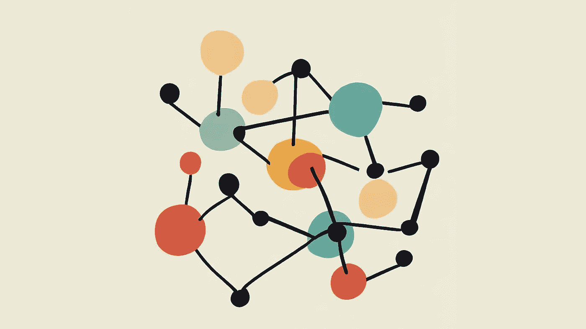
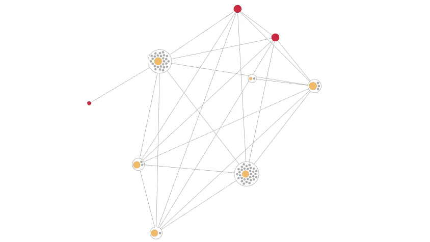

# 实体解析实现的复杂性

> 原文：[`towardsdatascience.com/the-complexities-of-entity-resolution-implementation-a2284e54171?source=collection_archive---------11-----------------------#2023-08-14`](https://towardsdatascience.com/the-complexities-of-entity-resolution-implementation-a2284e54171?source=collection_archive---------11-----------------------#2023-08-14)

## 关于数据匹配时一些典型挑战的实用示例

[](https://medium.com/@stefan.berkner?source=post_page-----a2284e54171--------------------------------)[](https://towardsdatascience.com/?source=post_page-----a2284e54171--------------------------------) [Stefan Berkner](https://medium.com/@stefan.berkner?source=post_page-----a2284e54171--------------------------------)

·

[关注](https://medium.com/m/signin?actionUrl=https%3A%2F%2Fmedium.com%2F_%2Fsubscribe%2Fuser%2F704fdfc8efaa&operation=register&redirect=https%3A%2F%2Ftowardsdatascience.com%2Fthe-complexities-of-entity-resolution-implementation-a2284e54171&user=Stefan+Berkner&userId=704fdfc8efaa&source=post_page-704fdfc8efaa----a2284e54171---------------------post_header-----------) 发布于 [Towards Data Science](https://towardsdatascience.com/?source=post_page-----a2284e54171--------------------------------) ·11 min read·2023 年 8 月 14 日[](https://medium.com/m/signin?actionUrl=https%3A%2F%2Fmedium.com%2F_%2Fvote%2Ftowards-data-science%2Fa2284e54171&operation=register&redirect=https%3A%2F%2Ftowardsdatascience.com%2Fthe-complexities-of-entity-resolution-implementation-a2284e54171&user=Stefan+Berkner&userId=704fdfc8efaa&source=-----a2284e54171---------------------clap_footer-----------)

--

[](https://medium.com/m/signin?actionUrl=https%3A%2F%2Fmedium.com%2F_%2Fbookmark%2Fp%2Fa2284e54171&operation=register&redirect=https%3A%2F%2Ftowardsdatascience.com%2Fthe-complexities-of-entity-resolution-implementation-a2284e54171&source=-----a2284e54171---------------------bookmark_footer-----------)

实体的艺术表现（图像由作者提供）

实体解析是确定数据集中两个或更多记录是否指向同一现实世界实体的过程，通常是一个人或公司。乍一看，实体解析可能看起来是一个相对简单的任务：例如，给出一个人的两张照片，即使是小孩也可以以相当高的准确率确定是否显示的是同一个人。计算机也是如此：比较包含姓名、地址、电子邮件等属性的两个记录是很容易做到的。然而，越深入探讨这个主题，挑战越大：需要评估各种匹配算法，处理数百万或数十亿条记录意味着平方复杂度，更不用说实时和数据删除的使用案例了。

## 模糊文本匹配

让我们开始比较著名艺术家 Vincent Van Gogh 的两个记录——还是 Van Gough？


第二条记录中有一些错误（除了出生在一个世纪之后和一个电子邮件地址）：名字拼写错误，出生日期混淆，邮政编码缺失，电子邮件地址略有不同。

那么我们如何比较这些值呢？如果，假设姓名相同，那么对这些值进行简单的字符串比较就足够了。由于情况并非如此，我们需要一些更先进的模糊匹配方法。文本基础的模糊匹配有许多不同的算法，大致可以分为三组。语音算法关注文本发音的相似性。最著名的算法是 Soundex 和 Metaphone，这些算法主要用于英语文本，但也有适用于其他语言的变体，如适用于德语的 Kölner Phonetik（科隆语音）。文本距离算法通常定义了将一个文本更改为另一个文本需要改变多少个字符。Levenshtein 和 Hamming 距离是这一组中两个知名的算法。相似性算法，如余弦相似性或 Jaccard 指数，计算文本的结构相似性，并通常以百分比表示相似性。

出于本文的目的，我们将使用一种非常简单的方法，仅对姓名使用 Levenshtein 距离，对城市进行等值比较。此示例及所有后续示例将使用 golang 作为编程语言，并尽可能使用现有库。将其转换为 Python、Java 或任何其他语言应该是微不足道的。此外，它仅对姓名属性进行匹配。添加更多属性或使其可配置不是本文的目的。

```py
package main

import (
    "fmt"

    "github.com/hbollon/go-edlib"
)

type Record struct {
    ID int
    Name string
    City string
}

func matches(a, b Record) bool {
    distance := edlib.LevenshteinDistance(a.Name, b.Name)
    return distance <= 3 && a.City == b.City
}

func main() {
    a := Record{
        Name: "Vincent Van Gogh",
        City: "Paris",
    }
    b := Record{
        Name: "Vince Van Gough",
        City: "Paris",
    }
    if matches(a, b) {
        fmt.Printf("%s and %s are probably the same person\n", a.Name, b.Name)
    } else {
        fmt.Printf("%s and %s are probably not the same person\n", a.Name, b.Name)
    }
}
```

在 Go Playground 中尝试：[`go.dev/play/p/IJtanpXEdyu`](https://go.dev/play/p/IJtanpXEdyu)

两个名字之间的 Levenshtein 距离为 3。原因是有三个额外的字符（名字中的“en”和姓氏中的“u”）。注意，这适用于这个特定输入。然而，距离仍然远未完美。例如，“Joe Smith”和“Amy Smith”之间的 Levenshtein 距离也是三，但显然不是同一个人。结合距离算法和语音算法可能解决这个问题，但超出了本文的范围。

使用基于规则的方法而不是基于机器学习的方法时，选择能够为你的用例提供最佳结果的算法是商业成功的关键方面。这是你应该花费大部分时间的地方。不幸的是，正如我们现在将发现的那样，如果你决定自己开发实体解析引擎，还有很多其他事情会让你分心，妨碍你优化这些规则。

## 天真的实体解析

既然我们知道了如何比较两个记录，我们需要找到所有匹配的记录。最简单的方法是将每条记录与所有其他记录进行比较。为了这个例子，我们使用随机选择的名字和城市。对于名字，我们强制引入最多三个错误（将任何字符替换为 x）。

```py
var firstNames = [...]string{"Wade", "Dave", "Seth", "Ivan", "Riley", "Gilbert", "Jorge", "Dan", "Brian", "Roberto", "Daisy", "Deborah", "Isabel", "Stella", "Debra", "Berverly", "Vera", "Angela", "Lucy", "Lauren"}
var lastNames = [...]string{"Smith", "Jones", "Williams", "Brown", "Taylor"}

func randomName() string {
    fn := firstNames[rand.Intn(len(firstNames))]
    ln := lastNames[rand.Intn(len(lastNames))]
    name := []byte(fmt.Sprintf("%s %s", fn, ln))
    errors := rand.Intn(4)
    for i := 0; i < errors; i++ {
        name[rand.Intn(len(name))] = 'x'
    }
    return string(name)
}

var cities = [...]string{"Paris", "Berlin", "New York", "Amsterdam", "Shanghai", "San Francisco", "Sydney", "Cape Town", "Brasilia", "Cairo"}

func randomCity() string {
    return cities[rand.Intn(len(cities))]
}

func loadRecords(n int) []Record {
    records := make([]Record, n)
    for i := 0; i < n; i++ {
        records[i] = Record{
            ID:   i,
            Name: randomName(),
            City: randomCity(),
        }
    }
    return records
}

func compare(records []Record) (comparisons, matchCount int) {
    for _, a := range records {
        for _, b := range records {
            if a == b {
                continue // don't compare with itself
            }
            comparisons++
            if matches(a, b) {
                fmt.Printf("%s and %s are probably the same person\n", a.Name, b.Name)
                matchCount++
            }
        }
    }
    return comparisons, matchCount
}

func main() {
    records := loadRecords(100)
    comparisons, matchCount := compare(records)

    fmt.Printf("made %d comparisons and found %d matches\n", comparisons, matchCount)
}
```

在 Go Playground 中尝试：[`go.dev/play/p/ky80W_hk4S3`](https://go.dev/play/p/ky80W_hk4S3)

你应该看到一些类似这样的输出（如果没有匹配的随机数据，你可能需要运行多次）：

```py
Daisy Williams and Dave Williams are probably the same person
Deborax Browx and Debra Brown are probably the same person
Riley Brown and RxxeyxBrown are probably the same person
Dan Willxams and Dave Williams are probably the same person
made 9900 comparisons and found 16 matches
```

如果你运气好的话，你也会得到像“Daisy”和“Dave”这样的不匹配。这是因为我们使用了三的 Levenshtein 距离，而对于短名字来说，这个值太高了。欢迎你自己改进这个方法。

性能方面，真正的问题在于需要进行 9,900 次比较才能得到结果，因为输入量的增加会大约使所需的比较次数增加四倍。200 条记录需要 39,800 次比较。对于仅有 100,000 条记录的小数据量，这意味着需要近 100 亿次比较。不管你的系统多么强大，数据量增加到一定程度时，系统将无法在可接受的时间内完成。

一个快速但几乎无用的优化是不要将每个组合比较两次。A 与 B 或 B 与 A 的比较结果应无差别。然而，这只能将所需比较次数减少一半，由于二次增长，这种减少微不足道。

## 通过阻塞减少复杂性

如果我们查看创建的规则，会很容易发现，如果城市不同，我们将永远不会有匹配。所有这些比较都是完全浪费的，应该被避免。将你怀疑相似的记录放入一个公共桶，将其他记录放入另一个桶，在实体解析中称为阻塞。由于我们希望使用城市作为阻塞键，因此实现起来相当简单。

```py
func block(records []Record) map[string][]Record {
    blocks := map[string][]Record{}
    for _, record := range records {
        blocks[record.City] = append(blocks[record.City], record)
    }
    return blocks
}

func main() {
    records := loadRecords(100)
    blocks := block(records)
    comparisons := 0
    matchCount := 0
    for _, blockRecords := range blocks {
        c, m := compare(blockRecords)
        comparisons += c
        matchCount += m
    }

    fmt.Printf("made %d comparisons and found %d matches\n", comparisons, matchCount)
}
```

在 Go Playground 中尝试: [`go.dev/play/p/1z_j0nhX-tU`](https://go.dev/play/p/1z_j0nhX-tU)

结果现在将是相同的，但比较次数仅为之前的十分之一，因为我们有十个不同的城市。在实际应用中，由于城市的方差更大，这一效果会更为显著。此外，每个块可以独立处理，例如，在相同或不同的服务器上并行处理。

找到合适的阻塞键本身可能是一个挑战。使用像城市这样的属性可能会导致不均匀的分布，从而导致某些巨大块（例如大城市）所需的时间比其他块要长得多。或者城市中包含一个微小的拼写错误，从而不再被视为有效匹配。使用多个属性和/或使用语音键或 [q-grams](https://en.wikipedia.org/wiki/N-gram) 作为阻塞键可以解决这些问题，但会增加软件的复杂性。

## 从匹配到实体

到目前为止，我们只能说记录是否匹配。对于非常基本的用例，这可能已经足够。然而，大多数情况下，你会想知道属于同一实体的所有匹配。这可能从简单的星形模式（例如 A 与 B、C 和 D 匹配），到链式模式（例如 A 与 B 匹配，B 与 C 匹配，C 与 D 匹配），再到非常复杂的图形模式。这种所谓的传递记录链接可以使用连通组件算法轻松实现，只要所有数据都适合在单台服务器的内存中。再次强调，在现实世界的应用中，这会更具挑战性。

```py
func compare(records []Record) (comparisons int, edges [][2]int) {
    for _, a := range records {
        for _, b := range records {
            if a == b {
                continue // don't compare with itself
            }
            comparisons++
            if matches(a, b) {
                edges = append(edges, [2]int{a.ID, b.ID})
            }
        }
    }
    return comparisons, edges
}

func connectedComponents(edges [][2]int) [][]int {
    components := map[int][]int{}
    nextIdx := 0
    idx := map[int]int{}

    for _, edge := range edges {
        a := edge[0]
        b := edge[1]
        aIdx, aOk := idx[a]
        bIdx, bOk := idx[b]
        switch {
        case aOk && bOk && aIdx == bIdx: // in same component
            continue
        case aOk && bOk && aIdx != bIdx: // merge two components
            components[nextIdx] = append(components[aIdx], components[bIdx]...)
            delete(components, aIdx)
            delete(components, bIdx)
            for _, x := range components[nextIdx] {
                idx[x] = nextIdx
            }
            nextIdx++
        case aOk && !bOk: // add b to component of a
            idx[b] = aIdx
            components[aIdx] = append(components[aIdx], b)
        case bOk && !aOk: // add a to component of b
            idx[a] = bIdx
            components[bIdx] = append(components[bIdx], a)
        default: // create new component with a and b
            idx[a] = nextIdx
            idx[b] = nextIdx
            components[nextIdx] = []int{a, b}
            nextIdx++
        }
    }

    cc := make([][]int, len(components))
    i := 0
    for k := range components {
        cc[i] = components[k]
        i++
    }
    return cc
}

func main() {
    records := loadRecords(100)
    blocks := block(records)
    comparisons := 0
    edges := [][2]int{}
    for _, blockRecords := range blocks {
        c, e := compare(blockRecords)
        comparisons += c
        edges = append(edges, e...)
    }
    cc := connectedComponents(edges)

    fmt.Printf("made %d comparisons and found %d matches and %d entities\n", comparisons, len(edges), len(cc))
    for _, component := range cc {
        names := make([]string, len(component))
        for i, id := range component {
            names[i] = records[id].Name
        }
        fmt.Printf("found the following entity: %s from %s\n", strings.Join(names, ", "), records[component[0]].City)
    }
}
```

在 Go Playground 中尝试: [`go.dev/play/p/vP3tzlzJ2LN`](https://go.dev/play/p/vP3tzlzJ2LN)

连通组件函数遍历所有边，创建新的组件、将新 id 添加到现有组件中，或将两个组件合并为一个。结果看起来大致如下：

```py
made 1052 comparisons and found 6 matches and 2 entities
found the following entity: Ivan Smxth, Ixan Smith, Ivax Smitx from Cairo
found the following entity: Brxan Williams, Brian Williams from Cape Town
```

保留这些边缘给我们带来了一些优势。我们可以利用它们使结果实体易于理解和解释，理想情况下，还能提供一个漂亮的用户界面，展示实体的记录是如何连接的。或者在使用实时实体解析系统时，我们可以利用这些边缘来拆分实体，特别是在数据被移除时。或者你可以在构建 [图神经网络 (GNN)](https://en.wikipedia.org/wiki/Graph_neural_network) 时使用它们，从而获得比仅仅记录本身更好的机器学习结果。



实体的可视化表示（图像由作者提供）

边缘的一个问题可能会出现在有大量非常相似的记录时。例如，如果 A 与 B 匹配，B 与 C 匹配，那么 C 也可能与 A 匹配，具体取决于使用的规则。如果 D、E、F 等也与现有记录匹配，那么我们将回到平方增长的问题，很快会出现大量边缘，导致无法处理。

还记得我们如何构建阻塞桶吗？惊喜！对于非常相似的数据，最终都集中在几个巨大的桶中，计算性能会急剧下降——即使你遵循了之前创建多个属性桶的建议。

这种非相同重复项的典型例子是某人在同一家商店定期订购，但使用的是访客访问（抱歉，没有漂亮的客户 ID）。那个人可能几乎总是使用相同的送货地址，并且大多数情况下能够正确地写出自己的名字。因此，这些记录应该以特殊方式处理，以确保系统性能的稳定，但这是一个 [单独的话题](https://www.youtube.com/watch?v=HjafHL068XM)。

在你对获得的知识感到过于自满并想开始实施自己的解决方案之前，让我迅速打破你的幻想。我们还没有谈到实时处理这些问题的挑战。即使你认为不需要始终保持最新的实体（这是明显的好处），实时方法仍然提供了额外的价值：你不需要一遍又一遍地进行相同的计算，只需对新数据进行计算。另一方面，实施起来复杂得多。想做阻塞吗？将新记录与所属桶的所有记录进行比较，但这可能需要一段时间，并且可以被视为增量批处理。直到最终完成之前，还有大量新记录等待处理。想使用连通组件计算实体？当然，将整个图保存在内存中并只添加新的边。但是不要忘记跟踪由于新记录而刚刚合并在一起的两个实体。

所以，你仍然愿意自己实施这个方案。你做出了（在这种情况下）明智的决定，即不存储边缘并且不支持实时处理。于是你成功地运行了第一次实体解析批处理作业，处理了所有数据。这花了一段时间，但你每月只需执行一次，所以没问题。可能就在这个时候，你看到数据保护官从拐角处跑来，告诉你因 GDPR 投诉而需要从数据集中删除那个人。所以你为了一个被删除的实体重新运行了整个批处理作业——太棒了。

## 结论

进行实体解析乍一看可能相当简单，但它包含了许多重要的技术挑战。这些挑战中的一些可以被简化和/或忽略，但其他的则需要解决以获得良好的性能。

*最初发表于* [*https://tilores.io*](https://tilores.io/content/The-Complexities-of-Entity-Resolution-Implementation)*。*
