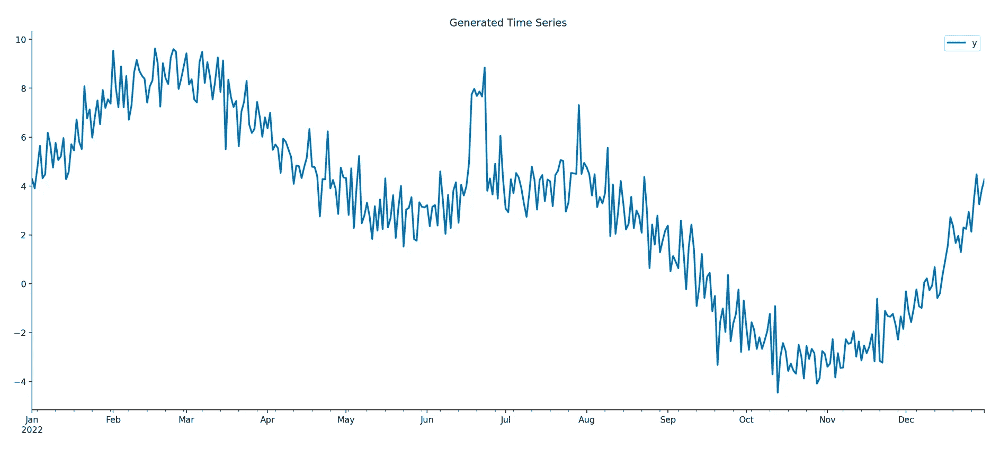
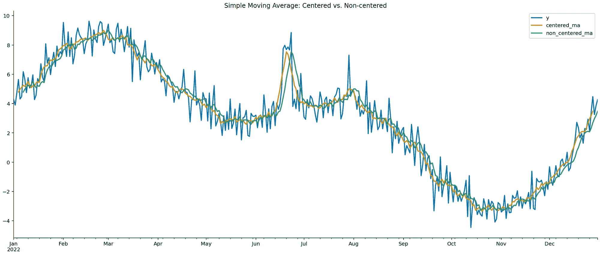
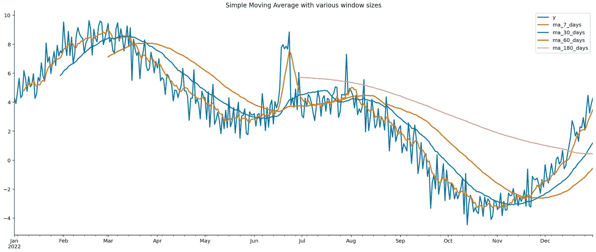
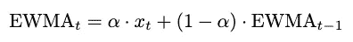
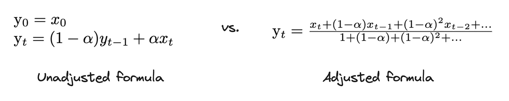
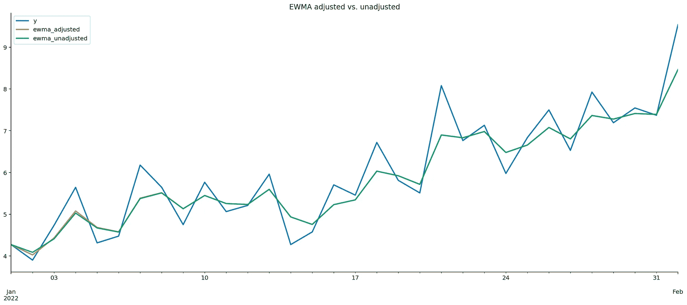
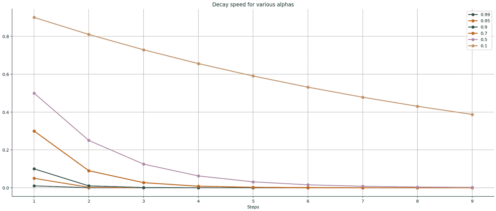
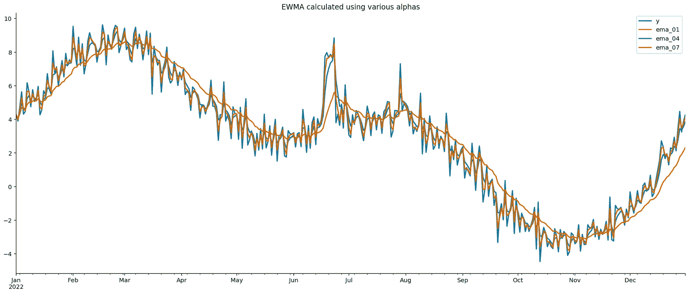
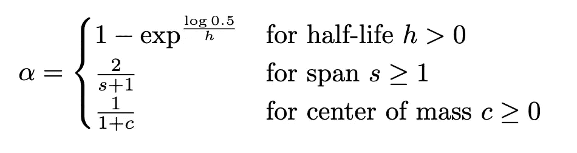
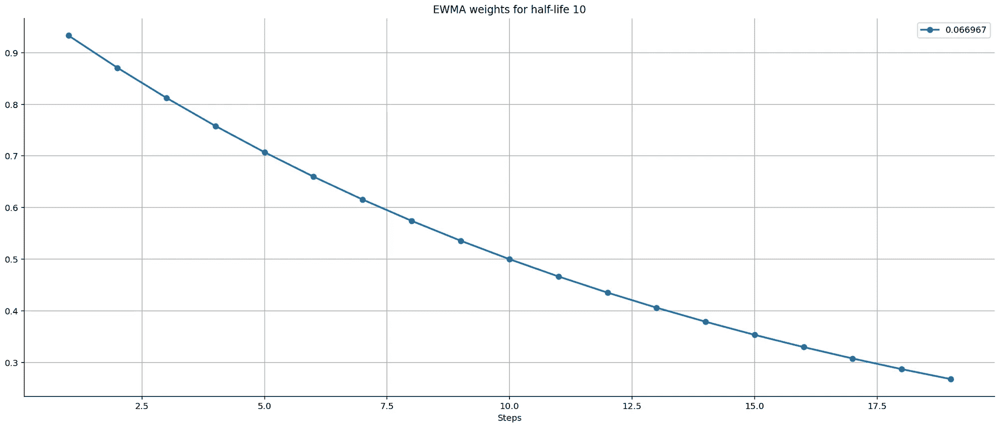

# 时间序列分析中的移动平均综合指南

> 原文：[`towardsdatascience.com/the-comprehensive-guide-to-moving-averages-in-time-series-analysis-3fb2baa749a`](https://towardsdatascience.com/the-comprehensive-guide-to-moving-averages-in-time-series-analysis-3fb2baa749a)

图片由 Midjourney 创建

## 探索简单移动平均和指数加权移动平均的细微差别

 [Eryk Lewinson](https://eryk-lewinson.medium.com/?source=post_page-----3fb2baa749a--------------------------------)

·发表于 [Towards Data Science](https://towardsdatascience.com/?source=post_page-----3fb2baa749a--------------------------------) ·阅读时间 9 分钟·2023 年 10 月 30 日

--

移动平均是时间序列分析中的一种基本工具，广泛用于各种目的。在时间序列分析中，移动平均的一些最受欢迎的应用包括：

+   **噪声减少：** 移动平均有效地过滤掉时间序列数据中的随机波动和噪声。使用移动平均平滑数据有助于分析师关注潜在的模式，而不是短期波动，从而帮助他们识别有意义的趋势。

+   **季节性分解：** 将时间序列数据分解为其组成部分通常涉及使用移动平均。 季节性分解 技术利用移动平均从数据中提取季节性模式。此外，移动平均还可以帮助识别时间序列数据中的周期性成分，表示那些不完全是季节性的重复模式。

+   **预测：** 移动平均是各种预测模型的基本组成部分。

+   **过滤异常值：** 移动平均可以用于识别和过滤时间序列数据中的异常值。那些显著偏离移动平均的异常数据点可能被认为是异常值，并需进一步调查。

+   **可视化平滑：** 在绘制时间序列数据时，移动平均通常被用来创建更平滑、更清晰的可视化效果。这可以使向更广泛的受众传达趋势和模式变得更容易。

这些应用展示了移动平均在时间序列分析中的多样性。根据时间序列数据的具体目标和特征，我们可能会选择不同类型的移动平均和参数。虽然移动平均的概念看似简单，但可用的参数和选项可能会让人感到困惑。因此，在本文中，我们将详细探讨它们。

# 简单移动平均与指数加权移动平均

移动平均（MA）和指数加权移动平均（EWMA）是最受欢迎的两种移动平均类型。它们的关键区别在于对数据点分配权重的方式。

MA 计算固定数量最近数据点的平均值，赋予它们相等的权重。这意味着窗口中的所有数据点对移动平均数有相同的影响，较旧的数据点与最新的数据点同样重要。

另一方面，EWMA 是一种加权移动平均，它对随着时间推移变得越来越远的数据点赋予指数递减的权重。因此，较新的数据点接收更高的权重，使其在计算移动平均时更具影响力。这种方法使 EWMA 对数据的近期变化更加敏感，特别适合于跟踪短期趋势和快速响应时间序列中的变化。

# 设置和数据

我们从导入库开始。

接下来，我们生成具有以下特征的合成时间序列数据：

+   一年期的每日观察数据

+   时间序列中存在重复模式（季节性）

+   缺乏任何潜在的趋势

+   在 6 月 18 日至 6 月 23 日之间出现的显著峰值

+   最终步骤引入随机噪声

# 简单移动平均

在使用*简单移动平均*时，我们通常关注两个参数：窗口的大小以及窗口是否居中。

居中和无中心移动平均的区别在于移动平均相对于其计算的数据点的位置。

在**中心移动平均**中，平均值是对以感兴趣的数据点为中心的数据点窗口进行计算的。通常，窗口中使用的是奇数个数据点。例如，使用中心 3 天移动平均时，平均值是基于当前天和前一天及后一天计算的。

在**无中心移动平均**中，平均值是对向前移动的时间窗口的数据点进行计算，但窗口并不以感兴趣的数据点为中心。例如，要计算第*t*天的 3 天无中心移动平均，我们会取第*t-2*天、第*t-1*天和第*t*天的平均值。

在以下代码片段中，我们使用中心和无中心方法计算 7 天移动平均。

我们可以清楚地看到这两种方法之间的差异，特别是在 6 月的峰值周围。

对于中心化的 MA，平滑曲线中的峰值和谷值与数据中对应峰值和谷值的中点更为一致。

未中心化的 MA 滞后于数据点，这意味着它跟随数据的一般趋势，但对短期波动的反应不如快速。因此，移动平均曲线中的峰值和谷值在时间上相对于数据中的峰值和谷值有所偏移。

在接下来的片段中，我们生成了使用不同窗口大小的移动平均。从下图中可以观察到的一般模式是，窗口大小越大，移动平均对短期波动的敏感性越低。窗口大小较大的曲线更加平滑，并倾向于过滤短期噪声，突显出长期趋势。

最后需要记住的是，默认情况下，我们需要 X 个观测值来创建 X 期的移动平均。这就是为什么 180 天的移动平均仅在年中开始的原因。我们可以通过使用`rolling`方法中的`min_periods`参数来调整这一行为。

# 指数加权移动平均

如前所述，EWMA 为数据点分配指数递减的权重，给予近期观测值更多的权重，对较早的观测值则较少。这使得 EWMA 相比于简单移动平均对数据中的近期变化更为敏感。

使用平滑参数 alpha 的指数加权移动平均（EWMA）的公式通常以以下递归表示形式表达：

其中 x_t 是时间*t*的值，α是平滑因子，它控制在移动平均中最近观测值的权重。

在我们深入探讨选择平滑参数的各种方法之前，让我们澄清一个常见的混淆来源：调整公式与未调整公式。这一选择由`ewm`方法中的`adjust`参数决定。以下是供您参考的两种公式。

调整的目的是通过在初始时期除以衰减平滑因子来解决相对权重的不平衡问题。

*数学细节：* 在调整公式中，分母表示几何级数。因此，假设时间序列无限长，两种公式将得出相同的结果，即未调整值。*

为了说明实际差异，我们使用相同的平滑参数创建了两个 EWMA 线。区别在于公式中应用的调整。此外，我们将重点放在第一个月，因为那里的差异最为明显，尽管非常微小。

作为下一步，让我们深入探讨 alpha 值与计算移动平均时权重衰减速度之间的关系。为了计算随后的权重，我们使用源自调整版 EWMA 的公式。

在图表中，我们观察到较小的 alpha 导致权重衰减更慢。当 alpha 取其极端值 0.99 时，EWMA 实质上依赖于最新的数据点而忽略较旧的数据点。

接下来，让我们使用三个不同的 alpha 值：0.1、0.4 和 0.7 来可视化 EWMA 曲线。

我们可以观察到先前识别的模式在实际应用中的表现：**alpha** 越高，曲线对最近数据点的响应就越强。这种行为发生是因为更高的 alpha 值对近期观察值赋予了更大的权重，导致曲线紧随数据波动。相反，较低的 alpha 值对历史观察值赋予更多权重，结果是曲线变得更平滑，但滞后于数据的波动。

在使用指数加权移动平均时，选择负责指数衰减的参数会增加复杂性。虽然我们已经讨论了 alpha 参数，但它并不是唯一的选项。下面，我们描述了剩余的三个参数，并提供了选择正确值的一些直觉：

+   Half-life (`halflife`) — Half-life 实质上是衰减量减少到其初始值一半所需的时间。较小的 half-life 使最近的观察更具影响力，从而使 EWMA 对短期变化更为敏感。相反，较大的 half-life 对较旧的数据赋予更多的权重，导致 EWMA 更平滑且变化较慢。

+   Span (`span`) — Span 表示有效的窗口大小或在 EWMA 计算中考虑的周期数。换句话说，它表示有多少过去的观察值对平滑过程有贡献。较大的 span 包含更多的历史数据，导致 EWMA 更平滑且变化较慢。相反，较小的 span 更关注最近的数据，使其对短期变化更为敏感。

+   Center of Mass (`com`) — 类似于 span，center of mass 参数定义了 span 内的相对位置。它指示了加权函数质量的主要分布位置。center of mass 为 0.5 相当于 span 的中点，给予两侧观察值相等的权重。调整 center of mass 允许我们将加权偏向于近期或较旧的数据点。较小的 `com` 将质量中心移向当前，强调近期数据并增加对短期波动的敏感性。另一方面，较大的 `com` 将质量中心移向过去，导致 EWMA 更平滑且变化较慢。

以下公式展示了这三种替代参数与平滑因子 alpha 之间的关系。

为了更好地理解这个概念，让我们考虑一个处理季度数据的场景。在我们的指数加权移动平均中，我们希望纳入过去一年的数据。为此，我们选择了一个对应 alpha 值为 0.4 的跨度 4。下表展示了一些示例值。

最后，让我们看看半衰期参数。我们已经提到，它对应于一个量被减少到其初始值一半的时间周期数。考虑一个半衰期为 10 的情况，这对应于 alpha = 0.066967。如果我们使用该 alpha 计算以下权重，我们可以清楚地看到第 10 次观测的权重等于 0.5，正如我们预期的那样。

# 总结

+   移动平均在时间序列分析中有多种用途，如噪声减少、季节性分解、预测、异常值过滤和创建更平滑的可视化。

+   简单移动平均将远期和近期的观测值赋予相等的权重。

+   相比之下，指数加权移动平均通过赋予近期数据更高的权重来更快速地响应最新数据。我们可以通过以下参数之一来微调平滑程度：平滑因子（alpha）、半衰期、跨度或质心。

你可以在[这里](https://deepnote.com/workspace/eryks-sandbox-c1f480c2-5a18-4fd6-9cf4-e147f5297b3f/project/Medium-Articles-0fb8b8c3-20f4-42b6-8571-a2968c4d72c2/notebook/moving_averages_explained-7abbcf70cbda4652980f66fa836e4349)找到本文中使用的代码。像往常一样，任何建设性的反馈都非常欢迎。你可以通过[LinkedIn](https://www.linkedin.com/in/eryklewinson/)、[Twitter](https://twitter.com/erykml1) 或评论联系我。

*喜欢这篇文章？成为 Medium 会员，继续通过阅读无限制地学习。如果你使用* [*这个链接*](https://eryk-lewinson.medium.com/membership) *成为会员，你将支持我而不会额外增加你的成本。提前感谢，期待再见！*

你也可能对以下内容感兴趣：

 ## 时间序列预测中的交互项全面指南

### 了解如何通过使线性模型对趋势变化更灵活来提高其拟合度

towardsdatascience.com  ## 解锁线性回归中交互项的威力

### 了解如何通过包含交互项使你的线性模型更加灵活

towardsdatascience.com  ## 指标层：所有 KPI 定义的单一真实来源

### 了解为什么实施指标层将使在组织中获取数据驱动的洞察更加稳健！

towardsdatascience.com

# 进一步阅读

+   [`gregorygundersen.com/blog/2022/05/17/exponential-decay/`](https://gregorygundersen.com/blog/2022/05/17/exponential-decay/)

+   [`gregorygundersen.com/blog/2022/06/04/moving-averages/`](https://gregorygundersen.com/blog/2022/06/04/moving-averages/)

+   [`pandas.pydata.org/docs/user_guide/window.html#window-exponentially-weighted`](https://pandas.pydata.org/docs/user_guide/window.html#window-exponentially-weighted)

所有图片，除非另有说明，均为作者（以及可能的一些人工智能）提供。
