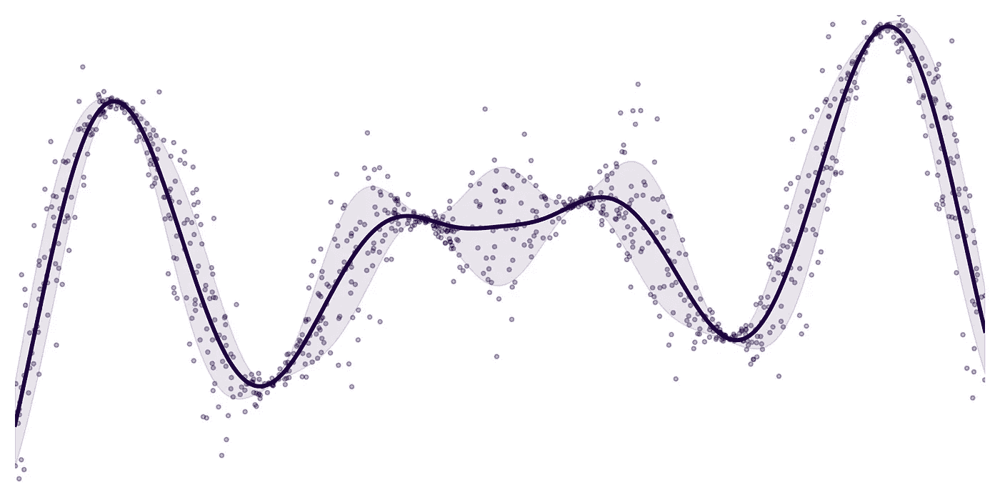
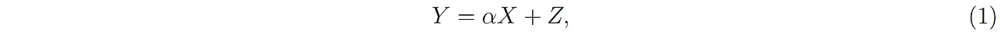
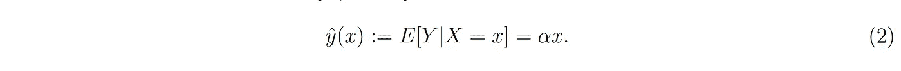
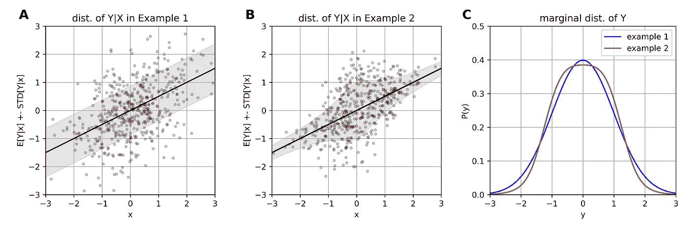
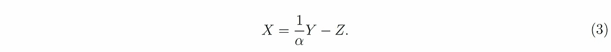
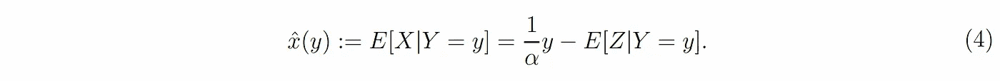
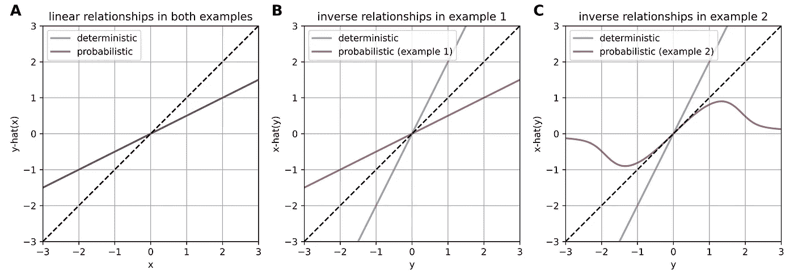
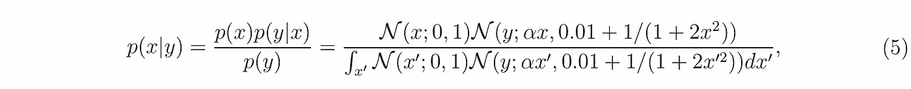
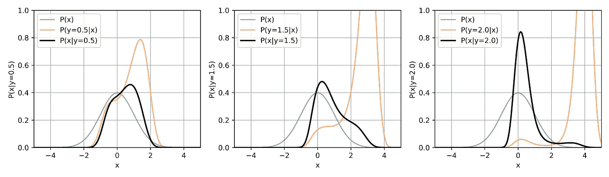
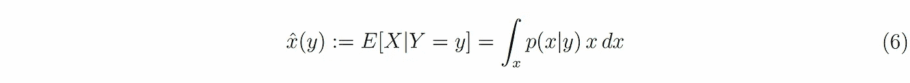

# 概率关系的反直观性质

> 原文：[`towardsdatascience.com/the-counter-intuitive-nature-of-probabilistic-relationships-2589bdd2a763?source=collection_archive---------13-----------------------#2023-07-21`](https://towardsdatascience.com/the-counter-intuitive-nature-of-probabilistic-relationships-2589bdd2a763?source=collection_archive---------13-----------------------#2023-07-21)

## 如果 *y* 可以被估计为 x 的线性函数，并不意味着 x 也可以被估计为 y 的线性函数

 [Alireza Modirshanechi](https://a-modirshanechi.medium.com/?source=post_page-----2589bdd2a763--------------------------------)

·

[关注](https://medium.com/m/signin?actionUrl=https%3A%2F%2Fmedium.com%2F_%2Fsubscribe%2Fuser%2F6a535debb95&operation=register&redirect=https%3A%2F%2Ftowardsdatascience.com%2Fthe-counter-intuitive-nature-of-probabilistic-relationships-2589bdd2a763&user=Alireza+Modirshanechi&userId=6a535debb95&source=post_page-6a535debb95----2589bdd2a763---------------------post_header-----------) 发表在 [Towards Data Science](https://towardsdatascience.com/?source=post_page-----2589bdd2a763--------------------------------) · 10 分钟阅读 · 2023 年 7 月 21 日 

--

一个概率关系的示例（与图 1A-B 中的可视化风格相同）—— 作者提供的图像

考虑两个实值变量 *x* 和 *y*，例如，父亲的身高和儿子的身高。统计学中[回归分析](https://en.wikipedia.org/wiki/Regression_analysis)的核心问题是通过已知 *x* 来预测 *y*，例如，根据父亲的身高预测儿子的身高¹。

[*线性*回归](https://en.wikipedia.org/wiki/Linear_regression)的想法是使用*x*的线性函数作为对*y*的猜测。正式地，这意味着将*ŷ(x) = α₁x + α₀*作为我们的猜测，并通过最小化[y](https://en.wikipedia.org/wiki/Mean_squared_error)和*ŷ*之间的均方误差来找到*α₀*和*α₁*。现在，假设我们使用一个巨大的数据集并找到*α₀*和*α₁*的最佳值，这样我们就知道了如何根据*x*找到*y*的最佳估计。那么我们如何利用这些最佳的*α₀*和*α₁*来根据*y*找到关于*x*的猜测*x̂(y)*呢？例如，如果我们总是能根据父亲的身高来猜测儿子的身高，那么我们可以根据儿子的身高猜测父亲的身高吗？

这些问题是“我们如何使用*ŷ(x)*来找出*x̂(y)*？”的特殊情况。虽然这听起来可能很简单，但这个问题实际上非常难以解决。在本文中，我研究了*ŷ(x)*和*x̂(y)*在确定性和概率性环境下的联系，并表明我们对*ŷ(x)*和*x̂(y)*在确定性环境下的关系的直觉不能推广到概率性环境中。

# 问题的正式表述

## 确定性环境

所谓确定性环境，我指的是（i）没有随机性和（ii）每个*x*的值总是对应于相同的*y*的值。正式地，在这些环境中，我写作*y = f(x)*，其中*f: R → R*是某个函数。在这种情况下，*x*以完全确定的方式决定*y*（即，没有随机性或噪声），*ŷ(x)*的最佳选择是*f(x)*本身。例如，如果一个儿子的身高总是其父亲身高的 1.05 倍（暂时忽略这个例子的不可行性！），那么我们对儿子身高的最佳猜测就是将父亲的身高乘以 1.05。

如果*f*是一个可逆函数，那么*x̂(y)*的最佳选择等于*f*的逆。在上面的例子中，这意味着对父亲身高的最佳猜测总是儿子身高除以 1.05。因此，确定性情况下*ŷ(x)*和*x̂(y)*之间的联系是直接的，可以简化为找到函数*f*及其逆。

## 概率性环境

在概率性环境中，*x*和*y*是随机变量*X*和*Y*的样本。在这种情况下，单个*x*的值可以对应多个*y*的值，为了最小化均方误差，*ŷ(x)*的最佳选择是条件期望*E[Y|X=x]*—见脚注²。用更容易理解的话来说，这意味着如果你训练一个非常有表现力的[神经网络](https://en.wikipedia.org/wiki/Artificial_neural_network)来预测给定*x*的*y*（使用一个足够大的数据集），那么你的网络将会收敛到*E[Y|X=x]*。

类似地，*x̂(y)* 的最佳选择是 *E[X|Y=y] —* 如果你训练你的表达能力强的网络来预测 *x* 给定 *y*，那么它原则上会收敛到 *E[X|Y=y]*。因此，在概率设置中，*ŷ(x)* 如何与 *x̂(y)* 相关的问题可以重新表述为条件期望 *E[Y|X=x]* 和 *E[X|Y=y]* 之间的关系。

## 本文的目标

为了简化问题，我专注于**线性**关系，即 *ŷ(x)* 在 *x* 上是线性的。线性确定性关系具有线性逆，即 *y = αx*（对于某个 *α≠0*）意味着 *x = βy* 且 *β = 1/α* — 见脚注³。与确定性关系 *y = αx* 类似的概率线性关系为

**公式 1**

其中 *Z* 是一个附加的随机变量，通常称为“噪声”或“误差项”，其条件平均值假定为零，即 *E[Z|X=x] = 0* 对所有 *x* 都成立；注意，我们并不总是假设 *Z* 与 *X* 是独立的。利用**公式 1**，给定 *X=x* 的 *Y* 的条件期望为（见脚注⁴）

**公式 2**

**公式 2** 说明条件期望 *ŷ(x)* 在 *x* 上是线性的，因此可以看作是线性确定性关系 *y = αx* 的概率对应。

在本文剩余部分，我将提出两个问题：

1.  **公式 2** 是否意味着 *x̂(y) := E[X|Y=y] = βy* 对某个 *β≠0*？换句话说，**公式 2** 中的线性关系是否有线性逆？

1.  如果确实存在 *x̂(y) = βy*，那么我们可以像在确定性情况下那样写 *β = 1/α* 吗？

我使用了两个反例，表明尽管听起来有些反直觉，但两个问题的答案都是否定的！

# 示例 1：当 β 不是 α 的逆时

作为第一个例子，考虑线性回归问题的最典型设置，总结为以下三个假设（除了**公式 1**；见**图 1A**进行可视化）：

1.  误差项 *Z* 与 *X* 独立。

1.  *X* 服从均值为零、方差为 1 的高斯分布。

1.  *Z* 服从均值为零、方差为 *σ²* 的高斯分布。

**图 1\. 可视化示例 1 和示例 2。** 面板 **A** 和 **B** 可视化了示例 1 (A；α = 0.5，固定 σ² = 3/4) 和示例 2 (B；α = 0.5，σ² 依赖于 x) 的 *Y* 在给定 X 条件下的分布。给定随机变量 X 的一个值，随机变量 Y 在这两个示例中都服从高斯分布：黑色线条显示条件期望 E[Y|X=x]，阴影区域显示高斯分布的标准差。点显示了 (X, Y) 的 500 个联合分布样本。面板 **C** 显示了 Y 的边际分布（X 服从标准正态分布），示例 1 (蓝色) 和示例 2 (红色)：示例 1 中 Y 的边际分布是均值为零、方差为 *α² + σ²* 的高斯分布，但我们只能数值评估示例 2 中 Y 的边际分布。

经过几行代数计算，很容易证明，这些假设意味着 *Y* 服从均值为零、方差为 *α² + σ²* 的高斯分布。此外，这些假设还意味着 *X* 和 *Y* 是联合高斯分布，均值为零，协方差矩阵等于

由于我们拥有 *X* 和 *Y* 的完整联合分布，我们可以推导它们的条件期望（见脚注⁵）：

因此，给定我们第一个示例的假设，**方程 2** 具有形式为 *x̂(y) = βy* 的线性逆，但 *β* 不等于其确定性对应的 *1/α* ——除非我们有 *σ = 0*，这 ***等同于*** 确定性情况！

这一结果表明，我们对确定性线性关系的直觉不能推广到概率线性关系。为了更清楚地看到这一结果所暗示的真正疯狂程度，让我们首先考虑 *α = 0.5* 的确定性情况 (*σ = 0*；**图 2A 和 2B** 中的蓝色曲线)：

这意味着，给定一个 *x* 值，*y* 的值是 *x* 的一半；给定一个 *y* 值，*x* 的值是 *y* 的两倍，这看起来是直观的。重要的是，我们总是有 *x < y*。现在，让我们再次考虑 *α = 0.5*，但这次 *σ² = 3/4*（**图 2A 和 2B** 中的红色曲线）。这种噪声方差的选择意味着 *β = α = 0.5*，结果是

这意味着，给定一个 *x* 值，我们对 *y* 的估计是 *x* 的一半；然而，给定一个 *y* 值，我们对 *x* 的估计也是 *y* 的一半！奇怪的是，我们总是有 *x̂(y) < y* **和** *ŷ(x) < x* ——如果变量是确定性的，这将是不可能的。看似反直觉的是，**方程 1** 可以重写为

**方程 3**

然而，这只能意味着（与 **方程 2** 相对）

**方程 4**

问题在于，虽然我们设计时有*E[Z|X=x]=0*，但我们不能对*E[Z|Y=y]*及其对*y*的依赖性做出任何说明！换句话说，使得*x̂(y)*与*y/α*不同的是观察值*y*还包含关于误差*Z*的信息，例如，如果我们观察到一个非常大的*y*值，则意味着很可能误差*Z*也具有一个较大的值，这应在估计*X*时考虑进去。

**图 2\. 示例 1 和示例 2 中的线性关系及其逆关系。** 面板**A**展示了在示例 1 和示例 2 的概率设置下*ŷ(x)*与 x 之间的线性关系（红色；α = 0.5）和 y 与 x 之间的等效确定性关系（蓝色）；注意*ŷ(x)*作为函数 x 在两个示例中是相同的。面板**B**和**C**展示了在示例 1（面板**B**中的红色；固定σ² = 3/4）和示例 2（面板**C**中的红色；σ² 依赖于 x）的概率设置下*x̂(y)*与 y 之间的逆关系。蓝线显示了参考的等效确定性关系的逆关系。在所有面板中，虚线黑色显示了 y=x 线。

这是对看似矛盾的陈述的简单解释，例如“高个子父亲的儿子（平均而言）也很高，但没有父亲那么高，同时，高个子的儿子有（平均而言）高个子父亲，但没有儿子那么高”！

**总结**，我们的示例 1 显示，即使概率线性关系*ŷ(x) = αx*具有形式为*x̂(y) = βy*的线性逆关系，斜率*β*也***不一定***等于其确定性对等物*1/α*。

# 示例 2：当*x̂(y) 是* 非线性时

只有当**方程 4**中的*E[Z|Y=y]*也是*y*的线性函数时，形式为*x̂(y) = βy*的逆关系才是可能的。在第二个示例中，我对示例 1 进行了一些小修改，以打破这一条件！

特别地，我假设误差项*Z*的方差依赖于随机变量*X*——与示例 1 中的假设 1 相对。正式地，我假设（除了**方程 1**；有关可视化见**图 1B**）：

1.  *X*服从均值为零、方差为 1 的高斯分布（与示例 1 中的假设 2 相同）。

1.  给定*X=x*，误差*Z*服从均值为零、方差为*σ² = 0.01 + 1/(1 + 2x²)*的高斯分布。

这些假设实际上意味着，给定*X=x*，随机变量*Y*服从均值为*αx*、方差为*0.01 + 1/(1 + 2x²)* 的高斯分布（见**图 1B**）。与示例 1 中*X*和*Y*的联合分布是高斯分布不同，示例 2 中*X*和*Y*的联合分布没有优雅的形式（见**图 1C**）。然而，我们仍然可以使用贝叶斯规则，找到给定*Y=y*的*X=x*的相对复杂的条件密度（见**图 3**获取一些数值评估的示例）：

**方程 5**

其中曲线 *N* 表示高斯分布的概率密度。

**图 3** **. 示例 2 中给定 Y=y 的 X 的条件分布**。先验分布 p(x)（蓝色曲线）、似然 p(y|x)（橙色曲线）和后验分布 p(x|y)（黑色曲线；使用 **方程 5** 进行数值评估），从左到右，y = 0.5、1.5 和 2（假设所有情况下 α = 0.5）。

我们可以使用数值方法来评估条件期望

**方程 6**

对于给定的 *y* 和 *α*，**图 2C** 显示了 *x̂(y)* 随 *y* 变化的函数，当 *α = 0.5* 时。尽管听起来可能违反直觉，但这种反向关系是高度非线性的——这是由于 **图 1B** 中显示的 *x* 依赖的误差方差所致。这表明，即使 *y* 可以很好地作为 *x* 的线性函数进行估计，并不意味着 *x* 也可以很好地作为 *y* 的线性函数进行估计。这是因为 **方程 4** 中的 *E[Z|Y=y]* 在我们超出类似于示例 1 的标准假设时，可能会对 *y* 产生任何奇怪的函数依赖。

**总结**，我们的示例 2 显示了概率线性关系 *ŷ(x) = αx* 并***不***一定具有 *x̂(y) = βy* 的线性逆关系。重要的是，*x̂(y)* 和 *y* 之间的反向关系依赖于误差项 *Z* 的特性。

# 结论

在我们的教育过程中，我们中的大多数人对确定性关系建立了丰富的直觉——基于我们在微积分、分析等领域看到的所有有趣结果。然而，至关重要的是要认识到这种直觉的局限性，并且在考虑概率关系时**不能**信任这种直觉。特别是，示例 1 和 2 表明，即使是极其简单的概率关系也可能违背我们的直觉。

# 致谢

我感谢 [Johanni Brea](https://scholar.google.ch/citations?user=nZ0m0xUAAAAJ&hl=de)、Mohammad Tinati、Martin Barry、[Guillaume Bellec](http://guillaume.bellec.eu/)、[Flavio Martinelli](https://scholar.google.com/citations?user=DabSKBgAAAAJ&hl=en) 和 Ariane Delrocq 对本文内容的有益讨论和宝贵反馈。

# 代码：

所有用于分析的代码（使用 [Julia](https://julialang.org/) 语言）可以在 [这里](https://github.com/modirshanechi/medium_notes/blob/master/MediumRandomNotes/notebooks/Probabilistic%20Linear%20Relation.ipynb) 找到。

# 脚注：

¹ 有兴趣的读者可以在“父亲的身高如何影响儿子的身高”中查看这个问题的易懂处理。

² 详见维基百科上的 “[最小均方误差](https://en.wikipedia.org/wiki/Minimum_mean_square_error)” 页面。

在不失一般性的情况下，我们总是假设 *x* 和 *y* 的平均值为零。因此，在父亲和儿子的身高示例中，*x* 和 *y* 表示它们的身高与父亲和儿子的平均身高之间的**差异**。

**方程 1** 和 **方程 2** 之间的关系是可逆的，即，如果 **方程 2** 是 *X* 和 *Y* 的唯一约束，那么我们总是可以将 *Y* 表示为 **方程 1** 中的形式，且存在一个满足 *E[Z|X=x] = 0* 的随机变量 *Z*。

请参阅维基百科上的 [‘多元正态分布’](https://en.wikipedia.org/wiki/Multivariate_normal_distribution) 页中的“二元条件期望”部分。
