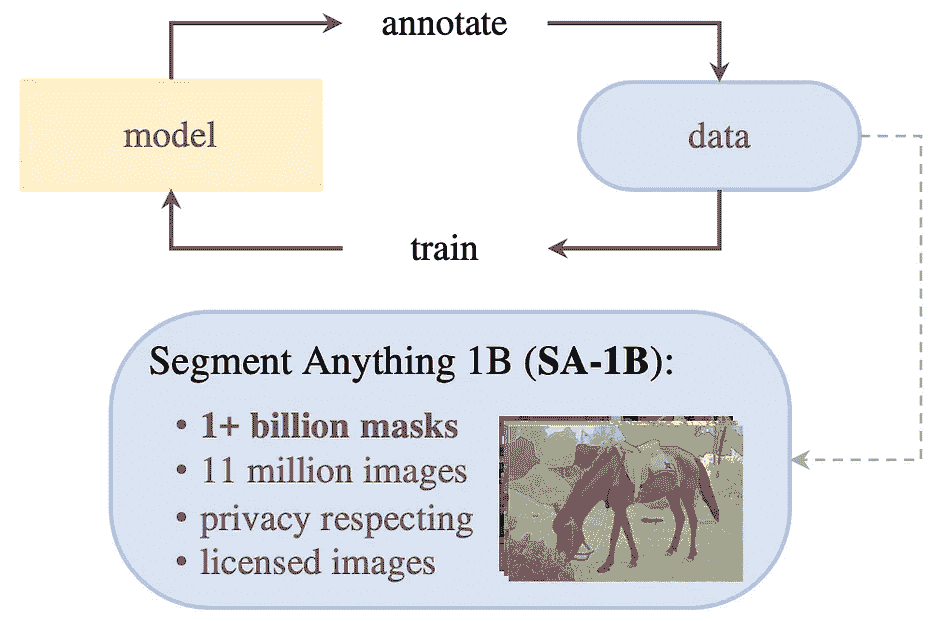
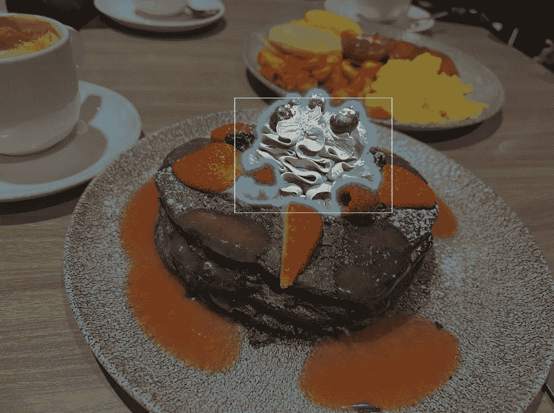
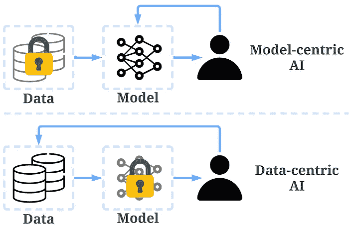
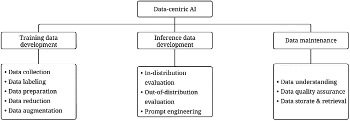
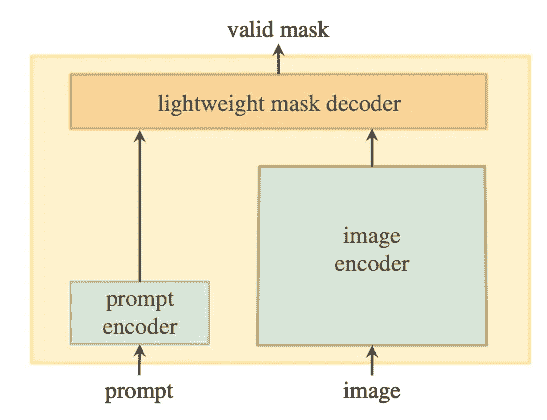

# “Segment Anything”中的以数据为中心的人工智能概念

> 原文：[`towardsdatascience.com/the-data-centric-ai-concepts-in-segment-anything-8eea556ac9d`](https://towardsdatascience.com/the-data-centric-ai-concepts-in-segment-anything-8eea556ac9d)

## 解读“Segment Anything”中使用的以数据为中心的人工智能概念，这是第一个用于图像分割的基础模型

 [Henry Lai](https://medium.com/@a0987284901?source=post_page-----8eea556ac9d--------------------------------)

·发布于 [Towards Data Science](https://towardsdatascience.com/?source=post_page-----8eea556ac9d--------------------------------) ·阅读时长 7 分钟·2023 年 5 月 31 日

--

Segment Anything 数据集构建。图片来源于论文 [`arxiv.org/pdf/2304.02643.pdf`](https://arxiv.org/pdf/2304.02643.pdf)

人工智能 (AI) 已经取得了显著进展，特别是在开发基础模型方面，这些模型经过大量数据的训练，能够适应广泛的下游任务。

基础模型的一个显著成功是 [大语言模型 (LLMs)](https://medium.com/towards-data-science/what-are-the-data-centric-ai-concepts-behind-gpt-models-a590071bb727)。这些模型可以高精度地执行复杂任务，如语言翻译、文本摘要和问答。

基础模型也开始改变计算机视觉领域的游戏规则。Meta 的“Segment Anything”是最近出现的一个引起轰动的发展。

“Segment Anything”的成功可以归因于其庞大的标注数据集，这在实现其卓越性能方面发挥了至关重要的作用。如 [Segment Anything 论文](https://arxiv.org/pdf/2304.02643.pdf) 中所述，模型架构出乎意料地简单且轻量。

在这篇文章中，借鉴我们最近的调查论文 [1,2] 中的见解，我们将通过 [以数据为中心的人工智能](https://github.com/daochenzha/data-centric-AI) 的视角更深入地探讨“Segment Anything”。

## “Segment Anything”可以做什么？

简而言之，图像分割任务是预测一个掩码来分离图像中的感兴趣区域，例如物体、人物等。分割是计算机视觉中非常重要的任务，使图像更有意义，更易于分析。

Segment Anything 和其他图像分割方法的区别在于引入了提示来指定分割位置。提示可以是模糊的，例如一个点，一个框等。

这张图片是从 [`segment-anything.com/`](https://segment-anything.com/) 截取的，图片由作者上传。

## 什么是数据中心的人工智能？

数据中心人工智能与模型中心人工智能的比较。 [`arxiv.org/abs/2301.04819`](https://arxiv.org/abs/2301.04819) 图片由作者提供。

[数据中心的人工智能](https://github.com/daochenzha/data-centric-AI)是一种新颖的人工智能系统开发方法，近年来受到关注，并由人工智能先驱**安德鲁·吴**推广。

> *数据中心的人工智能是系统性地工程化用于构建人工智能系统的数据的学科。 — 安德鲁·吴*

之前，我们的主要关注点是使用变化不大的数据来开发更好的模型，这被称为模型中心的人工智能。然而，这种方法在现实世界场景中可能存在问题，因为它未能考虑数据中可能出现的问题，包括不准确的标签、重复数据和偏见。因此，过拟合数据集可能不会导致模型行为的改善。

另一方面，数据中心的人工智能优先考虑提高用于创建人工智能系统的数据的质量和数量。重点放在数据本身，相对固定的模型。采用数据中心方法开发人工智能系统在现实世界应用中更具前景，因为模型的最大能力是由用于训练的数据决定的。

区分“数据中心”和“数据驱动”方法至关重要。“数据驱动”方法仅依赖于数据来引导人工智能开发，但重点仍然在于创建模型，而不是工程化数据，因此与“数据中心”方法根本不同。

[数据中心人工智能框架](https://github.com/daochenzha/data-centric-AI) 包括三个主要目标：

+   **训练数据开发** 涉及收集和生成高质量、多样化的数据，以促进机器学习模型的训练。

+   **推理数据开发** 涉及构建创新的评估集，通过工程化的数据输入（如提示工程）为模型提供详细的洞察，或解锁模型的特定能力。

+   **数据维护** 旨在确保在不断变化的环境中数据的质量和可靠性。

数据中心人工智能框架。 [`arxiv.org/abs/2303.10158`](https://arxiv.org/abs/2303.10158)。图片由作者提供。

## 在 Segment Anything 中使用的模型

Segment Anything 模型。 图片来自论文 [`arxiv.org/pdf/2304.02643.pdf`](https://arxiv.org/pdf/2304.02643.pdf)

模型设计令人惊讶地简单。该模型主要由三部分组成：

1.  **提示编码器：** 这一部分用于获取提示的表示，可以通过位置编码或卷积来实现。

1.  **图像编码器：** 这一部分直接使用了 Vision Transformer (ViT)，没有任何特殊修改。

1.  **轻量级掩码解码器：** 这一部分主要融合了提示嵌入和图像嵌入，使用了如注意力机制等方法。之所以称其为轻量级，是因为它只有少量的层。

轻量级掩码解码器非常有趣，因为它允许模型即使仅使用 CPU 也能轻松部署。以下是 Segment Anything 的作者提供的评论。

> 令人惊讶的是，我们发现一个简单的设计满足了所有三个约束条件：一个强大的图像编码器计算图像嵌入，一个提示编码器嵌入提示，然后这两个信息源在一个轻量级掩码解码器中结合，以预测分割掩码。

因此，Segment Anything 强大性能的秘密很可能不在于模型设计，因为它非常简单且轻量化。

## Segment Anything 中的数据驱动 AI 概念

训练 Segment Anything 的核心在于一个包含超过十亿个掩码的大型标注数据集，这比现有的分割数据集大了 400 倍。他们是如何做到的呢？作者们使用了一个数据引擎来执行标注，这可以大致分为三个步骤：

1.  **辅助手动标注：** 这一步可以理解为一种主动学习过程。首先，在公共数据集上训练初始模型。接下来，标注者修改预测的掩码。最后，使用新标注的数据训练模型。这三个步骤重复了六次，最终生成了 430 万条掩码标注。

1.  **半自动标注：** 这一步的目标是增加掩码的多样性，这也可以理解为一种主动学习过程。简单来说，如果模型能够自动生成良好的掩码，那么人工标注者就不需要再标注这些掩码，人工可以集中在模型不够自信的掩码上。用来找出自信掩码的方法非常有趣，涉及对第一步掩码进行目标检测。例如，假设图像中有 20 个可能的掩码。我们首先使用当前模型进行分割，但这可能只会标注出部分掩码，有些掩码标注得不够好。现在我们需要自动识别哪些掩码是好的（自信的）。本文的方法是对预测的掩码进行目标检测，看看是否能够在图像中检测到物体。如果检测到物体，我们就认为对应的掩码是自信的。假设这个过程识别出八个自信的掩码，那么标注者就可以标注剩下的 12 个，从而节省了人工努力。上述过程重复了五次，增加了另外 590 万条掩码标注。

1.  **全自动标注：** 简单来说，这一步使用在前一步中训练的模型来标注数据。为了提高标注质量，采用了一些策略，包括：

    **(1) 根据预测的交并比（IoU）值过滤掉不太自信的掩码**（模型有一个头部用于预测 IoU）。

    **(2) 仅考虑稳定的掩码**，即如果阈值稍微调高或调低 0.5，掩码基本保持不变。具体来说，对于每个像素，模型输出一个介于 0 和 1 之间的值。我们通常使用 0.5 作为阈值来决定一个像素是否被掩码。稳定性意味着，当阈值调整到接近 0.5 的某个程度（例如 0.45 到 0.55）时，相应的掩码基本保持不变，这表明模型的预测在边界的两侧有显著不同。

    **(3) 进行了去重**，使用了非极大值抑制（NMS）。

    这一步标注了 110 亿个掩码（数量增加了 100 倍以上）。

这个过程听起来是否很熟悉？没错，用于 ChatGPT 的人类反馈强化学习（RLHF）与上述过程非常相似。这两种方法的共同点在于，模型不是直接依赖人类来标注数据，而是首先通过人类输入对模型进行训练，然后再使用模型来标注数据。在 RLHF 中，训练一个奖励模型来为强化学习提供奖励，而在 Segment Anything 中，模型则是针对直接图像标注进行训练的。

## 总结

Segment Anything 的核心贡献在于其大量的标注数据，这显示了数据中心人工智能概念的关键重要性。基础模型在计算机视觉领域的成功可以被视为一个必然事件，但令人惊讶的是，这一切发生得如此之快。展望未来，我相信其他 AI 子领域，甚至非 AI 和非计算机相关领域，也会在适当的时候出现基础模型。

无论技术如何演变，提高数据的质量和数量始终是提升 AI 性能的有效途径，使得数据中心 AI 概念愈加重要。

我希望这篇文章能为你的工作提供一些灵感。你可以通过以下论文/资源了解更多关于数据中心 AI 框架的信息：

+   [数据中心人工智能：综述](https://arxiv.org/abs/2303.10158)

+   [数据中心 AI：视角与挑战](https://arxiv.org/abs/2301.04819)

+   [精彩的数据中心 AI 资源](https://github.com/daochenzha/data-centric-AI)

如果你觉得这篇文章有趣，你可能还会想查看我之前的文章：[GPT 模型背后的数据中心 AI 概念是什么？](https://medium.com/towards-data-science/what-are-the-data-centric-ai-concepts-behind-gpt-models-a590071bb727)

敬请关注！
