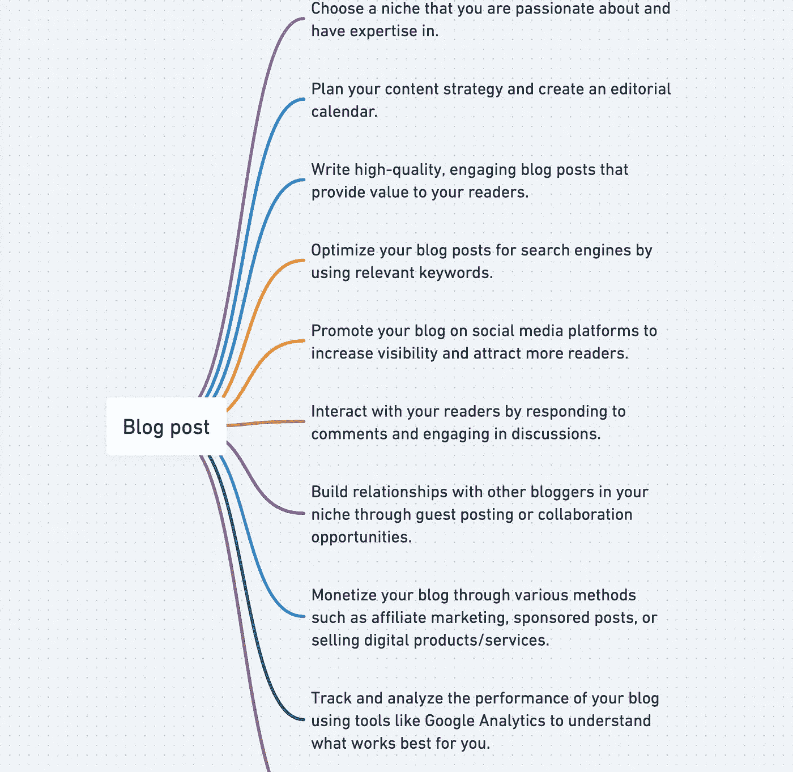
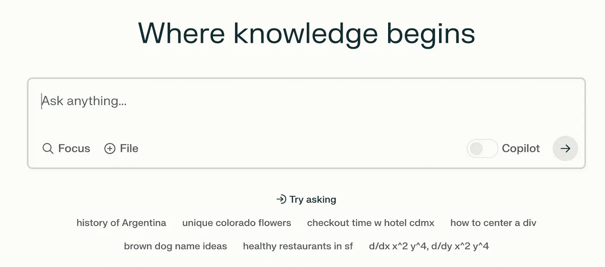

# **日常（AI）物品的设计**

> 原文：[`towardsdatascience.com/the-design-of-everyday-ai-things-26516d928566?source=collection_archive---------3-----------------------#2023-10-06`](https://towardsdatascience.com/the-design-of-everyday-ai-things-26516d928566?source=collection_archive---------3-----------------------#2023-10-06)

## 构建优秀生成式 AI 工具的 UI/UX 原则

 [Sam Stone](https://medium.com/@sjstone1987?source=post_page-----26516d928566--------------------------------)

·

[关注](https://medium.com/m/signin?actionUrl=https%3A%2F%2Fmedium.com%2F_%2Fsubscribe%2Fuser%2Fcbfd810ae7b5&operation=register&redirect=https%3A%2F%2Ftowardsdatascience.com%2Fthe-design-of-everyday-ai-things-26516d928566&user=Sam+Stone&userId=cbfd810ae7b5&source=post_page-cbfd810ae7b5----26516d928566---------------------post_header-----------) 发表在 [Towards Data Science](https://towardsdatascience.com/?source=post_page-----26516d928566--------------------------------) ·10 min 阅读·2023 年 10 月 6 日

--

图片来源：DreamStudio

唐·诺曼 1988 年的设计经典《**日常物品的设计**》阐述了用户体验原则，这些原则至今影响着卓越的硬件和软件设计。尽管诺曼举了门把手和电灯开关等类比例子，他的原则广泛适用于软件，包括生成式 AI 产品。在关于生成式 AI 的炒作中，很容易忘记即使是最先进模型驱动的产品，如果缺乏良好的 UI/UX，也会失败。

许多新的 AI 工具引起了大量兴趣，但随后用户留存表现平平（[Sequoia 在这里详细说明](https://www.sequoiacap.com/article/generative-ai-act-two/)）。AI 噱头驱动了“游客”注册，但新用户很难理解或从产品中获得真正的价值。这就是经典的“幻灭低谷”，当核心技术（生成模型）领先时，而支持技术（UI/UX 设计）滞后。

本文详细说明了如何将三个核心用户体验（UX）概念应用于生成式 AI 产品：**1) 可供性，2) 反馈，和 3) 约束。** 将这些概念应用于生成式 AI 可以得出一些结论，我们将探讨，包括：

+   不要追求一击即中

+   用户反馈不是免费的

+   对聊天机器人界面保持怀疑态度

以下示例来自于工作场所生产力工具（部分灵感来源于我在 Tome（一个 AI 驱动的思想塑造与分享平台）工作中的经验），但这些策略广泛适用，从开发工具到社交媒体再到电子商务。

# 主题 1: 反馈

向用户快速、清晰地反馈请求的操作对于任何技术都是至关重要的。对于生成式 AI 系统来说，反馈尤其重要，因为其输出具有延迟性和复杂性。反馈是双向的。系统必须从用户那里获取相关的反馈，而不至于让人厌烦，以便在短期内生成更好的输出，并在中长期内促成更好的产品版本。

## 以延迟为基础进行构建

生成式 AI 模型的响应时间通常在个位到十几秒之间。乍一看，等待十秒钟以获得一个引人注目的备忘录、一幅精彩的图像或一段美丽的视频似乎不是什么问题。没有生成式 AI 时，这些操作需要数小时——无论是 10 秒、1 秒还是 100 毫秒，谁在乎呢？

但用户并不是在优化机会成本的经济学家。他们已经习惯了非 AI 工具，以至于期望软件的速度快到被认为是即时的。这导致了一些用户在面对显然不即时的 AI 产品时遇到的挑战：

1.  对系统是否正常工作以及是否需要重试/重新启动的困惑。

1.  高感知迭代成本。而且由于 AI 生成的第一个结果通常不是用户想要的，用户往往需要进行迭代。

1.  用户开始多任务处理的可能性很高。一旦用户切换离开你的应用程序，就没有保证他们会再回来。

有一些减少延迟效果的良好策略早于生成式 AI 之前就已经存在。这些包括加载动画、进度条和后台处理（用户被引导去执行其他任务，并在当前任务完成时收到通知）。一种较新的策略，特定于 LLM 功能，是逐字（或逐字符）将文本流式传输到用户界面，而不是一次性渲染完整输出。由于许多模型生成单词的速度比用户阅读的速度快，这可以将感知的延迟降低到接近零。

## 不要追求一杆进洞

减少延迟的一个特别有效的策略是将工作流程分解成小步骤，在每一步提供系统反馈并征求用户反馈。这使用户能够以越来越大的信心朝着输出前进，确信系统将准确地提供用户所需的内容。在设计良好的迭代工作流程中，初始步骤的延迟较低——用户对最终输出会逐步增加信任。如果你对获得所需的工件非常有信心，那么你*会*愿意等待十秒钟来完成最后一步。

迭代工作流程比提高延迟容忍度还有一个更强大的好处：它们使用户能够生成更符合预期的输出。生成模型有时可以从简单的用户提示中生成用户所需的内容。直接从输入到“完美”最终输出的过程是一个惊人的用户体验；这就像一杆进洞。就像一杆进洞一样，这种情况非常少见。

挑战不在于模型“聪明”到什么程度，而在于模型需要什么上下文和信息来实现用户的愿景。考虑一个希望总结其团队季度表现的销售经理。她见过数十份季度销售报告，并且对公司规范（如语气、细节水平、长度和视觉布局）非常熟悉。如果她需要同事为她撰写这样的报告，她会简单地要求“季度销售报告”，并期望同事已经了解这些规范。

所以当这位销售经理希望从 AI 工具中获得这样的报告时，她不清楚需要告诉工具什么规范，以及工具已经知道了什么。这时，迭代工作流程特别有用。她可以从一些简单且熟悉的内容开始，比如请求“季度销售报告”，然后工具可以帮助她准确地确定她的具体要求。Zach Lloyd 在[这篇关于 AI 设计的合理文章](https://thezbook.com/ask-adjust-the-future-of-productivity-interfaces)中称这种模式为“提问和调整”。

Tome 的大纲编辑器是一个迭代人工智能工作流中的中间步骤的示例，位于提示和最终输出（一个多页演示文稿）之间。[`tome.page`](https://tome.page)

## 用户反馈不是免费的

在许多经典的机器学习产品中，每一次用户交互都会生成一条新的训练数据，从而改善产品的下一版本。每一次用户点击搜索结果都有助于改进搜索模型。每一封用户标记为垃圾邮件的邮件都有助于改进垃圾邮件分类模型。

但许多生成性人工智能产品缺乏固有的“物理”特性，即用户交互会机械地导致模型改进。对于输出是复杂文本、图像等的人工智能产品，很难区分挫败的退出（即用户未能获得他们想要的输出而退出）与满意的退出（即用户获得了他们想要的内容而离开）。一些产品会征求用户的自愿反馈（例如点赞/点踩），但完成率往往非常低，并且反馈本身经常存在选择偏差。

设计一个工作流，其中用户的自然下一步行动可以表明他们对前一个人工智能输出的感知，这要好得多。一种模式，在文本模型中最常见，是内联建议：如果用户接受建议并继续写作，那就是一个强烈的信号，表明他们对建议持积极态度。另一种模式是记录哪些人工智能输出被保存、编辑或共享。这些与用户满意度并不完全相关——用户可能会因为图像特别怪异而分享它——但在整体使用中，它们是不错的代理指标。

# 主题 2：可用性

可用性是一个提示（通常是视觉的），它建议如何以及何时使用某个功能。良好的可用性使用户能够直观地与产品互动，而无需 extensive instructions or experience。我们将探索生成性人工智能在用户旅程中的三个步骤的可用性：发现人工智能的切入点、提供正确的输入给人工智能，以及使用人工智能的输出。

## 发现人工智能切入点

许多工作工具正在添加大量的人工智能功能，这些功能在创作过程中的不同点都适用。使用人工智能功能的高级切入点包括：

1.  从头开始帮我

1.  扩展我所开始的

1.  编辑我所创建的内容

这些不同的切入点导致了显著不同的界面，甚至在人工智能界面发展的早期阶段就已经如此。对于（1），自由文本或“空白画布”界面已经成为早期的主流范式。对于（2），内联生成（也称为自动完成）往往主导文本生成功能（如 Github Copilot），而“给我更多类似的”则主导图像生成功能（如 Midjourney）。对于（3），界面往往集中于高亮、选择或上传现有内容（如 Grammarly）。

Whimsical 的 AI 思维导图帮助用户从头开始。 [`whimsical.com`](https://whimsical.com)

对于已经发现一个 AI 入口点的用户而言，他们可能会轻易得出“这就是 AI 所在之处”的结论，而忽视其他功能。优秀的产品通过在用户工作流中最可能有用的时刻向用户介绍各种 AI 入口点来减少这一问题。

## 输入 AI 信息

许多生成性 AI 工作流的核心输入是自由文本输入，也称为“提示”。不幸的是，好的提示是复杂的、快速发展的，并且在工具之间不一致。好的产品帮助用户通过示例提示和工具提示来构建提示策略。

Perplexity 在其主页上包含了一些示例提示，以说明超出典型搜索引擎的使用案例。 [`www.perplexity.ai/`](https://www.perplexity.ai/)

好的界面还帮助用户理解 AI 所拥有的上下文——以及它所缺乏的。当使用强大的 AI 时，合理的用户可能会得出结论，无论他们在应用中看到什么，AI 也必须能够看到和理解。例如，如果我能看到与 AI 的过去对话，AI 肯定也必须知道这一点（这是 ChatGPT 普及的行为）。但并非所有 AI 都如此工作！一些系统了解用户之前的提示，有些甚至了解比过去提示更多的上下文——而有些则只了解用户当前的交互和其他任何信息。用户不应通过反复试验来弄清楚系统知道什么和不知道什么。

## 使用 AI 输出

当系统生成了优秀的 AI 输出时，我们很容易认为成功已经到手。但即使输出表现良好，对于用户来说，这可能也是一个令人困惑的时刻。

首先，新用户经常不知道如何保存输出。即使输出很不错，许多用户仍然希望进行迭代，看看是否能从好变得更好。但害怕丢失现有工作可能会导致犹豫和挫折感。

其次，用户可能会困惑于*如何*改进输出。假设他们使用了“从头开始”的 AI 功能，他们是否应该回到最开始？他们是否需要转到不同的 AI 入口点，如“扩展”或“编辑”？许多用户可能遇到过像 ChatGPT 这样的产品，其中输出不是直接可编辑的；如果输出是可编辑的，用户可能需要一个编辑工具。

# 主题 3：约束

约束限制输入和输出，以帮助用户更快更好地工作。好的约束对用户来说是明确的。如果系统可以帮助用户实现目标——但仅仅是部分实现或部分时间——那么最好完全阻止这条路径，而不是提供一个不可靠的体验。

大型语言模型开辟了广阔的新用户体验（这就是我喜欢从事这项工作的原因！），产品创造者应热衷于放松来自确定性软件的传统约束。尽管如此，无论大型语言模型变得多么智能，总会有一些深思熟虑的约束存在的空间。

## 输入：不要害怕控制

受到 ChatGPT 成功的启发，许多生成型人工智能工具将自由文本框作为唯一或主要的用户输入。但用户的意图的许多方面通过分类或数字输入更能得到有效表达。在创建文档时，大多数用户会考虑语言（一个分类）和长度（一个数值）。用户可能不会在自由文本提示中提及这些属性，但这并不意味着他们不在意。通过离散的、有界的控制（如下拉菜单或滑块）来征询这些输入，系统帮助获取所需的输入，以提供用户脑海中的内容。对于帮助用户导航离散控制，有一些经久不衰的原则：设置良好的默认值，逻辑地分组控制，并通过工具提示或标签解释控制。

关于控制，设置良好的默认值是设计的关键部分。在绝大多数情况下（远远超过 90%），用户不会更改默认设置，即使这样做对他们有利。将良好的默认值与用户偏好的变异结合的一个机会是通过硬编码规则或人工智能动态调整默认值。

## 输出：并非所有可以生成的内容都应该生成

对于生成型人工智能产品，有许多情况是基础模型可以生成*某些*内容，但用户宁愿什么也不做，也不愿意应对误导性或刺耳的输出。

对于大多数工作相关任务，用户宁愿选择“我不知道”也不愿接受需要验证或反驳的潜在错误答案。[这项哈佛大学在咨询公司 BCG 进行的研究](https://papers.ssrn.com/sol3/papers.cfm?abstract_id=4573321)展示了当人工智能回答超出其“信心边界”的问题时，如何影响工作质量，而用户对边界并不知情，因此没有充分审查输出。

减少幻觉的方法正在迅速发展（例如，[检索增强生成](https://www.pinecone.io/learn/retrieval-augmented-generation/)），我怀疑幻觉将在几年后成为一个“解决”的问题——但今天，当事实准确性至关重要时，输出仍然是一个重要的考虑约束的地方。

法律和伦理问题是限制用户面对输出的第二个原因。仅仅因为底层模型可以生成某个主题的文本或图像，并不意味着这样做是合乎良心的。然而，许多情况下，当系统将用户请求分类为“超出范围”时，用户的意图实际上是善意的。通过一点帮助，用户可以重新表述他们的请求，以保持在范围内。例如，一些图像生成工具拒绝包含“child”一词的提示。但如果用户想生成一个有孩子的家庭的图像，他们可以提示“家庭四口”或“父母和儿子女儿”。关键在于，限制对用户来说是明确的。

随着生成式 AI 产品的流行，优秀的产品设计师和产品经理会记住：成功不仅仅源于 AI 的智能程度，还在于产品如何引导用户通过 AI 驱动的工作流程。核心设计概念如反馈、可用性和限制依然重要，但它们的实施战术和模式正在迅速演变。善用这些设计模式对任何希望超越初期炒作周期并提供持久、广泛使用产品的 AI 公司至关重要。
