# DVC 指南：所有数据科学项目的数据版本控制

> 原文：[`towardsdatascience.com/the-dvc-guide-data-version-control-for-all-your-data-science-projects-382d5b5aab00`](https://towardsdatascience.com/the-dvc-guide-data-version-control-for-all-your-data-science-projects-382d5b5aab00)

## 使数据版本控制与代码版本控制一样熟悉

[](https://ipom.medium.com/?source=post_page-----382d5b5aab00--------------------------------)[](https://towardsdatascience.com/?source=post_page-----382d5b5aab00--------------------------------) [Yash Prakash](https://ipom.medium.com/?source=post_page-----382d5b5aab00--------------------------------)

·发表于[Towards Data Science](https://towardsdatascience.com/?source=post_page-----382d5b5aab00--------------------------------) ·6 分钟阅读·2023 年 2 月 17 日

--


图片由[Dmitri Sobolevski](https://unsplash.com/@dbrenan?utm_source=medium&utm_medium=referral)提供，来源于[Unsplash](https://unsplash.com/?utm_source=medium&utm_medium=referral)

作为数据科学家，我们对不同版本的代码、模型和数据进行实验。此外，我们甚至使用像 Git 这样的版本控制系统来管理我们的代码、跟踪版本、前进和后退，并与团队分享我们的代码。

代码的版本控制很重要，因为它有助于在更大规模上重现软件。数据的版本控制之所以重要，是因为它有助于在任何时间点由团队或组织中的任何开发人员使用相似的指标开发机器学习模型。

因此，版本控制你的模型和数据至关重要。但经验丰富的软件工程师会知道，使用 Git 来存储大文件是一个大忌。

Git 不仅在处理大文件时效率低下，而且也不是存储大数据文件的标准化环境。大多数数据存储在 AWS S3 桶、Google Cloud Storage 或任何机构的远程存储服务器上。

那么我们如何对数据进行版本控制呢？这就引出了 DVC。

# 介绍 DVC

[DVC](https://dvc.org)是一个数据版本控制系统，与 Git 密切配合以跟踪我们的数据文件。它甚至有类似于 Git 的语法，所以学习起来相当容易。

让我们在这篇文章中深入了解 DVC 的一些优秀数据版本控制功能。但首先，让我们创建一个新的项目文件夹和虚拟环境，并将其作为 Python 包进行安装：

```py
$ pip install "dvc[all]"
```

或者如果你使用*Pipenv*：

```py
$ pipenv shell
$ pipenv install "dvc[all]"
```

你应该会看到如下输出：

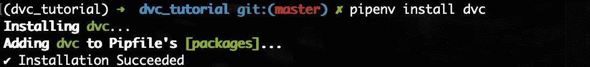

安装 DVC：图片来自作者

现在，让我们初始化一个 git 仓库。你应该会看到以下输出：

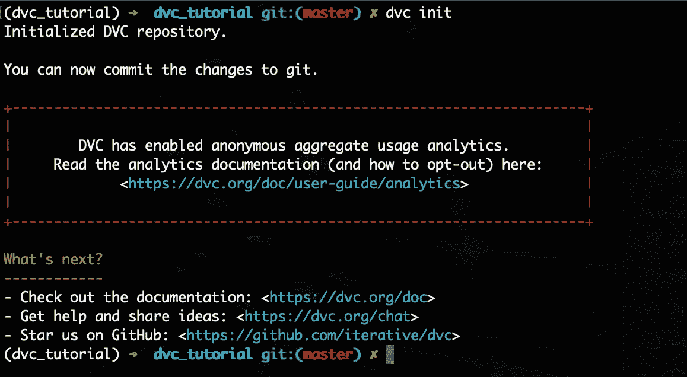

dvc init：作者提供的图像

完美！我们现在可以继续将数据添加到 DVC 中。

# 将数据添加 + 提交到 DVC

我在项目的数据文件夹中有一个数据文件，如下所示：

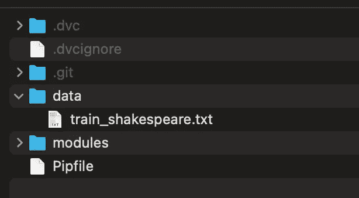

文件夹结构：作者提供的图像

要从终端运行大小检查，请使用：

```py
$ ls -lh data
```

你将看到以下输出，数据文件显示为 5.2 MB。

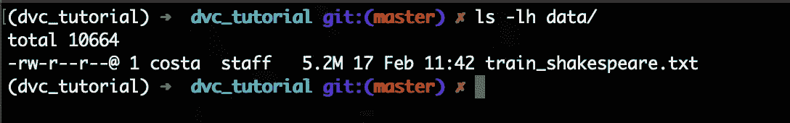

数据文件检查：作者提供的图像

现在，我们可以将这个数据文件添加到 DVC。运行：

```py
$ dvc add data/train_shakespeare.txt
```

你将看到以下输出，提示我们运行 git add 命令：

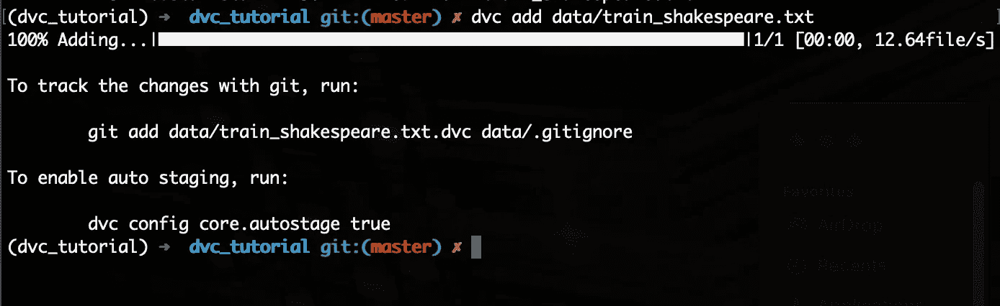

dvc 添加的数据：作者提供的图像

我们现在将运行 git add 命令：

```py
$ git add data/train_shakespeare.txt.dvc data/.gitignore
```

现在我们已经将新的 **.dvc** 文件添加到我们的 git 跟踪中，我们可以继续提交它到我们的 git：

```py
$ git commit -m "added data."
```

# 为我们的数据设置远程存储

我们可以简单地利用 Google Drive 存储我们的版本化数据集，在本教程中我们将正是这样做。

让我们在 Google Drive 中创建一个新文件夹，并查看其 URL：

https://drive.google.com/drive/u/0/folders/**cVtFRMoZKxe5iNMd-K_T50Ie**

粗体突出显示的是我们想要复制到终端的文件夹 ID，以便 DVC 可以在新创建的 Drive 文件夹中跟踪我们的数据。

让我们来做：

```py
$ dvc remote add -d storage gdrive://cVtFRMoZKxe5iNMd-K_T50Ie
```

现在是将我们的更改提交到 git 的时候了：

```py
$ git commit .dvc/config -m "Configured remote storage."
```

完美！现在我们可以将数据推送到远程存储。

```py
$ dvc push 
```

它会要求输入认证代码，或直接带你到浏览器进行认证，只需按照指示操作即可。

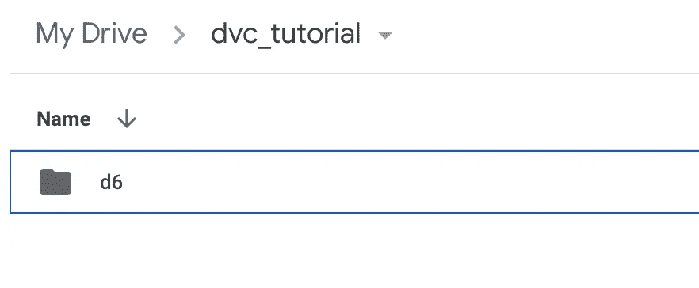

Google Drive 中的远程数据：作者提供的图像

# 拉取远程数据

如果你或你的同事想要访问远程存储的数据，可以使用 **pull** 命令完成。

但首先，让我们删除本地存储的数据及其缓存，以便我们可以从远程拉取：

```py
$ rm -f data/train_shakespeare.txt
$ rm -rf .dvc/cache
```

现在，拉取：

```py
$ dvc pull
```

你会看到拉取文件时的以下输出：

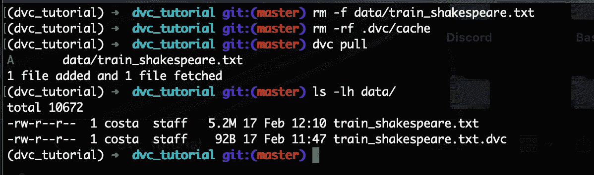

从远程拉取文件：作者提供的图像

如你所见，一旦 dvc 追踪你的数据文件，从远程存储拉取它就变得轻而易举。

# 跟踪数据的不同版本

想象一下，如果我们想跟踪同一个数据文件的新版本，我们可以轻松地将其添加到 dvc，然后再次添加到 git：

```py
$ dvc add data/train_shakespeare.txt
$ git add data/train_shakespeare.txt.dvc
```

现在，你会看到一个新的 .dvc 文件版本准备提交到我们的 git：

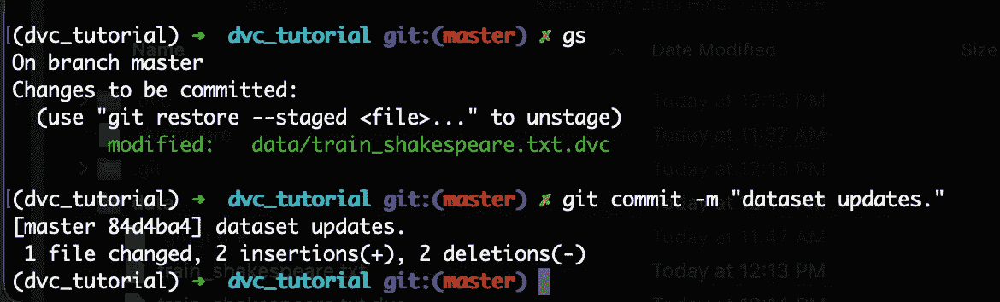

提交新的 .dvc 文件更改：作者提供的图像

提交文件。

现在，我们可以将最新的数据集推送到远程存储：

```py
$ dvc push
```

查看我们的 Google Drive，我们可以看到我们有两个版本的数据存储：

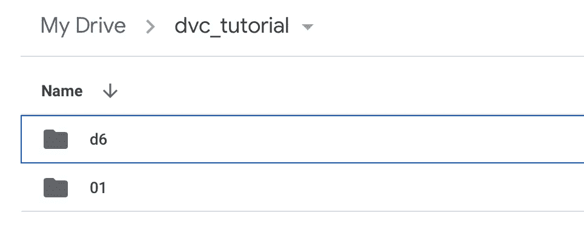

Google Drive 数据版本：作者提供的图像

# 返回到不同的数据集版本

使用 DVC，回到数据集的旧版本变得容易。

如果我们查看到目前为止项目的 git log，我们会看到我们已经将两个 **.dvc** 文件版本提交到 git：

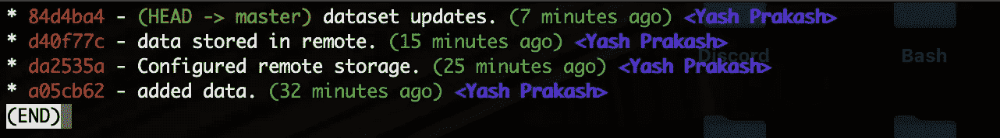

因此，我们必须返回到之前的**.dvc**文件版本，因为这是 git 正在跟踪的版本。

首先，简单地执行 Git checkout 到较旧的提交，如下所示：

```py
$ git checkout HEAT¹ data/train_shakespeare.txt.dvc 
```

第二步，进行 dvc 的 checkout：

```py
$ dvc checkout
```

你会看到以下输出。我们现在已经将数据文件恢复到之前的版本了！

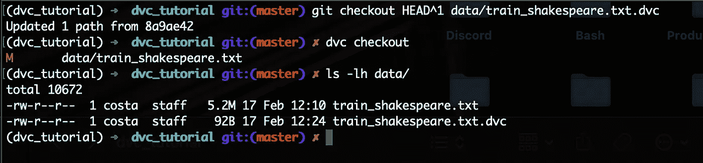

恢复数据到之前的版本：来自作者的图像

此外，如果你想保留这些数据集更改，只需再次提交到 git：

```py
$ git commit data/train_shakespeare.txt.dvc -m "reverted data changes."
```

完美！到目前为止，你已经学习了 DVC 的大部分基本数据版本控制功能。干得好！

# 最后的话…

DVC 在数据科学项目的数据版本控制中提供了巨大的帮助，希望你在阅读完这篇文章后，能对如何开始使用 DVC 有一些有用的了解。

在一些示例项目中进行实践，并探索 DVC 文档，将是提升你使用这个惊人工具的技能的最佳方法。

如果你喜欢这篇文章，每周我都会发布一篇故事，在其中分享来自数据科学和编程领域的小知识。[关注我，绝不错过！](https://ipom.medium.com) 😄

你也可以在[LinkedIn](https://www.linkedin.com/in/yashprakash13/)和[Twitter](https://twitter.com/csandyash)上与我联系。

你可能会喜欢的另外几篇文章：

[## 可重用的 Python 日志模板，适用于所有数据科学应用](https://towardsdatascience.com/the-reusable-python-logging-template-for-all-your-data-science-apps-551697c8540?source=post_page-----382d5b5aab00--------------------------------) [## 使用 Docker Compose 和 GitHub Actions 的简单 Python CI/CD 管道](https://towardsdatascience.com/the-easy-python-ci-cd-pipeline-using-docker-compose-and-github-actions-80498f47b341?source=post_page-----382d5b5aab00--------------------------------)

[## 使用 Docker Compose 和 GitHub Actions 的简单 Python CI/CD 管道](https://towardsdatascience.com/the-easy-python-ci-cd-pipeline-using-docker-compose-and-github-actions-80498f47b341?source=post_page-----382d5b5aab00--------------------------------) [## 可重用的 Python 日志模板，适用于所有数据科学应用](https://towardsdatascience.com/the-reusable-python-logging-template-for-all-your-data-science-apps-551697c8540?source=post_page-----382d5b5aab00--------------------------------)

### 在 VPS 上持续部署一个实际项目

[## 使用 Docker Compose 和 GitHub Actions 的简单 Python CI/CD 管道](https://towardsdatascience.com/the-easy-python-ci-cd-pipeline-using-docker-compose-and-github-actions-80498f47b341?source=post_page-----382d5b5aab00--------------------------------)
