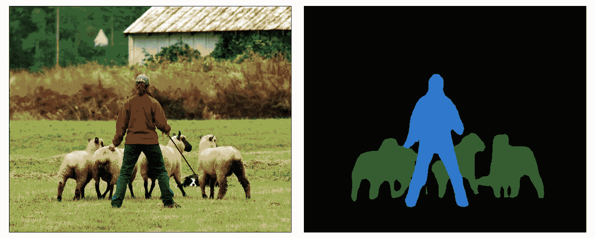

# 用一行代码构建分割模型

> 原文：[`towardsdatascience.com/the-essential-library-to-build-segmentation-models-6e17e81338e?source=collection_archive---------11-----------------------#2023-03-06`](https://towardsdatascience.com/the-essential-library-to-build-segmentation-models-6e17e81338e?source=collection_archive---------11-----------------------#2023-03-06)

## 以最快的方式构建和训练用于图像分割的神经网络模型

 [Mattia Gatti](https://mattiagatti.medium.com/?source=post_page-----6e17e81338e--------------------------------)

·

[关注](https://medium.com/m/signin?actionUrl=https%3A%2F%2Fmedium.com%2F_%2Fsubscribe%2Fuser%2F19bc376db93c&operation=register&redirect=https%3A%2F%2Ftowardsdatascience.com%2Fthe-essential-library-to-build-segmentation-models-6e17e81338e&user=Mattia+Gatti&userId=19bc376db93c&source=post_page-19bc376db93c----6e17e81338e---------------------post_header-----------) 发表在 [Towards Data Science](https://towardsdatascience.com/?source=post_page-----6e17e81338e--------------------------------) · 6 分钟阅读 · 2023 年 3 月 6 日

--

[MartinThoma](https://commons.wikimedia.org/wiki/File:Image-segmentation-example-segmented.png), CC0, 通过 Wikimedia Commons（编辑）

神经网络模型在解决分割问题方面已经证明了其高度有效，达到了最先进的准确性。它们在医学图像分析、自动驾驶、机器人技术、卫星图像、视频监控等多个应用领域取得了显著的改进。然而，构建这些模型通常需要较长时间，但在阅读本指南后，你将能够用仅仅几行代码构建一个模型。

## 目录

1.  介绍

1.  构建模块

1.  构建模型

1.  训练模型

# 介绍

分割是将图像根据某些特征或属性划分为多个区域或段的任务。分割模型以图像为输入，并返回分割掩码：

（左）输入图像 | （右）其分割掩码。两幅图像均由[PyTorch](https://pytorch.org/hub/pytorch_vision_deeplabv3_resnet101/)提供。

分割神经网络模型由两部分组成：
