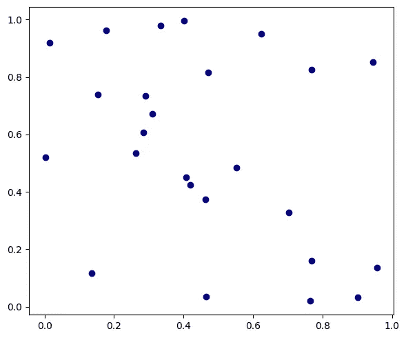
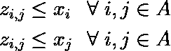
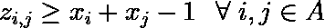
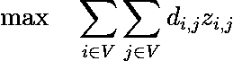
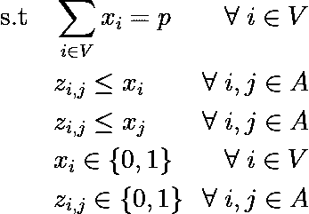
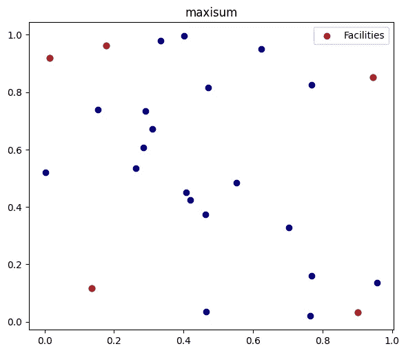
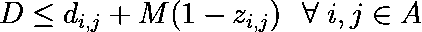
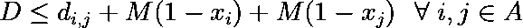
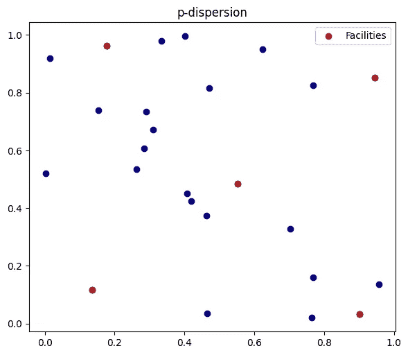
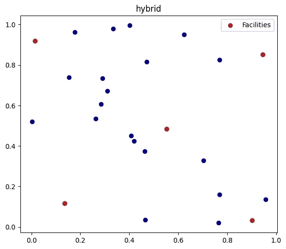

# 设施分布问题：混合整数规划模型

> 原文：[`towardsdatascience.com/the-facility-dispersion-problem-mixed-integer-programming-models-98ffdb56cd26?source=collection_archive---------2-----------------------#2023-09-09`](https://towardsdatascience.com/the-facility-dispersion-problem-mixed-integer-programming-models-98ffdb56cd26?source=collection_archive---------2-----------------------#2023-09-09)

## 关于 p-dispersion 和 maxisum 模型的全面 Python 教程

[](https://medium.com/@bruscalia12?source=post_page-----98ffdb56cd26--------------------------------)[](https://towardsdatascience.com/?source=post_page-----98ffdb56cd26--------------------------------) [布鲁诺·斯卡利亚 C. F. 莱特](https://medium.com/@bruscalia12?source=post_page-----98ffdb56cd26--------------------------------)

·

[关注](https://medium.com/m/signin?actionUrl=https%3A%2F%2Fmedium.com%2F_%2Fsubscribe%2Fuser%2F3ce9b7482ef0&operation=register&redirect=https%3A%2F%2Ftowardsdatascience.com%2Fthe-facility-dispersion-problem-mixed-integer-programming-models-98ffdb56cd26&user=Bruno+Scalia+C.+F.+Leite&userId=3ce9b7482ef0&source=post_page-3ce9b7482ef0----98ffdb56cd26---------------------post_header-----------) 发表在 [数据科学之道](https://towardsdatascience.com/?source=post_page-----98ffdb56cd26--------------------------------) ·10 分钟阅读·2023 年 9 月 9 日[](https://medium.com/m/signin?actionUrl=https%3A%2F%2Fmedium.com%2F_%2Fvote%2Ftowards-data-science%2F98ffdb56cd26&operation=register&redirect=https%3A%2F%2Ftowardsdatascience.com%2Fthe-facility-dispersion-problem-mixed-integer-programming-models-98ffdb56cd26&user=Bruno+Scalia+C.+F.+Leite&userId=3ce9b7482ef0&source=-----98ffdb56cd26---------------------clap_footer-----------)

--

[](https://medium.com/m/signin?actionUrl=https%3A%2F%2Fmedium.com%2F_%2Fbookmark%2Fp%2F98ffdb56cd26&operation=register&redirect=https%3A%2F%2Ftowardsdatascience.com%2Fthe-facility-dispersion-problem-mixed-integer-programming-models-98ffdb56cd26&source=-----98ffdb56cd26---------------------bookmark_footer-----------)

[Z](https://unsplash.com/@dead____artist?utm_source=medium&utm_medium=referral) 提供的照片，来源于 [Unsplash](https://unsplash.com/?utm_source=medium&utm_medium=referral)

在某些设施选址问题中，需要将设施布置得使得一个设施的影响力不会盖过或对其他设施产生不利影响。无论是出于风险缓解、避免竞争还是其他考虑，掌握这些挑战的解决方案是运筹学工具箱中的一个关键技能。

Kuby（1987）提出了两种不同的混合整数规划（MIP）公式：*p*-*分散*问题和 *maxisum* 问题。在这篇文章中，将使用 Python 库 Pyomo 和 HiGHS 求解器实现这两种问题。

除了这两个模型之外，还将介绍一些有用的建模资源。首先，在线性规划（MIP）背景下线性化二进制变量乘积的策略，尽管考虑到最大化目标，这在本问题中不需要显式说明。其次，一种最大-最小 MIP 公式，旨在最大化比一组项目的任何参数都小的某些东西，如果该项目被选中。最后，一种解决多目标的策略，具有明确的优先级层次结构，结合了这两个模型的元素。

对于尚未熟悉数值优化的人，可以参考我之前关于[*线性规划*](https://medium.com/towards-data-science/linear-programming-theory-and-applications-c67600591612)和 *分支限界* 方法的故事，以帮助理解。

如常，你可以在这个 [git 仓库](https://github.com/bruscalia/optimization-demo-files/tree/28266b5e2cc90b9e39f6f72322d3008fd211f1d8/mip/dispersion) 找到完整的代码。

你会选择哪些位置来放置 5 个设施？



设施分散问题中的可能位置。（图片来自作者）。

# 二进制变量的乘积

在定义此问题的基本元素时，可以使用二进制变量，如果选择了某个位置，则该变量为 1，否则为 0。我们用 *xᵢ* 来表示这些变量。假设两个位置之间的距离（或其他分散度量）已经计算出来，记作 *dᵢⱼ*。我们如何计算所选设施对的分散度？

在这种情况下，使用二进制变量 *xᵢ* 和 *xⱼ* 的乘积来计算它们都包含在解决方案中时的异质性是直观的。这种方法等同于逻辑与（AND）语句。然而，这将导致二次公式，因此无法使用线性求解器。幸运的是，有一种方法可以通过几个约束在 MIP 中公式化二进制变量的乘积。

考虑一个有向图 *G*(*V*, *A*) 和一个新的二进制变量 *zᵢⱼ*，它指示节点 *i* 和 *j* 都被选择。如果 *i* 或 *j* 其中之一未被选择，则 *zᵢⱼ* 必须为 0。这就产生了第一组约束：



二进制变量乘积的线性化约束的第一组。（图片来自作者）。

目前，即使选择了 *i* 和 *j*，*zᵢⱼ* 仍可以为 0。因此，我们必须包括一个额外的约束，使得当 *i* 和 *j* 被选择时，*zᵢⱼ* 变为 1。



线性化形式的二进制变量乘积的第二组约束。（图片由作者提供）。

当最大化与*zᵢⱼ*成比例的某物时，如*maxisum*问题，第二组约束是不必要的，因为如果可行的话，不计算与*zᵢⱼ*成比例的收益是没有意义的。然而，在制定其他 MIP 模型时，这可能是有用的。

在接下来的部分，让我们将这些概念应用于*maxisum*问题。

# *maxisum*模型

离散*maxisum*问题必须定义在*N*个离散节点中*p*个设施的位置，以最大化计算在所有选定设施对之间的距离（或距离的平均值）的总和。因此，考虑设施是分布在有向图*G*(*V*, *A*)中的节点。每条从*i*到*j*的弧的权重是已知的距离（离散）度量*dᵢⱼ*。同时，考虑二进制变量*xᵢ*表示位置*i*是否被选择，以及*zᵢⱼ*表示*i*和*j*是否都被选择。

目标可以陈述如下：



除了前一节中提出的将二进制变量的乘积线性化的约束外，还需要加入一个约束以保证选择了*p*个位置。

因此，我们可以将问题的约束陈述为：



让我们使用 Python 将其转化为代码。为此，我们必须首先导入将要使用的库。*numpy*库将用于线性代数计算和创建随机坐标点；scipy 中的*squareform*和*pdist*函数将用于根据坐标矩阵计算距离；*matplotlib*将作为我们的可视化工具；*pyomo*则是代数建模语言（AML）（与求解器 HiGHS）。

```py
import numpy as np
from scipy.spatial.distance import squareform, pdist
import matplotlib.pyplot as plt
import pyomo.environ as pyo
from pyomo.contrib.appsi.solvers.highs import Highs
```

我们必须创建*N*个点，并定义其中多少个必须被选为设施位置。通过在每次代码执行时固定随机种子（12），应能获得引言中所示的点。

```py
# Fix random seeds
np.random.seed(12)

# Create random points
N = 25
p = 5
coordinates = np.random.random((N, 2))

# Calculate pairwise distances
distances = squareform(pdist(coordinates))
```

我们现在具备了开始我们的*pyomo*模型所需的必要元素。

在*pyomo*中建模问题有两种方法：*Abstract*模型和*Concrete*模型。在第一种方法中，问题的代数表达式在提供一些数据值之前定义，而在第二种方法中，模型实例在定义其元素时立即创建。你可以在[库文档](https://pyomo.readthedocs.io/en/stable/pyomo_overview/abstract_concrete.html)或 Bynum 等（2021 年）的书中找到有关这些方法的更多信息。在本文中，我们将采用*Concrete*模型形式。

```py
model = pyo.ConcreteModel()
```

在这个模型中，我们有两个*集合*：节点和弧。由于我们考虑的是一个完整的有向图，因此每对两个节点之间存在弧，除了从节点到自身的弧。

```py
# Sets of nodes and arcs
model.V = pyo.Set(initialize=range(N))
model.A = pyo.Set(initialize=[(i, j) for i in model.V for j in model.V if i != j])
```

预先提供的参数是必须选择的节点数量以及节点对之间的距离。

```py
# Parameters
model.d = pyo.Param(model.A, initialize={(i, j): distances[i, j] for (i, j) in model.A})
model.p = pyo.Param(initialize=p)
```

然后，我们引入决策变量。

```py
# Decision variables
model.x = pyo.Var(model.V, within=pyo.Binary)
model.z = pyo.Var(model.A, within=pyo.Binary)
```

以及约束条件……

```py
# p nodes are selected
def p_selection(model):
    return sum(model.x[:]) == model.p

# If starting node is not selected, the arc is 0
def dispersion_c1(model, i, j):
    return model.z[i, j] <= model.x[i]

# If ending node is not selected, the arc is 0
def dispersion_c2(model, i, j):
    return model.z[i, j] <= model.x[j]

# Include constraints in model
model.p_selection = pyo.Constraint(rule=p_selection)
model.dispersion_c1 = pyo.Constraint(model.A, rule=dispersion_c1)
model.dispersion_c2 = pyo.Constraint(model.A, rule=dispersion_c2)
```

最后，我们必须创建目标函数。

```py
def disp_obj(model):
    return sum(model.z[i, j] * model.d[i, j] for (i, j) in model.A)

model.obj = pyo.Objective(rule=disp_obj, sense=pyo.maximize)
```

现在*maxisum*模型已经准备好解决了。我们需要实例化一个与*pyomo*兼容的求解器来处理它。*Highs*求解器在*Pyomo*中可用（请查看导入），自 6.4.3 版本起，如果安装了*highspy*包。所以请确保运行`pip install highspy`。

```py
solver = Highs()
solver.solve(model)
```

在大约 120 秒的计算时间后，我们得到了以下结果：



最大和模型结果。（作者提供的图像）。

请注意，即使总离散度被最大化，左上角的两个设施仍然彼此非常接近，这可能是不希望的。因此，除了*maxisum*公式之外，我们还有*p*-*离散*模型，其中我们最大化任何选定节点对之间的最小距离。

# p-离散模型

在*p*-*离散*模型中，我们需要一个额外的决策变量来计算所有选定节点对之间的最小距离，这也是我们的最大化目标。我们将这个变量称为*D*。我们必须创建一个大 M 约束，确保如果*i*和*j*都被选择，*D*小于或等于*dᵢⱼ*；否则，我们必须确保*D*是无限的。如果我们保持*zᵢⱼ*作为二进制变量的乘积的公式，我们可以将这个额外的约束公式化如下。



二进制变量乘积的最大-最小约束。（作者提供的图像）。

在这种公式中，*M*是一个任意大的固定参数，用于制定一个析取规则。*M*的选择应该足够大，以保证在*zᵢⱼ*为零时，约束(*i*, *j*)对任何*D*值都是可行的，但又尽可能小，以使模型的线性松弛版本与整数版本相似，从而使收敛更容易。在这个问题中，*dᵢⱼ*的最大值可能是一个有趣的替代选择。

尽管这种公式对于这个模型效果很好，但可以使用更简洁的方法，其中变量*zᵢⱼ*甚至不包含在模型中。



节点变量的最大-最小约束。（作者提供的图像）。

在这种公式中，*xᵢ*或*xⱼ*等于零是保证不等式对任何*D*值有效的充分条件。目标变为简单地最大化*D*。

在接下来的 Python 代码中，考虑到我们有一个新模型，其集合和参数与之前的相同，以及决策变量组*x*。

```py
# Max-min constraint
def maxmin_rule(model, i, j):
    return model.D <= model.d[i, j] + model.M * (1 - model.x[i]) + model.M * (1 - model.x[j])

# New parameter big M
model.M = max(model.d[:, :])

# New variable
model.D = pyo.Var(within=pyo.NonNegativeReals)

# New constraint
model.maxmin_rule = pyo.Constraint(model.A, rule=maxmin_rule)

# Objective
model.obj = pyo.Objective(expr=model.D, sense=pyo.maximize)
```

调用求解器后，花费了不到 1.2 秒获得以下结果。



p-离散模型结果。（作者提供的图像）。

看起来很好，因为位置在空间中分布均匀。

有没有办法改善这种分布？

# 一种多标准方法

记住 *p*-*离散* 模型的目标函数仅依赖于选定节点对之间的最小距离。因此，可以通过定义该距离的两点的组合以及其他距离大于或等于目标本身的点来获得多个解。我们能否通过选择这些替代方案中的最佳来优化我们的解？这导致了 Kuby（1987）提出的 *两步* “多标准方法”。

在第一步中，*p*-*离散*模型被求解到最优解，当前目标值被存储在参数*d_opt*中。接着，解决一个带有附加约束的 *maxisum* 模型，确保 *D* ≥ *d_opt*，以获得在 *p*-*离散*模型的最优解中，具有最大总离散度的解。

在 Python 中进行此操作时，考虑到你已经实例化了 *p*-*离散* 模型，同时也包含 *maxisum* 模型的决策变量和约束。

```py
# D must be optimal
def composed_constr(model):
    return model.D >= model.d_opt

# Solve p-dispersion
solver.solve(model)

# New parameter
model.d_opt = pyo.Param(initialize=model.obj())

# Deactivate old objective
model.obj.deactivate()

# Solution will not make the current D worse
model.composed_constr = pyo.Constraint(rule=composed_constr)

# New objective
model.obj_disp = pyo.Objective(rule=disp_obj, sense=pyo.maximize)
solver.solve(model)
```

这出乎意料地很快，因为当求解器进入第二个目标时，可行替代方案的空间显著缩小。在不到一（额外）秒的时间内，得到了以下结果。



多标准问题：p-离散模型后跟 *maxisum* 目标。（图像来源于作者）。

# 进一步阅读

当客户不均匀分布、设施有有限容量，或者适当的设施数量事先未知时，你可能面临的是不同的 *设施位置问题*。你可以在 [Nicolo Cosimo Albanese](https://medium.com/u/7430df412ec?source=post_page-----98ffdb56cd26--------------------------------) 的精彩故事中找到使用 PuLP 在 Python 中实现的 Balinski（1965）公式。

[](/optimization-capacitated-facility-location-problem-in-python-57c08f259fe0?source=post_page-----98ffdb56cd26--------------------------------) ## 优化：Python 中的容量设施位置问题

### 找出最佳的仓库数量和位置，以降低成本并满足需求。

towardsdatascience.com

# 结论

在这篇文章中，两个混合整数编程模型用于设施分散问题，它们使用 Pyomo 在 Python 中实现。如文献中先前验证的那样，*最大和*模型可能导致空间中元素的不均匀分布，而*p*-*分散*模型则产生了空间中位置分布良好且均匀的解决方案。*最大和*目标可以用来通过从最优解决方案集中选择具有最大总分散度的一个，来优化*p*-*分散*模型的解决方案。用于这些示例的[完整代码](https://github.com/bruscalia/optimization-demo-files/tree/28266b5e2cc90b9e39f6f72322d3008fd211f1d8/mip/dispersion)可供进一步使用。

# 参考文献

Balinski, M. L. 1965\. 整数编程：方法、用途、计算。*管理科学*, *12*(3), 253–313。

Bynum, M. L., Hackebeil, G. A., Hart, W. E., Laird, C. D., Nicholson, B. L., Siirola, J. D., … & Woodruff, D. L. 2021\. *Pyomo-optimization modeling in python* (第 67 卷)。德国柏林/海德堡：Springer。

Kuby, M. J. 1987\. 设施分散的编程模型：p‐分散和最大和分散问题。*地理分析*, *19*(4), 315–329。
