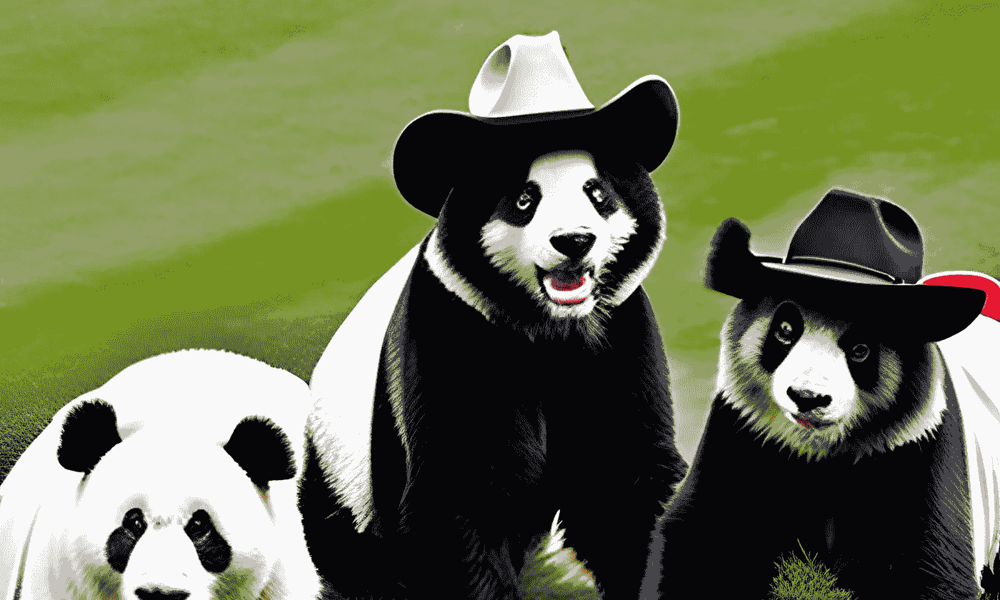
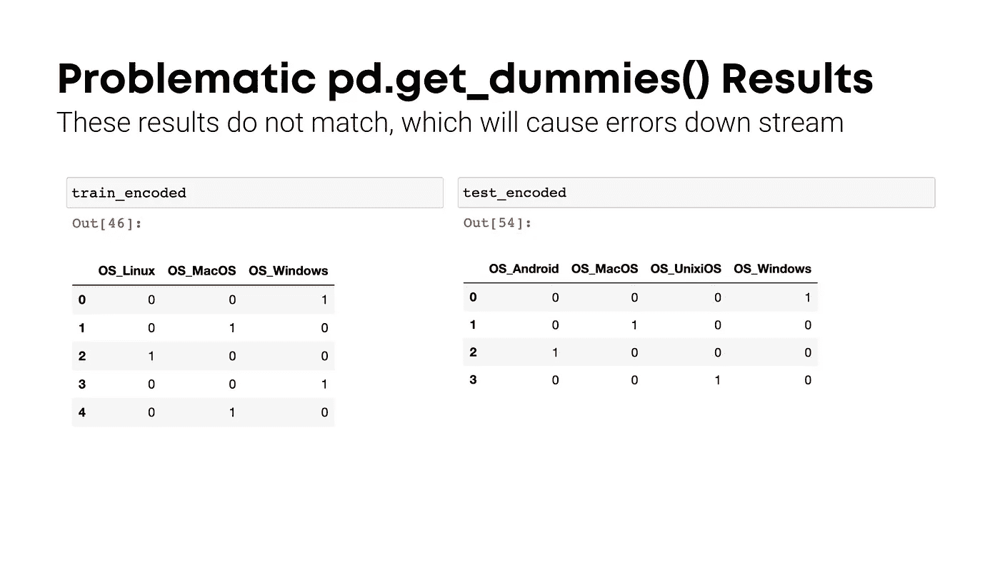

# Pd.Get_Dummies 的利与弊

> 原文：[`towardsdatascience.com/the-good-the-bad-and-the-ugly-of-pd-get-dummies-75c87e2aadc9`](https://towardsdatascience.com/the-good-the-bad-and-the-ugly-of-pd-get-dummies-75c87e2aadc9)

## 这是针对 pd.get_dummies 的死忠粉

[](https://adamrossnelson.medium.com/?source=post_page-----75c87e2aadc9--------------------------------)[](https://towardsdatascience.com/?source=post_page-----75c87e2aadc9--------------------------------) [亚当·罗斯·尼尔森](https://adamrossnelson.medium.com/?source=post_page-----75c87e2aadc9--------------------------------)

·发布于 [Towards Data Science](https://towardsdatascience.com/?source=post_page-----75c87e2aadc9--------------------------------) ·5 分钟阅读·2023 年 7 月 26 日

--

大家好 🤠

好的，我明白了。在 Python 中，将分类数据转换为虚拟变量数组最简单的方法之一是使用 Pandas 的 `pd.get_dummies()`。为什么还要花时间导入 `OneHotEncoder` 从 sklearn，执行 `.fit_transform()` 等等？真是繁琐！

这篇文章首先介绍一个简单的数据集，用于演示目的，其中测试集包含在训练集中未发现的分类数据。然后，演示如何使用 `pd.get_dummies()` 可能会导致演示数据出现问题。最后，展示如何使用 sklearn 的 `OneHotEncoder` 避免这个问题。



图片来源：作者在 Canva 上使用文本到图像的插图。提示：“三只穿着乡村西部牛仔服装的熊猫。”

# 演示用的简单数据集

这里我们有一个简单的数据集，其中包括一个名为 OS 的分类特征。OS 列列出了计算机操作系统。我们将使用这些虚拟数据进行演示。在 `train_df` 中包含虚拟演示训练数据，而在 `test_df` 中包含虚拟演示测试数据。

在我们的虚拟演示案例中，测试集包含在训练集中不存在的分类值。这种不匹配会导致问题。

```py
import pandas as pd

train_df = pd.DataFrame({'OS': ['Windows', 'MacOS', 
                                'Linux', 'Windows', 'MacOS']})
test_df = pd.DataFrame({'OS': ['Windows', 'MacOS', 
                               'Android', 'Unix' 'iOS']})
```

在我们的训练数据中，我们有三种操作系统：Windows、MacOS 和 Linux。但在我们的测试数据中，还包括 Android、Unix 和 iOS 等额外类别。

使用 `pd.get_dummies(train_df)` 拟合的模型将无法与 `pd.get_dummies(test_df)` 的测试数据一起使用。结果将不匹配——因为类别不匹配。


图片来源：作者在 Canva 上使用 Canva 库图像创建的插图。艺术用品虚拟模型。

# Pd.get_dummies() 的问题

当将`pd.get_dummies()`函数应用于我们的训练和测试数据集时，你会得到这样的结果。

```py
train_encoded = pd.get_dummies(train_df, columns=['OS'])
test_encoded = pd.get_dummies(test_df, columns=['OS'])
```

如果你评估`train_encoded`和`test_encoded` DataFrames，你会注意到它们的列数不同。这是因为测试集中仅存在的'Android'类别在`test_encoded`中创建了一个额外的列。这种训练和测试数据集特征数量的不一致可能在构建和评估机器学习模型时造成重大问题，因为这些模型期望两个数据集中的特征空间相同。



图片来源：作者的屏幕截图，使用此处显示的代码生成。

# 使用 OneHotEncoder 的解决方案

现在，让我们看看 sklearn 的`OneHotEncoder`如何解决这个问题。当使用`OneHotEncoder`时，编码器在训练数据的`.fit()`或`.fit_transform()`方法期间学习类别。然后，在`.transform()`方法期间，它为所有学习到的类别创建列。如果在测试数据中发现了新类别，则有两个选项。首先，你可以忽略新的未见类别。

```py
from sklearn.preprocessing import OneHotEncoder

encoder = OneHotEncoder(
    sparse_output=False, 
    handle_unknown='ignore').set_output(transform="pandas")

train_encoded = encoder.fit_transform(train_df[['OS']])
test_encoded = encoder.transform(test_df[['OS']])
```

注意，我们设置了`handle_unknown='ignore'`以告诉编码器忽略（而不是抛出错误）在测试集中看到的但在训练集中未见的任何类别。

还要注意，自 2023 年起，sklearn 提供了`.set_output(transform="pandas")`选项，这将确保编码器返回一个 Pandas DataFrame（具有更易读和解释的列名），而不是更简洁的 NumPy 数组。

通过使用`handle_unknown='ignore'`处理未知类别，`OneHotEncoder`确保训练数据和测试数据具有相同的特征空间，无论测试数据中出现了什么类别值。

# OneHotEncoder 的附加好处

Sklearn 的`OneHotEncoder`不仅在处理测试数据中未见类别时非常有用，它还提供了其他一些附加功能，这些功能也可能很有用。以下是其中两个附加选项及其使用方法。

## min_frequency

`min_frequency`是另一个强大的选项，它允许你指定一个最低频率阈值。频率低于此阈值的类别会被重新编码为“罕见”。这在你有一些只出现几次的类别时非常有用，这些类别可能没有足够的信息来帮助模型，可能会使模型复杂化，增加无用的特征，从而降低性能而没有任何预测价值。

这是如何设置`min_frequency`为 2 的：

```py
encoder = OneHotEncoder(
    sparse_output=False, 
    handle_unknown='infrequent_if_exist').set_output(transform="pandas")
train_encoded = encoder.fit_transform(train_df[['OS']])
test_encoded = encoder.transform(test_df[['OS']])
```

## max_categories

另一个有用的选项是`max_categories`。`max_categories`参数允许你限制虚拟数组中的输出列数。编码器将选择最常见的类别进行编码。

这个选项在处理具有许多类别的特征时特别有益，这些特征通常会导致维度数目很高。这可能会显著降低训练效率，同时增加模型复杂性，并且几乎没有提高预测能力的价值。简而言之，这减少了数据的维度。

这是限制编码到前 4 个最频繁类别的方法：

```py
encoder = OneHotEncoder(
    sparse_output=False, 
    handle_unknown='ignore', 
    max_categories=4).set_output(transform="pandas")

train_encoded = encoder.fit_transform(train_df[['OS']])
test_encoded = encoder.transform(test_df[['OS']])
```

# 结论

从更宏观的角度来看，使用`pd.get_dummies()`而不是真正的拟合和转换过程，在数据科学领域还有更严重的错误。然而，如果你一直坚持使用`pd.get_dummies()`，现在你已经了解了它的优点、缺点和不足——阅读完这篇文章后，你应该考虑调整你的做法。

虽然`pd.get_dummies()`在 Python 中创建虚拟变量是快速且简便的，但当你的测试数据包含在训练数据中未见过的类别时，可能会导致问题。另一方面，sklearn 的`OneHotEncoder`优雅地处理了这种情况，确保了数据集间一致的特征空间。值得多写几行代码，以避免潜在的陷阱。

# 感谢阅读

你准备好了解更多数据科学领域的职业了吗？我提供一对一的职业指导，并有每周的电子邮件列表，帮助数据专业的求职者。[联系我了解更多](https://coaching.adamrossnelson.com/)。

感谢阅读。请把你的想法和建议发给我。你可以只是说声你好。如果你真的需要告诉我哪里做错了，我期待很快与你聊聊。Twitter: [@adamrossnelson](https://twitter.com/adamrossnelson) LinkedIn: [Adam Ross Nelson](https://www.linkedin.com/in/arnelson/)。
