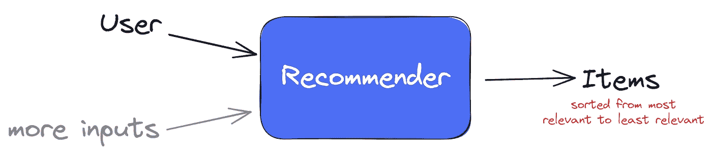
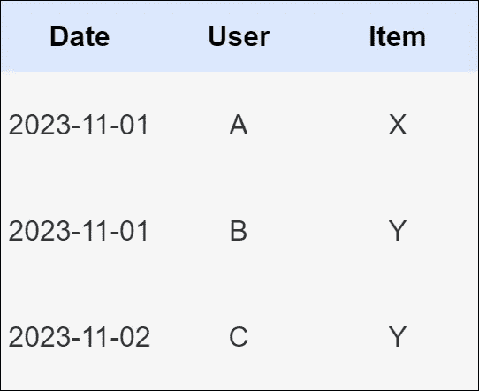
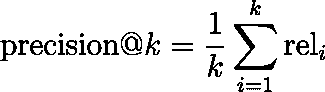
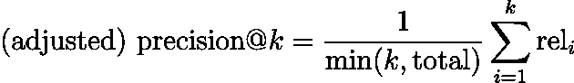
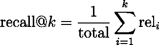
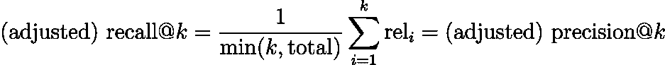
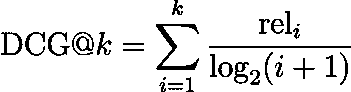
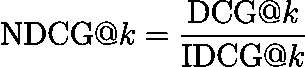

# 推荐系统指标指南

> 原文：[`towardsdatascience.com/the-guide-to-recommender-metrics-c5d72193ea2b`](https://towardsdatascience.com/the-guide-to-recommender-metrics-c5d72193ea2b)

## 离线评估推荐系统可能是棘手的

 [Dr. Robert Kübler](https://dr-robert-kuebler.medium.com/?source=post_page-----c5d72193ea2b--------------------------------)

·发表于 [Towards Data Science](https://towardsdatascience.com/?source=post_page-----c5d72193ea2b--------------------------------) ·阅读时间 10 分钟·2023 年 11 月 12 日

--

图片由 [Darius Cotoi](https://unsplash.com/@dariuscotoi?utm_source=medium&utm_medium=referral) 提供，来源于 [Unsplash](https://unsplash.com/?utm_source=medium&utm_medium=referral)

想象一下 YouTube 主页面，它展示你可能喜欢的视频，或者 Amazon 推荐你购买更多他们销售的产品。这些都是**推荐系统**的例子，它们试图展示你最可能想要互动的内容。

假设你也用你选择的方法构建了一个推荐系统。问题是：如何**离线评估**它，**在投入生产之前**并让它在网站上提供推荐服务？

在这篇文章中，你将确切学到这些！此外，我还会告诉你**为什么你需要小心**这些指标。

如需更详细的介绍，请参阅我的另一篇文章，该文章还展示了如何使用 TensorFlow 从头构建推荐系统。

 ## 嵌入式推荐系统简介

### 学习如何在 TensorFlow 中构建一个简单的矩阵分解推荐系统

towardsdatascience.com

# 推荐系统的离线评估

首先，让我们为推荐系统找到一个定义，以涵盖你可能设计或在实际中找到的大多数系统。

> 对我们而言，推荐系统是一个算法，它至少以用户作为输入，并输出一个有序的推荐项列表给该用户。

图片由作者提供。

为什么*至少*要有一个用户？可能还有更多的输入，比如季节时间，这可以帮助模型学习不要在夏天推荐巧克力圣诞老人。

例如，我们构建的水果推荐器*R*可以做诸如 *R*(Alice) = [苹果、橙子、樱桃] 这样的事情。

> ***注意：*** *用户可能是其他的东西，甚至可能是另一篇文章。如果你想为商店里缺货的文章构建一个推荐器，这可能是相关的。所以，你的推荐器将一篇文章作为输入并输出其替代品。不过，我们还是坚持经典的用户-物品推荐。*

接下来是你可以用来评估推荐系统质量的离线推荐指标列表。我将向你展示它们的定义以及使用时需要注意的细节。

## *训练-测试分割*

我们将假设已经进行了一些形式的训练-测试分割，以获得有意义的指标。否则，我们将仅衡量推荐系统的过拟合能力。假设我们有如下数据：

作者提供的图像。

**阅读：** 用户**A**购买/观看/收听了物品**X**（例如电影或歌曲）。我将在接下来的文章中使用“购买”。

有许多分割选项，你应根据应用场景选择其一。

1.  **随机分割：** 你将所有行随机分割为训练集和测试集。

1.  **时间分割：** 你选择一个阈值日期，将所有在此日期之前的条目放入训练集中，其余的放入测试集中。

1.  …

通常，当我有日期列时，我会选择时间分割，因为它完全符合模型的预期用途：我们在**过去的数据**上**训练**一个模型，并希望它在**未来**表现良好。不过，思考一下这是否适合你的情况。

好吧，在定义了一些分割之后，让我们继续进行指标的部分！

## 回归指标

在最佳情况下，你不仅会有类似于用户**A**购买了物品**X**的交易数据，还可能会有某种**明确**的反馈，例如用户评分（1–5 星）。在这种情况下，你不仅可以让你的模型**输出**一个物品列表，还可以输出它们的**预测评分**。然后，你可以选择任何回归指标，比如均方误差或平均绝对误差来衡量预测评分与实际评分之间的差距。这没有什么新意，因此我们就此打住。

# 从隐含反馈中获得的推荐系统对齐指标

从现在开始，我们将假设没有任何明确的反馈，例如星级评分，只有隐含反馈，比如“用户**A**购买了物品**X**”。有关隐含反馈的更多信息，请查看我的另一篇文章的介绍部分：

 ## 使用 TensorFlow 推荐系统进行隐式反馈的推荐系统

### 当客户没有明确告诉你他们想要什么时

[towardsdatascience.com

## 准备工作

我们将讨论的所有指标都需要两个要素：

1.  用户在**测试集**中购买的项目列表

1.  对于同一用户，在训练模型后，推荐列表（这是预测结果！）是基于**训练集**的。

以下指标用于衡量这两个列表的对齐程度。让我们详细看看。

假设我们现在只有一个用户**Alice**：

+   在测试集中，Alice 购买了以下项目：🍍🍎🍉🍌🍒

+   推荐系统输出如下：🍌🍐🍒🍈🍇（按照这个顺序）

我们将 Alice 在测试集中获得推荐并实际购买的项目称为**相关**。在我们的例子中是：🍌 和 🍒。那些被推荐但 Alice 没有购买的项目是不相关的，即 🍐、🍈 和 🍇。

> *如果我们有多个用户，我们只需计算每个用户的以下指标，并对所有用户取平均值。此外，我们将定义许多带有* ***@*k** *后缀的指标。这仅意味着我们* ***将推荐列表截断为* k *项*** *，然后计算指标。*

## Precision@k

用文字表述：

> 在前 (前面) 的 k 个推荐项目中，有多少 % 对 Alice 是相关的？

让我们计算 precision@3。实际上，Alice 购买了 🍍🍎🍉🍌🍒，但推荐系统建议了🍌🍐🍒 作为前三个项目。这三个项目中有多少是相关的？好吧，只有 🍌 和 🍒 出现在测试集中，因此**precision@3 = 2/3 ≈ 66.7%**。

**提醒：**我们的推荐系统向 Alice 推荐了 🍌🍐🍒🍈🍇。

你可以用这种方式计算所有其他 *k* 的 precision@*k*：precision@1 = 1/1，precision@2 = 1/2，precision@4 = 2/4，precision@5 = 2/5。一般公式为：

作者提供的图片。

这里，rel*ᵢ* 是 0 或 1，具体取决于推荐列表中第 *i* 位的项目是否相关 (1) 或不相关 (0)。

> *从现在开始，我们只处理 relᵢ，因为这样我们不需要记住哪些水果是相关的，哪些不是。因此，我们将🍌🍐🍒🍈🍇 转换为* ***[1, 0, 1, 0, 0]*** *，因为🍌 和 🍒 是相关的。*

这个指标很直接，因为你只需要计算多少项目是相关的。不过，这个指标有一些变体。例如，如果我们的推荐系统显示了 5 个项目，但 Alice 在测试集中只购买了 3 个。然后推荐系统无法获得 100% 的分数，最大值将是 3/5 = 60%。如果你觉得这不公平，你可以通过不将总和除以 *k*，而是 **除以 *k* 或 Alice 在测试集中购买的总项目数**（取较小者）来调整指标。

total = Alice 在测试集中购买的总项目数。图像由作者提供。

**precision@*k*** 的缺点：推荐的顺序被忽略。对于相关性评分为 [1, 0, 1, 0, 0] 的推荐，precision@5 与 [0, 0, 0, 1, 1] 是一样的，尽管将相关项目排在列表前面更为理想。你还希望你的相关搜索引擎结果排在第一位，而不是第七位。

## Recall@*k*

这个问题类似于 precision@*k*。

> 在所有相关的项目中，有多少 % 被推荐给了 Alice？

让我们计算 recall@2：Alice **总共**购买了 5 个项目 🍍🍎🍉🍌🍒，在前两个位置上得到了推荐 *🍌🍐*。* 只有单一的项目 🍌 被我们的推荐系统覆盖，所以 recall@2 = 1/5。

你还可以计算：recall@1 = 1/5，recall@3 = 2/5，recall@4 = 2/5，recall@5 = 2/5。一般来说：

total = Alice 在测试集中购买的总项目数。图像由作者提供。

再次，你可以争论这有时是不公平的。即使是完美的推荐系统也无法覆盖所有的 **总共** 项目，如果 *k* < **总数**。例如，如果前两个项目是相关的，则 recall@2 的最大值为 2/5。你也可以调整它，结果发现你会得到与调整后的 precision@*k* 相同的公式。

图像由作者提供。

**recall@*k*** 的缺点：与之前相同。推荐的顺序被忽略。

## NDCG@k

这个问题有点复杂，因为它包括两个部分：**DCG** 和 **IDCG**。但在我们开始之前，先提供一个信息：这个指标关注推荐的顺序！所以，让我们看看它是如何工作的：

**DCG**：这是折扣累计增益的缩写。它的公式是

图像由作者提供。

在这里，你可以看到为什么推荐顺序很重要——每个相关性项 rel*ᵢ* 都因为在列表中靠后而受到惩罚。rel₁ 被除以 log₂(2) = 1，rel₂ 被除以 log₂(3) ≈ 1.585，rel₃ 被除以 log₂(4) = 2，依此类推。

因此，相关项目最好位于列表的顶部，那里的 **折扣**（惩罚）项仍然较低。

这个指标本身的问题在于它是无界的。在我们的例子[1, 0, 1, 0, 0]中，DCG@3 是 1/log₂(2) + 0/log₂(3) + 1/log₂(4) = 1 + 0.5 = 1.5。这就是为什么我们现在将通过检查一个完美推荐系统的表现来计算**DCG 的上限**。

**IDCG:** 这是**理想**折扣累计增益的缩写。我们输出的相关性模式为[1, 0, 1, 0, 0]的推荐系统并不完美。一个真正的**完美推荐系统**会将 Alice 在测试集中购买的所有项目放在列表的最上面，即相关性模式将是[1, 1, 1, 1, 1]，因为 Alice 购买了 5 件商品。

> ***备注:*** *如果 Alice 在测试集中只购买了 2 件商品，一个完美的推荐系统将输出[1, 1, 0, 0, 0]，因为没有更多相关的项目可以填充推荐列表。*

因此，DCG 不能高于所有 5 个推荐项目都相关的情况。我们可以计算 IDCG@3 = 1/log₂(2) + 1/log₂(3) + 1/log₂(4) ≈ 2.131。

作者提供的图片。

**NDCG**: 最后，我们可以定义**标准化**折扣累计增益 NDCG@*k*为

因此，在我们的案例中，NDCG@3 = DCG@3 / IDCG@3 ≈ 1.5 / 2.131 ≈ **0.704**。

我们可以测试一下如果我们的推荐系统变得更差会发生什么，例如，如果相关性模式为[0, 1, 1]。那么 DCG@3 是 0/log₂(2) + 1/log₂(3) + 1/log₂(4) ≈ 1.131，NDCG@3 ≈ 1.131 / 2.131 ≈ 0.531 < 0.704。

# 讨论与结论

图片由[ANIRUDH](https://unsplash.com/@lanirudhreddy?utm_source=medium&utm_medium=referral)提供，来源于[Unsplash](https://unsplash.com/?utm_source=medium&utm_medium=referral)

好的，我们已经讨论了一些常见的指标。我们也看到了这些指标如何衡量推荐系统输出的排名与用户购买的项目的匹配程度。然而，请你思考一下：

> 这真的是我们想要的吗？

毕竟，用户已经购买了这些项目，即使**没有我们推荐系统的帮助**（因为我们现在才在开发它！）。所以，我们实际上是在衡量我们的推荐系统能够展示客户本来会购买的商品的能力。

可能我们的推荐系统在生产环境中使用时*互动率*（点击它的人的比例）会增加。但我不确定这是否是一个成功的标志，因为他们可能本来就会购买很多这些商品。也许我们只是给他们提供了一个在开始页面上的快捷方式。这并不是坏事，因为这可能会转化为更高的客户满意度，这对其他目标可能有好处。但它可能不会对收入产生你希望的重大影响。

要增加收入——这通常是你的**终极目标**——也许让用户看到他们自己不会购买的商品更有意义。但这在离线环境中很难衡量。你需要实现一个推荐系统，然后在**在线**环境中测试它，这样你才能看到你的客户真正想要什么。

举个例子，你可以测试一个**高多样性**的推荐系统，即一个显示来自不同类别商品的推荐系统。或者，你认为总是明智的在 Netflix 上向喜欢喜剧的人推荐 100%的喜剧吗？也许推荐不同的类型也有意义。

正如我所说的，你必须使用**A/B 测试**在在线环境中进行测试。也许你的用户喜欢被推荐他们本来会购买的东西，但也可能不是这样。

> 不要猜测，只要测试。

**在最好的情况下，你可以观察到你的某一个离线指标与在线 KPI 之间的相关性。然后优化这个离线指标是有意义的。但是，如果你没有这种相关性，丢弃一个模型只是因为它的 NDCG 低于另一个模型的 NDCG 时要小心。**

我希望你今天学到了一些新的、有趣的、有价值的东西。感谢阅读！

> *如果你有任何问题，可以在* [*LinkedIn*](https://www.linkedin.com/in/dr-robert-k%C3%BCbler-983859150/)*上联系我！*

如果你想更深入地了解算法的世界，可以试试我的新出版物**关于算法的一切**！我仍在寻找作者！

 [## 关于算法的一切

### 从直观的解释到深入的分析，算法通过示例、代码和精彩的内容变得生动。

medium.com](https://medium.com/all-about-algorithms?source=post_page-----c5d72193ea2b--------------------------------)
