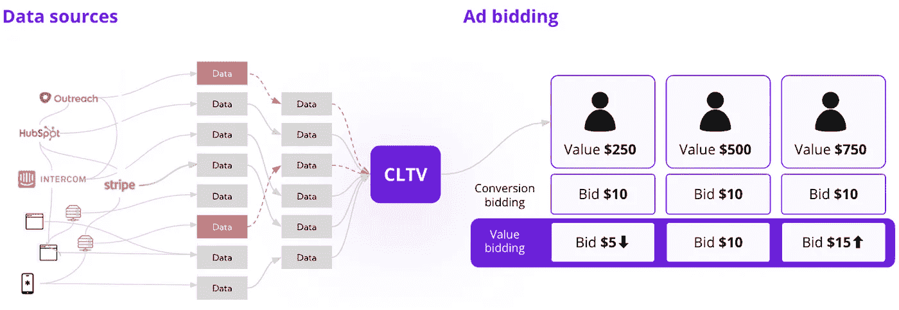
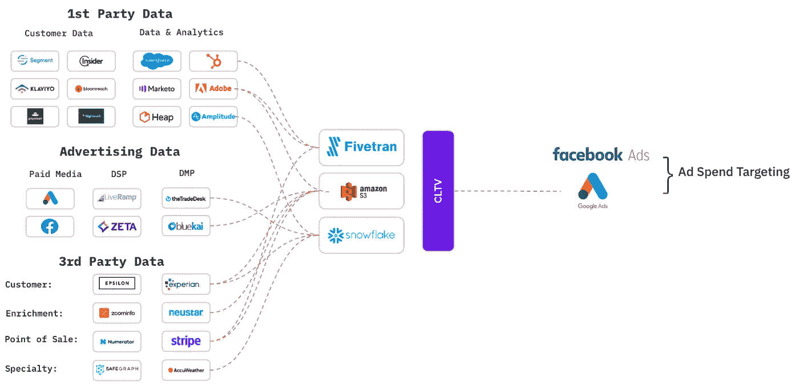
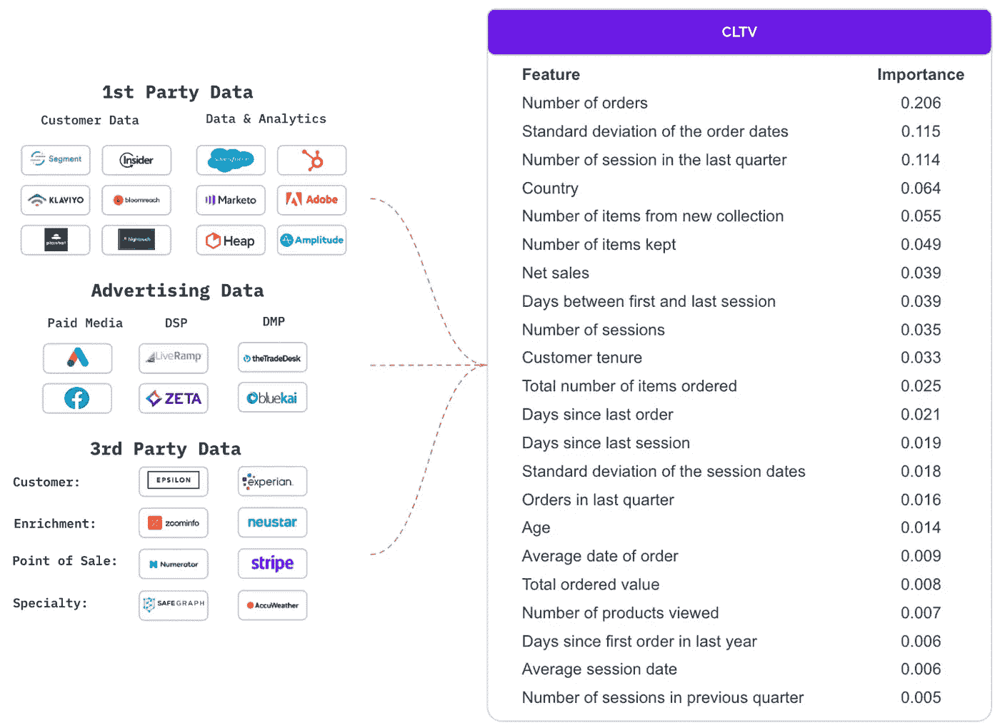
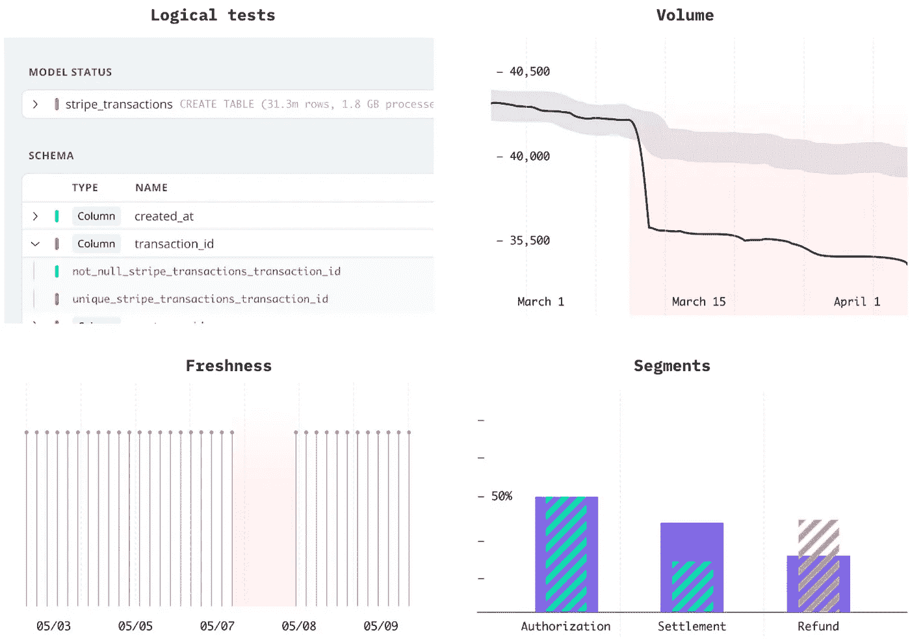

# 数据质量问题对广告支出的回报的隐藏成本

> 原文：[`towardsdatascience.com/the-hidden-cost-of-data-quality-issues-on-the-return-of-ad-spend-dd8c99b3289e?source=collection_archive---------18-----------------------#2023-07-06`](https://towardsdatascience.com/the-hidden-cost-of-data-quality-issues-on-the-return-of-ad-spend-dd8c99b3289e?source=collection_archive---------18-----------------------#2023-07-06)

## 如何领先公司基于客户生命周期价值驱动以价值为导向的广告支出分配，并克服代价高昂的数据问题

 [Mikkel Dengsøe](https://medium.com/@mikldd?source=post_page-----dd8c99b3289e--------------------------------)

·

[关注](https://medium.com/m/signin?actionUrl=https%3A%2F%2Fmedium.com%2F_%2Fsubscribe%2Fuser%2Fc05fafadc01d&operation=register&redirect=https%3A%2F%2Ftowardsdatascience.com%2Fthe-hidden-cost-of-data-quality-issues-on-the-return-of-ad-spend-dd8c99b3289e&user=Mikkel+Dengs%C3%B8e&userId=c05fafadc01d&source=post_page-c05fafadc01d----dd8c99b3289e---------------------post_header-----------) 发表在 [Towards Data Science](https://towardsdatascience.com/?source=post_page-----dd8c99b3289e--------------------------------) ·6 分钟阅读·2023 年 7 月 6 日

--

你的数据能够揭示很多信息，关于哪些客户带来了丰厚的回报，哪些则没有。不论你是 B2B 公司中的生命周期营销经理，优化免费试用转化为付费客户，还是 B2C 电子商务中的数据科学家，优化让首次用户购买你的产品，每个用户对你来说都是有价值的。

领先的公司已熟练掌握根据客户在网站或产品上的互动预测客户生命周期价值。凭借这些数据，他们可以相应地调整竞标，合理地为一个可能在其生命周期内产生额外 50 美元的用户支付额外的 5 美元。

换句话说，你正坐拥一座金矿，可以将其转化为预测并直接输入 Google 和 Meta，调整你的竞标策略，以通过为每个客户支付适当的价格来赢得市场。

source: synq.io

*影响客户生命周期价值（CLTV）计算的数据问题导致价值竞标基于错误的假设*

但你的广告支出的回报只有在你的客户生命周期价值计算准确时才会显现。

平均规模在 250 到 500 人的公司使用数十种数据源，跨越数百个表格，且不总是能正确了解他们使用的数据是否准确。这意味着他们可能将预算分配给错误的用户，从而浪费数十万美元。

在这篇文章中，我们将深入探讨数据驱动的营销团队在原始数据经过转换、作为广告平台中基于价值的竞标输入时所面临的数据质量问题。我们将特别关注以下领域：

+   **360 度概览** — 为什么拥有全面的营销数据堆栈概览如此重要

+   **监控** — 在你的营销管道中应该注意的常见问题

+   **人员与工具** — 协调人员和工具以建立可靠的营销数据管道的重要性

# 为什么你需要对营销管道有 360 度的概览

为了了解每个客户的价值，你可以分析用户行为和数据点，这些数据点是强有力的指标。这通常会揭示一个由数十个不同系统提供的预测因素列表。通过结合这些因素，你可以获得对客户的全面了解，并将这些线索串联起来，了解行为和行动背后的关键驱动因素，从而识别出具有高价值的客户。

例如，如果你是一家 B2B 公司的营销人员，你可能已经了解了促使客户从免费用户转变为付费用户的因素。

+   登录两次使客户转化的可能性提高 50%（Stripe）

+   在 7 天内推荐他人使客户价值提高 70%（Segment）

+   拥有公司邮箱地址且员工人数超过 250 的用户比其他用户更有可能成为付费客户（Clearbit）

+   仅通过移动设备登录会使客户价值减少 30%（Amplitude）

source: synq.io

*数十个上游源数据进入数据仓库后，才会发送到 Google 和 Facebook 进行广告竞标*

如果没有全面的概览，你可能会错误地假设输入到竞标系统中的数据是准确的，结果会发现关键问题，例如：

+   从电子邮件域名中错误提取公司规模，由于 Clearbit/Segment 集成故障。

+   事件跟踪冲突导致从 Amplitude 中丢失结账流程中关键动作的数据。

+   从 Stripe 集成中数据同步不准确，导致关于客户购买的信息不完整。

> *“由于第三方数据源的问题，我们的 CLTV 计算中断了。我们不仅失去了当天花费在 Google 上的 10 万英镑，还不得不等几天才能让 CLTV 模型重新校准。” — 500 人金融科技公司*

[研究论文](https://arxiv.org/pdf/1703.02596.pdf)强调了多种因素在预测在线零售商 ASOS 的 CLTV 中的重要性。研究发现，关键因素包括**订单行为**（例如订单数量、近期订单历史）、**人口统计信息**（例如国家、年龄）、**网页/应用会话日志**（例如距离上次会话的天数）和**购买数据**（例如总订单价值）。这些见解是数百个数据转换和几十个第三方源整合的结果。

**ASOS — 影响 CLTV 的因素**

来源：synq.io。数据来自 [研究论文](https://arxiv.org/pdf/1703.02596.pdf)

# 数据问题 — 已知的未知和未知的未知

拥有全面的数据概览还不够；重要的是主动识别影响 CLTV 计算的潜在问题。这些问题可以分为两种类型：

**已知的未知**：发现并确认的问题，例如管道故障导致 Google API 12 小时内未同步数据。

**未知的未知**：可能未被发现的问题，例如产品分析事件数据同步到数据仓库不正确，导致对用户行为的假设不准确。

> *“我们每天在 Facebook 营销上花费 50,000 美元，而我们的一条上游管道在 3 天内没有同步，导致我们浪费了一半的预算。直到他们通知我们之前，我们完全不知道发生了这种情况。” — 250 人电子商务公司*

为了主动识别和解决影响 CLTV 计算的数据问题，请考虑监控以下领域：

来源：synq.io

**逻辑测试**：使用像 [dbt](https://www.getdbt.com/) 这样的工具将假设应用于不同的列和表。例如，确保 user_id 列是唯一的，order_id 列从不包含空值。实施额外的逻辑检查，例如验证电话号码字段仅包含整数，或确保平均订单大小未超过合理的限制。

**数据量**：监控数据量的异常。例如，订单表中新行的突然增加可能表明数据转换错误导致重复项，或者反映了新产品的成功。

**新鲜度**：了解所有数据表的最新刷新时间，因为数据管道故障可能在更细微的领域中被忽视。例如，暂停从 Clearbit 收集公司规模数据的集成问题可能会在没有立即检测的情况下持续存在。

**分段**：识别特定分段中的问题，例如某些产品类别的标签错误，这在没有适当检查的情况下可能难以检测。

# 确立责任和所有权

一旦你对数据和监控系统有了全面了解，定义监控的各个方面的责任就很重要。在之前提到的例子中，数据所有权涵盖了产品使用、人口统计、计费和订单。为相关的数据源和表格指定负责人，确保能够及时处理和解决问题。

> *“我们有一个重要的测试警报响了好几周，但一直未被处理，因为接收警报的人已经离开公司” — 英国金融科技独角兽*

此外，优先关注数据产品中最关键的组件，并建立服务水平协议（SLA）。定期评估正常运行时间和性能，以系统化的方式解决任何需要注意的领域。

# 总结

领先的公司使用来自多个来源的数据来准确预测每位客户的客户生命周期价值（CLTV）。这使他们能够优化广告竞标并锁定最有利可图的客户。然而，你的广告支出最终成功与否取决于 CLTV 计算的准确性，使得未被发现的数据问题成为一个重大风险。

为了确保高质量的数据用于基于价值的广告竞价，我们建议关注两个关键领域：

1.  **360 度概览**：没有全面的概览，你可能会误认为你的竞标系统中的数据是准确的，后来却发现关键问题。这些问题可能包括像 Amplitude 这样的平台中的陈旧数据或与 Clearbit 的集成问题。

1.  **监控**：主动识别和解决影响 CLTV 计算的数据问题至关重要。实施包括逻辑测试、数据新鲜度、数据量跟踪和分段分析在内的监控流程。

通过优先考虑全面概览和主动监控，公司可以降低与错误 CLTV 计算相关的风险，并提高基于价值的广告竞价策略的有效性。

如果你在处理营销数据并且考虑如何建立可靠的数据，我很乐意与您交流。请通过 mikkel@synq.io 联系我。
