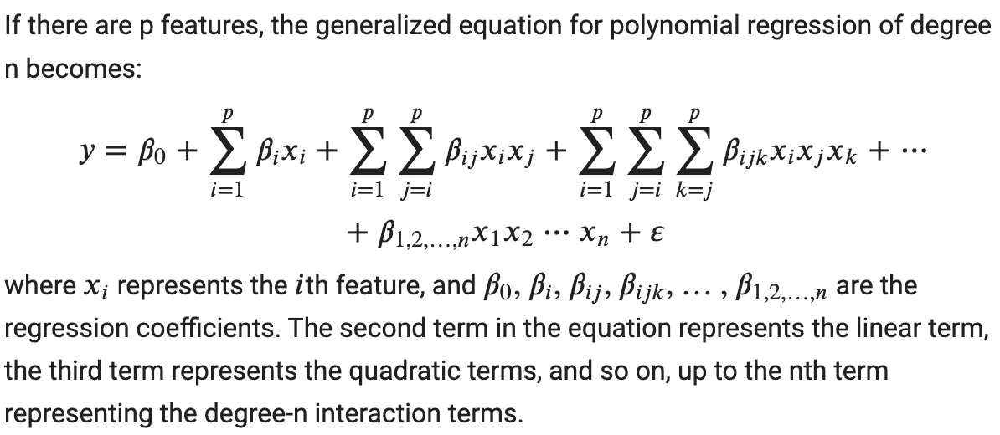
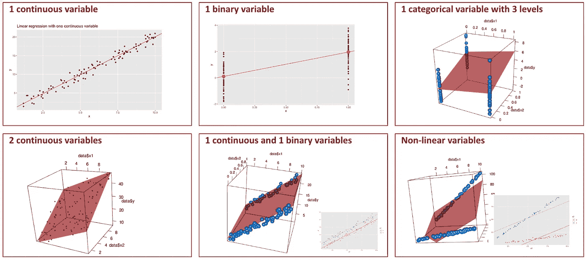
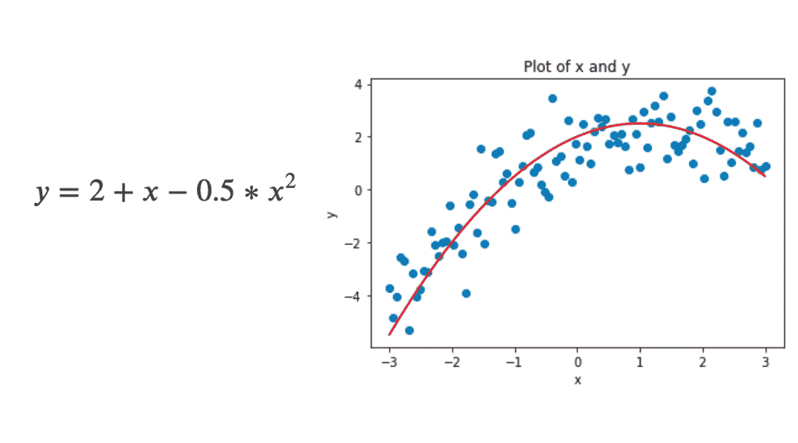
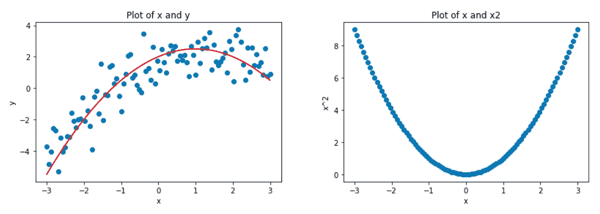
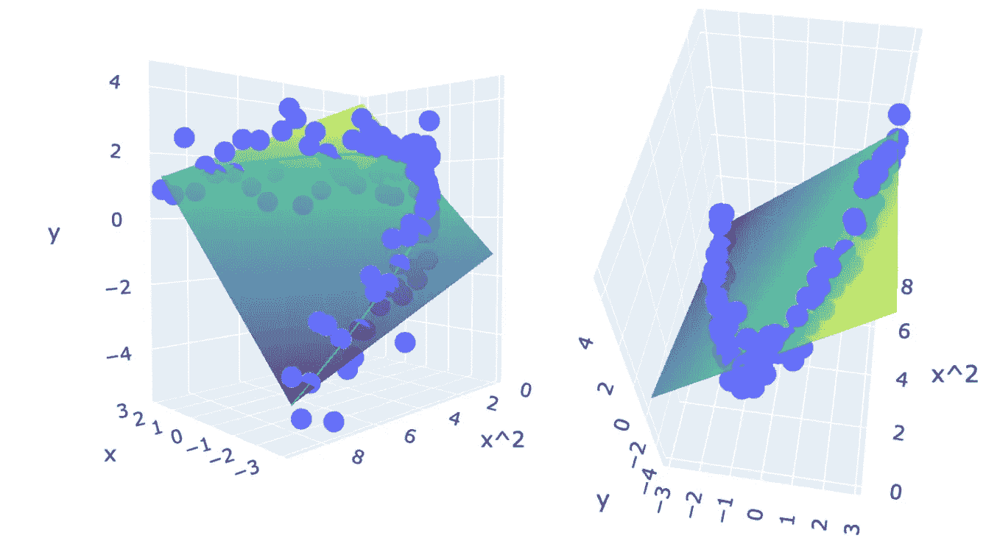
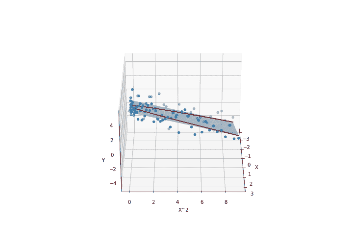
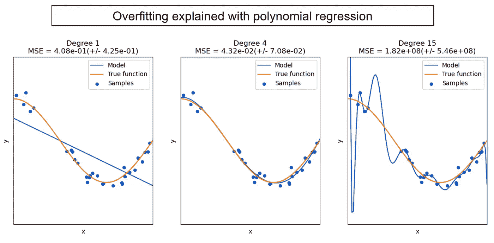
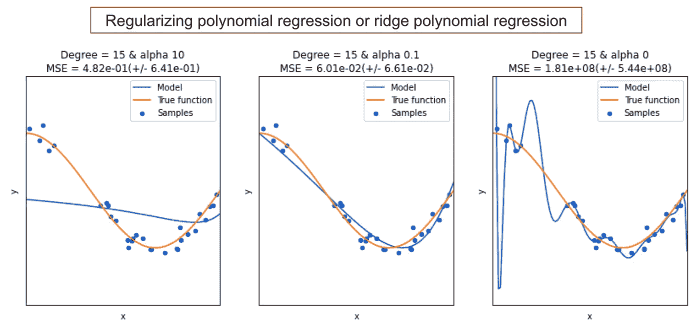

# 多项式回归中的隐藏线性

> 原文：[`towardsdatascience.com/the-hidden-linearity-in-polynomial-regression-333f1bed7aa5`](https://towardsdatascience.com/the-hidden-linearity-in-polynomial-regression-333f1bed7aa5)

## 从两个角度更好地理解线性模型

 [Angela and Kezhan Shi](https://medium.com/@angela.shi?source=post_page-----333f1bed7aa5--------------------------------)

·发表于[数据科学前沿](https://towardsdatascience.com/?source=post_page-----333f1bed7aa5--------------------------------) ·阅读时间 9 分钟·2023 年 3 月 17 日

--

在这篇文章中，我们将讨论这种观点：

> 多项式回归是线性回归的一种。

图片来自[丹尼·穆勒](https://unsplash.com/de/@redaquamedia?utm_source=medium&utm_medium=referral)在[Unsplash](https://unsplash.com/?utm_source=medium&utm_medium=referral)

初看之下，这个说法可能显得荒谬。多项式回归被称为非线性回归，而线性回归显然是线性的，这两个模型怎么可能被认为是相同的呢？

就像生活中的许多事物一样，你可以用不同的方式看待相同的事物，两个人可能会得出看似不同的结论。然而，我们往往忽略了答案并不是最重要的部分，而是你用来得出结论的方法、方法论或框架。我最近发表了[一篇关于逻辑回归是回归模型还是分类模型的争论的文章](https://medium.com/towards-data-science/is-logistic-regression-a-regressor-or-a-classifier-lets-end-the-debate-a01b024f7f65)。我提到了两个观点：统计学与机器学习。在这篇文章中，我们还将探讨这两种不同的多项式回归理解视角。

哦，有些人可能会说多项式回归只是一个理论模型，不容易付诸实践，因为将一个特征提升到高次幂并没有实际意义。通过这篇文章，你会发现这个原则的使用比你想象的要广泛，而且多项式的次数不应是唯一的超参数。

# 1. 线性回归和多项式回归的定义

首先，我们来看一下线性回归和多项式回归的定义。现在，我知道你可能已经非常了解这些定义，但当你阅读这些定义时，尝试找出两个模型的输入中有什么不寻常的地方。

## 1.1 定义线性回归

线性回归通常指的是普通最小二乘法（OLS）回归，它涉及最小化输出的预测值与实际值之间的平方差之和。

线性回归的方程可以表示为 y = w X + b。由于 X 是表示多个变量的矩阵，我们可以以这种方式展开函数：

y = w1x1 + w2x2 + … + wpxp + b

其中：

+   y 是因变量或输出

+   x1, x2, …, xp 是自变量或输入

+   b 是截距

+   w1, w2, …, wp 是因变量的系数

## 1.2 定义多项式回归

多项式回归将自变量 x 和因变量 y 之间的关系建模为 n 次多项式。结果是一个最适合数据点的曲线，而不是一条直线。

多项式回归的方程可以写作：

y = b0 + b1x + b2x² + … + bn*x^n

其中：

+   再次强调，y 是因变量，

+   x 是自变量，

+   b0, b1, b2, …, bn 是系数，以及

+   n 是多项式的次数。

所以，多项式回归允许 x 和 y 之间建模非线性关系。

## 1.3 一个重要的方面：特征的数量

现在，你注意到之前的定义中有什么不同吗？我在互联网上搜索了这些定义，包括维基百科和大学课程，这种差异总是存在的。

+   线性回归通常使用多个变量进行定义

+   多项式回归通常只有一个特征变量。

在我看来，主要原因是多项式回归通常从统计学家的角度来看待。这就是为什么 numpy 包中的多项式回归拟合算法 polyfit 只允许一个特征。而 scikit learn 如何，我们稍后会看到。

无论如何，在今天的“机器学习”应用中，只使用一个特征来进行模型构建对实际应用而言是远远不够的。

当然，可以为多项式回归输入多个特征。这时称为**多变量多项式回归**，特征将分别提高到不同的幂，并且不同特征之间会有交互。

如果有 p 个特征，多项式回归的广义方程为 n 次方程（我将用 Latex 写出这个方程，以便你更好地阅读）：

这种方法并不常见，也许是因为它复杂且不易使用。然而，你可以看到这个想法非常重要，因为它是建模变量之间更复杂关系的关键。我们将在文章后面看到如何以更优雅的方式转化这个想法。

# 2\. 揭示和可视化多项式回归的线性

为了简化解释，我们将使用只有一个特征的多项式回归。然而，你可以很容易地想象这个分析可以推广到多个特征的多项式回归。

因此，在本节中，我们将特征变量称为 x。

## 2.1 线性性所指的内容

多项式回归是否是线性模型？答案在于我们认为这种线性是指哪些特征。

+   多项式回归在变量 x 上是非线性的。

+   但是如果我们将变量 x、x²、x³ 等视为特征变量，则多项式回归是线性的。为了简化抽象，我们可以使用 x、x_2、x_3 等表示这些特征。然后，我们可以对这些特征进行线性回归。因此，最终它是一个多变量线性回归！

为了澄清这一点，我们可以将多项式回归视为两个独立的步骤：

+   特征工程：在这一步中，我们独立于模型创建多项式特征。

+   线性回归：线性回归的适当模型将接受上述特征并为每个特征找到系数。

我发现将复杂模型拆解成小块以便理解非常有帮助。这就是为什么在 scikit learn 中，我们没有一个叫做 PolynomialRegression 的估计器，而是通过两步来完成。

+   PolynomialFeatures 在模块 preprocessing 中

+   LinearRegression 在模块 linear_model 中……哦等等，我们只需使用这个估计器吗？你将在接下来的部分中发现更多信息。

总之，有两个视角：

+   多项式回归是一个模型，它以 x 为输入。然后它是对 x 的非线性模型。

+   多项式回归不是一个独立的模型，而是通过将 x 转换为多项式特征，然后应用线性回归来构建的。

后者将解锁一些非常有趣的潜力，我们将在本文章中看到。但首先，让我们创建一个图来更好地说服自己这种线性。因为眼见为实。

## 2.2 可视化多项式回归：从曲线到平面

由于多项式回归是一种线性回归，因此我们首先需要了解如何可视化线性回归。我写了这篇文章来可视化线性回归，其中包含了不同数量和类型的变量。考虑以下可视化示例，你会如何使用其中之一来适应多项式回归的情况？

为了可视化多项式回归，我们只会添加一个二次项，以使线性回归具有两个连续变量(x, x²)，因此我们将看到一个 3D 图。我们无法可视化更多变量，但你可以想象。

让我们考虑一个简单的数据点集合(x, y)，其遵循方程 y = 2 + x — 0.5 * x²，我们通常会创建以下图表来表示 x 和 y：

多项式回归 x, y 图 — 图片由作者提供

红线代表模型，蓝点代表训练数据集。

现在，让我们假设我们首先绘制一些 x 和 x²的值：

多项式回归图 x 和 x² — 图片由作者提供

然后，我们通过为每个(x, x²)添加 y 值来创建一个 3D 图。使用 x 和 x²作为输入的线性回归模型随后是一个平面，也可以在 3D 图中表示如下。

多项式回归是线性回归的 3D 图 — 图片由作者提供

我们可以通过改变视角，将几张图片合成一个 gif。如果你想获取创建此 gif 的代码及其他有用的代码，请通过以下链接在 Ko-fi 上支持我：[`ko-fi.com/s/4cc6555852`](https://ko-fi.com/s/4cc6555852)。

多项式回归是线性回归的 3D 图 — 图片由作者提供

# 3\. 多项式回归的机器学习视角

## 3.1 多项式回归的实际应用

各位数据科学家，坦白说，你们真的在实际应用中构建多项式回归吗？你们什么时候真正遇到多项式回归？试着回忆一下…对了，就是老师尝试解释回归问题中的过拟合时。下面是一个例子。

多项式回归过拟合 — 图片由作者提供

从统计学家的观点来看，使用 numpy 时，我们已经提到只允许一个特征。因此，使用这个 polyfit 来创建实际模型是不现实的。

## 3.2 从机器学习角度看缩放和正则化

从机器学习的角度看，创建多项式回归不仅仅是将一个特征提升到不同的幂次。

首先，对于多项式回归的整体创建，我们已经提到这是分两步完成的：使用 PolynomialFeatures 进行预处理和使用 LinearRegression 进行模型部分。

现在，我们还需要提到一些特定的技术，比如缩放。实际上，当特征提升到非常高的次数时，数字变得非常大，以至于 scikit learn 无法处理。因此，进行缩放是更好的选择，这不仅是理论上的问题，更是实践中的需要。

我写了一篇文章讨论这一点：使用 Scikit-learn 的多项式回归：你应该知道的事项。

多项式回归的一个关键方面是多项式的次数，通常被视为模型的超参数。然而，我们不应忘记次数并不是唯一可能的超参数。实际上，当你分两步进行多项式回归时，更容易理解。

+   多项式特征：我们可以自定义特征，甚至手动添加某些变量之间的交互。然后我们可以缩放特征或使用其他技术，如 QuantileTransformer 或 KBinsDiscretizer。

+   模型：在模型部分，我们还可以选择像岭回归、套索回归，甚至支持向量回归这样的模型，而不是线性回归。

这是一个示例，说明超参数 alpha 对岭回归模型的影响。

多项式回归的过拟合与 alpha 岭回归 — 作者提供的图像

现在，你可能很高兴你刚刚学会了如何创建一些新的、更有效的模型。但它们仍然不够实用。也许你们中的一些人会发现这实际上是我们已经在做的事情，只不过方法不同……没错，就是核方法！

## 3.3 多项式核及其他

多项式回归的常见形式在实际中并不方便实现，但理论上，这是一种基于数学函数创建非线性模型的有效方法。另一种方法是创建神经网络。

一个原因是，当创建多项式特征时，特征数量可能会非常庞大。拟合线性回归可能非常耗时。这就是为什么支持向量回归或支持向量机会发挥作用，因为铰链损失函数允许通过仅保留所称的“支持向量”来“丢弃”许多数据点。

是的，核函数的概念通常与支持向量机或支持向量回归相关，但我们不应忘记这是一个独立的理论，这也是为什么在 scikit-learn 中我们有[KernelRidge](https://scikit-learn.org/stable/modules/generated/sklearn.kernel_ridge.KernelRidge.html)。理论上，我们也可以有 KernelLasso 或 KernelElasticNet。KernelLogisticRegression 是分类任务中的另一个例子。

# 结论

总结来说，我们探讨了多项式回归模型及其与线性回归的关系。虽然从统计学角度来看，它通常被视为针对一个特征的单一模型，但它也可以被看作是一个形式上的线性回归，其前面有一个特征工程部分，主要包括创建多项式特征，但这些特征需要进行缩放。此外，我们还可以将其他模型如岭回归、套索回归或支持向量机应用于这些多项式特征，以提升其性能。

最后，多项式回归也作为数学函数模型中特征映射技术的一个典型例子。*这* 进而引出了核函数，这些函数可以建模特征与目标变量之间的非线性关系。
