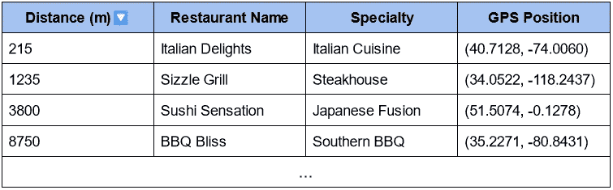

# （向量）索引的隐藏世界

> 原文：[`towardsdatascience.com/the-hidden-world-of-vector-indexes-f320a626c3dd?source=collection_archive---------2-----------------------#2023-11-15`](https://towardsdatascience.com/the-hidden-world-of-vector-indexes-f320a626c3dd?source=collection_archive---------2-----------------------#2023-11-15)

## 你总是想了解关于（向量）索引的所有信息，但又害怕询问。

 [Olivier Ruas](https://medium.com/@oruas?source=post_page-----f320a626c3dd--------------------------------)

·

[关注](https://medium.com/m/signin?actionUrl=https%3A%2F%2Fmedium.com%2F_%2Fsubscribe%2Fuser%2Ffac3becb3fd6&operation=register&redirect=https%3A%2F%2Ftowardsdatascience.com%2Fthe-hidden-world-of-vector-indexes-f320a626c3dd&user=Olivier+Ruas&userId=fac3becb3fd6&source=post_page-fac3becb3fd6----f320a626c3dd---------------------post_header-----------) 发表在 [Towards Data Science](https://towardsdatascience.com/?source=post_page-----f320a626c3dd--------------------------------) · 11 分钟阅读 · 2023 年 11 月 15 日

--

自从 ChatGPT 公开发布以来，几乎没有一天不讨论 LLM、RAG 和向量数据库。技术界对 LLM 的可能性感到兴奋，这被视为改变我们生活的最新技术：对一些人来说是最好的，对另一些人来说是最坏的。与此同时，检索增强生成（RAG）作为一种动态解决方案应对不断变化的知识领域。但在幕后有一个关键的角色：向量索引和数据库。

尽管 LLM、RAG 和向量数据库被广泛讨论，但支持这些创新的（向量）索引却鲜为人知。在这篇文章中，我们将揭示索引的概念，帮助你理解索引如何让在浩瀚的数据集中查找信息变得轻松自如。

# 1\. 什么是索引？

我们都遇到过这种情况。你正在你朋友家见面。她给你的唯一信息是“我住在地铁镇区”。当你到达所说的地铁镇区时：

摄影师 [Manson Yim](https://unsplash.com/@mansonyms?utm_source=medium&utm_medium=referral) 作品，来自 [Unsplash](https://unsplash.com/?utm_source=medium&utm_medium=referral)

好吧，没有任何帮助的话，找到她的地方会花费一段时间！如果入口处有一张地图就好了……

**这正是索引的目的：如何快速找到人们（或数据）的位置。**

> [黄页](https://www.yellowpages.com/) 是一个索引，允许你根据人们的名字查找他们的住址。

索引是一种数据结构，用于提高数据检索操作的速度。换句话说，它是你组织信息的方式，以便你能够快速找到你所寻找的内容。

数据是使用**键**进行索引的。排序基于键，且可以使用多个键。在黄页中，第一个键是姓氏，第二个键是名字。

索引不一定存储所有数据。它只关注于关键部分，以便快速定位和访问整个数据中的特定数据片段。

书籍末尾的索引是一个很好的例子：它向你展示了如何通过单词找到页码，因此它将每个单词映射到页码，而不是句子本身。

**索引是搜索引擎和数据库的背后：它们在提高数据检索操作的效率和速度方面发挥了关键作用。**

数据组织的选择至关重要，且取决于具体的上下文。

例如，在黄页的例子中，如果索引是按电话号码组织的，而你只知道名字，那么找到他们的地址将会相当具有挑战性！

信息在那里；你最终会找到它，但所需的时间会让你甚至不愿尝试。另一方面，使用黄页，只需一眼查看页面，你就可以准确知道是否需要往前或往后查找！字典顺序允许你进行大致对数级的搜索。这就是为什么索引的选择至关重要。

一般来说，索引有一个非常明确的目的：它可以被设计用于快速插入或检索数据，或者进行更复杂的查询，比如范围查询（“检索从今年 5 月 1 日到 8 月 15 日之间的所有数据”）。优化操作的选择将决定索引的样子。

在线事务处理（OLTP）数据库与在线分析处理（OLAP）数据库之间的主要区别在于它们想要优化的操作：OLTP 侧重于对行的操作（例如更新条目），而 OLAP 则侧重于对列的操作（例如计算平均值）。这两种数据库不会使用相同的索引，因为它们的操作目标不同。

# 1.1 索引和数据结构之间有什么区别？

💡[数据结构](https://w.wiki/7ma9)是组织和存储计算机数据的一种方式，以便可以高效地访问和操作数据。这样解释，索引和数据结构之间的区别有时很难看出，那么它们的区别是什么？索引专注于插入、搜索、排序或过滤数据。数据结构则更为通用。

**索引是使用数据结构构建的，但通常不存储数据本身。**

如果你考虑一个电影数据库，你不想在每次索引更新时移动大型文件：你存储的是*指针*，而不是文件本身。指针可以被看作是文件在磁盘上的地址。

现在你对什么是索引有了一个大概念，让我们专注于数字示例。以下是一些常见的（数字）索引：

+   倒排索引

+   哈希索引

+   B 树

+   局部敏感哈希（Locality-sensitive-Hashing, LSH）。

为了更好地理解索引如何工作，让我们探讨一种最基本的索引：倒排索引。

# 1.2 倒排索引

倒排索引是一种在搜索引擎中使用的标准索引。

它旨在快速找到信息：其目标是优化检索时间。

简而言之，倒排索引将内容映射到它们的位置，有点像书籍的索引。

它通常用于将特征映射到具有该特征的数据。

例如，假设你想知道谁住在同一栋楼里。

首先，你应该有一个表，其中对于每个名字，你都有建筑物（这个表会帮助你找到爱丽丝）：

这个表在每次有人到达或离开地区时都会更新。

如果你想找到谁住在这个表中的 B 栋楼，你必须遍历整个表。

虽然在技术上是可能的，但由于计算时间会随着表的大小线性增加，因此它不会扩展。

想想这个地区的公寓数量：如果你想通过一个个检查所有的档案来找到所有住在 B 栋楼的人，这会花费很长时间！

另一种解决方案是使用倒排索引：你维护一个表，其中建筑物作为键并与住在其中的人连接：

这个表与前一个表同时维护：添加或删除新人的成本比以前稍高，但检索时间几乎缩短为零！

要查找谁住在 B 楼，你只需要访问该表的“Building B”这一行，就能得到结果！

> 反向电话查询是电话号码的倒排索引！

实际上，倒排索引要复杂一些，因为它们处理的数据比（用户，兴趣）对要复杂得多。索引通常存储为[哈希表](https://w.wiki/7mdQ)。

尽管倒排索引相对简单，但它们是搜索引擎中最常用的索引之一。

# 1.3 索引和数据库

数据库是建立在索引之上的。索引通过存储指针或引用来增强数据库的数据检索。它不存储实际数据，而是作为一种快速访问数据的手段，大大提高了查询性能。

数据库不仅仅是索引，它是一个全面的数据管理系统。它存储、组织和管理实际数据，维护数据完整性，处理事务，并提供超越索引的各种功能，使其成为数据存储和操作的核心枢纽。虽然索引加快了数据库中的数据检索，但数据库作为数据存储、管理和检索的完整生态系统存在。

总结来说，索引就像数据库中的指示牌，指引你找到所需的数据。相反，数据库是实际数据所在的存储库，并配备了各种工具和功能来管理和操作这些数据。

根据你的使用场景，你可能不需要整个数据库，只需要索引，因为管理数据的覆盖层可能会很昂贵。

# 2\. 向量索引和向量数据库

# 2.1 什么是向量索引？

简而言之，**向量索引就是键是向量的索引**。

在我们的倒排索引示例中，键是单词（爱好和名字）。在向量索引中，我们处理的是向量：固定大小的数字序列。

两个大小为 4 的向量。

我知道，我知道，我能听到你说，“我数学不好，我不想使用向量”。

不用担心，你不需要擅长数学就能理解向量索引。

你只需要知道的是，使用向量可以依靠强大且优化的操作。

你可能会问自己第一个问题是，“你的向量有什么有趣之处”？

假设你终于找到了 Alice 的住处，现在你想找点东西吃。你可能会想找最近的餐馆。你会找一份餐馆列表，结果得到一张包含餐馆、特色菜和地址的表格。让我们来看看你可以找到的信息：

这看起来没什么帮助，对吧？你唯一的选择是逐一扫描列表，阅读地址，并手动评估它与你的距离有多近。我们可以尝试自动化最近地点的排名，但基于原始地址计算距离是困难的（两条街道可能相近但名称不同）。

不过，假设你现在有一个表，其中 GPS 位置表示每个餐馆的精确纬度和经度：

每个位置是一个大小为 2 的向量。利用这些向量，你可以通过一个简单的 *-而且快速-* 数学操作轻松计算到自己位置的距离。然后你可以迅速检索到最近的那些，也就是说，离你最近的那个！

现在你可以轻松找到离你最近的餐馆了！

有趣的是，通过直接按向量（在这个例子中是 GPS 位置）索引表，我们可以优化索引，使得查找距离最小的条目变得极其快速。

**向量索引是专门设计用于高效检索最接近或最相似于给定向量的向量的索引。这些索引依赖于优化的数学操作来高效地识别最相似的向量。**

在我们的例子中，使用的距离是经典距离，但对于所有现有的距离或相似性指标都有索引，例如余弦相似性度量。

[局部敏感哈希（LSH）](https://pathway.com/developers/showcases/lsh/lsh_chapter2) 是最广泛使用的索引之一，用于在数据集中找到 k 个最相似的数据点，并且它可以与不同的距离或相似性度量一起使用。

“这很好，但我在数据库中没有使用向量”。

这就是激动人心的部分：你可以将任何东西转换成一个向量。

仅仅使用二进制表示会很低效，因为它可能包含噪声，因此找到能够保留数据特征的表示是至关重要的。

将不同的信息表示为向量以使用向量索引已经成为提高系统效率的标准方法。向量化已经成为一门艺术。

例如，如果你有一个图像数据集，并且想要一个可以找到与给定图像最相似的图像的数据库，你可以使用图像的 SIFT 描述符。

# 2.2 向量索引和向量数据库之间有什么区别？

向量索引和向量数据库之间的区别就像索引和数据库之间的区别一样：索引旨在快速找到数据的位置，而向量数据库使用向量索引快速执行检索查询，但它们还存储和维护数据，同时提供附加操作和属性。

# 3\. LLMs 和 RAGs 之间的联系是什么？

现在你已经了解了向量索引，你可能会想为什么关于 LLMs 和 RAGs 的讨论也涉及到向量索引。要理解原因，我们首先快速解释一下什么是检索增强生成，或者说 RAG。RAG 作为 LLMs 固有局限性——即知识有限性——的巧妙解决方案。

LLMs 只知道它们接受训练的数据。提高它们知识的一种技术是*提示工程*，即将额外的数据整合到查询提示中：“给定这些数据{data}，回答这个问题：{question}”。

尽管有效，但这种方法面临一个新挑战：可扩展性。不仅提示的大小有限，包含的数据越多，查询的成本也就越高。

为了克服这个问题，检索增强生成通过只插入最相似的数据来限制数据的数量，这就是向量索引发挥作用的地方！

它的工作原理是：所有文档最初都通过 LLMs（1）转换为向量。具体来说，是 LLM 的编码器部分被使用。

这些向量被用作在向量索引中索引文档的键（2）。

在进行查询时，查询会使用 LLM 进行向量化（3）。然后，将结果向量在向量索引中查询，以检索最相似的文档（4）。这些文档随后会通过提示工程（5）来回答查询。

检索增强生成（RAG）依赖于 LLMs 和向量索引。

就这些！

正如你所见，类似于 LLM，向量索引在 RAGs 中也占据着核心位置。

有些人更喜欢使用向量数据库而不是向量索引。这在你想在多个应用中重用相同数据时没问题。然而，如果你主要关注的是检索效率或在每个应用中定义索引的灵活性，那么单个向量索引通常更简单、更快速。

# 结论

恭喜那些勇敢地读到这里的人！我相信你现在已经具备了参与关于 LLMs 和 RAGs 的热情讨论所需的所有背景知识。

索引在数据检索中扮演着核心角色。由于数据检索可能仍将是数据技术中的关键组成部分，因此理解包括向量索引在内的索引是至关重要的。

如果你想了解更多高级索引，我建议你阅读[我关于 LSH 的文章](https://pathway.com/developers/showcases/lsh/lsh_chapter2)。如果你想了解一些更实用的内容，并且对实时检索增强生成（RAG）的实际应用感兴趣，可以考虑探索[LLM-app](https://github.com/pathwaycom/llm-app)，在这里你可以亲身体验这些技术的力量。
