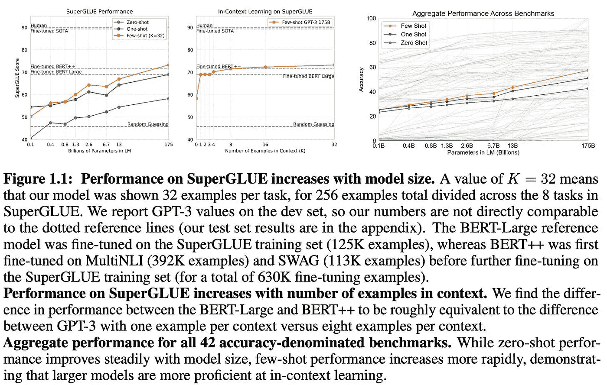

# 开源 LLM 的历史：早期阶段（第一部分）

> 原文：[`towardsdatascience.com/the-history-of-open-source-llms-early-days-part-one-d782bcd8f7e8?source=collection_archive---------8-----------------------#2023-11-07`](https://towardsdatascience.com/the-history-of-open-source-llms-early-days-part-one-d782bcd8f7e8?source=collection_archive---------8-----------------------#2023-11-07)

## 了解 GPT-Neo、GPT-J、GLM、OPT、BLOOM 等…

 [Cameron R. Wolfe, Ph.D.](https://wolfecameron.medium.com/?source=post_page-----d782bcd8f7e8--------------------------------)

·

[关注](https://medium.com/m/signin?actionUrl=https%3A%2F%2Fmedium.com%2F_%2Fsubscribe%2Fuser%2F28aa6026c553&operation=register&redirect=https%3A%2F%2Ftowardsdatascience.com%2Fthe-history-of-open-source-llms-early-days-part-one-d782bcd8f7e8&user=Cameron+R.+Wolfe%2C+Ph.D.&userId=28aa6026c553&source=post_page-28aa6026c553----d782bcd8f7e8---------------------post_header-----------) 发表在 [Towards Data Science](https://towardsdatascience.com/?source=post_page-----d782bcd8f7e8--------------------------------) · 20 min 阅读 · 2023 年 11 月 7 日

--

（图片由 [Chris Lawton](https://unsplash.com/@chrislawton?utm_content=creditCopyText&utm_medium=referral&utm_source=unsplash) 提供，来自 [Unsplash](https://unsplash.com/photos/stack-of-six-brown-hardbound-books-9T346Ij4kGk?utm_content=creditCopyText&utm_medium=referral&utm_source=unsplash)）

语言建模的研究有着悠久的历史，早期的模型如 GTP 和 GPT-2，甚至是基于 RNN 的技术（例如，[ULMFit](https://arxiv.org/abs/1801.06146)）都早于现代的基于变换器的语言模型。然而，尽管有着如此悠久的历史，语言模型的受欢迎程度却相对较晚。第一次受欢迎是由于 GPT-3 [1] 的提出，它展示了通过自监督预训练和上下文学习的结合可以在许多任务中实现令人印象深刻的少量学习表现；详见下文。

（来自 [1]）

在这之后，GPT-3 获得的认可促使了大量大语言模型（LLM）的提出。随后，语言模型对齐的研究导致了更令人印象深刻的模型的创建，如 InstructGPT [19] 和最著名的姊妹模型 ChatGPT。这些模型的卓越表现引发了对语言建模和生成性 AI 的极大兴趣。

尽管极其强大，许多早期 LLM 研究的发展都有一个共同的特点 — *它们是闭源的*…
