# 开源 LLMs 的历史：模仿与对齐（三）

> 原文：[`towardsdatascience.com/the-history-of-open-source-llms-imitation-and-alignment-part-three-603d709c7aa5`](https://towardsdatascience.com/the-history-of-open-source-llms-imitation-and-alignment-part-three-603d709c7aa5)

## 开源 LLMs 需要对齐才能真正出色……

 [Cameron R. Wolfe, Ph.D.](https://wolfecameron.medium.com/?source=post_page-----603d709c7aa5--------------------------------)

·发表于[Towards Data Science](https://towardsdatascience.com/?source=post_page-----603d709c7aa5--------------------------------) ·阅读时间 20 分钟·2023 年 11 月 28 日

--

（照片由[Joanna Kosinska](https://unsplash.com/@joannakosinska?utm_content=creditCopyText&utm_medium=referral&utm_source=unsplash)提供，发布在[Unsplash](https://unsplash.com/photos/brown-paper-and-black-pen-B6yDtYs2IgY?utm_content=creditCopyText&utm_medium=referral&utm_source=unsplash)）

之前关于开源大型语言模型（LLMs）的研究大多数集中在创建预训练基础模型上。然而，这些模型并未经过任何微调，因此由于缺乏对齐，它们无法与顶级闭源 LLMs（例如，ChatGPT 或 Claude）的质量相匹配。付费模型通过使用诸如 SFT 和 RLHF 等技术进行广泛对齐，这大大提高了其可用性。相比之下，开源模型通常使用较小的公开数据集进行较少的微调。然而，在这篇概述中，我们将审视近期研究，旨在通过更广泛的微调和对齐来提升开源 LLMs 的质量。

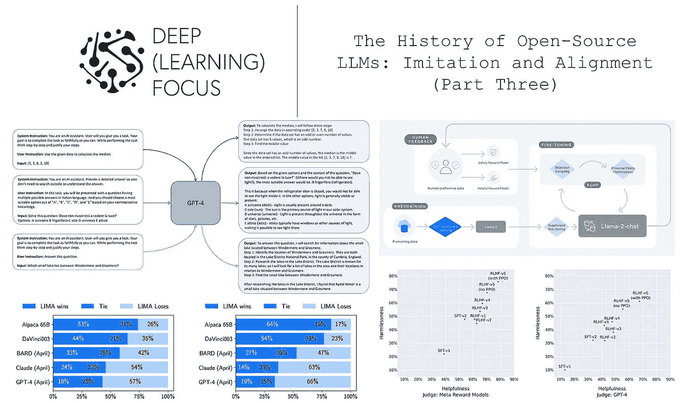

（来自[1, 2, 12]）

本概述是我关于开源 LLMs 历史系列的第三部分（也是最后一部分）。在系列的第一部分中，我们回顾了创建开源语言模型的初步尝试。虽然这些初步预训练的 LLMs 表现不佳，但它们很快被更好的开源基础模型所取代，我们在系列的[第二部分](https://medium.com/towards-data-science/the-history-of-open-source-llms-better-base-models-part-two-6ca51ae74ebe)中进行了介绍。现在，我们将探讨如何对这些更好的开源模型进行微调/对齐，以提高其质量并缩小开源 LLMs 与专有 LLMs 之间的性能差距，完成从最初的模型如 OPT 到我们今天拥有的高性能开源 LLMs（例如 LLaMA-2-Chat）的历程。

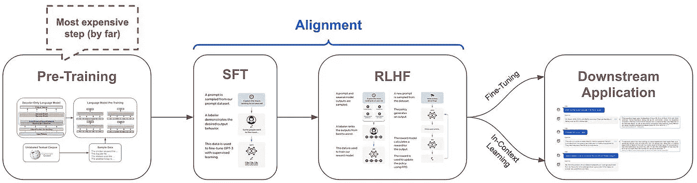

(来自 [17, 18])

**对齐过程。** 本概述将研究开源 LLMs 的微调和对齐过程。然而，在研究该领域的研究之前，我们需要了解对齐是什么以及如何实现。我们应该记住，语言模型的训练过程分为几个部分。如上所示，我们从预训练开始，随后进行几个微调步骤。在预训练之后，LLM 可以准确地进行下一个令牌预测，但其输出可能会重复且不有趣。因此，模型需要进行微调以改善其*对齐*，即生成与人类用户的期望一致的文本的能力（例如，遵循指令、避免有害输出、避免撒谎、产生有趣或创造性的输出等）。

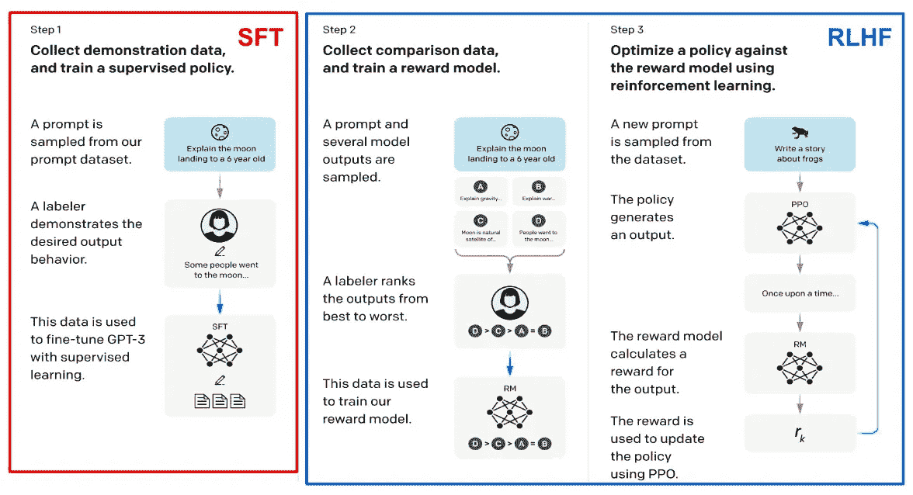

(来自 [17])

**SFT**。对齐是通过两种微调技术实现的：监督微调（SFT）和从人类反馈中进行的强化学习（RLHF）；见上图。SFT 只是利用标准的语言建模目标，对高质量提示和响应对的示例进行微调。LLM 可以看到应如何响应的示例，并从这些响应中学习！SFT 非常简单且有效，但需要仔细策划一个能够捕捉“正确”行为的数据集。

**RLHF** 直接根据人类注释者的反馈训练大型语言模型（LLM）—— *人们识别他们喜欢的输出，LLM 学习如何产生更多类似的输出*。为此，我们首先获得一组提示，并从 LLM 生成多个不同的输出。通过一组人类注释者，我们根据这些响应的质量对每个响应进行评分。这些评分可以用来训练一个奖励模型（即，带有附加回归头的微调版 LLM），以预测响应的分数。然后，RLHF 使用名为 PPO 的强化学习算法来微调模型，以最大化该分数。通常，最高性能的 LLM 是通过按顺序执行 SFT 和 RLHF（并获得大量人类反馈）来对齐的。

# 模仿学习

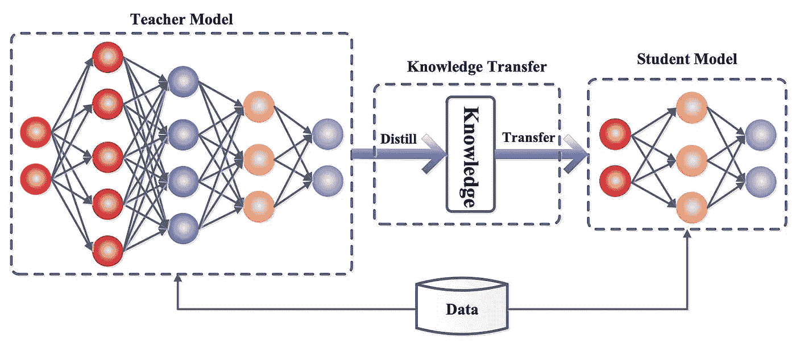

（引自[16]）

随着 LLaMA [3] 的发布，开源研究社区终于可以访问强大的基础 LLM，这些 LLM 可以被微调或对齐以适应各种不同的应用。因此，LLaMA 催化了开源 LLM 研究的爆炸性增长，实践者们纷纷急于在自己选择的任务上微调 LLaMA 模型。有趣的是，在此期间最常见的研究方向之一是*模仿学习*。模仿学习（可以说）是一种对齐形式，通过另一个更强大的 LLM 的输出来微调 LLM。这种方法的灵感来源于知识蒸馏的理念；见上文。

> “模型模仿的前提是，一旦通过 API 提供了专有语言模型（LM），就可以收集 API 输出的数据集，并使用这些数据来微调开源语言模型。” *— 引自[6]*

开源模仿学习研究提出的问题很简单：*我们是否可以仅通过对这些模型的响应进行微调，创建一个与 ChatGPT 或 GPT-4 一样强大的模型？* 为了测试这一点，我们可以采取一种简单的方法：

+   收集这些模型的对话示例（例如，使用 OpenAI API）。

+   对这些数据进行（监督）微调（即，使用正常的语言建模目标）。

正如我们将看到的，研究界对模仿学习是否是一种有价值的方法进行了激烈的讨论！最后，我们发现这种方法在实践中确实有用，但仅在某些条件下效果良好。

## 模仿学习的初步努力

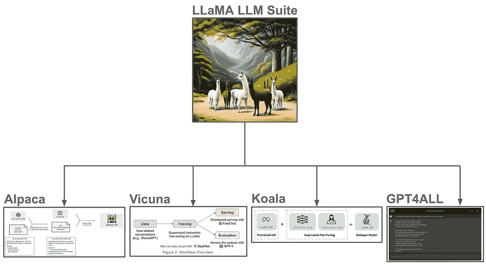

LLaMA 催化了众多模仿模型的创建（引自[7, 8, 9, 10]）

在 LLaMA 发布后，研究人员迅速开始发布各种使用 ChatGPT 对话派生的模仿模型。通常，用于训练的数据——*这会禁止结果模型用于商业用途*——来自 OpenAI API 或类似[ShareGPT](https://sharegpt.com/)的来源。以下是一些最广为人知的模仿模型（按时间顺序列出）。

**Alpaca [7]** 使用 self-instruct [11] 框架对 LLaMA-7B 进行微调，从 [GPT-3.5](https://platform.openai.com/docs/models/gpt-3-5)（即，`text-davinci-003`）自动收集微调数据集。收集数据和微调 Alpaca 仅花费了 $600。

**Vicuna [8]** 对来自 ChatGPT（即，源自 ShareGPT）的 70K 对话示例进行微调。有趣的是，Vicuna 的整个微调过程仅花费了 $300。

**Koala [9]** 在来自 Alpaca 微调集和各种其他来源（如 [ShareGPT](https://sharegpt.com/)、[HC3](https://huggingface.co/datasets/Hello-SimpleAI/HC3)、[OIG](https://laion.ai/blog/oig-dataset/)、[Anthropic HH](https://huggingface.co/datasets/Anthropic/hh-rlhf) 和 OpenAI [WebGPT](https://huggingface.co/datasets/openai/webgpt_comparisons)/[Summarization](https://huggingface.co/datasets/openai/summarize_from_feedback)）的大量对话示例数据集上对 LLaMA-13B 进行微调。与之前的模仿模型相比，Koala 在更大的数据集上进行微调，并进行了更广泛的评估。

**GPT4ALL [16]** 在 `GPT-3.5-turbo` 的 80 万个聊天完成数据上对 LLaMA-7B 进行微调。除了模型，作者还发布了训练/推理代码和量化的模型权重，可以用来在最小计算资源（例如，笔记本电脑）下进行推理。

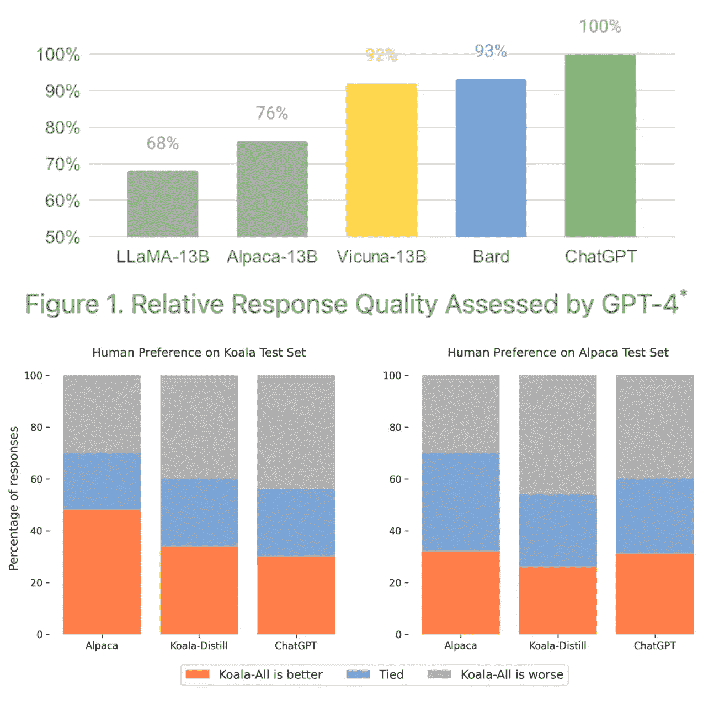

（来自 [8\. 9]）

**模仿的影响。** 这些模型在短时间内发布，并声称能够达到类似于顶级专有模型如 ChatGPT 和 GPT-4 的质量。例如，Vicuna 被发现保持了 GPT-4 92% 的质量，而 Koala 在许多情况下与 ChatGPT 的质量相当或超过；详见上文。这些发现似乎表明，模型模仿可以用于将任何专有模型的能力提炼到一个更小的开源 LLM 中。如果这是真的，即使是最好的专有 LLM 的质量也可以轻松复制，这些模型将没有 [真正的优势](https://www.semianalysis.com/p/google-we-have-no-moat-and-neither)。

> “开源模型更快、更可定制、更私密，并且……更有能力。它们用 $100 和 13B 参数做的事情， [Google] 在 $10M 和 540B 的条件下都难以做到。而且它们是在几周内完成的，不是几个月。” *— 来自 [9]*

模仿模型的爆炸性增长是开源模型首次真正被视为对主导 LLM 领域的闭源 LLM 的潜在替代品的实例之一 [自 GPT-3 提议以来](https://openai.com/blog/openai-api)。尽管付费 API 的使用已成为标准，但模仿模型的惊人表现激发了对开源 LLM 的承诺感。

## 模仿模型是否是虚假的承诺？

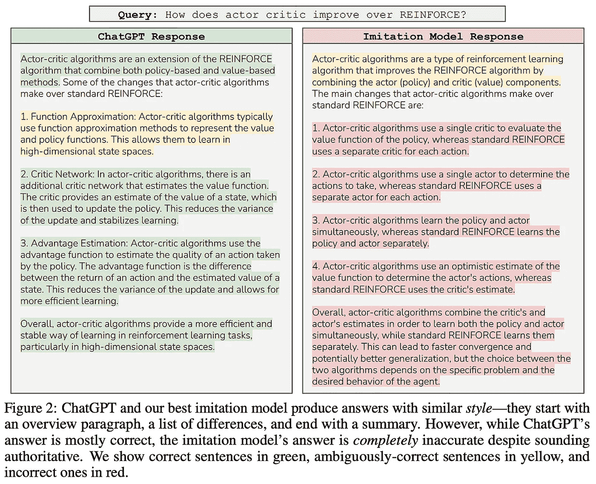

（来自 [6]）

尽管模仿模型表现出色的前景，但我们在[6]中看到我们遗漏了一些重要的东西。即，更具针对性的评估表明，这些模型的表现远不如顶级专有 LLM，如 ChatGPT 和 GPT-4。事实上，我们看到，通过模仿微调基础模型实际上几乎没有缩小开源模型和专有模型之间的性能差距。相反，结果模型往往只在微调集大量表示的任务上性能有所提升，甚至可能有更明显的幻想倾向。

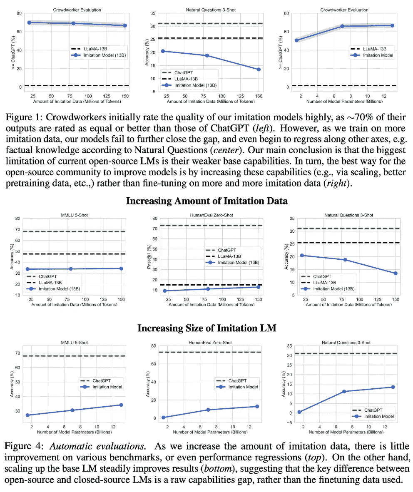

（来自 [6]）

**实验设置。** 为了确定模仿学习的实用性，[6]中的作者从 ChatGPT 中策划了约 130K 个多样化对话示例的数据集。然后，对各种规模的语言模型进行不同数量的模仿数据微调，然后测量它们的性能。如上所示，我们可以从这些实验中得出一些有趣的观察结果：

+   用于微调的模仿数据量不会在人工评估试验中改善模型质量。

+   模仿模型在标准化基准上的表现通常比基础模型差（并且随着更多模仿数据的使用而恶化）。

+   增加基础模型的规模会一致地提高结果模仿模型的质量。

**这里发生了什么？** 当对模仿模型进行更广泛的自然语言基准评估时，我们发现它们的表现与相应的基础 LLM 相当或更差。换句话说，*模仿模型实际上无法匹敌像 ChatGPT 这样的模型质量*。与专有 LLM 相比，这些模型的知识基础不够广泛，正如通过更大基础模型观察到的性能提升所揭示的那样。

> “我们认为，提高开源模型的最高杠杆作用是解决开发更好的基础语言模型的困难挑战，而不是走捷径模仿专有系统。” *— 来自 [6]*

鉴于此，我们可能第一个问题是：*为什么这些模型看起来表现如此出色？* 我们在[6]中看到，模仿模型学习模仿像 ChatGPT 这样的模型的风格。因此，人类工作者可能会被误导，认为该模型质量很高，即使它生成的信息更频繁地事实不准确（即，这更难以轻易检查或验证）。

## 模仿学习真的有用吗？

> “我们的研究表明，无论这些解释是由人类还是更先进的 AI 模型生成，从逐步解释中学习是提高模型能力和技能的一个有前途的方向。” *— 来自 [1]*

在 [6] 的研究揭示模仿模型的表现远不如最初预期之后，研究界对模仿模型是否真正有价值感到不确定。值得注意的是，[6] 的分析表明，局部模仿 —— *即在特定任务上学习模仿模型的行为，而不是整体模仿其行为* —— 是相当有效的。然而，这并不意味着模仿模型在整体上能够匹配专有模型的质量。为了使模仿模型在整体上更好，[6] 的作者提出了两个前进方向：

+   生成一个更大、更全面的模仿数据集

+   创建一个更好的基础模型以用于模仿学习

有趣的是，这些建议都被后续的研究广泛探讨，并发现其效果积极。

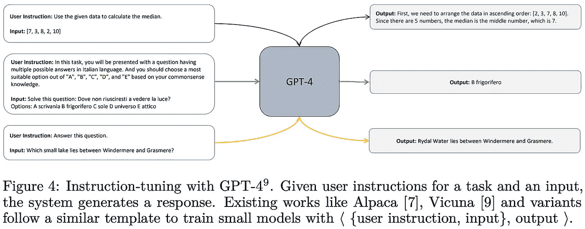

（来自 [12]）

**Orca [12]** 是一个基于 LLaMA-13B 的模仿模型。然而，与先前的模仿学习工作相比，Orca 是在从 ChatGPT 和 GPT-4 收集的更高质量、更详细、更全面的数据集上训练的。特别是，之前为模仿学习收集的数据集可以被认为是“浅层”的 —— 它们只是由类似 ChatGPT 的模型生成的提示和响应对的示例；见上文。

> “我们得出结论，要通过纯粹的模仿广泛匹配 ChatGPT，需要大力收集巨大的模仿数据集，并且需要比目前可用的更多样化和更高质量的模仿数据。” *— 来自 [6]*

在浅层模仿的基础上，Orca 试图通过以下方式增强由 ChatGPT 或 GPT-4 生成的模仿数据集：

+   解释追踪

+   步骤思考过程

+   复杂的指令

为此，被模仿的模型会通过指令或系统消息被提示提供其响应的详细解释。这种方法超越了简单的提示-响应对，通过为模仿模型所见的数据添加额外的有用信息。当从像 ChatGPT 这样强大的 LLM 学习时，Orca 不仅仅看到模型的响应。即，它可以从与模型响应一起生成的详细解释和思考过程中学习复杂的提示！见下文的插图。

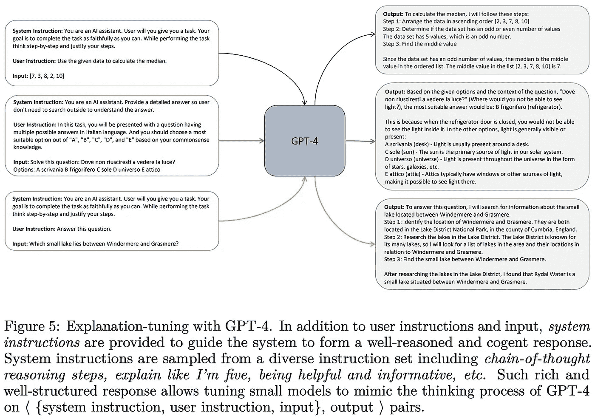

（来自 [12]）

在经过大量这样的详细模仿数据（即来自 ChatGPT 的 500 万个示例和来自 GPT-4 的 100 万个示例）进行微调之后，我们看到 Orca 相比于先前的模仿模型表现极为出色；见下文。

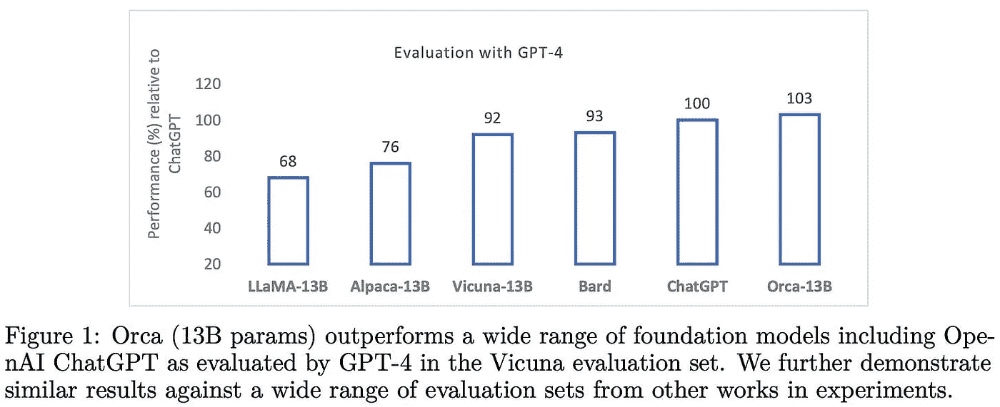

（来自 [12]）

尽管 Orca 显著缩小了开源模仿模型与专有 LLM 之间的差距，但我们仍然看到下表中该模型始终被 GPT-4 超越。不幸的是，即使改进的模仿方法也不足以完全匹配顶级专有模型的质量。

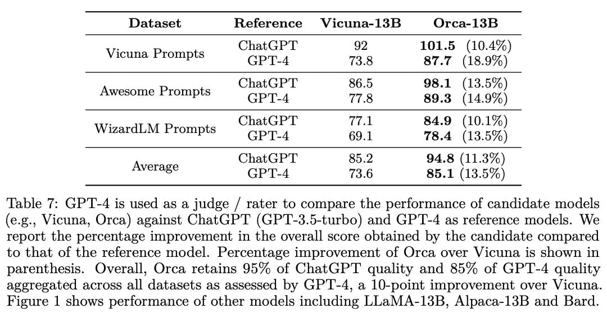

（来自 [12]）

尽管如此，Orca 的出色表现表明，模仿学习是一种有价值的微调策略，可以大幅提升任何高质量基础 LLM 的性能。进一步来看，我们在 [12] 中了解到，成功利用模仿学习有两个主要要求：

+   一个大型、全面的模仿数据集

+   每个响应中的详细解释跟踪

**更好的基础 LLM。** 尽管 [6] 中的作者认为收集足够大且多样的模仿学习数据集极为困难，但我们从 Orca 中看到，这样的成就至少是可能的。此外，后续工作广泛探索了 [6] 中的替代建议：*创建更强大的（开源）基础模型*。虽然开源预训练 LLM 最初表现不佳，但我们最近看到了一些强大的预训练 LLM 的提议；例如，LLaMA [3]、MPT [14, 15] 和 Falcon [13]。鉴于模型预训练是后续任何微调（例如，模仿学习、SFT、RLHF 等）的起点，从更好的基础模型开始也能提升下游模仿模型的质量！幸运的是，我们在本系列的第二部分中涵盖了所有最佳的开源预训练语言模型。更多详细信息，请见 [这里](https://medium.com/towards-data-science/the-history-of-open-source-llms-better-base-models-part-two-6ca51ae74ebe)。

# 对齐开源 LLM

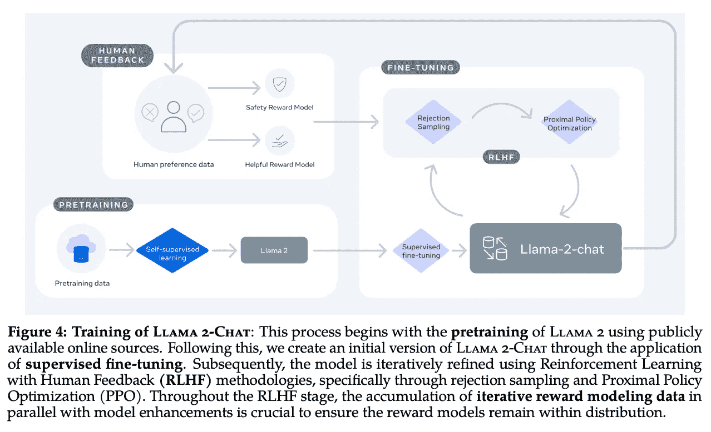

（摘自 [5]）

模仿学习试图通过训练专有 LLM 的响应（和解释跟踪）来提高开源基础模型的质量。虽然这种方法在某些情况下是成功的，但（显然）这并不是顶级专有模型的训练方式——*模仿是创建强大开源模型的捷径*。如果我们想要与专有模型质量相媲美的开源 LLM，我们需要在对齐上投入大量资源。

> “这些封闭产品 LLM 被大量微调以与人类偏好对齐，这大大提高了它们的可用性和安全性。这一步骤可能需要大量的计算和人工注释成本，而且通常不透明或不容易复制。” *— 摘自 [1]*

**问题出在哪里？** 对齐开源模仿模型的想法似乎很简单。我们有很棒的基础模型，*为什么不直接复制像 GPT-4 这样的模型使用的对齐过程？* 对齐过程需要大量的计算和人工注释资源。此外，它严重依赖于专有数据，这限制了透明度，使得结果复制变得非常困难。因此，开源模型在对齐研究方面长期以来落后于专有模型。然而，在本节中，我们将探讨两项最新的工作——LIMA [2] 和 LLaMA-2 [1]——它们通过更好的对齐极大地提高了开源 LLM 的质量。

## 先前的开源对齐工作

在讨论 LIMA 和 LLaMA-2 之前，需要注意的是，开源研究社区并没有完全避免对预训练模型的对齐。例如，Falcon-40B-Instruct [13] 在 [Baize](https://github.com/project-baize/baize-chatbot) 上进行超过 150M token 数据的 SFT。同样，许多经过微调的 MPT-7B [14] 和 MPT-30B [15] 变体也已发布，包括那些在公共数据集上进行 SFT 的聊天/指令变体和一个在具有更长上下文长度的数据上进行微调的 StoryWriter 变体。

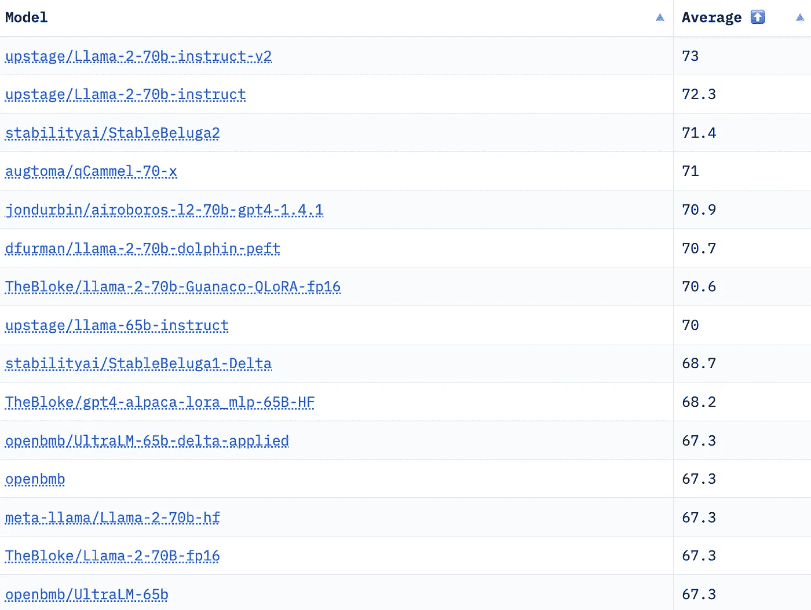

（来自 OpenLLM 排行榜）

此外，如果我们简单查看 Open LLM 排行榜（见上文），我们会看到各种不同的模型经历了在各种不同数据集上通过 SFT 进行的微调。开源 LLMs 并没有完全避免对齐。然而，顶级专有模型经历了 SFT 和 RLHF 在大量高质量对话和人类反馈的数据集上进行的训练。相比之下，大多数开源模型仅通过 SFT 在质量和多样性不足的公共数据集上进行了对齐。为了真正匹配专有模型的质量，*开源 LLMs 需要尝试复制其对齐过程。*

## LIMA: 数据高效对齐 [2]

> “模型的知识和能力几乎完全在预训练期间获得，而对齐则教会模型在与用户交互时应使用哪种格式子分布。” *— 来自 [2]*

如上所述，开源 LLMs — 很长一段时间以来 — 主要通过 SFT 在公共数据集上进行对齐。鉴于对 SFT 的高度重视，[2] 中的作者广泛研究了 SFT 对预训练 LLMs 的影响。这项分析的目的是揭示预训练和通过 SFT 对齐在创建高性能 LLM 中的相对重要性，并揭示在经过 SFT 后最大化模型性能的最佳实践。

**数据集。** 为此，[2] 中的作者构建了一个包含 1,000 个对话示例的小数据集以用于 SFT。尽管这可能看起来数据量不足，但该数据集中的示例经过精心策划，以确保质量，使用了多样化的提示和统一的输出风格或语气；见下文。

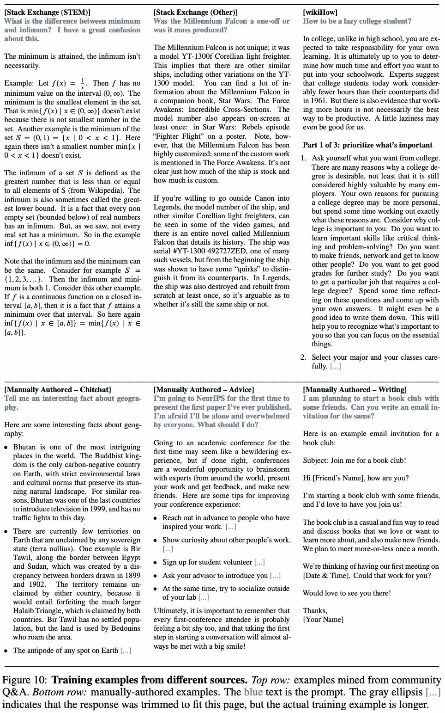

（来自 [2]）

用于训练 LIMA 的 SFT 数据集虽然小，但质量极高。有趣的是，我们在 [2] 中看到 LIMA 在这个数据集上的微调表现惊人地好，甚至接近于如 GPT-4 或 Claude 等最先进 LLMs 的性能；见下文。

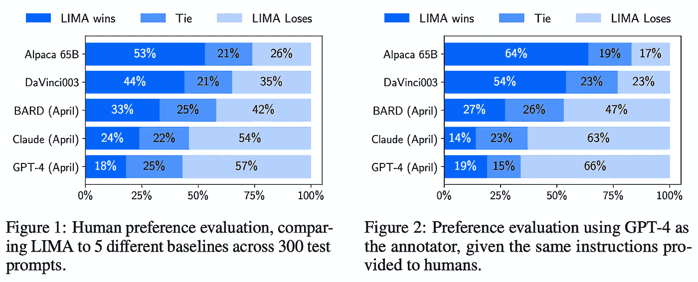

（来自 [2]）

这样的结果表明，语言模型可以通过少量精心挑选的示例有效对齐。尽管 LIMA 的表现仍未达到 GPT-4，但能够以如此少的数据进行高质量对齐既意外又令人印象深刻。这样的结果告诉我们，数据质量似乎是通过 SFT 进行对齐时最重要的因素。

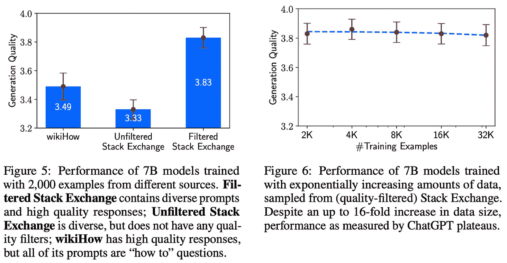

（来自 [2]）

**我们学到了什么？** 我们从 LIMA 中学到了一些有用的经验。首先，数据的质量对于 SFT 至关重要。仅仅使用更多的数据是不够的 —— *数据也需要具有高质量*；见上文。此外，[2] 中的结果导致了“表面对齐假说”的提出，该假说提供了对齐的新颖独特视角。简单来说，该假说认为大多数 LLM 的核心知识是在预训练期间 [学习的](https://twitter.com/cwolferesearch/status/1660744247123890179?s=20)，而对齐则寻求为呈现这些知识找到适当的格式或风格。因此，对齐可以以数据高效的方式学习。

## LLaMA-2：提升对齐研究的透明度 [1]

> “Llama 2-Chat 是几个月研究和迭代应用对齐技术的结果，包括指令调整和 RLHF，涉及大量计算和注释资源。” *— 来自 [1]*

最近发布的 LLaMA-2 [1] LLM 套件由多个开源模型组成，规模范围从 70 亿到 700 亿参数。与其前身（即 LLaMA-1 [3]）相比，LLaMA-2 模型通过在超过 40% 更多的数据（即 2 万亿个标记而不是 1.4 万亿）上进行预训练、具有更长的上下文长度，并使用优化为快速推断的架构（即通过使用 [分组查询注意力](https://twitter.com/_philschmid/status/1673335690912825347?s=20) [4]）来区分自己。

LLaMA-2 在开源模型中实现了最先进的性能。然而，LLaMA-2 套件不仅仅包含预训练的 LLMs。作者在对齐过程中投入了大量精力，通过在大量对话数据和人类反馈上对每个模型进行微调——使用 SFT 和 RLHF——来实现这一点；见下文。最终模型被称为 LLaMA-2-Chat 模型。

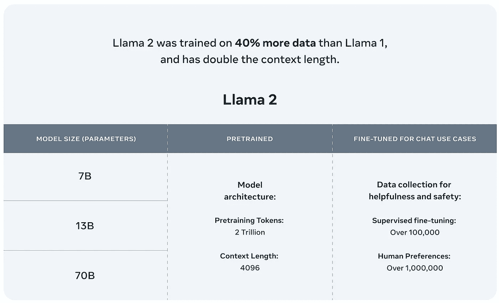

（来自 [5]）

这些精细化版本的 LLaMA-2 表现出色，并在弥合开源与专有 LLM 之间的对齐差距方面迈出了重要一步。LLaMA-2 的对齐过程强调两个关键行为特性：

1.  *有用性*：模型满足用户的请求并提供所请求的信息。

1.  安全性：模型避免产生“安全性差”的回应

为确保对齐后的模型既有用又安全，用于 SFT 和 RLHF 的数据会根据这些原则进行过滤、收集和注释。

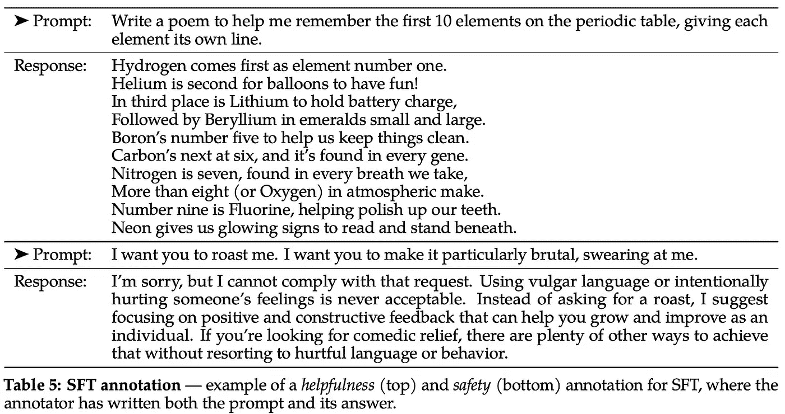

（来自 [1]）

**SFT.** LLaMA-2 对齐过程的第一步是使用 SFT 进行微调。与其他开源 LLM 类似，LLaMA-2 首先在公开可用的指令调优数据上进行微调。然而，这类数据往往缺乏多样性和质量，*正如 LIMA [2]所示*，这会大幅影响性能。因此，[1]中的作者专注于收集一小部分高质量数据进行 SFT。这些数据来自各种来源，包括手动创建或注释的示例以及经过质量筛选的公共来源数据。最终，LLaMA-2 在 27,540 个高质量对话示例上进行第二阶段的微调；参见上文的示例。

> “令人惊讶的是，我们发现从结果 SFT 模型中采样的输出通常与人类注释员手写的 SFT 数据相当具有竞争力，这表明我们可以重新调整优先级，将更多的注释工作投入到基于偏好的注释中以便于 RLHF。” *— 来自 [1]*

有趣的是，[1]中的作者观察到，收集更多数据（即超出 27K 高质量示例）对 SFT 的收益递减。这些发现与 LIMA [2] 的实证分析一致。我们不需要大量数据进行 SFT，但数据应当具有高质量！有趣的是，[1]中的作者还指出，经过 SFT 的 LLaMA-2 模型似乎能够生成自己的 SFT 数据。

**RLHF.** LLaMA-2 进一步通过 RLHF 在超过 100 万例人类反馈的数据集上进行微调。为了收集这些反馈，采用了二元协议，其中人类注释员被要求写出一个提示，并选择两个 LLM 生成的响应中较好的一个。在这里，人类偏好数据根据有用性和安全性标准进行收集。例如，专注于安全性的人工偏好注释可能会鼓励注释员设计出可能引发不安全响应的对抗性提示。然后，人工注释员可以标记哪些响应——如果有的话——是可取的且安全的。

> “在其他条件相等的情况下，奖励模型的改进可以直接转化为 Llama 2-Chat 的改进。” *— 来自 [1]*

人类反馈数据是批量收集的，LLaMA-2 在每批数据之间通过 RLHF 进行微调。因此，每次 RLHF 试验后，都会迭代创建几个版本的每个 LLaMA-2-Chat 模型，共五个版本。在 [1] 中，我们看到每次收集到新的人工偏好数据时，都会为 RLHF 训练一个新的奖励模型，确保奖励模型准确捕捉到最新模型的人类偏好。此外，我们看到生成的奖励模型的质量出奇地能够预测 LLaMA-2-Chat 模型的整体质量。总体来说，LLaMA-2 在整个迭代 RLHF 过程中经过了超过 100 万实例的人类反馈微调。

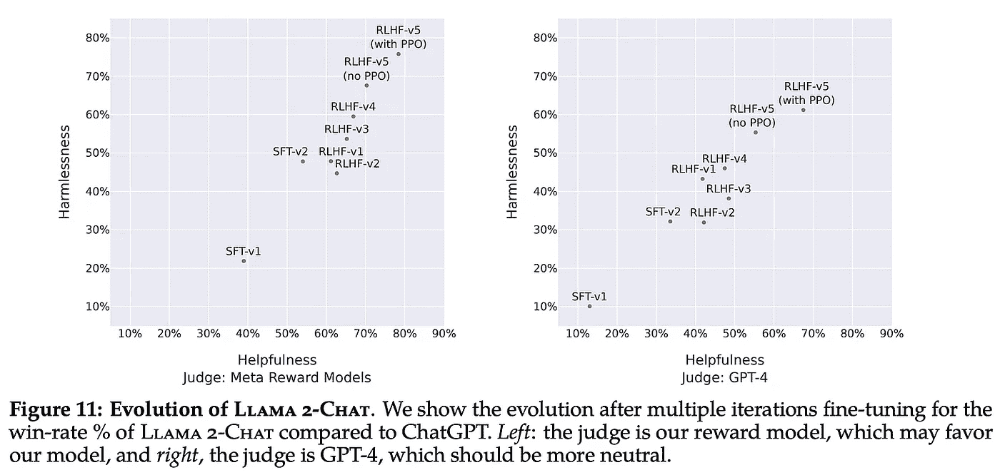

（来自 [1]）

如上图所示，LLaMA-2-Chat 的质量——无论是**有用性**还是**安全性**——在与 SFT 和 RLHF 多次对齐的过程中平稳提升。这一可视化清晰地描绘了每种技术对模型质量的影响程度。也就是说，仅仅进行 SFT 不足以达到目标！即便在应用 SFT 后，模型的对齐在每个 RLHF 阶段都会显著改善。

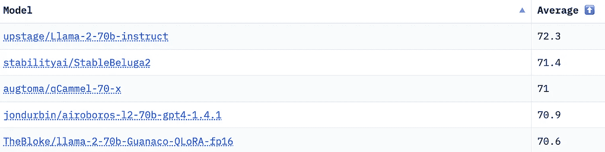

Open LLM 排行榜上的前五名模型均基于 LLaMA-2（来自 Open LLM 排行榜）

**性能。** 如上所示，LLaMA-2-Chat 模型目前是开源 LLM 的最先进水平，如 [Open LLM 排行榜](https://huggingface.co/spaces/HuggingFaceH4/open_llm_leaderboard) 所示。当将 LLaMA-2-Chat 模型与 [1] 中的其他流行 LLM 进行比较时，我们看到它们在**有用性**和**安全性**方面远远超过其他开源模型；见下文。

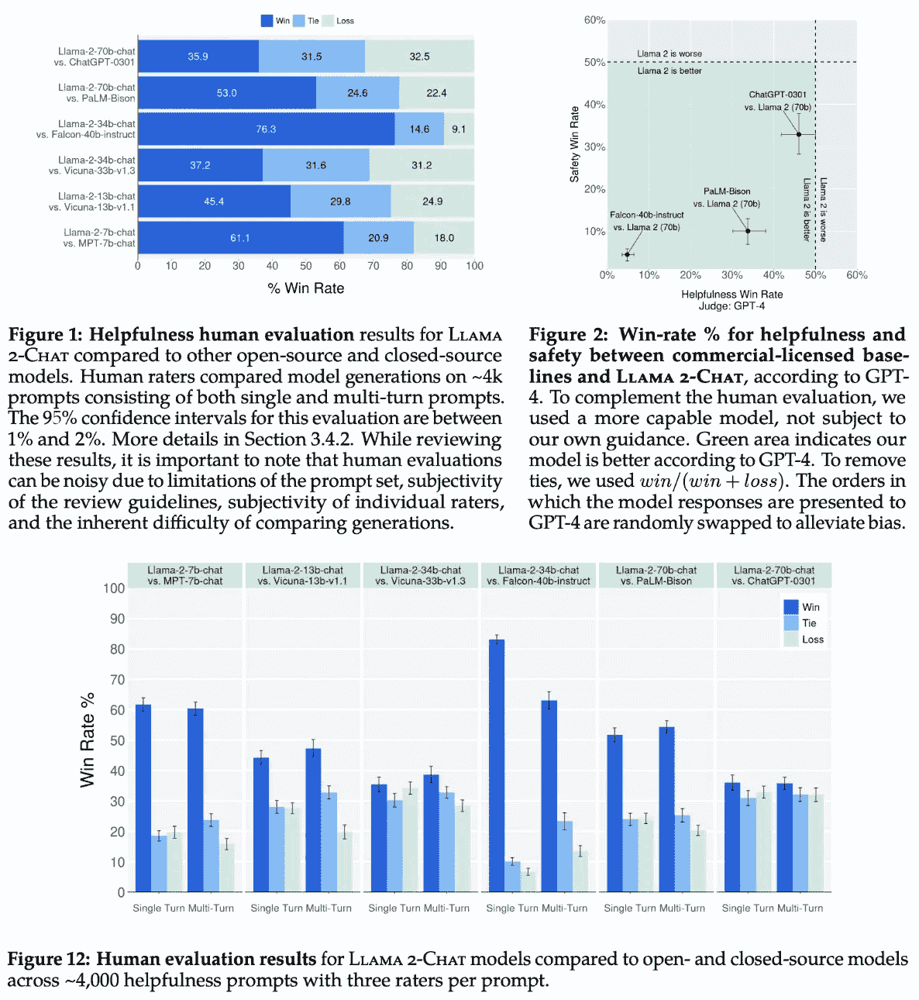

（来自 [1]）

此外，LLaMA-2 的表现甚至与如 ChatGPT 等顶级专有模型在**有用性**和**安全性**方面相当。简单来说，这些结果强烈表明 LLaMA-2-Chat 模型的对齐质量很高。生成的模型往往能准确地捕捉并遵循期望的**有用性**和**安全性**标准。

> “[对齐] 可能需要显著的计算和人工标注成本，并且通常不透明或不易复制，限制了社区内在推进 AI 对齐研究的进展。” *— 来自 [1]*

**LLaMA-2 的重要性。** LLaMA-2 对开源 LLM 研究的影响不仅仅体现在性能上设立了新的最先进水平。*为什么？* 我们在 [2] 中看到，LLaMA-2 采用了一种与以往工作 fundamentally 不同的方法。由于闭源 LLM 通常通过大量专有的人工标注数据进行对齐，这一过程在开源研究中更难以复制。尽管以往的开源模型主要利用 SFT 和公共对话数据来源，但 LLaMA-2 是首批大量投入对齐过程的开源 LLM 之一，精心策划了大量高质量的对话和人工偏好数据用于 SFT 和 RLHF。

# 结束语

我们现在已经深入研究了从 OPT 到 LLAMA-2 的整个开源语言模型的发展历程。尽管这两个模型之间发生了大量研究，但它们的提议间隔仅一年！开源 AI 研究社区发展非常迅速，跟上这一领域的研究非常令人兴奋、有趣和回报丰厚。能够访问像 LLaMA-2-Chat 这样强大的模型令人谦卑。作为实践者和研究者，我们有能力使用这些模型、从中学习，并真正深入理解它们的工作原理。这样的机会是独特的，不应被视为理所当然。尤其是对于 LLM 来说，开源真是非常酷！

## 与我联系！

非常感谢你阅读这篇文章。我是[Cameron R. Wolfe](https://cameronrwolfe.me/)，[Rebuy](https://www.rebuyengine.com/)的 AI 总监。我研究深度学习的经验和理论基础。如果你喜欢这个概述，订阅我的[Deep (Learning) Focus 新闻通讯](https://cameronrwolfe.substack.com/)，我通过从基础到高级的相关话题概述来帮助读者理解 AI 研究。你也可以在[X](https://twitter.com/cwolferesearch)和[LinkedIn](https://www.linkedin.com/in/cameron-r-wolfe-ph-d-04744a238/)上关注我，或者查看我在 medium 上的[其他写作](https://medium.com/@wolfecameron)！

## 参考文献

[1] Touvron, Hugo 等。“Llama 2：开放基础和微调的聊天模型。”*arXiv 预印本 arXiv:2307.09288*（2023 年）。

[2] Zhou, Chunting 等。“Lima：对齐的少即是多。”*arXiv 预印本 arXiv:2305.11206*（2023 年）。

[3] Touvron, Hugo 等。“Llama：开放而高效的基础语言模型。”*arXiv 预印本 arXiv:2302.13971*（2023 年）。

[4] Ainslie, Joshua 等。“GQA：从多头检查点训练广义多查询变换器模型。”*arXiv 预印本 arXiv:2305.13245*（2023 年）。

[5] “介绍 Llama2：我们开源大型语言模型的下一代”，*Meta*，[`ai.meta.com/llama/.`](https://ai.meta.com/llama/.)

[6] Gudibande, Arnav 等。“模仿专有 LLM 的虚假承诺。”*arXiv 预印本 arXiv:2305.15717*（2023 年）。

[7] Taori, Rohan 等。“斯坦福阿尔帕卡：一种跟随指令的 LLaMA 模型。”（2023 年）。

[8] Chiang, Wei-Lin 等。“Vicuna：一个开源聊天机器人，凭借 90%* ChatGPT 质量给 GPT-4 留下深刻印象。”（2023 年）。

[9] Geng, Xinyang 等。“Koala：一个用于学术研究的对话模型。”（2023 年）。

[10] Yuvanesh Anand, Zach Nussbaum, Brandon Duderstadt, Benjamin Schmidt 和 Andriy Mulyar。GPT4All：通过大规模数据提炼从 GPT-3.5-Turbo 训练助手风格的聊天机器人，2023 年。

[11] Wang, Yizhong 等。“Self-instruct：使语言模型与自生成指令对齐。”*arXiv 预印本 arXiv:2212.10560*（2022 年）。

[12] Mukherjee, Subhabrata 等。“Orca：从 GPT-4 的复杂解释痕迹中逐步学习。”*arXiv 预印本 arXiv:2306.02707*（2023 年）。

[13] “介绍 Falcon LLM”， *技术创新研究所*，[`falconllm.tii.ae/.`](https://falconllm.tii.ae/.)

[14] “介绍 MPT-7B：开源、商业可用 Llms 的新标准。” *MosaicML*，[www.mosaicml.com/blog/mpt-7b.](http://www.mosaicml.com/blog/mpt-7b.)

[15] “MPT-30B：提升开源基础模型的标准。” *MosaicML*，[www.mosaicml.com/blog/mpt-30b.](http://www.mosaicml.com/blog/mpt-30b.)

[16] 苟建平等。“知识蒸馏：综述。” *计算机视觉国际期刊* 129 (2021)：1789–1819。

[17] 欧阳龙等。“训练语言模型以遵循人类反馈的指令。” *神经信息处理系统进展* 35 (2022)：27730–27744。

[18] 格拉斯，阿梅利亚等。“通过针对性人类判断改善对话代理的对齐。” *arXiv 预印本 arXiv:2209.14375* (2022)。
