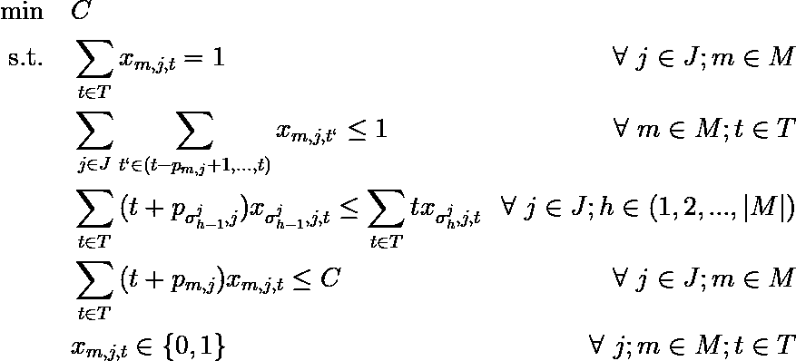

# 工作车间调度问题：混合整数规划模型

> 原文：[`towardsdatascience.com/the-job-shop-scheduling-problem-mixed-integer-programming-models-4bbee83d16ab?source=collection_archive---------0-----------------------#2023-03-07`](https://towardsdatascience.com/the-job-shop-scheduling-problem-mixed-integer-programming-models-4bbee83d16ab?source=collection_archive---------0-----------------------#2023-03-07)

## 经典排序问题的数学建模与 Pyomo 实现

[](https://medium.com/@bruscalia12?source=post_page-----4bbee83d16ab--------------------------------)[](https://towardsdatascience.com/?source=post_page-----4bbee83d16ab--------------------------------) [布鲁诺·斯卡利亚·C·F·莱特](https://medium.com/@bruscalia12?source=post_page-----4bbee83d16ab--------------------------------)

·

[关注](https://medium.com/m/signin?actionUrl=https%3A%2F%2Fmedium.com%2F_%2Fsubscribe%2Fuser%2F3ce9b7482ef0&operation=register&redirect=https%3A%2F%2Ftowardsdatascience.com%2Fthe-job-shop-scheduling-problem-mixed-integer-programming-models-4bbee83d16ab&user=Bruno+Scalia+C.+F.+Leite&userId=3ce9b7482ef0&source=post_page-3ce9b7482ef0----4bbee83d16ab---------------------post_header-----------) 发表在 [Towards Data Science](https://towardsdatascience.com/?source=post_page-----4bbee83d16ab--------------------------------) ·11 分钟阅读·2023 年 3 月 7 日[](https://medium.com/m/signin?actionUrl=https%3A%2F%2Fmedium.com%2F_%2Fvote%2Ftowards-data-science%2F4bbee83d16ab&operation=register&redirect=https%3A%2F%2Ftowardsdatascience.com%2Fthe-job-shop-scheduling-problem-mixed-integer-programming-models-4bbee83d16ab&user=Bruno+Scalia+C.+F.+Leite&userId=3ce9b7482ef0&source=-----4bbee83d16ab---------------------clap_footer-----------)

--

[](https://medium.com/m/signin?actionUrl=https%3A%2F%2Fmedium.com%2F_%2Fbookmark%2Fp%2F4bbee83d16ab&operation=register&redirect=https%3A%2F%2Ftowardsdatascience.com%2Fthe-job-shop-scheduling-problem-mixed-integer-programming-models-4bbee83d16ab&source=-----4bbee83d16ab---------------------bookmark_footer-----------)

图片由 [吉约姆·博尔杜克](https://unsplash.com/fr/@guibolduc?utm_source=medium&utm_medium=referral) 在 [Unsplash](https://unsplash.com/?utm_source=medium&utm_medium=referral) 提供

作业车间调度问题（JSSP）是一个广泛研究的优化问题，具有多种工业应用。目标是定义如何最小化分配共享资源（机器）所需的工期，以完成竞争活动（作业）。与其他优化问题一样，混合整数规划可以成为提供良好解决方案的有效工具，尽管对于大规模实例，可能需要使用启发式方法。

在本文中，你会发现两种最常见的混合整数规划 JSSP 表述，并用*pyomo*库（Bynum 等，2021）在 Python 中实现。对详细信息感兴趣的读者可以访问本[git 仓库](https://github.com/bruscalia/jobshop)获取完整代码。

如果你对混合整数规划或优化不熟悉，阅读这篇介绍后，你可能会有更好的理解。

[](/an-introduction-to-mixed-integer-linear-programming-the-knapsack-problem-1445452a9fe9?source=post_page-----4bbee83d16ab--------------------------------) ## 混合整数线性规划简介：背包问题

### 学习如何使用 scipy 和 pyomo 在 Python 中解决优化问题

towardsdatascience.com

现在让我们深入探讨一下！

# 问题陈述

假设一组作业*J*需要在一组机器*M*中按给定顺序处理。例如，作业编号 1 可能需要在机器（1, 4, 3, 2）中处理，而作业编号 2 则在（2, 3, 4, 1）中处理。在这种情况下，作业 1 在前往机器 4 之前必须先经过机器 1。类似地，作业 2 在前往机器 1 之前必须已经在机器 4 中处理过。

每台机器一次只能处理一个作业。操作由（机器，作业）对定义，每对有一个特定的处理时间*p*。因此，总的工期取决于如何分配资源来执行任务。

下图展示了一个简单实例的最佳操作顺序，该实例有 5 台机器和 4 个作业。注意每台机器一次只处理一个作业，每个作业一次只由一台机器处理。


三台机器和四个作业的问题示例。（图片由作者提供）。

与其他优化问题一样，我们必须将这些规则转换为数学方程式，以获得智能的资源分配。因此，在接下来的部分中，让我们看看 JSSP 的两种常见表述。

# 混合整数模型

根据 Ku & Beck (2016)的研究，将介绍两种 JSSP 模型：选择模型（Manne, 1960）和时间索引模型（Bowman, 1959; Kondili, 1993）。有兴趣的读者可以参考 Wagner (1959)的第三种模型（基于排名）。选择模型无疑是三者中最有效的。然而，其他模型在处理实际问题中可能更容易应对新出现的约束条件。

在选择模型中，假设我们有一个作业集*J*和一个机器集*M*。每个作业*j*必须遵循一个处理顺序（***σ****ʲ*₁, ***σ****ʲ*₂, …, ***σ****ʲₖ*），每个操作（*m*，*j*）有一个处理时间*p*。考虑的决策变量包括作业*j*在机器*m*上的开始时间*xₘⱼ*；一个二元变量标记作业*i*在机器*m*上优先于*j*的情况*zₘᵢⱼ*；以及操作的总完工时间*C*，这是最小化的目标。

我们需要创建约束条件来确保：

1.  机器*m*中作业*j*的开始时间必须大于作业*j*的上一个操作的开始时间加上其处理时间。

1.  每台机器一次只处理一个作业。为此，我们声明，如果*i*在机器*m*中优先于*j*，那么机器*m*中作业*j*的开始时间必须大于或等于作业*i*的开始时间加上其处理时间。

1.  每对作业*i*、*j*中必须有一个在每台机器*m*中优先于另一个。

1.  总完工时间大于每个操作的开始时间加上其处理时间。

然后我们得到以下模型：


作业车间选择模型。（图片由作者提供）。

其中，*V*是“非此即彼”约束条件的一个任意大值（大 M）。

下一种探讨的模型将是时间索引模型。它的限制在于只能考虑整数处理时间，并且可以注意到它生成了一个具有多个*非零*元素的约束矩阵，这使得它在计算上比选择模型更昂贵。此外，随着处理时间的增加，决策变量的数量也会增加。

在时间索引模型中，我们将考虑相同的作业集*J*和机器集*M*，以及一个离散时间区间集*T*。*T*的大小选择可以参考*V*的定义：所有处理时间的总和。还将使用相同的作业顺序和处理时间参数。然而，在这种方法中，我们只考虑标记作业*j*在机器*m*的时间点*t*开始的二元变量*xₘⱼₜ*，以及实际值（或整数）总完工时间*C*。

让我们制定约束条件：

1.  每个作业*j*在机器*m*上只能开始一次。

1.  确保每台机器一次只处理一个作业。这在时间索引方法中是一个难点。为此，我们声明在当前时间 *t* 和 *pₘⱼ* 之前的时间段内，每台机器 *m* 上最多只能有一个作业 *j* 开始。对于每台机器和每个时间点。

1.  作业 *j* 在机器 *m* 上的开始时间必须大于作业 *j* 上一个操作的开始时间加上其处理时间。

1.  总完成时间必须大于每个操作的开始时间加上其处理时间。



作业车间时间索引模型。（作者提供的图片）。

# 实现

在深入模型之前，让我们创建一些工具类来处理这个问题的参数。第一个将是 *JobSequence*，一个 Python *list* 的子类，具有查找序列中前后元素的方法。这在引用每个作业的机器序列时将非常有用。

```py
class JobSequence(list):

    def prev(self, x):
        if self.is_first(x):
            return None
        else:
            i = self.index(x)
            return self[i - 1]

    def next(self, x):
        if self.is_last(x):
            return None
        else:
            i = self.index(x)
            return self[i + 1]

    def is_first(self, x):
        return x == self[0]

    def is_last(self, x):
        return x == self[-1]

    def swap(self, x, y):
        i = self.index(x)
        j = self.index(y)
        self[i] = y
        self[j] = x

    def append(self, __object) -> None:
        if __object not in self:
            super().append(__object)
        else:
            pass
```

现在让我们创建一个白标类来处理参数。它必须存储作业集合 *J*、机器集合 *M*、每个作业 *j* 的操作顺序，保存在 *JobSequences* 的字典中，以及每对 *m* 和 *j* 的处理时间，保存在元组索引字典 *p_times* 中。

```py
class JobShopParams:

    def __init__(self, machines, jobs, p_times, seq):
        self.machines = machines
        self.jobs = jobs
        self.p_times = p_times
        self.seq = seq
```

最后，一个从给定的机器数量、作业数量和处理时间区间生成随机问题实例的类。

```py
import numpy as np

class JobShopRandomParams(JobShopParams):

    def __init__(self, n_machines, n_jobst, t_span=(1, 20), seed=None):

        self.t_span = t_span
        self.seed = seed

        machines = np.arange(n_machines, dtype=int)
        jobs = np.arange(n_jobs, dtype=int)
        p_times = self._random_times(machines, jobs, t_span)
        seq = self._random_sequences(machines, jobs)
        super().__init__(machines, jobs, p_times, seq)

    def _random_times(self, machines, jobs, t_span):
        np.random.seed(self.seed)
        t = np.arange(t_span[0], t_span[1])
        return {
            (m, j): np.random.choice(t)
            for m in machines
            for j in jobs
        }

    def _random_sequences(self, machines, jobs):
        np.random.seed(self.seed)
        return {
            j: JobSequence(np.random.permutation(machines))
            for j in jobs
        }
```

现在我们可以轻松地实例化随机问题来验证我们的模型。

在接下来的步骤中，我们将创建三个继承自 *pyomo’s ConcreteModel* 的类。第一个将是 MIP 模型的白标类。第二个和第三个将分别是分别是非线性模型和时间索引模型类。

```py
import pyomo.environ as pyo

class JobShopModel(pyo.ConcreteModel):

    def __init__(self, params, **kwargs):
        super().__init__()
        self.params = params
        self._construct_sets()
        self._construct_params()

    @property
    def seq(self):
        return self.params.seq

    def _construct_sets(self):
        self.M = pyo.Set(initialize=self.params.machines)
        self.J = pyo.Set(initialize=self.params.jobs)

    def _construct_params(self):
        self.p = pyo.Param(self.M, self.J, initialize=self.params.p_times)
        self.V = sum(self.p[key] for key in self.p)
```

可以注意到，作业集合 *J* 和机器集合 *M* 存储在同名的实例属性中。属性 *p* 保存处理时间，*V* 是合理的完成时间上限。

现在我们来创建不等式模型，即 *DisjModel* 类。

```py
class DisjModel(JobShopModel):

    def __init__(self, params, **kwargs):
        super().__init__(params, **kwargs)
        self._create_vars()
        self._create_cstr()
        self.obj = pyo.Objective(rule=self.C, sense=pyo.minimize)

    def _create_vars(self):
        self.x = pyo.Var(self.M, self.J, within=pyo.NonNegativeReals)
        self.z = pyo.Var(self.M, self.J, self.J, within=pyo.Binary)
        self.C = pyo.Var(within=pyo.NonNegativeReals)

    def _create_cstr(self):
        self.cstr_seq = pyo.Constraint(self.M, self.J, rule=cstr_seq)
        self.cstr_precede = pyo.Constraint(self.M, self.J, self.J, rule=cstr_precede)
        self.cstr_comp_precede = pyo.Constraint(self.M, self.J, self.J, rule=cstr_comp_precede)
        self.cstr_total_time = pyo.Constraint(self.J, rule=cstr_total_time)
```

*DisjModel* 实例包含了之前描述的变量的属性 *x*、*z* 和 *C*。目标非常简单：最小化其中一个决策变量：*C*。注意，我们仍然需要定义约束的规则。这些规则按引入模型时列出的顺序定义。现在让我们用 *pyomo* 风格编写它们。

```py
def cstr_seq(model, m, j):
    o = model.seq[j].prev(m)
    if o is not None:
        return model.x[o, j] + model.p[o, j] <= model.x[m, j]
    else:
        return pyo.Constraint.Skip

def cstr_precede(model, m, j, k):
    if j != k:
        return model.x[m, j] + model.p[m, j] <= model.x[m, k] + model.V * (1 - model.z[m, j, k])
    else:
        return pyo.Constraint.Skip

def cstr_comp_precede(model, m, j, k):
    if j != k:
        return model.z[m, j, k] + model.z[m, k, j] == 1
    else:
        return model.z[m, j, k] == 0

def cstr_total_time(model, j):
    m = model.seq[j][-1]
    return model.x[m, j] + model.p[m, j] <= model.C
```

我们已经准备好用不等式模型方法解决 JSSP 问题。让我们也定义时间索引模型。

```py
class TimeModel(JobShopModel):

    def __init__(self, params, **kwargs):
        super().__init__(params, **kwargs)
        self.T = pyo.RangeSet(self.V)
        self._create_vars()
        self._create_cstr()
        self.obj = pyo.Objective(rule=self.C, sense=pyo.minimize)

    def _create_vars(self):
        self.x = pyo.Var(self.M, self.J, self.T, within=pyo.Binary)
        self.C = pyo.Var(within=pyo.NonNegativeReals)

    def _create_cstr(self):
        self.cstr_unique_start = pyo.Constraint(self.M, self.J, rule=cstr_unique_start)
        self.cstr_unique_machine = pyo.Constraint(self.M, self.T, rule=cstr_unique_machine)
        self.cstr_precede = pyo.Constraint(self.M, self.J, rule=cstr_precede)
        self.cstr_total_time = pyo.Constraint(self.J, rule=cstr_total_time)

    def _get_elements(self, j):
        machines = [x.index()[0] for x in self.x[:, j, :] if x.value == 1]
        starts = [x.index()[2] for x in self.x[:, j, :] if x.value == 1]
        spans = [self.p[m, j] for m in machines]
        return machines, starts, spans
```

再次说明，约束是按照之前介绍的顺序定义的。我们也将用 *pyomo* 风格编写这些约束。

```py
def cstr_unique_start(model, m, j):
    return sum(model.x[m, j, t] for t in model.T) == 1

def cstr_unique_machine(model, m, t):
    total = 0
    start = model.T.first()
    for j in model.J:
        duration = model.p[m, j]
        t0 = max(start, t - duration + 1)
        for t1 in range(t0, t + 1):
            total = total + model.x[m, j, t1]
    return total <= 1

def cstr_precede(model, m, j):
    o = model.seq[j].prev(m)
    if o is None:
        prev_term = 0
    else:
        prev_term = sum(
            (t + model.p[o, j]) * model.x[o, j, t]
            for t in model.T
        )
    current_term = sum(
        t * model.x[m, j, t]
        for t in model.T
    )
    return prev_term <= current_term

def cstr_total_time(model, j):
    m = model.seq[j][-1]
    return sum((t + model.p[m, j]) * model.x[m, j, t] for t in model.T) <= model.C
```

我们已经准备好测试这些模型在一些随机生成的问题中的表现了！

# 结果

让我们实例化一个随机的 4x3 (*J*x*M*) 问题，看看我们的模型表现如何。

```py
params = JobShopRandomParams(3, 4, seed=12)
disj_model = DisjModel(params)
time_model = TimeModel(params)
```

为了解决这些示例，我将使用开源解算器 CBC。你可以从[AMPL](https://ampl.com/products/solvers/open-source-solvers/#cbc)或[这个链接](https://www.coin-or.org/download/binary/Cbc/)下载 CBC 二进制文件。你还可以在[这里](https://github.com/coin-or/Cbc)找到安装教程。由于 CBC 可执行文件已包含在我的系统的 PATH 变量中，我可以在不指定可执行文件路径的情况下实例化解算器。如果你的系统中没有设置 PATH 变量，请使用关键字参数“executable”并提供可执行文件的路径。

另外，也可以使用 GLPK 来解决这个问题（或任何其他兼容*pyomo*的解算器）。最新的 GLPK 版本可以在[这里](http://ftp.gnu.org/gnu/glpk/)找到，Windows 可执行文件可以在[这里](https://sourceforge.net/projects/winglpk/)找到。

```py
# Time limited in 20 seconds
solver = pyo.SolverFactory("cbc", options=dict(cuts="on", sec=20))

# solve
res_disj = solver.solve(disj_model, tee=False)
res_time = solver.solve(time_model, tee=False)
```

解算器在不到一秒的时间内顺利找到了判别模型的最优解，并证明了其最优性。


判别模型的结果。（图像由作者提供）。

然而，我们可以看到，即使对于这个简单的问题，解算器在 20 秒的限制内也未能找到时间索引模型的最优解。


时间索引模型的结果。（图像由作者提供）。

令人惊讶的是，通过重新排列数学方程式，两个具有相同思想的模型在性能上的差异。

顺便提一下，感兴趣的朋友可以在[这个仓库](https://github.com/bruscalia/jobshop)中找到完整的代码（包括图表）。

# 进一步阅读

对于较大的实例，由于问题的组合性质，即使是高性能的商业解算器，如 Gurobi 或 Cplex，也可能难以提供高质量的解决方案并证明最优性。在这种情况下，元启发式算法可能是一个有趣的替代方案。我建议感兴趣的读者查阅论文“[具有路径重连的并行 GRASP 用于作业车间调度](http://doi.org/10.1016/S0167-8191(03)00014-0)”（Aiex et al., 2003）和“[带有偏随机关键遗传算法的扩展 Akers 图形方法用于作业车间调度](https://doi.org/10.1111/itor.12044)”（Gonçalves & Resende, 2014）。我最近尝试实现了这些算法的简化版本，并获得了一些有趣的结果，尽管纯 Python 实现仍然耗时。你可以在[这个仓库](https://github.com/bruscalia/jobshop)中找到它们。

# 结论

在这篇文章中，实施并解决了两种不同的混合整数规划方法用于车间调度问题（JSSP），使用了 Python 库 *pyomo* 和开源求解器 CBC。尽管更复杂的现实世界模型可能与用于整合附加规则的时间索引形式类似，但离散模型被证明是原始 JSSP 的更好替代方案。用于这些示例的 [完整代码](https://github.com/bruscalia/jobshop) 供进一步使用。

# 参考文献

Aiex, R. M., Binato, S., & Resende, M. G. (2003). *用于车间调度的并行 GRASP 与路径重联*。并行计算，29(4)，393–430。

Bynum, M. L. 等，2021。*Python 中的 Pyomo 优化建模*。Springer。

Gonçalves, J. F., & Resende, M. G. (2014). *一种扩展的 Akers 图形方法与带偏差的随机密钥遗传算法用于车间调度*。国际运筹研究杂志，21(2)，215–246。

Kondili, E., & Sargent, R. W. H. (1988). *用于批量操作调度的通用算法*（第 62–75 页）。帝国学院化学工程系。

Ku, W. Y., & Beck, J. C. (2016). *用于车间调度的混合整数规划模型：计算分析*。计算机与运筹研究，73，165–173。

Manne, A. S. (1960). 车间调度问题。*运筹研究*，*8*(2)，219–223。

Wagner, H. M. (1959). 一个用于机器调度的整数线性规划模型。*海军研究物流季刊*，*6*(2)，131–140。
