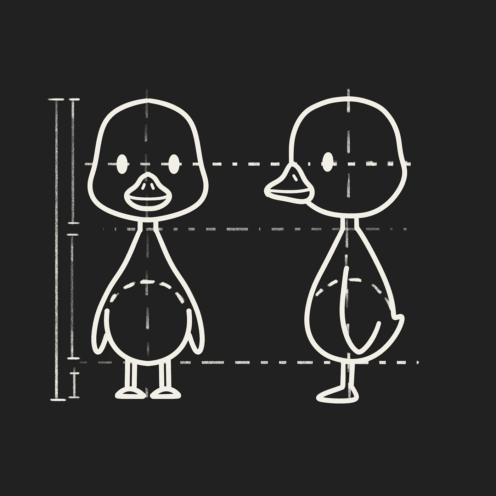
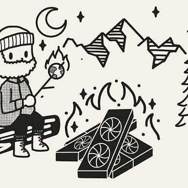
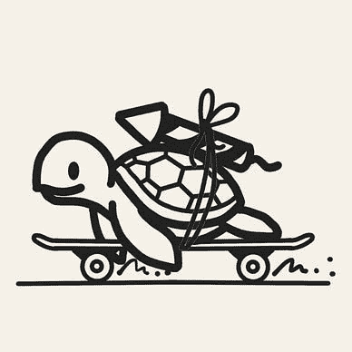
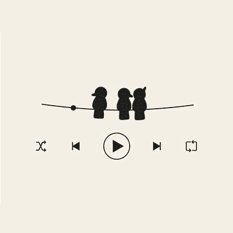

# Kaggle 蓝图：解锁数据科学竞赛获胜方法

> 原文：[`towardsdatascience.com/the-kaggle-blueprints-unlocking-winning-approaches-to-data-science-competitions-24d7416ef5fd`](https://towardsdatascience.com/the-kaggle-blueprints-unlocking-winning-approaches-to-data-science-competitions-24d7416ef5fd)

## Kaggle 蓝图

## 一系列分析 Kaggle 竞赛获胜解决方案的文章，以便我们可以将其应用于自己的数据科学项目

 [Leonie Monigatti](https://medium.com/@iamleonie?source=post_page-----24d7416ef5fd--------------------------------)

·发表于 [Towards Data Science](https://towardsdatascience.com/?source=post_page-----24d7416ef5fd--------------------------------) ·阅读时间 2 分钟·2023 年 3 月 1 日

--

Kaggle 蓝图（作者提供的图片）

如果你问任何成功的 Kaggle 参赛者，他们有什么建议来提升你的数据科学技能，他们都会给出相同的答案。他们会告诉你去学习已完成 Kaggle 竞赛的顶级解决方案。

[Kaggle](https://www.kaggle.com/) 是一个数据科学竞赛的平台，涉及各种类型的问题。竞争者通过构建机器学习模型并提交他们的预测来竞争。预测最准确的竞争者将获得奖励。

尽管竞争激烈，Kaggle 社区培养了一种学习的心态。平台本身鼓励在竞赛期间及之后公开分享方法。

因此，一个完成的 Kaggle 竞赛是最先进的机器学习技术学习资源的汇集。

我们可以区分两种类型的资源：

+   **竞赛期间分享的方法**（以讨论或笔记本形式）：展示各种不同方法来解决问题的资源

+   **竞赛截止后分享的解决方案**（以高层次的总结和 GitHub 上的代码形式）：展示哪些技术在问题上表现良好的资源

虽然这些资源本身通常结构良好，但在竞赛结束后，可能很难在众多资源中提取相关信息。

因此，本系列文章回顾并总结了在 Kaggle 竞赛中使用的最受欢迎和成功的技术。但它不会回顾特定问题设置的确切解决方案。相反，我们将分析 Kaggle 竞赛的获胜解决方案，并提取出我们可以应用于数据科学项目的“蓝图”。

> … [我们](https://medium.com/@iamleonie?source=post_page-----24d7416ef5fd--------------------------------)将分析 Kaggle 竞赛的获胜解决方案，并提取出我们可以应用于数据科学项目的“蓝图”。

如果你不想错过本系列中的新文章，你可以[免费订阅](https://medium.com/subscribe/@iamleonie)以便每次我发布新故事时获得通知。

你可以在这里找到本系列文章的集合：

[Leonie Monigatti](https://medium.com/@iamleonie?source=post_page-----24d7416ef5fd--------------------------------)

## Kaggle 蓝图：解锁获胜的方法

[查看列表](https://medium.com/@iamleonie/list/the-kaggle-blueprints-unlocking-winning-approaches-79c4222f75fb?source=post_page-----24d7416ef5fd--------------------------------)6 篇故事！
