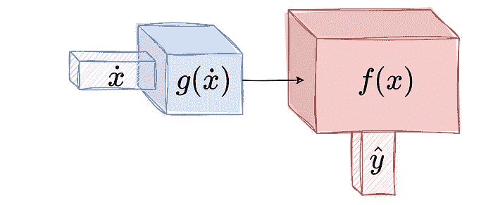

# 机器学习模型的生命周期

> 原文：[`towardsdatascience.com/the-lifetime-of-a-machine-learning-model-392e1fadf84a?source=collection_archive---------1-----------------------#2023-05-11`](https://towardsdatascience.com/the-lifetime-of-a-machine-learning-model-392e1fadf84a?source=collection_archive---------1-----------------------#2023-05-11)

## 它们何时出生，如何转变？

 [瓦莱里亚·冯塞卡·迪亚兹](https://medium.com/@valefonsecadiaz?source=post_page-----392e1fadf84a--------------------------------)

·

[关注](https://medium.com/m/signin?actionUrl=https%3A%2F%2Fmedium.com%2F_%2Fsubscribe%2Fuser%2F6e363caf1c79&operation=register&redirect=https%3A%2F%2Ftowardsdatascience.com%2Fthe-lifetime-of-a-machine-learning-model-392e1fadf84a&user=Valeria+Fonseca+Diaz&userId=6e363caf1c79&source=post_page-6e363caf1c79----392e1fadf84a---------------------post_header-----------) 发表在[Towards Data Science](https://towardsdatascience.com/?source=post_page-----392e1fadf84a--------------------------------) ·7 min read·2023 年 5 月 11 日

--

机器学习模型的生命周期（作者提供的图片）

你的模型在如何变化？

许多实体都有生命周期，生物体、惰性物体，以及如今的数字实体。对于第一类实体，我们知道它们何时出生，如何成长，以及何时死亡。对于第二类，即使它们没有生物学寿命，惰性物体也是从某物中产生的，它们也可以被转化为其他形态。至于第三类，数字实体何时出生，以及它们如何经历转变？

讨论数字实体的生命周期与讨论无生命物体的生命周期非常相似。我们可以想象一块岩石。岩石的形成有一个从熔岩开始的过程。然后，岩石可以通过许多方式变化。它可以在熔化后返回到熔岩点，或通过许多其他类型的转变而被分解。如果地质学太复杂，我们可以想想另一个工具，比如简单的铅笔。我们收集一些材料，如木材和抛光剂，然后我们*制作*一支铅笔。在被他人使用后，铅笔会被消耗、折断，甚至分裂成小块以制作迷你铅笔。我们的原始铅笔已经*经历了一段生命*。实际上，这个过程对于数字或虚拟实体，如我们的机器学习模型，并没有什么不同。

**模型诞生**

这些数字工具是在我们*构建、训练、拟合或估算*模型时诞生的。这个阶段几乎始于有了分析目标、数据、计算机、算法和数据科学家现在熟知的其他一切工具。不论你收集了哪些其他工具，永远不要忘记分析或科学目标，这样你的最终模型才有意义并服务于特定需求。你的模型何时诞生？当你完成训练并保存以备使用/部署时，这个工具的生命周期就开始了。

模型诞生（图片作者提供）

这位新生儿的未来是什么？这将取决于分析目标，这也是为什么我们在构建时不能忘记这部分。这个模型可能用于预测任务、指标解释或“假如”场景模拟等多种其他选择。这个工具将用于某些事情。可能是简单快速的，也可能是复杂、耗时且长期的。这样的使用将决定模型的余生。如果模型用于一次性参数解释，那么它的寿命不会太长。但如果模型用于预测，并且旨在服务于具有在线数据收集的系统，那么这位新生儿的寿命就长远了。那么接下来呢？

**维护模型**

随着我们继续使用模型，支持模型训练的数据条件将开始发生变化。正是在这种变化时刻，模型也会开始经历变化。如果我们构建一个用于流失预测的模型，并在训练时具有较高的预测准确率，那么在不久的将来或远期，预测客户的条件或行为会开始发生变化。这种变化挑战了我们已学习模型的预测性能。当这些变化发生时，我们的模型进入一个新的阶段，我们称之为*维护*。

在维护阶段，我们可能需要新的数据。通过新的数据，我们可以更新模型的规格。这与取另一台机器，比如一辆车，并在机械出现故障时调整零件没有区别。我们不会深入探讨执行模型维护的策略或解决方案，但一般来说，我们的模型需要经历一个调整过程，以使其恢复到令人满意的性能。

模型需要维护（图像由作者提供）

机器学习模型的维护与重新训练模型并不完全相同。有些模型可能简单到用更新的数据重新训练它们也很简单。这可能适用于线性架构或层数和神经元非常少的网络。但是当模型复杂且具有大型深度架构时，维护阶段需要远比重新训练模型的成本简单。[这是如今机器学习世界中最重要的话题之一，因为这些工具可能非常强大，但在长远看来维护费用却非常昂贵。](https://huyenchip.com/2022/02/07/data-distribution-shifts-and-monitoring.html)

一旦模型被调整或更新，它就可以重新投入使用，因此模型所服务的任何过程都可以继续使用更新后的版本。我们的机器可以继续*运行*。尽管如此，这台机器已经经历了变化。它已经被使用、消耗，可以说，它已经转变为与其原始状态略有不同的东西。就像铅笔一样，我们的模型在这些时刻中遇到需要削尖的时刻，以便保留它们，以便我们能继续使用它们。

**模型的转移**

在机器学习的道路上，有一个我们可能需要走的出口：转移。我曾经在美丽的冰岛旅行，当我第一次看到有人换车轮以便在冰冷的道路上行驶时，印象深刻。然后当他们回到城市时，又换回了普通的轮胎。当我开始研究转移学习时，那个在冰岛换轮胎的概念变得非常清晰。当新的环境/领域出现时，我们的模型进入了一个被称为*转移*的新阶段。

模型可以被转移（图像由作者提供）

就像相同的汽车可以通过更换轮胎适应不同的地面，而无需购买另一辆车，我们可以添加或调整模型的一些部分，以便在新领域中服务新目的，而不必构建新模型。迁移学习是机器学习文献中的另一个子领域，旨在优化模型的调整，以简化在新环境中训练模型的工作。常见的例子是图像识别模型。我们用某些类别的图像训练它们，然后其他人将这些模型迁移到识别新的图像类别。许多企业如今使用如 RegNet, VGG, Inception, 或 AlexNet 的模型，以适应他们的需求。

当我们转移一个模型时，从某种意义上说，一个新的模型诞生了，它有自己的生命周期，与原始模型分开。它将需要维护，就像原始模型一样。这样，我们从一个初始实体变成了可能创建出一个完整的模型种群。毫无疑问，这些数字工具背后确实有一个生命周期。

模型的种群。我们的模型会随着时间变化（图片来源于作者）

**我们的模型会*停止存在*吗？**

简短的回答是：是的。它们确实可能会停止存在，比如当它们的分析性能系统性地不令人满意，或者当它们变得如此庞大和不同，以至于原始模型已经成为过去的事物。如我们在开头所说，岩石、铅笔，甚至汽车也会在某个时刻停止存在。模型在这方面与这些事物没有什么不同。

尽管模型可能会灭绝，但何时到达这一点至今仍是我们希望在机器学习研究社区中解答的最大问题之一。监控机器学习性能和模型维护的许多进展都与模型何时不再功能性有关。

这个问题之所以不简单，是因为我们需要不断地使用标签来量化性能的满意度。但机器学习和统计学习的最大悖论正是标签不可用，而我们构建这些工具的目的是为了预测标签。另一个原因是定义性能变化的接受极限可能非常主观。尽管科学家可以提出一些极限，但企业可能有不同的容忍度。

以下是数据科学家在回答这个问题时也可以考虑的一些要点（带有当前的开放问题）：

+   训练数据是否过时？（什么是“过时”？）

+   当前版本与原始版本的模型有多相似？（什么是“相似”？）

+   输入特征的变化性和与目标变量的关系是否完全漂移？（协变量漂移和概念漂移是机器学习维护中的两个重要研究主题）。

+   模型部署的物理过程是否仍在使用中？如果物理基础设施不再支持模型的部署，这无疑标志着其生命周期的结束。

模型的结束并不一定是负面的，它也类似于其进化的路径。我们需要了解模型的生命周期，以保持我们的物理和数字系统的更新和满意的性能。

**总结：模型是随着时间的推移而出现和转变的机器**

+   当我们训练一个模型并开始使用它时，它便开始了它的生命周期。

+   简单的模型使用开启了简单的生命周期路径。复杂的使用则使我们的模型发生变化。

+   变更源于模型的维护。我们需要更新或修复它们。这将为我们带来一个新模型。

+   模型可以被转移。新的使用领域要求对模型进行调整。

+   模型的生命周期取决于其持续有效的性能和在我们系统中的适用性。

*愿模型长存！*
