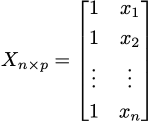

# 线性回归的矩阵代数

> 原文：[`towardsdatascience.com/the-matrix-algebra-of-linear-regression-6fb433f522d5?source=collection_archive---------3-----------------------#2023-05-03`](https://towardsdatascience.com/the-matrix-algebra-of-linear-regression-6fb433f522d5?source=collection_archive---------3-----------------------#2023-05-03)

## 查看线性回归背后的矩阵运算

 [Rob Taylor, PhD](https://medium.com/@dataforyou?source=post_page-----6fb433f522d5--------------------------------)

·

[关注](https://medium.com/m/signin?actionUrl=https%3A%2F%2Fmedium.com%2F_%2Fsubscribe%2Fuser%2F98de080592fc&operation=register&redirect=https%3A%2F%2Ftowardsdatascience.com%2Fthe-matrix-algebra-of-linear-regression-6fb433f522d5&user=Rob+Taylor%2C+PhD&userId=98de080592fc&source=post_page-98de080592fc----6fb433f522d5---------------------post_header-----------) 发布于 [Towards Data Science](https://towardsdatascience.com/?source=post_page-----6fb433f522d5--------------------------------) ·11 分钟阅读·2023 年 5 月 3 日

--

图片由 [Mingwei Lim](https://unsplash.com/@cmzw?utm_source=medium&utm_medium=referral) 提供，来源于 [Unsplash](https://unsplash.com/?utm_source=medium&utm_medium=referral)

## 介绍

对大多数人来说，简单线性回归是理解基于模型的估计和模型比较的常见起点。无论你是在学习入门统计学还是数据科学课程，你都可以肯定线性回归会在某个时刻出现。这是有充分理由的。

简单线性回归通过将响应变量建模为仅由单个预测变量的线性组合，自然地扩展了简单描述性统计。这种简单性不仅有助于解释模型参数，而且使得通过普通最小二乘法（OLS）进行估计更容易理解。

虽然大多数教科书介绍会提供详细的数学处理，除了更广泛的概念元素外，但在实际实现模型时，几乎从不会通过第一性原理来进行。不论你使用什么语言，几乎总会有一个便利函数来为你拟合模型。那为什么不使用呢？你不必手动进行所有那些繁琐的计算！这无疑是一个优点；不过，我坚信花一些时间熟悉模型的统计机制是成为一个有效的分析师和数据科学家的重要部分。

在之前的文章中，我提供了一个线性代数的入门，涉及了一些基本原理和操作。在这篇文章中，我们将基于这些概念，深入了解线性回归背后的矩阵操作。

## 矩阵形式的简单线性回归

大多数人都对标准回归公式很熟悉，它将响应变量 *Y* 作为单个预测变量 *X* 的线性组合建模：

线性回归方程（作者提供的图片）。

在这里，我采用了假设误差服从正态分布的惯例。从这里开始，我们将通过将元素分配给向量和矩阵，建立矩阵表示。

首先，我们将所有响应放在一个 *n* 维的向量中，这个向量称为 *响应向量*：

响应向量（作者提供的图片）。

我在这里非常明确地包括了向量的大小 —— 实际上它表示为一个 *列矩阵* —— 这样我们可以跟踪情况。然而，如果你愿意，使用小写粗体 **y** 也是完全合理的。

接下来，预测变量 *X* 被放置在一个 *n* × *p* 的矩阵中，称为设计矩阵：

设计矩阵（作者提供的图片）。

其中 *p* 表示列的数量，并对应于模型中的系数数量。请注意，第一列仅包含 1 —— 我们稍后会讨论这一点 —— 这是为了适应截距，这是一个常数。因此，设计矩阵中的列数总是比你拥有的预测变量数多一个。在上面的示例中，我们只有一个预测变量，这意味着我们需要估计一个截距和一个斜率；因此，在这种情况下 *p* = 2。

回归系数也被放置在一个 *p* × 1 的向量中，这个向量称为 *参数向量*：

参数向量（作者提供的图像）。

再次说明，*p* 表示参数的数量，不过这里的 *p* 表示行数，而设计矩阵中的 *p* 是列维度。这个安排很重要，因为我们需要对这两个对象进行一些*矩阵乘法*以计算线性预测器。

不过，在我们进行这些操作之前，还有最后一件事要做——将所有的误差项放入一个 *n* × 1 向量中：

误差向量（作者提供的图像）。

有了这些，我们现在可以使用矩阵符号来表示简单线性回归模型，如下所示：

矩阵形式的线性回归模型（作者提供的图像）。

## 线性预测器

用语言表述，线性回归模型的矩阵形式是两个矩阵 *X* 和 *β* 的乘积加上一个误差向量。*X* 和 *β* 的乘积是一个 *n* × 1 的矩阵，称为*线性预测器*，我在这里表示为：

线性预测器向量（作者提供的图像）。

现在，矩阵乘法的工作方式与您预期的稍有不同。我在我的线性代数入门中讲解过这一点——如果您还没有查看，可以在[这里](https://medium.com/towards-data-science/a-primer-on-linear-algebra-414111d195ca)找到——但我现在会快速介绍一下细节。

如果我们有一个 *m* × *q* 矩阵 *A* 和另一个 *q* × *r* 矩阵 *B*，那么它们的乘积是一个 *m* × *r* 矩阵 *C*（注意 *q* 维度从结果中消失了）。这种大小变化的原因是，因为 *C* 中第 *i* 行第 *j* 列的元素是 *A* 中第 *i* 行和 *B* 中第 *j* 列的 *点积*：

点积（作者提供的图像）。

因此，由于点积在 *q* 维度上取和，这一维度在结果矩阵中被省略了。

对于简单线性回归情况，乘积是一个 *n* × *p* 矩阵 *X* 和一个 *p* × 1 矩阵 *β* 之间的乘积，因此结果是一个 *n* × 1 矩阵 η。根据上述内容，η 中的（*i, j*）元素是使用以下点积计算的：

扩展的线性预测器（作者提供的图像）。

这里的和是对 *p* 进行的，我们知道 *p* 是模型中的系数数量，因此 *p* = 2。

如果我们将点积代入线性预测器向量，并代入设计矩阵第一列的值，我们得到以下结果（因为 *j* = 1，我将省略那个下标，以简化符号）：

完整的线性预测器（作者提供的图像）。

所有这些都简化为非常熟悉的形式：η中的每个元素只是我们的线性回归方程应用于每个*X*值！希望你能理解为什么设计矩阵中包含了全 1 列。这确保了截距被加到每个观测值上。

## 模型误差

与误差项相关的三个关键假设 — 或*扰动* — 源于*高斯-马尔科夫定理*。第一个假设是误差的期望条件均值为零，这意味着误差的平均值不应依赖于任何特定的*X*值。这被称为*零条件均值假设*：

零条件均值假设（图片由作者提供）。

与此相关的是*同方差性* *假设*，它表明误差的方差不应受到自变量值的影响。也就是说，误差的分布应完全独立于设计矩阵中的任何信息：

*同方差性*假设（图片由作者提供）。

最后的假设是*无自相关假设*，它要求误差项是无关的。这意味着对一个误差项的了解不会提供关于另一个误差项的信息，因此它们不会共变：

无自相关假设（图片由作者提供）。

在这些假设下，误差项的协方差矩阵是一个标量矩阵，误差被认为是*球形的*：

高斯-马尔科夫假设下的协方差矩阵（图片由作者提供）。

在继续之前要说明的是，虽然我采用了正态分布误差的惯例，但高斯-马尔科夫定理并不要求误差项是正态分布的，也不要求误差是独立且同分布的；只要求误差项是同方差且无相关的。这意味着一个变量*可以*有依赖关系，但只要这些依赖关系不是*线性的* — 这是相关性所衡量的 — 那么参数估计可以安全进行。

## 通过普通最小二乘法进行参数估计

当将线性回归模型拟合到数据时，目标是估计包含在*β*中的未知模型系数。通常的做法是满足最小二乘准则，其目标是最小化线性预测器与响应之间的总平方误差。我将逐步介绍如何为简单线性回归模型实现这一点，尽管会快速通过这一部分。

以矩阵形式，误差向量或*残差*定义如下：

模型误差或残差（图片由作者提供）。

其中，*β* 上方的帽子表示估计系数。平方残差的和可以写成误差向量与自身的点积：

平方和误差（作者提供的图像）。

其中 *T* 表示转置运算符¹。为了推导最小二乘准则，将误差完全展开是方便的，如下所示：

误差向量的点积展开（作者提供的图像）。

那么，想法是找到使该值最小化的参数。为此，我们需要对向量 *β* 取上面的导数并将其设为零*：*

平方误差的第一导数（作者提供的图像）。

从中可以推导出 *正规方程*：

正规方程（作者提供的图像）。

从这里，我们可以通过将正规方程的两边乘以 *X*ᵀ*X* 的逆来找到我们未知的参数。我在这篇 [文章](https://medium.com/p/eba53c564a90/edit) 中介绍了矩阵求逆的内容，虽然如果你还没有阅读，那些内容可以帮助你理解，矩阵 *A* 是可逆的，如果存在一个矩阵 *B* 使得它们的乘积返回单位矩阵 *I*。

对于简单的线性回归模型，*X*ᵀ*X* 是一个 2 × 2 的方阵，虽然更一般来说，矩阵将是一个 *p* × *p* 的矩阵*。* 我们接着需要找到另一个 2 × 2 的矩阵，它是 *X*ᵀ*X* 的乘法逆。如果这样的矩阵不存在，则方程无法解决，但如果 *X*ᵀ*X* 确实是可逆的，则我们可以得到参数向量 **b**，如下所示：

线性回归的估计方程（作者提供的图像）。

在这里你可以看到为什么设计矩阵必须不是秩亏的。如果列之间确实存在线性依赖，则 *X*ᵀ*X* 不能被逆，且无法找到唯一解²。如果存在 *完美多重共线性*，这尤其适用。

## 参数估计的进一步观察

进一步考虑每个矩阵中包含的元素是很有趣的。首先，让我们看一下设计矩阵 *X*ᵀ*X* 的叉积：

设计矩阵的叉积（作者提供的图像）。

从这里我们可以看到矩阵包含了设计矩阵中每一列的乘积。但我们需要的是这个矩阵的逆。我不会详细讲解如何推导逆矩阵，但它看起来是这样的：

设计矩阵叉积的逆（作者提供的图像）。

最后，我们还需要设计矩阵与响应向量 Y 的叉积，结果如下：

设计矩阵与响应向量的叉积（作者提供的图像）。

将矩阵完全写出后，我们可以将其代入估计问题，并按如下方式进行计算：

参数向量的推导（作者提供的图像）。

公平地说，这一推导过程有些复杂，但最有趣的实际上是最后一行。这一切归结为一个非常方便的东西；我们可以像这样使用样本协方差和方差来估计斜率系数：

斜率系数的估计（作者提供的图像）。

一旦我们有了这个估计值，我们可以利用这个估计值，以及*y*和*x*的均值，来推导截距的估计值：

截距系数的估计（作者提供的图像）。

## 拟合值

我们现在使用了一些线性代数来找到简单线性回归模型的最佳拟合参数。既然我们已经掌握了这些参数，下一步是查看拟合值与响应向量中包含的值的对应程度。

我们需要获得拟合值的唯一条件是设计矩阵和参数向量**b**。将它们相乘，拟合值的计算如下：

拟合值的向量（作者提供的图像）。

请注意，我们的拟合值上面放有一个帽子，以表示它们是估计值。因此，表达拟合值的另一种方式是将其作为响应向量和*帽子矩阵*的组合，帽子矩阵之所以得名，是因为它给*Y*加了一个帽子。

要查看这一点，我们将通过用参数向量的完整方程替代**b**来写出拟合值的方程：

替代的参数向量扩展版（作者提供的图像）。

基本上，所有涉及设计矩阵*X*的项被归并在一起，形成了帽子矩阵的定义：

‘帽子’矩阵（作者提供的图像）。

## 最后的说明

如果你能读到这里，感谢你坚持下来。确实有很多内容需要解读。然而，我希望你能看到矩阵代数的原理是如何用于构建简单线性回归模型的。现在，虽然我在整个过程中专注于简单线性回归以保持示例简洁，但这里讨论的所有内容对多重回归同样适用。唯一变化的是矩阵和向量的维度增加。

## 脚注

[1] 我在这里使用的符号与我在入门文章中使用的不同，但它们的意思完全相同。之所以进行更改，是为了与矩阵公式的通常描述保持一致。

[2] 严格来说，奇异矩阵*是可以*被逆的。*广义逆*扩展了逆的概念，并可以应用于更广泛的矩阵类别。广义逆在寻找最小二乘解时尤其有用，特别是在没有唯一解的情况下。

## 相关文章

+   [线性代数入门](https://medium.com/towards-data-science/a-primer-on-linear-algebra-414111d195ca)

+   [线性离题](https://medium.com/@dataforyou/linear-digressions-1427951c0257)

+   [多重共线性：问题还是非问题？](https://medium.com/towards-data-science/multicollinearity-problem-or-not-d4bd7a9cfb91)

感谢阅读！

如果你喜欢这篇文章并希望保持更新，请考虑[关注我在 Medium 的账号。](https://medium.com/@dataforyou) 这样可以确保你不会错过任何新内容。

想要无限访问所有内容，可以考虑注册[Medium 订阅](https://medium.com/membership)。

你也可以在[Twitter](https://twitter.com/dataforyounz)、[LinkedIn](https://www.linkedin.com/in/dataforyou/)上关注我，或者查看我的[GitHub](https://github.com/dataforyounz)。
