# 从物理学看 *logistic* 分类的意义

> 原文：[`towardsdatascience.com/the-meaning-behind-logistic-classification-from-physics-291774fda579`](https://towardsdatascience.com/the-meaning-behind-logistic-classification-from-physics-291774fda579)

## 在分类问题中，我们为什么使用 *logistic* 和 *softmax* 函数？热物理学也许有答案。

 [Tim Lou, PhD](https://tim-lou.medium.com/?source=post_page-----291774fda579--------------------------------)

·发表于 [Towards Data Science](https://towardsdatascience.com/?source=post_page-----291774fda579--------------------------------) ·阅读时间 9 分钟·2023 年 1 月 24 日

--

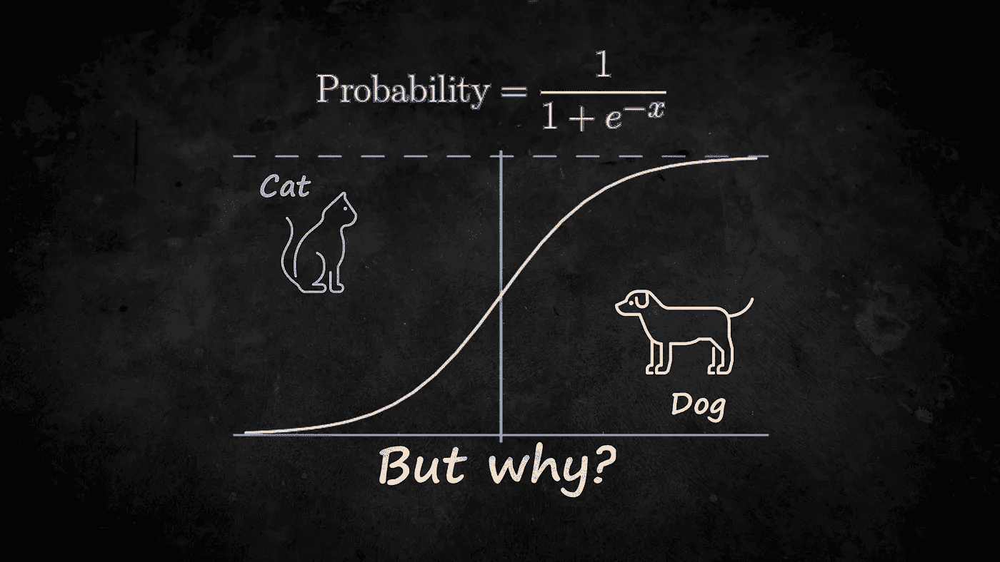

*Logistic* 回归无处不在，但它为什么有效的直觉是什么？（图片由作者提供）

*Logistic* 回归也许是最受欢迎和最知名的机器学习模型。它解决了二分类问题——预测数据点是否属于某个类别。

关键成分是 *logistic* 函数，其中一个输入被转换为概率，形式如下：

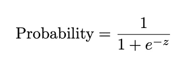

但是为什么指数函数会出现？它背后的直觉是什么，除了将一个实数转换为概率之外？

结果发现，热物理学有答案。但在深入物理学的见解之前，让我们首先了解数学部分。

# 数学难题

在处理 *logistic* 函数的“为什么”之前，让我们首先理解它的属性。

该是让数学见鬼去吧的时候了！（图片由 [Michal Matlon](https://unsplash.com/@michalmatlon?utm_source=medium&utm_medium=referral) 提供，来源于 [Unsplash](https://unsplash.com/?utm_source=medium&utm_medium=referral)）

理解 *logistic* 函数的一种更广泛的形式是有帮助的——这种形式适用于多个类别——这样 *logistic* 函数就成为了一个特殊的两类示例。

这可以通过引入多个额外变量 *zᵢ* 来完成，每个类别一个。然后我们得到 *softmax* 函数，其中每个类别 *i* 被分配一个概率：

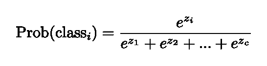

对于线性模型，*zᵢ* 通常是特征的线性和。这个函数在超出线性模型的情况下还有很多额外的用途：

+   作为神经网络中的最终分类层

+   作为变压器中的注意力权重

+   作为强化学习中选择行动的采样层

但为什么我们选择这种函数形式来参数化概率？常见的解释是它仅仅是一个转换工具。事实上，只要其中没有一个概率为零，任何概率集合都可以写成这种形式。从数学上讲，我们可以通过简单地取对数来求解 *zᵢ*：

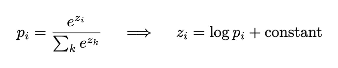

但这就是 softmax 作为转换工具的唯一特殊属性吗？其实不是，因为将数字转换为概率的选择是无穷无尽的。实际上，我们可以考虑其他形式的函数：

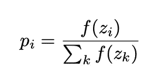

为了产生一个合理的优化概率函数，我们需要对 *f* 满足以下标准：

+   始终为正，始终递增，范围从 0 到 ∞，并且可微分

因此，exp(*z*) 只是无数选择中的一种，下面可以看到：

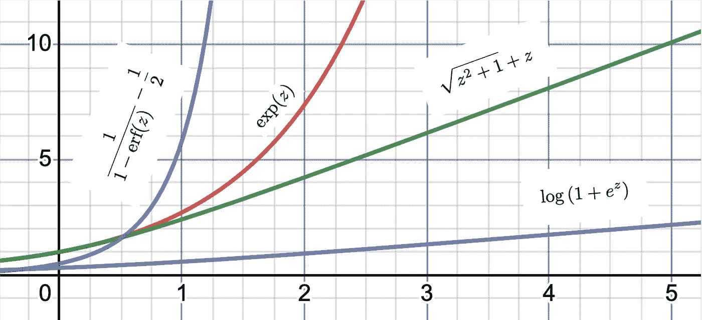

exp(z) 的替代方案也可以合理地将数字转换为概率（图像来源：作者）

那么 exp(*z*) 是否只是海量可能性中的一个约定？exp(*z*) 是否应该更可取？虽然我们可以通过模型性能简单地证明这个选择，但我们应尽可能追求理解。在这种情况下，存在理论动机，它来自于热物理学。

# 一个热物理学链接

事实证明，这些概率在热物理学中无处不在，它们被称为 [玻尔兹曼分布](https://en.wikipedia.org/wiki/Boltzmann_distribution)，它描述了一个粒子（或更广泛地说，一个系统）处于特定能量状态的概率：

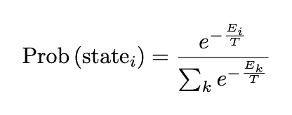

其中 *Eᵢ* 表示状态的能量，*T* 表示温度。当温度非零时，可以将能量测量为温度的倍数，以便将 *T* 方便地设置为 1。

尽管玻尔兹曼分布有点令人困惑，因为它们建模的系统是由精确和确定性的方程支配的，那么概率和统计学是如何融入其中的（忽略量子物理学）？

热物理学利用概率来管理我们在复杂世界中的无知（照片来源：[Rainer Gelhot](https://unsplash.com/@rynaehr?utm_source=medium&utm_medium=referral) 在 [Unsplash](https://unsplash.com/?utm_source=medium&utm_medium=referral)）

关键在于复杂性。虽然我们有描述系统细节的方程，它们往往非常复杂。此外，这些方程常常表现出混沌行为，导致高度不可预测性（[蝴蝶效应](https://en.wikipedia.org/wiki/Butterfly_effect)）。因此，实际上，这些详细的确定性方程并不是很有用。

那么我们如何理解这些复杂系统呢？幸运的是，在现实生活中，我们很少需要了解系统的微观细节，因为我们无论如何都无法测量它们。通常，我们只需考虑宏观和涌现量（如温度、能量或熵）。这就是概率理论的作用——它是微观与宏观之间的桥梁：

+   微观细节使用概率分布来建模

+   宏观量被建模为这些分布的各种平均值

以一个类比来说，假设我们想研究某些无理数的所有数字，比如√2、*π*和*e*。

+   √2 = 1.41421356237309504880…

+   *π =* 3.14159265358979323846…

+   *e* = 2.71828182845904523536…

任务似乎很艰巨，因为每个数字来自不同的数学概念。要获得精确的数字，需要特定的数值方法来计算。然而，如果我们简单地观察这些数字的*宏观*行为，我们会发现每个数字大约出现 10%的时间。关键在于，这些数字像许多动态系统一样，倾向于无偏见地探索所有可能性。从更技术的角度来说，

> 混沌系统倾向于最大化所有可能性，换句话说，就是熵。

这和我们的玻尔兹曼分布有什么关系呢？数学上，玻尔兹曼分布是一个*最大熵*分布，在约束条件下，这些统计数据符合一个关键的物理法则——能量守恒。换句话说，玻尔兹曼分布是以下方程的解：

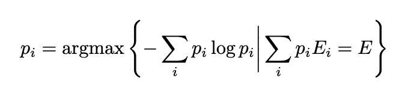

所以，exp(−*E*)的具体形式来源于能量守恒。

直观地说，我们可以把能量看作一种预算。混沌系统尝试探索所有可能性（以最大化熵）。如果某个类别需要的能量很高，它将较少探索该类别，从而有更多机会探索其他类别。然而，概率不会降为零，因为系统仍然希望探索这个能量低效的类别。指数形式是效率和探索之间的妥协结果。

回到数据科学和分类问题，我们的数据不是动态系统的一部分，也没有能量守恒，所以这些物理学见解如何有用呢？

# 类别的能量

能量是所有互动的基本单位，但它在分类问题中有用吗？（图片来源：[Fré Sonneveld](https://unsplash.com/@fresonneveld?utm_source=medium&utm_medium=referral) 在 [Unsplash](https://unsplash.com/?utm_source=medium&utm_medium=referral)）

关键在于，在数据科学中，我们不一定对数据是如何得来的感兴趣——这是一个几乎不可能完成的任务。相反，我们正在尝试构建一个可以模仿数据中相关行为的系统。从这个角度来看，模型成为一个由数据以某种可取方式塑造的动态系统（这一点在我的[文章](https://medium.com/towards-data-science/a-physicists-view-of-machine-learning-the-thermodynamics-of-machine-learning-6a3ab00e46f1)中探讨过）。

就像在热物理学中，玻尔兹曼分布在捕捉粗略的微观细节方面很有效，同时忠实地再现宏观物理量（温度、压力等）。因此，至少可以认为它可能将这种超能力赋予数据科学。

确实，与其在我们的数据中寻找某种能量守恒定律，我们不如在我们的分类模型中*强制*能量守恒的概念。这样，与热物理学中的玻尔兹曼分布类似：

> 模型中的 softmax 函数假设类别的最大熵猜测，前提是对这些猜测存在某种保守预算。

最大熵可以被视为一种最大似然估计（参见[我的关于熵的文章](https://medium.com/towards-data-science/what-does-entropy-measure-an-intuitive-explanation-a7f7e5d16421)）。剩下的问题是，为什么创建一个人为固定的能量预算是合理的？以下是一些原因：

1.  中心极限定理：能量通常是特征的线性和，因此它们有明确的均值。所以，强制这些能量在类别间的平均值保持恒定并不是一个很大的跳跃。

1.  正则化：这迫使概率的极值受到限制，因为概率为 1 或 0 将要求一些能量为无限大。

1.  方差减少：通过施加合理的约束，我们在模型中引入偏差的同时减少方差（偏差/方差权衡）。

在深度神经网络中使用 softmax 时，点 1 和 3 尤其显著。由于网络层通常已经有某种规范化，因此强制固定能量以确保下游良好的统计行为更加有意义。

那么，这些见解如何帮助我们理解我们的模型呢？我们可以用它们来解释有关使用 softmax 的模型的轶事事实（即逻辑回归）：

1.  **不平衡的问题**：这是因为 softmax 假设最大熵。它故意试图让模型在没有偏见的情况下探索所有可能的类别。

1.  **大量类别的问题**：softmax 尝试分配所有可能的类别，即使是那些不可能的类别（例如，将猫分配为车辆）。对于类别被干净地分开的数据，聚类、最近邻、[支持向量机](https://en.wikipedia.org/wiki/Support_vector_machine)和[随机森林](https://en.wikipedia.org/wiki/Random_forest)模型可能表现更好。

除了模型结构之外，我们的热物理类比还帮助我们理解训练范式，这也是我们接下来要讨论的内容。

# 施加训练压力

Boltzmann 分布允许我们计算类似压力的东西，在分类中有什么类比？（照片由[NOAA](https://unsplash.com/@noaa?utm_source=medium&utm_medium=referral)提供，来源于[Unsplash](https://unsplash.com/?utm_source=medium&utm_medium=referral)）

Boltzmann 分布的实用性不仅仅在于对系统状态进行分类：它使我们能够计算其他有用的突现量——例如压力。这个压力可以是我们所经历的物理压力，也可以是更抽象的热力学力，如磁场和化学势。

例如，压力的方程是通过体积变化引起的 Boltzmann 因子的变化来定义的：

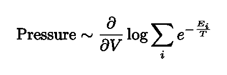

更一般地说，热力学压力被定义为我们统计分布中相对于某个变量的变化。

回到数据科学中，分类中的一些量类似于“压力”是什么呢？一个相关的量是[交叉熵](https://en.wikipedia.org/wiki/Cross_entropy)，这是训练分类模型时通常要最小化的损失函数。交叉熵通常通过采样来估计：

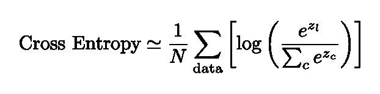

其中 *l* 表示特定数据点所在的正确类别。为了优化它，我们可以进行梯度下降：计算导数并更新，直到导数为零。

使用物理类比，我们可以将导数/梯度视为一种热力学压力！

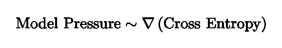

那么对于模型训练来说，这意味着我们在对系统（我们的模型）施加压力，直到它达到平衡。当这种内部“模型压力”达到零时，模型就被训练完成——某种热平衡。

虽然这种类比并不是 100% 精确，但它给了我们关于分类模型如何工作的直观认识（更具体地说，利用 softmax 并通过诸如交叉熵的东西进行优化的模型）。所以我们可以得出结论：

> 分类模型是模拟热力学系统的模型，它们被驱动到平衡状态，以模拟我们数据中的类别。

这一观点或许可以解释为什么简单的逻辑回归模型是有效的，即使在现实生活中，关于线性模型的假设通常会被违反。

# 结论

希望我已经向你展示了一些简单逻辑回归与热力学之间的有趣联系。

数据科学是一个非常广泛的学科。像热力学一样，我们可以将数据科学视为一种高级的理解宏观世界的方式，同时妥善处理我们可能不知晓的微观细节。或许并不奇怪，数据科学中的许多概念和数学工具可以与物理学联系起来，甚至可以追溯到物理学，因为它们都有着建模我们世界的共同目标。

如果你喜欢这篇文章，请留下评论。如果你希望看到其他抽象概念被解密并得到正确解释，也请告诉我。祝阅读愉快👋。

如果你喜欢我的文章，你可能对我的其他见解也感兴趣：

 ## 熵的测量是什么？一个直观的解释

### 熵可以被认为是看到数据中某些模式的概率。以下是它是如何工作的。

towardsdatascience.com  ## 物理学家的机器学习视角：机器学习的热力学

### 自然界中的复杂系统可以通过热力学成功研究。那么，机器学习呢？

towardsdatascience.com  [## 熵不是混乱：物理学家的视角

### 熵通常被视为混乱的同义词。但它真正是什么呢？在这篇文章中，我们探讨了熵如何更…

medium.com](https://medium.com/swlh/entropy-is-not-disorder-a-physicists-perspective-c0dccfea67f1?source=post_page-----291774fda579--------------------------------)  [## 为什么我们不生活在模拟中

### 将现实描述为一种模拟严重低估了我们世界的复杂性。以下是为什么这种模拟…

medium.com](https://medium.com/physicist-musings/why-we-dont-live-in-a-simulation-a-physicist-s-perspective-1811d65f502d?source=post_page-----291774fda579--------------------------------)
