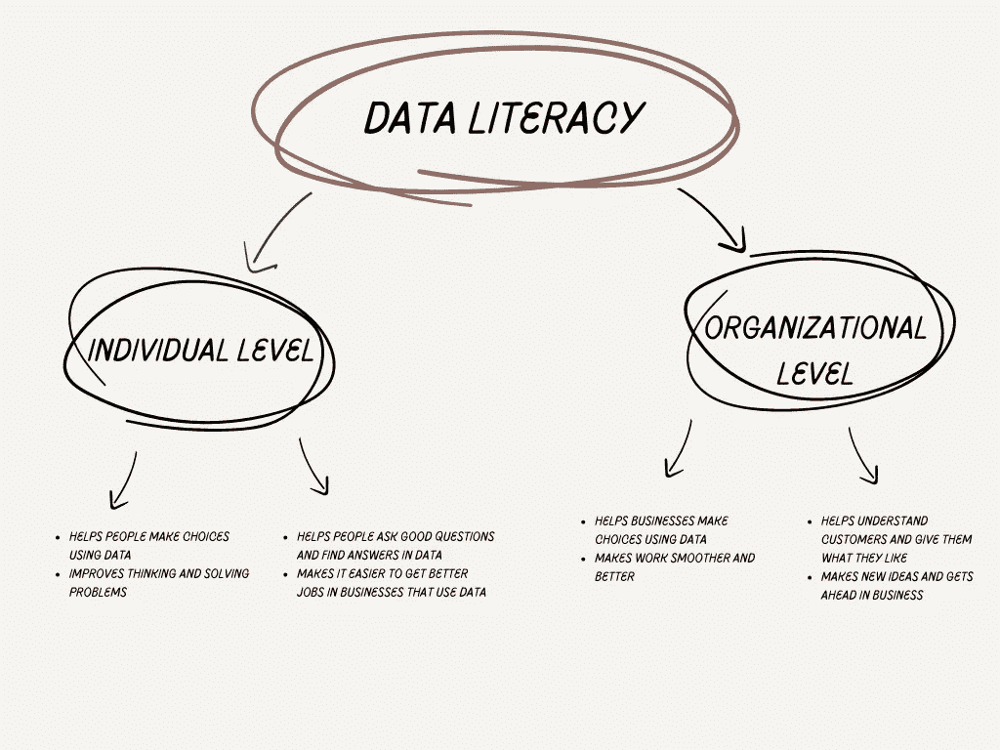
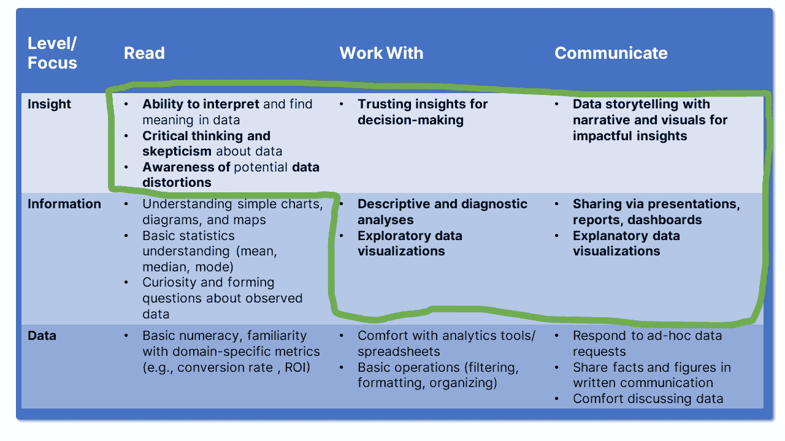

# 数据素养的威力

> 原文：[`towardsdatascience.com/the-might-of-data-literacy-3d91fcc5f46b`](https://towardsdatascience.com/the-might-of-data-literacy-3d91fcc5f46b)

## 这是否是成功使用数据和分析的关键？

 [Michal Szudejko](https://medium.com/@michalszudejko?source=post_page-----3d91fcc5f46b--------------------------------)

·发布于 [Towards Data Science](https://towardsdatascience.com/?source=post_page-----3d91fcc5f46b--------------------------------) ·阅读时间 8 分钟·2023 年 8 月 23 日

--

图片由 [Markus Spiske](https://unsplash.com/@markusspiske?utm_source=medium&utm_medium=referral) 提供，来源于 [Unsplash](https://unsplash.com/?utm_source=medium&utm_medium=referral)

**数据在当今世界是业务成功的关键驱动力。** 然而，许多公司仍然难以充分利用其潜力。在我最近的一篇文章中，我深入探讨了多个原因 [[1](https://medium.com/me/stats/post/162183c13998)]。例如‘[数据沼泽](https://medium.com/codex/what-is-a-data-swamp-38b1aed54dc6)’问题。这是组织理想中希望避免的数据基础设施场景。但是，如果这如此令人不快，为什么无数公司会陷入其中？

## 你怎么能判断自己不再拥有数据湖，而是陷入泥潭？你可以问三个问题：

1\. **结构：** 获取所需数据的路径是否简单：是/否

2\. **直观性：** 是否容易找到那条路径：是/否

3\. **一致性：** 不同数据类型的路径是否看起来相同：是/否 [[2](https://www.elderresearch.com/blog/is-my-data-lake-actually-a-data-swamp/)]。

如果所有前面的问题的答案都是‘不’，那么你可以说：

图片由 [Dmitrii Ko](https://unsplash.com/@goyongsu?utm_source=medium&utm_medium=referral) 提供，来源于 [Unsplash](https://unsplash.com/?utm_source=medium&utm_medium=referral)

## **好的，所以我们已经识别出架构中的问题。我会咨询我的数据分析团队来解决这个问题。**

## **等一下，这不是正确的方法！**

问题不仅仅是数据架构功能失调。真正的问题在于无法从数据中提取价值。技术层面只是跟随其后。当数据未被使用时，它实际上没有价值。数据的价值的准确衡量标准在于从数据驱动的决策中产生的营业额或利润 [[3](https://medium.com/towards-data-science/why-data-is-not-the-new-oil-and-data-marketplaces-have-failed-us-b42dd87a0ba0)]。

问题是否在于缺乏明显的数据战略？可能是。然而，虽然强健的数据战略至关重要，但如果公司的数据文化薄弱，它也无法发挥作用。员工必须在日常工作中采纳数据的使用。**他们必须具备数据素养，以充分利用数据驱动的机会。**

## 什么是数据素养？

**数据素养包括读取、理解、分析和传达数据。培养数据素养对采纳它的个人和优先考虑它的企业都带来了好处。** 在个人方面，它使我们能够更好地与数据和分析进行批判性互动。它还给我们（希望）带来了在当今就业市场上的竞争优势。对于企业来说，数据素养的好处也很明显，特别是在利用数据、理解客户、抓住机会和应对挑战方面。

数据素养的各个方面。来源：作者提供的图片。

## 成为数据素养者意味着什么？

根据 Brent Dykes 的说法 [[4](https://www.effectivedatastorytelling.com/post/4-keys-to-better-data-interpretation-skills-for-any-manager)]，数据素养有两个不同的方面：**数据分析和数据解读**。虽然它们通常被视为一个过程，但区分这两者是至关重要的。**数据分析** 是技术性的，包括数据清理、异常检测、趋势分析和识别关联等任务。另一方面，**数据解读** 则深入探讨这些发现的意义。它提出的问题包括：

> 观察到的趋势是什么驱动的？我们的组织如何利用特定的关联？检测到的异常是一个罕见的现象、一个未被发现的机会，还是在某些情况下，观察到的关联可能表明因果关系？

顺便提一下：对于上述最后一个问题得到“是”的答案通常被认为是业务分析的圣杯。

寻找圣杯。[来源](https://commons.wikimedia.org/wiki/File:Hollywood_Museum_-_Indiana_Jones%27_Grail_Diary_(7659583966).jpg)

不久前，我查看了最新的‘BARC 数据文化调查’。该调查显示，2022 年只有 32%的参与者完全依赖数据做决策。18%的人依靠经验或直觉做决定。其余的 51%则是两者结合使用 [[5](https://barc-research.com/research/data-culture-survey-23/)]。**这让我思考：这个最后的数字是否是一个不好的现象？**

一方面，确实是这样。尽管数据科学取得了进展，包括大模型（LLMs）的应用，但这种“人情味”仍然是必需的。只有人类才能理解其他人：他们的情绪、口味和感受。**无论多么复杂，计算机程序在这方面仍然不如我们。** 另一方面，过度使用人为因素有时可能会带来危害。一切都取决于使用了多少种成分（即数据或直觉），以及它们用于何种决策。我发现，决策越大，人们越倾向于依赖他们相信的或之前见过的东西。**而这也许在当今并不是正确的方向。**

## 为什么将数据分析与数据解读分开是有意义的？

嗯，这又是另一个“人类特质”。最大的挑战之一是切换详细视图与“高空”视图（以及反方向）。你不能期望一个已经负担过重的经理去花几个小时或几天时间处理给定的数据集。另一方面，数据科学家可能缺乏必要的背景知识，如战略变化、对公司环境的理解，以及已作出但尚未公布的关键决策。

鉴于他们繁多的职责，经理们常常依赖数据专业人员进行详细分析。这些专家在广泛的数据探索后提供宝贵的见解。**然而，领导者必须参与数据解读，而不是被动接受结论。**

> 经理的参与确保数据解读与更广泛的组织背景保持一致。
> 
> 当领导者基于数据专业人员的基础见解做决策时，集体推理会导致更全面的决策。

提高组织中数据素养的目标不是将每个员工培养成数据科学家，而是培养具备数据敏感性的个人。重点是让大多数团队成员掌握基本的数据技能，以便他们在日常任务中使用，而不是处理复杂的数据驱动角色。

## **拥有数据素养意味着有信心在不具备高级统计或编程知识的情况下管理日常数据。**

这种基础能力能够释放你组织的数据潜力。为了确定你的团队的数据素养，应该在数据层级上定位“最低可行能力”，而不是列出所有可能的技能。Brent Dykes 建议我们可以将所需技能拆解成一个 3x3 矩阵，其中列出数据素养的水平（纵轴）以及每个水平所需的（最低）技能（横轴）[[6](https://www.effectivedatastorytelling.com/post/data-literacy-and-data-storytelling-how-do-they-fit-together)]。

数据素养矩阵。表格由作者基于[[6](https://www.effectivedatastorytelling.com/post/data-literacy-and-data-storytelling-how-do-they-fit-together)]制作。

在**阅读**类别中，**数据**层次涉及基本的数字能力和特定领域的度量理解。**信息**层次增加了对视觉图表（图形）的理解能力和基础统计知识，而**沟通**阶段则强调数据解释和关键评估。

对于**工作与**，**数据**层次优先考虑对分析工具和数据处理的熟悉程度。**信息**层次关注描述性和诊断性分析技能，而**洞察**层次则强调基于数据洞察的决策制定。

在**沟通**领域，**数据**层次技能包括应对请求和讨论数据话题。**信息**层次突出数据呈现和可视化，而**洞察**阶段则强调具有影响力的数据讲故事的艺术[[6](https://www.effectivedatastorytelling.com/post/data-literacy-and-data-storytelling-how-do-they-fit-together)]。

## **遵循 80/20 原则，我认为洞察力水平对获得数据素养至关重要。虽然其他层次也有帮助，但从决策者的角度来看，它们并不是关键的。**

## “阅读”领域

首先，组织内的每个人——特别是管理者和领导者——必须培养对数据科学工具和技术的基础理解。这并不意味着每个人都应该参加统计课程或深入学习 Python 或 R。相反，目标是掌握基本术语，了解特定工具的优缺点，并具备进行基础分析的能力。**虽然我认识到企业角色中的时间限制，但我发现即使是基础的理解也能提升我与数据科学家的互动，避免了重温基础概念的需要，从而改善了协作。我在自己身上验证了这一点。**

## “工作与”领域

**改变我们处理数据的方式可能会显著改变我们的公司文化。** 强有力的领导至关重要。如果领导者对数据不感冒，他们会更信任直觉而非数字。

我相信我们可以在团队中利用“数据冠军”。这些人对数据充满热情，并愿意帮助他人理解数据。他们展示了数据和分析不仅仅是复杂的表格，还有令人兴奋的发现。

我们还需要用户友好的工具，让每个人即使没有技术技能也能探索和理解数据。管理者应使用有效、设计良好的仪表板来快速获得清晰的图景[[7](https://medium.com/towards-data-science/leveraging-management-dashboards-for-storytelling-a-viable-pathway-4bdeeed1fa59)]。

然而，也存在风险。随着对有价值数据的炒作，一些公司收集了过多的数据，浪费时间进行分析，并拖慢了决策过程。

此外，如果我们看不到使用数据的快速收益，可能会失去热情。庆祝小成功是至关重要的，特别是当我们刚刚接触数据驱动的方法时。

## ‘沟通’领域

在这里，“数据讲故事”发挥作用。**为什么它至关重要？** 讲故事，通过叙述和视觉辅助，帮助理解庞大的数据。引人入胜的讲故事可以使任何故事变得清晰，无论多么复杂。这项技能如此重要，以至于《福布斯》将其列为数据科学家的顶级要求。然而，许多分析师在这方面挣扎。有效的数据故事：

+   使复杂的话题变得易于理解和分享。

+   促成决策变化比个人经历更为重要。

+   将复杂的数据分析结果简化。

引人入胜的讲故事指的是“那么又如何”的声明：核心信息。许多分析师缺乏设计创意或害怕简化。然而，不清晰的视觉效果可能会阻碍业务决策 [[8](https://medium.com/decoded-news/visualising-our-world-today-storytelling-with-data-d69350092278)]。

> 我计划很快写关于我在数据讲故事方面的方法：敬请关注！

## **请记住，提高数据素养是一场马拉松，而不是短跑。**

这与许多人选择的快速解决培训趋势相反。技术的迅猛发展，例如 LLMs 的崛起，突显了持续学习的必要性。优先考虑一致的、每日的自我教育——例如阅读一篇 15 分钟的文章——而不是短期的强化课程。如果可能，将这两种活动类型结合起来。然而，请记住，熟练度，尤其是在讲故事等领域，要求的是实践和经验，而不仅仅是正式培训。这涉及到理解什么有效、引起共鸣并与你的受众以及可能的舒适区相契合。

## 结论

在今天的数据驱动环境中，组织的所有成员，特别是领导层，必须具备对数据科学工具和方法的基础理解。这并不要求你报名参加统计课程或精通编程语言。相反，它是关于掌握基本术语、识别各种工具的优缺点，并能够进行基本的数据分析。尽管企业界时间有限，但即使是基础知识也能显著提升和简化与数据专业人士的互动。**在日常操作中增强我们对数据驱动决策的依赖，加上讲故事的强大应用，处于这一过程的巅峰。到那时，我们才能真正称自己为数据素养的专家。**

[*你喜欢这篇文章吗？考虑在 Medium 上关注我。*](https://medium.com/@michalszudejko)

## 参考文献：

[1] **斯泽德科，米哈伊**，*从数字到行动：让数据为公司服务*，2023 年 8 月 14 日

[2] **皮尔彻，布赖斯**，[*我的数据湖实际上是数据沼泽吗？*](https://www.elderresearch.com/blog/is-my-data-lake-actually-a-data-swamp/)，2023 年 3 月 23 日

[3] **克莱门斯·梅瓦尔德**，[*为什么数据*不是*新石油，以及数据市场为何让我们失望*](https://medium.com/towards-data-science/why-data-is-not-the-new-oil-and-data-marketplaces-have-failed-us-b42dd87a0ba0)，2023 年 7 月 13 日

[4] **布伦特·戴克斯**，[*提升任何管理者的数据解读技能的 4 个关键*](https://www.effectivedatastorytelling.com/post/4-keys-to-better-data-interpretation-skills-for-any-manager)，2022 年 6 月 16 日

[5] **BARC**，[*BARC 数据文化调查 23 — 如何开放数据访问以赋能数据用户*](https://barc-research.com/research/data-culture-survey-23/)

[6] **布伦特·戴克斯**，[*数据素养与数据讲故事：它们如何结合？*](https://www.effectivedatastorytelling.com/post/data-literacy-and-data-storytelling-how-do-they-fit-together)，2022 年 5 月 12 日

[7] **米哈尔·苏代科**，[*利用管理仪表板讲故事：一种可行的途径？*](https://medium.com/towards-data-science/leveraging-management-dashboards-for-storytelling-a-viable-pathway-4bdeeed1fa59)，2023 年 8 月 3 日

[8] **解码**，[*今天的世界可视化：用数据讲故事*](https://medium.com/decoded-news/visualising-our-world-today-storytelling-with-data-d69350092278)，2022 年 7 月 29 日
