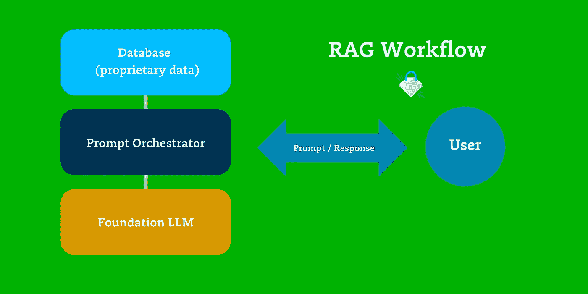
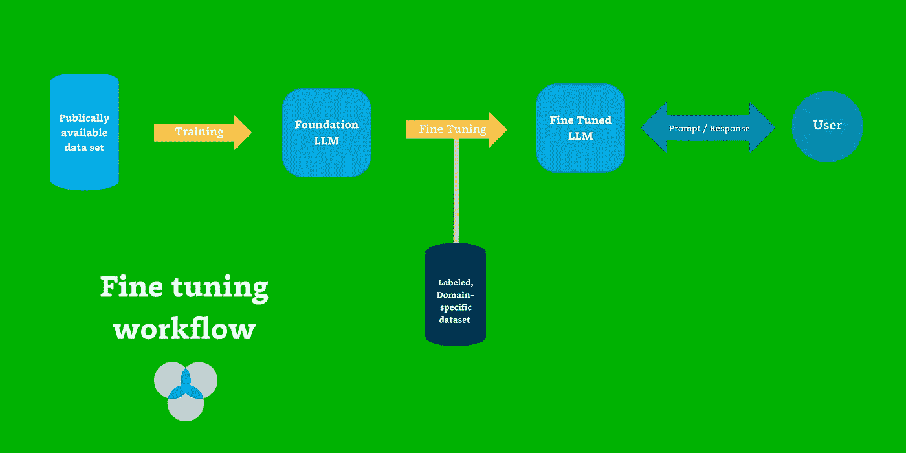
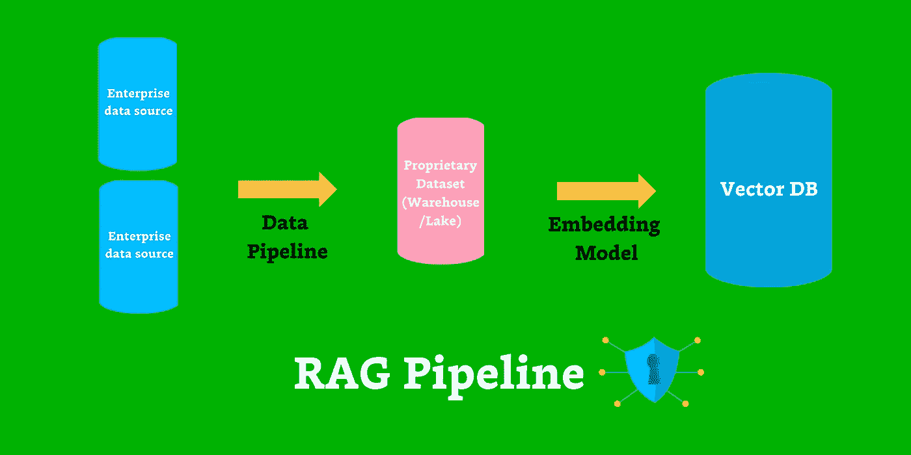

# 企业 AI 的护城河是 RAG + 精细调整 — 为什么如此重要

> 原文：[`towardsdatascience.com/the-moat-for-enterprise-ai-is-rag-fine-tuning-heres-why-fb2038e40ce9?source=collection_archive---------0-----------------------#2023-11-13`](https://towardsdatascience.com/the-moat-for-enterprise-ai-is-rag-fine-tuning-heres-why-fb2038e40ce9?source=collection_archive---------0-----------------------#2023-11-13)

## 要在规模上成功实现生成式人工智能，我们需要给予 LLMs 应有的勤奋。RAG 和精细调整应运而生。

 [巴尔·摩西](https://barrmoses.medium.com/?source=post_page-----fb2038e40ce9--------------------------------)

·

[关注](https://medium.com/m/signin?actionUrl=https%3A%2F%2Fmedium.com%2F_%2Fsubscribe%2Fuser%2F2818bac48708&operation=register&redirect=https%3A%2F%2Ftowardsdatascience.com%2Fthe-moat-for-enterprise-ai-is-rag-fine-tuning-heres-why-fb2038e40ce9&user=Barr+Moses&userId=2818bac48708&source=post_page-2818bac48708----fb2038e40ce9---------------------post_header-----------) 发表在[Towards Data Science](https://towardsdatascience.com/?source=post_page-----fb2038e40ce9--------------------------------) ·10 分钟阅读·2023 年 11 月 13 日

--

[Volodymyr Hryshchenko](https://unsplash.com/@lunarts?utm_content=creditCopyText&utm_medium=referral&utm_source=unsplash)拍摄的照片，来源于[Unsplash](https://unsplash.com/photos/three-crumpled-yellow-papers-on-green-surface-surrounded-by-yellow-lined-papers-V5vqWC9gyEU?utm_content=creditCopyText&utm_medium=referral&utm_source=unsplash)。

围绕 LLM 的炒作是前所未有的，但也是有充分理由的。从 AI 生成的[全副装扮的教皇](https://www.forbes.com/sites/danidiplacido/2023/03/27/why-did-balenciaga-pope-go-viral/)到[没有脉搏的客户支持代理人](https://www.zendesk.com/blog/ai-customer-service/)，生成式 AI 有改变我们所知社会的潜力。

在很多方面，LLM（大型语言模型）将会使数据工程师变得更加重要 — 这是令人兴奋的！

不过，向老板展示一个数据发现工具或文本转 SQL 生成器的酷炫演示一回事，将其与公司的专有数据，甚至更令人担忧的是客户数据一起使用则是另一回事。

太多时候，公司匆忙建立 AI 应用程序，却对其实验的财务和组织影响缺乏远见。而这并不是他们的错 — 高管和董事会对这（以及大多数）新技术的“赶快上路”的心态负有责任。（还记得 NFT 吗？）

要让 AI — 特别是生成式 AI — 取得成功，我们需要退一步，回想一下*任何*软件如何变得企业就绪。为了达到这一点，我们可以从其他行业获取启示，了解企业就绪的标准，并将这些原则应用到生成式 AI 中。

我认为，企业级生成式 AI 必须：

+   **安全与隐私：** 您的 AI 应用程序必须确保您的数据安全、私密且符合法规，具备适当的访问控制。想象一下：AI 的安全运营。

+   **可扩展性：** 您的 AI 应用程序必须易于部署、使用和升级，同时还要具备成本效益。如果一个数据应用程序需要花费数月才能部署，使用起来繁琐，并且升级时会引入无数其他问题，那么您也不会购买或自行开发这样的应用程序。我们不应该对待 AI 应用程序有任何不同。

+   **可信赖。** 您的 AI 应用程序应该足够可靠和一致。我很难想象有哪位 CTO 愿意赌自己的职业生涯，去购买或开发一个生成不可靠代码或生成的见解混乱且误导的产品。

在这些限制条件下，现在是我们开始认真对待生成式 AI 的时候了。但这并不容易……

# 为什么企业级 AI 如此难以实现？

简而言之，尚缺乏适合扩展、安全和运作 LLM 应用程序的基础设施。

不同于大多数应用程序，AI 很大程度上是一个黑匣子。我们*知道*我们输入了什么（原始、通常是非结构化数据），我们也*知道*我们得到了什么结果，但我们不知道它是如何做到的。这使得扩展、安全和运作都变得困难。

以 GPT-4 为例。[虽然 GPT-4 在某些任务（如 SAT 和 AP Calculus AB 考试）表现出色](https://www.pcmag.com/news/gpt-4-offers-human-level-performance-hallucinations-and-better-bing-results)，但其部分输出被[幻觉所困扰](https://spectrum.ieee.org/ai-hallucination)或缺乏足够的上下文来充分完成这些任务。幻觉的产生是由[多种因素](https://www.pinecone.io/learn/options-for-solving-hallucinations-in-generative-ai/)引起的，从低质量的嵌入到知识截断，经常影响由公开或开放 LLM 模型生成的响应质量，这些模型是根据从互联网上获取的信息训练的，占大多数。

为了减少幻觉，甚至更重要的是——回答有意义的业务问题——公司需要用自己的专有数据增强 LLMs，包括必要的业务背景。例如，如果客户要求航空公司聊天机器人取消他们的机票，模型需要访问关于客户、其过往交易、取消政策以及可能的其他信息。所有这些信息当前都存在于数据库和数据仓库中。

没有这些背景信息，AI 只能根据公开信息进行推理，通常这些信息是最初训练模型的互联网上发布的。这就产生了一个难题——暴露专有企业数据并将其纳入业务工作流程或客户体验几乎总是需要坚实的安全性、可扩展性和可靠性。

# 两条通向企业就绪 AI 的路线：RAG 和微调

当涉及使 AI 企业就绪时，最关键的部分出现在 LLM 开发过程的最后阶段：[**检索增强生成（RAG）**](https://www.promptingguide.ai/techniques/rag) 和 [**微调**](https://www.anyscale.com/blog/fine-tuning-is-for-form-not-facts)。

但需要注意的是，RAG 和微调并不是互斥的方法，应根据您的具体需求和用例来利用——通常是并行使用的。

**何时使用 RAG**

图片由作者提供。

**RAG** 是一种通过让模型访问数据库来改进 LLM 输出质量的框架，试图在回答提示时提供支持。数据库作为一个经过精心策划和可信任的潜在专有数据集，允许模型将最新和可靠的信息整合到其响应和推理中。这种方法最适合需要额外上下文信息的 AI 应用，例如客户支持响应（例如我们的航班取消示例）或在公司企业通信平台中进行语义搜索。

RAG 应用程序旨在从知识来源中检索相关信息，然后生成响应，因此非常适合查询结构化和非结构化数据源，如向量数据库和特征存储。通过检索信息来提高 LLM 在输出生成时的准确性和可靠性，RAG 在减少幻觉和降低培训成本方面也非常有效。RAG 还为团队提供了一定程度的透明度，因为您知道将数据输入模型以生成新响应的数据源。

关于 RAG 架构的一点需要注意的是，它们的性能在很大程度上依赖于您建立有效数据管道的能力，使企业数据对 AI 模型可用。

**何时使用微调**

图像由作者提供。

**微调**是在现有的语言模型上训练一个更小、任务特定且标记数据集的过程，根据这些新数据调整模型参数和嵌入。微调依赖于预先筛选过的数据集，这些数据集不仅仅用于信息检索，还包括所需领域的细微差别和术语。

在我们的经验中，微调最适合特定领域的情况，比如以特定的语调或风格对详细提示作出回应，比如法律简报或客户支持票证。它还非常适合克服信息偏见和其他限制，比如语言重复或不一致之处。[几项](https://snorkel.ai/better-not-bigger-how-to-get-gpt-3-quality-at-0-1-the-cost/) [研究](https://openaccess.thecvf.com/content/CVPR2022/html/Wortsman_Robust_Fine-Tuning_of_Zero-Shot_Models_CVPR_2022_paper.html) 在过去的一年中表明，经过微调的模型显著优于 GPT-3 和其他公开可用模型的即用版本。已经确定，对于许多用例来说，经过微调的小型模型可以胜过大型通用模型 —— 这使得在某些情况下，微调成为成本效率的一种可行路径。

与 RAG 不同，微调通常需要更少的数据，但耗费更多的时间和计算资源。此外，微调操作像一个黑盒子；由于模型内化了新数据集，难以准确指出新响应背后的推理过程，并且幻觉仍然是一个值得关注的问题。

和 RAG 架构一样，微调需要建立有效的数据管道，使（标记的！）企业数据可用于微调过程。这绝非易事。

# 为什么 RAG 可能适合您的团队

图像由作者提供。

重要的是要记住，RAG 和精细调整并非互斥的方法，它们各有优势和劣势，并可以一起使用。然而，对于绝大多数用例来说，RAG 在交付企业生成 AI 应用程序时可能是最合适的选择。

以下是原因：

+   **RAG 的安全性和隐私更易管理：** 数据库具有内置角色和安全性，而不像 AI 模型那样，由于标准访问控制，非常明确谁看到什么。此外，通过访问专有数据的安全和私密语料库，您可以更好地控制使用哪些数据。通过精细调整，包含在训练集中的任何数据都暴露给应用程序的所有用户，没有明显的方法来管理谁看到什么。在许多实际场景中——特别是涉及客户数据时——失去这种控制是不可接受的。

+   **RAG 更具可扩展性：** 与精细调整相比，RAG 成本更低，因为后者涉及更新大型模型的所有参数，需要大量计算资源。此外，RAG 不需要标记和制作训练集，这是一个人力密集型过程，可能需要数周甚至数月来完善每个模型。

+   **RAG 提供更可信赖的结果。** 简单来说，RAG 在动态数据中运作更佳，从最新的策划数据集生成确定性结果。由于精细调整很大程度上像黑匣子，很难准确指出模型生成特定结果的方式，这降低了信任和透明度。通过精细调整，出现幻觉和不准确可能性，因为您依赖模型的权重以损失方式编码业务信息。

依我们的谦逊看法，企业就绪 AI 将主要依赖于 RAG，并涉及对更微妙或特定领域用例的精细调整。对于绝大多数应用程序来说，精细调整将是一种对于小众场景而言很好的可选项，并且在行业能够降低运行大规模 AI 所需成本和资源后，它将更频繁地发挥作用。

无论您使用哪种方法，您的 AI 应用程序开发都将需要通过某些数据存储（如 Snowflake、Databricks、像 Pinecone 这样的独立向量数据库或其他完全不同的东西）向这些模型提供公司数据的管道。归根结底，如果生成式 AI 用于内部流程以从非结构化数据中提取分析和见解——它将被用于……鼓掌……数据管道。

# 要使 RAG 正常工作，您需要数据的可观察性。

在 2010 年代初期，[机器学习](https://www.montecarlodata.com/blog-why-production-machine-learning-fails-and-how-to-fix-it/)被吹捧为一种神奇算法，只要您给予其特征完美的权重，就能随时随地执行奇迹。然而，通常改善 ML 性能的是投资于高质量的特征，特别是数据质量。

同样，为了让企业 AI 正常工作，你需要关注生成模型所依赖的数据的质量和可靠性——这很可能通过 RAG 架构来实现。

由于它依赖于动态的、有时是实时的数据，RAG 需要 [数据可观测性](https://www.montecarlodata.com/product/data-observability-platform/) 来满足其企业级期望。数据可能因多种原因而中断，例如格式错误的第三方数据、故障的转换代码或失败的 Airflow 作业。数据总是会出现问题。

数据可观测性使团队能够在整个数据生态系统中以规模化的方式监控、警报、分类和解决数据或管道问题。多年来，它一直是现代数据栈中的必备层；随着 RAG 重要性的增加和 AI 的成熟，可观测性将成为 LLM 开发中的关键合作伙伴。

RAG 和企业 AI 能否正常工作的唯一方法是你能信任数据。为此，团队需要一种可扩展的、自动化的方式来确保数据的可靠性，以及一种企业级的方法来快速识别根本原因并解决问题——在这些问题影响到它们服务的 LLM 之前。

# 那么，事实上的 LLM 技术栈是什么呢？

正如我们所说，AI 工具的基础设施和技术路线图正在开发中，每天都有新的初创公司涌现出来解决各种问题，行业巨头也声称他们在应对这些挑战。涉及到将企业数据整合到 AI 中时，我看到三大主要的“竞赛选手”。

第一匹“竞赛选手”：向量数据库。Pinecone、Weaviate 等正在成为驱动 RAG 架构的必备数据库平台。虽然这些技术展现了很大的潜力，但它们确实需要构建新的一层技术栈，并创建支持它的工作流程，包括从安全性、可扩展性和可靠性方面。

第二匹“竞赛选手”：由第三方 LLM 开发者如 OpenAI 或 Anthropic 构建的模型的托管版本。目前，大多数团队通过这些新兴 AI 领导者提供的 API 来获取生成 AI 的支持，因为使用起来很方便。接入 OpenAI API，几分钟内就能利用前沿模型？我们在其中。如果你需要模型生成代码或解决基于公开信息的常见、非特定提示，这种方法效果很好。如果你想将专有信息整合到这些模型中，你可以使用这些平台提供的内置 [微调](https://platform.openai.com/docs/guides/fine-tuning) 或 [RAG](https://platform.openai.com/docs/assistants/tools/knowledge-retrieval) 功能。

最后，第三匹马：[现代数据堆栈](https://www.montecarlodata.com/blog-how-to-build-a-5-layer-data-stack/)。[Snowflake](https://www.snowflake.com/en/resources/case-study/cortex/) 和 [Databricks](https://www.databricks.com/company/newsroom/press-releases/databricks-introduces-new-generative-ai-tools-investing-lakehouse) 已经宣布他们正在将向量数据库嵌入其平台以及其他工具，以帮助将已存储和处理在这些平台上的数据整合到 LLM 中。对于许多人来说，这是非常合理的，并允许负责 AI 项目的数据团队利用他们已经使用的工具。当您已经有了基础时，何必重新发明轮子呢？更不用说可以轻松地将传统关系型数据与向量数据结合起来的可能性了……像其他两匹马一样，这种方法也有一些缺点：Snowflake Cortex、Lakehouse AI 和其他 MDS + AI 产品还处于萌芽阶段，需要一些前期投资来将向量搜索和模型训练整合到您现有的工作流程中。如果您想更深入地了解这种方法，请查看 Meltano 在其[相关文章](https://meltano.com/blog/llm-apps-are-mostly-data-pipelines/)中为什么最好的 LLM 堆栈可能就在您眼前的观点。

无论我们选择哪匹马，宝贵的商业问题都不能通过仅基于互联网数据训练的模型来回答。它需要具有公司内部背景的上下文。通过安全、可扩展和可信赖的方式提供这种背景，我们可以实现企业级 AI。

# 企业 AI 的未来就在您的管道中。

要使 AI 实现其潜力，数据和 AI 团队需要认真对待 LLM 增强，并将安全性、可扩展性和可靠性作为首要考虑因素。无论您的用例是否需要 RAG 或精细调整 — 或两者兼有 — 您都需要确保您的数据堆栈基础设施已经就位，以保持成本低、性能稳定且可靠性高。

数据需要安全和隐私保护；LLM 部署需要可扩展性；而您的结果需要得到信任。通过可观察性保持数据质量的稳定脉搏对这些需求至关重要。

这种从孤立的 X 演示转向企业级 AI 的演变中最好的部分是什么？RAG 使数据工程师在拥有和推动生成 AI 投资的 ROI 方面处于最佳位置。

我已准备好迎接企业级 AI。你准备好了吗？

*Lior Gavish 为本文作出了贡献。*

**与** [**巴尔在领英上联系**](https://www.linkedin.com/in/barrmoses/) **以获取有关数据、AI 和数据信任未来的更多见解。**
