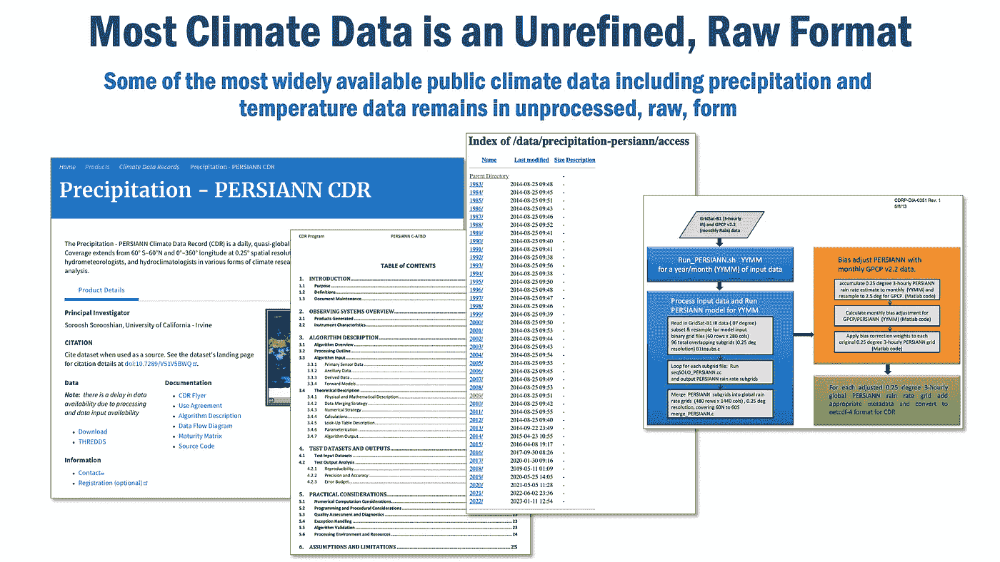

# 最强大的气候数据仍然被隐藏

> 原文：[`towardsdatascience.com/the-most-powerful-climate-data-remains-hidden-87cb0a0bf302`](https://towardsdatascience.com/the-most-powerful-climate-data-remains-hidden-87cb0a0bf302)

 [Eric Broda](https://medium.com/@ericbroda?source=post_page-----87cb0a0bf302--------------------------------)

·发表于[Towards Data Science](https://towardsdatascience.com/?source=post_page-----87cb0a0bf302--------------------------------) ·13 min read·2023 年 2 月 20 日

--

支撑全球可持续决策的气候数据和模型往往是专有的，对我们来说是隐藏的。数据市场、数据合同、数据许可和数据定价提供了共享这些重要信息的激励和做法。

由[Olga Vilkha](https://unsplash.com/@vilkha_olga?utm_source=unsplash&utm_medium=referral&utm_content=creditCopyText)拍摄，来源于[Unsplash](https://unsplash.com/s/photos/stamp-official?utm_source=unsplash&utm_medium=referral&utm_content=creditCopyText)

有几位贡献者和顾问为理解当前气候数据格局并塑造本文提供了巨大的帮助：Ellie Young（Common Action）、Philippe Höij（DFRNT.com）和 Andrew Padilla（Datacequia.com）。

# 使隐藏的气候数据可共享

向他人学习一直是人类进步的标志。我们在构建新的发明时，实际上是在前人的工作基础上“站在巨人的肩膀上”。因此，当我们看到丰富的公共气候数据，以及这些数据如何在全球范围内共享时，我们实际上是在气候数据巨人的隐喻肩膀上，他们免费分享气候数据以造福广大公众。

然而，简单而不幸的事实是，许多最有价值的气候数据对公众隐藏。那些被组织转换和丰富的数据。精炼的数据以支持更好的投资决策。被整理成专有模型的数据，推动组织做出的全球可持续性和气候决策。那些在组织内部“隐藏”的数据。

现在，“隐藏”这个词可能暗示着不良意图。明确地说，事实并非如此。实际上，“隐藏”的本质是转换、精炼和策划赋予公共数据巨大价值的结果。但这些数据并不可用。它是专有的。它是封闭的。因此，它被隐藏了。

实际问题是，每个组织几乎都在进行相同的工作，以处理、丰富和精炼这些公共数据，使其用于指导企业的可持续性和气候决策。但这些精炼的数据及其相关模型很少甚至从未被共享。

在这篇文章中，我将探讨这种不幸情况的根本原因。但或许更重要的是，我还将提供几种潜在的解决方案，以便更容易分享数据，揭示幕后情况，看到之前隐藏的内容。

# 气候数据是应对气候变化的基石

气候变化是我们时代最紧迫的问题之一，而气候数据的可用性对于理解问题、识别实际解决方案以及确定政策变更的实际影响至关重要。意识到这一点，政府和私人组织都会收集并发布大量的降水、风速和温度数据，以衡量和了解它们对气候变化的暴露。

这些数据至关重要——它用于提供政策决策、创建预测模型以及评估气候变化对经济各个部门的风险。

*图 1，大多数气候数据是未经精炼的原始格式*

# 从气候数据的消防栓中饮水

但今天，我们面临着大量免费的公共气候数据。像 NASA、NOAA 以及许多欧洲和国际组织都发布了大量有关温度、降水和各种传感器数据的精细数据。这些数据已经发布了几十年，并且每天仍在发布。比喻来说，我们正从气候数据的消防栓中饮水！

然而，大多数数据仍然是以原始格式存在，包含数值测量或文本。这些数据有很多不同的格式和结构，存在一致性和可用性方面的差异，使得非专家和专家都难以理解或使用。

# 应用气候数据——转换、精炼和策划

与此相比，“应用”的气候数据已经被转换、精炼和策划，以提取有意义的见解和模式。这通常涉及将多个原始的公共气候数据集结合起来，将它们与其他公共和私有数据关联，清理和组织数据，然后应用统计或机器学习技术来提取有意义的信息。

以保险公司为例。保险公司希望确保被保险资产的价格反映未来的气候风险。例如，他们可能会使用公开的天气、地形（洪泛区、河流）和人口数据来创建算法和模型，更好地理解洪水发生的概率。这些模型帮助决定是否为靠近洪泛区的财产提供保险。

资产管理者，例如，可能会使用各种排放、能源效率和政府数据，包括公共和私人数据，以了解他们的资产对气候变化的潜在暴露，从而更好地调整其风险和回报目标。

随着更严格的气候法规的出现，大多数组织正在准备报告他们自身的气候足迹。例如，他们可能会汇总来自核心业务、子公司和全球运营单位的排放数据，以向公众和其运营区域的监管机构提供报告。

# 应用数据是专有数据

然而，很明显，这些公司中的许多都在收集类似的数据并创建类似的算法。这种对气候数据轮子的“再发明”发生的原因有很多。

首先，许多公司不愿意共享他们的数据，因为他们担心竞争对手会利用这些数据获得竞争优势，或者他们的数据会被用来创建与自己直接竞争的新产品或服务。

其次，缺乏法律和监管框架来支持数据共享和数据定价。这使得公司难以建立有关数据共享和数据定价的明确规则和期望，进一步抑制了公司共享数据的意愿。

第三，数据可能缺乏来源和溯源，从而可能产生不可信的印象。

最后，也许最具挑战性的情况是，数据共享给数据发布者带来了实质性的潜在长期风险和义务，尤其是当第三方以意想不到的方式使用这些数据时。

简而言之，基于气候数据做出的决策具有长远的时间跨度和长期的后果，尤其是当数据可能出错时；这不是故意的错误，而是可能在长时间内被放大的小错误导致大错误，或者算法被错误调整。任何具有长期尾部的决策，都可能引发巨大的成本。

例如，考虑以下情景：一个资产管理者发布了关于沿海房地产洪水概率的数据。一个房地产开发商使用这些数据，在根据资产管理者的分析，洪水概率相对较低的土地上进行建设。几年后，尽管洪水概率较低，但新建的物业却意外被淹没了。会发生什么？损失和法律诉讼。

# 使应用数据可用

但如果其他组织可以通过共享他们的私人气候数据来帮助他人更好地预测洪水会怎么样？如果组织共享他们的气候模型来帮助他人做出更明智的气候投资决策会怎么样？如果可以更容易地分享私人气候数据和模型，而没有下游风险呢？

*图 2，公开隐藏的气候数据*

一些努力正在解决这些挑战。例如，一些倡议（如[OS-Climate](https://os-climate.org/)）正在建立共同的数据标准、协议和平台，以便更容易找到和使用气候数据。联合国以及许多前瞻性的政府正在建立监管指南和框架，鼓励气候数据共享。此外，还建立了数据市场和数据合作社，以促进合作，创建一个公平的数据生态系统，提供透明的数据定价。

还有更多工作需要完成。现今在其他行业中有哪些用例可以教会我们如何共享数据？也许我们可以将“创意共享”许可中学到的经验应用于限制或管理共享气候数据的风险；或者开源软件许可提供了一些新的思路？或者可能有“数据合同”的示例，可以标准化气候数据格式和结构？

从隐喻上说，我们应该站在数据巨人的肩膀上，运用现今最佳实践来增强和赋能未来的气候数据工作。我们已经学到了哪些教训可以应用——现在——使共享气候数据变得更加广泛和安全。

*图 3，迈向气候数据生态系统*

# 经验教训：创意共享（可共享的理念——许可）

[创意共享](https://creativecommons.org/)组织提供了一套版权许可，使创作者能够分享他们的作品，同时通常允许第三方将创作者的内容用于非商业目的或制作衍生作品。但它也至关重要地让创作者保留对其作品使用方式的一定控制权。

创意共享常用于创意作品，如音乐、艺术、写作和软件。这些许可容易理解且免费使用，使创作者在保护自己权利的同时相对容易地分享他们的作品。

*图 4，可共享的理念——创意共享许可*

我们可以从非常流行的**创意共享（CC）**许可方案中学到什么教训？通过使用 CC 许可概念，数据许可应该允许数据创作者指定他人使用数据的条件，比如允许他人将其用于非商业目的、制作衍生作品或与他人分享。

例如，创建了数据集的数据科学家可以使用 CC 许可允许他人利用数据进行进一步分析或研究；政府机构可以使用 CC 许可允许他人利用其数据创建新产品或服务；公司可以使用 CC 许可允许他人利用其数据创造对社会有益的新创新。

# 经验教训：开源软件许可证（可共享软件）

软件许可是一种保护软件创作者免受意外使用和发布软件的意外后果风险的方法，通过明确定义可以使用的条款和条件。通过创建软件许可证，创作者可以明确指定软件的使用方式、使用者和目的。这有助于防止软件被用于创作者未预期的方式，或者可能对创作者或他人造成伤害的方式。

*图 5，可共享软件 — 开源软件许可*

以下是几种保护软件创作者的开源软件许可技术：

+   **使用**：许可证可以包括对软件使用方式的限制，例如禁止将软件用于商业目的。

+   **归属**：许可证可以要求对软件的任何使用都必须归属创作者，这有助于保护创作者的知识产权。

+   **责任**：许可证可以包括规定，要求用户对因使用软件而可能造成的任何损害负责，这有助于保护创作者免受法律诉讼。

+   **审计**：许可证可能包括允许创作者监控和跟踪软件使用情况的条款，这有助于确保遵守许可证条款。

今天有几种流行的开源许可证，例如 GNU 通用公共许可证（GPL）、MIT 许可证和 Apache 许可证，每种许可证都有类似但不同的条款和条件。

那么，我们如何将开源软件许可证中的概念应用于气候数据共享呢？通过调整基于开源软件许可证的共享方案模型，气候数据创作者可以明确：

+   **使用**：气候数据发布者可以限制使用或根据需要进行灵活调整；例如，原始气候数据可能会被自由和开放地共享，没有限制。但复杂的模型和算法可能需要严格的使用条款。

+   **归属**：气候数据发布者可能会出于多个原因要求对其数据进行归属：这可能会为发布者建立声誉，从而带来商业机会，或者它可能作为促进正式数据来源和血统的工具。

+   **责任**：气候数据发布者可能要求包括保护条款，以防第三方使用或滥用。这将使数据发布者能够减轻由于数据不准确、错误或缺乏精确性所带来的潜在风险。

+   **审计**：气候数据发布者，特别是当其数据被用于商业用途时，可能要求数据使用者验证使用量，以确保适当的计费。

# 经验教训：OpenAPI 规范（可共享合同）

数据合同是一种定义数据共享、使用和保护条款和条件的协议。在许多情况下，它规定了数据提供者、数据接收者以及任何中介的权利和责任。但数据合同也提供了数据交换格式和结构的定义。

发布数据交换的格式和结构具有多个好处，包括：

+   **互操作性**：标准化的格式和结构使得不同的系统和应用能够轻松交换信息。

+   **重用性**：数据可以被许多系统和应用重复使用，从而减少数据重复（并且提高效率）。

+   **可访问性**：发布数据交换的格式和结构使得理解和共享变得更加容易。

+   **创新**：清晰的数据格式和结构能够促进创新，使开发者能够在现有数据基础上轻松构建新的应用和服务。

*图 6，可共享合同 — OpenAPI 规范*

那么，我们如何使用基于 OpenAPI 规范（OAS）建模的合同来定义数据如何交换呢？数据创建者可以使用类似 OAS 的数据交换规范来获得几个好处：

+   **数据规范文档**：与 OAS 类似，数据创建者可以创建规范，允许开发者自动生成他们 API 的人类可读文档，这使得其他开发者更容易理解和使用 API。

+   **数据规范测试**：与 OAS 类似，数据创建者可以自动生成数据交换的测试用例，这有助于确保其按预期工作。

+   **数据规范客户端生成**：与 OAS 类似，数据创建者可以自动生成他们 API 的客户端代码，这使得将数据产品与其他应用进行集成变得更加容易。

+   **数据规范访问权限**：与 OAS 类似，数据创建者可以嵌入安全模式和范围，定义访问数据产品所需的权限。

# 经验教训：数据市场（可共享数据）

数据市场是一个平台或网络，使得查找、理解、共享和信任数据变得容易。它通常将数据提供者（发布数据的）与数据消费者（寻找特定类型数据以供使用的）连接起来。数据市场帮助组织快速、轻松地访问高质量的数据，同时也为数据提供者提供了新的发布方式，甚至可能将数据资产货币化。

*图 7，可共享数据 — 数据市场*

考虑以下场景：假设一个前瞻性的非营利组织（一个没有商业动机的非营利组织）正在建立一个“气候数据市场”，作为气候数据的注册中心。该非营利组织的气候数据市场类似于互联网的 DNS（域名服务）——气候数据市场通过提供气候数据的指针（URL）目录，使搜索和查找所需气候数据变得简单（实际上，它可能还会提供更多内容：直观的用户界面、气候数据类别的策划层级和知识图谱、文档和数据术语表，但这属于另一篇文章的内容）。

数据市场也提供了可以应用于数据共享的教训。数据市场可以解决当前的数据所有权和控制问题，个人和社区对其数据的控制有限，且从使用中获益较少。数据市场提供了实施上述教训的总体结构，包括：

+   **用户界面和支持平台**，旨在使数据的查找和理解变得简单。

+   **许可**，旨在通过提供一致、标准和易于理解的数据共享条款和条件，使数据共享变得容易。

+   **规范**，旨在通过定义访问数据所需的交互机制，使数据集成变得容易。

+   **合同**，旨在通过提供数据科学家和开发者构建模型和应用所需的元数据定义、信息结构和格式，使数据更易于使用。

# 结论性思考

本文讨论了为什么许多最有价值的气候数据对公众视野和使用隐藏。我还强调了为什么会这样，同时提出了几种潜在的解决方案，所有这些方案都基于对现有方法的调整，使其更易于分享数据。

我还发现了一个潜在的根本原因，那就是当前气候数据共享实践未能充分保护数据创造者的权利和需求。艺术、软件、创意、数据合同及其他领域提供了丰富的建议，用于保护数据产品的逻辑、内容、使用等方面，并进一步提供了规范数据更新、贡献和改进的协作协议的建议。

我们希望这些想法能够扩展并付诸实践，以便将一些精炼、处理和丰富的数据——以及背后的算法——置于公共领域或以更简单、更负责任的方式共享。我们希望各组织在重新发明、重建和复制数据、算法和模型方面所付出的努力，能够更具建设性和有效性地应对我们的气候危机。

***

*除非另有说明，本文档中的所有图片均由 Eric Broda（本文作者）创建。所有图像中使用的图标都是库存的 PowerPoint 图标和/或不受版权保护的。*

*本文中表达的意见仅代表作者的观点，并不一定反映任何客户的观点。*
