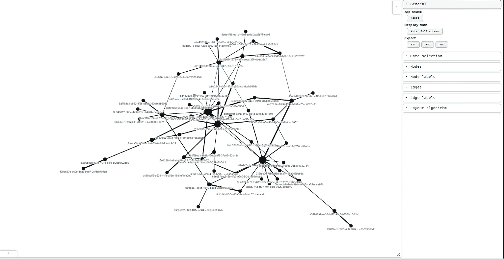
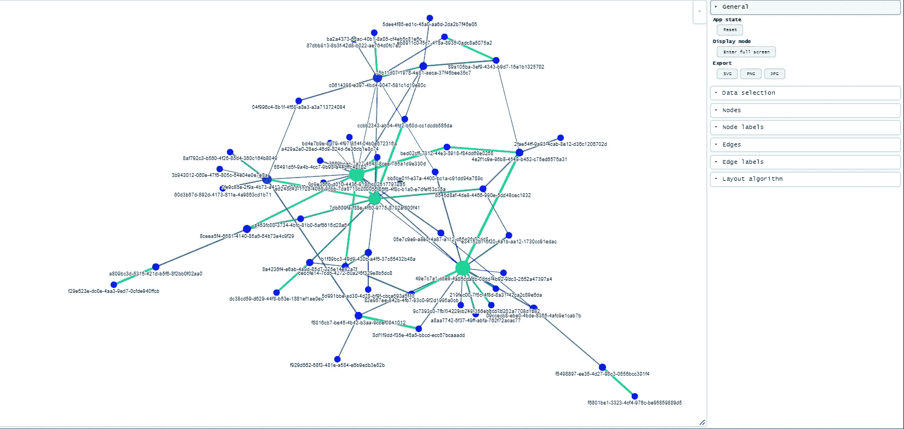
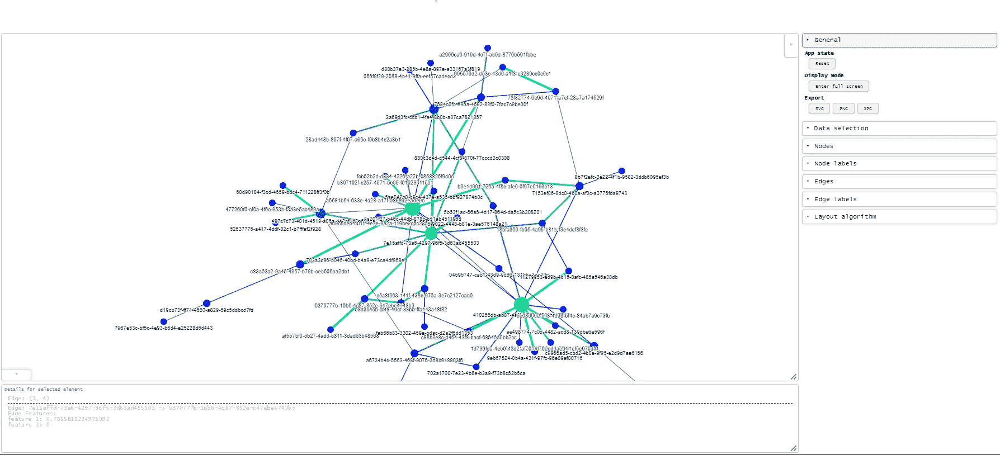
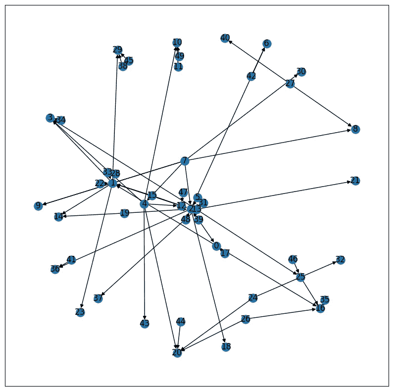
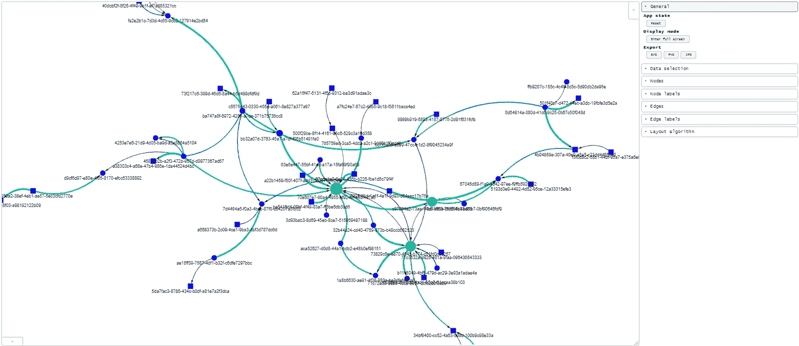

# 新的最佳 Python 包用于可视化网络图

> 原文：[`towardsdatascience.com/the-new-best-python-package-for-visualising-network-graphs-e220d59e054e`](https://towardsdatascience.com/the-new-best-python-package-for-visualising-network-graphs-e220d59e054e)

## 一份指南，介绍谁应该使用它，何时使用，如何使用，以及我之前的错误…

[](https://medium.com/@bl3e967?source=post_page-----e220d59e054e--------------------------------)[](https://towardsdatascience.com/?source=post_page-----e220d59e054e--------------------------------) [本杰明·李](https://medium.com/@bl3e967?source=post_page-----e220d59e054e--------------------------------)

·发布于 [Towards Data Science](https://towardsdatascience.com/?source=post_page-----e220d59e054e--------------------------------) ·10 分钟阅读·2023 年 11 月 23 日

--


图片由[Chris Ried](https://unsplash.com/@cdr6934?utm_source=medium&utm_medium=referral)拍摄，来源于[Unsplash](https://unsplash.com/?utm_source=medium&utm_medium=referral)

# 介绍

在这篇文章中，我将向你介绍一个我偶然发现的 Python 包，依我拙见，它是目前为止我见过的*最佳*网络图可视化工具。

需要紧凑且强大的可视化包来进行快速原型设计、探索性数据分析或调试网络模型的数据科学家最适合阅读下面的内容。

我们将要检查的包叫做：[gravis](https://robert-haas.github.io/gravis-docs/)

[](https://robert-haas.github.io/gravis-docs/?source=post_page-----e220d59e054e--------------------------------) [## gravis — gravis 0.1.0 文档

### 编辑描述

robert-haas.github.io](https://robert-haas.github.io/gravis-docs/?source=post_page-----e220d59e054e--------------------------------)

我个人在日常工作中经常使用图神经网络，坦白说，我很烦恼之前没有早些知道这个包，因为它本可以节省我很多时间和精力，避免了在使用我之前提到的那些包（`ipysigma`和`pyvis`）时遇到的不足。

[](https://medium.com/@bl3e967/the-two-best-tools-for-plotting-interactive-network-graphs-8d352aa894d4?source=post_page-----e220d59e054e--------------------------------) [## 绘制互动网络图的两个最佳工具

### 一份指南，说明如何使用它们，何时使用它们，以及谁应该使用它们。

medium.com](https://medium.com/@bl3e967/the-two-best-tools-for-plotting-interactive-network-graphs-8d352aa894d4?source=post_page-----e220d59e054e--------------------------------)

## **什么使网络可视化软件包成为最佳？**

一个可视化软件包需要具备： 

+   创建一个完全交互的可视化，其中我可以点击节点和边并查看其属性，还可以拖放它们。

+   方便实现——不需要太多代码（像 Dash 那样），但对大多数用例来说足够强大和灵活。

+   对节点和边的数量具有适度的良好扩展性——我们不是在做生产级别的东西，但我们需要它至少能处理几百个节点。

+   兼容 Python 中常用的网络包，如`networkx`。

## 我们将对什么进行测试？

广义地说，我们可以根据图是否是同质的或异质的，或者是否有向或无向边来对图进行分类。

因此，我们将对使用`networkx`生成的两种类型的图进行测试。

（1）一个同质的无向图

（2）一个异质的有向多重图

因为这代表了可能遇到的两个极端。如果你不熟悉这些术语，我建议你访问[我的上一篇文章](https://medium.com/@bl3e967/the-two-best-tools-for-plotting-interactive-network-graphs-8d352aa894d4)并快速阅读介绍部分。

## TL;DR

+   同质 = 1 种类型的节点

+   异质 = 多种类型的节点和/或边

+   无向 = 边没有方向

+   有向 = 边有方向

+   多重图 = 两个节点之间可以有多条边

## 设置和安装

该软件包可以通过 pip 简单安装：

```py
pip install gravis
```

我们还需要安装以下软件包以生成测试图。

```py
pip install numpy, matplotlib, networkx
```

你还可以在这个仓库中找到我使用的所有代码。

[](https://github.com/bl3e967/medium-articles?tab=readme-ov-file&source=post_page-----e220d59e054e--------------------------------) [## GitHub - bl3e967/medium-articles: 我在 Medium 文章的附带代码。

### 我在 Medium 文章的附带代码。通过创建一个账户来贡献 bl3e967/medium-articles 的开发…

github.com](https://github.com/bl3e967/medium-articles?tab=readme-ov-file&source=post_page-----e220d59e054e--------------------------------)

# 同质无向网络示例

所以，为了开始，我们需要一个图来绘制。我们将编写一个简单的图生成器函数，它将返回一个`networkx.Graph`对象。我们将向其节点和边添加属性，以模拟数据科学家在工作中可能看到的数据。

## 图生成器

我们使用一个随机图生成器，我选择了`networkx.dual_barabasi_albert_graph`方法来模拟一个无尺度网络。

我们添加了节点级别的属性，例如`degree`、`betweenness_centrality`，以及一些用随机数字生成的虚构特性，我们称之为`feature1`、`feature2`、`feature3`。

我们对边也做了相同的处理，并添加了特性`feature1`和`feature2`。

我们最终为每个节点标上`uuid`（**U**niversally **U**nique **ID**entifier），使其看起来更像真实数据。

```py
def get_new_test_graph():
    NUM_NODES = 50
    p = 0.5
    seed = 1
    test_graph = nx.dual_barabasi_albert_graph(n=NUM_NODES, p=p, seed=seed, m1=2, m2=1)

    # add node properties
    nx.set_node_attributes(test_graph, dict(test_graph.degree()), name='degree')
    nx.set_node_attributes(test_graph, nx.betweenness_centrality(test_graph), name='betweenness_centrality')

    for node, data in test_graph.nodes(data=True):
        data['node_identifier'] = str(uuid.uuid4())
        data['feature1'] = np.random.random()
        data['feature2'] = np.random.randint(0, high=100)
        data['feature3'] = 1 if np.random.random() > 0.5 else 0

    # add edge properties
    for _, _, data in test_graph.edges(data=True):
        data['feature1'] = np.random.random()
        data['feature2'] = np.random.randint(0, high=100)

    return test_graph
```

当我们使用`networkx`绘制图形时，我们会得到如下结果：

```py
test_graph = get_new_test_graph()
nx.draw(test_graph)
```


50 节点的测试图，均匀且无向。

## 使用 gravis 绘图

现在我们开始使用`gravis`绘制这个图。使用这个包非常简单，完整的效果如下。

```py
import gravis as gv 

gv.d3(
    test_graph, 

    # graph specs
    graph_height=500,

    # node specs
    node_size_data_source="betweenness_centrality",
    use_node_size_normalization=True,
    node_size_normalization_min=15,
    node_size_normalization_max=35,
    show_node_label=True,
    node_label_data_source='node_identifier',

    # edge specs
    edge_size_data_source='feature1',
    use_edge_size_normalization=True,
    edge_size_normalization_min=1,
    edge_size_normalization_max=5,

    # force-directed graph specs
    many_body_force_strength=-500
)
```

让我们将其拆分为几个部分。

假设我们想根据节点的`betweenness_centrality`值来缩放节点大小，并根据边的`feature1`值来缩放边的厚度。

我们设置`use_node_size_normalization=True`，以便节点大小根据`betweenness_centrality`的归一化值进行设置，并定义`node_size_normalization_min`和`node_size_normalisation_max`来设置我们希望的最小和最大节点大小。

```py
 # node specs
    node_size_data_source="betweenness_centrality",
    use_node_size_normalization=True,
    node_size_normalization_min=15,
    node_size_normalization_max=35,
```

我们使用等效的参数来控制边的厚度：

```py
 # edge specs
    edge_size_data_source='feature1',
    use_edge_size_normalization=True,
    edge_size_normalization_min=1,
    edge_size_normalization_max=5,
```

最后，我将`many_body_force_strength`参数设置为`-500`，使边的长度比默认值更长，以使图形更清晰可见。

结果图如下所示。



我们的均质无向图通过 gravis 进行可视化

## 添加颜色

除了按照`betweenness_centrality`缩放节点大小外，我还希望根据此进行着色。

我们可以通过简单地向节点添加`color`属性来实现这一点。我可以使用命名颜色，如‘red’，‘blue’，‘green’，在这里我不会做这个，因为这太简单了。让我们尝试使用颜色比例。

我想根据`matplotlib`中的`winter`颜色图来缩放这些值。


低中心性值将被映射为蓝色，高中心性值将被映射为绿色。

我有一个非常有用的`MplColorHelper`类，我在项目中使用过很多次，它可以将数值转换为`RGB`字符串。

```py
class MplColorHelper:

    def __init__(self, cmap_name, start_val, stop_val):
        self.cmap_name = cmap_name
        self.cmap = plt.get_cmap(cmap_name)
        self.norm = mpl.colors.Normalize(vmin=start_val, vmax=stop_val)
        self.scalarMap = cm.ScalarMappable(norm=self.norm, cmap=self.cmap)

    def get_rgba(self, val):
        return self.scalarMap.to_rgba(val, bytes=True)

    def get_rgb_str(self, val):
        r, g, b, a = self.get_rgba(val)
        return f"rgb({r},{g},{b})"
```

我只需要指定我们希望缩放颜色图的最小和最大值。

所以，要根据`betweenness_centrality`着色节点，我们可以如下操作：

```py
# the matplotlib colourmap we want to use
CM_NAME = "winter"

# initialise colour helper
vals = nx.get_node_attributes(test_graph, 'betweenness_centrality').values()
betweenness_min, betweenness_max = min(vals), max(vals)
node_colors = MplColorHelper(CM_NAME, betweenness_min, betweenness_max)

# get rgb string for each node
for node, data in test_graph.nodes(data=True):
    data['color'] = node_colors.get_rgb_str(data['betweenness_centrality'])
```

对于边，我们可以根据`feature1`来着色它们。

```py
# initialise colour helper 
vals = nx.get_edge_attributes(test_graph, 'feature1').values()
val_min, val_max = min(vals), max(vals)
edge_colors = MplColorHelper(CM_NAME, val_min, val_max)

# get rgb string for each node
for u, v, data in test_graph.edges(data=True):
    data['color'] = edge_colors.get_rgb_str(data['feature1'])
```

完成了，让我们来添加颜色：



同质无向网络的节点和边的颜色

最后，`gravis`允许我们使用可视化底部的信息栏显示每个节点或边上存储的任何自由文本。

我们将使用它来显示我们的特征值——我们将特征值格式化为一些文本，并保存到名为`click`的属性中：

```py
# node features
for node, data in test_graph.nodes(data=True):
    data['click'] = (
        f"Node: {data['node_identifier']}"
        "\nNode Features:" +
        f"\nfeature 1: {data['feature1']:.3f}" + 
        f"\nfeature 2: {data['feature2']:.3f}" + 
        f"\nfeature 3: {data['feature3']:.3f}" + 
        f"\nBetweenness Centrality: {data['betweenness_centrality']:.3f}" + 
        f"\nDegree: {data['degree']}"
    )

# edge features
for u, v, data in test_graph.edges(data=True):
  data['click'] = (
        f"Edge: {test_graph.nodes[u]['node_identifier']} -> {test_graph.nodes[v]['node_identifier']}" +
        f"\nEdge Features:" + 
        f"\nfeature 1: {data['feature1']}" + 
        f"\nfeature 2: {data['feature2']}"
    )
```

现在我们能够通过屏幕底部的面板非常好地显示我们的特征值（我把图形做得特别大，以便你可以像在屏幕上看到的那样看到它）。


显示在底部面板中的节点特征详细信息的可视化。



显示在底部面板中的边特征详细信息的可视化。

我们有一个完全互动的可视化，允许我们拖动节点，并且有一个侧边栏用于更改节点和边的可视化设置、标签和布局算法。

它还允许你使用设置栏将可视化导出为图像——无需额外代码！最后，如果你希望与他人分享这个互动图，你可以将其导出为自包含的 HTML 文件：

```py
fig = gv.d3(test_graph, *args, **kwargs)
fig.export_html("graph_to_export.html")
```

# 异质有向网络示例

我们现在尝试使用`gravis`可视化一个异质有向网络。

## 图生成器

再次，我们需要一个函数来返回这样的图。我们将使用之前的相同函数，但这次使用`nx.scale_free_graph`函数。

我们还添加了一个`node_type`属性来模拟异质图。前 25 个节点将是`node_type = 0`，其余的将是`node_type = 1`。

```py
def get_new_test_digraph():
    NUM_NODES = 50
    # We change the graph generator function here
    test_graph = nx.scale_free_graph(n=NUM_NODES, seed=0, alpha=0.5, beta=0.2, gamma=0.3)

    # add node properties
    nx.set_node_attributes(test_graph, dict(test_graph.degree()), name='degree')
    nx.set_node_attributes(test_graph, nx.betweenness_centrality(test_graph), name='betweenness_centrality')

    for node, data in test_graph.nodes(data=True):

        # assign node type so we have heterogeneous graph
        data['node_type'] = 0 if node < 25 else 1

        # same as before, a add ther node features.
        data['node_identifier'] = str(uuid.uuid4())
        data['feature1'] = np.random.random()
        data['feature2'] = np.random.randint(0, high=100)
        data['feature3'] = 1 if np.random.random() > 0.5 else 0

    # add edge properties
    for u, v, data in test_graph.edges(data=True):
        data['feature1'] = np.random.random()
        data['feature2'] = np.random.randint(0, high=100)

    return test_graph
```

使用`nx.draw`绘制得到如下图：



异质有向多图，编号以显示哪些节点属于哪种类型。

## 使用 gravis 绘图

我们对异质图的绘制方式与上述完全相同。我们可以使用相同的方法：

+   生成测试多有向图

+   为节点和边添加特征值

+   根据属性值为节点和边添加颜色

现在我们需要做的就是指定每个节点的形状，因为现在我们处理的是多种不同的节点类型。

对于我们的图生成函数`get_new_test_digraph`，我们只需要在遍历节点的`for`循环中添加这一行代码：

```py
for node, data in test_graph.nodes(data=True):

    data['node_type'] = 0 if node < 25 else 1 # add this line 
```

对于模拟实际数据的目的，我们将图中的前 25 个节点设置为`node_type = 0`，其余为`node_type = 1`。

接下来，我们可以使用`shape`属性在 gravis 中指定我们想为每个节点使用的形状。

在这里，我们将`node_type = 0`设置为圆形，将`node_type = 1`设置为矩形。

```py
for node, data in test_graph.nodes(data=True):
    data['value'] = data['betweenness_centrality'] # node size
    data['label'] = data['node_identifier'] 
    data['title'] = (
        f"Node: {data['node_identifier']}"
        "\nNode Features:" +
        f"\nfeature 1: {data['feature1']}" + 
        f"\nfeature 2: {data['feature2']}" + 
        f"\nfeature 3: {data['feature3']}" + 
        f"\nBetweenness Centrality: {data['betweenness_centrality']}" + 
        f"\nDegree: {data['degree']}"
    ) 
    data['color'] = node_colors.get_rgb_str(data['betweenness_centrality'])

    ## add this line to specify shape. 
    data['shape'] = 'dot' if data['node_type'] == 0 else 'rectangle'
```

我们现在准备在`gravis`中绘制我们的网络。注意我们添加了`edge_curvature`参数，使其不为零。这是为了防止当节点很多时，两个节点之间的边重叠。

```py
 gv.d3(
    test_graph, 

    graph_height=700,

    node_size_data_source="betweenness_centrality",
    use_node_size_normalization=True,
    node_size_normalization_min=15,
    node_size_normalization_max=35,
    show_node_label=False,
    node_label_data_source='node_identifier',

    edge_size_data_source='feature1',
    use_edge_size_normalization=True,
    edge_size_normalization_min=1,
    edge_size_normalization_max=5,

    # Specify curvature to differentiate between the multiple
    # edges between two nodes.
    edge_curvature=-0.5,

    many_body_force_strength=-500
)
```



在 gravis 中绘制的 MultiDiGraph，边的曲率和形状根据节点类型设置。

完美！简单方便。你可以看到图左侧和顶部一些节点之间的多个连接。

# 总结——为什么我认为 Gravis 是最好的

我已经提到过我写了另外两个包，我坚信它们是最好的——`pyvis`和`ipysigma`。当时我对此深信不疑，因为我自己在日常工作中一直在使用它们。

然而，它们各自都有独特的问题，事后看来，这使得它们的效果不尽如人意，这也是我在同一个博客中讨论这两者的原因！根据使用场景，它们中有一个比另一个更好，我建议用户在不同情况下使用哪个。

这就是为什么我在发现`gravis`时感到震惊，因为它似乎有人完全按照相同的思路开发了这个包，*结合*了`pyvis`和`ipysigma`的优点，制作了一个完美的工具。

首先，`gravis`提供了*完全*互动的用户界面，你可以：

+   不仅可以点击节点和边以显示信息，还允许用户拖放节点，这对于需要手动调整物理引擎的复杂网络非常有用（而`ipysigma`缺乏这一点）。

+   节点或边的信息通过屏幕上的一个栏展示，该栏整齐地容纳了信息，还允许从中复制信息（*这是一个小但非常重要的功能，`pyvis`中缺乏这一点，这让我在工作中非常困扰*）。

+   提供了一个不同的侧边栏，通过它你可以调整物理引擎参数，改变节点和边的可视化设置，并通过按钮将图形导出为图像。

+   另外，它可以显示节点之间的多个边（再次说明，`ipysigma`无法做到这一点）。

因此，`gravis`消除了在`pyvis`和`ipysigma`之间进行选择的必要性，因为它将这两个包合并为一个，同时保持了它们的所有优点。

简而言之，它满足了所有要求，并且表现出色。

我强烈推荐这个包。

在评论区告诉我你的想法，如果你喜欢我的文章，请鼓掌或者分享给可能感兴趣的人。
