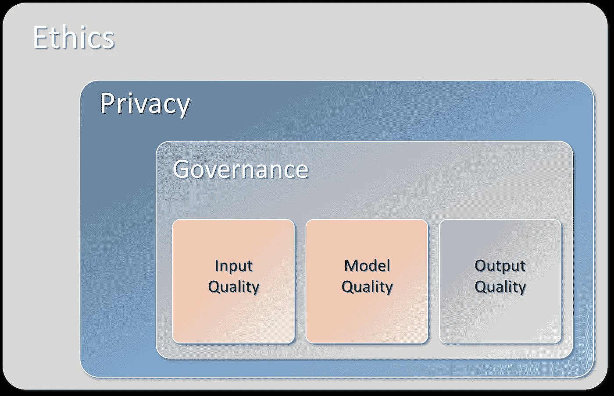

# 下一步是负责任的人工智能。我们如何实现这一目标？

> 原文：[`towardsdatascience.com/the-next-step-is-responsible-ai-how-do-we-get-there-ecce929a1c03`](https://towardsdatascience.com/the-next-step-is-responsible-ai-how-do-we-get-there-ecce929a1c03)

## 机器学习解决方案在我们的生活中占据了重要地位。现在不仅仅是关于性能，还有关于*责任*。

 [Erdogan Taskesen](https://erdogant.medium.com/?source=post_page-----ecce929a1c03--------------------------------)

·发表于[Towards Data Science](https://towardsdatascience.com/?source=post_page-----ecce929a1c03--------------------------------) ·阅读时间 12 分钟·2023 年 8 月 26 日

--

照片由[Jude Infantini](https://unsplash.com/@judowoodo_?utm_source=unsplash&utm_medium=referral&utm_content=creditCopyText)拍摄，发布在[Unsplash](https://unsplash.com/photos/mI-QcAP95Ok?utm_source=unsplash&utm_medium=referral&utm_content=creditCopyText)

在过去几十年中，许多人工智能项目专注于模型效率和性能。结果记录在科学文章中，最佳性能的模型被部署在组织中。现在是将另一个重要部分纳入我们的人工智能系统的时候了；*责任感*。这些算法将继续存在，如今每个人都可以通过 chatGPT、co-pilot 和提示工程等工具接触到它们。现在更具挑战性的部分包括道德咨询、确保谨慎委托和告知利益相关者。这些实践共同促进了负责任和伦理的人工智能环境。*在这篇博客文章中，我将描述在人工智能项目中责任感的含义，以及如何通过 6 个实用步骤将其融入项目中。*

# 负责任的人工智能简要介绍。

在我深入探讨负责任的人工智能（rAI）之前，让我首先概述一下数据科学领域中采取的一些重要步骤。在之前的博客中，我写过关于[*数据科学中需要学习的内容 [1]*](/the-path-to-success-in-data-science-is-about-your-ability-to-learn-but-what-to-learn-92efe11e34bf)，以及数据科学产品如何可以增加收入、优化流程和降低（生产）成本。目前，许多部署的模型在性能和效率方面得到了优化。换句话说，模型应具有高预测准确性和低计算成本。然而，更高的模型性能通常会伴随模型复杂度的逐渐增加。一些模型被称为“*黑箱模型*”。例如，在图像识别和文本挖掘领域，神经网络使用特定的模型架构在数亿个参数上进行训练。理解这些模型为何做出特定决策变得困难甚至不可能。另一个例子是在金融领域，许多核心流程依赖于算法，机器每天都会做出决策。最重要的是，当需要时，这些机器做出的决策必须能够由人工进行事实核查和重新评估。

为了揭开黑箱模型，一个新的数据科学领域应运而生，这就是*可解释人工智能*，简称*xAI*。新的 xAI 算法阐明了模型的决策，并帮助研究人员和数据科学家解释模型为何做出特定的决策。*让我们进入下一部分，看看为何负责任的行为至关重要！*

# 新技术使人工智能变得更加可及。

尽管机器学习解决方案已经存在多年，但我们仍然处于一个新纪元的初期，这一纪元中算法被应用于各种过程和领域，从金融到医学。迄今为止，只有少数数据科学家创建、使用和部署这些模型。那些学习过数学/统计学和其他精确学科的人知道如何训练模型和编写编程代码。这种情况将发生剧烈变化，因为我们正处于一个几乎每个拥有互联网连接的人都可以访问各种算法的时代。技术如 chatGPT、co-pilot 和提示工程，加上生成性人工智能的发展，开始让复杂的数据科学世界变得可及。这意味着没有统计知识和编程技能的个人现在也可以创建模型，而不需要理解其具体工作原理。因此，我们需要制定一些规则，因为创建和部署机器学习模型不是一件可以轻视的事情[6]。

> 创建和部署机器学习模型不是一件可以轻视的事情！

如果我们回顾算法发展的历程，最初是数学家和统计学家创建了核心基础算法 (#1)。然后是学术机构的科学家们优化/改进和/或扩展了核心基础 (#2)。接着是科学程序员将包含数学方程式的科学文章翻译成应用程序 (#3)。仅仅十年前，所谓的“数据科学家”出现了，这基本上是前面三组的混合体，我们现在可以称之为基础数据科学家 (#4a)。随后，第二组数据科学家出现了；他们专注于应用，也被称为应用数据科学家 (#4b)。由于算法和方法需要被部署和维护，新的开发者群体，如（数据）工程师，也逐渐进入这个领域 (#5)。*直到现在，处理复杂机器学习模型的群体仍然是专业的科学家、开发者和程序员。*

很快，在数据科学领域将会出现一个新群体：那些没有统计学/编程经验但拥有足够技术知识，通过依赖副驾驶和类似 chatGPT 的技术来创建和部署人工智能产品的人。随着时间的推移，也许更多的非技术人员也会创建机器学习模型，因为基本上，你只需要一条连接互联网的线路和最新的技术。

> 我们正处于一个只需要互联网连接就能创建人工智能模型的阶段。

新的大型语言模型 (LLMs) 是一个技术和革命性的进步，但我们也需要考虑可能的风险和后果。如果我们回顾开发者的发展轨迹，可以清楚地看到，在每个步骤中，越来越多的人可以使用复杂的人工智能方法。然而，存在一个权衡：在每个步骤中，个人对底层算法和/或编程代码的具体工作机制变得越来越不知情。

> ***在未来几年，数据和算法的使用可能会呈指数增长。我们正处于一个需要制定规则和最佳实践的阶段，以便负责任地使用最新的技术。***

# 负责任的人工智能的六个部分。

当我们谈论*负责任的人工智能 (rAI)*时，这不仅仅是我们需要完成或关注的单一任务。与人工智能打交道时的责任意味着我们需要在项目的所有（非）技术步骤中仔细考虑我们所做的决定。作为数据科学家，我们可能需要在数据收集、模型训练、输出和可视化模型结果的过程中做出数十到数百个决策。然而，作为数据科学家的责任甚至在数据收集之前就开始了，因为你可能需要问这样一个问题：*为什么需要使用选定的技术？它的目的是什么，它打算产生什么结果？*

> 数据科学家的责任甚至在数据收集之前就开始了。

如果对这些问题的回答仍然关乎人工智能的必要性，那么我们需要保护基本权利，如隐私，包括治理，并注意数据输入质量、模型质量和输出质量。负责任的人工智能可以总结为六个部分，其中伦理贯穿所有部分：隐私、治理、输入质量、模型质量和输出质量。*在接下来的章节中，我将更详细地描述这六个主题*。

作者创建的图像。

# 1\. 隐私。

在开始项目之前，首要步骤是关注隐私方面的问题。当我们谈论隐私时，它可以是个人数据，如年龄、性别等，也可以是其他机密信息，如政治和宗教偏好。还可能有间接信息，例如车牌号，可以与个人相关联。这些数据必须在整个项目过程中以及之后得到保护和保障。

然而，这并不意味着我们不能使用这种数据。我们可以在项目中使用此类信息，但需要仔细审查其影响，并确保它只能用于官方验证的任务。

> 使用个人信息需要仔细审查其影响，并确保它只能用于验证的任务。

我们应包括以下几点：

1.  一般数据保护条例（GDPR）是否适用？

1.  是否有官员参与，例如数据保护官、隐私顾问、信息安全官和首席信息官？

1.  你如何考虑输入、模型和结果输出中的潜在不希望的偏见？偏见可能对对象、人物或群体产生假设。误解可能导致不公正的结果，应竭尽全力加以防止。

还有一些变体库可以帮助保护隐私，例如 [*Faker*](https://github.com/faker-ruby/faker) *[2]*，它可以将真实的名字、地址和其他元信息更改为虚假的。

# 2\. 治理。

如果谈论数据治理，我们需要知道*谁是联络人、维护者或负责此数据集的人*。这很重要，因为这个人可能会告诉我们更多关于数据集的所有权、可用性、质量、完整性和安全性的信息。除了***数据治理***之外，还有类似的***模型治理***，也需要解决类似的问题。那么，谁是*联络人、维护者或负责已开发模型的人*？因为我们还需要确保模型的质量、完整性和安全性。考虑这一点；*我们可以创建一个符合所有规则并且表现出色的模型，但如果有人使用“错误”的输入数据，那么输出将不可信*。例如，当数据集中意外缺少值时，或当特征的排序被更改时，也会出现这种情况。许多场景可能导致不可靠的结果。

结论是，需要制定流程来测试输入数据集和模型（输出）的合规性。不同的组织会有不同的流程，只需确保在 AI 系统实施之前已确定这些流程。

# 3\. 数据输入质量。

输入数据集的良好质量对于创建可靠模型至关重要。这听起来可能很简单，但在数据科学项目中需要比现在更多的关注。在最佳情况下，数据集应该没有偏差、没有不准确、错误和其他类型的错误。在实际操作中，我们需要处理可用的数据集，并以最佳方式应对所有挑战。这意味着我们需要负责，并通过进行合理性检查、绘制图表并与数据所有者或领域专家讨论结果来仔细分析数据集的质量（参见治理）。

数据集的质量可以逐步检查，从向数据所有者或领域专家提出广泛的问题开始，然后进行更深入的技术分析。

1.  输入（数据）是如何收集和结合的？

1.  数据收集是否随时间发生了变化？考虑（新）传感器、环境变化、温度或不同的存储方式等

1.  数据是如何标记的？

1.  什么因素影响数据的质量？

技术性问题例如以下这些，但它们可能因用例和数据集的不同而有所不同：

1.  缺失值的分布

1.  检查样本重复

1.  检查分类特征和连续特征

1.  单变量分析（每个特征）

1.  多变量分析以检查可能的相关性

在预检后，我们需要决定在样本数量、特征的可用性和质量的情况下，任务是否可能。请注意，这个质量步骤是在预处理步骤之前的，因为当我们开始预处理时，我们信任数据集并计划将其调整到最佳状态。可以在预检步骤中帮助的一个库是 HNET [4]。它将显示变量之间的关系，并让你探索任何多重共线性。更多细节可以在这里找到：

 ## 通过显著关联网络探索和理解你的数据。

### 探索以理解你的数据可以决定一个项目是失败还是成功完成！

[towardsdatascience.com

# 4\. 输出质量。

确保输出的可靠性是另一个需要我们关注的重要任务。输出的类型取决于使用场景，例如可以是仪表盘、建议报告或演示文稿。值得注意的是，我们的输入数据集可能是高质量的，我们的模型也可能经过可靠的训练，但输出仍然可能不可预测甚至不可用。

让我通过一个例子来解释这一点。假设我们创建了一个处理卫星图像并进行物体检测的模型。准确性在训练/测试和验证集上可能很好，但在部署后，输出可能会随着时间的推移而下降，甚至导致差的或不可用的预测。原因是冬季时，云层可能会遮挡视线，从而导致预测效果差或无法预测。

> 问题不仅是“模型是否有效”，还包括“模型何时有效”。

在我的例子中，建议是只在四月到十月期间使用经过训练的模型，以保持最可靠的预测结果。剩余的时间呢？你需要考虑其他方案。重要的是定期监控模型输出的正确性。

# 5\. 模型质量。

模型质量可以通过其***准确性、可靠性、可重复性和可解释性***来解决。让我们逐一了解它们。

## 准确性

术语“准确性”经常与“性能”交织在一起，后者用来量化模型结果。然而，谈到*准确性*时，我不仅仅是指一个技术指标的分数。诸如 F1 得分这样的指标使用起来都不错，但它们只有在我们为数据和模型设定验收标准时才具有意义。如果没有验收标准，任何分数或任何模型都可能被视为有效，这样做没有意义。

> 对于每个新项目，我们需要首先确定验收标准。

值得注意的是，验收标准不仅仅是一个期望的分数。它还可以描述方法。例如，可能期望*得到可解释的结果，其中输出需要是二元的*。或者期望*最佳表现的模型是三种测试模型中表现最好的*。或者可能期望*拥有最低的 F1 分数，因为只有这样模型才能有用，而不是传统的方法*。

重要的是，验收标准要与数据和预期用途相匹配。

## 可靠性与可重复性

*可靠性*和*可重复性*是密切相关的，因为一个可靠的模型是在类似情况下能产生一致结果的模型。

要使模型变得可靠，我们需要确切知道训练过程中使用了哪些样本和特征，以及是否有部分数据被排除在学习过程之外。如果有，那么我们需要将解释和结论限制在那个特定的样本和/或特征集上。此外，为了构建一个可靠的模型，我们需要将训练/测试和验证集分开，以防数据泄漏。如果使用了（超）参数调优，可能甚至需要使用双重循环交叉验证。HGboost 库使用这种干预措施来防止数据泄漏并意外发现过拟合模型。更多细节请见：

 ## 使用贝叶斯超参数调优寻找最佳提升模型的指南，但不包括…

### 提升决策树算法可能优于其他模型，但过拟合是一个实际的危险。使用 HGBoost 库来拟合你的模型。

towardsdatascience.com

我们可以通过基于输入数据、给定的超参数和固定种子重建模型来检查项目是否具备可重复性。此外，我们还可以检查输出结果是否可以被重现。

## 可解释性

可解释性是指模型和结果是否足够清晰和易于开发人员解释。此外，设计选择必须清晰且逻辑上符合底层模型。除了技术部分，还期望有足够的文档来解释模型的操作方式。

# 6. 伦理。

道德应贯穿整个项目。关键是意识和诚信。此外，与相关方和用户保持透明，说明模型的局限性，并在开发和审核模型时运用常识总是很重要的。

# 负责任并不会占用你更多时间！

启动一个高责任感的项目可能需要（在开始时）一些额外的组织，因为你可能需要设立一些检查点并讨论每个人的角色。然而，如果所有检查点到位，它可以很容易地成为项目流程的一部分，而不会比常规项目多占用很多额外时间。此外，我预计（更有经验的）数据科学家已经处理了一些*AI*要点，这些要点在六个部分中有所描述。许多描述的部分，例如输入、模型和输出质量，并不是“新”的，只是可能需要一些额外的关注。

# 结束语。

在许多领域中，利用 AI 优化流程的机会有很多。有些会比其他的更有影响力，但使用 AI 时的基本原则应该是负责任。确保对于影响重大的项目，决策模型是透明和可解释的，人手需要能够进行事实核查、修正和调整。

*保持安全，保持警觉。*

敬上 E

*如果你觉得这篇文章有帮助，欢迎* [*关注我*](http://erdogant.medium.com/) *，因为我会写更多关于数据科学的话题。如果你考虑购买 Medium 会员，可以通过使用我的* [*推荐链接*](https://medium.com/@erdogant/membership)*来支持我的工作。这与一杯咖啡的价格相同，但允许你每月阅读无限的文章！*

# 让我们联系吧！

+   [让我们在 LinkedIn 上连接](https://www.linkedin.com/in/erdogant/)

+   [在 Github 上关注我](https://github.com/erdogant)

+   [在 Medium 上关注我](https://erdogant.medium.com/)

# 参考资料

1.  `towardsdatascience.com/the-path-to-success-in-data-science-is-about-your-ability-to-learn-but-what-to-learn-92efe11e34bf`

1.  [`github.com/faker-ruby/faker`](https://github.com/faker-ruby/faker)

1.  E. Taskesen, *通过贝叶斯超参数调整找到最佳增强模型的指南*, Medium 2022 年 8 月

1.  E. Taskesen, [探索并理解你的数据与一个重要关联网络。](https://medium.com/towards-data-science/explore-and-understand-your-data-with-a-network-of-significant-associations-9a03cf79d254) Medium 2021 年 8 月

1.  Dan Hendrycks 等，[灾难性 AI 风险概述](https://arxiv.org/abs/2306.12001), ArXiv, 2023 年。
