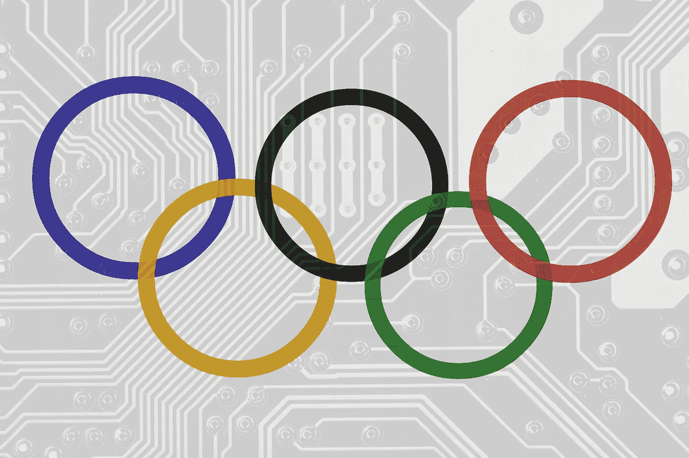
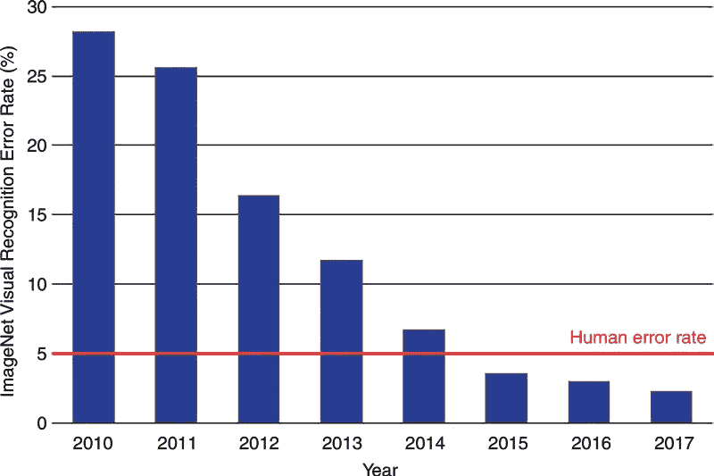
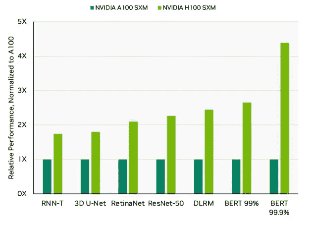
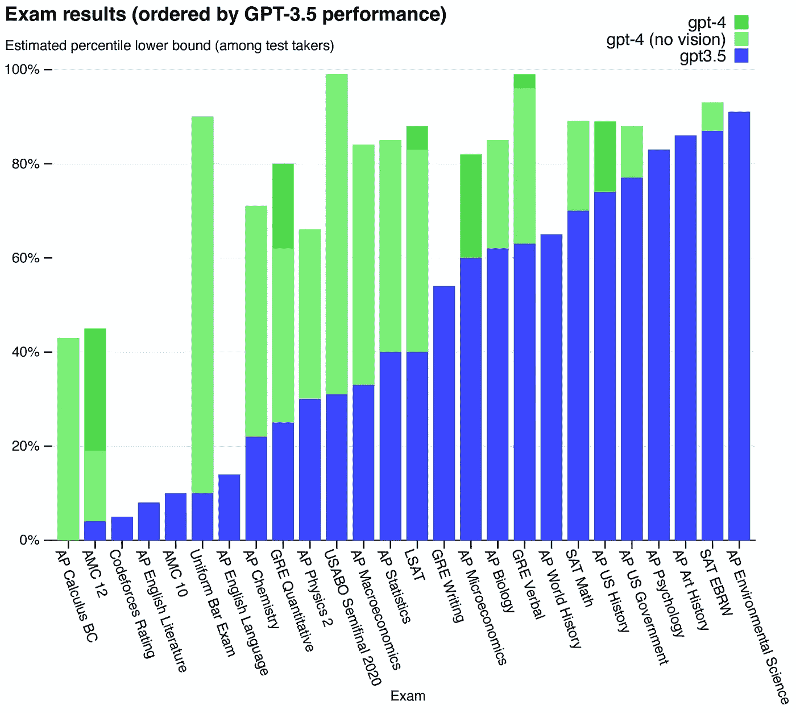

# 人工智能奥运会：机器学习系统的基准比赛

> 原文：[`towardsdatascience.com/the-olympics-of-ai-benchmarking-machine-learning-systems-c4b2051fbd2b?source=collection_archive---------2-----------------------#2023-09-22`](https://towardsdatascience.com/the-olympics-of-ai-benchmarking-machine-learning-systems-c4b2051fbd2b?source=collection_archive---------2-----------------------#2023-09-22)

## 基准如何催生突破？

 [马修·斯图尔特，博士](https://medium.com/@matthew_stewart?source=post_page-----c4b2051fbd2b--------------------------------)

·

[关注](https://medium.com/m/signin?actionUrl=https%3A%2F%2Fmedium.com%2F_%2Fsubscribe%2Fuser%2Fb89dbc0712c4&operation=register&redirect=https%3A%2F%2Ftowardsdatascience.com%2Fthe-olympics-of-ai-benchmarking-machine-learning-systems-c4b2051fbd2b&user=Matthew+Stewart%2C+PhD&userId=b89dbc0712c4&source=post_page-b89dbc0712c4----c4b2051fbd2b---------------------post_header-----------) 发表在 [走向数据科学](https://towardsdatascience.com/?source=post_page-----c4b2051fbd2b--------------------------------) ·13 分钟阅读·2023 年 9 月 22 日

--

> 你无法改善你不测量的东西。 — ***彼得·德鲁克***

奥运五环。图片由作者创建。

# 《四分钟英里：重新定义跑步的基准》

多年来，跑完一英里在四分钟内被认为不仅是一个艰巨的挑战，而且被许多人视为一个不可能的壮举。这是一个心理和身体的基准，许多人认为是无法达到的。医生和体育专家理论认为，人体不可能以如此快速的速度跑那么长时间。这种信念根深蒂固，甚至有些人认为尝试这样做可能是致命的。

[罗杰·班尼斯特爵士](https://en.wikipedia.org/wiki/Roger_Bannister)，一位英国中长跑运动员和医学生，持不同观点。他虽然认识到挑战，但认为障碍更多的是心理上的而非生理上的。班尼斯特采取了科学的方法进行训练，将一英里分成几个部分，并严格计时。他还采用了基于间歇训练的严格训练计划，并在尝试创纪录之前为自己设定了较小的基准。

1954 年 5 月 6 日，在英格兰牛津的一条跑道上，在朋友克里斯·布拉舍尔和克里斯·查塔维作为领跑者的帮助下，班尼斯特尝试突破四分钟障碍。他以 3 分钟 59.4 秒完成了一英里，打破了这一门槛，创造了历史。

罗杰·班尼斯特在比赛中奔跑。图片来源：[挪威百科全书](https://media.snl.no/media/234992/standard_compressed_NL-HaNA_2.24.01.09_0_902-9145-groot.jpg) (CC-BY 4.0)。

班尼斯特成就的后果是高度意外的。[贡德·海格](https://en.wikipedia.org/wiki/Gunder_H%C3%A4gg)的 1945 年纪录（4 分钟 1.4 秒）保持了近十年才被班尼斯特打破。然而，一旦四分钟英里基准被突破，其他人很快跟随其后。在班尼斯特跑步后的 46 天，[约翰·兰迪](https://en.wikipedia.org/wiki/John_Landy)完成了一英里，时间为 3 分钟 57.9 秒。在接下来的十年里，这一纪录又被打破了 5 次。目前的纪录由[希沙姆·埃尔·盖鲁吉](https://en.wikipedia.org/wiki/Hicham_El_Guerrouj)创造，时间为 3 分钟 43.1 秒。

1900 年至 2000 年期间的世界纪录英里时间。注意 1945 年到 1954 年之间的间隔，直到罗杰·班尼斯特打破四分钟英里基准——否则，下降趋势几乎是线性的。图由作者创建。

班尼斯特的成就展示了基准的力量，不仅作为性能的衡量标准，也作为变革的激励。一旦四分钟的“基准”被打破，它重新定义了运动员认为可能的极限。这个障碍既存在于思想中，也存在于跑道上。

四分钟英里体现了基准在各学科中的变革力量。基准为特定任务的性能改进提供了量化的方法，让我们可以与他人进行比较。这是奥运会等体育赛事的全部基础。然而，基准只有在参与的社区能够确定共同目标时才有用。

在机器学习和计算机科学领域，**基准测试是社区的奥林匹克**——一个宏大的竞技场，在这里，算法、系统和方法论竞争的不是奖牌，而是进步的自豪感和创新的动力。正如运动员为了奥林匹克金牌而训练多年、争取毫秒级的进步一样，开发者和研究人员优化他们的模型和系统，以提高性能，力求在既定基准测试中超越对手。

基准测试的艺术与科学在于建立那个*共同目标*。这不仅仅是设定一个任务，而是确保它能够捕捉到现实世界挑战的本质，推动可能性的边界，同时保持相关性和适用性。选择不当的基准测试可能会使研究人员走入歧途，优化的任务无法在现实世界应用中带来改进。一个设计良好的基准测试可以引导整个社区向突破性进展迈进，重新定义一个领域。

因此，虽然基准测试是用于比较和竞争的工具，其真正的价值在于它们能够团结一个共同愿景的社区。就像班尼斯特的跑步不仅打破了纪录，还重新定义了运动潜力一样，一个构思良好的基准测试可以提升整个学科，改变范式并引领创新新时代。

在这篇文章中，我们将探讨基准测试在推进计算机科学和机器学习中的关键作用，通过回顾其历史，讨论基准测试机器学习系统的最新趋势，了解它如何在硬件领域推动创新。

# 基准测试计算系统：SPEC

在 1980 年代，随着个人计算机革命的兴起，对标准化指标以比较不同计算机系统性能的需求日益增长：**一个** [**基准测试**](https://en.wikipedia.org/wiki/Benchmark_(computing))。在标准化基准测试出现之前，制造商通常会开发并使用他们自己定制的基准测试。这些基准测试往往突出了他们机器的优点，同时淡化了其缺点。显然，需要一个中立且被广泛接受的基准测试来进行比较。

为了解决这一挑战，[系统性能评估合作组织](https://www.spec.org/)（SPEC）应运而生。该组织的成员包括硬件供应商、研究人员以及其他致力于创建通用基准标准的利益相关者，主要用于对[中央处理单元](https://en.wikipedia.org/wiki/Central_processing_unit)（CPUs），也称为‘芯片’进行基准测试。

SPEC 的首个重大贡献是[SPEC89](https://www.spec.org/cpu89/)基准测试套件，它在行业标准 CPU 基准测试中开创了先河。SPEC 的基准测试聚焦于实际应用和计算任务，旨在提供对最终用户有意义的指标，而不是那些深奥或小众的测量。

然而，随着基准测试的发展，出现了一个有趣的现象：所谓的“**基准效应**”。随着 SPEC 基准测试成为测量 CPU 性能的黄金标准，CPU 设计师开始针对 SPEC 的基准测试优化他们的设计。实质上，由于行业已经将 SPEC 基准测试视为整体性能的衡量标准，制造商有强烈的动力确保他们的 CPU 在这些测试中表现出色——即使这可能意味着在非 SPEC 任务中牺牲性能。

这并非 SPEC 的初衷，导致了计算机科学社区内部的激烈辩论。这些基准测试是否真正代表了现实世界的性能？还是它们驱动了一种狭隘的视角，使得基准测试成为目的本身而不是实现目标的手段？

认识到这些挑战后，SPEC 多年来不断更新其基准测试，以保持领先并防止过度优化。他们的基准测试套件扩展到涵盖不同领域，从整数和浮点计算到更具体领域的任务，如图形、文件系统等。

SPEC 及其基准测试的故事强调了基准测试对整个行业方向的深远影响。这些基准测试不仅仅是衡量性能——**它们还影响了性能**。这证明了标准化的力量，但也提醒我们，当一个单一的指标成为优化的焦点时，可能会出现意想不到的后果。

今天，SPEC 基准测试以及其他基准测试继续在塑造计算机硬件行业和指导消费者及企业的购买决策中发挥至关重要的作用。

# 深度学习基准测试：ImageNet

在 2000 年代末，[计算机视觉](https://en.wikipedia.org/wiki/Computer_vision)，一个专注于使机器能够解读和基于视觉数据做出决策的 AI 子领域，正面临进展缓慢的问题。传统技术有所进展，但在许多任务上已经达到性能平台期。当时的方法严重依赖于手工制作的特征，要求专家精心设计和选择每个任务的特定特征。这是一个繁琐且有许多限制的过程。

随后发布了[ImageNet](https://en.wikipedia.org/wiki/ImageNet)，这是由[李飞飞博士](https://en.wikipedia.org/wiki/Fei-Fei_Li)及其团队发起的一个庞大的视觉数据库。ImageNet 提供了数百万张标记图像，涵盖了数千个类别。这个数据集的庞大规模前所未有，仅通过[Amazon Mechanical Turk](https://www.mturk.com/)等云端方法进行众包数据标记才得以实现。ImageNet 是最早的数据集基准之一——自发布以来，ImageNet 的[论文](https://proceedings.neurips.cc/paper_files/paper/2012/file/c399862d3b9d6b76c8436e924a68c45b-Paper.pdf)已被引用超过 50,000 次。

图像 Net 图像的视觉编译。图像来源：[Gluon](https://cv.gluon.ai/build/examples_datasets/imagenet.html)（CC-BY 4.0）。

但收集数据集只是开始。2010 年，[ImageNet 大规模视觉识别挑战](https://www.image-net.org/challenges/LSVRC/)（ILSVRC）启动。挑战的目标简单，但规模庞大：将图像自动分类到 1,000 个类别中的一个。这个基准挑战将提供计算机视觉进步的客观衡量，超越了以往的尝试。

初期几年在传统方法上取得了渐进式的改进。然而，2012 年的挑战带来了变革性的转变。由[亚历克斯·克里兹赫夫斯基](https://en.wikipedia.org/wiki/Alex_Krizhevsky)、[伊利亚·苏茨克弗](https://en.wikipedia.org/wiki/Ilya_Sutskever)和[杰弗里·辛顿](https://en.wikipedia.org/wiki/Geoffrey_Hinton)领导的多伦多大学团队推出了一种深度卷积神经网络（CNN），称为“[AlexNet](https://en.wikipedia.org/wiki/AlexNet)”。他们的模型实现了 15.3%的错误率，将前一年的错误率几乎削减了一半！

ImageNet 大规模视觉识别挑战的错误率。自 2012 年深度学习引入以来，准确率显著提高，并持续改善。人类的错误率约为 5%。图像来源：[2018 NIH/RSNA/ACR/The Academy Workshop](https://www.researchgate.net/publication/332452649_A_Roadmap_for_Foundational_Research_on_Artificial_Intelligence_in_Medical_Imaging_From_the_2018_NIHRSNAACRThe_Academy_Workshop)。此图像依据知识共享署名 4.0 国际许可协议（CC BY 4.0）进行复制。

什么使这一切成为可能？深度学习，特别是卷积神经网络（CNN），能够直接从原始像素中学习特征，省去了手动特征设计的需求。只要有足够的数据和计算能力，这些网络可以揭示出传统方法无法处理的复杂模式。

AlexNet 的成功是人工智能发展中的一个分水岭。2012 年后，深度学习方法主导了 ImageNet 挑战，驱动错误率不断降低。从基准测试中传达的明确信息是不容忽视的：深度学习，曾经是机器学习中的一个小众领域，现在正准备彻底改变计算机视觉。

而且它不仅仅是这样。ILSVRC 中的成功作为催化剂，将深度学习推到了计算机视觉以及从自然语言处理到游戏玩耍等众多 AI 领域的前沿。挑战突显了深度学习的潜力，吸引了研究人员、资金和关注。

通过设定一个明确且具有挑战性的基准，ImageNet 挑战在重新调整 AI 研究轨迹方面发挥了关键作用，促成了我们今天见证的深度学习驱动的 AI 复兴。

# 机器学习系统的基准测试：MLPerf

像 SPEC 和 ImageNet 这样的基准的变革性影响自然引发了一个问题：接下来是什么？随着深度学习模型变得越来越复杂，它们的计算需求也在增加。这将注意力转向了另一个关键组成部分——支撑这些模型的硬件。进入[MLPerf](https://www.nvidia.com/en-us/data-center/resources/mlperf-benchmarks/)。

MLPerf 作为一个涉及行业巨头和学术机构的合作努力出现，旨在创建一套标准的基准来测量机器学习硬件、软件和云平台的性能。正如名字所示，MLPerf 明确专注于机器学习，涵盖从图像分类到强化学习的广泛任务。目标明确——在一个“最佳性能”声明变得司空见惯但往往基于不一致标准或挑选指标的领域中提供清晰度。

MLPerf 的引入为科技行业提供了一个迫切需要的统一标准。对于学术界，它提供了明确的性能目标，促成了一个可以轻松测量和比较算法创新的环境。对于行业，尤其是硬件制造商，它既是挑战也是机会。新芯片不能再以模糊的机器学习性能声明推出——现在有了一个被普遍接受的基准，任何此类声明都将接受考验。

就像 SPEC 影响了 CPU 设计一样，MLPerf 开始塑造 AI 硬件的方向。公司们开始根据 MLPerf 基准优化他们的设计，这不仅仅关乎原始性能。基准测试还融入了效率指标，鼓励那些不仅提供速度而且具备能源效率的创新——在巨大的变换模型和环保意识的时代，这是一个迫切关注的问题。这些基准测试被像 Nvidia 和 AMD 这样的科技公司日常使用，以展示他们的新硬件。

Nvidia H100 在 MLPerf Inference v3.0 数据中心的标准化性能对比之前的 Nvidia A100 系统。如图所示，与前一代芯片相比，H100 在全尺寸大型语言模型 BERT 上的速度提高了 4 倍。图片来源：[MLCommons](https://mlcommons.org/en/inference-datacenter-30/)和[Nvidia Blogs](https://blogs.nvidia.com/blog/2023/04/05/inference-mlperf-ai/)。图片经 MLCommons 许可转载。

如今，有数十种类似 MLPerf 的基准测试，由[MLCommons](https://mlcommons.org/en/)管理，包括：

+   [**MLPerf Training**](https://mlcommons.org/en/training-normal-30/)**.** 用于在训练机器学习模型时评估系统性能（与研究人员相关）。

+   **MLPerf Inference.** 用于在执行机器学习模型推理时评估系统性能（与通过云托管模型的公司相关）。MLPerf Inference 有多个版本，关注[数据中心](https://mlcommons.org/en/inference-datacenter-31/)、[移动设备](https://mlcommons.org/en/inference-mobile-30/)、[边缘设备](https://mlcommons.org/en/inference-edge-31/)和[微型机器学习设备](https://mlcommons.org/en/inference-tiny-11/)。

+   [**MLPerf Training HPC**](https://mlcommons.org/en/training-hpc-20/)**.** 用于基准测试与高性能计算系统相关的工作负载。

+   [**MLPerf Storage**](https://mlcommons.org/en/storage-results-05/)**.** 用于基准测试与存储系统相关的工作负载。

但 MLPerf 并非没有批评者。正如任何获得显著关注的基准测试一样，存在对“过拟合”基准测试的担忧，即设计过度优化基准测试，可能以牺牲实际应用性为代价。此外，还面临着确保基准测试保持相关性的挑战，及时更新以反映机器学习领域的快速进展。

尽管如此，MLPerf 的故事，与其前辈一样，强调了一个基本真理：**基准测试催化进步**。它们不仅仅衡量最先进的技术；它们塑造它。通过设定明确而具有挑战性的目标，它们集中集体的精力，推动行业和研究社区开拓新领域。在一个人工智能不断重新定义可能性的世界里，拥有一个指引其复杂性的指南针不仅仅是可取的，而是必不可少的。

# 生成性 AI 的基准测试挑战

除了 AI 硬件，[大型语言模型](https://en.wikipedia.org/wiki/Large_language_model)，一种生成性 AI，是基准测试工作的关键重点。更普遍地称为[**基础模型**](https://en.wikipedia.org/wiki/Foundation_models)，这些比硬件或其他类型的机器学习模型更难以基准测试。

这是因为语言模型的成功不仅仅依赖于原始计算速度或在狭义任务中的准确性。相反，它取决于模型在各种提示和上下文中生成连贯、具有上下文相关性和信息性的回应的能力。此外，评估回应的“质量”本质上是主观的，并可能根据应用程序或评估者的偏见而有所不同。鉴于复杂性，像[GPT-3](https://en.wikipedia.org/wiki/GPT-3)或[BERT](https://en.wikipedia.org/wiki/BERT_(language_model))这样的语言模型的基准必须比传统基准更加多样和多方面。

最著名的语言模型基准之一是[通用语言理解评估（GLUE）](https://gluebenchmark.com/)，该基准于 2018 年开发。GLUE 不仅仅是一个单一任务；它是一个包含九种多样化语言任务的集合，从情感分析到文本蕴含。其目的是提供全面的评估，确保模型不仅仅在一个任务上表现出色，而是真正能够在各种挑战中理解语言。

GLUE 的影响立竿见影。首次出现了一个明确、一致的基准，用于评估语言模型。不久之后，科技巨头和学术界也纷纷参与，每个参与者争夺 GLUE 排行榜的首位。

当[GPT-2](https://en.wikipedia.org/wiki/GPT-2)首次在 GLUE 基准上进行评估时，它取得了当时令人惊叹的成绩，超过了许多模型。这不仅证明了 GPT-2 的强大能力，还强调了 GLUE 在提供明确测量标准方面的价值。能够声称“*在 GLUE 上达到最先进水平*”成为了社区中备受追捧的认可。

然而，GLUE 的成功是把双刃剑。到 2019 年底，许多模型开始在 GLUE 的排行榜上达到饱和，分数接近人类基线。这种饱和突出了基准测试的另一个关键方面：**基准需要随着领域的发展而进化**。为了解决这个问题，同一团队推出了[SuperGLUE](https://super.gluebenchmark.com/)，这是一个更为严格的基准，旨在进一步推动边界。

像[GLUE](https://gluebenchmark.com/)、[SuperGLUE](https://super.gluebenchmark.com/)和[SQuAD](https://rajpurkar.github.io/SQuAD-explorer/)这样的基准被用来评估模型在情感分析和问答等特定任务上的表现。但这些基准只是触及了基础模型旨在实现的目标的表面。除了任务特定的准确性，出现了其他维度来评估这些模型：

1.  **鲁棒性。** 模型如何处理边缘情况或对抗性输入？鲁棒性基准测试通过设计旨在困惑或误导模型的输入来挑战模型，评估它们对恶意行为者或意外情况的抵御能力。

1.  **泛化能力和迁移学习。** 基础模型应能在未被明确训练的任务上表现良好。评估模型的零样本或少样本学习能力，即在几乎没有先前示例的情况下完成任务，对于了解其灵活性和适应性至关重要。

1.  **交互性和连贯性。** 对于聊天机器人或虚拟助手等应用，模型在长时间互动中的一致性和连贯性至关重要。该领域的基准测试可能涉及长对话或在多个交流中保持上下文。

1.  **安全性和可控性。** 随着模型规模的增加，这些基准测试确保模型不会产生有害、不适当或无意义的输出是至关重要的。

1.  **可定制性。** 随着基础模型的广泛应用，对其进行特定领域或应用的定制需求日益增加。该领域的基准测试可能会评估模型在新数据集上的微调能力或适应特定行业术语和细微差别的效果。

一个有趣的发展是，随着语言模型的表现越来越接近人类表现，历史上用于评估人类表现的测试现在也被用作语言模型的基准测试。例如，GPT-4 在 SAT、LSAT 和医学考试等考试中进行了测试。在 SAT 中，它得分 1410，排名全国前 6%。GPT-4 甚至能够通过所有版本的医学考试，平均得分为 80.7%。然而，在 LSAT 中，它的得分较低，分别为 148 和 157，位于第 37 和第 70 百分位。

GPT 在学术和专业考试中的表现。图源自“[*GPT-4 技术报告*](https://arxiv.org/abs/2303.08774)” 。图像来源：[OpenAI](https://arxiv.org/abs/2303.08774) (CC-BY 4.0)。

观察基准测试方法如何继续发展以应对语言模型在许多领域逐渐与人类表现相媲美甚至超越人类，将会很有趣。

# 基准测试的未来

基准测试的未来正在快速发展，日益多样化，以应对新兴技术和应用的广泛范围。以下是一些正在实施基准测试的新兴领域示例：

+   [**RobotPerf**](https://accelerationrobotics.com/pdf/robotperf.pdf)：随着机器人技术在我们日常生活中越来越多地集成，像 RobotPerf 这样的基准测试正在被设计用来专门衡量和加速机器人应用，确保机器在效率和安全标准上达到要求。

+   [**NeuroBench**](https://arxiv.org/abs/2304.04640)：在脑启发计算领域，NeuroBench 在评估类脑系统方面开创了先河，提供了这些架构在多大程度上模拟神经过程的见解。

+   [**XRBench**](https://arxiv.org/abs/2211.08675)：虚拟现实和增强现实领域随着 Meta 和 Apple 进入这一领域并推出新硬件而复苏。为此，XRBench 被开发以专注于扩展现实（XR）应用，这对于提供沉浸式和无缝的用户体验至关重要。

+   [**MAVBench**](https://arxiv.org/abs/1905.06388)：随着无人机在多智能体系统和电池技术进步下变得越来越具有商业相关性，像 MAVBench 这样的基准测试将在优化这些系统的性能方面发挥重要作用。

计算机科学和机器学习社区对基准测试在推动领域进步中的重要性深有认识。现在，连 [NeurIPS](https://en.wikipedia.org/wiki/Conference_on_Neural_Information_Processing_Systems)，作为旗舰 AI 会议之一，也专门设置了一个 [track](https://nips.cc/Conferences/2023/CallForDatasetsBenchmarks)，专注于数据集和基准测试。现在已进入第三年，这个 track 正在获得巨大的动力，今年单是提交的数量就接近 1,000 个。这一趋势突显出，随着技术不断前进，基准测试将继续在实时中指导和塑造其轨迹，正如过去所做的那样。

# 结语

基准测试在塑造进步方面的作用，无论是在体育还是人工智能领域，都不可低估。它们既是镜子，反映当前的状况，也是窗口，提供未来潜力的瞥见。随着人工智能继续影响从医疗保健到金融等各种应用和行业，拥有强大的基准测试变得至关重要。它们确保进展不仅迅速而且有意义，将努力引向真正重要的挑战。正如 Sir Roger Bannister 通过他的四分钟一英里向我们展示的那样，有时最令人畏惧的基准，一旦被征服，能够在未来几年释放出创新和灵感的波澜。在机器学习和计算的世界里，这场竞赛远未结束。
