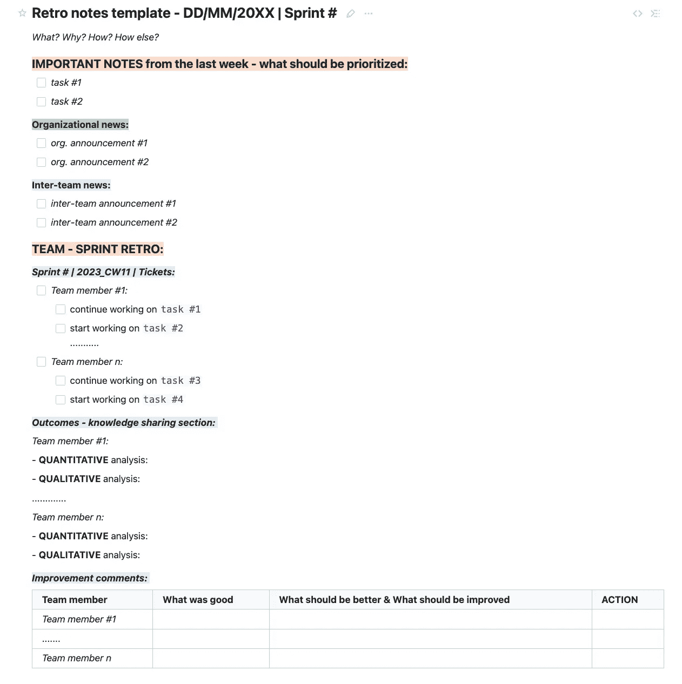
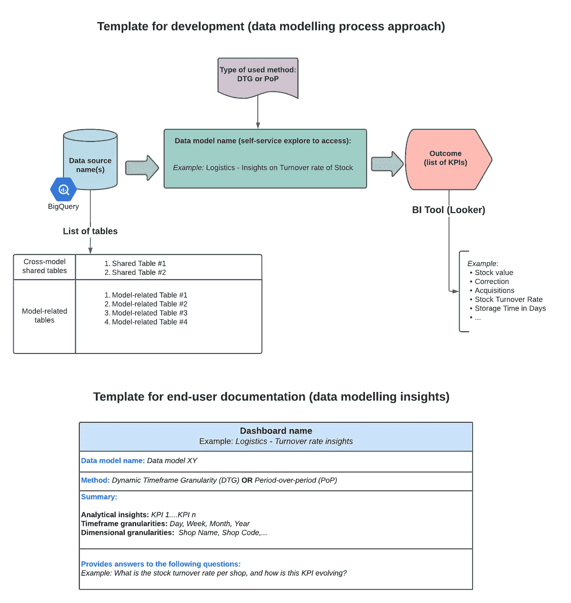
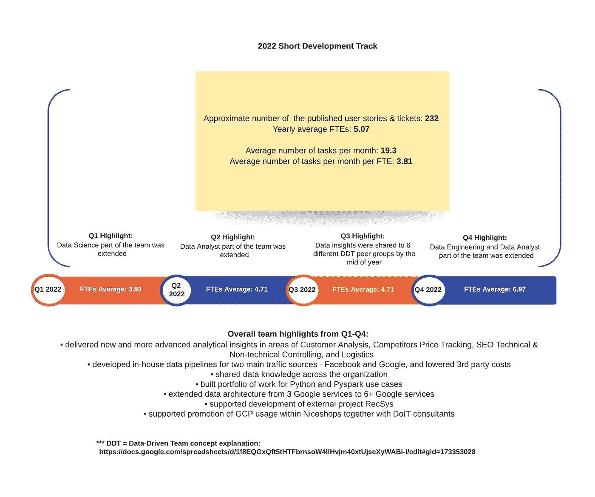

# 一页数据和分析模板

> 原文：[`towardsdatascience.com/the-one-page-data-and-analytics-templates-f53b949be84`](https://towardsdatascience.com/the-one-page-data-and-analytics-templates-f53b949be84)

## 使用五个模板掌握数据和分析报告及流程

 [Marina Tosic](https://medium.com/@martosi?source=post_page-----f53b949be84--------------------------------)

·发表于 [Towards Data Science](https://towardsdatascience.com/?source=post_page-----f53b949be84--------------------------------) ·阅读时间 6 分钟·2023 年 3 月 2 日

--

图片由 [micheile dot com](https://unsplash.com/@micheile?utm_source=medium&utm_medium=referral) 提供，来源于 [Unsplash](https://unsplash.com/?utm_source=medium&utm_medium=referral)

# 介绍

在我职业生涯早期得到的最佳建议是为任何报告和开发流程创建模板。

尽管最初我发现创建模板耗时，但这一步骤在开发和规划前阶段为后续工作节省了大量时间。

这是我现在努力传授给所有同事和团队成员的知识。

我对模板化数据和分析报告及流程的原因主要有三个：

#1: ***可重用性 —*** *模板可以被重用并适应各种数据项目和流程。*

+   *作为数据负责人，您可以通过创建用于重复报告和可扩展流程的模板来节省时间。这可以包括各种模板——从利益相关者关于团队开发进展的报告到内部团队的会议记录和开发/测试流程。*

+   *作为数据专业人员，一旦您已经有了用于总结开发方法和分析见解的预定义模板，您在创建开发者/终端用户文档时可以变得更加高效。*

#2: ***准确性*** — *模板可以确保数据报告和流程包含组织和数据团队所需的所有相关信息。*

+   *通过对团队开发更新进行模板化，您可以减少报告错误，并确保跨组织和团队间对所有必要信息的轻松跟踪。*

#3: ***一致性 —*** *模板可以确保数据流程和见解的一致性和清晰度。*

+   *通过预定义的数据模板，您的利益相关者将习惯现有的文档结构，并能快速找到所需的信息，即使是在新记录的流程和见解中。*

基于这三个关键点，说明为什么需要模板化数据和分析流程及报告，我整理了一套可供你在数据团队和组织中使用的模板。

# 模板

以下列出的数据和分析模板用于团队组织和分享开发更新。对于每个模板，我将列出背景故事（开发原因）和使用范围。

## **#1: 数据和** 分析 **路线图模板：努力-价值矩阵**

数据和分析路线图模板 [作者图片]

***背景故事：***

该模板在数据和分析团队刚刚[成立](https://medium.com/towards-data-science/3-animated-movie-quotes-to-follow-when-establishing-a-data-analytics-team-e7fd84357d84)时创建。其目的是分享和维护清晰的数据和分析愿景，与组织成为数据驱动型公司的愿景保持一致。

因此，创建了数据和分析路线图，将不同领域（数据工程、数据分析和数据科学）的计划用例映射到努力-价值矩阵中（[艾森豪威尔矩阵](https://thedecisionlab.com/reference-guide/management/the-eisenhower-matrix)）。

提供的模板有开发版本，即随着数据用例优先级的变化，模板也随之演变。

***使用范围：***

为数据和分析路线图开发的模板作为数据和分析团队的开发优先级或“快速胜利”的指引。

该模板还用于数据和分析团队的结构化和计划性增长，因为我们知道下一阶段的路线图交付需要多少人力资源。

此外，该模板帮助业务负责人轻松跟踪基于优先业务用例的分析开发阶段。

## **#2: 数据和** 分析 **复盘会议模板：每周跨团队报告**

数据和分析复盘会议记录模板 [作者图片]

***背景故事：***

数据和分析每周复盘团队会议模板的创建旨在标准化跨组织和团队的公告及报告，涉及团队的[Sprint](https://www.scrum.org/resources/what-is-a-sprint-in-scrum)任务。

除了改善团队间的沟通外，该模板旨在确保特定数据领域的信息和工作透明。

***使用范围：***

除了简化沟通外，该模板用于数据负责人跟踪团队进度并识别需要改进的领域。通过结构化的报告方式，可以轻松比较不同周的记录，并识别出随时间变化的趋势。

对于团队成员，该模板鼓励对自己的工作进行反思。此外，它提供了必要的信息和知识交流，关于同事们完成的工作（任务的定量和定性描述）。

## **#3: 数据和** 分析 **开发文档模板：用于解释开发和最终用户见解的文档模板**

数据和分析开发及最终用户文档模板 [作者提供的图像]

***背景故事：***

创建开发和最终用户文档模板的目标是提高团队的效率（减少文档结构设计的时间），并通过以结构化的方式解释数据见解来为最终用户提供更多背景信息。

***使用范围：***

数据分析师/科学家使用开发文档模板以结构化的方式解释数据建模过程，即*输入* → *输出* 流程。

最终用户文档模板供利益相关者快速查找新创建的数据见解（仪表板和报告）的解释。因此，最终用户文档被结构化为详细说明主要仪表板元素：基础数据模型、时间范围方法、分析总结，以及仪表板回答的业务问题。

## **#4: 数据和** 分析 **状态更新模板：每月利益相关者报告**

数据和分析月度状态更新模板 [作者提供的图像]

***背景故事：***

数据和分析月度状态更新模板的创建旨在向公司所有利益相关者总结不同业务领域（业务控制、物流、绩效营销）的开发更新。

***使用范围：***

数据负责人使用该模板以简单而结构化的方式向首席执行官和组织领导汇报数据和分析团队的成就。

此外，利益相关者使用该模板来规划新数据开发的业务行动。

## **#5: 数据和** 分析 **年终报告模板：开发亮点**

数据和分析年终报告模板 [作者提供的图像]

***背景故事：***

年终数据和分析报告模板的创建旨在突出年度团队的成长和发展。

***使用范围：***

数据负责人使用该模板以简单而结构化的方式向首席执行官和组织领导汇报数据和分析团队的成就。

此外，这一页的报告模板可以用于制定来年的开发计划并展示未来的数据项目。

# 结论

本博客文章旨在展示五个一页式的数据和分析模板，这些模板可以被任何组织中的数据团队/数据负责人或数据利益相关者使用，以提高报告质量、信息共享和团队效率。

作为数据负责人，我发现一页式模板在我需要进行工作质量检查、提高团队协作以及使利益相关者更容易阅读报告并节省寻找所需信息的时间时，具有很大好处。

因此，我想与你分享这些模板。

我希望你觉得它们易于使用，并且能够帮助你按计划进行报告和团队管理。

如果你想了解如何组织和模板化你的完整知识库，请查看这里的帖子：

 ## 数据和分析团队的 3 个知识库模板集

### 以系统化的方式创建外部、共享和内部文档

towardsdatascience.com
