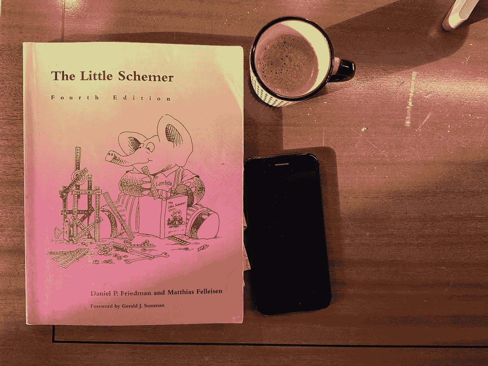
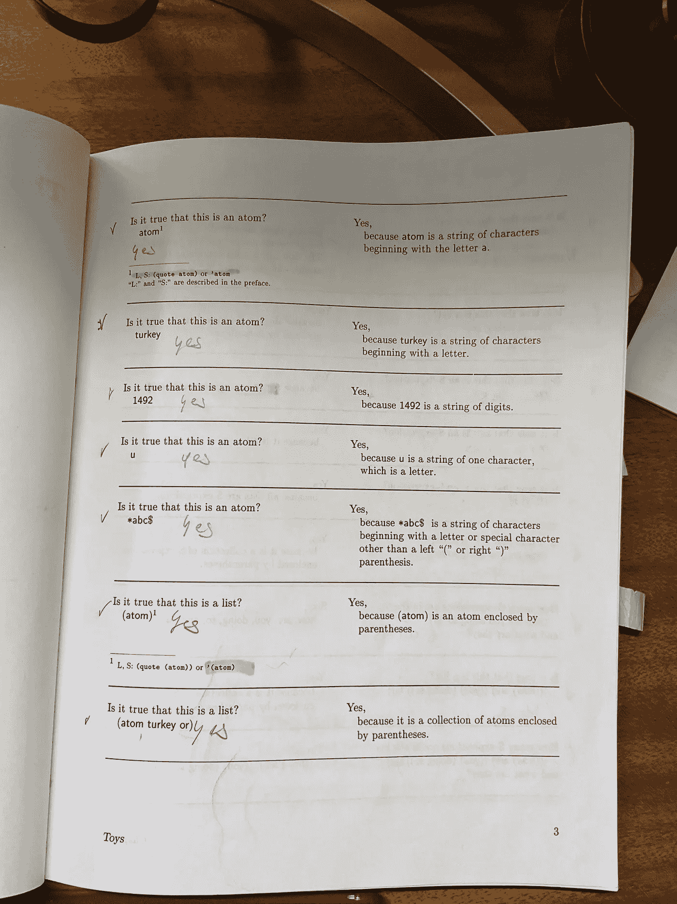

# 学习递归所需了解的唯一一件事

> 原文：[`towardsdatascience.com/the-one-thing-you-need-to-learn-lecursion-55c03637b5e1?source=collection_archive---------18-----------------------#2023-04-14`](https://towardsdatascience.com/the-one-thing-you-need-to-learn-lecursion-55c03637b5e1?source=collection_archive---------18-----------------------#2023-04-14)

## （以及 *更多* ）

[](https://sassoli.medium.com/?source=post_page-----55c03637b5e1--------------------------------)[](https://towardsdatascience.com/?source=post_page-----55c03637b5e1--------------------------------) [Bernardino Sassoli](https://sassoli.medium.com/?source=post_page-----55c03637b5e1--------------------------------)

·

[关注](https://medium.com/m/signin?actionUrl=https%3A%2F%2Fmedium.com%2F_%2Fsubscribe%2Fuser%2F64ab339d120f&operation=register&redirect=https%3A%2F%2Ftowardsdatascience.com%2Fthe-one-thing-you-need-to-learn-lecursion-55c03637b5e1&user=Bernardino+Sassoli&userId=64ab339d120f&source=post_page-64ab339d120f----55c03637b5e1---------------------post_header-----------) 发布在 [Towards Data Science](https://towardsdatascience.com/?source=post_page-----55c03637b5e1--------------------------------) ·9 分钟阅读·2023 年 4 月 14 日

--

[](https://medium.com/m/signin?actionUrl=https%3A%2F%2Fmedium.com%2F_%2Fbookmark%2Fp%2F55c03637b5e1&operation=register&redirect=https%3A%2F%2Ftowardsdatascience.com%2Fthe-one-thing-you-need-to-learn-lecursion-55c03637b5e1&source=-----55c03637b5e1---------------------bookmark_footer-----------)

照片由 [Szabo Viktor](https://unsplash.com/@vmxhu?utm_source=medium&utm_medium=referral) 提供，发布在 [Unsplash](https://unsplash.com/?utm_source=medium&utm_medium=referral) 上

有一句老生常谈的笑话：

> *要理解递归，你需要理解递归。*

这是一个只有程序员、数学家或逻辑学家会觉得有趣的笑话。它也不是真的。

像许多其他事物一样，理解递归的唯一方法是*练习*。编写大量简单的递归函数。然后再写更多。再接着写一些更复杂的递归函数。依此类推。但你怎么做呢？我有一个小窍门。这是一本书。它很短（不到 200 页），引人入胜，并且会教会你比写递归更多的东西。它还会向你介绍计算机科学中一些最基础的概念，例如 Y 组合子、解释器、组合子和停机问题。

这本奇妙的小书叫做*《小程序员》*。¹ 在“前言”中，几乎在一开始，作者明确指出：

> 这本书的目标是教会读者*递归思维*。

如果你阅读了*《小程序员》*，递归将成为你思考问题的一种熟悉方式。但是，在此过程中，你会学到大量的基本理念。此外，这本书采用了非常独特的风格，迫使你解决其中的问题并吸收其概念。

接下来，我将简要概述什么是递归以及为什么你应该学习它。然后我将介绍这本书，并解释为什么它是一种出色的工具，可以让你成为更好的程序员。

**注意**：如果你是完全的初学者，并且对更抽象的主题不感兴趣，这本书可能不适合你。如果你处于想要学习编程并且希望有所展示的阶段，我的建议是等到你对某一种编程语言感到舒适时再回过头来看这本书。再者，如果你对编程的兴趣更偏向于哲学或理论，那么这可能是一个很好的起点。

# 递归：它为何重要

递归是令人畏惧的；“魔法”这个词经常被提及。对于初学者的建议很多。我曾读到有人建议初学者“相信魔法”——或者类似的说法。你可能会被告知学习调用栈的工作原理。当然，这很有用，甚至是基础的：但不是成为熟练甚至舒适使用递归的最佳方式。我知道这些建议对我没有真正奏效。真正奏效的是，你猜对了，练习。我可能不是递归的高手。但确实，现在我对使用递归更加游刃有余。事实上，我有时现在甚至会挣扎于*不*编写递归函数，即使我可以使用更简单、更高效的解决方案。

我怀疑人们在递归上遇到困难，是因为它某种程度上（错误地）暗示在幕后发生了*无限回归*。它*似乎*像是当两面镜子相对放置时发生的现象：第一面镜子反射第二面镜子的反射，第二面镜子反射第一面镜子的反射，依此类推……这是一种效果——顺便提一下——被许多艺术家和设计师[巧妙地运用](https://en.wikipedia.org/wiki/Droste_effect)了。但这根本不是实际发生的情况。

递归的*函数*是一个调用自身的函数。例如，这里有两个（略有不同）函数，它们接受一个整数数组或列表并返回其和，分别用 Javascript 和 Python 编写：

```py
function sumAllNums(listNums) {
if (listNums.length === 0) return 0;
return listNums.shift() + sumAllNums(listNums);
}
​
console.log(sumAllNums([1, 2, 3, 4]));
// 10
```

```py
def sum_all_nums(lst):
if len(lst) == 0:
return 0
return lst[0] + sum_all_nums(lst[1:])
​
print(sum_all_nums([1, 2, 3, 4]))
# 10
```

两个函数都将：

+   检查输入是否为空，如果为空则返回 0（*基本情况*）

+   否则，它们将把输入的第一个项目添加到调用该函数时剩余输入的结果中（除了第一个项目之外的所有项目）（即*递归调用*）。

递归函数*会*无限调用自身，*除非*它达到了基本情况。当发生这种情况时，递归调用停止 — 这就是我们避免无限循环的原因。

这可能都很好，但我为什么要熟练掌握编写递归函数呢？毕竟，你可以用 while 循环中的迭代来完成任何可以递归编写的东西。为什么要为这个看似神奇的工具而挣扎？这是一个合理的问题。脱口而出，我能想到至少以下三个理由：

+   **算法和数据结构**：许多基础算法本质上是递归的（想想“分治”）。一些数据结构以递归方式表示最佳（想想图或树）

+   即使在**机器学习**领域，递归结构和算法也比人们想象的要常见**（**更不用说**人工智能**，它们无处不在）。例如，[决策树](https://en.wikipedia.org/wiki/Decision_tree)的实现是[本质上递归的](https://machinelearningmastery.com/implement-decision-tree-algorithm-scratch-python/)。

+   **函数式编程**：有人说函数式*语言*的受欢迎程度正在慢慢增长。这可能是真的，也可能不是。确实，越来越多的“主流”语言如 Python 或 Javascript 现在支持函数式编程。此外，一些广泛使用的库和框架（如 React）在很大程度上基于函数式实践。鉴于函数式范式没有*赋值*的概念（稍后会详细介绍），递归对它至关重要。

+   **理解**：递归迫使你将问题简化为其他更小的问题。这是你作为程序员可能发展出的最有价值的技能之一。

不幸的是，我想不到一个专门用于练习递归的全面资源。这就是*The Little Schemer*的作用所在。

# 学习递归的最佳书籍



我的 TLS 版本 — 还有一杯浓缩咖啡（我来自意大利！）[作者提供的图片]

根据标题，《*The Little Schemer*》（以下简称 *TLS*）应该是一本关于编程语言 [Scheme](https://en.wikipedia.org/wiki/Scheme_(programming_language)) 的书，它是组成 LISPs 家族的众多语言之一。那么为什么有人会特别想学习 LISP 或 Scheme 呢？问题是，标题并不准确。Scheme 是一种非常适合教授计算机科学某些基础知识的语言²——对于 *TLS* 来说，你需要的语法是如此稀疏，你可以在几分钟内迅速掌握。你可以更安全地将其视为一种教学工具，而不是一门成熟的语言³。

说到教学法：这本书采用了奇特的风格。它以两列的形式书写，类似于学生和老师之间的苏格拉底式对话。它是这样开始的：

> *这是否是一个原子？* 原子

它不给你定义——它向读者提出问题（通常以练习的形式），然后提供答案（或解决方案）。这需要一些适应，但非常有效。



TLS 的奇特风格 [作者提供的图片]

递归与这一切有什么关系？好吧，在 *TLS* 中，作者使用 Scheme 的方式不支持变量赋值或迭代。没有 `while` 或 `for` 循环。这意味着，如果你必须编写一个函数，例如检查某个数字是否包含在列表或数组中，你不能像在 Python 中那样做：

```py
def is_contained(num, list_nums):
 for ix in range(len(list_nums)):
   if list_nums[ix] == num:
     return True
 return False
​
print(is_contained(1, [2, 3, 4, 1]))
# True
```

相反，你*必须*以递归的方式思考：

+   有一个基本情况，即列表将是*空的*，函数应该返回 False

+   否则，你*选择第一个*列表项并*检查它是否等于*给定的数字；如果匹配，函数返回 True。如果不匹配，（递归地）调用函数处理列表的*其余部分*。

这就是你在 TLS 中编写*所有内容*的方式。Scheme 仅在两个基本的语法元素上操作：

1.  *原子*：一个或多个字母数字字符

1.  *列表*：零个或多个被括号包围的原子或列表。

要编写如上所述的函数，你只需要：

+   一个编程构造来*测试*两个表达式是否相同

+   另一个*测试*，用于检查列表是否*空*

+   *选择器* 用于列表的第一个元素和列表的其余部分

+   表达条件（例如 `if`）的一种方式

对于更复杂的函数，你还需要一个*构造器*来构建列表。加上一些*定义*函数的方法，仅此而已。这就是为什么几乎所有的语法都在第一章中介绍，在不到 10 页的简洁内容中（唯一的例外是列表构建构造器 cons，它在第三章中介绍）。前三章带你了解许多更简单的递归函数。

当你到达第四章时，你应该已经对编写操作列表的递归函数的基本设计模式有所了解：例如上面提到的函数，它们检查特定项是否是列表的成员。或者，替换列表中给定项的第一个（或所有）出现的函数。

随后，这些知识应用于从基本原理构建基本的*算术操作*。同样，这通过对数字进行递归以及使用提供的原语（这些原语将数字递增和递减 1）来实现。例如，两个数字*n*和*m*的加法定义为：

+   基本情况：如果*m*为零，返回*n*

+   否则，递归返回将加法函数应用于递增的*n*和递减的*m*的结果。

第五章和第六章介绍了对任意深度嵌套列表的递归函数：这些列表可能包含列表，而这些列表又可能包含列表，依此类推。基本上，你需要重写前几章中的所有函数，以便它们在“更深”的情况下也能工作。

这些知识在第六章中得到了具体应用，你将在其中编写一个用于算术表达式的解释器。让我强调：我们已经阅读了 100 页的内容。我们从没有 Scheme 知识和最简语法开始——而现在我们正在构建一个评估我们*定义*的操作的解释器。如果你对编程的更理论方面感兴趣，你可能会发现这非常有价值和激动人心。

第七章专注于集合论构造、关系和函数，这些内容同样留给读者在阅读师生对话的过程中发现。

第八章可能是本书中最令人不满意的章节：它相当陡峭，而且很难看出这里引入的一些构造的意义。其关键似乎是引入了[延续](https://en.wikipedia.org/wiki/Continuation-passing_style)，但我必须承认我在这一章中感到困难（显然，许多人也有同样的感受）。

与前一章类似，第九章是*具有挑战性的*：在几页中介绍了许多基础概念，这些概念引出了对*应用顺序 Y 组合子*的讨论。我非常喜欢这一章，但我花了很多次尝试和一些在线资源的帮助（见下文）才理解它。顺便说一下，如果你曾经想知道 Y 组合子到底是什么（既然我们讨论递归的话题）：它是（非常粗略地说）在没有函数命名方式的语言中如何*定义*递归（因此，这种语言中的所有函数都是匿名的——例如 Python 中的*lambda*函数）。能够理解 Y 组合子是一次丰富的经历，对我来说，它是本书的亮点之一。

最后一章将所有内容整合在一起，你最终会用 Scheme 编写一个 Scheme 解释器 *在 Scheme 中*。让它沉淀下来：只用几个原语，*仅用递归*，你正在通过引导语言本身来编写一个语言的解释器。

我希望我能够传达我在阅读 *TLS* 时的兴奋感。也希望你能与我分享你的经历。

# 额外资源

+   我有一个 GitHub 仓库（正在进行中！），在这里我发布了笔记、解决方案和一个相当全面的 Racket 测试套件，[链接在此](https://github.com/bsassoli/The-Little-Schemer)

+   另一个我喜欢的 GitHub 仓库（同样是 Racket）：[`github.com/bmitc/the-little-scheme`](https://github.com/bmitc/the-little-schemer)

+   还有另一个：[`github.com/willprice/little-schemer`](https://github.com/willprice/little-schemer)

+   对这本书的一个负面（但不完全不相关）评论：[`inventwithpython.com/blog/2018/12/09/book-review-the-little-schemer/`](https://inventwithpython.com/blog/2018/12/09/book-review-the-little-schemer/)）以平衡我的热情

+   如果你遇到困难，关于 Y 组合子的一个[优秀博客文章](https://mvanier.livejournal.com/2897.html)

[**1**] Friedman, Daniel, P, Felleisen, Matthias [《小 Scheme》], 麻省理工学院出版社，剑桥，MA，1986 年，1996 年第四版 ([`mitpress.mit.edu/9780262560993/the-little-schemer/`](https://mitpress.mit.edu/9780262560993/the-little-schemer/))。最初出版为 *《小 LISPer》*。

[**2**] 事实上，《*计算机程序的结构与解释*》是有史以来最受推崇的计算机科学书籍之一，[*结构与解释计算机程序*](https://web.mit.edu/6.001/6.037/sicp.pdf) 使用了 Scheme。

[**3**] 这并不重要，但我应该提到我在 TLS 中的练习实现不是用 Scheme，而是用 [Racket](https://racket-lang.org/)，它基本上是 Scheme 的继任者。
