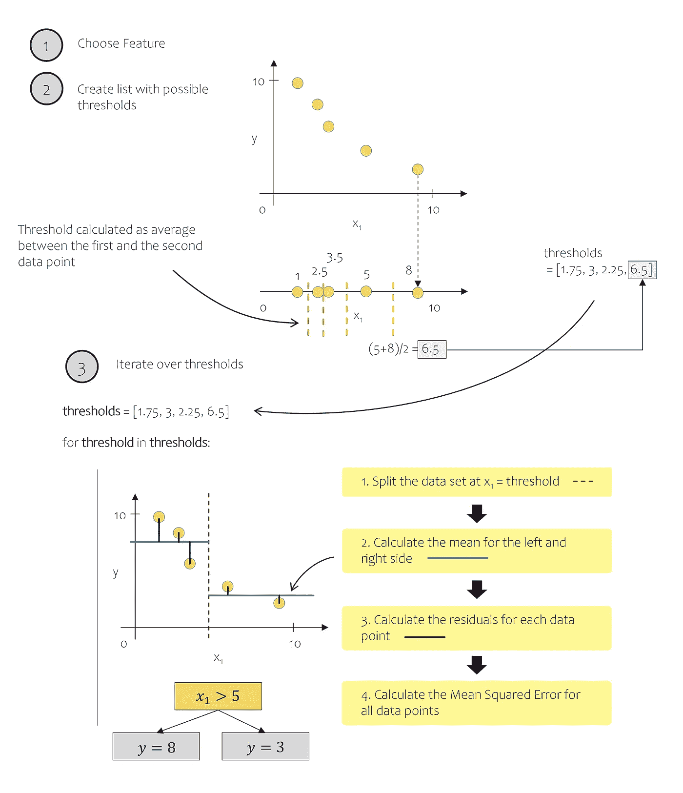

# 理解回归树的唯一指南

> 原文：[`towardsdatascience.com/the-only-guide-you-need-to-understand-regression-trees-4964992a07a8?source=collection_archive---------3-----------------------#2023-04-04`](https://towardsdatascience.com/the-only-guide-you-need-to-understand-regression-trees-4964992a07a8?source=collection_archive---------3-----------------------#2023-04-04)

## 从头到尾的决策树完整指南，包括逐步实现和使用 Scikit-Learn 的动手示例

 [Dominik Polzer](https://dmnkplzr.medium.com/?source=post_page-----4964992a07a8--------------------------------)

·

[关注](https://medium.com/m/signin?actionUrl=https%3A%2F%2Fmedium.com%2F_%2Fsubscribe%2Fuser%2F3ab8d3143e32&operation=register&redirect=https%3A%2F%2Ftowardsdatascience.com%2Fthe-only-guide-you-need-to-understand-regression-trees-4964992a07a8&user=Dominik+Polzer&userId=3ab8d3143e32&source=post_page-3ab8d3143e32----4964992a07a8---------------------post_header-----------) 发表在 [Towards Data Science](https://towardsdatascience.com/?source=post_page-----4964992a07a8--------------------------------) · 25 分钟阅读 · 2023 年 4 月 4 日

--

构建一棵树 - 作者提供的图像

# 目录

1.  简介

1.  回归的决策树：背后的理论

1.  从理论到实践 — 从头实现决策树

1.  动手示例 — 从头实现 vs. Scikit-learn DecisionTree

1.  总结

1.  参考文献

1.  附录 / 代码

# 1\. 引言

决策树自 1960 年代就已经存在。尽管它们是最简单的机器学习算法之一，但在解决问题方面证明了其高效性。它们最大的优点之一是易于解释，使得没有技术背景的人也能轻松理解。在许多行业中，数据科学家仍需为机器学习的应用建立信任。像决策树这样的可解释基线模型可以在一定程度上减少怀疑。如果有人愿意付出努力，他们甚至可以追踪学习到的树的分支，并尝试找到他们已经知道的关于问题的模式。
