# 理解回归树所需的唯一指南

> 原文：[`towardsdatascience.com/the-only-guide-you-need-to-understand-regression-trees-4964992a07a8`](https://towardsdatascience.com/the-only-guide-you-need-to-understand-regression-trees-4964992a07a8)

## 关于决策树的完整指南，包括从零开始的逐步实现和使用 Scikit-Learn 的动手示例

[](https://dmnkplzr.medium.com/?source=post_page-----4964992a07a8--------------------------------)[](https://towardsdatascience.com/?source=post_page-----4964992a07a8--------------------------------) [多米尼克·波尔策](https://dmnkplzr.medium.com/?source=post_page-----4964992a07a8--------------------------------)

·发表于 [Towards Data Science](https://towardsdatascience.com/?source=post_page-----4964992a07a8--------------------------------) ·阅读时长 25 分钟·2023 年 4 月 4 日

--


构建一棵树 - 作者提供的图像

# 目录

1.  简介

1.  回归决策树：背后的理论

1.  从理论到实践——从零开始的决策树

1.  动手示例——从零开始实现与 Scikit-learn 决策树对比

1.  总结

1.  参考文献

1.  附录 / 代码

# 1. 简介

决策树自 1960 年代以来一直存在。尽管它们是最简单的机器学习算法之一，但在解决问题时被证明非常有效。它们最大的优势之一是易于解释，使得那些没有技术背景的人也能轻松理解。在许多行业中，数据科学家仍需建立对机器学习用例的信任。像决策树这样的可解释基准模型可以帮助减少一些怀疑。如果有人愿意付出努力，他们甚至可以追踪学到的树的分支，并尝试找到他们已经知道的关于问题的模式。

另一方面，我们很快就会遇到简单决策树在复杂问题上的极限。从理论上讲，我们可以用适当大小的树来建模任何（复杂的）数据分布，但这些模型在应用于新数据时往往无法很好地泛化——它们对训练数据集过拟合。然而，决策树在机器学习中始终发挥着重要作用。

决策树的一些弱点已经随着树集成技术的进步逐渐得到解决或至少得到缓解。在树集成中，我们不是学习一棵决策树，而是学习一系列树，并最终将它们组合成一个集成。如今我们区分了包装（bagging）和提升（boosting）算法。

+   在袋装中，多个决策树在不同的自助样本（随机选择的带有替代的子集）上进行训练。每棵决策树是独立训练的，最终的预测是通过平均所有个体树的预测来得出的。**袋装**方法，特别是**随机森林**算法是由 Leo Breiman 开发的。

+   在提升中，决策树是按顺序训练的，每棵树都被训练以纠正前一棵树所犯的错误。训练数据被加权，对前一棵树错误分类的样本给予更高的权重。

尽管随机森林仍然发挥着重要作用，但今天主要是**提升**算法在数据科学竞赛中表现最佳，且常常优于袋装方法。最知名的提升算法包括**AdaBoost、XGBoost、LightGBM 和 CatBoost**。自 2016 年以来，它们的受欢迎程度持续增长。

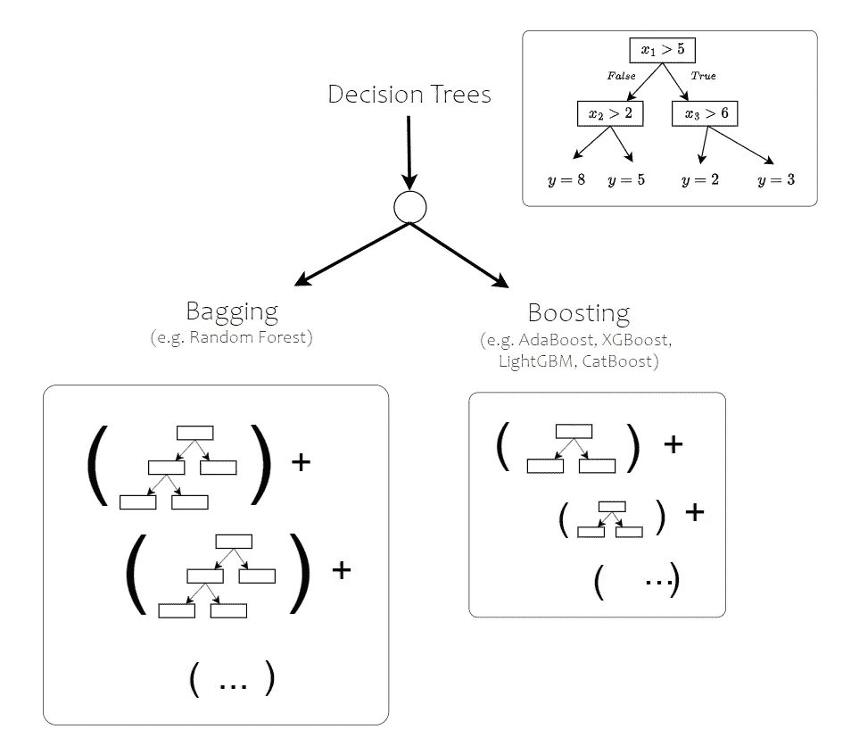

基于树的算法类型 — 图片由作者提供

虽然决策树的概念已经被认识并积极应用了几十年，但提升方法相对“新颖”，只有在 2014 年 XGBoost 发布后才逐渐获得重要性。

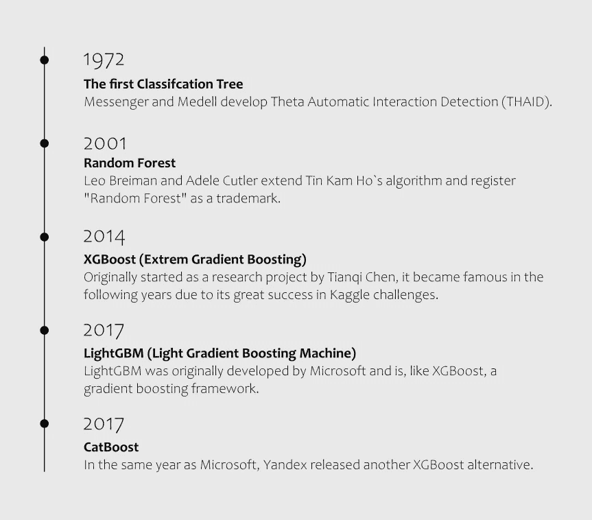

基于树的算法的演变 — 图片由作者提供（灵感来源于（Chow, 2021; Swalin, 2019））

在 XGBoost 概念首次发布后的几个月，Higgs Boson Challenge 在 Kaggle 上用它赢得了比赛。XGBoost 基于许多概念，这些概念汇聚成一个极其有效的算法。XGBoost 的核心当然是梯度提升原理，但 XGBoost 远不止于此。XGBoost 包括各种优化技术，使得 XGBoost 在训练过程中极其高效和快速。特别是对于小到中等规模的结构化数据集，像 XGBoost、LightGBM 和 CatBoost 这样的梯度提升框架继续发挥重要作用。

这不仅仅是我的观点。一个好的指标是 Kaggle 竞赛及其获胜解决方案。

在文章《竞争性机器学习的现状》中， [](https://www.google.com/url?q=http%3A%2F%2Fmlcontests.com%2F&sa=D&ust=1680021204969306&usg=AOvVaw2gAknvaBr5xG8QHfDVyQIM) [mlcontests.com](https://mlcontests.com/) 评估了 2022 年在 Kaggle 和其他竞赛平台上的 200 多个数据竞赛。根据报告，梯度提升决策树（GBDT）仍然是 2022 年表格数据用例的首选方法，并且能够赢得大多数此类领域的竞赛。（Carlens, n.d.）

除了梯度提升算法一再展示出的良好性能外，决策树或树集成的最大优势是速度。一般而言，梯度提升框架在训练速度上比神经网络更快，这在许多现实世界的问题中可能是一个重要因素。

通常在机器学习项目开始时数据集并不明确。工作的重要部分是数据集的汇编和相关特征的提取。如果我们更改数据集、添加新列或仅稍微更改将分类值转换为数值的方式，我们需要衡量这样做是否改善了整体过程。在这个过程中，我们可能会训练几百次模型。因此，更快的训练时间可以决定性地影响整个机器学习用例的开发过程时间。

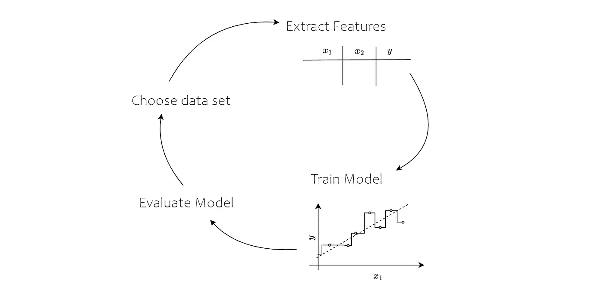

机器学习项目是迭代的，而不是线性的 — 图片来源：作者

下图显示了机器学习管道中的各个步骤。如果我们在训练模型之前对过程中的某个小细节进行更改，我们必须重新评估整个过程和结果模型。

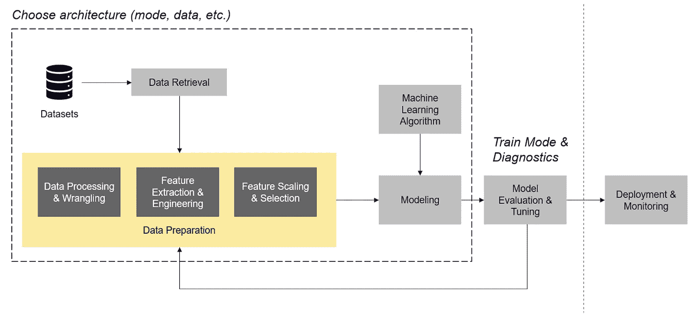

机器学习管道 — 图片来源：作者

**文章内容：**

本文旨在奠定基础，深入探讨各种基于决策树的树型集成算法。决策树的概念非常直观，易于理解。乍一看，XGBoost、CatBoost 和 LightGBM 看起来复杂一些。但如果你仔细观察，XGBoost 只是不同概念的组合，而这些概念本身又很容易理解。

一旦你理解了随机森林和梯度提升框架，你将能够解决各种数据科学问题。从分类到回归再到异常检测。

知识关于深度学习框架如 Pytorch、TensorFlow 等在几乎所有数据科学职位中扮演如此核心的角色，这有些荒谬。在许多领域，你将花费大部分时间来收集数据、准备数据和提取特征。如果你有了合适的特征集，模型的创建本身通常是相当简单的。如果你主要处理表格数据，你可能会通过袋装和提升算法走得很远。

如果你想一次性下载文章中使用的代码并作为参考，你可以在 [github](https://github.com/polzerdo55862/decision-tree-from-scratch) 上找到使用的代码片段。你也可以在附录中找到我们将在本文中构建的决策树算法的代码，位于文章底部。

# 2\. 回归的决策树：背后的理论

决策树是最简单的机器学习算法之一。它们的工作方式相对容易解释。

作为人类，我们尝试通过将复杂问题分解为相对简单的是或否决策来解决问题。当我们想买一辆新车时，我们浏览所有能找到的汽车网站。过一段时间后，我们对某款车的价格有了感觉。我们感觉到奢侈品牌和便宜制造商之间的成本差异有多大，以及与较小的 100 hp 引擎相比，150 hp 引擎的额外费用有多少，等等。

一步步地，我们的大脑记住了某些特征组合的球 park 值。当我们停在汽车经销商那里，逐一查看汽车的特征时，就像是在决策树上向下移动，直到我们认为得到了一个公平的价格。

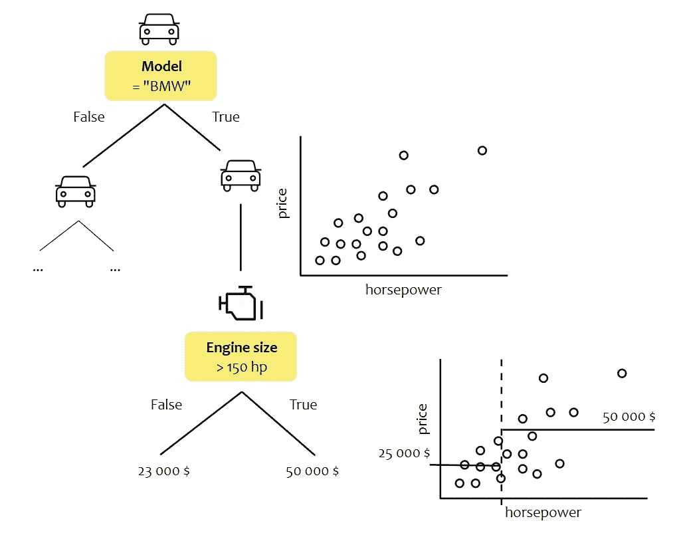

一个简单的回归树预测汽车价格 — 图像由作者提供

***注意：*** *在我们深入了解决策树的构建之前，需要提到有不同的决策树算法。一些流行的算法包括 ID3、C4.5、C5.0 和 CART（Google Developers, 2017）。Scikit-learn 的实现基于 CART，该算法由 Leo Breiman 等人于 1984 年首次发布。Leo Breiman 是一位美国统计学家，他塑造了“bagging”的方法，开发了随机森林，从而对基于树的算法的进一步发展做出了重要贡献。*

**我们如何开始构建决策树？**

要开始决策树构建过程，我们需要回答三个问题：

1.  **我们从哪个特征开始？** - 我们在每个节点沿一个维度划分数据集。在这个例子中，我们使用特征 x_1 进行划分。由于我们不想仅仅选择随机特征，我们会提前搜索出划分数据集带来最大增益的特征。（在这种情况下，我们通常谈到所谓的信息增益。我们可以以不同的方式定义信息增益，在回归中我们通常使用*平方误差*）。

1.  **最佳的阈值来划分数据是什么？** - 类似于第一步，当我们选择一个特征时，我们仍然需要知道我们想用什么阈值来划分数据集。换句话说，就是在维度上的哪个位置我们想要划分数据集。

1.  **我们什么时候停止划分数据集？** - 如果我们在某个点不停止划分过程，决策树将继续进行，直到每个叶子节点中只有一个样本点。为了避免过拟合，我们需要一些标准来决定划分数据集的深度以及何时停止划分过程，以避免模型变得不必要的复杂。

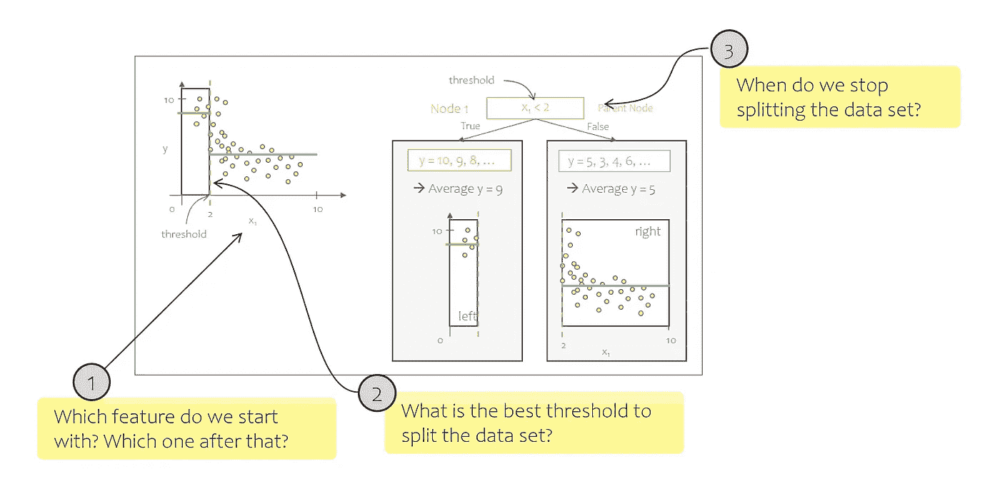

我们必须回答的三个问题 — 图像由作者提供

我们再次使用汽车价格预测的例子。首先，我们需要选择一个特征并分割数据集。我们选择一个特征和一个阈值，将数据集分割成左侧和右侧部分，并计算平均价格。这给了我们第一个节点。如果我们现在停止，我们将拥有一个只有一个层级的简约决策树——所谓的决策桩。

然而，我们不想从随机分割开始，而是从“最佳可能”的分割开始。

**但是，如何定义“最佳”分割呢？**

我们需要定义一个度量标准，帮助我们评估分割的效果。

在回归问题中，常用的损失函数有 **平均绝对误差** 或 **均方误差**。通常，我们可以在不同的度量标准之间进行选择。要了解 scikit-learn 是如何计算每次分割的性能的，我们可以直接查看文档或源代码。

访问源代码的最简单方法是通过代码编辑器。

如果你还没有安装 scikit，你可以通过以下 pip 命令进行安装：

```py
pip install scikit-learn
```

我在大多数项目中使用 Visual Studio Code。如果我创建一个新的笔记本或 Python 文件并导入相应的模块，Visual Studio 会提供一个直接链接到其背后的源代码。在左侧的图片中，你可以看到 Visual Studio Code 中的整个情况。

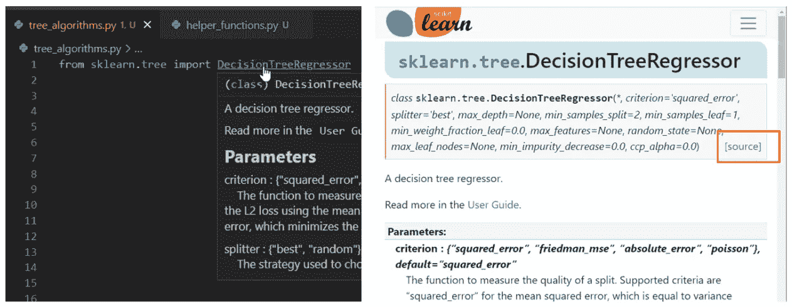

作者截图

1.  创建一个新文件，在我的例子中是“**tree_algorithms.py**”，并导入回归树模块“**sklearn.tree.DecisionTreeRegressor**”。

1.  按下“**Ctrl**”并点击相应模块，你将直接跳转到源代码的相应部分。

你也可以在 scikit-learn 的文档中找到源代码。右侧可以看到在 *scikit-learn.org* 上的整个情况。每个类和函数还有一个指向 Github 上源代码的链接。

如果我们深入到 DecisionTreeRegressor 的源代码中，我们会看到它被定义为一个用以下值初始化的类：

```py
def __init__(
       self,
       *,
       criterion="squared_error",
       splitter="best",
       max_depth=None,
       min_samples_split=2,
       min_samples_leaf=1,
       min_weight_fraction_leaf=0.0,
       max_features=None,
       random_state=None,
       max_leaf_nodes=None,
       min_impurity_decrease=0.0,
       ccp_alpha=0.0,

   ):
```

我们将逐渐深入了解每个超参数的作用。我们一开始感兴趣的是分割标准，即决策树在构建过程中如何确定如何分割数据集。

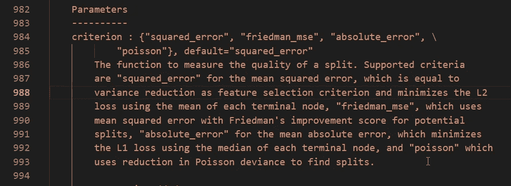

作者截图

代码中还包含了我们可以选择的标准的简短描述。

Scikit-learn 让我们可以在以下选项中选择：

+   squared_error

+   friedmann_mse

+   绝对误差

+   泊松

默认值是“squared_error”。文档中将其描述如下：

> *“squared_error” 等同于方差减少，并使用每个终端节点的均值来最小化 L2 损失*

因此，我们尝试在终端节点中最小化 *均方误差*。

假设我们有一个简单的二维数据集，只有 x_1 作为唯一的输入特征和 y 作为目标变量。对于这个简单的例子，我们不需要决定哪个特征最适合分割数据集，因为数据集中只有一个特征。因此，在根节点，我们使用 x_1 将数据集分成两半。

在下图中，您可以找到一个简单的二维数据集。数据集的两个部分是我们的子节点。在我们进行第一次分裂时，这两个子节点是叶节点或终端节点（不会进一步分裂的节点）。

在所示的情况下，我们在 x_1=2 处分割数据集。

**如果我们用它来进行预测，树现在会预测什么值？**

我们必须为每个终端节点定义一个值，这样就代表了决策树的可能预测值。我们以最简单的方式计算这个预测值 y_pred，我们计算左节点的平均值 (**这里：** y_pred_left = 9) 和右节点的平均值 (**这里：** y_pred_right = 5)。

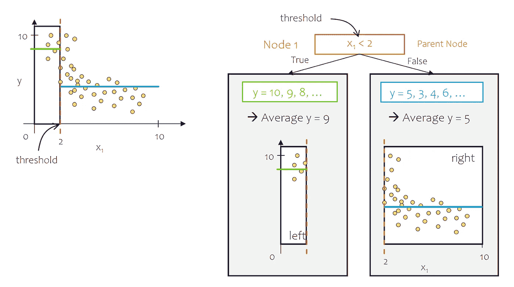

分割数据集 — 图片由作者提供

**我如何找到最佳的分裂数据集的阈值？**

在所示的示例中，我们选择了 x_1 = 2 作为阈值。但这是否是最优情况？

为了评估分裂的性能，我们计算残差，即 y_predict 与每个样本的 y 之间的差异。更准确地说，我们计算 L2 损失函数，即残差的平方和。

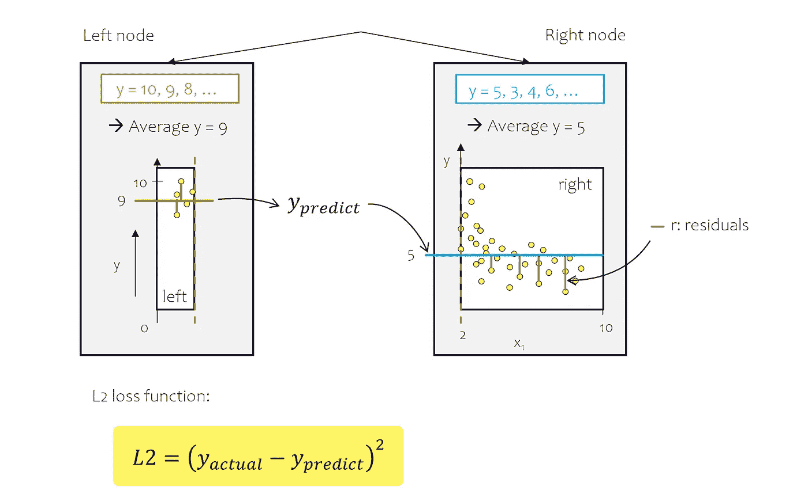

如何计算左叶子和右叶子的预测值 — 图片由作者提供

为了得到桩模型的性能值，我们分别计算两侧的偏差（l2 损失），然后通过包括两半样本的数量来计算加权总体损失。

我们反复进行这个过程，尝试不同的阈值（见图片）。在我们的例子中，当我们选择 x_1 = 5 作为分裂阈值时，加权平方误差最小：


父节点和子节点的 MSE 计算 — 图片由作者提供

**我们的算法如何找到最小误差？**

决策树以非常简单的方式执行这一操作，它定义了一种迭代方法，尝试不同的阈值。因此，我们定义了一个可能的阈值/分裂值列表，并计算列表中每个可能阈值的均方误差。

+   **步骤 1 - 定义可能的分裂阈值列表：** 我们通过排序值并计算滚动平均值来定义所有可能的分裂值。因此，如果 x_1 = 2 和 x_2 = 3，那么可能阈值列表中的第一个阈值是 2.5。

+   **步骤 2：** 在下一步中，我们需要找到最小化平方误差的阈值来构建节点。我们开始迭代所有阈值，拆分数据集，并计算右节点和左节点的 MSE。

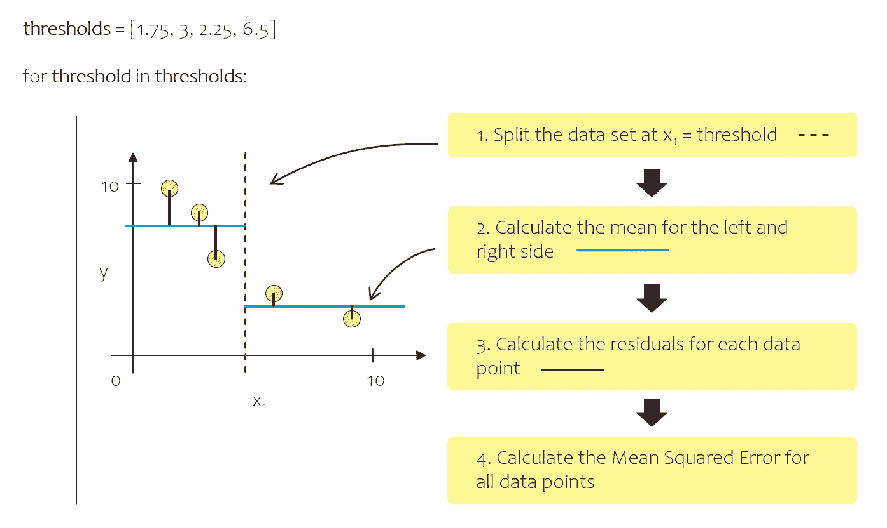

不同阈值下均方误差的迭代计算 — 图片由作者提供

让我们用实际数据集来尝试一下。

# 加载现实世界的数据集

为了在实际数据集上演示刚才描述的步骤，我们从 UCIMachineLearning 下载了汽车数据集。该数据集包含许多属性，如马力、尺寸、燃料类型等，用于详细描述汽车。我们感兴趣的目标变量是价格。[（](https://www.google.com/url?q=https%3A%2F%2Fwww.zotero.org%2Fgoogle-docs%2F%3FY7wEQt&sa=D&ust=1680021204980533&usg=AOvVaw3AthCMTcfOQu5mgN3xM1an)*UCI Machine Learning Repository: 汽车数据集*，无日期。）*[许可证：* [*CC0: 公共领域*](https://creativecommons.org/publicdomain/zero/1.0/)*]*

```py
def load_auto_data_set():

   # Load the automobile data set from UCI.edu
   url = '<https://archive.ics.uci.edu/ml/machine-learning-databases/autos/imports-85.data>'
   df = pd.read_csv(url, header=None)

   # Name columns
   df.columns = ['symboling', 'normalized_losses', 'make', 'fuel_type', 'aspiration', 'num_doors', 'body_style', 'drive_wheels', 'engine_location','wheel_base','length','width','height',          'curb_weight','engine_type','num_cylinders','engine_size','fuel_system','bore','stroke', 'compression_ratio','horsepower','peak_rpm','city_mpg','highway_mpg','price']

   # Filter for lines where power and price are available
   df = df[(df.horsepower != '?')]
   df = df[(df.price != '?')]

   # Filter for lines where power and price are available
   df['horsepower'] = df['horsepower'].astype(int)
   df['price'] = df['price'].astype(int)

   # Define the last column of the data frame as y and the rest as X
   self.y = self.df.iloc[:, -1]
   self.X = self.df.iloc[:, :-1]

   return df, X, y
```

之后，我们执行刚才描述的步骤。以下代码片段使用所选特征**selected_feature**和定义的阈值**threshold**来分割数据集（X_parent, y_parent）。

该图展示了左子节点和右子节点的样本及观察值的平均值。如果我们现在停止，子节点将成为树的叶子节点，树的预测值将由两个部分的计算均值表示。

```py
class NodePlot():

   def __init__(self, X_parent, y_parent, threshold, selected_feature):
       self.selected_feature = selected_feature
       self.x_column = X_parent[self.selected_feature]
       self.y_parent = y_parent
       self.data_set = np.column_stack((self.x_column, y_parent))
       self.threshold = threshold

       # define a list with all observations of the left and right leaf
       self.left_y = self.data_set[self.data_set[:, 0]<self.threshold][:, 1]
       self.left_x = self.data_set[self.data_set[:, 0]<self.threshold][:, 0]
       self.right_y = self.data_set[self.data_set[:, 0]>=self.threshold][:, 1]
       self.right_x = self.data_set[self.data_set[:, 0]>=self.threshold][:, 0]

       # calculate the mean of the observations for the left and right leaf
       self.parent_y_mean = np.mean(self.y_parent)
       self.left_y_mean = np.mean(self.left_y)
       self.right_y_mean = np.mean(self.right_y)

       # calculate the weighted mean squared error
       self.parent_mse = np.mean((y_parent - self.parent_y_mean)**2)
       mse_l = np.mean((self.left_y - self.left_y_mean)**2)
       mse_r = np.mean((self.right_y - self.right_y_mean)**2)

       # calculate the number of instances in the parent and child nodes
       n_l = len(self.left_y)
       n_r = len(self.right_y)
       n = len(self.data_set)

       # calculate the weighted mse for child nodes
       self.child_mse = (n_l/n) * mse_l + (n_r/n) * mse_r

   def plot_split(self):
       plt.rcParams['font.size'] = '16'
       sns.set_style("darkgrid", {"axes.facecolor": ".9"})

       fig = go.Figure()

       fig.add_trace(
           go.Scatter(
               x=self.left_x,
               y=self.left_y,
               mode="markers",
               name="Data set: left node",
               line=dict(color="grey")
           )
       )

       fig.add_trace(
           go.Scatter(
               x=self.left_x,
               y=np.linspace(self.left_y_mean, self.left_y_mean, len(self.left_x)),
               mode="lines",
               name="Right node prediction",
               line=dict(color="black")
           )
       )

       # create go.scatter plot with black line
       fig.add_trace(
           go.Scatter(
               x=self.right_x,
               y=self.right_y,
               mode="markers",
               name="Data set: right node",
               #line=dict(color="#ffe476")
               line=dict(color="black")
           )
       )

      fig.add_trace(
           go.Scatter(
               x=self.right_x,
               y=np.linspace(self.right_y_mean, self.right_y_mean, len(self.right_x)),
               mode="lines",
               name="Left node prediction",
               line=dict(color="black", dash='dot')
           )
       )

       fig.add_trace(
           go.Scatter(
               x=[self.threshold, self.threshold],
               y=[min(self.y_parent), max(self.y_parent)],
               mode="lines",
               name="MSE of parent node",
               line=dict(color="black", dash='dashdot')
           )
       )

       # update title in go.Figure
       fig.update_layout(title="Data set", xaxis_title=self.selected_feature, yaxis_title=self.y_parent.name)

       fig.show()
```

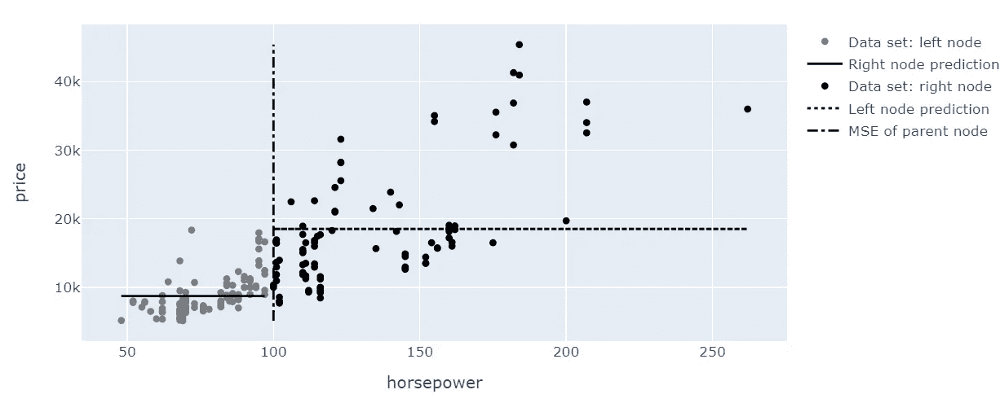

图片由作者提供

由于我们不想在数据集中的任何地方进行分割，而是选择“最佳”点，因此我们按上述描述进行迭代。我们使用节点绘图类来计算多个阈值的残差。

```py
selected_feature = "horsepower"

list_of_mse_childs = []
list_of_mse_parent = []
thresholds = X.sort_values(by=["horsepower"])["horsepower"].unique()

for threshold in thresholds:

   NodePlot = helper_functions.NodePlot(
                                   X_parent = X,
                                   y_parent = y,
                                   threshold = threshold,
                                   selected_feature = "horsepower"
                                   )

   list_of_mse_childs.append(NodePlot.child_mse)
   list_of_mse_parent.append(NodePlot.parent_mse)

def plot_threshold_evaluation(thresholds, mse_parent_list, mse_list):
    # create figure
    fig = go.Figure()

    fig.add_trace(
        go.Scatter(
            x=thresholds,
            y=mse_list,
            mode="lines",
            name="MSE after split",
            line=dict(color="black")
        )
    )

    fig.add_trace(
        go.Scatter(
            x=thresholds,
            y=mse_parent_list,
            mode="lines",
            name="MSE of parent node",
            line=dict(color="black", dash='dot')
        )
    )

    fig.add_trace(
        go.Scatter(
            x=[threshold,threshold],
            y=[min(mse_list), max(mse_list)],
            mode="lines",
            name="Chosen threshold",
            line=dict(color="black", dash='dashdot')
        )
    )

    # update title in go.Figure
    fig.update_layout(title="Evaluate", yaxis_title='MSE')

    fig.show()

    return fig

# plot the just calculated MSE values for different thresholds
plot_threshold_evaluation(
                           thresholds = thresholds,
                           mse_parent_list = list_of_mse_parent,
                           mse_list = list_of_mse_childs,
                           threshold = 100
                       )
```

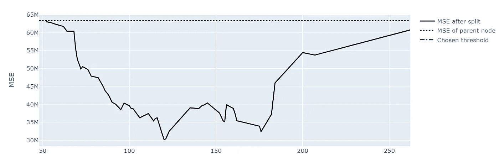

图片由作者提供

我们计算每个可能分割的父节点和子节点的平方误差。对于决策树，我们寻求最大**信息增益**。使用平方误差作为分割标准，我们简单地将信息增益计算为父节点的 MSE 与子节点加权 MSE 之间的差异。

在图表中，信息增益的最大值出现在 120 小时。

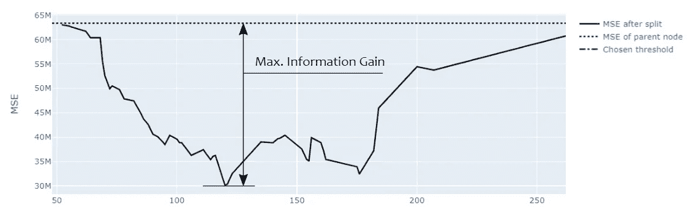

图片由作者提供

在决策树中，我们不断重复刚才描述的步骤。

*注意：决策树被归类为贪心算法。贪心算法在选择过程中逐步选择承诺最佳结果的状态。做出决策时不考虑之前和之后的决策。*

**程序什么时候结束？**

决策树在训练模型时不会做很多假设。例如，线性回归恰恰相反，当线性回归算法训练模型时，它仅允许模型具有一种可能的形状，即空间中的直线或平面。因此，当我们使用线性回归作为学习算法时，我们直接假设我们的问题遵循线性行为。

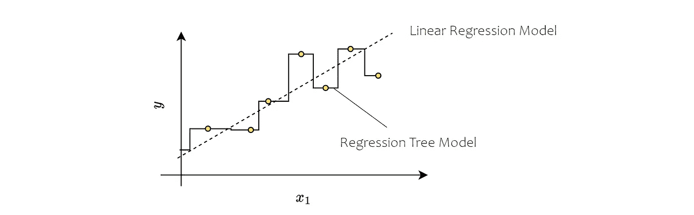

参数模型（线性回归）与非参数模型（回归树）— 作者提供的图像

决策树在学习过程中非常灵活。这些模型被称为“非参数模型”。当模型的参数数量没有提前确定时，就称为非参数模型。线性回归有一个明确定义的参数数量，即斜率和偏移量。这显著限制了训练过程中的自由度。（Géron，2022）

因此，决策树往往容易过拟合。为了避免这种情况，我们需要引入限制训练过程自由度的超参数，即所谓的正则化超参数。

一个常用的正则化参数是 **max_depth**，即树的最大深度。其他的包括：

+   **min_samples_split**（节点需要的最小样本数，以便进行拆分）

+   **min_samples_leaf**（每个叶子节点必须具有的最小样本数）

+   **min_weight_fraction_leaf**（类似于 min_samples_leaf，但我们定义的是整个数据集的一个比例，而不是一个具体的数字）

+   **max_leaf_nodes**（叶子节点的最大数量）

+   **max_features**（在每次分裂时评估的最大特征数量）。

在实际模型构建后，我们仍然可以修剪树，以避免模型不必要的复杂性。

**什么是剪枝？**

这项技术包括将树生长到其全部大小，然后删除那些对验证数据集的准确性没有提升的分支或子树。这是通过计算修剪子树前后的误差变化，并与一个阈值进行比较来完成的。如果误差变化不显著，则会修剪子树。由于我暂时不想深入探讨这个问题，我将在以下简单示例中省略它。

接下来，我将向你展示如何从头开始构建一个基本版本的回归树。

# 3\. 从理论到实践 - 从头开始构建决策树

为了灵活使用回归树，我们将代码放入一个新的模块中。我们创建一个新的 Python 文件，将所有与我们算法和学习过程相关的代码放入其中。在这个文件中，我们定义一个名为“RegressionTree”的新类，并用作为训练过程约束的超参数进行初始化。

如前所述，处理决策树的最大挑战之一是过拟合的风险。为了降低这一风险，并确保我们的模型能够很好地推广到新数据，我们引入了正则化参数，这些参数在某个点指导和停止学习过程。

我们在简化版决策树中使用的正则化参数（或停止准则）有以下两个：

**min_samples_split**

+   定义一个节点需要的最大样本数量，以便进一步拆分。合适的值取决于数据集的类型和大小。如果选择得当，它可以防止过拟合。在 scikit-learn 中，默认值设置为 2 个样本。

**max_depth**

+   最大深度决定了树最多可以有多少层。如果其他停止准则如 *min_sample_split* 在达到此深度之前阻止了树的进一步生长，则可能无法达到此树的大小。Scikit-learn 默认将值设置为“None”，因此默认情况下最大深度没有限制。

Scikit-learn 还包括一些额外的停止参数，如 **min_samples_leaf, min_weighted_fraction, max_leaf_nodes, or max_features**，这些参数默认为未设置，我暂时会忽略它们。

我们为每个回归器需要的一个函数是 fit 函数，它启动训练过程。输入变量是一个多维数组（X），包含输入特征。y 是一个一维数组，描述目标变量。

除了我们的回归器（**RegressionTree**）外，我们还定义了一个第二个类（**Node**），通过它设置和存储树的每个节点所具有的参数。

```py
 class Node():
    def __init__(
                    self, 
                    feature=None, 
                    threshold=None, 
                    left=None, 
                    right=None, 
                    value=None
                ):
        self.feature = feature
        self.threshold = threshold
        self.left = left
        self.right = right
        self.value = value # is it a leave node?

    def is_leaf_node(self):
        return self.value is not None

class RegressionTree():
    def __init__(
                    self, 
                    min_samples_split=2, 
                    max_depth=100):

        self.min_samples_split = min_samples_split
        self.max_depth = max_depth
        self.root = None

    def fit(self, X, y):
        self.root = self._grow_tree(X, y)
```

fit 函数使用辅助函数 **_grow_tree(x, y)** 一步步地生长树，直到达到停止准则中的一个。

在分割节点之前，我们检查是否满足任何一个停止准则。在简化的示例中，我们只有两个停止准则：

**(1) depth >= self.max_depth:** 是否达到树的最大深度？

**(2) n_samples < self.min_samples_split:** 节点中的样本数是否大于 **min_samples_split**？

如果任一条件为真，则该节点是终端节点，我们需要计算的唯一内容是均值（**np.mean(y)**）。

如果两个条件都不为真，我们将进一步分割数据集。我们首先定义考虑哪些特征进行分割。在我们简化的情况下，我们不会限制用于分割的列。我们使用 X 中的所有特征（**feat_idxs**）。

对于实际的分割，我们定义了另一个辅助函数 **_best_split**，我们将正在查看的节点的 x 和 y 值传递给它。

我会稍后详细介绍 **_best_split** 的作用，但正如名称所示，**_best_split** 会以所选特征（**best_features**）和我们分割数据集的阈值（**best_threshold**）的形式返回“最佳”分割。

我们使用这些信息来实际分割数据集并将其作为我们树的一个节点存储。

在我们跳出函数之前，我们会再次调用**_grow_tree**来处理分支的两个部分。

```py
def _grow_tree(self, X, y, depth=0):
    # check the stopping criteria
    n_samples, n_feats = X.shape

    if (depth>=self.max_depth or n_samples<self.min_samples_split):
       leaf_value = np.mean(y)
       return Node(value=leaf_value)

    feat_idxs = np.random.choice(n_feats, n_feats, replace=False)

    # find the best split
    best_thresh, best_feature = self._best_split(X, y, feat_idxs)

    # create child nodes
    left_idxs, right_idxs = self._split(X[:, best_feature], best_thresh)
    left = self._grow_tree(X[left_idxs, :], y[left_idxs], depth+1)
    right = self._grow_tree(X[right_idxs, :], y[right_idxs], depth+1)

    return Node(best_feature, best_thresh, left, right)
```

唯一未解答的问题是算法如何确定最佳的分割。

如前所述，我们计算所谓的信息增益。在我们的例子中，我们将信息增益定义为均方误差的减少。节点本身及其结果子节点的误差或残差是通过计算每个节点中目标变量 y 的平均值与节点中样本的实际 y 值之间的差异来得到的。

该函数逐个遍历每个特征。

1.  我们为每个特征计算一组可能的阈值，作为所有观察值的移动平均值。

1.  然后，我们遍历列表中的每个阈值，拆分数据集，并计算子节点的加权均方误差。

1.  然后，我们检查计算得到的 MSE 是否是迄今为止计算出的最小 MSE，如果是的话，我们将 feature_idx 和 threshold 保存为最优（在**best_feature_idxs**和**best_thresholds**中）。

```py
def _best_split(self, X, y, feat_idxs):
    y_mean = np.mean(y)
    residuals_y = (y - y_mean)**2
    y_mse = np.mean(residuals_y)

    best_feature_ixd, best_threshold = None, None
    lowest_mse = y_mse

    for feat_idx in feat_idxs:
       # define possible thresholds for the split
       X_column = X[:, feat_idx]
       thresholds = np.convolve(np.sort(X_column), np.ones(2)/2, mode='valid')

       for threshold in thresholds:
           # getting the left and right nodes
           left_idxs, right_idxs = self._split(X_column, threshold)

           # calculate the weighted avg. mse of children
           n = len(y)
           n_l, n_r = len(left_idxs), len(right_idxs)
           mse_l = self._squared_error(y[left_idxs])
           mse_r = self._squared_error(y[right_idxs])
           child_mse = (n_l/n) * mse_l + (n_r/n) * mse_r

           if lowest_mse > child_mse:
               lowest_mse = child_mse
               best_feature_ixd = feat_idx
               best_threshold = threshold

    return best_feature_ixd, best_threshold
```

我们在上述几个部分中已经多次使用的两个函数是**_split**和**_squared_error**。

```py
def _split(self, X_column, split_thresh):
    left_idxs = np.argwhere(X_column <= split_thresh).flatten()
    right_idxs = np.argwhere(X_column > split_thresh).flatten()
    return left_idxs, right_idxs

def _squared_error(self, y):
    # calculate the mean value for all observations
    y_mean = np.mean(y)

    # calculate the residuals to y_mean
    mean_squared_error = np.mean((y - y_mean)**2)

    return mean_squared_error
```

唯一需要的就是**predict()**函数。为此，我们使用**_traverse_tree**。

使用循环函数，我们逐个遍历刚构建的树。如果到达叶子节点，**_traverse_tree**返回存储的节点值。

```py
def predict(self, X):
    return np.array([self._traverse_tree(x) for x in X])

def _traverse_tree(self, x, node):
    if node.is_leaf_node():
       return node.value

    if x[node.feature] <= node.threshold:
       return self._traverse_tree(x, node.left)

    return self._traverse_tree(x, node.right)
```

就这样，完整的*决策树回归器*定义为：

```py
import numpy as np
from collections import Counter
from sklearn.metrics import mean_squared_error
from collections import Counter

class Node():
    def __init__(
                    self, 
                    feature=None, 
                    threshold=None, 
                    left=None, 
                    right=None, 
                    value=None
                ):
        self.feature = feature
        self.threshold = threshold
        self.left = left
        self.right = right
        self.value = value # is it a leave node?

    def is_leaf_node(self):
        return self.value is not None

class RegressionTree():
    def __init__(
                    self, 
                    min_samples_split=2, 
                    max_depth=100):
        self.min_samples_split = min_samples_split
        self.max_depth = max_depth
        self.root = None

    def fit(self, X, y):
        self.root = self._grow_tree(X, y)

    def _grow_tree(self, X, y, depth=0):
        # check the stopping criteria
        n_samples, n_feats = X.shape

        if (depth>=self.max_depth or n_samples<self.min_samples_split):
            leaf_value = np.mean(y)
            return Node(value=leaf_value)

        feat_idxs = np.random.choice(n_feats, n_feats, replace=False)

        # find the best split
        best_feature_ixd, best_threshold = self._best_split(X, y, feat_idxs)

        # create child nodes
        left_idxs, right_idxs = self._split(X[:, best_feature_ixd], best_threshold)

        left = self._grow_tree(X[left_idxs, :], y[left_idxs], depth+1)
        right = self._grow_tree(X[right_idxs, :], y[right_idxs], depth+1)

        return Node(best_feature_ixd, best_threshold, left, right)

    def _best_split(self, X, y, feat_idxs):
        y_mean = np.mean(y)
        residuals_y = (y - y_mean)**2
        y_mse = np.mean(residuals_y)

        best_feature_ixd, best_threshold = None, None
        lowest_mse = y_mse

        for feat_idx in feat_idxs:
            # define possible thresholds for the split
            X_column = X[:, feat_idx]
            thresholds = np.convolve(np.sort(X_column), np.ones(2)/2, mode='valid')

            for threshold in thresholds:
                # getting the left and right nodes
                left_idxs, right_idxs = self._split(X_column, threshold)

                # calculate the weighted avg. mse of children
                n = len(y)
                n_l, n_r = len(left_idxs), len(right_idxs)
                mse_l = self._squared_error(y[left_idxs]) 
                mse_r = self._squared_error(y[right_idxs])
                child_mse = (n_l/n) * mse_l + (n_r/n) * mse_r

                if lowest_mse > child_mse:
                    lowest_mse = child_mse
                    best_feature_ixd = feat_idx
                    best_threshold = threshold

        return best_feature_ixd, best_threshold

    def _split(self, X_column, split_thresh):
        left_idxs = np.argwhere(X_column <= split_thresh).flatten()
        right_idxs = np.argwhere(X_column > split_thresh).flatten()
        return left_idxs, right_idxs

    def _squared_error(self, y):
        # calculate the mean value for all observations
        y_mean = np.mean(y)

        # calculate the residuals to y_mean
        mean_squared_error = np.mean((y - y_mean)**2)

        return mean_squared_error

    def predict(self, X):
        return np.array([self._traverse_tree(x, self.root) for x in X])

    def _traverse_tree(self, x, node):
        if node.is_leaf_node():
            return node.value

        if x[node.feature] <= node.threshold:
            return self._traverse_tree(x, node.left)

        return self._traverse_tree(x, node.right)
```

# 4\. 实战示例 — 从头实现与 Scikit-learn 决策树

**加载数据集**

对于测试，我们使用之前作为示例的数据集，即汽车数据集。首先，我们从 uci.edu 加载数据集。然后，我们选择一些属性进行第一次简单测试。在以下示例中，我选择：

+   车轮基距

+   长度

+   宽度

+   高度

+   制造商

对于输入向量 X。

由于属性“make”包含字符串，我们使用 OneHot Encoding 将其转换为数值特征。

```py
import pandas as pd
import numpy as np
from sklearn.model_selection import train_test_split

def load_auto_data_set():
  # Load the automobile data set from UCI.edu
  url = 'https://archive.ics.uci.edu/ml/machine-learning-databases/autos/imports-85.data'
  df = pd.read_csv(url, header=None)

  # Name columns
  df.columns = [
                 'symboling', 'normalized_losses', 'make',
                 'fuel_type', 'aspiration', 'num_doors',
                 'body_style', 'drive_wheels', 'engine_location',
                 'wheel_base','length','width','height',
                 'curb_weight','engine_type','num_cylinders',
                 'engine_size','fuel_system','bore','stroke',
                 'compression_ratio','horsepower','peak_rpm',
                 'city_mpg','highway_mpg','price'
             ]

  # Filter for lines where power and price are available
  df = df[(df.horsepower != '?')]
  df = df[(df.price != '?')]
  df = df.reset_index()

  # Filter for lines where power and price are available
  df['horsepower'] = df['horsepower'].astype(int)
  df['price'] = df['price'].astype(int)

  # Define the last column of the data frame as y and the rest as X
  y = df.iloc[:, -1]
  X = df.iloc[:, :-1]

  return df, X, y

df, X, y = load_auto_data_set()

from sklearn.preprocessing import OneHotEncoder

X_selected = X[["wheel_base", "length", "width","height"]].reset_index()

# define and fit the OneHotEncoder
ohe = OneHotEncoder()
ohe.fit(df[['make']])

# transform the "make" column
make_one_hot_sklearn = pd.DataFrame(ohe.transform(df[["make"]]).toarray(), columns=ohe.categories_[0])

X = X_selected.join(make_one_hot_sklearn)
X = np.array(X)
y = np.array(y)
```

**训练模型**

在定义输入和输出变量后，我们尝试用我们的算法进行第一次测试，以查看我们是否可以实际用于预测。

首先，我们将数据集拆分为训练集和测试集。

```py
import tree_algorithms
from sklearn.metrics import mean_squared_error, mean_absolute_error

X_train, X_test, y_train, y_test = train_test_split(X, y, test_size=0.33, random_state=42)
regr = tree_algorithms.RegressionTree(min_samples_split=5, max_depth=20)
regr.fit(X_train, y_train)
y_pred = regr.predict(X_test)

# calculate mean squared error
print(f"Mean Squared Error: {round(mean_squared_error(y_test, y_pred), 1)}")
```


我们的“从头开始的决策树”的 MSE — 作者截图

**与现有的 scikit-learn 库进行比较**

为了比较，我们现在尝试使用 scikit-learn 的"DecisionTreeRegressor"库。在这种情况下，我们训练的模型表现完全一样。我不会在这里探讨结果是好是坏。如果你想知道如何调整回归模型并找到表现最佳的模型，你可以在我以前的文章中找到更详细的适用方法解释（[这里](https://medium.com/towards-data-science/7-of-the-most-commonly-used-regression-algorithms-and-how-to-choose-the-right-one-fc3c8890f9e3) 或 [这里](https://medium.com/towards-data-science/a-step-by-step-introduction-to-bayesian-hyperparameter-optimization-94a623062fc)）。

```py
from sklearn.datasets import load_diabetes
from sklearn.model_selection import cross_val_score
from sklearn.tree import DecisionTreeRegressor
from sklearn.metrics import mean_squared_error, mean_absolute_error

regr = DecisionTreeRegressor(min_samples_split=5, max_depth=20)
regr.fit(X_train, y_train)
y_pred = regr.predict(X_test)

# calculate mean squared error
print(f"Mean Squared Error: {round(mean_squared_error(y_test, y_pred), 1)}")
```

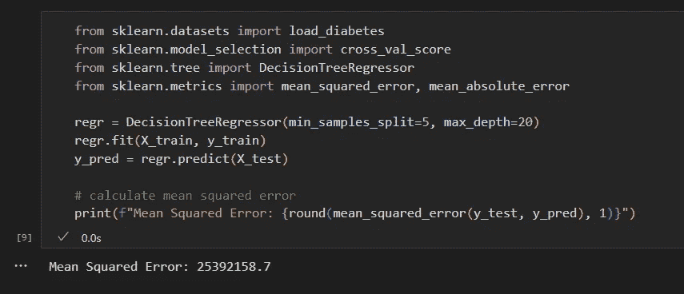

scikit-learn 决策树的 MSE — 作者截图

# 5\. 总结

决策树是许多出色算法的基础，如随机森林、XGBoost、LightGBM 和 CatBoost。它们背后的概念非常直观，通常易于理解，至少当你尝试逐一理解各个子概念时。通过这篇文章，你已经通过理解每个树集成算法的核心——决策树，迈出了良好的一步。

我计划发布更多关于使梯度提升框架如此高效的每个概念的文章。

> **喜欢这个故事吗？**

+   *如果你喜欢阅读并想了解更多关于机器学习的概念、算法和应用，你可以查看* [*我所有相关的文章列表。*](https://dmnkplzr.medium.com/list/e83997daeb7a)

+   *如果你不想错过新文章，你可以* [*免费订阅*](https://dmnkplzr.medium.com/subscribe) *以便在我发布新故事时收到通知。*

+   *成为 Medium 会员，阅读更多来自其他作者和我的故事。你可以通过使用我的* [*推荐链接*](https://medium.com/@dmnkplzr/membership) *来支持我。你不会额外花费任何费用，我将获得佣金。*

> 如果你有任何问题，请随时通过 [LinkedIn](https://www.linkedin.com/in/polzerdo/) 联系我！

# 6\. 参考文献

[Carlens, H. (无日期).](https://www.google.com/url?q=https%3A%2F%2Fwww.zotero.org%2Fgoogle-docs%2F%3FR398Mk&sa=D&ust=1680021205052647&usg=AOvVaw2Pb5R1CPby6AraUz7keuav) [*竞争性机器学习的现状*](https://www.google.com/url?q=https%3A%2F%2Fwww.zotero.org%2Fgoogle-docs%2F%3FR398Mk&sa=D&ust=1680021205053169&usg=AOvVaw02b_PEzqLVenZl73R1RWw-)[. ML 竞赛。检索日期 2023 年 3 月 17 日，来自 https://mlcontests.com/state-of-competitive-machine-learning-2022/](https://www.google.com/url?q=https%3A%2F%2Fwww.zotero.org%2Fgoogle-docs%2F%3FR398Mk&sa=D&ust=1680021205053558&usg=AOvVaw070Krotnte0a5TdQv6FjZ8)[`archive.ics.uci.edu/ml/datasets/automobile`](https://www.google.com/url?q=https%3A%2F%2Farchive.ics.uci.edu%2Fml%2Fdatasets%2Fautomobile&sa=D&ust=1680021205053857&usg=AOvVaw2ehc0ELTUM0LQFHfPnPMNX)

[Chow, R. (2021 年 8 月 31 日).](https://www.google.com/url?q=https%3A%2F%2Fwww.zotero.org%2Fgoogle-docs%2F%3FR398Mk&sa=D&ust=1680021205054283&usg=AOvVaw3iOkiDt58NURkVrRBdafx7) [*决策树与随机森林算法：决策驱动因素*](https://www.google.com/url?q=https%3A%2F%2Fwww.zotero.org%2Fgoogle-docs%2F%3FR398Mk&sa=D&ust=1680021205054645&usg=AOvVaw2CdIsxVMJJZXXrylsvekOy)[. 数据科学史。 https://www.historyofdatascience.com/decision-tree-and-random-forest-algorithms-decision-drivers/](https://www.google.com/url?q=https%3A%2F%2Fwww.zotero.org%2Fgoogle-docs%2F%3FR398Mk&sa=D&ust=1680021205055068&usg=AOvVaw0I4ihT8MdGNEkPME96zZEH)

[Géron, A. (2022).](https://www.google.com/url?q=https%3A%2F%2Fwww.zotero.org%2Fgoogle-docs%2F%3FR398Mk&sa=D&ust=1680021205055543&usg=AOvVaw2qodvWBxf0OfnVTygMXkQQ) [*使用 Scikit-Learn、Keras 和 TensorFlow 的实践机器学习：构建智能系统的概念、工具和技术*](https://www.google.com/url?q=https%3A%2F%2Fwww.zotero.org%2Fgoogle-docs%2F%3FR398Mk&sa=D&ust=1680021205055825&usg=AOvVaw0BB-492v7QeyrV6ajrJ35G) [(第三版)。 O’Reilly Media, Inc.](https://www.google.com/url?q=https%3A%2F%2Fwww.zotero.org%2Fgoogle-docs%2F%3FR398Mk&sa=D&ust=1680021205056144&usg=AOvVaw21SJNw4GTfvgq7lPaxbny7)

[Google Developers (导演). (2017 年 9 月 13 日).](https://www.google.com/url?q=https%3A%2F%2Fwww.zotero.org%2Fgoogle-docs%2F%3FR398Mk&sa=D&ust=1680021205056524&usg=AOvVaw0sn3PWrGmEkNvyLwwGzsVF) [*从头开始编写决策树分类器——机器学习食谱第 8 集*](https://www.google.com/url?q=https%3A%2F%2Fwww.zotero.org%2Fgoogle-docs%2F%3FR398Mk&sa=D&ust=1680021205056810&usg=AOvVaw1vfMxM9QW4YiXmrKThlU88)[. https://www.youtube.com/watch?v=LDRbO9a6XPU](https://www.google.com/url?q=https%3A%2F%2Fwww.zotero.org%2Fgoogle-docs%2F%3FR398Mk&sa=D&ust=1680021205057100&usg=AOvVaw3qIenpzMJ2DXQf4v8G4t5g)

[Swalin, A. (2019 年 6 月 11 日).](https://www.google.com/url?q=https%3A%2F%2Fwww.zotero.org%2Fgoogle-docs%2F%3FR398Mk&sa=D&ust=1680021205057661&usg=AOvVaw0Hx2RqIiROY9Gw9jSd-s6B) [*CatBoost vs. Light GBM vs. XGBoost*](https://www.google.com/url?q=https%3A%2F%2Fwww.zotero.org%2Fgoogle-docs%2F%3FR398Mk&sa=D&ust=1680021205057965&usg=AOvVaw16zH0uhPbzR4Fn-98cq3jH)[. Medium. https://towardsdatascience.com/catboost-vs-light-gbm-vs-xgboost-5f93620723db](https://www.google.com/url?q=https%3A%2F%2Fwww.zotero.org%2Fgoogle-docs%2F%3FR398Mk&sa=D&ust=1680021205058282&usg=AOvVaw3F9COP_67yKpUAwzl5-vV1)

[*UCI 机器学习库：汽车数据集*](https://www.google.com/url?q=https%3A%2F%2Fwww.zotero.org%2Fgoogle-docs%2F%3FR398Mk&sa=D&ust=1680021205058732&usg=AOvVaw0lCQ-tx1LhGwFzHMkPH8K7)[. (无日期). 取自 2023 年 2 月 24 日, 来源 https://archive.ics.uci.edu/ml/datasets/automobile](https://www.google.com/url?q=https%3A%2F%2Fwww.zotero.org%2Fgoogle-docs%2F%3FR398Mk&sa=D&ust=1680021205059072&usg=AOvVaw2NJyPeMqBT1B0qE6gA2aGI)

# 7\. 附录

+   从头开始的回归树

```py
import numpy as np
from collections import Counter
from sklearn.metrics import mean_squared_error
from collections import Counter

class Node():
    def __init__(
                    self, 
                    feature=None, 
                    threshold=None, 
                    left=None, 
                    right=None, 
                    value=None
                ):
        self.feature = feature
        self.threshold = threshold
        self.left = left
        self.right = right
        self.value = value # is it a leave node?

    def is_leaf_node(self):
        return self.value is not None

class RegressionTree():
    def __init__(
                    self, 
                    min_samples_split=2, 
                    max_depth=100):
        self.min_samples_split = min_samples_split
        self.max_depth = max_depth
        self.root = None

    def fit(self, X, y):
        self.root = self._grow_tree(X, y)

    def _grow_tree(self, X, y, depth=0):
        # check the stopping criteria
        n_samples, n_feats = X.shape

        if (depth>=self.max_depth or n_samples<self.min_samples_split):
            leaf_value = np.mean(y)
            return Node(value=leaf_value)

        feat_idxs = np.random.choice(n_feats, n_feats, replace=False)

        # find the best split
        best_feature_ixd, best_threshold = self._best_split(X, y, feat_idxs)

        # create child nodes
        left_idxs, right_idxs = self._split(X[:, best_feature_ixd], best_threshold)

        left = self._grow_tree(X[left_idxs, :], y[left_idxs], depth+1)
        right = self._grow_tree(X[right_idxs, :], y[right_idxs], depth+1)

        return Node(best_feature_ixd, best_threshold, left, right)

    def _best_split(self, X, y, feat_idxs):
        y_mean = np.mean(y)
        residuals_y = (y - y_mean)**2
        y_mse = np.mean(residuals_y)

        best_feature_ixd, best_threshold = None, None
        lowest_mse = y_mse

        for feat_idx in feat_idxs:
            # define possible thresholds for the split
            X_column = X[:, feat_idx]
            thresholds = np.convolve(np.sort(X_column), np.ones(2)/2, mode='valid')

            for threshold in thresholds:
                # getting the left and right nodes
                left_idxs, right_idxs = self._split(X_column, threshold)

                # calculate the weighted avg. mse of children
                n = len(y)
                n_l, n_r = len(left_idxs), len(right_idxs)
                mse_l = self._squared_error(y[left_idxs]) 
                mse_r = self._squared_error(y[right_idxs])
                child_mse = (n_l/n) * mse_l + (n_r/n) * mse_r

                if lowest_mse > child_mse:
                    lowest_mse = child_mse
                    best_feature_ixd = feat_idx
                    best_threshold = threshold

        return best_feature_ixd, best_threshold

    def _split(self, X_column, split_thresh):
        left_idxs = np.argwhere(X_column <= split_thresh).flatten()
        right_idxs = np.argwhere(X_column > split_thresh).flatten()
        return left_idxs, right_idxs

    def _squared_error(self, y):
        # calculate the mean value for all observations
        y_mean = np.mean(y)

        # calculate the residuals to y_mean
        mean_squared_error = np.mean((y - y_mean)**2)

        return mean_squared_error

    def predict(self, X):
        return np.array([self._traverse_tree(x, self.root) for x in X])

    def _traverse_tree(self, x, node):
        if node.is_leaf_node():
            return node.value

        if x[node.feature] <= node.threshold:
            return self._traverse_tree(x, node.left)

        return self._traverse_tree(x, node.right)
```
