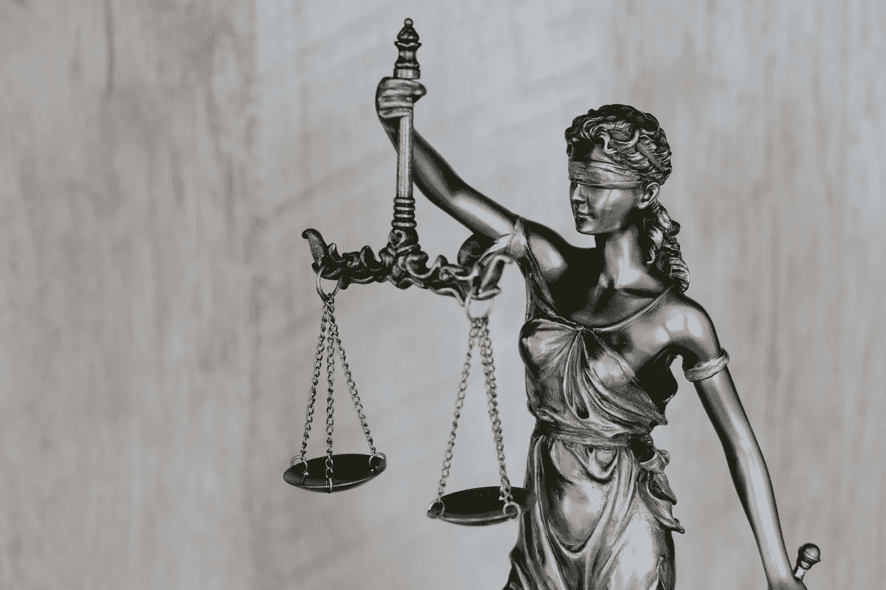
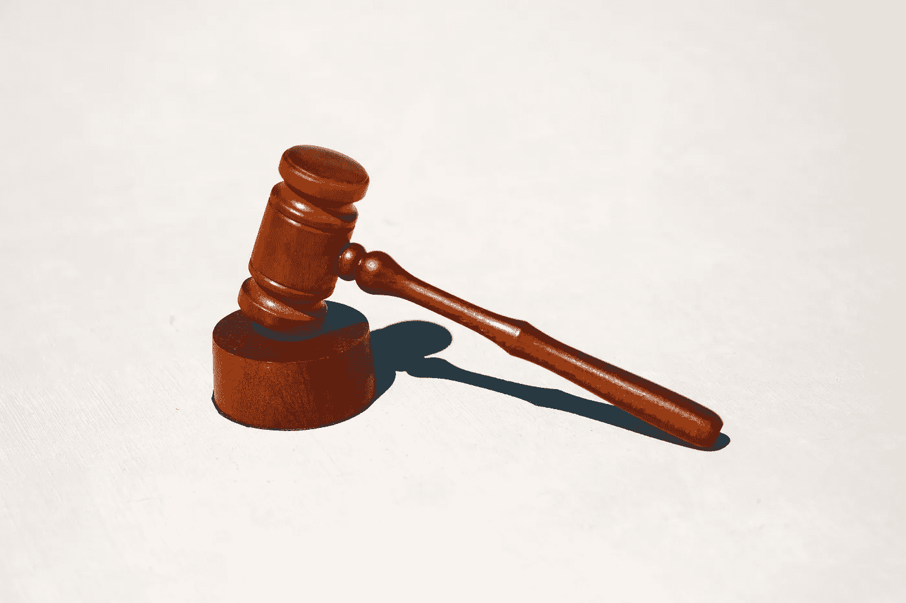
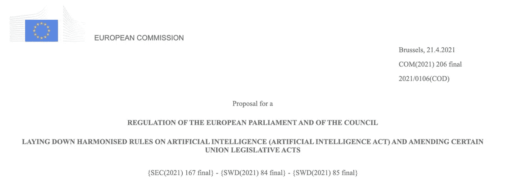

# 人工智能监管之路

> 原文：[`towardsdatascience.com/the-path-towards-ai-regulation-7199eb803040`](https://towardsdatascience.com/the-path-towards-ai-regulation-7199eb803040)

## 意见

## 《人工智能法案》的贡献及其全球影响

 [Marco Brambilla](https://marco-brambilla.medium.com/?source=post_page-----7199eb803040--------------------------------)

·发表于[Towards Data Science](https://towardsdatascience.com/?source=post_page-----7199eb803040--------------------------------) ·7 分钟阅读·2023 年 3 月 10 日

--

图片由[DeepMind](https://unsplash.com/@deepmind?utm_source=medium&utm_medium=referral)提供，来源于[Unsplash](https://unsplash.com/?utm_source=medium&utm_medium=referral)

2021 年中期，欧盟委员会提出了针对欧盟的人工智能（AI）新监管框架。因此，它代表了对人工智能实施某种程度监管的首次尝试。

> 你可以阅读[AI 法案提案](https://eur-lex.europa.eu/legal-content/EN/TXT/?uri=celex%3A52021PC0206)的完整官方文件（24 种语言版本）

目前，它仍然是最先进且被广泛接受的相关监管提案。虽然它仍处于初步提案阶段，但欧盟正在努力推动短期内的强烈议程以实现采纳。

> 目前对人工智能系统的定义非常宽泛和肤浅。

这一倡议受到全球的密切关注，因为**它源于对保护个人基本权利的需求**，因此可能对整个社会产生影响。

**这一法律框架从*使用*和*风险*的角度考虑人工智能系统**，同时接受了对人工智能及其系统概念的任何定义的局限性。基本上，目前对人工智能系统的定义非常宽泛和肤浅，因为它止步于将人工智能系统定义为一种软件技术，包括*机器学习*、*逻辑和知识基础系统*以及*统计*方法。

> 人工智能法案根据风险等级对人工智能系统进行分类，并根据风险等级规定了限制和义务。

图片由[janilson furtado](https://unsplash.com/@janilson123?utm_source=medium&utm_medium=referral)提供，来源于[Unsplash](https://unsplash.com/?utm_source=medium&utm_medium=referral)

***来自 Towards Data Science 编辑的说明：*** *虽然我们允许独立作者根据我们的* *规则和指南**发布文章，但我们不对每位作者的贡献表示认可。你不应在未寻求专业建议的情况下依赖作者的作品。详细信息请参见我们的* *读者条款**。

# AI 风险分类

规章提案并不限制技术或方法。相反，**它采用了一种基于风险的方法**，提出了一个根据风险等级对 AI 系统进行分类的方案，并根据风险等级指定了不同的要求、限制和义务。特别是：

+   **呈现‘不可接受’风险的 AI 系统将被禁止。** 这些包括涵盖操控性‘潜意识技术’、或利用特定易受害群体、社会评分目的以及实时远程生物特征识别系统的 AI 系统。

+   **‘高风险’ AI 系统将被授权，但需遵守非常严格的要求和义务**，才能进入欧盟市场。这些包括作为关键产品安全组件的 AI 系统、生物特征识别、关键基础设施的运行、教育工具；就业和工人管理；获取必要服务的工具；执法；移民、庇护和边境控制；以及司法和民主过程的管理。

+   **仅呈现‘有限风险’的 AI 系统将仅需遵守基本的透明度义务**。这些包括与人互动的系统（即聊天机器人）、情感识别、生物特征分类，以及生成或操控文本、图像、音频或视频内容（包括深度伪造）的系统。

注意这里的（遗漏）大象：军事和防御应用不在规章范围之内。实际上，《AI 法案》明确指出

> 专门为军事用途开发或使用的 AI 系统应排除在本规章范围之外。

同样也在

> *第 2.3 条：本规章不适用于专门为军事目的开发或使用的 AI 系统。*

难道它们不应该受到监管吗？

图片由 [Tingey Injury Law Firm](https://unsplash.com/@tingeyinjurylawfirm?utm_source=medium&utm_medium=referral) 提供，发布于 [Unsplash](https://unsplash.com/?utm_source=medium&utm_medium=referral)

# AI 合规执行

从某种意义上说，与这种基于风险的视角一起，这个框架还涵盖了治理和执行机构的定义：**它建立了一个欧洲人工智能委员会**（监督过程并确保各国的一致实施）**和一个每个成员国的国家监督机构**（监督法规的应用和实施），同时国家市场监督机构将负责通过广泛的保密访问（包括源代码）来监控参与者的合规性。

执法机构将采取适当措施限制、禁止、召回或撤回不符合规则的人工智能系统。这包括最高达 3000 万欧元或全球年总营业额 6% 的行政罚款，具体取决于违规的严重性。

> 人工智能法案及其相关执行机制采取了产品责任法的形式。

照片由 [Tingey Injury Law Firm](https://unsplash.com/@tingeyinjurylawfirm?utm_source=medium&utm_medium=referral) 提供，发布在 [Unsplash](https://unsplash.com/?utm_source=medium&utm_medium=referral)。

从务实的角度来看，基于风险的方法是完全有意义的。然而，这对未来的可持续性和普遍性提出了若干挑战。特别是：

+   人工智能的定义是否足够广泛和精确？

+   我们如何确保我们将应用程序分类到正确的风险类别？

+   对于我们现在无法预见的新解决方案和应用，怎么办？

此外，请注意，**人工智能法案及其相关执行机制基本上采取了产品责任法的形式**。的确，这种框架显然是在公司和产品层面制定规则和权利，而不是个人层面。这对生产和服务基于人工智能解决方案的公司有深远的影响。公司需要声明并展示其解决方案和应用的风险水平。它们还需要保证遵守各自风险水平的规则。

考虑到整个平台始于保护个人基本权利的需求，法案所采取的方法似乎与基本原则不太一致。此外，这种方法还隐含着实际风险：**如果出现任何问题，究竟由谁负责**？是开发公司、供应商，还是任何部署、配置或定制解决方案的中介？

人工智能监管框架还涵盖了其他维度：

+   **标准化**：与标准化机构如 ISO 和 IEEE 的讨论应确保技术和定义的采用尽可能广泛且达成一致。北约本身现在也在推进相关的标准化倡议。

+   **卓越**：框架不应（仅仅）限制人工智能的潜力。一方面，它将限制危险的应用，另一方面，它应在基础和应用层面上促进和推动创新与卓越。

> 如果不同时对数据进行监管和保护，那么对人工智能的监管可能没有任何意义。

至少在欧洲层面上，对这一倡议的重要性和必要性存在广泛的共识。其他国家也开始了类似的进程：例如，**美国在 2022 年制定了** [**人工智能权利法案**](https://www.whitehouse.gov/ostp/ai-bill-of-rights/) **的蓝图**，而[巴西](https://www.politico.eu/newsletter/ai-decoded/brazils-ai-law-us-takes-a-risk-based-approach-social-scoring/)制定了初步的人工智能法律。许多国家（包括[美国](https://www.ai.gov/)和许多欧盟成员国）也在 2020 年代初期制定了国家人工智能倡议。欧洲联盟可能会像它在数据保护领域所做的那样，为未来全球人工智能的监管铺平道路。

确实，对不对数据进行监管和保护的情况下对人工智能进行监管似乎没有任何意义。确实，人工智能法规的应用在已经拥有良好建立的*数据保护和监管*法律的国家中会更为可行。

在这方面，欧洲联盟再次在全球范围内引领潮流，推出了*GDPR*，该法规目前在更广泛的层面上产生了广泛的影响。

> 欧洲联盟可能会为未来全球人工智能系统的监管铺平道路，就像它在数据保护方面所做的那样。

图片由[Alex wong](https://unsplash.com/@killerfvith?utm_source=medium&utm_medium=referral)拍摄，来源于[Unsplash](https://unsplash.com/?utm_source=medium&utm_medium=referral)

AI 法案的详细描述可以在这个[欧盟议会简报](https://www.europarl.europa.eu/RegData/etudes/BRIE/2021/698792/EPRS_BRI(2021)698792_EN.pdf)中找到，而 AI 法案提案的完整官方文件发布在[这里](https://eur-lex.europa.eu/legal-content/EN/TXT/?uri=celex%3A52021PC0206)（提供 24 种语言）。关于此事的讨论和观点也来源于[IdeasLab](https://ideaslab.ceps.eu/)会议和由布鲁塞尔欧洲政治研究中心（CEPS）于 2023 年 2 月 28 日组织的智库。

[AI 法案提案的官方标题]

总结：AI 法案可以代表国际层面上对人工智能系统的首次尝试性监管。一旦获得批准，它可能会影响并在某种程度上迫使其他几个国家，包括美国，采取类似的举措，可能会与这一提案保持一致或受到其启发。

国际间的协调可能会带来好处，这与近年来的数据监管情况相对立。在过去，欧盟通过 GDPR 法规引领了数据监管，但美国没有匹配 GDPR 要求的保障水平，从而在国际层面上产生了混乱、法律障碍以及数据传输和存储的限制。

另一方面，这可能代表了**软件系统和模型将首次被明确和直接限制使用和实施**。人们可能会好奇，为什么这对 AI 系统适用，而过去对于其他软件或数学模型没有出现类似需求。这可能会成为未来技术监管的重要先例。

> 为什么我们需要对 AI 系统进行监管，而过去对其他软件模型和算法没有进行监管？

你怎么看？应该对 AI 进行监管吗？如何进行？

你有自己的看法要分享吗？

基于风险的方法在长远中可能暴露哪些陷阱？

这样的监管会影响（你的）业务、创新过程或数据科学实践吗？

照片由[Christopher Burns](https://unsplash.com/@christopher__burns?utm_source=medium&utm_medium=referral)拍摄，发布在[Unsplash](https://unsplash.com/?utm_source=medium&utm_medium=referral)上
