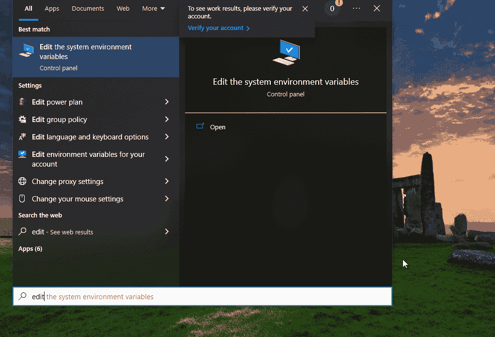

# 让我们来看看“混乱的数据科学家的 PATH 变量：如何管理它”

> 原文：[`towardsdatascience.com/the-path-variable-for-the-confused-data-scientist-how-to-manage-it-b469bfb45785`](https://towardsdatascience.com/the-path-variable-for-the-confused-data-scientist-how-to-manage-it-b469bfb45785)

## 了解 PATH 是什么，以及如何在 Windows 和类 Unix 系统中添加路径

[](https://ibexorigin.medium.com/?source=post_page-----b469bfb45785--------------------------------)[](https://towardsdatascience.com/?source=post_page-----b469bfb45785--------------------------------) [Bex T.](https://ibexorigin.medium.com/?source=post_page-----b469bfb45785--------------------------------)

·发表于 [Towards Data Science](https://towardsdatascience.com/?source=post_page-----b469bfb45785--------------------------------) ·6 分钟阅读·2023 年 6 月 26 日

--


图片由我使用 Midjourney 制作

有时我觉得 StackOverflow 上的人好像头顶上装了指南针。他们总是能找到 PATH。

我认为它不在你的 PATH 中。

你可能搞乱了你的 PATH。

你是否将它添加到你的 PATH 中？

检查可执行文件是否在你的 PATH 中。

“我的意思是，PATH *到底是什么*？”每当我阅读这样的句子时，我总是会这么说，脸红着试图修复错误。现在，我在数据科学的旅程中已经三年多了，我完全知道它是什么了。差不多。

在这篇文章中，我打算教你如何在 Windows 和类 Unix 系统中管理这个令人困惑的环境变量。

开始吧！

## 命令也有路径

你使用最多的终端命令是什么？毫无疑问，我的是 `git`，因为我在写文章时经常进行提交。

我问这个问题的原因是，因为大多数终端命令在操作系统中也有自己的路径。要找到那个路径，你只需要运行 `which valid_command_name`。例如，这是我 `git` 实例的路径：

```py
$ which git  # In windows, use `where`

/usr/bin/git
```

你可能会认识到上面的是一个绝对路径。但它到底指向什么呢？

一个可执行的二进制文件！（如果你使用的是 Windows，你会得到一个 `.exe` 文件路径）

它包含了当 `git` 命令被执行时应该做什么的说明。所有终端命令都是以某种形式的 shell 脚本或可执行文件，执行特定的任务。

例如，你可以对内置终端命令如 `clear`、`cat` 或 `touch` 使用 `which` 命令，你会得到绝对路径（甚至是 `which` 命令本身的路径）。

一旦你得到可执行文件的路径，你可以尝试用其完整路径运行命令，如下所示：

```py
$ /usr/bin/git status -s  # the same as `git status -s`

M 2023/6_june/7_path/dump.ipynb
```

并且它确实有效！但有趣的是——如何使得词语 `git` 相当于绝对路径 `/usr/bin/git`？我意思是，`git` 只是一个词。

你的计算机如何知道如此多命令的完整可执行路径，并且仅用一个关键词就能运行它们？

（这是 Eureka 时刻！）

使用 PATH 变量！

## 看啊——PATH！

PATH 是一个变量，保存了执行几乎所有终端命令的绝对路径，无论是内置命令还是用户安装的命令。

当你输入任何命令，如 `conda env create` 时，操作系统会在你的 PATH 变量中寻找一个名为 `conda` 的可执行文件。如果找不到可执行文件，它会返回一个 `command not found` 错误：

```py
$ unknown_command
unknown_command: command not found
```

你可以用一个命令打印出 PATH 中的所有路径。

在类 Unix 系统中：

```py
$ echo $PATH

/home/bexgboost/.local/bin:/home/bexgboost/anaconda3/bin:...
```

在 Windows 中：

```py
$ ECHO %PATH%

C:\Python39\Scripts\;C:\Python39\;C:\WINDOWS\system32;...
```

在 Unix 中，PATH 中的每个路径由冒号分隔，而在 Windows 中由分号分隔。

正是这些路径使得你不需要记住系统中安装的可执行文件的数十个绝对路径。

## 在 Windows 中处理 PATH

编辑 PATH 变量在类 Unix 系统和固执的 Windows 中有所不同。本节内容讲述在 Windows 中如何管理你的 PATH 变量。

你最常进行的 PATH 操作是添加新路径。例如，要将 `C:\Users\user\Desktop\articles` 目录添加到 PATH，你应以管理员权限打开命令提示符或 Powershell。然后，运行以下命令：

```py
$ setx PATH "%PATH%;C:\Users\user\Desktop\articles"
```

但，别急——如果不小心，`setx` 命令可能会对你的 PATH 造成很大伤害。因此，在 Windows 中，安全的方法是通过系统属性窗口添加路径。

这里是一步一步的指示和一个 GIF，用于将新路径添加到 PATH：

1.  点击开始按钮，搜索“**编辑系统环境变量**”，然后点击第一个结果。

1.  从弹出窗口中点击“**环境变量**”。

1.  决定新路径是添加到当前用户还是整个系统。

1.  在“**用户变量 for your_username**”或“**系统变量**”下，向下滚动，直到找到“**Path**”变量。

1.  选择它并点击 **编辑**。

1.  在新的弹出窗口中，点击“**新建**”并粘贴新路径，例如 `C:\Users\user\Desktop\articles`

1.  点击确定三次。



GIF 由我制作。

在最后一个弹出窗口中，你也可以删除或更改路径的顺序（见最后一节关于顺序的重要性）。

## 在 Unix 中处理 PATH

在类 Unix 系统中，添加新的路径到 PATH 要容易得多。

例如，要添加 `/home/bexgboost/articles` 路径，你需要运行以下命令：

```py
$ export PATH="/home/bexgboost/articles:$PATH"
```

新路径将被添加到 PATH 的最前面。要将其添加到末尾，你需要改变 `$PATH` 的位置：

```py
$ export PATH="$PATH:/home/bexgboost/articles"
```

但新路径只会在当前终端会话期间有效。要永久添加到你的 PATH 环境变量中，你需要将 `export` 命令追加到你的 shell 配置文件中。

具体的配置文件取决于你使用的 shell：

+   对于 Bash：将`export`命令添加到`~/.bashrc`或`~/.bash_profile`中（你也可以考虑`.profile`，有关区别请参见[这里](https://serverfault.com/questions/261802/what-are-the-functional-differences-between-profile-bash-profile-and-bashrc)）。

+   对于 Zsh：将`export`命令添加到`~/.zshrc`中。

+   对于 Fish：将`export`命令添加到`~/.config/fish/config.fish`中。

一旦你从列表中选择了自己的文件（我会选择`.bash_profile`），使用以下`echo`命令：

```py
$ echo 'export PATH="$PATH:/home/bexgboost/articles"' >> ~/.bash_profile
```

然后，通过`source ~/.bash_profile`重新加载配置文件，操作完成。

## 路径的顺序

PATH 变量中的路径顺序决定了执行命令或程序时目录被搜索的优先级。

当你在终端中输入一个命令时，操作系统会从左到右依次检查 PATH 中的每一个路径来查找其可执行文件。如果多个目录中包含相同名称的可执行文件，则会使用第一个。

例如，如果你的系统中有多个 Python 版本，则当你在终端中运行`python`时，会使用 PATH 中最左边的 Python 可执行文件。

## 结论

在数据科学和机器学习的世界里，终端常常被忽视。相反，在线课程和训练营将初学者的注意力吸引到像 VSCode 或 JupyterLab 这样更闪亮的 IDE 上。

但总有一天，不可避免地，他们必须在自己的机器上打开生锈的 shell。这时，他们会在 PATH 中遇到一个巨大的障碍。

我希望这篇文章能帮助你击碎那些障碍。

感谢阅读！

喜欢这篇文章，并且，直白点说，它那古怪的写作风格？想象一下访问更多类似的文章，全部由一位才华横溢、迷人、机智的作者（顺便说一下，就是我 :)。

仅需 4.99 美元的会员费，你不仅可以访问我的故事，还可以获取来自 Medium 上最优秀的思想者的知识宝库。如果你使用[我的推荐链接](https://ibexorigin.medium.com/membership)，你将获得我超级 nova 般的感激和对支持我工作的虚拟击掌。

[](https://ibexorigin.medium.com/membership?source=post_page-----b469bfb45785--------------------------------) [## 使用我的推荐链接加入 Medium - Bex T.

### 作为 Medium 会员，你的会员费的一部分会分给你阅读的作者，你可以完全访问每一个故事……

ibexorigin.medium.com](https://ibexorigin.medium.com/membership?source=post_page-----b469bfb45785--------------------------------)
