# 平滑你的噪声数据的完美方法

> 原文：[`towardsdatascience.com/the-perfect-way-to-smooth-your-noisy-data-4f3fe6b44440?source=collection_archive---------0-----------------------#2023-10-25`](https://towardsdatascience.com/the-perfect-way-to-smooth-your-noisy-data-4f3fe6b44440?source=collection_archive---------0-----------------------#2023-10-25)

## 使用 Whittaker-Eilers 方法进行极快且可靠的平滑和插值。

[](https://medium.com/@anbowell?source=post_page-----4f3fe6b44440--------------------------------)[](https://towardsdatascience.com/?source=post_page-----4f3fe6b44440--------------------------------) [Andrew Bowell](https://medium.com/@anbowell?source=post_page-----4f3fe6b44440--------------------------------)

·

[关注](https://medium.com/m/signin?actionUrl=https%3A%2F%2Fmedium.com%2F_%2Fsubscribe%2Fuser%2F6096004462d1&operation=register&redirect=https%3A%2F%2Ftowardsdatascience.com%2Fthe-perfect-way-to-smooth-your-noisy-data-4f3fe6b44440&user=Andrew+Bowell&userId=6096004462d1&source=post_page-6096004462d1----4f3fe6b44440---------------------post_header-----------) 发表在 [Towards Data Science](https://towardsdatascience.com/?source=post_page-----4f3fe6b44440--------------------------------) · 13 min read · 2023 年 10 月 25 日[](https://medium.com/m/signin?actionUrl=https%3A%2F%2Fmedium.com%2F_%2Fvote%2Ftowards-data-science%2F4f3fe6b44440&operation=register&redirect=https%3A%2F%2Ftowardsdatascience.com%2Fthe-perfect-way-to-smooth-your-noisy-data-4f3fe6b44440&user=Andrew+Bowell&userId=6096004462d1&source=-----4f3fe6b44440---------------------clap_footer-----------)

--

[](https://medium.com/m/signin?actionUrl=https%3A%2F%2Fmedium.com%2F_%2Fbookmark%2Fp%2F4f3fe6b44440&operation=register&redirect=https%3A%2F%2Ftowardsdatascience.com%2Fthe-perfect-way-to-smooth-your-noisy-data-4f3fe6b44440&source=-----4f3fe6b44440---------------------bookmark_footer-----------)

现实世界的数据从来不会干净。无论你是在进行调查、测量降雨量还是接收来自太空的 GPS 信号，噪声数据总是存在。处理这些数据是数据科学家的主要工作内容。它并非全是光鲜的机器学习模型和人工智能——而是清理数据，以便尽可能提取有意义的信息。如果你当前看到的图表上有太多的曲折线而无法使用，那么，我有你需要的解决方案。

# **Whittaker-Eilers 平滑法**

Whittaker-Eilers 平滑器 [1] 是我在从事地球观测工作时接触到的。对数千张高分辨率卫星图像进行像素级分析需要极其快速的算法来清理数据。某一天可能会有云层覆盖，一些像素可能被烟雾遮挡，或者传感器可能会出现伪影。列举的情况可以一直延续下去。你得到的是数 TB 的相当嘈杂、存在空缺的时间序列数据，需要进行平滑和插值——这正是 Whittaker 平滑器的强项。

## 平滑

让我们从一个图表开始，展示 1880 到 2022 年的 [全球温度异常](https://climate.nasa.gov/vital-signs/global-temperature/) [2]。橙色表示测量数据，绿色表示使用 Whittaker-Eilers 方法平滑的数据。

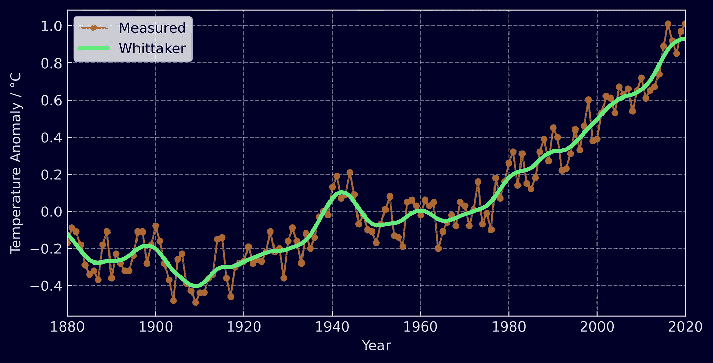

图 1) Whittaker-Eilers 平滑的全球温度异常

如你所见，原始的时间序列数据相当嘈杂。我们想提取的结论并不是关于逐年的波动，而是过去一个世纪的数据总体趋势。平滑数据提供了一种直接的方法来突出趋势，更好的是，它只需要 4 行代码就能运行。

```py
from whittaker_eilers import WhittakerSmoother

temp_anom = [-0.17, -0.09, -0.11, -0.18] # and so on...

whittaker_smoother = WhittakerSmoother(
    lmbda=20, order=2, data_length=len(temp_anom)
)

smoothed_temp_anom = whittaker_smoother.smooth(temp_anom)
```

如果你不喜欢 Python，这也只需要 4 行 Rust 代码。

```py
use whittaker_eilers::WhittakerSmoother;

temp_anom = vec![-0.17, -0.09, -0.11, -0.18] // and so on...

let whittaker_smoother = 
            WhittakerSmoother::new(20, 2, temp_anom.len(), None, None)
            .unwrap();

let smoothed_data = whittaker_smoother.smooth(&temp_anom).unwrap();
```

*免责声明，这个包是我编写的 — Python:* `[*pip install whittaker-eilers*](https://pypi.org/project/whittaker-eilers/)` *或 Rust:* `[*cargo add whittaker-eilers*](https://crates.io/crates/whittaker-eilers)`

## 插值

现在让我们在数据中引入一些空缺。与其每年均匀收集数据，不如减少为每隔一年一次，并增加几个较长的空缺。

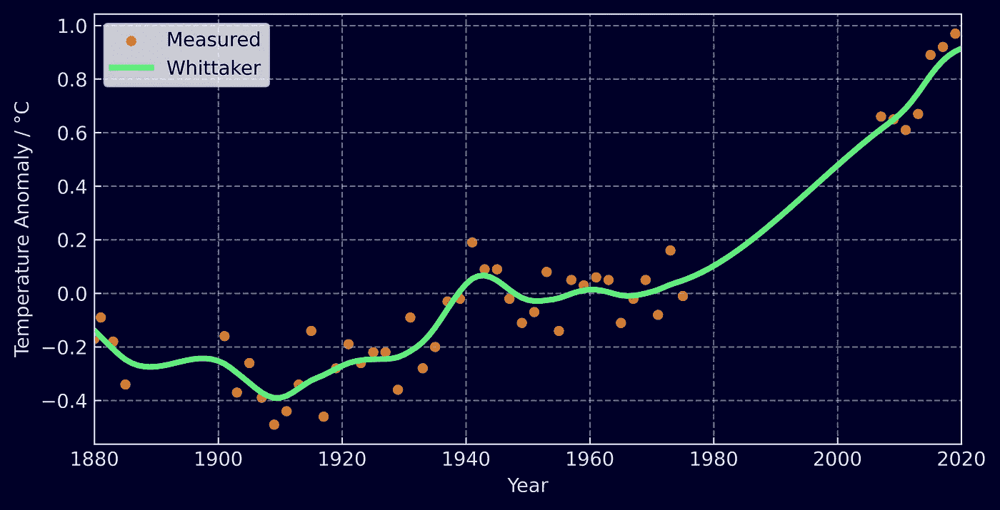

图 2) Whittaker-Eilers 平滑并插值的全球温度异常

Whittaker 方法处理起来非常轻松。你只需要给每个测量值分配一个权重。在插值时，存在的测量值权重为 1，而你希望获取值的测量用一个虚拟值，比如 -999，权重为 0。Whittaker 方法会处理剩下的部分。它也可以用来根据测量的不确定性进行相应的加权，而且只需几行 Python 代码即可完成。

```py
from whittaker_eilers import Whittaker

temp_anom = [-0.17, -0.09, -0.11, -0.18, -0.3] # and so on...
weights = [1.0, 0.0, 1.0, 0.0, 1.0]

whittaker_smoother = WhittakerSmoother(
    lmbda=150, order=2, data_length=len(temp_anom), weights=weights
)

smoothed_temp_anom = whittaker_smoother.smooth(temp_anom)
```

除了数据中的空缺，Whittaker 平滑器还可以轻松处理不均匀间隔的测量。如果你不在意插值，只需提供一个包含测量时间或地点的 `x_input`，例如 `[1880, 1885, 1886, 1900]`，就可以获得平滑后的值。

## 配置

通过一个单一的参数 λ（lambda），你可以持续控制数据的平滑度。lambda 越大，数据越平滑。

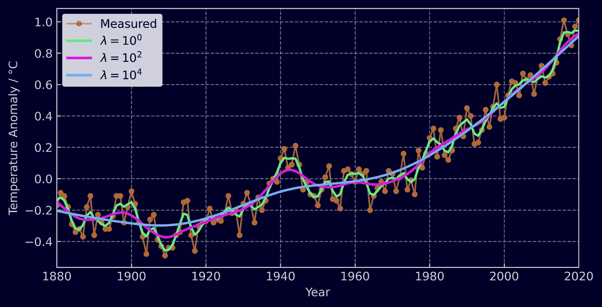

图 3) Whittaker-Eilers 平滑数据，λ 值不同

平滑器的阶数 **d** 也是可以控制的。阶数越高，Whittaker 在计算时间序列的平滑程度时会考虑更多的邻近元素。核心要点是，插值数据将是阶数为 2**d** 的多项式，而外推数据将是阶数为 **d** 的多项式；不过，我们稍后会详细探讨这些数学原理。

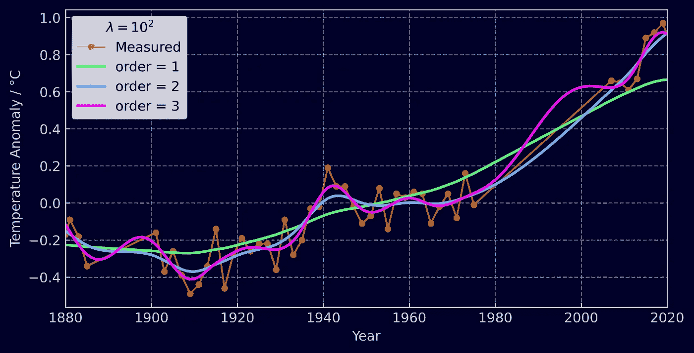

图 4）Whittaker-Eilers 平滑数据的多阶次

# 与其他方法的比较

为了展示 Whittaker-Eilers 方法的优越性，让我们将其与几种不同的技术进行比较：

+   高斯核平滑（也称为 RBF 核）

+   Savitzky-Golay 滤波器

+   局部回归 (LOWESS)

第一个是核平滑器，本质上是一种对邻近点进行加权平均的复杂方法。第二种是 Savitzky-Golay 滤波器，它与 Eilers 在 2003 年的原始论文相对立，并且使用非常广泛。它通过对[相邻数据子集进行多项式的最小二乘拟合](https://en.wikipedia.org/wiki/Savitzky%E2%80%93Golay_filter#/media/File:Lissage_sg3_anim.gif)来平滑数据。最后，局部回归是 NASA 选择的[平滑温度异常](https://climate.nasa.gov/vital-signs/global-temperature/)数据的方法。这种方法在连续的数据子集上执行迭代加权线性拟合，并根据残差重新加权点。

我选择不包括任何实时平滑的方法，因为这些方法在仅评估过去数据时会必然引入信号延迟。如果你对这种方法感兴趣，务必查看移动平均、指数平滑和卡尔曼滤波器。

## 平滑

那么让我们再看看温度异常时间序列，这一次使用额外的方法进行平滑。

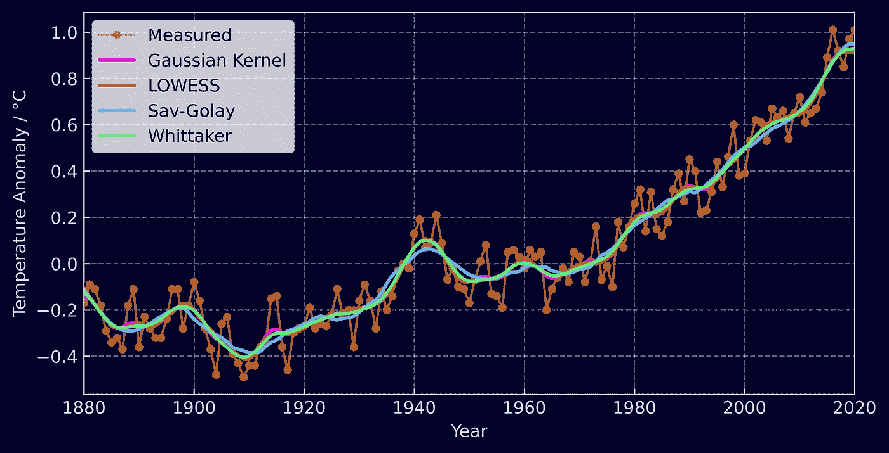

图 5）不同平滑技术的比较

如你所见，变化不大——至少在你调节好参数后如此。让我们尝试一个例子，既可以揭示一些差异，也可以进行性能基准测试。我们将生成 4 个基本的正弦波，范围在 0 到 2**π** 之间，并添加一些高斯噪声。每个信号的样本大小将增加，从 40 开始，直到 10,000 结束。对于 Savitzky-Golay、高斯核和 LOWESS 方法来说，已经提出了挑战。它们期望一个窗口长度——每个连续子集中应包含的数据长度，以便进行拟合/平均。如果你在相同的时间段内增加测量数量，你需要确保你的窗口长度随着整体数据长度的变化而变化，以获得每个数据集的最佳平滑效果。下面，每种方法大致考虑了整体数据的十分之一作为每个窗口。

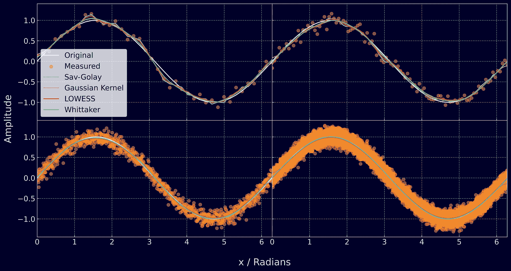

图 6) 不同测量采样频率下平滑的正弦波

然而，Whittaker 不需要如此动态的参数调整。你只需提供测量位置 x，设置一次λ，它就会每次都给出平滑的数据。这种测量位置的知识使其能够处理不等间距的数据。LOWESS 也可以在这种数据上运行，但另外两种方法要求数据间隔相等。总体而言，我发现 Whittaker 最易于使用。

Whittaker 平滑器的另一个好处是其对边界条件的适应性。在数据边缘，Savitzky-Golay 滤波器的行为会发生变化，因为它不能在没有填充或镜像数据的情况下拟合超出数据集末尾的多项式。另一种选择是让它拟合最终窗口中的多项式并使用这些结果。高斯核平滑器的情况更糟，因为没有未来的测量值进入平均值，它开始表现出来自以前值的大偏差，这在下面的图表中可以清楚地看到。

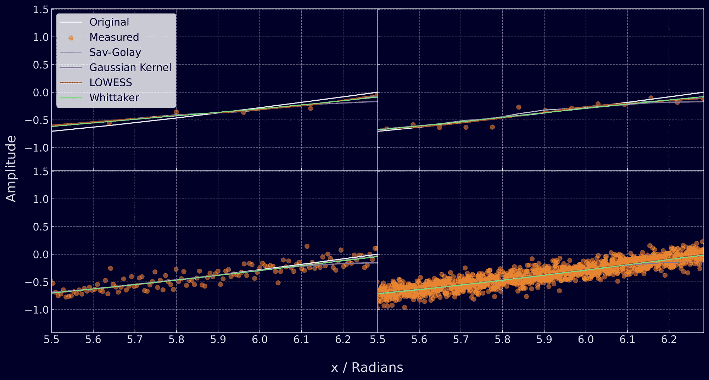

图 7) 不同测量采样频率下平滑正弦波的边界

## 插值

Whittaker 的一个关键特性是其内建的数据插值能力。但与其他方法相比，它的效果如何呢？这个问题并不那么明确。Savitzky-Golay 平滑可以进行插值，但仅限于数据间隙小于其窗口大小的情况，LOWESS 平滑也是如此。高斯核平滑根本没有插值的能力。解决此问题的传统方法是先对数据应用线性插值，然后再进行平滑。因此，我们将这种方法应用于其他三种技术，并将结果与 Whittaker 进行比较。

每种方法将与其自身的平滑基线进行比较，该基线取自本节开始时的图（图 5）。我删除了每个其他点并引入了两个大的间隙，创建了一个与文章开始处插值示例（图 2）中的数据集完全相同的数据集。基线和插值运行的参数保持不变。

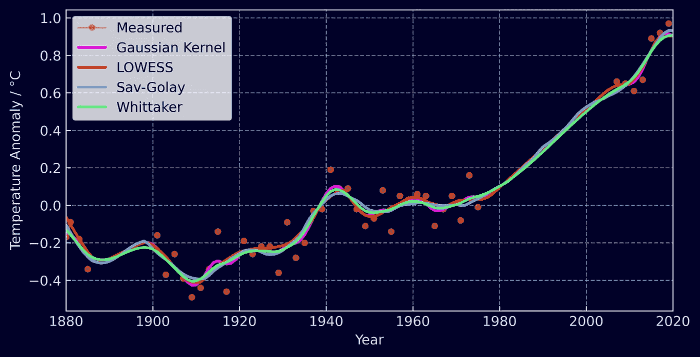

图 8) 线性插值联合使用技术的比较

通过线性插值填补空白后，各方法的表现总体较好。通过计算[均方根误差（RSME）](https://en.wikipedia.org/wiki/Root-mean-square_deviation)来比较平滑后的数据（没有间隙）和有间隙的平滑数据，我们得到了以下结果。

+   线性插值 + Savitzky-Golay: **0.0245 °C**

+   Whittaker : **0.0271 °C**

+   线性插值 + 高斯核: **0.0275 °C**

+   线性插值 + LOWESS: **0.0299 °C**

线性插值结合 Savitzky-Golay 方法最接近原始平滑数据，其次是 Whittaker，两者之间差别不大！

> 我想简单提一下，我以这种方式执行了插值基准测试，对比了各自平滑的基线，以避免调整参数。我本可以使用添加噪声的正弦波，删除一些数据并尝试将其平滑回原始信号，但这会让我头疼于为每种方法找到最佳参数。

## 基准测试

让我们重新审视正弦波数据，以生成这些方法的速度基准。我选择了每种方法中最流行的 Python 实现。Savitzky-Golay 和高斯核滤波器使用`SciPy`实现，LOWESS 使用`statsmodels`实现，Whittaker 使用我基于 Rust 的 Python 包实现。下图显示了每种方法平滑正弦波所需的时间以及数据长度的变化。报告的时间是平滑每个数据集 50 次所需的总时间。

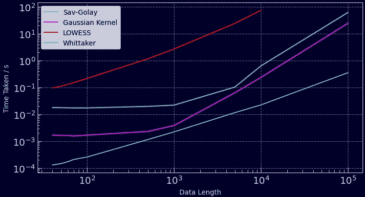

图 9) 平滑不同长度的时间序列所需时间 50 次

迄今为止最快的方法是 Whittaker。它可以在不到一秒的时间内平滑 50 个每个长度为 100,000 数据点的时间序列，比高斯滤波器快 10 倍，比 Savitzky-Golay 滤波器快 100 倍。最慢的是 LOWESS，尽管它被配置为不迭代地重新加权每个线性回归（这是一个昂贵的操作）。值得注意的是，通过调整窗口长度可以加快这些方法的速度，但这会牺牲数据的平滑度。这是 Whittaker 的一个非常好的特点——它的计算时间随着数据长度线性增加（O(n)），而且你无需担心窗口大小。此外，如果你的数据中有间隙，你将以无速度损失的方式进行插值，而其他方法则需要某种形式的预处理！

# 数学原理

现在我们已经覆盖了主要内容，让我们深入探讨 Whittaker-Eilers 平滑器背后的数学，并了解它为何对噪声数据是如此优雅的解决方案 [2] [3]。

想象一下你的噪声数据**y**。存在一些序列**z**，你认为它具有对你的**y**的最佳平滑度。**z**变得越平滑，它与原始数据**y**之间的残差越大。Whittaker-Eilers 方法在这些残差和数据的平滑度之间找到最佳平衡。残差计算为标准的平方差之和，

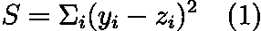

数据平滑度的度量可以使用相邻测量值之间的平方差之和来计算，

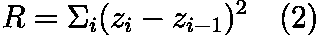

**S** 和 **R** 是我们需要平衡的两个属性。但我们还希望让用户控制合适的平衡点，我们通过引入**λ**来调整平滑度。

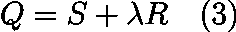

现在我们的目标变成了找到能最小化 **Q** 的序列 **z**，因为这是平滑度度量和残差都达到最小的地方。让我们展开方程 3 并尝试解出 **z**。

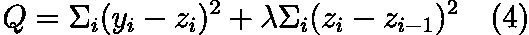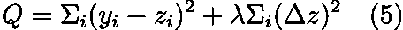

此时，理想的做法是用向量替换我们的求和，

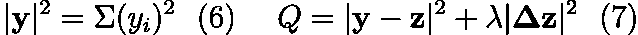

然后我们可以使用一个巧妙的技巧，将 **Δz** 表示为矩阵和向量，

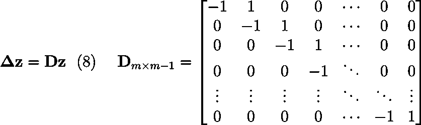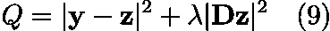

其中 m 是数据的长度。如果你将矩阵 **D** 与一个向量进行比较，你会发现它给出了相邻元素之间的差异——这正是我们想要的。现在我们面临一个[最小二乘问题](https://en.wikipedia.org/wiki/Least_squares#Solving_the_least_squares_problem)。为了找到 **Q** 的最小值，我们将其梯度设为 0，

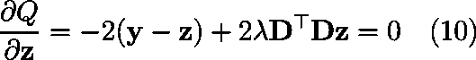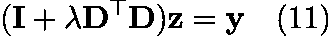

其中 **I** 是单位矩阵（来自分解 z，一个向量）。我们知道 **I**、**D**、**λ** 和 **y**，所以我们剩下一个简单的线性方程，

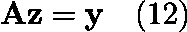

这可以通过你喜欢的任何矩阵分解方法来解决，从而获得平滑的数据系列 **z**。

## 插值

上述解决方案仅适用于数据均匀分布且所有测量值都可用的情况。如果需要插值怎么办？你需要为每个测量值应用权重。

就像重新审视方程 1 并为每个残差应用权重，并将其表示为对角矩阵一样简单，

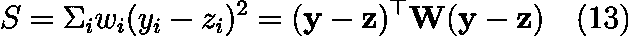

然后进行与之前相同的计算，

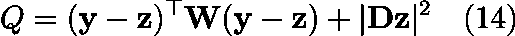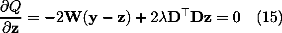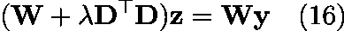

再次，这可以通过简单的矩阵分解来解决，返回平滑和插值的数据。所有需要做的事是在需要插值的地方将 **y** 填充为虚拟值，例如 -999，并将这些测量的权重设置为 0，然后观察奇迹发生。数据如何插值取决于滤波器的阶数。

## 滤波器阶数

Whittaker-Eilers 平滑器的阶数是在配置部分提到的内容。现在我们有了描述平滑器的数学框架，它可能更有意义。在创建 **R**（我们的平滑度度量）时，我们首先选择了“一级”差异。我们可以相当容易地计算二阶差异，这样不仅根据相邻数据点对平滑器进行惩罚，还可以根据一阶差异的变化来惩罚它，就像计算导数一样。

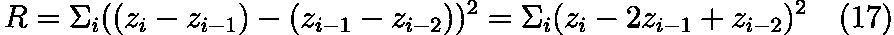

这可以扩展到三阶、四阶、五阶差分，等等。通常表示为**d**，实现起来并不太复杂，因为唯一改变的是矩阵**D**，如下所示：

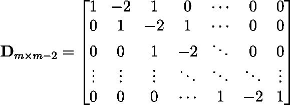

使其在与**z**相乘时展开为方程 17。可以实现一个简单的函数来生成这个矩阵，给定一个通用的**d**。

## 稀疏矩阵

这可以并且已经按照 Eilers 的建议使用稀疏矩阵来实现。矩阵**I**和**D**非常稀疏，如果以稀疏矩阵的形式存储，将极大地节省内存和计算资源。上述所有数学计算都可以通过稀疏矩阵包轻松处理，包括 Cholesky 分解（及其他）。如果不使用稀疏矩阵实现，这个算法在处理较长时间序列时可能会非常缓慢，比我比较的其他方法慢得多。

# 总结与进一步阅读

这是一个了不起的算法，我简直不敢相信它没有被更广泛地应用。加权平滑和插值被封装成快速、高效的矩阵运算。有什么不好的吗？

我在[whittaker-eilers](https://github.com/AnBowell/whittaker-eilers/tree/main/whittaker-eilers-py/examples)包的 repo 中包含了我用于进行基准测试和插值测试的 Python 脚本。还有许多示例展示了如何在 Python 或 Rust 中入门，以及与 Eilers 原始 MATLAB 算法的测试[1]。但如果你不在意那么详细的信息，

Python: `[*pip install whittaker-eilers*](https://pypi.org/project/whittaker-eilers/)` *或 Rust:* `[*cargo add whittaker-eilers*](https://crates.io/crates/whittaker-eilers)`

尽管这是一篇长文章，我仍然没有涵盖所有内容。Eilers 2003 年的论文还涉及了平滑不均匀间隔数据的数学原理以及如何使用交叉验证来找到最佳λ。如果你想深入了解算法背后的数学，我推荐查看这篇论文。我还建议阅读 Sophocles J. Orfanidis 的《应用最优信号处理》，它提供了关于所有信号处理内容的深入数学指南。感谢阅读！请务必查看我的[个人网站](https://www.anbowell.com/blog_home)上的这篇文章和其他文章。

*我之后写了一篇跟进文章，解释了如何最佳地调整 Whittaker！*

[](/how-to-tune-the-perfect-smoother-bcc5a67660b1?source=post_page-----4f3fe6b44440--------------------------------) ## 如何调整完美平滑器

### 利用 Whittaker-Eilers 平滑和留一交叉验证最大化数据价值

[towardsdatascience.com

*本文中的所有图像均由作者制作。*

## 参考文献

[1] Paul H. C. Eilers, *完美平滑器*, Analytical Chemistry **2003** *75* (14), 3631-3636, DOI: 10.1021/ac034173t

[2] NASA/GISS，《*全球温度*》，NASA 戈达德太空研究所（GISS）。网址：[`climate.nasa.gov/vital-signs/global-temperature/`](https://climate.nasa.gov/vital-signs/global-temperature/)

[3] 索福克勒斯·J·奥尔法尼迪，《*应用最优信号处理*》，罗格斯大学，网址：[`www.ece.rutgers.edu/~orfanidi/aosp`](http://www.ece.rutgers.edu/~orfanidi/aosp)
