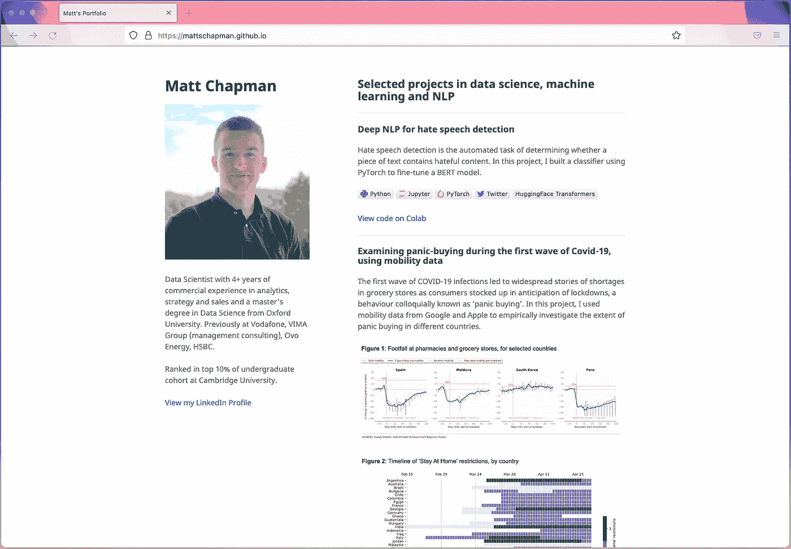
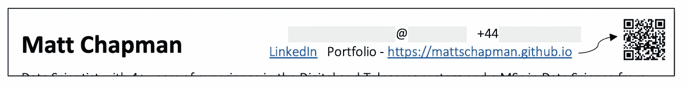
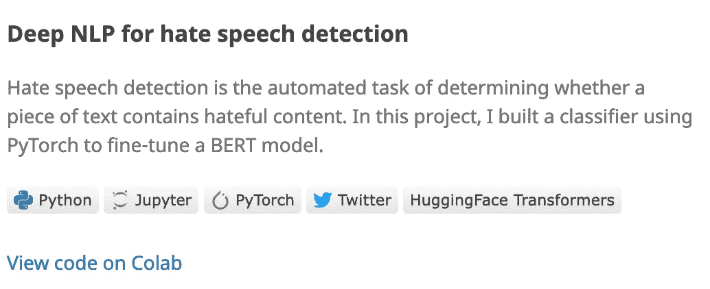
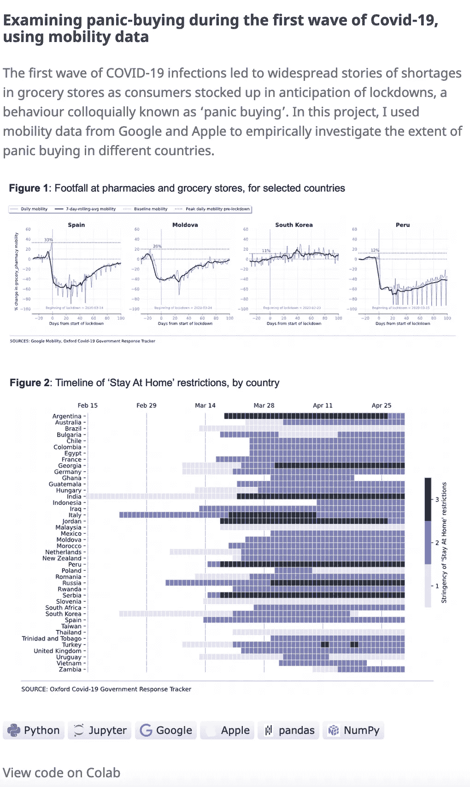
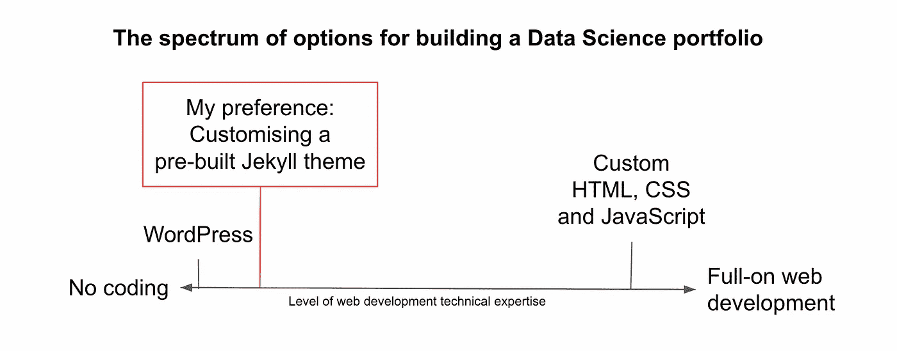
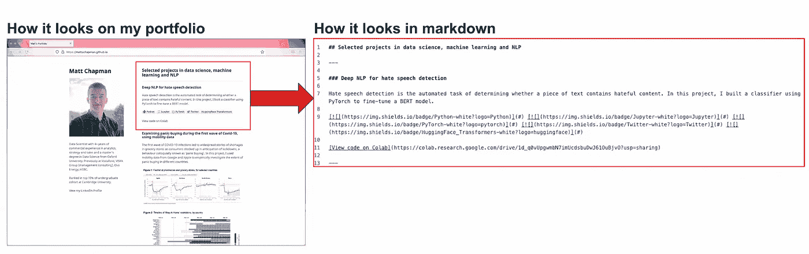

# 使我获得数据科学家职位的作品集

> 原文：[`towardsdatascience.com/the-portfolio-that-got-me-a-data-scientist-job-513cc821bfe4`](https://towardsdatascience.com/the-portfolio-that-got-me-a-data-scientist-job-513cc821bfe4)

## 剧透：制作作品集意外地简单（而且免费）

 [Matt Chapman](https://medium.com/@mattchapmanmsc?source=post_page-----513cc821bfe4--------------------------------)

·发表于[Towards Data Science](https://towardsdatascience.com/?source=post_page-----513cc821bfe4--------------------------------) ·10 分钟阅读·2023 年 3 月 24 日

--

照片由[John Schnobrich](https://unsplash.com/@johnschno)拍摄，发布在[Unsplash](https://unsplash.com/photos/FlPc9_VocJ4)

获得数据科学家职位很难。

现在已经不是 2015 年了：仅仅知道几个 pandas 函数并在简历上写上“Big Data”已经不够了。顶级职位的竞争非常激烈。在最近浏览 LinkedIn 职位板时，我发现很难找到申请人数少于 100 人的伦敦数据科学家职位。

好消息是，这种竞争并不是因为工作岗位不足。即使在 2023 年，数据科学仍然是一个快速增长的领域，美国劳工统计局估计数据科学家职位的数量将在 2021 年至 2031 年间增长 36%[1]。

因此，挑战不在于数据科学工作岗位的缺乏——实际上有很多！而在于大量的人试图进入这个行业，使得在众多候选人中脱颖而出并获得那个丰厚的首个职位变得越来越困难。

# 解决方案：建立数据科学作品集

在当前的就业市场中，我相信，区别于竞争对手的最佳方法之一就是通过建立个人数据科学项目的作品集来展示你的技能和经验。如果你没有大量的数据科学工作经验，这一点尤其重要。借用数据科学家 Will Stanton 的话[2]：

> 如果你没有数据科学家的经验，那么你绝对*必须*做独立项目。

在这篇文章中，我将带你了解我创建个人项目作品集的过程，并尝试为你提供一些灵感，帮助你自己创建一个作品集。

如果创建作品集的想法让你感到有些畏惧，不用担心：建立一个作品集其实出乎意料的简单（而且免费的），而且你不需要任何网页开发知识就能开始。

# **我的背景（也就是我创建我的作品集的原因）**

我的数据科学之旅相对较晚才开始。我刚从学校/大学毕业时的第一份工作是在项目管理、销售和市场营销等领域。当我决定在 2020 年转向数据科学时，我几乎没有实际操作数据的经验，也没有计算机科学或统计学等领域的技术本科学位。

哇，这不是一个很强的起点。

在[我之前的文章](https://medium.com/@mattchapmanmsc/career-change-into-data-science-in-2023-was-it-worth-it-9e0c47b3b416)中，我分享了我如何通过参加一系列在线课程、攻读数据科学硕士学位和做几次数据科学实习来解决这个问题。在此过程中，我参与了许多不同的项目，并建立了广泛的数据相关技能。

然而，对于我申请的前几份工作，我发现我很难获得面试机会：感觉招聘人员甚至没有仔细查看我的申请，**尽管我符合所有最低要求**。那时，这非常令人沮丧。我相信我有很多可以提供的，但似乎对话还没开始就被中断了。

更糟糕的是，我了解到招聘人员通常会在过度申请的职位发布上花费仅 6 到 8 秒来查看简历[3]。这让我相信我需要一种更快的方式来传达我的技能并脱颖而出，特别是考虑到我作为数据科学家的经验并不丰富。

为了解决这个问题，我决定创建一个在线作品集，以一种视觉上引人注目且易于消化的格式展示我的经验。

我的数据科学作品集：[`mattschapman.github.io/`](https://mattschapman.github.io/)。图片来源：作者自制。

然后，一旦我建立了我的作品集，我在简历的顶部包含了一个链接，以便招聘人员可以轻松找到：

我的简历/履历的标题。我喜欢有一个可以点击的链接或二维码，直接带雇主到我的作品集，这样可以帮助我从人群中脱颖而出。图片来源：作者自制。

# 我是如何创建我的作品集的

在创建我的作品集时，我遵循了一些基本原则：

1.  包括一些真正独特且有趣的项目

1.  保持简短和简单

1.  让它变得美观

1.  不要在“网页开发”方面浪费时间

在本文的其余部分，我将简要讨论每一项原则，并解释它们如何帮助我创建一个成功的作品集。

## 包括一些真正独特且有趣的项目

这可能听起来显而易见，但这是一个如此重要的点，以至于值得重复：

*不要包含别人也在包含的内容。*

如果你作品集的全部目的就是区分自己，那为什么还要包括那些已经被别人做得死去活来的通用项目呢？这是 Jeremie Harris 在 数据科学家不被聘用的 4 种最快方式 [4] 中提到的一个观点，他说：

> 很难想到比在突出个人项目中展示你在琐碎的概念验证数据集上的工作更快地将你的简历扔进‘绝对不考虑’堆的方法。
> 
> 如果有疑问，以下这些项目会让你受害多于受益：
> 
> * 使用 [Titanic 数据集](https://www.kaggle.com/c/titanic) 进行生存分类。
> 
> * 使用 [MNIST 数据集](https://www.tensorflow.org/versions/r1.2/get_started/mnist/pros) 进行手写数字分类。
> 
> * 使用 [iris 数据集](https://archive.ics.uci.edu/ml/datasets/iris) 进行花卉物种分类。

这意味着，如果你对计算机视觉非常感兴趣，就包括几个相关的项目。或者，如果你对时间序列问题情有独钟，就加上一些相关主题的项目。说实话，无论你对贝叶斯优化还是编织篮子感兴趣，关键是确保它是你真正感兴趣并认为能给别人带来价值的东西。就我个人而言，我非常关注自然语言处理和社会科学相关的问题，因此我尝试包括了这些领域的项目。但说实话，只要你能令人信服地展示*为什么*它们能带来价值，内容的具体细节其实并不是那么重要。

## 保持简洁明了

没有人愿意在无聊或冗长的网页上花时间，这在在线作品集中尤为真实。你提供的是一个快照，而不是写一篇博士论文。我诚心认为，如果你花太多时间编写冗长的项目描述和结果部分，你会浪费时间。

要理解这一点，我们必须回到作品集的初衷，其核心是一个简单的想法：

*作品集的目的是为了让你有机会进入面试，而不是直接获得工作。*

换句话说，你绝不会仅凭作品集就收到工作邀请。现实是，即使招聘人员喜欢你作品集的外观，你仍然需要通过他们的面试和评估。作品集的目的是提供你技能的快速快照，展示你能做什么。

在我的作品集中，例如，我提到了我之前参与的七个项目。在这七个项目中，六个项目的描述都不超过两句简短的话。

是的，你没看错：**两**句话。

这是我作品集中一个项目描述的例子：

我作品集中的一个示例项目。图片来源：作者自有。

如你所见，我没有浪费时间设置背景和解释结果的细微差别。当然，这些内容非常重要。但是如果潜在的雇主感兴趣，他们会在面试中询问你。在这个阶段，你只需要一个简短的描述，能够引起他们的兴趣并促使进一步讨论。如果你愿意，你甚至可以包括一个指向更多描述的链接；这也是我通过在项目描述下方包含代码链接所做的。但在你作品集的主页上，你只需要提供高层次的细节。其他的都是浪费时间。

## 让它变得漂亮

我的下一个建议是使你的作品集具有视觉吸引力。

设身处地为一个潜在的招聘者考虑：你已经阅读了数百（甚至数千）份平淡无奇的简历，甚至都快忘记绿色是什么样子，因为已经很久没见过不是黑白的东西了。然后，突然出现一份简历/作品集——简直是开门见山——其实挺好看的。

你不需要是火箭科学家（甚至不需要是数据科学家）就能明白招聘者会喜欢看你的作品集。

要让你的作品集更漂亮，我的首要建议是包含大量有趣的图表/图形。例如，这里是我在作品集中包含的另一个项目的描述，其中包含了一些关于 Covid-19 限制和封锁期间人口流动的图表：

我作品集中的一个项目描述。图片来源：作者自有。

图表向潜在雇主展示了我知道如何以视觉方式传达想法并制作漂亮的图像。这可能看起来微不足道，但实际上并非如此：作为数据科学家，你会经常需要向非技术性利益相关者传达你的发现。通过在作品集中包含一些图表，你向读者展示了你认识到沟通的重要性，并具备将其付诸实践的技能。换句话说，这是展示你技能并在竞争激烈的领域中脱颖而出的绝佳方式。

## 不要在网页开发上浪费不必要的时间

我的最后一个建议是不要花太多时间实际“构建”包含你作品集的网站。记住：你申请的是数据科学家的职位，而不是网页开发人员。你的评价标准不会是 HTML 和 CSS 技能，而是你的数据科学技能。

因此，除非你在网页开发方面有丰富的经验，否则我建议选择低代码/无代码选项来构建你的网站，例如使用像[WordPress](https://wordpress.com/?aff=49606)或[Webflow](https://webflow.com/portfolio)这样的工具，它们允许你“拖放”作品集的各个部分，并从一系列预制模板中选择。

数据科学作品集的选项范围。图像来源：作者自制。

就我而言，我选择了一些不同的东西，并遵循了 [这篇](https://medium.com/@evanca/set-up-your-portfolio-website-in-less-than-10-minutes-with-github-pages-d0efa8ff56fd) 由 [Ivanna Kacewica](https://medium.com/@evanca) 撰写的优秀指南，她使用了 [Minimal Jekyll 主题](https://github.com/pages-themes/minimal) 来为 [GitHub Pages](https://pages.github.com/) 构建网站的基本框架 [5]。我选择这个选项的主要原因是 (a) 它是免费的，(b) 它不要求你在 URL 中包含广告或“wordpress”字样。

Ivanna 方法的一个额外好处是它允许你在 GitHub Pages 上免费托管你的作品集，地址为*username*.github.io，其中*username*是你在 GitHub 上的用户名（或组织名称）。由于你的 GitHub 用户名包含在 URL 中，别人很容易找到你的 GitHub 账户，这对于你在 GitHub 上存储的其他项目非常有用。

我不会详细介绍如何使用 Ivanna 的主题（因为她解释得非常好），但这种方法的基本理念是通过 Jekyll 和 markdown 添加文本和图像。如果你不熟悉 Jekyll，它是一个简单的构建网站的框架，不需要编程或 HTML/网页开发知识。

使用 Jekyll，你建立网站的基本结构，然后用 markdown 填充文本和图像。如果你以前没用过 markdown，不用担心——markdown 只是一个非常简单的文本格式化方式。当我说“简单”时，我是指*非常简单*：例如，要写标题，你只需在文本前面加上一个井号。要制作项目符号，你只需在文本前面加上一个星号。就是这么简单。

如何使用 markdown 添加内容。图像来源：作者自制。

如果你想查看我如何自定义主题的详细信息，可以查看我 GitHub 上的 `index.md` 文件 [repository](https://github.com/mattschapman/mattschapman.github.io)。

# 结论

构建在线作品集是在人满为患的数据科学就业市场中脱颖而出的好方法。在这篇文章中，我提供了一些关于如何构建我的个人作品集的见解以及构建你自己作品集的最佳建议。

告诉我你的进展情况，如果你想获得关于你的作品集的反馈或建议，可以在评论中留下链接，我一定会查看。

如果你想获取更多关于如何构思作品集的建议，你可能会想看看我的其他文章：

 ## 如何找到让你的作品集脱颖而出的独特数据科学项目创意

### 忘掉泰坦尼克号和 MNIST：选择一个独特的项目来提升你的技能，并让你从人群中脱颖而出

towardsdatascience.com

# 哦，还有一件事 —

我开设了一个免费的通讯，[AI in Five](https://aiinfive.substack.com/)，每周分享 5 个要点，涵盖最新的 AI 新闻、编码技巧和数据科学家/分析师的职业故事。没有炒作，没有“数据是新石油”的废话，也没有来自埃隆的推文——只有实际的技巧和见解，帮助你在职业生涯中发展。如果这对你来说合适，[点击这里订阅](https://aiinfive.substack.com/)！

 [## AI in Five | Matt Chapman | Substack

### 最新的新闻、职业故事和编码技巧，来自数据科学和 AI 领域，浓缩为 5 个要点……

[aiinfive.substack.com](https://aiinfive.substack.com/?source=post_page-----513cc821bfe4--------------------------------)

# 来源

[1] 美国劳工统计局。职业前景手册：数据科学家。（2022 年 9 月 8 日）。[`www.bls.gov/ooh/math/data-scientists.htm`](https://www.bls.gov/ooh/math/data-scientists.htm)

[2] Will Stanton. 创建一个出色的数据科学博客。（2015 年 7 月 15 日）。[`will-stanton.com/creating-a-great-data-science-resume/`](https://will-stanton.com/creating-a-great-data-science-resume/)

[3] Standout CV. 招聘人员查看你的简历的时间有多长？（2022 年 11 月）。[`standout-cv.com/how-long-recruiters-spend-looking-at-cv#:~:text=Research%20shows%20that%20recruiters%20spend,15%20minutes%20reviewing%20a%20CV`](https://standout-cv.com/how-long-recruiters-spend-looking-at-cv#:~:text=Research%20shows%20that%20recruiters%20spend,15%20minutes%20reviewing%20a%20CV)。

[4] Jeremie Harris. 作为数据科学家被拒绝的 4 种最快方式。（2018 年 6 月 12 日）。`towardsdatascience.com/the-4-fastest-ways-not-to-get-hired-as-a-data-scientist-565b42bd011e`

[5] Ivanna Kacewica. 使用 Github Pages 在不到 10 分钟内建立你的作品集网站。（2019 年 3 月 1 日）。[`medium.com/@evanca/set-up-your-portfolio-website-in-less-than-10-minutes-with-github-pages-d0efa8ff56fd`](https://medium.com/@evanca/set-up-your-portfolio-website-in-less-than-10-minutes-with-github-pages-d0efa8ff56fd)
