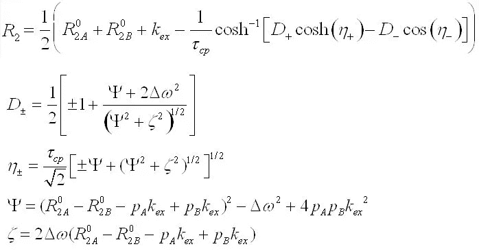

# 使用蒙特卡罗模拟传播误差的力量和简单性

> 原文：[`towardsdatascience.com/the-power-and-simplicity-of-propagating-errors-with-monte-carlo-simulations-9c8dcca9d90d`](https://towardsdatascience.com/the-power-and-simplicity-of-propagating-errors-with-monte-carlo-simulations-9c8dcca9d90d)

## 在数据分析和模型拟合中掌握不确定性，包括动手代码和示例

[](https://lucianosphere.medium.com/?source=post_page-----9c8dcca9d90d--------------------------------)[](https://towardsdatascience.com/?source=post_page-----9c8dcca9d90d--------------------------------) [LucianoSphere (Luciano Abriata, PhD)](https://lucianosphere.medium.com/?source=post_page-----9c8dcca9d90d--------------------------------)

·发表在[Towards Data Science](https://towardsdatascience.com/?source=post_page-----9c8dcca9d90d--------------------------------) ·15 分钟阅读·2023 年 7 月 21 日

--


图片由[eskay lim](https://unsplash.com/es/@eskaylim?utm_source=medium&utm_medium=referral)提供，来自[Unsplash](https://unsplash.com/?utm_source=medium&utm_medium=referral)

关于蒙特卡罗方法的内容在*Towards Data Science*上有[相当多的介绍](https://medium.com/search?q=monte+carlo+towards+data+science)，但关于它在误差传播中非常重要且有用的应用介绍却不多，除了[Shuai Guo](https://medium.com/u/7b08bf52bf9c?source=post_page-----9c8dcca9d90d--------------------------------)的精彩介绍以及其他几篇文章：

[## 使用蒙特卡罗方法量化模型预测误差](https://towardsdatascience.com/the-power-and-simplicity-of-propagating-errors-with-monte-carlo-simulations-9c8dcca9d90d)

### 演示蒙特卡罗模拟

towardsdatascience.com

在这里，我想提出一些具体的数值应用和代码，供你实际尝试，并亲身感受蒙特卡罗方法在几乎任何类型的计算中如何极其有用且易于实现。

我将从一个非常简单的应用开始，传播减法操作中的误差，然后举例说明如何用基本相同的思路来传播几乎任何类型的数值例程中的误差，从简单的线性回归到复杂的拟合过程，这些过程在解析上很难处理。

# 蒙特卡罗模拟中的误差传播

误差传播是数据分析和科学计算中的一个基本概念。当你有带有不确定性的测量值时，对这些值进行数学运算会导致最终计算结果中的误差传播。对于简单的算术操作，误差传播可以使用公式进行解析。如果你对解析误差传播感兴趣，可以查看这个资源：

[](https://www.geol.lsu.edu/jlorenzo/geophysics/uncertainties/Uncertaintiespart2.html?source=post_page-----9c8dcca9d90d--------------------------------) [## 不确定性与误差传播

### 版权 © 2000 年 7 月 1\. 系统误差与随机误差 2\. 确定随机误差 (a) 仪器误差极限…

[www.geol.lsu.edu](https://www.geol.lsu.edu/jlorenzo/geophysics/uncertainties/Uncertaintiespart2.html?source=post_page-----9c8dcca9d90d--------------------------------)

然而，对于涉及多个变量和非线性函数的复杂操作，或者对于数据拟合或神经网络执行等大型计算程序，解析误差传播可能很快变得不切实际甚至不可能。

蒙特卡洛模拟提供了一种替代的误差传播方法，特别是在解析解决方案具有挑战性或未知的情况下。蒙特卡洛方法涉及使用随机抽样来模拟大量场景，每次计算所需的量，然后分析结果的分布。这种统计方法提供了对最终结果不确定性的估计，使我们能够在复杂计算中传播误差。

为了演示蒙特卡洛模拟在误差传播中的应用，我们考虑一个非常简单的减法操作**a - b**，其中**a**和**b**都有一些相关的不确定性**da**和**db**。

*(注：本文及所有后续示例均使用 Matlab 编写，但可以轻松移植到任何其他脚本语言。)*

```py
clear; close all; clc

a = 8; da = 2; % Example a = 8 with uncertainty 2

b = 4; db = 1; % Example b = 4 with uncertainty 1

c = a — b; dc = sqrt(da*da + db*db); % Analytical error propagation

disp(‘Expected’)
disp([num2str(c), ‘ +/- ‘, num2str(dc)]) % Print
fprintf(‘\n’)

% =============== Start here Monte Carlo simulation

c_mc = []; % Will hold all results

for i=1:100000
 a_mc = normrnd(a, da); % Get a random number with a Gaussian distribution around a
 b_mc = normrnd(b, db); % Same around b

 c_mc = [c_mc; a_mc — b_mc]; % Run calculation and store
end

disp(‘From MonteCarlo with 10 iterations’)
disp([num2str(mean(c_mc(1:10))), ‘ +/- ‘, num2str(std(c_mc(1:10)))]) % Print result for 10 iterations
fprintf(‘\n’)

disp(‘From MonteCarlo with 100 iterations’)
disp([num2str(mean(c_mc(1:100))), ‘ +/- ‘, num2str(std(c_mc(1:100)))]) % Result for 100 iterations
fprintf(‘\n’)

disp(‘From MonteCarlo with 1000 iterations’)
disp([num2str(mean(c_mc(1:1000))), ‘ +/- ‘, num2str(std(c_mc(1:1000)))]) % Result for 1000 iterations
fprintf(‘\n’)

disp(‘From MonteCarlo with 10000 iterations’)
disp([num2str(mean(c_mc(1:10000))), ‘ +/- ‘, num2str(std(c_mc(1:10000)))]) % Result for 10000 iterations
fprintf(‘\n’)

disp('From MonteCarlo with 100000 iterations')
disp([num2str(mean(c_mc(1:100000))), ' +/- ', num2str(std(c_mc(1:100000)))]) % Result for 100000 iterations
fprintf('\n')
```

在这个示例中，不确定性既通过解析方法传播，也通过蒙特卡洛程序传播，然后对其结果进行比较。首先，将**c**上的不确定性解析传播为**a**和**b**的平方不确定性之和的平方根。

接下来是蒙特卡洛模拟。我们从以各自值为中心的高斯分布中随机抽取**a**和**b**，其标准差等于它们的不确定性。样本值存入临时变量**a_mc**和**b_mc**中，这些变量的差值存储在数组**c_mc**中。我们重复这个过程很多次，这里是 100,000 次，然后计算这个数组的平均值和标准差，以估计**c**的中心值及其相关的不确定性。这个示例程序报告了在 10 次、100 次、1000 次、10000 次和 100000 次迭代后的平均值和标准差，从中我们可以评估估计的收敛情况。

以下是一个示例运行的结果：

> 预期
> 
> 4 +/- 2.2361
> 
> 从蒙特卡洛模拟（10 次迭代）中得出的结果
> 
> 3.2695 +/- 3.1021
> 
> 从蒙特卡洛模拟（100 次迭代）中得出的结果
> 
> 3.8985 +/- 2.5303
> 
> 从蒙特卡洛模拟（1000 次迭代）中得出的结果
> 
> 3.9573 +/- 2.2683
> 
> 从蒙特卡洛模拟（10000 次迭代）中得出的结果
> 
> 4.0182 +/- 2.2139
> 
> 从蒙特卡洛模拟（100000 次迭代）中得出的结果
> 
> 3.9984 +/- 2.2439

如你所见，计算结果和从解析传播中预期的误差（2.2361）经过蒙特卡洛过程的迭代后均合理收敛。特别注意误差如何下降并非常接近解析传播值。同时，即使是 1000 次迭代也已经产生了一个非常合理的误差估计。

请注意，如果你自己运行代码，当然会得到不同的数字，但趋势应该始终存在：随着迭代次数的增加，你的误差应该收敛到类似于示例中报告的值（以及解析推导值）。

# 再提供两个例子，现在估计通过数据拟合获得的参数的不确定性

在上一节中，我们探讨了蒙特卡洛模拟如何用于传播简单算术操作中的误差。现在，让我们深入研究更实际的例子，应用蒙特卡洛模拟来估计通过数据拟合获得的参数的不确定性。

在这个例子中，我们将考虑线性拟合过程。给定一组数据点 (**x**, **y**)，我们希望找到形式为 **y = ax + b** 的最佳拟合直线。然而，现实世界的数据通常包含测量误差或其他不确定性，这可能会影响拟合参数 (**a** 和 **b**) 的准确性。为了考虑这些不确定性并获得更可靠的估计，我们可以使用蒙特卡洛模拟。

在这个例子中，我们生成一些样本数据，并添加以 0 为中心、宽度为 +/- 1 的高斯噪声以模拟测量误差。这成为了接下来的实验向量 **y** 值。

```py
clear; close all; clc

a = 5; b = 4;    % Slope and intercept

x = [1:10];    % x from 1 to 10

y = a * x + b + normrnd(0, 1, 1, 10);   % Simulate data and add Gaussian noise centered at 0 and with a width of +/- 1
```

首先，我们使用 Matlab 的 **fitlm** 函数进行线性回归，该函数计算最佳拟合直线并提供解析推导的斜率和截距及其不确定性：

```py
analyticfit = fitlm(x,y)   % fitlm performs a linear fit and displays the results, which include
                           % the analytically-derived slope and intercept and their uncertainties
```

该过程的输出结果如下：

```py
analyticfit = 

Linear regression model:

Estimated Coefficients:
                   Estimate      SE       tStat       pValue  
                   ________    _______    ______    __________

    (Intercept)     3.6469     0.94449    3.8612     0.0048006
    x1              5.0534     0.15222    33.198    7.3956e-10

Number of observations: 10, Error degrees of freedom: 8
Root Mean Squared Error: 1.38
R-squared: 0.993,  Adjusted R-Squared: 0.992
F-statistic vs. constant model: 1.1e+03, p-value = 7.4e-10
```

因此，你可以看到在这一轮运行和生成器提供的随机数中，解析拟合得出的 *斜率* = 5.0534 +/- 0.15222 和 *截距* = 3.6469 +/- 0.94449

现在，让我们看看 Monte Carlo 程序的发现。只需按照我们传播减法操作不确定性的相同思路，我们必须取 x 和 y 向量，随机添加噪声（这里仅对**y**进行，因为我们假设**x**没有误差，但我们也可以完美地对其添加噪声！），然后运行拟合程序 10,000 次。这次我们使用**polyfit**，一个用于拟合多项式（这里是 1 次）的 Matlab 函数，它不返回拟合参数的不确定性——这些我们将通过 Monte Carlo 获得。

所以，就像在前面的示例中一样，我们添加噪声，运行线性拟合，并将参数存储在专门用于斜率（**a_mc**）和截距（**b_mc**）的向量中：

```py
a_mc = [];    % Vector with slopes from Monte Carlo run
b_mc = [];    % Vector with intercepts from Monte Carlo run

for i=1:10000          % 10k iterations, and in each:
 yy = normrnd(y,1);    % Create temporal vector where noise is added to the experimental y values
 P = polyfit(x,yy,1);  % Fit that vector to x using linear regresion as a polynomial of degree 1

 b_mc = [b_mc; P(1)]; % Store all a values
 a_mc = [a_mc; P(2)]; % 
end

fprintf(‘\n’)
disp(‘From Monte Carlo with 10 iterations’)
disp([‘Intercept = ‘, num2str(mean(a_mc(1:10))), ‘ +/- ‘, num2str(std(a_mc(1:10)))])
disp([‘Slope = ‘, num2str(mean(b_mc(1:10))), ‘ +/- ‘, num2str(std(b_mc(1:10)))])
fprintf(‘\n’)

disp(‘From Monte Carlo with 100 iterations’)
disp([‘Intercept = ‘, num2str(mean(a_mc(1:100))), ‘ +/- ‘, num2str(std(a_mc(1:100)))])
disp([‘Slope = ‘, num2str(mean(b_mc(1:100))), ‘ +/- ‘, num2str(std(b_mc(1:100)))])
fprintf(‘\n’)

disp(‘From Monte Carlo with 1000 iterations’)
disp([‘Intercept = ‘, num2str(mean(a_mc(1:1000))), ‘ +/- ‘, num2str(std(a_mc(1:1000)))])
disp([‘Slope = ‘, num2str(mean(b_mc(1:1000))), ‘ +/- ‘, num2str(std(b_mc(1:1000)))])
fprintf(‘\n’)

disp(‘From Monte Carlo with 10000 iterations’)
disp([‘Intercept = ‘, num2str(mean(a_mc(1:10000))), ‘ +/- ‘, num2str(std(a_mc(1:10000)))])
disp([‘Slope = ‘, num2str(mean(b_mc(1:10000))), ‘ +/- ‘, num2str(std(b_mc(1:10000)))])
fprintf(‘\n’)
```

这是我获得的一组示例结果：

> 来自 Monte Carlo，10 次迭代
> 
> 截距 = 3.9435 +/- 0.97266
> 
> 斜率 = 5.0174 +/- 0.16053
> 
> 来自 Monte Carlo，100 次迭代
> 
> 截距 = 3.581 +/- 0.69941
> 
> 斜率 = 5.0716 +/- 0.11592
> 
> 来自 Monte Carlo，1000 次迭代
> 
> 截距 = 3.6461 +/- 0.69365
> 
> 斜率 = 5.0551 +/- 0.11206
> 
> 来自 Monte Carlo，10000 次迭代
> 
> 截距 = 3.6482 +/- 0.68509
> 
> 斜率 = 5.0533 +/- 0.10918

我们观察到，随着迭代次数的增加，Monte Carlo 对截距和斜率的估计逐渐接近通过**fitlm**获得的分析值。从 Monte Carlo 模拟中获得的不确定性（标准差）与**fitlm**提供的标准误差一致，确认了 Monte Carlo 方法在传播拟合参数误差方面的准确性。

然而，使用 Monte Carlo 方法的主要优点之一是我们可以选择输入的误差是什么，我们不仅可以考虑观测值**y**上的不确定性，还可以考虑自变量上的不确定性。方法的这些和其他特性允许更好、更受控且知识驱动的不确定性量化和传播。 （参见文末专门讨论这些和其他方法优点以及缺点的部分。）

## 一个更复杂的例子，来自实际应用

我们刚才用于线性程序的相同方法，实际上可以应用于几乎任何类型的计算，特别适用于复杂的拟合程序，它可以提供有关模型参数和预测可靠性的宝贵见解。

虽然上述示例主要是为了演示，但现在让我给你展示一个来自我自己研究的例子，在这个例子中，Monte Carlo 模拟是唯一实际可行的方法来将误差传播到拟合参数中。故事始于我需要拟合一个相当复杂的方程，其形式如下：



基础数据包括一个独立变量（我们的**x**），在这里是(*1/tcp*)，假设没有噪声，以及一个被称为**y**的依赖变量，称为 R₂。我的实验数据集包括多个 x, y 值，报告了不同相关系统的结果，所有这些数据必须一起拟合，以生成 kₑₓ, pA, pB, R₂A⁰, R₂B⁰和 d𝓌的单一值。所有这些都在这篇文章中解释了，我使用了 Matlab 强大的**nlinfit**函数：

[](https://pub.towardsai.net/efficient-nonlinear-function-fitting-with-matlabs-nlinfit-3a2948c0fde6?source=post_page-----9c8dcca9d90d--------------------------------) [## Matlab 的 nlinfit 进行高效非线性函数拟合

### 使用 Matlab 的 nlinfit 函数对复杂函数进行强大而多功能的拟合

pub.towardsai.net](https://pub.towardsai.net/efficient-nonlinear-function-fitting-with-matlabs-nlinfit-3a2948c0fde6?source=post_page-----9c8dcca9d90d--------------------------------)

在那篇文章中，我没有深入探讨误差估计，因为 Matlab 的**nlinfit**函数返回直接提供误差的矩阵……但是从数据中直接得到的，且没有办法告诉系统应该考虑输入数据中的具体误差。即，拟合参数的不确定性可以像这样一次性计算：

```py
[b1,res,J] = nlinfit(x,y,’AuxiliaryFunctionForNlinfit’,guesses);

b1 = b1';
dof = length(x)-length(b1);
sfit1 = norm(res)/sqrt(dof);
sd1 = sfit1*sqrt(diag(inv(J’*J)));
```

现在，使用蒙特卡罗方法，我们可以进行更灵活和有意义的误差传播。例如，我们可以告诉程序，较大的**y**（R₂）具有更高的不确定性（实验固有的）：

```py
for mcIteration = 1:10000

 mcIteration   % Prints in what iteration the loop is

 for j=1:numel(yexp)     % Take experimental y values and add noise (more noise when higher)
   yy(j) = normrnd(yexp(j), yexp(j) * 0.05); % In the example, the error is 5 % of the value
 end

 [b1,res,J]=nlinfit(x,yy,’AuxFunction’,beta0, opts);
 predictedy = AuxFunction(b1,x);

 mc_results = [mc_results; b1];
end

disp([‘-’])
disp([‘-’])                     % Printe the results of the simulation
disp([‘================== MONTE CARLO SIMULATION’])
disp([‘R21 = ‘,num2str(mean(mc_results(:,1))), ‘ +/- ‘, num2str(std(mc_results(:,1)))])
disp([‘R22 = ‘,num2str(mean(mc_results(:,2))), ‘ +/- ‘, num2str(std(mc_results(:,2)))])
disp([‘kEX = ‘,num2str(mean(mc_results(:,3))), ‘ +/- ‘, num2str(std(mc_results(:,3)))])
disp([‘dw = ‘,num2str(mean(mc_results(:,4))), ‘ +/- ‘, num2str(std(mc_results(:,4)))])
disp([‘p1_0 = ‘,num2str(mean(mc_results(:,5))), ‘ +/- ‘, num2str(std(mc_results(:,5)))])
disp([‘p1_20 = ‘,num2str(mean(mc_results(:,6))), ‘ +/- ‘, num2str(std(mc_results(:,6)))])
disp([‘p1_40 = ‘,num2str(mean(mc_results(:,7))), ‘ +/- ‘, num2str(std(mc_results(:,7)))])
disp([‘p1_50 = ‘,num2str(mean(mc_results(:,8))), ‘ +/- ‘, num2str(std(mc_results(:,8)))])
```

你可以看到，这个过程非常简单，和之前完全一样：只需多次运行拟合，每次使用一些受噪声影响的输入数据，反映出其实际的不确定性。最后，通过计算均值和标准差来汇总结果，以估算最终值。

这是一个输出示例，比较了基于雅可比矩阵的误差估计（没有考虑每个测量的具体不确定性）和 10000 次蒙特卡罗模拟的输出：

> ================== 蒙特卡罗模拟（10,000 次运行）
> 
> R21 = 0.8034 +/- 0.11613
> 
> R22 = 32.5616 +/- 34.5635
> 
> kEX = 6983.9807 +/- 595.5142
> 
> dw = 519.5121 +/- 92.0618
> 
> p1_0 = 1.0092 +/- 0.0034707
> 
> p1_20 = 0.86244 +/- 0.026407
> 
> p1_40 = 0.69446 +/- 0.066818
> 
> p1_50 = 0.58735 +/- 0.096593
> 
> ================== 使用雅可比矩阵误差的普通拟合
> 
> R21 = 0.31138 +/- 0.25225
> 
> R22 = 33.0533 +/- 4.7355
> 
> kEX = 6965.3075 +/- 273.3825
> 
> dw = 513.7739 +/- 21.398
> 
> p1–0 = 1.0013 +/- 0.0049281
> 
> p1–20 = 0.86324 +/- 0.015702
> 
> p1–40 = 0.71381 +/- 0.03781
> 
> p1–50 = 0.62331 +/- 0.053877

你可以看到，收敛值和误差相当相似，但使用基于雅可比矩阵的常规误差传播时，误差系统地较小。了解这个问题背后的物理学，蒙特卡罗传播的误差更有意义，特别是 R21 的相对误差较低，而 R22 的相对误差较高。

（有关问题的完整解释、物理学、实验和计算，请关注我的 Medium 账户，我将很快撰写一篇专门的文章）。

# 附加内容：使用蒙特卡罗方法估计数值过程输出的不确定性的一些实际优缺点

以下优点使得蒙特卡罗模拟在各种数据分析和建模场景中成为一种强大且灵活的方法：

+   **处理复杂误差分布：** 蒙特卡罗方法的一个重要优点是其处理复杂误差分布的能力。在许多实际情况中，观察数据（y 值）和输入变量（x 值）的不确定性可能不遵循简单的高斯分布，这在大多数分析误差传播推导中被假设。通过使用蒙特卡罗模拟，我们可以轻松定制误差分布，以更好地代表我们数据的特定特征。这种灵活性使我们能够更准确地建模不确定性，从而改进参数估计和提高预测的可靠性。

+   **误差建模的灵活性：**

    与一些假设特定误差模型的直接分析方法不同，蒙特卡罗模拟允许我们纳入各种误差结构。例如，我们可以包括异方差误差，其中误差的变异性随着不同的 x 值变化。此外，我们还可以考虑相关误差、非高斯分布以及其他可能在分析上难以处理的复杂情况。这种适应性使得蒙特卡罗方法能够处理更广泛的实际数据场景。

+   **处理非线性模型：**

    在许多情况下，数值模型可能涉及变量之间复杂的非线性关系。分析误差传播方法通常仅限于线性模型，使其在非线性情境下不够适用。相比之下，蒙特卡罗模拟天生适用于非线性模型，因为它们依赖于数值采样而不是显式的分析推导。这种能力使我们能够在更复杂和现实的模型中评估参数的不确定性。

+   **对假设的鲁棒性：**

    分析误差传播依赖于高斯误差和线性假设，这在实际中可能并不总是成立。当这些假设被违反时，分析结果的准确性可能会受到影响。而蒙特卡罗模拟则不依赖于这些假设，可以处理更广泛的数据分布和模型复杂性。这种鲁棒性确保了即使在传统方法可能失效的情况下，也能充分捕捉不确定性。

+   **纳入先验信息：**

    在贝叶斯蒙特卡罗方法中，我们可以在拟合数据之前整合关于参数的先验知识或信念。当有来自之前研究或专家意见的先验信息时，这一特性特别有用。通过将先验分布纳入模拟，我们可以有效更新我们的参数估计和不确定性评估，从而得到更具信息性和准确的建模结果。

+   **直观量化不确定性：**

    蒙特卡罗模拟生成参数估计的分布，使我们能够直观地理解可能值的范围和相关的不确定性。这种方法通常比从分析方法中获得的单点估计更具信息性，因为单点估计可能无法传达不确定性的全貌。通过可视化不确定性分布，决策者可以基于不同结果的概率做出明智的选择。

然而，蒙特卡罗方法并非万无一失，因此了解这些缺点至关重要：

+   **计算强度：**

    蒙特卡罗模拟通常涉及大量迭代以获得准确结果。随着迭代次数的增加，计算时间和所需资源也显著增加。对于复杂模型和大量数据点，蒙特卡罗模拟可能变得计算上昂贵且耗时，这可能会阻碍其在某些情况下的实用性。

+   **收敛性问题：**

    **对采样分布的敏感性：**

+   在某些情况下，蒙特卡罗模拟可能会遇到收敛性问题，尤其是在处理高维参数空间或复杂模型时。确保收敛并从参数空间中获得代表性样本可能具有挑战性，结果的质量取决于所使用的采样策略。收敛不足可能导致偏差或不可靠的不确定性估计。

    蒙特卡罗结果的准确性和可靠性在很大程度上依赖于用于生成模拟随机样本的采样分布的选择。如果所选分布不能充分代表数据中的真实不确定性，它可能导致不准确或误导的不确定性估计。正确选择采样分布需要仔细考虑和对数据特征的了解。

+   **模型选择与验证：**

    蒙特卡罗模拟不能提供模型选择或验证的指导。虽然它们可以估计拟合参数的 uncertainties，但并不解决模型适用性或拟合优度相关的问题。验证所选择的模型并评估其对给定数据的适当性仍然是需要与蒙特卡罗不确定性分析一起认真考虑的独立任务。

+   **先验分布的主观性：**

    在贝叶斯蒙特卡洛方法中，纳入先验信息涉及为模型参数指定先验分布。这些先验分布的选择可能引入主观性，因为不同的研究人员或分析师可能有不同的先验信念。这种主观性可能会影响最终的参数估计和不确定性量化，导致结果可能存在分歧。

+   **解释复杂性：**

    解读和传达蒙特卡洛模拟结果可能比传统的分析方法更具挑战性。不确定性分布可能不如点估计易于解释，分布中的大量信息可能会使非专家感到不知所措，而简单的误差传播可能就足够了。

+   **过拟合风险：**

    使用蒙特卡洛模拟进行不确定性估计时，有过拟合数据的风险。运行大量迭代并拟合多个模型可能会无意中找到在特定模拟数据集上表现良好的模型，但对新数据泛化效果不佳。需要仔细的验证和交叉验证策略来降低这一风险。当然，还需要在解决问题的背景下判断结果的含义。

# 进一步阅读

想了解更多关于蒙特卡洛方法的内容，请查看这三篇发表在[TDS Editors](https://medium.com/u/7e12c71dfa81?source=post_page-----9c8dcca9d90d--------------------------------)上的文章，这些文章介绍了除帮助传播不确定性以外的引言和应用：

[A Zero-Math Introduction to Markov Chain Monte Carlo Methods](https://medium.com/u/7e12c71dfa81?source=post_page-----9c8dcca9d90d--------------------------------) [## 零数学介绍：马尔科夫链蒙特卡洛方法

### 对许多人来说，贝叶斯统计学充其量是巫术，最糟糕的是完全主观的无稽之谈。在这些…

[An Overview of Monte Carlo Methods](https://medium.com/u/7e12c71dfa81?source=post_page-----9c8dcca9d90d--------------------------------) [## 蒙特卡洛方法概述

### 蒙特卡洛（MC）方法是计算算法的一部分，使用重复随机抽样的过程来…

[An Overview of Monte Carlo Methods](https://medium.com/u/7e12c71dfa81?source=post_page-----9c8dcca9d90d--------------------------------) [Monte Carlo Simulation](https://medium.com/u/7e12c71dfa81?source=post_page-----9c8dcca9d90d--------------------------------) [## 赌场总是赢钱：蒙特卡洛模拟

### 赌场如何赚钱？诀窍很简单——你玩得时间越长，亏钱的概率就越高。让我们…

[Monte Carlo Simulation](https://medium.com/u/7e12c71dfa81?source=post_page-----9c8dcca9d90d--------------------------------)

[***www.lucianoabriata.com***](https://www.lucianoabriata.com/) *我撰写和拍摄关于我广泛兴趣范围内的所有事物：自然、科学、技术、编程等。*

[***在这里打赏我***](https://lucianoabriata.altervista.org/office/donations.html) 或 [***成为 Medium 会员***](https://lucianosphere.medium.com/membership) *以访问所有故事（我会获得少量收入，而您无需支付任何费用）。* [***订阅以获取我的新故事***](https://lucianosphere.medium.com/subscribe) ***通过电子邮件***。 ***关于小工作咨询*** *请查看我的* [***服务页面***](https://lucianoabriata.altervista.org/services/index.html)*。您可以* [***在这里联系我***](https://lucianoabriata.altervista.org/office/contact.html)***。***
