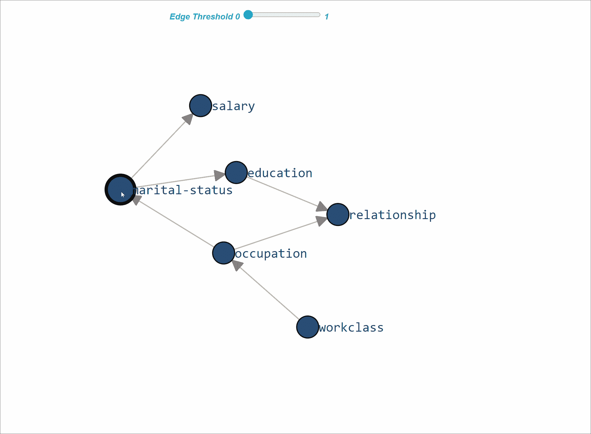
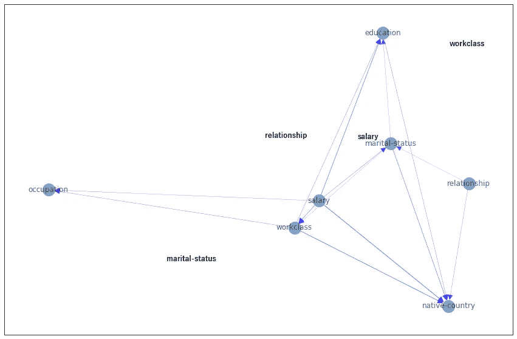
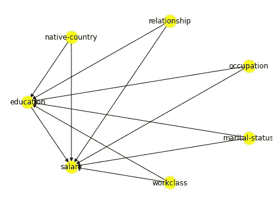
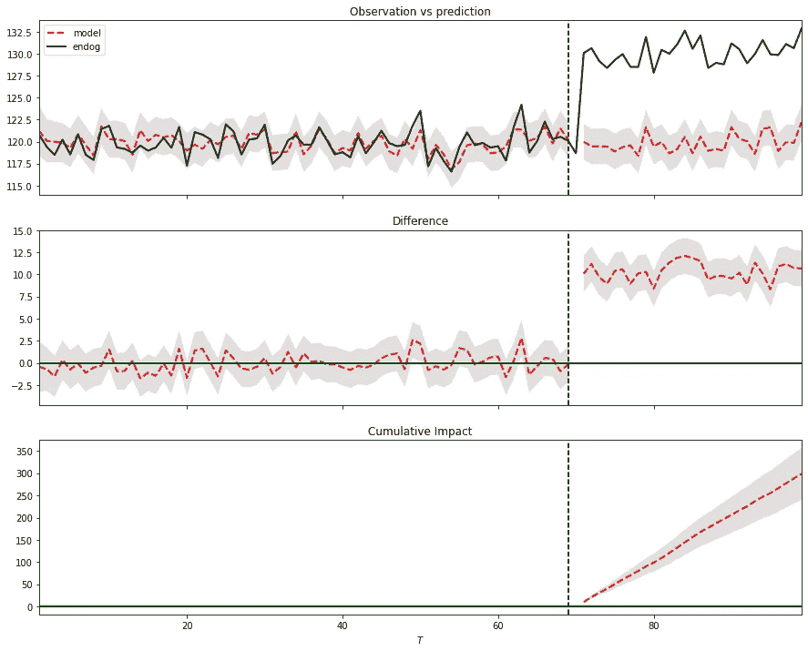

# 贝叶斯因果推断的力量：揭示数据集中隐藏因果关系的库的比较分析。

> 原文：[`towardsdatascience.com/the-power-of-bayesian-causal-inference-a-comparative-analysis-of-libraries-to-reveal-hidden-d91e8306e25e`](https://towardsdatascience.com/the-power-of-bayesian-causal-inference-a-comparative-analysis-of-libraries-to-reveal-hidden-d91e8306e25e)

## 使用最适合的贝叶斯因果推断库揭示数据集中的隐藏因果变量：与五个流行库的实操示例进行比较。

[](https://erdogant.medium.com/?source=post_page-----d91e8306e25e--------------------------------)[](https://towardsdatascience.com/?source=post_page-----d91e8306e25e--------------------------------) [Erdogan Taskesen](https://erdogant.medium.com/?source=post_page-----d91e8306e25e--------------------------------)

·发表于 [Towards Data Science](https://towardsdatascience.com/?source=post_page-----d91e8306e25e--------------------------------) ·阅读时间 20 分钟·2023 年 5 月 22 日

--


图片由 [Alexander Schimmeck](https://unsplash.com/@alschim?utm_source=unsplash&utm_medium=referral&utm_content=creditCopyText) 提供，来源于 [Unsplash](https://unsplash.com/photos/Aohf8gqa7Zc?utm_source=unsplash&utm_medium=referral&utm_content=creditCopyText)

理解系统或过程中的变量因果效应非常有价值。现在有许多 Python 库可以帮助确定因果关系。***我将比较五个流行的因果推断库在功能、易用性和灵活性方面的表现。*** 每个库都配有实际操作示例。包含的库有 [*Bnlearn*](https://github.com/erdogant/bnlearn)*,* [*Pgmpy*](https://github.com/pgmpy/pgmpy)*,* [*CausalNex*](https://github.com/quantumblacklabs/causalnex)*,* [*DoWhy*](https://github.com/py-why/dowhy)，和 [*CausalImpact*](https://github.com/jamalsenouci/causalimpact/)。通过阅读本文，你将更好地理解这五个因果推断库，并确定哪个最适合你的使用场景。

# 背景

因果推断是确定过程或系统中变量之间的因果关系。一般来说，我们可以将变量分为两类；***驱动变量和乘客变量***。驱动变量是那些*直接*影响结果或因变量的变量，而乘客变量则是那些没有直接影响但与结果变量相关联的变量。

识别***驱动变量***在预测维护或安全领域等项目中可能至关重要。驱动变量有助于解释预测变量和结果变量之间的因果关系。相反，***乘客变量***对结果变量没有直接影响。然而，它们仍然可以有用，因为它们可以提供额外的变化，从而理解数据收集的背景。*例如，如果我们发现引擎故障与地点有强相关性，我们可能会怀疑有一个潜在的驱动变量导致特定地点的故障。* 因果推断有助于通过识别要操作的变量和要监控的变量来做出更好的决策。

> 在因果推断中，我们不仅寻求确定一个事件是否会发生，还要理解它发生的机制。

然而，因果推断分析是一项具有挑战性的任务，因为它需要分离多个变量的影响，考虑混杂变量，并处理不确定性。幸运的是，Python 有几个库可以帮助数据科学家进行因果推断。在这篇文章中，我将比较 Python 中五个最受欢迎的因果推断库：[***Bnlearn***](https://github.com/erdogant/bnlearn)***、*** [***Pgmpy***](https://github.com/pgmpy/pgmpy)***、*** [***DoWhy***](https://github.com/py-why/dowhy)***、*** [***CausalNex***](https://github.com/quantumblacklabs/causalnex)*** 和 ***[CausalImpact](https://github.com/jamalsenouci/causalimpact/)***。

*如果你觉得这篇关于贝叶斯因果学习的文章有帮助，欢迎* [*关注我*](http://erdogant.medium.com/) *，因为我会写更多关于贝叶斯统计的内容。如果你考虑订阅 Medium 会员，可以通过我的* [*推荐链接*](https://medium.com/@erdogant/membership) *来稍微支持我的工作。这和买一杯咖啡的价格一样，你可以每月无限阅读所有文章。*

# 五个因果推断库的比较。

让我们逐一检查这五个软件包，并从解决问题的能力角度审视它们的功能。为了最一致地比较这些库，我将尽可能使用相同的数据集，即*普查收入数据* *集*。这个多变量数据集包含 14 个节点，具有 48842 个实例（或样本）[1]。每个节点包含两个或更多可能的状态，可以用来估计拥有研究生学位是否对年收入超过 50k 很重要。我们可以使用*Bnlearn 库*加载数据集。

```py
# Installation
pip install bnlearn
```

```py
# Import libraries
import pandas as pd
import numpy as np
import matplotlib.pyplot as plt
import bnlearn as bn

# Import data set and drop continous and sensitive features
df = bn.import_example(data='census_income')
drop_cols = ['age', 'fnlwgt', 'education-num', 'capital-gain', 'capital-loss', 'hours-per-week', 'race', 'sex']
df.drop(labels=drop_cols, axis=1, inplace=True)

df.head()
#          workclass  education  ... native-country salary
#0         State-gov  Bachelors  ...  United-States  <=50K
#1  Self-emp-not-inc  Bachelors  ...  United-States  <=50K
#2           Private    HS-grad  ...  United-States  <=50K
#3           Private       11th  ...  United-States  <=50K
#4           Private  Bachelors  ...           Cuba  <=50K
#
#[5 rows x 7 columns]
```

## 库 1：Python 的 Bnlearn。

***Bnlearn*** 是一个适用于创建和分析贝叶斯网络的 Python 包，适用于*离散、混合和连续数据集*[2, 3]。它设计为易于使用，并包含了最受欢迎的贝叶斯管道，用于因果学习，包括结构学习、参数学习和推断。可以通过简单指定参数进行初始化来使用一系列统计测试。*Bnlearn* 还包含各种辅助函数，用于转换数据集、推导（整个）图的拓扑排序、比较两个图以及制作各种有洞察力的图表等。*有关使用 bnlearn 进行结构学习的更多详细信息请参见这里：*

[](/a-step-by-step-guide-in-detecting-causal-relationships-using-bayesian-structure-learning-in-python-c20c6b31cee5?source=post_page-----d91e8306e25e--------------------------------) ## 使用贝叶斯结构学习在 Python 中检测因果关系的逐步指南。

### 入门指南，用于有效确定变量间的因果关系。

[towardsdatascience.com

*Bnlearn* 的一个重要功能是它可以仅基于数据集学习因果结构。为此任务实现了六种算法；`hillclimbsearch, exhaustivesearch, constraintsearch, chow-liu, naivebayes 和 TAN`，并且可以与评分类型 `BIC, K2, BDEU` 结合使用。一些方法需要设置根节点，例如增强型朴素贝叶斯（`TAN`），如果你知道结果（或目标）值的话，推荐使用。这也会显著降低计算负担，并且在特征很多的情况下推荐使用。此外，通过 `independence test`，可以轻松地从模型中修剪掉虚假边缘。在下面的示例中，我将使用 `hillclimbsearch` 方法和评分类型 `BIC` 进行结构学习。在这个示例中，我们*不会*定义目标值，而是让*Bnlearn* 完全基于数据自身决定整个因果结构。

```py
# Load library
import bnlearn as bn

# Structure learning
model = bn.structure_learning.fit(df, methodtype='hillclimbsearch', scoretype='bic')

# Test edges significance and remove.
model = bn.independence_test(model, df, test="chi_square", alpha=0.05, prune=True)

# Make plot
G = bn.plot(model, interactive=False)

# Make plot interactive
G = bn.plot(model, interactive=True)

# Show edges
print(model['model_edges'])
# [('education', 'salary'),
# ('marital-status', 'relationship'),
# ('occupation', 'workclass'),
# ('occupation', 'education'),
# ('relationship', 'salary'),
# ('relationship', 'occupation')]
```

要确定有向无环图（DAG），我们需要指定输入数据框，如上面的代码部分所示。拟合模型后，结果存储在 `model` 字典中，可以用于进一步分析。因果结构的交互式图表如图 1 所示。



图 1\. 使用 Bnlearn 进行结构学习的*人口普查收入数据* *集的交互式图表。如果学习到 CPD，工具提示将描述估计的 CPD（图片由作者提供）。*

通过学习到的有向无环图（图 1），我们可以估计条件概率分布（CPD，见下方代码部分），并使用*do-calculus* 进行推断。*换句话说，我们可以开始向数据提出问题。*

```py
# Learn the CPDs using the estimated edges.
# Note that we can also customize the edges or manually provide a DAG.
# model = bn.make_DAG(model['model_edges'])

# Learn the CPD by providing the model and dataframe
model = bn.parameter_learning.fit(model, df)

# Print the CPD
CPD = bn.print_CPD(model)
```

> **问题 1：** 在教育为博士的情况下，薪水>50k 的概率是多少：`P(salary | education=Doctorate)`

从直观上看，我们可能会期望高概率，因为教育是“*博士*”。让我们从贝叶斯模型中找出后验概率。在下面的代码部分，我们得出了`P=0.7093`的概率。这证实了当教育为*博士*时，与*没有博士教育*相比，薪水>50K 的概率更高。

```py
# Start making inferences
query = bn.inference.fit(model, variables=['salary'], evidence={'education':'Doctorate'})
print(query)
+---------------+---------------+
| salary        |   phi(salary) |
+===============+===============+
| salary(<=50K) |        0.2907 |
+---------------+---------------+
| salary(>50K)  |        0.7093 |
+---------------+---------------+
```

现在让我们询问一下较低教育是否也会导致薪水>50K 的概率较低。我们可以轻松地将教育更改为`HS-grad`，然后再次提出这个问题。

> **问题 2：** 在教育为 HS-grad 的情况下，薪水>50k 的概率是多少：`*P(salary | education=*HS-grad*)*`

这导致了`P=0.1615`的后验概率。根据这个数据集，学习对获得更高薪水非常有利。然而，请注意，我们没有使用任何其他约束作为可能影响结果的证据。

```py
query = bn.inference.fit(model, variables=['salary'], evidence={'education':'HS-grad'})
print(query)
+---------------+---------------+
| salary        |   phi(salary) |
+===============+===============+
| salary(<=50K) |        0.8385 |
+---------------+---------------+
| salary(>50K)  |        0.1615 |
+---------------+---------------+
```

直到这一部分，我们使用了单一变量，但 DAG 中的所有变量都可以用作*证据*。让我们做另一个更复杂的查询。

> **问题 3：** 在教育为博士且婚姻状态为未婚的情况下，属于某个工作类别的概率是多少：`P(workclass| education=Doctorate, marital-status=never-married)`。

在下面的代码部分可以看到，这返回了每个*工作类别*的概率，其中*工作类别*为`private`的概率最高：`P=0.5639`。

```py
# Start making inferences
query = bn.inference.fit(model, variables=['workclass'], evidence={'education':'Doctorate', 'marital-status':'Never-married'})
print(query)
+-----------------------------+------------------+
| workclass                   |   phi(workclass) |
+=============================+==================+
| workclass(?)                |           0.0420 |
+-----------------------------+------------------+
| workclass(Federal-gov)      |           0.0420 |
+-----------------------------+------------------+
| workclass(Local-gov)        |           0.1326 |
+-----------------------------+------------------+
| workclass(Never-worked)     |           0.0034 |
+-----------------------------+------------------+
| workclass(Private)          |           0.5639 |
+-----------------------------+------------------+
| workclass(Self-emp-inc)     |           0.0448 |
+-----------------------------+------------------+
| workclass(Self-emp-not-inc) |           0.0868 |
+-----------------------------+------------------+
| workclass(State-gov)        |           0.0810 |
+-----------------------------+------------------+
| workclass(Without-pay)      |           0.0034 |
+-----------------------------+------------------+
```

## 总结

+   ***输入数据***：输入数据可以是离散的、连续的或混合的数据集。

+   **优势：** 包含最受欢迎的贝叶斯管道，用于结构学习、参数学习和使用*do-calculus*进行推断。可以轻松创建图表并探索 CPD。适合初学者和不想自己构建管道的专家。

## 库 2：Pgmpy。

***Pgmpy*** 是一个提供概率图模型工具的库。它包含了各种统计方法的实现，用于结构学习、参数估计、近似（基于采样）和精确推断。一个优点是核心函数是低级统计函数，这使得构建自己的因果块更加灵活。虽然这很棒，但它需要对贝叶斯建模有很好的了解，因此相比于像*Bnlearn*这样的库，对于刚开始学习贝叶斯建模的人来说可能更困难。

在功能方面，可以得到与 *Bnlearn* 相同的结果，因为 *Bnlearn* 也利用了 *Pgmpy* 的一些核心功能。然而，在 *pgmpy* 中，你确实需要自己构建整个管道，包括数据所需的转换步骤，以及结果的收集和绘图。在下面的代码部分，我将简要演示如何使用 `hillclimbsearch` 估计器和评分方法 `BIC` 学习因果结构。请注意，不同的估计器可能在管道中需要非常不同的步骤。

```py
# Install pgmpy
pip install pgmpy

# Import functions from pgmpy
from pgmpy.estimators import HillClimbSearch, BicScore, BayesianEstimator
from pgmpy.models import BayesianNetwork, NaiveBayes
from pgmpy.inference import VariableElimination

# Import data set and drop continous and sensitive features
df = bn.import_example(data='census_income')
drop_cols = ['age', 'fnlwgt', 'education-num', 'capital-gain', 'capital-loss', 'hours-per-week', 'race', 'sex']
df.drop(labels=drop_cols, axis=1, inplace=True)

# Create estimator
est = HillClimbSearch(df)

# Create scoring method
scoring_method = BicScore(df)

# Create the model and print the edges
model = est.estimate(scoring_method=scoring_method)

# Show edges
print(model.edges())
# [('education', 'salary'),
# ('marital-status', 'relationship'),
# ('occupation', 'workclass'),
# ('occupation', 'education'),
# ('relationship', 'salary'),
# ('relationship', 'occupation')]
```

使用 do-calculus 对数据进行推断时，我们首先需要估计 CPDs，如下方代码部分所示。

```py
vec = {
    'source': ['education', 'marital-status', 'occupation', 'relationship', 'relationship', 'salary'],
    'target': ['occupation', 'relationship', 'workclass', 'education', 'salary', 'education'],
    'weight': [True, True, True, True, True, True]
}
vec = pd.DataFrame(vec)

# Create Bayesian model
bayesianmodel = BayesianNetwork(vec)

# Fit the model
bayesianmodel.fit(df, estimator=BayesianEstimator, prior_type='bdeu', equivalent_sample_size=1000)

# Create model for variable elimination
model_infer = VariableElimination(bayesianmodel)

# Query
query = model_infer.query(variables=['salary'], evidence={'education':'Doctorate'})
print(query)
```

## 总结

+   ***输入数据***：输入数据集必须是离散的。

+   **优点：** 包含可以用来创建自己贝叶斯管道的基础构建模块。

+   **缺点：** 需要对贝叶斯建模有良好的了解。

## 库 3：CausalNex。

***CausalNex*** 是一个用于从数据中学习因果模型、识别因果路径和估计因果效应的 Python 库 [5]。*Causalnex* 仅支持离散分布，而连续特征或具有大量类别的特征应在拟合贝叶斯网络之前进行离散化。描述中提到：“*如果使用了许多变量，模型通常会拟合较差*”。然而，提供了辅助功能以减少分类特征的基数。让我们使用 *Census Income data* *set* 来检查 Causalnex 的可能性。首先，我们需要将数据转换为数值，因为这正是底层 NOTEARS [7] 算法所期望的。我们可以通过标签编码非数值变量来实现（见代码部分）。

```py
# Installation
pip install causalnex
```

```py
# Load libraries
from causalnex.structure.notears import from_pandas
from causalnex.network import BayesianNetwork
import networkx as nx
from sklearn.preprocessing import LabelEncoder
le = LabelEncoder()

# Import data set and drop continous and sensitive features
df = bn.import_example(data='census_income')
drop_cols = ['age', 'fnlwgt', 'education-num', 'capital-gain', 'capital-loss', 'hours-per-week', 'race', 'sex']
df.drop(labels=drop_cols, axis=1, inplace=True)

# Next, we want to make our data numeric, since this is what the NOTEARS expect.
df_num = df.copy()
for col in df_num.columns:
    df_num[col] = le.fit_transform(df_num[col])
```

我们现在可以应用 NOTEARS 算法来学习结构并使用绘图功能可视化因果模型。我们需要应用阈值处理以移除较弱的边缘，并防止图形完全连通。此外，为了避免伪边缘，可以对边缘施加约束。

```py
# Structure learning
sm = from_pandas(df_num)

# Thresholding
sm.remove_edges_below_threshold(0.8)

# Use positions from Bnlearn
pos=G['pos']
# Make plot
plt.figure(figsize=(15,10));
edge_width = [ d['weight']*0.3 for (u,v,d) in sm.edges(data=True)]
nx.draw_networkx_labels(sm, pos, font_family="Yu Gothic", font_weight="bold")
nx.draw_networkx(sm, node_size=400, arrowsize=20, alpha=0.6, edge_color='b', width=edge_width)

# If required, remove spurious edges and relearn structure.
sm = from_pandas(df_num, tabu_edges=[("relationship", "native-country")], w_threshold=0.8)
```



图 3\. 使用 Causalnex 对 *Census Income data* *set* 进行结构学习。没有节点的标签包含较弱的边缘，这些边缘通过阈值处理被移除。（图像作者提供。）

使用推导出的结构，我们可以学习条件概率分布（CPDs）并开始进行查询。然而，还需要进行一些额外的步骤，即减少分类特征的基数，并离散化数值特征。请注意，我们还需要以字典形式指定节点状态，以防止手动将数值转换为分类标签。尽管每个步骤都很重要，但为了简化起见，我将跳过这些步骤以避免代码行数过多。有关详细信息，建议阅读文档手册[这里](https://causalnex.readthedocs.io/en/latest/03_tutorial/01_first_tutorial.html)。它还演示了如何使用一些辅助方法来简化离散化过程。

```py
# Step 1: Create a new instance of BayesianNetwork
bn = BayesianNetwork(structure_model)

# Step 2: Reduce the cardinality of categorical features
# Use domain knowledge or other manners to remove redundant features.

# Step 3: Create Labels for Numeric Features
# Create a dictionary that describes the relation between numeric value and label.

# Step 4: Specify all of the states that each node can take
bn = bn.fit_node_states(df)

# Step 5: Fit Conditional Probability Distributions
bn = bn.fit_cpds(df, method="BayesianEstimator", bayes_prior="K2")

# Return CPD for education
result = bn.cpds["education"]

# Extract any information and probabilities related to education.
print(result)
# marital-status  Divorced              ...   Widowed            
# salary             <=50K              ...      >50K            
# workclass              ? Federal-gov  ... State-gov Without-pay
# education                             ...                      
# 10th            0.077320    0.019231  ...  0.058824      0.0625
# 11th            0.061856    0.012821  ...  0.117647      0.0625
# 12th            0.020619    0.006410  ...  0.058824      0.0625
# 1st-4th         0.015464    0.006410  ...  0.058824      0.0625
# 5th-6th         0.010309    0.006410  ...  0.058824      0.0625
# 7th-8th         0.056701    0.006410  ...  0.058824      0.0625
# 9th             0.067010    0.006410  ...  0.058824      0.0625
# Assoc-acdm      0.025773    0.057692  ...  0.058824      0.0625
# Assoc-voc       0.046392    0.051282  ...  0.058824      0.0625
# Bachelors       0.097938    0.128205  ...  0.058824      0.0625
# Doctorate       0.005155    0.006410  ...  0.058824      0.0625
# HS-grad         0.278351    0.333333  ...  0.058824      0.0625
# Masters         0.015464    0.032051  ...  0.058824      0.0625
# Preschool       0.005155    0.006410  ...  0.058824      0.0625
# Prof-school     0.015464    0.006410  ...  0.058824      0.0625
# Some-college    0.201031    0.314103  ...  0.058824      0.0625
# [16 rows x 126 columns]
```

## 摘要

+   ***输入数据***：输入数据集必须是离散的。连续数据不支持。

+   **优点**：可以学习因果网络并对数据进行推断。

+   **缺点**：需要大量预处理步骤，但提供了辅助功能以减少分类特征的基数。

## 库 4：DoWhy。

***DoWhy***是一个用于因果推断的 Python 库，支持因果假设的明确建模和测试[2, 3]。*与 Bnlearn 和 Pgmpy 相比，在 DoWhy 库中，必须定义结果变量和处理变量。* 处理变量是你想研究因果效应的变量，而结果变量是你想测量其效果的变量。此外，建议提供一个 DAG，即节点之间的因果关系。要为你的数据集创建因果图，你需要领域知识，或者可以将每个变量连接到*目标*和*处理*变量。注意，如果没有提供 DAG，后者会自动执行。对于这个数据集，我不包括已知的结构，而是让*DoWhy*在所有变量之间创建到*结果*和*处理*变量的边。第一个代码部分显示了所需的预处理步骤，第二个代码部分则是因果模型的创建。

```py
# Installation
pip install dowhy

# Import libraries
from dowhy import CausalModel
import dowhy.datasets
from sklearn.preprocessing import LabelEncoder

# Import data set and drop continous and sensitive features
df = bn.import_example(data='census_income')
drop_cols = ['age', 'fnlwgt', 'education-num', 'capital-gain', 'capital-loss', 'hours-per-week', 'race', 'sex']
df.drop(labels=drop_cols, axis=1, inplace=True)

# Treatment variable must be binary
df['education'] = df['education']=='Doctorate'

# Next, we need to make our data numeric.
df_num = df.copy()
for col in df_num.columns:
    df_num[col] = le.fit_transform(df_num[col])
```

```py
# Specify the treatment, outcome, and potential confounding variables
treatment = "education"
outcome = "salary"

# Step 1\. Create a Causal Graph
model= CausalModel(
        data=df_num,
        treatment=treatment,
        outcome=outcome,
        common_causes=list(df.columns[~np.isin(df.columns, [treatment, outcome])]),
        graph_builder='ges',
        alpha=0.05,
        )

# Display the model
model.view_model()
```



图 2。DoWhy 创建了这个 DAG 来建模*人口普查收入数据* *集，其中结果变量为“salary”，处理变量为“Education”（图像由作者提供）。*

正如你在上面的代码部分中可能已经注意到的，处理变量必须是二元的（设置为 Doctorate），并且所有分类变量需要编码为数值。在下面的代码部分，我们将使用因果图的属性来识别因果效应。结果可能不会令人惊讶。它表明，拥有`Doctorate` *增加*了获得良好`salary`的机会。

```py
# Step 2: Identify causal effect and return target estimands
identified_estimand = model.identify_effect(proceed_when_unidentifiable=True)

# Results
print(identified_estimand)

# Estimand type: EstimandType.NONPARAMETRIC_ATE
# ### Estimand : 1
# Estimand name: backdoor
# Estimand expression:
#      d                                                                        
# ────────────(E[salary|workclass,marital-status,native-country,relationship,occupation])
# d[education]                                                                  
#        
# Estimand assumption 1, Unconfoundedness: If U→{education} and U→salary then P(salary|education,workclass,marital-status,native-country,relationship,occupation,U) = P(salary|education,workclass,marital-status,native-country,relationship,occupation)
#
# ### Estimand : 2
# Estimand name: iv
# No such variable(s) found!
#
# ### Estimand : 3
# Estimand name: frontdoor
# No such variable(s) found!
```

```py
# Step 3: Estimate the target estimand using a statistical method.
estimate = model.estimate_effect(identified_estimand, method_name="backdoor.propensity_score_stratification")

# Results
print(estimate)

#*** Causal Estimate ***
#
## Identified estimand
# Estimand type: EstimandType.NONPARAMETRIC_ATE
#
### Estimand : 1
# Estimand name: backdoor
# Estimand expression:
#      d                                                                        
# ────────────(E[salary|workclass,marital-status,native-country,relationship,occupation])
# d[education]                                                                 
#       
# Estimand assumption 1, Unconfoundedness: If U→{education} and U→salary then P(salary|education,workclass,marital-status,native-country,relationship,occupation,U) = P(salary|education,workclass,marital-status,native-country,relationship,occupation)
#
## Realized estimand
# b: salary~education+workclass+marital-status+native-country+relationship+occupation
# Target units: ate
#
## Estimate
# Mean value: 0.4697157228651772

# Step 4: Refute the obtained estimate using multiple robustness checks.
refute_results = model.refute_estimate(identified_estimand, estimate, method_name="random_common_cause")
```

## 摘要

+   ***输入数据***：结果变量和处理变量。强烈建议提供一个因果 DAG。

+   ***要求：*** 处理变量必须是二元的，所有分类变量需要编码成数值。

+   **（优）缺点：** 输出包含许多细节，这些细节可能有利但也使理解变得复杂。无法从数据中学习因果 DAG。

## **库 5：CausalImpact**。

***CausalImpact*** 是一个用于使用贝叶斯结构 ***时间序列模型*** 进行因果推断的 Python 包 [4]。其主要目标是通过分析期望和观察到的时间序列数据之间的差异来推断给定干预的预期效果，如程序评估或处理效果分析。它假设响应变量可以通过线性回归精确建模。然而，响应变量不能受到已发生干预的影响。例如，如果一家公司想要推断某个营销活动对其“*收入*”的影响，则其每日“*访问量*”不能作为协变量使用，因为总访问量可能会受到该活动的影响。在以下示例中，我们将创建 100 个观测值，其中响应变量为 `y`，预测变量为 `x1`。请注意，在实际应用中，我们会有更多的预测变量。为了演示，*干预效果* 通过在时间点 71 之后将响应变量更改 10 个单位来创建。

为了估计因果效应，我们首先需要指定干预前期和干预后期。使用 `run` 函数，我们利用 MLE（默认）拟合时间序列模型，并估计因果效应。

```py
# Installation
pip install causalimpact

# Import libraries
import numpy as np
import pandas as pd
from statsmodels.tsa.arima_process import arma_generate_sample
import matplotlib.pyplot as plt
from causalimpact import CausalImpact

# Generate samples
x1 = arma_generate_sample(ar=[0.999], ma=[0.9], nsample=100) + 100
y = 1.2 * x1 + np.random.randn(100)
y[71:] = y[71:] + 10
data = pd.DataFrame(np.array([y, x1]).T, columns=["y","x1"])

# Initialize
impact = CausalImpact(data, pre_period=[0,69], post_period=[71,99])
# Create inferences
impact.run()
# Plot
impact.plot()
# Results
impact.summary()

#                              Average    Cumulative
# Actual                           130          3773
# Predicted                        120          3501
# 95% CI                    [118, 122]  [3447, 3555]

# Absolute Effect                    9           272
# 95% CI                       [11, 7]    [326, 218]

# Relative Effect                 7.8%          7.8%
# 95% CI                  [9.3%, 6.2%]  [9.3%, 6.2%]

# P-value                         0.0%              
# Prob. of Causal Effect        100.0%

# Summary report
impact.summary(output="report")
```

平均列描述了处理后期的平均时间。累积列汇总了各个时间点的值，这在响应变量表示流量数量时（如查询、点击、访问、安装、销售或收入）是一个有用的视角。我们看到，在这个例子中，由于我们在数据中包含了这一点，因此因果效应的概率为 100%，P 值为 0，这是正确的。



图 4\. CausalImpact 图（作者提供的图片）。

在图（图 4）中，我们可以看到三个面板，具体描述如下：在面板 1 中，我们可以看到数据以及专门针对处理后期的反事实预测。在第二个面板中，展示了观察数据与反事实预测之间的差异。这一差异表示了由模型确定的逐点因果效应。底部面板通过汇总前一个面板中的逐点贡献来描绘干预的累积效果。需要注意的是，这些推断的有效性依赖于协变量没有受到干预本身的影响。此外，模型假设在预期期间建立的协变量与处理时间序列之间的关系在整个后期保持一致。

## 总结

+   ***输入数据：*** 时间序列数据。

+   ***要求：*** 需要指定干预前和干预后的时间段。

+   **优点：** 可以确定时间序列数据上的因果效应。

# 图书馆之间的整体总结。

我们已经看到五个用于学习因果关系的库，每个库都有其自身的优缺点和解决特定问题的重点。总结如下：

***BnLearn*** 库适用于具有离散、混合或连续数据集的情况，需要从数据中推导因果 DAG（结构学习）、进行参数学习（CPD 估计），或在你希望进行推理（*do-calculus*）的情况下。其优点在于许多预处理和后处理步骤都在管道中解决，从而减少了出错的可能性。它允许将类别（字符串）标签作为输入，并且可以使用统计测试（独立性测试）去除虚假的边。此外，还可以将边或节点列入白名单或黑名单。请注意，由于大多数处理步骤是在管道中执行的，因此无法完全自定义建模部分，这可能会降低用户的控制权。

***Pgmpy*** 库包含低级统计函数，用于创建和组合各种结构学习、参数学习和推理方法。它在使用上比较灵活，但需要对贝叶斯建模有良好的知识。请注意，*Bnlearn* 库利用了来自 *Pgmpy* 的一些函数，因此功能有重叠。换句话说，如果你打算创建自定义管道，建议使用 *Pgmpy*。否则，我推荐使用 *bnlearn*。

***CausalNex*** 库可以用来从数据中推导因果 DAG，并进行推理。请注意，它仅适用于离散数据集。在检测到因果 DAG 后，可以通过阈值来移除边。不幸的是，它无法处理类别标签，需要将其转换为数值。此外，还需要进行各种中间预处理步骤。例如，减少类别特征的基数，描述数值特征，并以字典形式指定每个节点可以采取的所有状态。尽管这给用户提供了更多的建模控制，但额外的建模增加了一层复杂性。

***DoWhy*** 方法在你希望估计因果效应时是理想的，如果你有一个 *结果变量* 和一个 *处理* 变量。这非常适用于 A/B 测试的使用场景，例如确定酒店预订取消的原因。*结果* 可以设置为 *“取消”*，*处理* 可以设置为 *“分配不同的房间”*。另一个使用场景可能是估计会员奖励计划的效果。请注意，该库并不旨在从数据中学习因果 DAG。然而，它确实需要一个作为模型输入的因果 DAG，你需要手动提供。

***CausalImpact*** 是一个用于因果推断的 Python 包，使用贝叶斯结构***时间序列模型***。虽然它也计算因果关系，但其功能与其他库不可比拟，因为它不打算创建因果 DAG 或对数据进行推断。目标是通过分析预期和观察到的时间序列数据之间的差异，推断给定干预的预期效果，例如程序评估或治疗效果分析。

# 最后的话。

对数据进行因果建模可能因多种原因而具有挑战性。首先需要选择合适的库，这些库与您的具体使用案例匹配。我们已经对五个流行的因果推断库进行了比较：*Bnlearn、Pgmpy、CausalNex、DoWhy 和 CausalImpact*。每个库都有其自身的优缺点，并且最适合某些特定的使用案例。我们使用相同的数据集比较了这些库的功能、能力和结果的可解释性。只有* CausalImpact*使用了不同的数据集，因为它只能建模连续值并且需要时间序列数据。

功能分组会将***Bnlearn***、***Pgmpy*** 和 ***CausalNex*** 聚类在一起，因为它们包含结构学习、参数学习和推断的功能。第二组是***DoWhy*** 和 ***CausalImpact***，它们旨在测量*处理*变量对结果变量*Y*的因果效应，同时控制一组特征*X*。除了这里描述的五个因果库，还有更多库值得关注，如*EconML*、*Pyro* 和 *CausalML*，它们属于第二组（*处理*变量对*结果*变量的因果效应）。

*保重。保持冷静。*

***干杯 E.***

*免责声明：我是 Python bnlearn 库的开发者。不管你对因果库的决定是什么，确保你完全理解建模部分并能够解释结果。*

*如果你觉得这篇关于贝叶斯因果学习的文章有帮助，欢迎* [*关注我*](http://erdogant.medium.com/) *，因为我会写更多关于贝叶斯统计的文章。如果你考虑加入 Medium 会员，你可以通过使用我的* [*推荐链接*](https://medium.com/@erdogant/membership)* 来稍微支持一下我的工作。价格和一杯咖啡相同，你可以每月无限阅读文章。*

# 软件

+   Bnlearn [Colab Notebook 示例](https://erdogant.github.io/distfit/pages/html/Documentation.html#colab-notebook)

+   [八个贝叶斯因果库之间的比较 PDF 文件。](https://erdogant.gumroad.com/l/Comparison_python_libraries_bayesian_causality?layout=profile)

# 让我们联系吧！

+   [在 LinkedIn 上连接](https://www.linkedin.com/in/erdogant/)

+   [在 Github 上关注我](https://github.com/erdogant)

+   [在 Medium 上关注我](https://erdogant.medium.com/)

# 与贝叶斯统计相关的工作

[](/a-step-by-step-guide-in-detecting-causal-relationships-using-bayesian-structure-learning-in-python-c20c6b31cee5?source=post_page-----d91e8306e25e--------------------------------) ## 逐步指南：使用贝叶斯结构学习检测因果关系

### 初学者指南，用于有效地确定变量之间的因果关系。

towardsdatascience.com [](/a-step-by-step-guide-in-designing-knowledge-driven-models-using-bayesian-theorem-7433f6fd64be?source=post_page-----d91e8306e25e--------------------------------) ## 逐步指南：使用贝叶斯定理设计知识驱动模型

### 如果你没有数据但有专家知识。初学者指南将知识转化为计算机辅助…

towardsdatascience.com [](/a-guide-to-find-the-best-boosting-model-using-bayesian-hyperparameter-tuning-but-without-c98b6a1ecac8?source=post_page-----d91e8306e25e--------------------------------) ## 寻找最佳增强模型的指南：使用贝叶斯超参数调优，但不包括…

### 增强型决策树算法可能会优于其他模型，但过拟合是一个现实的危险。使用…

towardsdatascience.com [](https://erdogant.medium.com/hands-on-guide-for-hyperparameter-tuning-with-bayesian-optimization-for-classification-models-2002224bfa3d?source=post_page-----d91e8306e25e--------------------------------) [## 分类模型的贝叶斯优化超参数调优实践指南

### 学习如何拆分数据、优化超参数、预防过拟合、选择最佳模型，并创建…

erdogant.medium.com](https://erdogant.medium.com/hands-on-guide-for-hyperparameter-tuning-with-bayesian-optimization-for-classification-models-2002224bfa3d?source=post_page-----d91e8306e25e--------------------------------)

# 参考文献

1.  Census Income. (1996). UCI 机器学习库。 [`doi.org/10.24432/C5S595`](https://doi.org/10.24432/C5S595)。

1.  Taskesen E, 使用 Python 中的贝叶斯结构学习检测因果关系的逐步指南，Medium，2021

1.  Taskesen, E. (2020). [*使用 bnlearn Python 包学习贝叶斯网络。*](https://erdogant.github.io/bnlearn) (版本 0.3.22) [计算机软件]。

1.  Dowhy: [`www.pywhy.org/dowhy/v0.8/getting_started/intro.html`](https://www.pywhy.org/dowhy/v0.8/getting_started/intro.html)

1.  Amit Sharma, Emre Kiciman. DoWhy: 一种用于因果推断的端到端库。2020 年。[`arxiv.org/abs/2011.04216`](https://arxiv.org/abs/2011.04216)

1.  Kay H. 等，[*使用贝叶斯结构时间序列模型推断因果影响*](https://research.google/pubs/pub41854/)，2015 年，《应用统计年鉴》（第 9 卷，第 247–274 页）

1.  Xun Zheng 等，[*无泪的 DAG: 结构学习的连续优化*](https://proceedings.neurips.cc/paper_files/paper/2018/file/e347c51419ffb23ca3fd5050202f9c3d-Paper.pdf)，第 32 届神经信息处理系统会议（NeurIPS 2018），加拿大蒙特利尔。

1.  AI4I 2020 [预测维护数据集](https://archive-beta.ics.uci.edu/dataset/601/ai4i+2020+predictive+maintenance+dataset)（2020）。UCI 机器学习库。
