# 独立分量分析（ICA）在真实世界应用中的强大能力 — EEG 示例

> 原文：[`towardsdatascience.com/the-power-of-independent-component-analysis-ica-on-real-world-applications-egg-example-48df336a1bd8?source=collection_archive---------2-----------------------#2023-10-23`](https://towardsdatascience.com/the-power-of-independent-component-analysis-ica-on-real-world-applications-egg-example-48df336a1bd8?source=collection_archive---------2-----------------------#2023-10-23)

## 独立分量分析（ICA）是一种强大的数据驱动工具，能够在数据中分离线性贡献

[](https://medium.com/@rodrigodamottacc?source=post_page-----48df336a1bd8--------------------------------)[](https://towardsdatascience.com/?source=post_page-----48df336a1bd8--------------------------------) [Rodrigo da Motta C. Carvalho](https://medium.com/@rodrigodamottacc?source=post_page-----48df336a1bd8--------------------------------)

·

[关注](https://medium.com/m/signin?actionUrl=https%3A%2F%2Fmedium.com%2F_%2Fsubscribe%2Fuser%2Fd17b17427c47&operation=register&redirect=https%3A%2F%2Ftowardsdatascience.com%2Fthe-power-of-independent-component-analysis-ica-on-real-world-applications-egg-example-48df336a1bd8&user=Rodrigo+da+Motta+C.+Carvalho&userId=d17b17427c47&source=post_page-d17b17427c47----48df336a1bd8---------------------post_header-----------) 发布在 [Towards Data Science](https://towardsdatascience.com/?source=post_page-----48df336a1bd8--------------------------------) ·6 分钟阅读·2023 年 10 月 23 日[](https://medium.com/m/signin?actionUrl=https%3A%2F%2Fmedium.com%2F_%2Fvote%2Ftowards-data-science%2F48df336a1bd8&operation=register&redirect=https%3A%2F%2Ftowardsdatascience.com%2Fthe-power-of-independent-component-analysis-ica-on-real-world-applications-egg-example-48df336a1bd8&user=Rodrigo+da+Motta+C.+Carvalho&userId=d17b17427c47&source=-----48df336a1bd8---------------------clap_footer-----------)

--

[](https://medium.com/m/signin?actionUrl=https%3A%2F%2Fmedium.com%2F_%2Fbookmark%2Fp%2F48df336a1bd8&operation=register&redirect=https%3A%2F%2Ftowardsdatascience.com%2Fthe-power-of-independent-component-analysis-ica-on-real-world-applications-egg-example-48df336a1bd8&source=-----48df336a1bd8---------------------bookmark_footer-----------)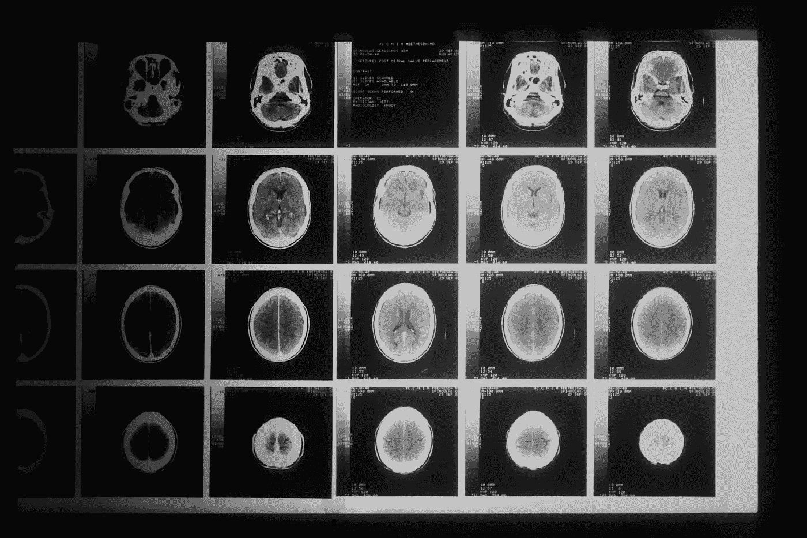

Photo by [National Cancer Institute](https://unsplash.com/@nci?utm_source=medium&utm_medium=referral) 在 [Unsplash](https://unsplash.com/?utm_source=medium&utm_medium=referral)

## -   介绍

独立成分分析（ICA）通常与降维任务相关。然而，这项技术最突出的应用是从数据中分离线性贡献，寻找统计独立的成分。例如，ICA 被广泛用于从音频中分离乐器轨迹。本文的目标是通过著名的 *“鸡尾酒会”* 示例介绍和激发 ICA 的兴趣，然后简要介绍 ICA 如何利用概率和信息理论的基础知识提取独立成分。接着，我们探索一个实际的例子——从脑电图（EEG）数据中识别和去除眼睛眨动的动作。

## 贡献与信号和 ICA 的分离

为了更好地理解从数据中分离线性贡献，标准的例子是 *“鸡尾酒会”*。这个场景设置在一个喧闹的鸡尾酒会中，两个人进行对话，分别由房间中的红色（***Y1***) 和蓝色（***Y2***) 扬声器表示。因此，两只麦克风被战略性地放置在附近，以捕捉这两个人的声音，由绿色（***X1***) 和黄色（***X2***) 麦克风表示。这些声音的可听度根据对话者与每个麦克风的距离而变化。

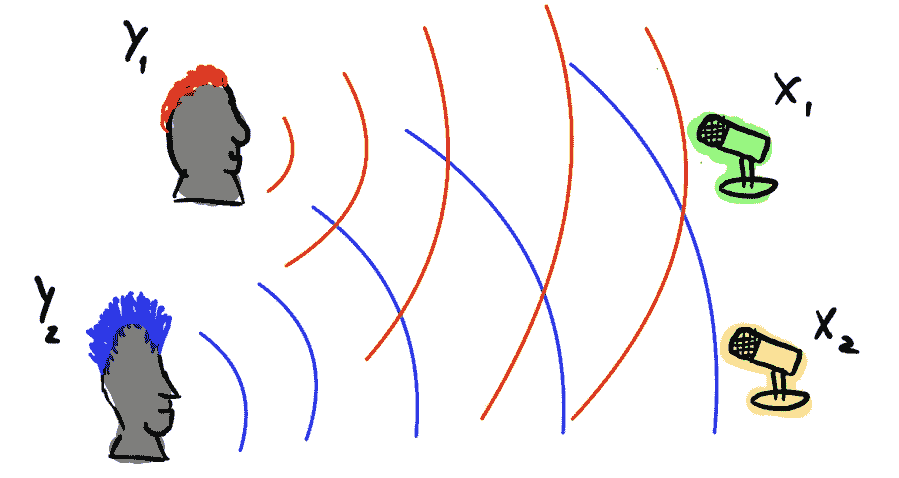

*“鸡尾酒会”* 的插图。信号由麦克风 *X1* 和 *X2* 捕获，我们希望将其分解为原始源 *Y1* 和 *Y2*。图片由作者提供。

挑战在于如何有效地将每个混合音频文件中的两个不同声音分离，以获得每个扬声器的孤立音频录音。这一难题可以通过熟练应用独立成分分析（ICA）来解决。在正确的数据假设下（我们将在下一节中看到），每个独立成分将是蓝色和红色扬声器的声音。

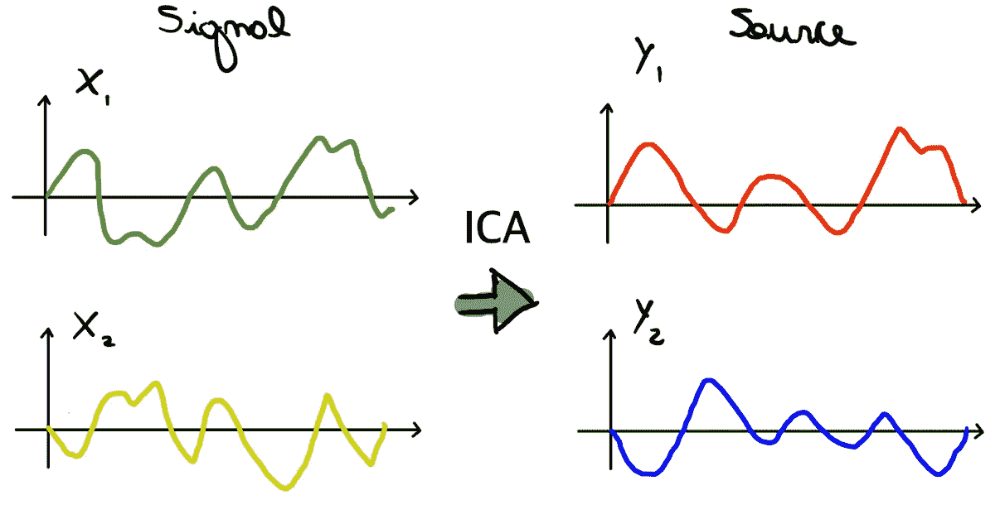

ICA 分解的插图。图片由作者提供。

## ICA 的基本机制

独立成分分析（ICA）试图使用坐标系统 ***S*** 对数据 ***X*** 进行表示，在这个坐标系统中，成分 ***Si*** 是独立的。这种独立的坐标系统可以说是数据的一种自然表示。

> **这里最重要的一点是 ICA 假设成分是统计独立的，而不是无关的**（如 PCA）[1]。

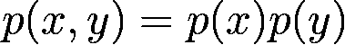

**统计** **独立** 的定义。

主成分分析（PCA）假设数据和成分是正态分布的，当满足这一要求时，PCA 成分是统计独立的。然而，在数据分布非高斯的一般情况下，ICA 是寻找独立成分 ***Y*** *(源)* 代表数据 ***X*** *(信号)* 的强大方法。

ICA 变换由***Y = AX***给出，其中***A***的元素是定义组件的系数。因此，它仍然是一个线性方法，因为它假设源和信号之间的线性组合。

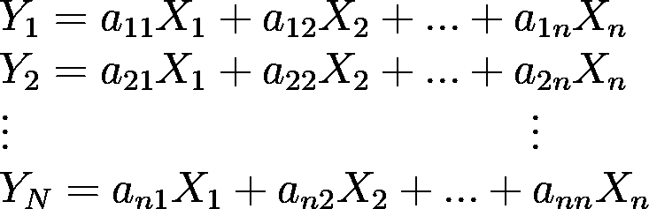

我们也可以进行反向操作，即根据 ICA 组件写入数据。

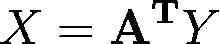

> **由于我们正在寻找统计上独立的组件，我们想要最小化组件之间共享的信息**。

因此，信息论是帮助我们解决这个问题的自然选择。两随机变量***X***和***Y***之间共享的信息量被称为互信息。

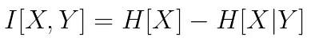

因此，我们想要最小化组件之间共享的信息，

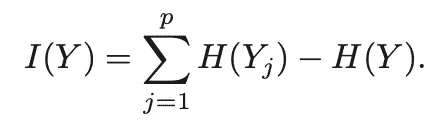

这是找到最小化***I[Y] = I[ AˆT X ]***的***A***。因此，结果的正交向量导致最独立的组件。

> 一旦我们理解了 ICA 的动机和基本机制，让我们在实际情况中应用它。

## 现实世界应用：去除 EEG 数据中的眼睛眨动

脑电图（EEG）数据受到各种运动伪影的污染，这些伪影由患者在图像采集过程中的自愿或非自愿运动引起。一个常见的伪影是眼睛眨动。因此，像 ICA 这样的工具是去除这些噪声的广泛使用技术[2]。如前所述，ICA 是一种分离信号独立贡献的方法。因此，我们直观地应该期待眼睛眨动对接近眼睛的通道有重要贡献。

EEG 测量跨皮层点的电位差随时间变化。因此，在 EEG 实验中，我们将从皮层的不同部位获得多条时间序列，这些序列包含关于神经回路的不同信息。

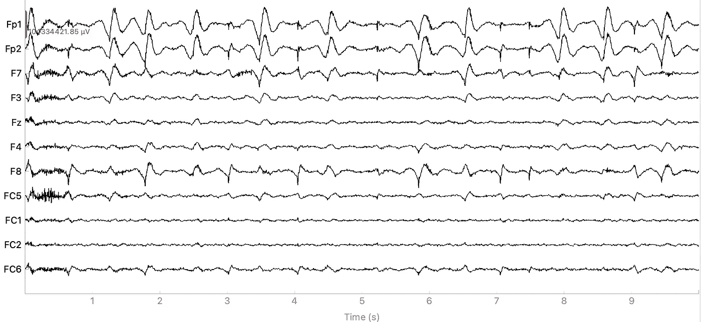

来自多个通道的 EEG 时间序列示例。图像由作者提供。


上述示例中的通道位置。图像由作者提供。

为了正确处理 EEG 数据并应用 ICA，我们将使用[*MNE*](https://mne.tools/stable/index.html)（一个用于 EEG 数据处理和分析的库）。此外，我们将使用由 João Sato 教授在联邦 ABC 大学收集的数据，这些数据可在[GitHub](https://github.com/Rodrigo-Motta/ICA_EEG)上找到。

```py
import pandas as pd
import seaborn as sns
import matplotlib.pyplot as plt
import numpy as np
import mne as mne
sns.set_palette('pastel')

eeg = np.loadtxt('/Users/rodrigo/Post-Grad/Disciplines/Neural Signaling Processing/Aula_3/restEEG/OlhosAbertos.txt')
canais = pd.read_csv('/Users/rodrigo/Post-Grad/Disciplines/Neural Signaling Processing/Aula_3/restEEG/NOMEScanais.txt', dtype='str', header=None)

# Sampling frequency 250Hz: 
Hz = 250

eeg = pd.DataFrame(eeg, columns=canais.iloc[:,0].values)
eeg['Time(s)'] = np.arange(0, (1/Hz)*len(eeg), 1/Hz)
```

创建 MNE EEG 对象。

```py
# Creating MNE object
mne_info = mne.create_info(
                    list(eeg.columns[:-1]),
                    Hz,
                    ch_types=['eeg']*len(eeg.columns[:-1]))

mne_raw = mne.io.RawArray(eeg.iloc[:,:-1].values.T, mne_info)

# Defining the electrodes architecture
standard_1020 = mne.channels.make_standard_montage('standard_1020')
mne_raw.set_montage(standard_1020)
```

为了提取重要特征，我们需要过滤时间序列，以排除与伪影和噪声相关的高频（> 120 Hz）和低频（< 4 Hz），以及来自环境电源线的 60Hz 贡献。

```py
# Set filter parameters
lowCut = 4 # Hz
highCut = 120 # Hz
freqNotch = 60 # Hz (eletric interference from the enviroment)

# Apply bandpass and notch filter
mne_raw.filter(lowCut, highCut, fir_design='firwin')
mne_raw.notch_filter(freqNotch, fir_design='firwin')
```

现在，数据准备好进行 ICA 处理。

```py
ica_obj = mne.preprocessing.ICA(
                    n_components=0.95,
                    method='infomax',
                    max_iter="auto",
                    random_state=1,
                    fit_params=dict(extended=True)).fit(mne_raw)

ica = ica_obj.get_sources(mne_raw).get_data()

ica_obj.plot_components(picks=None,show=True, inst=mne_raw)
```

ICA 系数用作识别信号组件空间贡献的代理。

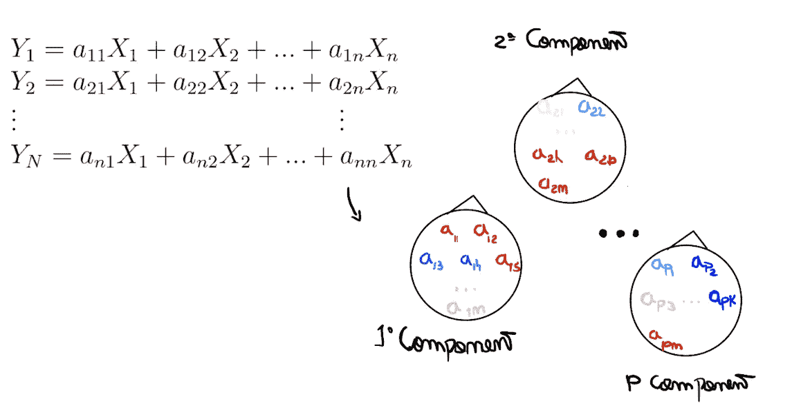

将值与每个成分的空间区域关联的过程示意图。图片由作者提供。

因此，可以为每个成分创建热图。

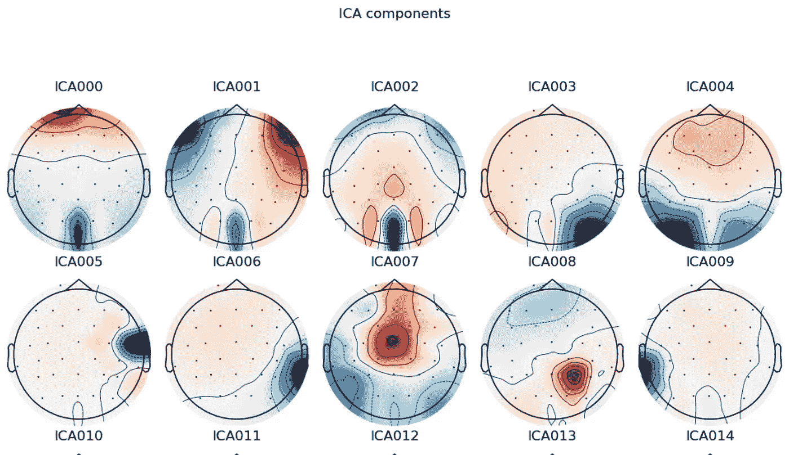

ICA 成分。图片由作者提供。

第一个成分是信号中的眼睑运动贡献。正如我们预期的那样，这一贡献在靠近眼睛的电极上更大。也可以更深入地查看该成分的时间/频率信息。

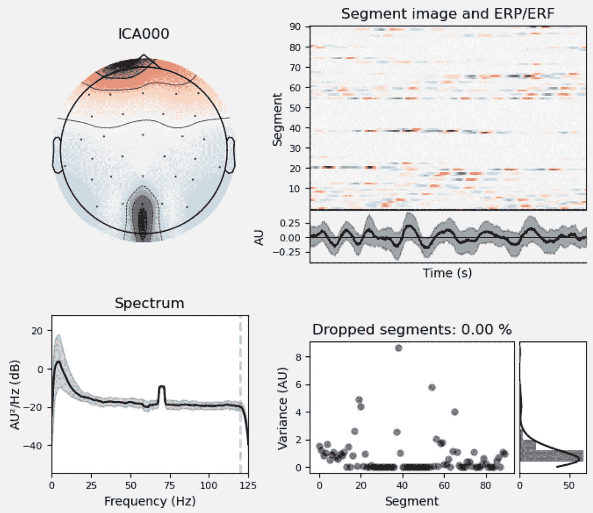

ICA 第一个成分的时间/频率信息。图片由作者提供。

现在，为了从数据中去除眼睑运动伪影，我们只需重建没有这个特定成分的信号。这意味着恢复没有与伪影相关的模式的时间序列。

## 结论

总结来说，独立成分分析（ICA）是一种强大的数据驱动工具，它假设数据为非高斯分布，并且源信号之间存在线性关系，以寻找统计上独立的成分。ICA 允许我们分离数据中的不同贡献，使其在需要隔离噪声或不需要的信号的场景中特别有用。在 EEG 数据的情况下，ICA 可以识别并去除如眼睑运动等运动伪影，这些伪影可能会污染神经信号。

## 备注

重要的是要指出，ICA 是一个强大的工具，但使用时需要谨慎。数据驱动的方法不假设对系统有任何先验知识。因此，混淆和虚假结论很常见，这使得检查要求和仔细评估结果至关重要。

## 致谢

这个项目的灵感来源于 João Ricardo Sato 教授。

**本文的笔记本可用** [**在这里**](https://github.com/Rodrigo-Motta/ICA_EEG)**。**

## 参考文献

[1] Hastie T, Tibshirani R, Friedman J, Hastie T, Tibshirani R, et al. (2009) 基础扩展与正则化。在：***统计学习的元素***，纽约，NY：Springer New York，Springer 统计系列。

[2] Mennes M, Wouters H, Vanrumste B, Lagae L, Stiers P. (2010). ***ICA 作为去除 EEG/ERP 中眼动伪影工具的验证***。*生理心理学*。2010;47(6):1142–1150。doi:10.1111/j.1469–8986.2010.01015.x
