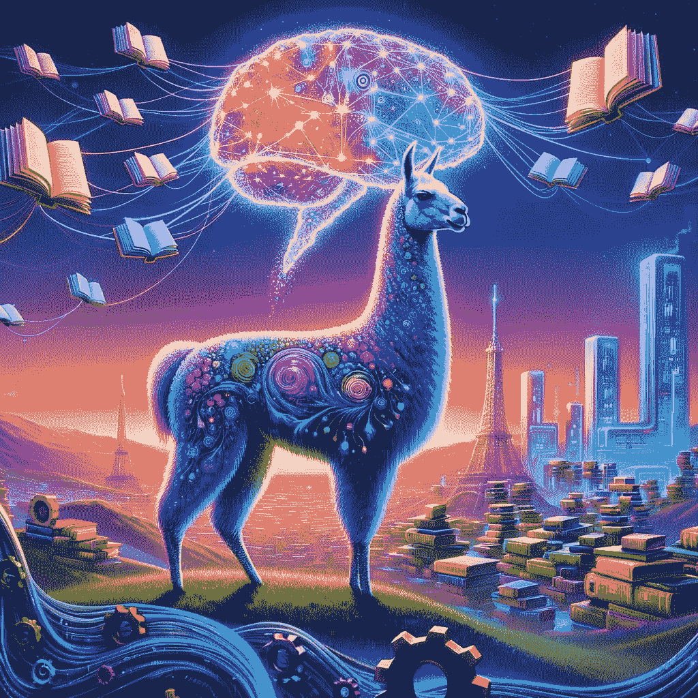
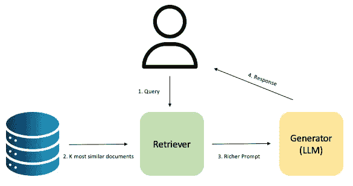
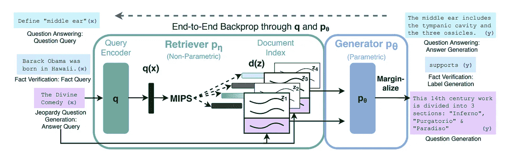
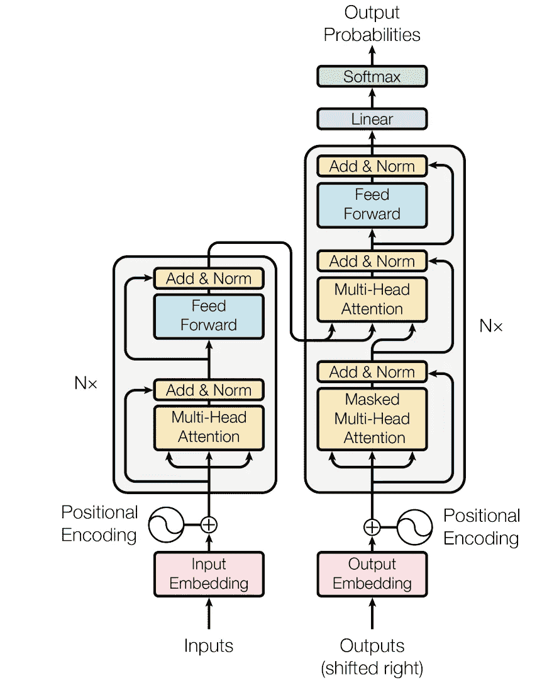

# **检索增强生成的力量：Base LLM 与 RAG LLMs 的比较，基于 Llama2**

> 原文：[`towardsdatascience.com/the-power-of-retrieval-augmented-generation-a-comparison-between-base-and-rag-llms-with-llama2-368865762c0d`](https://towardsdatascience.com/the-power-of-retrieval-augmented-generation-a-comparison-between-base-and-rag-llms-with-llama2-368865762c0d)

## 深入探讨使用 RAG 方法定制预训练 LLM 以适应特定使用案例，涉及 LangChain 和 Hugging Face 集成

[](https://medium.com/@luisroque?source=post_page-----368865762c0d--------------------------------)[](https://towardsdatascience.com/?source=post_page-----368865762c0d--------------------------------) [Luís Roque](https://medium.com/@luisroque?source=post_page-----368865762c0d--------------------------------)

·发表于 [Towards Data Science](https://towardsdatascience.com/?source=post_page-----368865762c0d--------------------------------) ·阅读时间 12 分钟·2023 年 11 月 29 日

--

*本文由 Rafael Guedes 共同撰写。*

# 介绍

自 2022 年 11 月 ChatGPT 发布以来，大型语言模型（LLMs）因其理解和生成类似人类文本的能力，成为 AI 社区的热门话题，推动了自然语言处理（NLP）领域的边界。

LLMs 已被证明具有多样性，通过处理不同行业的不同使用案例，因为它们不局限于特定任务。它们可以适应多个领域，这使得它们对组织和研究社区具有吸引力。已经探索了许多使用 LLMs 的应用程序，例如内容生成、聊天机器人、代码生成、创意写作、虚拟助手等。

使 LLMs 非常吸引人的另一个特征是有开源选项。像 Meta 这样的公司将其预训练的 LLM（Llama2 🦙）在 Hugging Face 🤗 等存储库中提供。这些预训练的 LLM 对于每个公司的特定使用案例足够好吗？显然不够。

组织可以用自己的数据从头开始训练 LLM。但绝大多数组织（几乎所有组织）既没有所需的数据，也没有完成任务所需的计算能力。这需要拥有数万亿个标记的数据集，成千上万的 GPU，以及几个月的时间。另一个选择是使用预训练的 LLM，并将其调整为特定的使用案例。有两种主要的方法：微调和**RAGs（检索增强生成）**。

在本文中，我们将比较单独预训练的 Llama2 与集成在 RAG 系统中的预训练 LLama2 在回答关于 OpenAI 最新新闻的问题上的表现。我们将从解释 RAG 的工作原理及其子模块（检索器和生成器）的架构开始。最后，我们将逐步实现如何使用 LangChain **🦜️** 和 Hugging Face 构建一个适用于任何用例的 RAG 系统。



图 1：通过 RAG 方法，Llamas 变得越来越强大（图像来源：作者）

一如既往，代码可以在我们的[Github](https://github.com/zaai-ai/large-language-models)上找到。

# 什么是检索增强生成（RAG）？

检索增强生成（RAG）是一种结合了检索器（如向量数据库或特征存储的非参数记忆）和生成器（如预训练的*seq2seq*变换器的参数记忆）技术的方法。它们用于提高 LLM [1] 的预测质量。它在推理时使用检索器，通过添加基于最相关文档的上下文/知识来构建更丰富的提示，以响应用户查询。

这种架构相对于传统 LLM 的优势是：

1.  我们可以通过替换或添加更多文档/信息到非参数记忆中，轻松更新其知识。因此，它不需要重新训练模型。

1.  它提供了对预测的可解释性，因为它允许用户检查哪些文档被检索以提供上下文，而这是我们从传统 LLM 中无法获得的。

1.  它通过提供更准确和最新的信息，减少了*“幻觉”*的著名问题，这些信息通过检索器提供的文档获取。



图 2：检索增强生成（RAG）设置的示意图（图像来源：作者）

# 检索器——它是什么以及如何工作？

检索器的开发旨在解决问答（QA）问题，我们期望系统能够回答类似*“什么是检索增强生成？”*的问题。它通过访问包含有关主题信息的文档数据库来实现。

数据库通过将我们的文档拆分成等长的*段落*来填充，每个段落被表示为一系列标记。给定一个问题，系统需要遍历数据库，以找到可以更好回答问题的*“段落”*。

为了使这些系统在多个领域中有效工作，它们的数据库需要填充数百万或数十亿的文档。因此，为了能够遍历数据库寻找合适的*段落*，**检索器**需要在选择一组候选*段落*时非常高效。

**密集段落检索器 (DPR)** [2] 是作者在 [1] 中使用的检索器。它的目标是将数百万个段落索引到一个低维的连续空间，以高效地检索与特定问题最相关的前 *k* 个段落。

DPR 使用两个 **密集编码器**：

1.  **段落编码器**将每个段落转换为一个 d 维向量，并使用 **FAISS** [3] 对它们进行索引。FAISS 是一个用于密集向量相似性搜索的开源库，可以应用于数十亿个向量。

1.  **问题编码器**将输入问题转换为一个 d 维向量，然后使用 **FAISS** 检索与问题向量最接近的 **k** 个段落。向量之间的相似性可以通过它们之间的点积来计算。

1.  DPR 使用的编码器架构是一个 BERT [4] 网络，它将输入转换为高维向量。然而，只要符合我们的用例，我们可以使用任何架构。



图 3：RAG 过程的概述，使用一个预训练的检索器，该检索器结合了查询编码器、文档索引和一个预训练生成器（seq2seq 模型）以预测自由文本形式的输出 ([source](https://arxiv.org/pdf/2005.11401.pdf))。

# 生成器 — 它是什么，如何工作？

生成器是一个 LLM，负责根据特定输入生成文本，通常被称为提示。

LLM 是主要由两种层组成的变换器模型 [5]：

1.  **全连接前馈网络 (FFN)** 通过线性和非线性变换将一个嵌入向量映射到一个新的嵌入向量。

1.  **注意力层**旨在选择哪些输入嵌入部分对当前任务更有用，产生一个新的嵌入向量。

BART [6] 是作者在 [1] 中为生成器选择的 LLM，它是一个序列到序列模型，具有以下架构 [7]：

+   **编码器**接收输入嵌入，并通过其六层（包括两个子层：多头自注意力机制和 FFN）生成一个 512 维的向量作为解码器的输出。

+   **解码器**遵循与编码器相同的逻辑，具有六层和两个子层，用于之前生成的输出。它还有一个额外的第三个子层，执行对编码器输出的多头注意力机制。

+   解码器输出接着传递到一个线性层，然后是一个 softmax 层，该层将预测下一个词的可能性。

如前一节所述，BART 不需要作为生成器使用。随着该领域的发展，特别是自 2022 年 11 月 chatGPT 发布以来，我们可以使用任何符合我们需求的架构。例如，可以使用开源方法如[Llama](https://medium.com/towards-data-science/leveraging-llama-2-features-in-real-world-applications-building-scalable-chatbots-with-fastapi-406f1cbeb935)2 或[Falcon](https://medium.com/towards-data-science/harnessing-the-falcon-40b-model-the-most-powerful-open-source-llm-f70010bc8a10)。



图 4：变压器的一般架构。它只在激活函数上与 BART 的架构不同，激活函数是 GeLUs 而不是 ReLUs ([source](https://arxiv.org/pdf/1706.03762.pdf))。

# 如何使用 LangChain 🦜️和 HuggingFace 🤗实现 RAG？

本节描述了如何使用 LangChain 创建您的 RAG。LangChain 是一个框架，用于轻松开发由 LLMs 驱动的应用程序，而 HuggingFace 是一个提供开源 LLMs 和数据集用于研究和商业用途的平台。

在我们的案例中，正如介绍中所述，我们创建了一个 RAG，其中生成器是一个 Llama2 模型，以便将其输出的质量与基础 Llama2 进行比较。我们将使 Llama2 回答问题*“OpenAI 的 CEO 发生了什么？”*。

该过程从加载 HuggingFace 的数据集新闻（[cnn_dailymail](https://huggingface.co/datasets/cnn_dailymail) — apache 2.0 许可证）开始，并通过 Luis 最近在 X/Twitter 上关于该主题的帖子，包括 CEO 辞职，补充了有关 OpenAI 的最新新闻。然后，我们通过创建一个***文档***列表（LangChain 期望的格式）来预处理它，以填充我们的向量数据库。

```py
from langchain.docstore.document import Document
from langchain.document_loaders import HuggingFaceDatasetLoader

# Get some open ai news to add to the final dataset
openai_news = [
    "2023-11-22 - Sam Altman returns to OpenAl as CEO with a new initial board of Bret Taylor (Chair), Larry Summers, and Adam D'Angelo.",
    "2023-11-21 - Ilya and the board's decision to fire Sam from OpenAI caught everyone off guard, with no prior information shared.",
    "2023-11-21 - In a swift response, Sam was welcomed into Microsoft by Satya Nadella himself.",
    "2023-11-21 - Meanwhile, a staggering 500+ OpenAI employees made a bold move, confronting the board with a letter: either step down or they will defect to Sam's new team at Microsoft.",
    "2023-11-21 - In a jaw-dropping twist, Ilya, integral to Sam's firing, also put his name on that very letter. Talk about an unexpected turn of events!",
    "2023-11-20 - BREAKING: Sam Altman and Greg Brockman Join Microsoft, Emmett Shear Appointed CEO of OpenAI",
    "2023-11-20 - Microsoft CEO Satya Nadella announced a major shift in their partnership with OpenAI. Sam Altman and Greg Brockman, key figures at OpenAI, are now joining Microsoft to lead a new AI research team. This move marks a significant collaboration and potential for AI advancements. Additionally, Emmett Shear, former CEO of Twitch, has been appointed as the new CEO of OpenAI, signaling a new chapter in AI leadership and innovation.",
    "2023-11-20 - Leadership Shakeup at OpenAI - Sam Altman Steps Down!",
    "2023-11-20 - Just a few days after presenting at OpenAI's DevDay, CEO Sam Altman has unexpectedly departed from the company, and Mira Murati, CTO of the company, steps in as Interim CEO. This is a huge surprise and speaks volumes about the dynamic shifts in tech leadership today.",
    """2023-11-20 - What's Happening at OpenAI?
    - Sam Altman, the face of OpenAI, is leaving not just the CEO role but also the board of directors.
    - Mira Murati, an integral part of OpenAI's journey and a tech visionary, is taking the helm as interim CEO.
    - The board is now on a quest to find a permanent successor.""",
    "2023-11-20 - The transition raises questions about the future direction of OpenAI, especially after the board's statement about losing confidence in Altman's leadership.",
    """2023-11-20 - With a board consisting of AI and tech experts like Ilya Sutskever, Adam D'Angelo, Tasha McCauley, and Helen Toner, OpenAI is poised to continue its mission. Can they do it without Sam?
    - Greg Brockman, stepping down as chairman, will still play a crucial role, reporting to the new CEO."""
]
# load dataset with some news
loader = HuggingFaceDatasetLoader("cnn_dailymail", "highlights", name='3.0.0')
docs = loader.load()[:10000] # get a sample of news
# add openai news to our list of docs
docs.extend([
    Document(page_content=x) for x in openai_news
])
```

接下来，我们准备为我们的 RAG 创建这两个模块。

# 检索器

在检索器中，我们有两个子模块：编码器和检索器。

**编码器**将段落转换为 d 维的嵌入向量。为此，我们从`langchain.embeddings`导入`HuggingFaceEmbeddings`，并选择我们想要使用的模型来创建嵌入。

在我们的案例中，我们选择了`sentence-transformers/all-MiniLM-l6-v2`，因为它创建了 384 维的向量，具有良好的质量用于计算它们之间的相似度。它在内存使用上高效且快速。您可以在[这里](https://www.sbert.net/docs/pretrained_models.html#sentence-embedding-models/)查看有关此模型及其他模型的更多详细信息。

```py
from langchain.embeddings import HuggingFaceEmbeddings

encoder = HuggingFaceEmbeddings(
    model_name="sentence-transformers/all-MiniLM-l6-v2",
    model_kwargs={"device": "cpu"},
)
```

**检索器**使用`langchain.text_splitter`中的`CharacterTextSplitter`将文档拆分为一定长度的段落。

在我们的案例中，我们选择了 1000 的长度。我们开始时选择了 100，如文献[1]中所述，但通过一些初步实验，我们发现 1000 在我们的使用案例中能取得更好的结果。

然后我们使用**编码器**将段落转换为嵌入。最后，我们可以将它们存储在如`FAISS`的向量存储中。从这些存储中，我们可以稍后检索出与问题最相似的前*k*个文档。

```py
from langchain.text_splitter import CharacterTextSplitter
from langchain.vectorstores import FAISS

# create passages
text_splitter = CharacterTextSplitter(
    chunk_size=1000,
    chunk_overlap=0,
)
passages = text_splitter.split_documents(<YOUR DOCUMENTS>)
# store passages in embedding format in FAISS
db = FAISS.from_documents(passages, encoder)
# retrieve the most similar document to your question
db.similarity_search(<YOUR QUESTION>, k=4)[0].page_content
```

# 生成器

如前所述，生成文本的 LLM 是 Llama2。它使用*量化*技术，这是一种降低权重表示精度的技术，以最小化使用模型所需的内存。请注意，由于不存在[免费的午餐](https://en.wikipedia.org/wiki/No_free_lunch_theorem)，我们在内存大小和准确性之间进行了权衡。

这个过程带来了如运行 LLM 时资源需求减少等优点，但也有如*量化*导致性能降低等缺点。

```py
from langchain.llms import LlamaCpp

llm = LlamaCpp(
    model_path="local/path/to/your/llama",
    n_ctx=1024, # context length
    temperature=0.7, # argument to control how much you want your LLM to follow your prompt
)
```

一旦我们拥有了 LLM，就该设置**提示模板**了。提示工程在与 LLM 交互时是相关的，因为它可以显著影响输出。

当我们找到一个能为使用案例生成所需输出的提示时，我们可以创建一个模板。LangChain 提供了一个简单的解决方案来创建**提示模板**。我们首先定义提示的结构，并根据用户的查询以字典格式添加动态变量。在我们的案例中，`{context}`由检索器提供，用户的`{question}`则由用户提供。

```py
from langchain import PromptTemplate

TEMPLATE = """
Use the following pieces of context to answer the question at the end taking 
in consideration the dates. 
{context}
Question: {question}
Answer:
"""
# create prompt template
prompt = PromptTemplate(
    template=TEMPLATE, input_variables=["context", "question"]
)
```

现在我们已经定义了我们的 LLM 和提示模板，我们从`langchain.chains`中创建一个`LLMChain`。它允许我们结合多个组件以创建一个连贯的应用程序。

在我们的案例中，我们可以创建一个链条，获取用户的问题和上下文，用提示模板格式化它，然后将格式化的响应传递给 LLM 以获得答案。

```py
from langchain.chains import LLMChain

# define the LLMChain
query_llm = LLMChain(
    llm=llm, prompt=prompt, llm_kwargs={"max_tokens": 5000}
)
# get answer from llm based on context and question
query_llm.run({"context": context, "question": question})
```

我们现在准备使用我们的模型，并将其与基础 Llama2 模型进行比较。

# 结果：基础 Llama2 vs RAG Llama2

## “OpenAI 的 CEO 发生了什么事？”

考虑到问题，*“OpenAI 的 CEO 发生了什么事？”* 我们的目标是展示在不对 LLM 进行微调并使用 RAG 系统的情况下，我们可以通过相关信息轻松改进提示，使 LLM 在回答时更加准确和更新。相反，我们期望基础的 Llama2 提供准确的答案，但由于其训练数据未包含上周的信息，因此可能过时。

**基础 Llama2:**

> OpenAI 是一个非营利的人工智能研究组织，总部位于加利福尼亚州旧金山，专注于开发友好的 AI 并确保其安全使用。OpenAI 的 CEO 是 Sam Altman，自 2010 年与 Elon Musk、Greg Brockman、Ilya Sutskever 和 Vince Conitzer 共同创立公司以来，他一直担任此职务。就最近的新闻而言，关于 CEO 或 OpenAI 本身没有重大进展，但已知 OpenAI 最近通过招聘额外的 15 名员工扩大了团队，以从事与 AI 相关的各种项目，包括新模型和机器学习工具的开发。

**RAG Llama2:**

> Sam Altman 于 2023 年 11 月 20 日辞去了 OpenAI 首席执行官职务。他被 Mira Murati 取代，后者担任了临时首席执行官。然而，Sam Altman 在几天后以首席执行官身份回到公司，新的初始董事会成员包括 Bret Taylor（主席）、Larry Summers 和 Adam D’Angelo。

正如我们从上述示例中看到的，RAG Llama 能够提供带有更新信息的答案，而无需任何额外的微调过程，这种过程既昂贵又耗时。

# 结论

RAGs 为组织提供了比为每一个使用案例微调 LLMs 更快且更实惠的部署 LLMs 的可能性。

正如我们在使用案例中看到的，将关于 OpenAI 及其首席执行官上周丑闻的十二篇文档添加到我们从 HuggingFace 获取的 10k 新闻集合中就足够了。我们的检索器能够为我们的生成器创建足够的上下文，从而生成关于该主题的更准确且更新的答案。

在访问外部信息方面，RAGs 是一个很好的选择，因为它们通过在生成响应之前从知识来源中检索相关信息来增强 LLMs 的能力。然而，当涉及到调整 LLM 行为以适应特定的写作风格时，使用不常见的单词或表达式，结合使用可能更为合适。

# 关于我

连续创业者和 AI 领域的领导者。我开发 AI 产品以服务于企业，并投资于以 AI 为重点的初创公司。

[创始人 @ ZAAI](http://zaai.ai) | [LinkedIn](https://www.linkedin.com/in/luisbrasroque/) | [X/Twitter](https://x.com/luisbrasroque)

# 参考文献

[1] Patrick Lewis, Ethan Perez, Aleksandra Piktus, Fabio Petroni, Vladimir Karpukhin, Naman Goyal, Heinrich Küttler, Mike Lewis, Wen-tau Yih, Tim Rocktäschel, Sebastian Riedel, Douwe Kiela. 适用于知识密集型 NLP 任务的检索增强生成。arXiv:2005.11401, 2021

[2] Vladimir Karpukhin, Barlas Oguz, Sewon Min, Ledell Wu, Sergey Edunov, Danqi Chen, 和 Wen-tau Yih. 用于开放域问答的密集通道检索。arXiv:2004.04906, 2020

[3] Jeff Johnson, Matthijs Douze, 和 Hervé Jégou. 基于 GPU 的亿规模相似性搜索。arXiv:1702.08734, 2017

[4] Jacob Devlin, Ming-Wei Chang, Kenton Lee, 和 Kristina Toutanova. 2019\. BERT: 深度双向变换器的预训练用于语言理解。arXiv:1810.04805, 2019

[5] Michael R. Douglas. 大型语言模型。arXiv:2307.05782, 2023.

[6] Mike Lewis, Yinhan Liu, Naman Goyal, Marjan Ghazvininejad, Abdelrahman Mohamed, Omer Levy, Ves Stoyanov, Luke Zettlemoyer. BART: 用于自然语言生成、翻译和理解的去噪序列到序列预训练。arXiv:1910.13461, 2019

[7] Ashish Vaswani, Noam Shazeer, Niki Parmar, Jakob Uszkoreit, Llion Jones, Aidan N. Gomez, Lukasz Kaiser, Illia Polosukhin. 注意力机制是唯一需要的。arXiv:1706.03762, 2017.
