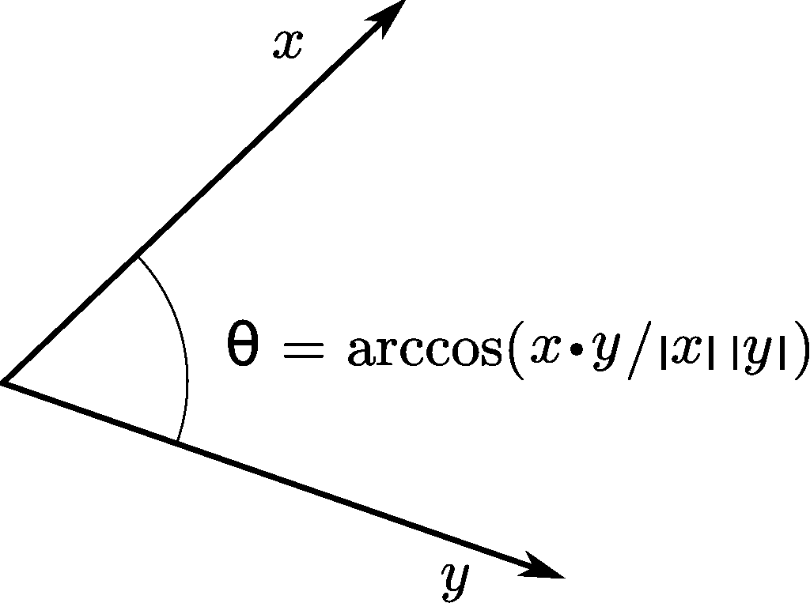
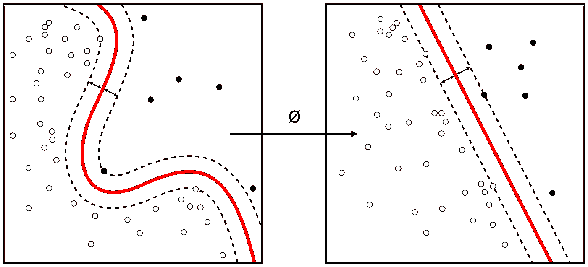

# 点积在人工智能中的力量

> 原文：[`towardsdatascience.com/the-power-of-the-dot-product-in-artificial-intelligence-c002331e1829`](https://towardsdatascience.com/the-power-of-the-dot-product-in-artificial-intelligence-c002331e1829)

## 简单工具如何产生惊人的复杂性

 [Manuel Brenner](https://manuel-brenner.medium.com/?source=post_page-----c002331e1829--------------------------------)

·发表于[Towards Data Science](https://towardsdatascience.com/?source=post_page-----c002331e1829--------------------------------) ·阅读时间 9 分钟·2023 年 5 月 15 日

--

将简单的事物放大以实现更复杂的目标是一个强大的理念，这一理念奠定了[生命](https://manuel-brenner.medium.com/the-importance-of-noise-327fcab7c4fb)、计算机（基于[Turing 机](https://medium.com/discourse/a-non-technical-guide-to-turing-machines-f8c6da9596e5)的简单性）以及深度学习技术（基于神经网络中神经元的理念）的基础。

[更多往往不同](https://manuel-brenner.medium.com/more-is-different-a49e833260b3)，我们继续观察到随着最先进的架构不断扩展（像[GPT](https://arxiv.org/abs/2005.14165)这样的语言模型正在改变世界），这导致了更好的泛化和令人印象深刻的结果。

研究人员声称，大型语言模型展示了[涌现能力](https://openreview.net/pdf?id=yzkSU5zdwD)，这些能力无需过多的架构创新，而（可以说）主要来自计算资源的增加和大规模重复简单操作（有关警告，请参见[这篇文章](https://arxiv.org/abs/2304.15004)）。

尽管训练深度学习模型需要社区多年积累的独创性和技术，但大多数深度学习方法的基本构建块仍然相当简单，仅由少量的数学操作组成。

也许最重要的是点积。在本文的其余部分，我想深入探讨点积的作用、它为何如此重要，以及为何将其规模化已实现令所有与之接触的人感到惊讶的人工智能水平。

人工智能作为点的产物（DALL-E 可能有点误解了我，但它仍然看起来很酷）。

想象一下你在像 Netflix 这样的公司工作，并被分配了选择电影以推荐给数百万不同用户的任务。每个用户都有自己独特的口味，而电影的选择有数百万部，因此这是一项相当艰巨的任务。

解决这个问题的一种方法是列出电影的几个不同属性，例如电影与特定类型（例如评估它是动作片还是情感戏剧）的对齐程度。还可以列出其他信息，例如喜剧内容、一些外部因素，如电影长度、是否由 Marvel 或 Disney 制作等。然后将所有电影的属性列表放入一个向量中。

了解用户口味的一个简单方法是直接查看该用户最喜欢的电影或最近观看的几部电影，这将产生第二个向量，从而给我们提供用户口味的一个概念。

然后可以通过计算新电影与用户最喜欢的电影的相似度来简单地推荐新电影，这些相似度是根据电影属性的向量空间中的某种相似度度量来计算的。

这就是点积，AI 最喜爱的相似度度量，登场的地方。

点积是一个简单的数学运算，用于测量两个向量之间的相似度。数学上，两个向量 x 和 y 的点积计算公式为：

`x · y = Σ (x_i * y_i) for i = 1 to n`

其中 `x_i` 和 `y_i` 分别是向量 x 和 y 的分量，n 是向量的维度。它也可以写作：

`x · y = |x| * |y| * cos(θ)`

其中θ是两个向量之间的角度，||表示它们的长度。在这种解释下，点积测量了 x 和 y 的对齐程度。如果两个向量平行，则点积对应于它们的长度。如果向量彼此垂直，则点积为零。

BenFrantzDale 在英文维基百科，CC BY-SA 3.0

点积通常与余弦相似度结合使用，后者通过向量的大小对点积进行标准化，提供一个对大小不变的相似度度量：

`cosine_similarity(y, x) = (y · x) / (|y| * |x|)`

从几何上讲，点积可以被视为一个向量在另一个向量上的投影。当你计算两个向量 x 和 y 的点积时，可以把它看作是将向量 x 投影到向量 y（或反之），然后将投影的长度乘以向量 y 的长度。

投影是一个重要概念，并且有一个很好的解释：它们可以被认为是向量所编码的不同特征的维度比较。

回到之前的例子，考虑两部电影，电影 A 和电影 B。为了简化起见，假设这两部电影通过两个不同的属性来表征：动作强度（AI）和情感深度（ED）（通常，这些向量当然可以大得多）。向量的第一个组件代表动作强度，第二个组件代表情感深度。假设这两个属性的测量范围是-5 到 5，其中-5 表示最不强烈或最不深刻，5 表示最强烈或最深刻。

一部电影，一部相对浅显的爆米花娱乐动作片，其动作强度为 4，情感深度为-3。它的向量表示为 A = [4, -3]。

电影 B 是一部 4 小时的黑白冥想片，关于塞尔维亚政府，[从鸽子的视角](https://knowyourmeme.com/memes/film-bros-when-you-tell-them-you-want-to-watch-a-marvel-movie)看待。它在情感上相当要求，但没有很多动作场景，评分为 B = [-4, 4]。

我们可以通过点积来比较这两部电影，计算结果为

A · B = (4 * -4) + (-3 * 4)= -28

通过两向量的大小进行归一化，这得到了

-28/(sqrt(25)*sqrt(32))= -0.99。

正如预期的那样，这两部电影的相似度极低，因此它们的余弦（不）相似性得分接近-1。

那么，为什么这个简单的比较两个向量相似性的操作在 AI 中如此重要？

机器学习，也许更广泛地说，(人工)智能的核心，依赖于在庞大的规模上比较模式并衡量其相似性。

然而，提出用于比较的模式并非易事。

我在之前的示例中略过的一部分是如何为电影制定标签。动作强度和情感深度并不是从电影的真实数据中直接提取的，而是由人类评估得出的，他们进行复杂的认知（主观）任务——观看电影并将其转化为明显低维的表示，从中可以看出这些电影的差异。从电影的像素空间的角度来看（对于一部 4K 的 2 小时电影，这些像素大约是 1.4*10¹²），这是一种巨大的维度降低，其中包含个人的偏见和先验知识。

复杂非线性变换的概念是使点积强大的第二个重要因素。它将输入转换为在相应学习问题的背景下比较其相似性变得有意义的表示，例如分类任务或回归问题。

将非线性变换与点积相结合是神经网络核心功能的一部分。在这里，点积用于计算每个神经元中输入的加权和，这与非线性变换（激活函数，如 tanh 或 ReLU 函数，加上网络的学习权重）结合，构成了所有神经网络运行的基本机制。

这种组合在核函数的背景下变得更加清晰。

核函数使我们能够比较新变换空间中点的相似性。它通过计算在（通常是更高维度的）投影空间中变换后的数据点之间的点积来实现这一点。巧妙之处在于，“核技巧”允许在不显式计算变换的情况下进行这一计算，这可以节省大量资源，并在支持向量机（SVMs）中找到应用，结合核技巧，构成了近年来最强大和最具影响力的算法之一。

核机器结合了非线性变换，以找到一个特征空间，在这个空间中类别标签容易被分开。原作者：Alisneaky Vector: Zirguezi, CC BY-SA 4.0

这些基本见解可以与当前市场上的最热门模型连接起来：大型语言模型。

大型语言模型的一个标准任务是翻译两种语言之间的句子，比如在英语和德语之间：

> “我正在阅读一篇关于点积在人工智能中重要性的文章。”
> 
> “Ich lese einen Artikel über die Bedeutung des Skalarproduktes für die KI。”

两个句子的含义大致相同，但它们的表示方式却显著不同。

翻译任务可以被表述为找到单词的非线性变换，这种变换对应于潜在语义空间中大致相同的位置，从而捕捉它们的“意义”。翻译的质量可以通过实现的相似度来衡量。

如果“测量相似性”还没有让你产生强烈的兴趣，那么我在这篇文章中的表现还不够好。

确实，点积在变压器模型的核心中出现，这些模型已经成为现代自然语言处理（NLP）以及许多其他机器学习任务的基础。

自注意力机制是变压器模型的一个关键组成部分。自注意力机制使模型能够权衡不同输入元素之间的重要性。这使得模型能够捕捉数据中的长程依赖关系和复杂关系。在自注意力机制中，点积被用来计算注意力得分和形成上下文感知的输入元素表示。

输入元素（通常是输入文本的嵌入/分词版本）首先被线性投影到三个不同的空间：查询（Q）、键（K）和值（V），使用各自的学习权重矩阵。这会为每个输入元素生成三组向量：查询向量、键向量和值向量。

点积随后用于计算每对查询向量和键向量之间的注意力分数（score_ij = q_i · k_j）。

这衡量了查询向量和键向量之间的相似性，决定了模型对每个输入元素相对于其他所有元素的关注程度。

在计算所有相似性分数后，分数会被缩放并通过一个***相似性函数***，然后可以用来计算上下文函数，该函数又是注意力分数和值的简单总和：(context_i = Σ (attention_ij * v_j))

[通常选择的相似性函数是 softmax，可以看作是一种核函数](https://arxiv.org/pdf/2112.04035.pdf)，它是一种非线性变换，可以在元素之间进行比较，并估计哪些元素可能对预测有用。根据具体问题，也可以使用其他核函数。从更根本的角度来看，变换器可以被视为核机器（更准确地说是[深度无限维非墨瑟二元核机器](https://arxiv.org/abs/2106.01506)，如本文讨论）。

与其他示例一样，点积与输入和输出文本的非线性变换及投影结合，定义了自注意力机制。

我希望能够说服你，点积在人工智能中扮演了关键角色，尤其是在其最新的实例中。虽然在某些特定背景下，其他向量之间的距离/相似性度量（如欧几里得距离、切比雪夫距离、马哈拉诺比斯距离等）可能更为合适，但点积可能是最广泛使用的，并且构成了量化数据中相似性、关系和依赖性的基础构件。当与非线性变换结合时，点积处于各种算法和模型的核心，从支持向量机到神经网络，再到 Transformers 中的自注意力机制。

随着人工智能近年来取得的显著进展，我发现反思构成其基础的操作的简单性和适应性非常有趣。

有时看到这种策略的有效性可能有些令人害怕：[在最近的播客中](https://www.youtube.com/watch?v=VcVfceTsD0A)，Max Tegmark 评论了训练大型语言模型背后令人惊讶的简单性/愚蠢性（只需给它们大量文本，并使用自注意力的变换器预测下一个单词/句子）。在某些方面，智能可能比我们想象的更简单，正如大多数与 ChatGPT 互动过的人所确认的那样。

这具有重要的意义：计算机非常擅长以可靠和快速的方式执行一些非常简单的任务，并将其扩展到 Nth 级别。随着摩尔定律的承诺，我们将继续扩展这些模型。

这些是令人着迷且可能危险的时期，很可能点积将位于其中的核心。
