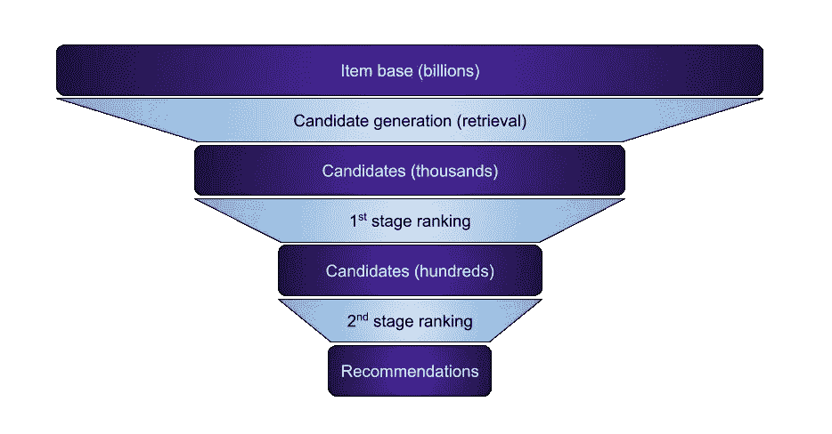
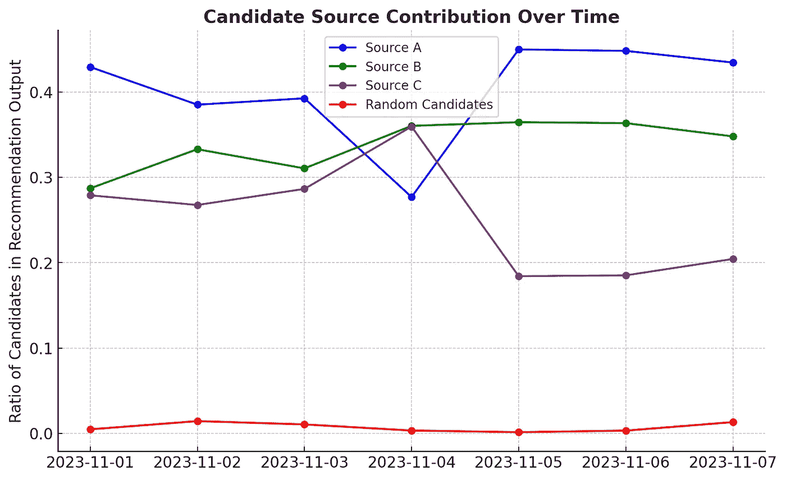
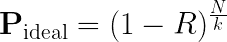

# 对早期排序阶段的原则性方法

> 原文：[`towardsdatascience.com/the-principled-approach-to-early-ranking-stages-05ce49692f7c?source=collection_archive---------7-----------------------#2023-12-06`](https://towardsdatascience.com/the-principled-approach-to-early-ranking-stages-05ce49692f7c?source=collection_archive---------7-----------------------#2023-12-06)

## 一种系统化的方法用于设计和评估推荐系统中的候选生成和早期排序阶段，并对核心指导原则进行深入分析。

 [Michael Roizner](https://roizner.medium.com/?source=post_page-----05ce49692f7c--------------------------------)

·

[关注](https://medium.com/m/signin?actionUrl=https%3A%2F%2Fmedium.com%2F_%2Fsubscribe%2Fuser%2F1bee5af37d8&operation=register&redirect=https%3A%2F%2Ftowardsdatascience.com%2Fthe-principled-approach-to-early-ranking-stages-05ce49692f7c&user=Michael+Roizner&userId=1bee5af37d8&source=post_page-1bee5af37d8----05ce49692f7c---------------------post_header-----------) 发表在 [Towards Data Science](https://towardsdatascience.com/?source=post_page-----05ce49692f7c--------------------------------) ·9 分钟阅读·2023 年 12 月 6 日

--

众所周知，在推荐系统中，构建推荐有几个阶段：首先是候选生成，也常被称为检索，其次是一个或多个排序阶段。学术论文对早期阶段关注不多，但在实际应用中，这些阶段非常重要。如何衡量它们的质量也同样重要。

作者插图

候选生成通常是由不同来源的组合来组织的：

+   最受欢迎的项目，

+   类似于用户的历史记录，

+   [ANN](https://en.wikipedia.org/wiki/Nearest_neighbor_search) — 通过嵌入相似（例如，[HNSW](https://github.com/nmslib/hnswlib)），

+   在不同层次上结合之前的方法：例如，从用户的历史记录（或 ANN，或热门项目）中提取类别，然后从中选择流行的项目。

尽管每种方法本身可能不复杂，但整体组合却相当复杂，促使人们思考：如何优化它？要做到这一点，当然需要定义究竟需要优化什么，即应该使用什么指标来衡量候选生成的质量。

尽管我们的讨论集中在候选生成阶段，但值得注意的是，这些原则同样适用于所有早期排名阶段，因为它们也为后续阶段提供候选项。

有多种方法。有时质量根本没有被衡量（或仅凭目测），这一阶段也没有系统地优化。有时，会以某种方式衡量候选项的整体相关性。如果系统推荐一些异常内容，这也被认为是候选生成中的一个问题。有时，这种相关性甚至与最终阶段优化的内容进行对比。也就是说，候选项应该已经足够相关，无论如何衡量，最终排名将选择最具吸引力的（有吸引力的、可点击的等）。

有时，特别是在论文中，会使用*HitRate@k*、*Recall@k*、*Precision@k*、*MRR*、*NDCG*等指标，仅关注正向（相关）文档。如果用户随后与某个文档进行互动，则认为该文档是相关的。我更倾向于这种方法，但它存在显著的偏差问题，例如，用户往往会与系统推荐的项目进行更多互动。

有一段时间，我尝试制定一种不同的候选生成方法，并一直支持它。幸运的是，我不是唯一的支持者 — 这种方法已在各种系统中使用（例如，[这篇关于扩展 Instagram Explore 推荐系统的文章](https://engineering.fb.com/2023/08/09/ml-applications/scaling-instagram-explore-recommendations-system/)中详细介绍）。然而，我不确定它是否可以称为行业标准 — 确实有一些主要系统没有使用它。

该方法基于以下原则：

> ***早期阶段的主要目标是从最终排名的角度找到最佳文档。***

简而言之，目标是找到最佳的文档。最佳的定义不是基于任何相关性，而是由当前最终排序器来决定。最终由排序器选择的候选项是好的，而其他的则不然。如果排序器发生变化（且这种变化可能很频繁），则质量评估也会随之变化。

（对于多阶段排名可能会有修改：可以使用最终排名器专门评估早期阶段的质量，或者使用下一阶段的排名器。也就是说，通过下一阶段但未通过最终阶段的候选项可以被视为负面或正面。我不确定哪种方法更好。）

尽管这种方法并不完美，我个人认为这是唯一可行的方法，意味着只有通过这种方法才能长期系统地改善所有阶段的质量，而不会遇到基本问题。至少，我不明白如何用其他方法实现这一点。

概述了这种方法的基本原则之后，现在让我们深入探讨其优缺点，首先从其潜在的缺点入手。

## 方法的缺点

+   整个候选生成过程，包括其质量如何衡量，开始显著依赖当前的排名方法。这增加了复杂性，在进行比较时考虑这一点是很重要的。当排名器发生变化时，早期阶段需要重新训练。

+   大多数情况下，系统最初是在不遵循这一原则的情况下构建的。将系统从另一种状态转变为遵循这一原则可能非常具有挑战性。特别是，如果系统的排名相当低（但由于各种技巧的存在，推荐结果是可接受的），那么遵循这一原则将不会改善系统，反而可能在当前显著恶化推荐结果。

+   这一原则假设排名器应在整个文档库中运行良好。否则，如果有质量低下的文档被错误地推荐，那么在试图取悦排名器时，候选生成过程最终会发现它们也被推荐出去。与排名器只操作一组已经相当不错的候选项相比，这使得排名器的训练变得更加复杂。

+   候选生成并不试图改善服务的端到端指标。根据这一原则可以改善它，但最终可能以失败告终。（然而，这恰好表明排名存在问题，比如错误的目标。）这增加了工作的复杂性：你不断改进，但最终却无法部署它。

+   对于[产品规则](https://roizner.medium.com/from-hacks-to-harmony-structuring-product-rules-in-recommendations-838af0873f18)的支持有限。这一原则规定，除了硬规则之外的所有规则应在最后阶段应用，早期阶段将会适应它们。这不仅涉及到技巧，还包括改进推荐系统各个方面的合理方法，如探索、多样性等。你必须提供多样化的候选项，因为排名器会选择它们。

## 从黑客到和谐：在推荐系统中构建产品规则

### 不要让启发式方法削弱你的机器学习，学会将它们结合起来

towardsdatascience.com

在探讨了局限性之后，让我们现在转向这种方法的优势。

## 这种方法的优点

+   这一原则基于分解。它为早期阶段提供了更清晰且可测量的目标，显著简化了系统。推荐的目标和损失的选择复杂性集中在排名阶段（这是无法避免的一个方面），而早期阶段主要集中在有效找到顶级候选者的功利任务上。因此，早期阶段仅作为加快排名过程的工具。

+   在这一原则中，没有根本性的限制。如果想象一个理想的推荐系统，什么也不会阻止它以这种方式构建。（对于其他方法，这一点不能成立——完美的推荐并不一定能够准确猜测用户将与之互动的内容！）随着排名的改善，这种简化的候选生成指标会越来越接近端到端指标。这类似于某些圈子里广为人知的迭代方法：‘改进指标——基于这些指标改进产品’。

+   不同的排名阶段彼此对齐；它们不会试图优化不同的内容。在系统中，如果不是这种情况，例如，如果你将候选者的总数翻倍，那么系统的整体质量可能不会提高，甚至可能会下降。例如，如果早期阶段优化某种相关性，那么额外的候选者可能会较少相关，从而整体相关性下降（尽管点击率可能会增加）。

+   由于分解的观点：早期阶段的衡量（因此优化）要容易得多。评估过程将在下节中讨论。训练基本上归结为提炼排名模型。（尽管有一些细微差别。例如，记录一些没有进入排名前列的候选者是比较好的。）

+   此外，对于训练和测量早期阶段，我们不再需要用户，这意味着不必在他们身上推出新方法。例如，可以使用爬虫技术，正如我们稍后将讨论的，通过向排名服务发送一系列使用新候选者的请求。

## 衡量候选生成

现在，让我们深入探讨文章中最实际的部分，讨论如何根据我们之前概述的原则在实践中测量候选生成（或排序的早期阶段）的质量。

首先，让我们检查一个简化但非常重要的情况：当排序完全基于一个最终模型的分数时。在这种情况下，我们可以简单地比较这个模型对于两组候选的平均分数。如果一种方法发现最终模型为其分配的预测高于另一种方法，那么第一种方法更好。

是否取整个输出的平均预测，仅取前几个位置，还是按位置递减（类似于[*IDCG*](https://en.wikipedia.org/wiki/Discounted_cumulative_gain#Normalized_DCG)——*NDCG*中的分母）似乎不是非常关键。可以根据个人喜好选择这些选项中的任何一个。

不过，需要考虑一个技术细节。如果这样的指标是离线测量的，需要能够在自定义候选项上运行排序（或整个推荐系统）。这可以通过在历史查询上进行模拟（离线重放——即试图回顾性地重现所有实体的所有信息）或通过抓取（如前所述，向推荐服务发送大量新查询，以便它使用感兴趣的候选生成方法）来完成。在这两种情况下，都会为相同查询的不同生成方法获得结果（最终模型的预测）。这对指标的敏感性是有益的。

然而，如果这个指标是在生产服务中在线测量的，那么所有计算都可以简单地基于模型的日志预测进行。这要简单得多，但灵活性较差，并且比较将跨越不同的查询。指标的敏感性降低（可能是因为某些方法恰好接收到更复杂的查询）。

现在让我们转到一般情况：最终排序不仅仅是某个模型的预测，还涉及大量其他逻辑、重排序、业务规则、随机化等。当你考虑如何在这种松散的表述中比较不同的候选集（什么是好，什么是坏）时，并不是很明显。

不过，我曾经设计了一种方法，结果非常简单有效。到目前为止，我还没有看到它在其他地方提到过。

方法如下。我们向候选源列表中添加一个特殊的源，该源生成随机候选（例如，均匀分布）。我们为这个源分配一个小的固定配额（例如，50 个候选）。然后我们观察推荐的文档中有多少比例最终来自这个源。如果我们的主要候选生成足够好，那么随机候选很少能胜过它，即很少进入前列。如果它很差，那么随机候选会经常超越它。

仅用于说明目的的合成数据

当然，我们假设添加随机候选者不会显著恶化系统：大多数候选者不会被推荐，而那些被推荐的候选者不会大幅降低用户体验，并且还会为用户和排名模型增加探索（它会在这些示例上进一步训练）。如果情况并非如此，那么首先需要‘修正排名’。😉

这种方法最酷的地方在于它不仅可以作为候选生成的度量标准，还可以作为整个系统健康状况的监控工具，包括最终排名。它检查候选生成与排名的一致性（是否为排名优化）。如果排名本身因某些原因下降，那么候选者也会变得不那么适合它。我们在实践中见证了这一点，当其中一个组件发生故障时，响应中随机候选者的比例增加了。

顺便提一下，这个特殊来源的随机性可以进行调整。如果你使用的不是均匀分布，而是与文档的受欢迎程度成比例的分布，它会成为更强的‘对抗性’参与者（这也可能增加敏感性）。然而，使用均匀抽样，可以提供一个关于我们的候选生成理想的查询比例的分析估计（即，即使我们将整个数据库添加到候选者中，结果也不会改变）：

在这个公式中，*N* 代表数据库中的候选者总数，*k* 是使用的随机候选者数量，*R* 表示至少有一个随机候选者出现在输出中的查询比例。

## 结论

在这一探索过程中，我们专注于推荐系统中候选生成和早期排名阶段的一个具体原则。通过全面检查其优点和挑战，并提出实用的评估方法，我们强调了这一原则作为改进这些系统的强大工具的潜力。采纳这一原则不仅简化了推荐的复杂过程，还确保了效率和有效性。随着我们继续完善和应用这一原则，它将成为推动推荐系统领域发展的有希望的方向。
