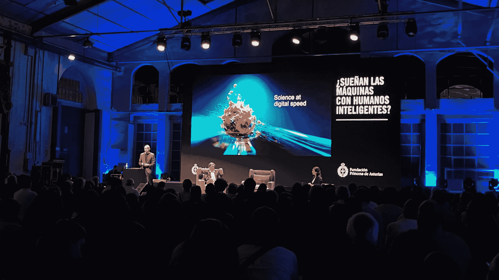

# 现代计算机科学家的原则

> 原文：[`towardsdatascience.com/the-principles-of-a-modern-computer-scientist-8be9e7494e7e?source=collection_archive---------10-----------------------#2023-05-31`](https://towardsdatascience.com/the-principles-of-a-modern-computer-scientist-8be9e7494e7e?source=collection_archive---------10-----------------------#2023-05-31)

## 未来人工智能的发展中，实践者可以从当前计算机科学家们的成就和不足中学到什么

 [Fabien Girardin](https://girardin.medium.com/?source=post_page-----8be9e7494e7e--------------------------------)

·

[关注](https://medium.com/m/signin?actionUrl=https%3A%2F%2Fmedium.com%2F_%2Fsubscribe%2Fuser%2Ff2dadcd2686c&operation=register&redirect=https%3A%2F%2Ftowardsdatascience.com%2Fthe-principles-of-a-modern-computer-scientist-8be9e7494e7e&user=Fabien+Girardin&userId=f2dadcd2686c&source=post_page-f2dadcd2686c----8be9e7494e7e---------------------post_header-----------) 发表在 [Towards Data Science](https://towardsdatascience.com/?source=post_page-----8be9e7494e7e--------------------------------) ·2 分钟阅读·2023 年 5 月 31 日

--

Demis Hassabis 在 2022 年 11 月于 Asturias 公主基金会的演讲。照片由 Fabien Girardin 拍摄。

也许像你一样，在过去几年中，我参加了许多关于人工智能过去、现在和未来的活动。人工智能先驱、DeepMind 联合创始人[Demis Hassabis](https://en.wikipedia.org/wiki/Demis_Hassabis)在西班牙奥维耶多的一个活动中担任演讲嘉宾。当时，我对他的辉煌职业生涯和对 AlphaFold 的迷人实验知之甚少。

我认为 Demis Hassabis 是现代计算机科学家的典型代表。他不仅展示了创造力和想象力，还具备逻辑、抽象思维和工程技能。当前主流的科技文化受到“[确定性思维](https://zephoria.medium.com/resisting-deterministic-thinking-52ef8d78248c)”的驱动。愿景是极端化的。未来感觉是二元的，乌托邦和反乌托邦的思维同时存在。相比之下，Demis 谈论 AI 时充满细微差别；他意识到其他学科的贡献，并能够阐述他的工作如何在社会与技术的共同进化中发挥作用。我离开活动时感到受到了启发。

从我的一代计算机科学家的成就和不足中，可能会得出一套原则。这些“现代计算机科学家的原则”可以作为现在在校的年轻一代未来实践的蓝图。其中一些原则可能如下所示。

现代计算机科学家重视*：

## **想象力胜过逻辑**

逻辑和抽象思维是必不可少的，但它们可能将任何挑战限制为狭窄的、有限的解决方案。想象力是现代计算机科学家探索最广泛可能性的关键因素。

## **责任胜过敏捷**

在科技界，“短冲刺”、“加速器”和“敏捷方法”等术语将优化和快速执行奉为圣经。相比之下，现代计算机科学家以识别其工作潜在后果为荣。这需要时间和耐心。

## **创造力胜过流程**

计算机科学的实践不仅仅限于遵循结构良好的迭代过程。现代计算机科学家从多个角度看待挑战。他们首先运用创造力进行思考。他们在安全的环境中构建实验和原型，以创造多个选择路径。

## **细微差别胜过信念**

现代世界奖励说服力。现代计算机科学家受怀疑驱动。他们知道如何倾听和挑战信念。他们的使命是将这些信念综合成细致的结论。

* *虽然右侧的项也有其价值，但现代计算机科学家更重视左侧的项。当然，可能还有更多，这些原则不应被视为普遍适用的规则。*

感谢[Pelayo González Arbues](https://pelayoarbues.github.io/)邀请我参加此次活动，祝贺[Irene Díaz](https://www.linkedin.com/in/sirenediaz/)主持了激励人心的讲座和讨论。
