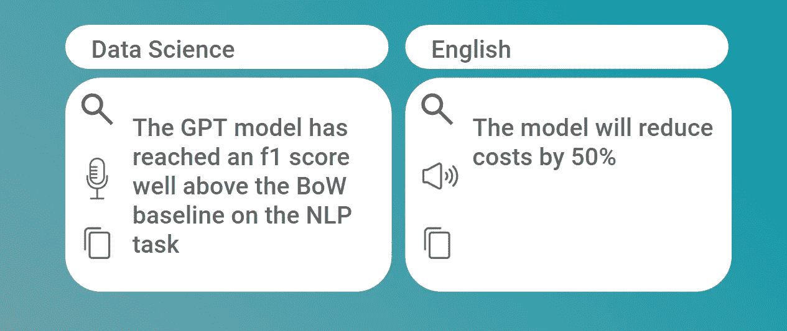
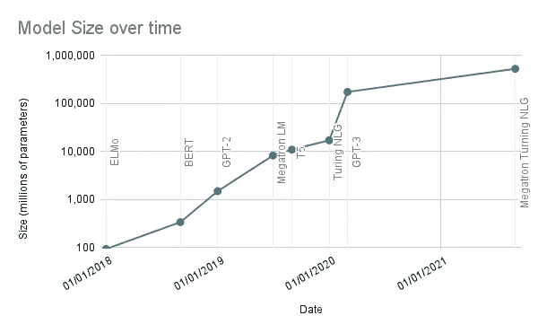
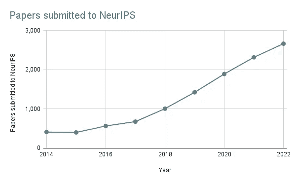
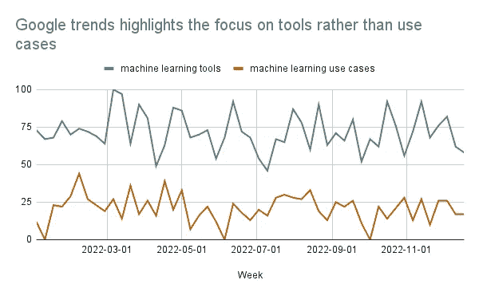

# 数据科学的真正力量隐藏在明面上

> 原文：[`towardsdatascience.com/the-real-power-of-data-science-is-hiding-in-plain-sight-700079f20d53`](https://towardsdatascience.com/the-real-power-of-data-science-is-hiding-in-plain-sight-700079f20d53)

## 意见

## 如果数据科学家专注于方法而非影响力，他们可能会掩盖自己能够为组织带来的真正价值

 [Josh Taylor](https://medium.com/@thejoshtaylor?source=post_page-----700079f20d53--------------------------------)

·发布于 [Towards Data Science](https://towardsdatascience.com/?source=post_page-----700079f20d53--------------------------------) ·5 min read·2023 年 1 月 18 日

--

数据科学的真正力量通常隐藏在不必要的复杂性背后。 来源：作者

数据科学行业内部的人与其他人之间正在形成障碍。

虽然数据科学的入门门槛众所周知；只有 2.4%的从业者拥有高等教育后的正式教育，超过一半拥有硕士或博士学位[1]，但另一个障碍正在形成…

现在存在一个*理解的障碍*。

理解数据科学是什么、它能提供什么以及如何应用变得越来越困难。尽管这一直是一个复杂的行业，但最近的进展使其对外界变得晦涩难懂。

这个障碍随着时间的推移而增长，可能会阻碍人工智能应用的进展。近年来机器学习和人工智能的巨大进展如果无法跨行业、企业和组织应用，那也毫无意义。

本文探讨了这种差距是如何出现的，以及可以采取哪些措施来解决这一问题。

# 我们是如何来到这个位置的？

理解障碍的形成是由于三个并行发展的趋势：

## **1\. 算法的复杂性正在指数级增长。**

随着数据科学的发展，其基础算法也在不断成熟。为不同的应用场景创建了专门的模型，从图像识别到自然语言理解以及介于两者之间的各种架构都在被使用。

除了各种算法的爆炸性增长外，模型的规模和复杂性也随着时间的推移呈指数级增长，以实现更高的性能水平。

下图就是一个很好的例子。变压器模型，2018 年的全新架构，在短短几年内从包含几亿个参数的模型发展到超过 5000 亿个参数：

机器学习模型的复杂性在过去四年中呈指数级增长。来源：作者

这种复杂性导致了行业从业者在不断研究和理解新架构时付出了巨大的“开销”。

这也导致了从个人转向大型公司进行新模型开发的转变。

训练一个 5000 亿参数的模型所需的资源远远超过个人甚至小型组织的能力。只有大型国际公司才能在这种规模上运营。

## 2\. 新思想的产生和分享速度在加快。

不足为奇的是，数据科学在研究领域是一个增长领域。然而，新思想在行业内的创造和分享速度持续加快。

下图显示了提交并被接受到领先的机器学习和神经科学会议 NeurIPS 的论文数量。

仅在过去五年中，就出现了三倍的增长。

在过去五年中，提交给 NeurIPS 的论文数量增加了三倍。来源：作者

此外，论文发表与提交会议之间的时间框架显著缩短[2]。创新的速度现在如此之快，以至于未提交的论文有可能在下一届年会上变得过时。

新论文的发布量、种类和速度现在远远超出了任何个人能够跟上的程度。需要做出选择，要么专注于特定领域，要么接受对行业的更广泛视角也是浅显的。

对于行业外的人来说，这使得理解当前发展状态以及这些状态在实际应用中的含义几乎是不可能的。

## 3\. 随着数据科学家社区的成熟，它创造了进一步的理解障碍。

尽管上述前两点是新兴和快速增长行业的副作用，但第三个阻碍理解的领域完全是自我造成的。

数据科学社区充斥着[术语和技术词汇](https://www.thekerneltrip.com/statistics/acronyms-of-data-science/)，关注工具、方法和技术而非结果。

2022 年的谷歌搜索量始终远超用例搜索。来源：作者，数据来自谷歌趋势

这可能导致一种心态，即为不存在的问题创造解决方案；大量精力被耗费在攀登排行榜上，而不是将思想应用于现实世界。

行业语言也变得越来越技术化。这在更成熟的职业领域如法律和金融中反复出现；它有助于创建身份感和归属感。它还可以帮助区分在某一领域中有知识的人和没有知识的人。

然而，技术语言也是排他性和令人困惑的。对于一个建立在思想共享基础上的社区来说，看到人为障碍被建立起来是令人遗憾的；现有的障碍已经足够多了。

# 如何解决理解障碍的问题？

答案很简单：

+   **简单性**应被看重于**复杂性**。

+   应将重点放在**实际成果**上，而不是理论概念。

+   **教育和参与**行业之外的利益相关者应被视为任何数据科学角色中**必不可少**的一部分。

从根本上讲，需要将数据科学从作为独立实体的观点中转变过来。它应被视为企业和组织日常运营的一部分。

这应从根本上将重点从技术复杂性转移到实际影响和成果上。

## 参考文献

1.  [Kaggle 数据科学调查 2022](https://www.kaggle.com/c/kaggle-survey-2022/data)

1.  [微软研究。2018 年 11 月](https://www.microsoft.com/en-us/research/project/academic/articles/neurips-conference-analytics/)
