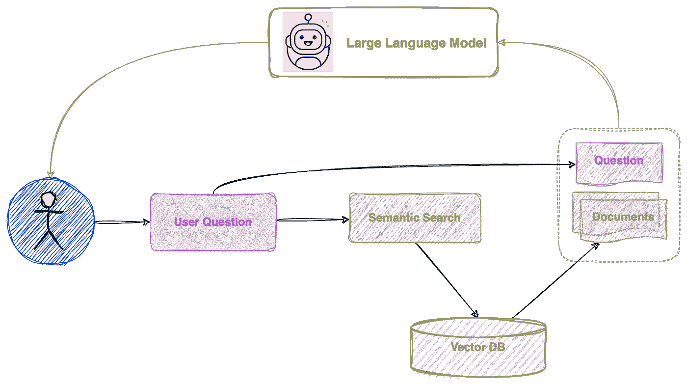
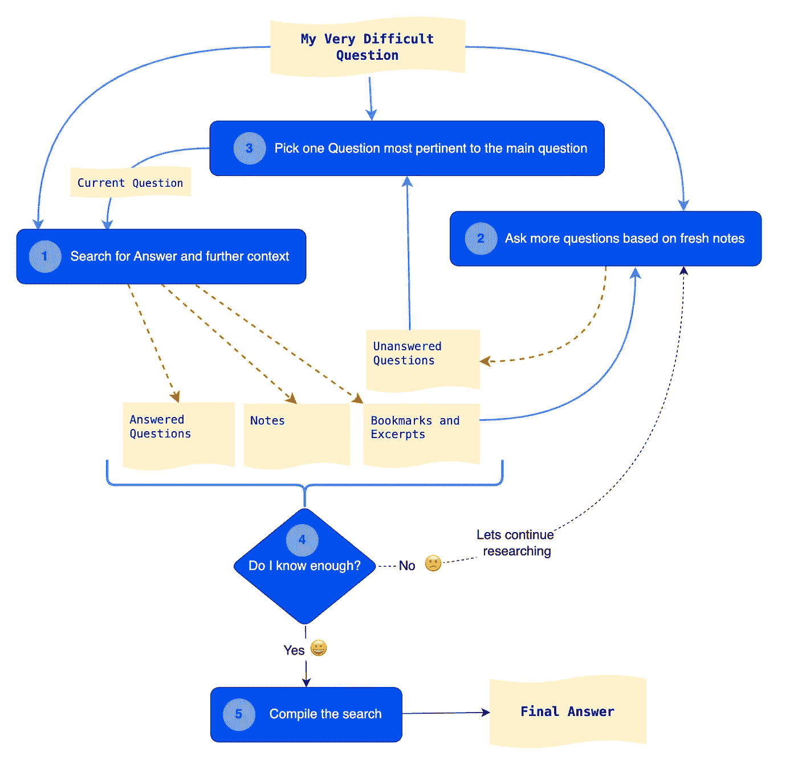
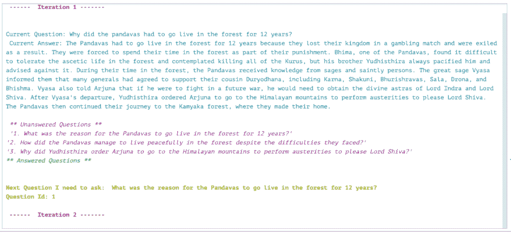

# 研究代理：应对基于大量文本语料库回答问题的挑战

> 原文：[`towardsdatascience.com/the-research-agent-4ef8e6f1b741?source=collection_archive---------0-----------------------#2023-08-29`](https://towardsdatascience.com/the-research-agent-4ef8e6f1b741?source=collection_archive---------0-----------------------#2023-08-29)

## 我制作了一个**自主 AI 研究代理**，可以通过深度多跳推理能力回答困难问题

[](https://medium.com/@rahul.nyk?source=post_page-----4ef8e6f1b741--------------------------------)[](https://towardsdatascience.com/?source=post_page-----4ef8e6f1b741--------------------------------) [Rahul Nayak](https://medium.com/@rahul.nyk?source=post_page-----4ef8e6f1b741--------------------------------)

·

[关注](https://medium.com/m/signin?actionUrl=https%3A%2F%2Fmedium.com%2F_%2Fsubscribe%2Fuser%2F473e87f4b733&operation=register&redirect=https%3A%2F%2Ftowardsdatascience.com%2Fthe-research-agent-4ef8e6f1b741&user=Rahul+Nayak&userId=473e87f4b733&source=post_page-473e87f4b733----4ef8e6f1b741---------------------post_header-----------) 发表在 [Towards Data Science](https://towardsdatascience.com/?source=post_page-----4ef8e6f1b741--------------------------------) · 16 min 阅读 · 2023 年 8 月 29 日 [](https://medium.com/m/signin?actionUrl=https%3A%2F%2Fmedium.com%2F_%2Fvote%2Ftowards-data-science%2F4ef8e6f1b741&operation=register&redirect=https%3A%2F%2Ftowardsdatascience.com%2Fthe-research-agent-4ef8e6f1b741&user=Rahul+Nayak&userId=473e87f4b733&source=-----4ef8e6f1b741---------------------clap_footer-----------)

--

[](https://medium.com/m/signin?actionUrl=https%3A%2F%2Fmedium.com%2F_%2Fbookmark%2Fp%2F4ef8e6f1b741&operation=register&redirect=https%3A%2F%2Ftowardsdatascience.com%2Fthe-research-agent-4ef8e6f1b741&source=-----4ef8e6f1b741---------------------bookmark_footer-----------)

作者提供的图片（使用 Photoshop 生成填充）

# **问题介绍**

2021 年，我开始研究基于大量文本语料库回答问题的挑战。在预训练变换器普及之前，这个问题非常难以解决。

令我沮丧的是，我开始用《摩诃婆罗多》这一最复杂、最精细的故事之一进行实验。对于那些不熟悉这部作品的人来说，《摩诃婆罗多》是一部由 18 本书组成的总字数约为 180 万的作品。它是有史以来最长的诗歌，大约有 90,000 节。它的长度大约是《伊利亚特》和《奥德赛》总和的十倍。但《摩诃婆罗多》的震撼不仅在于长度，还有其广度。它在因果关系上高度非线性和复杂，拥有跨越七代的数千个角色，而这些角色中没有一个是完全善良或邪恶的。它对职责（业）、选择和人类存在，尤其是职责冲突和多重错误选择的冲突进行了深刻的哲学评论。《博伽梵歌》（印度教的核心哲学）也是《摩诃婆罗多》第六本书的一部分。

我将来自多个在线来源的[《摩诃婆罗多》文本数据](https://github.com/rahulnyk/mahabharata.git)整理成了一个干净的数据集。然而，我找不到一种方法来对这些文本实施有意义的问答。

不到两年的时间，一切都发生了变化。

AI 和大型预训练变换器的快速进步正在深刻而根本地改变技术世界。我对这一点感到着迷，就像现在大多数技术人员一样。

几个月前，我带着对新兴的提示工程艺术的初步了解重新审视了这个问题。但这次我有了一个大致的想法，即创建一个可以处理任何复杂知识库的**自主** **研究代理**。

《摩诃婆罗多》是最复杂的用例之一。然而，在每个知识领域，如法律、科学研究、教育、医疗等，每个项目都从对前人工作的深入研究开始。因此，这个问题是值得解决的。

## **研究代理**

在这里，我将讨论一个可以解决多跳 KBQA 问题并具备深度推理能力的**自主 AI 研究代理**的设计和实施。我会分享一个包含研究代理初步实现的 Python 笔记本的 git 仓库。如果你对这部分内容感兴趣，请随时跳到本文后面的实施部分。

如果你对了解更多关于 AI 代理、‘基于知识的问题回答’（KBQA）、‘为什么’、‘什么’以及 AI 研究代理的设计演变感兴趣，请继续阅读。

# **为什么？**

可能有人会问，为什么不直接使用 ChatGPT 接口提问。它已经在 2021 年之前生成的大量互联网数据上进行了训练，因此像《摩诃婆罗多》这样的文本语料库对它来说是已知的。

这是我的第一种方法。我问 ChatGPT 关于《摩诃婆罗多》的几个问题。我得到了对一些问题的良好回答。然而，大部分答案缺乏严谨性。这是可以预料的。GPT 是在通用数据集上训练的。它可以很好地理解和解释自然语言。它的推理能力也足够好。然而，它在任何特定领域都不是专家。所以，尽管它可能对《摩诃婆罗多》有一些了解，但可能不会给出深入研究的答案。有时 GPT 甚至可能没有任何答案。在这些情况下，它要么谦虚地拒绝回答问题，要么自信地编造答案（幻觉）。

实现 KBQA 的第二种最明显的方法是使用检索问答提示。这时，LangChain 显得极为有用。

## **检索问答**

对于那些不熟悉 LangChain 库的人来说，它是将 LLMs（如 GPT）用于代码中的最佳方式之一。这里是使用 LangChain 实现 KBQA 的方法。

[## 使用检索器进行问答 | 🦜️🔗 Langchain](https://python.langchain.com/docs/use_cases/question_answering/how_to/vector_db_qa?source=post_page-----4ef8e6f1b741--------------------------------)

### 这个示例展示了在索引上进行问答。

[python.langchain.com](https://python.langchain.com/docs/use_cases/question_answering/how_to/vector_db_qa?source=post_page-----4ef8e6f1b741--------------------------------)

总结一下，实现任何文档集合上的 KBQA 的步骤如下

+   将知识库拆分成文本块。

+   为每个文本块创建数值表示（嵌入）并将其保存到向量数据库中。

    *如果你的数据是静态的，第 1 步和第 2 步是一次性的工作。*

+   使用用户的查询在这个数据库上进行语义搜索，并获取相关的文本块。

+   将这些文本块与用户的问题一起发送到 LLM，并要求其回答。

这是该过程的图示表示。



作者通过 draw.io 创建的图片

那么，为什么要继续呢？这似乎是一个已解决的问题！

不太对 🙁

这种方法适用于简单问题和简单的事实知识库。然而，对于需要更深层次、多跳推理的复杂知识库和更复杂的问题则不适用。多跳推理指的是通过多个逻辑或上下文推理步骤来得出结论或回答问题的过程。

此外，LLMs 在一次提示中处理文本的长度是有限的。你可以当然逐个发送文档，然后通过每次调用来‘细化’或‘缩减’答案。然而，这种方法不允许进行复杂的‘多跳’推理。在某些情况下，使用‘细化’或‘缩减’方法得到的结果比仅仅将所有文档塞进一个提示中要好，但差距不大。

对于复杂的知识库，用户的问题本身可能不足以找到所有相关文档，从而帮助 LLM 得出准确的答案。

例如：

> 阿周那是谁？

这是一个简单的问题，可以在有限的背景下回答。然而，以下问题：

> 为什么《摩诃婆罗多》战争发生了？

这是一个在整个文本语料库中分布的背景问题。问题本身对其背景信息了解有限。找到相关的文本片段并在此基础上进行推理可能效果不好。

那接下来呢？

## **AI 代理**

这是 AI 出现后出现的最酷的概念之一。如果你不知道 AI 代理的概念，我迫不及待想向你解释，但我可能还是无法传达它的惊人之处。让我先用 ChatGPT 来解释一下。

> AI 代理，也称为“代理”，是指能够自主感知其环境、做出决策并采取行动以实现特定目标的软件程序或系统。AI 代理旨在模拟类似人类的行为，用于问题解决和决策任务。它们在定义的环境中操作，并与该环境互动，以实现期望的结果。

简单来说，代理是一个接受问题、决定如何解决它并然后解决它的程序。代理会提供一组工具，如函数、方法、API 调用等。它可以按任何顺序选择使用这些工具。与传统软件不同，传统软件中解决问题所需的步骤顺序是预先编程的。当然，这是一个非常模糊的定义。但你现在应该能理解了。

这是我为我们的 KBQA 用例尝试的两种不同的代理。

***ReAct*** 该代理使用 [‘ReAct’（推理与行动）风格的推理](https://www.promptingguide.ai/techniques/react) 来决定针对给定问题使用哪个工具。

这是 ReAct 代理的 langChain 实现：

[](https://python.langchain.com/docs/modules/agents/agent_types/react?source=post_page-----4ef8e6f1b741--------------------------------) [## ReAct | 🦜️🔗 Langchain

### 本文档展示了如何使用代理来实现 ReAct 逻辑。

python.langchain.com](https://python.langchain.com/docs/modules/agents/agent_types/react?source=post_page-----4ef8e6f1b741--------------------------------)

我为代理提供了以下工具供其选择：

+   带有文档存储的检索 QA 链。

+   字符表词汇表搜索（我使用预训练模型创建了一个带有命名实体识别的词汇表）

+   维基百科搜索。

ReAct 代理并没有给我带来好的结果，并且大多数时候无法收敛到任何答案。它与 GPT 3.5 的兼容性不好。它可能在 GPT 4 上表现更好，而 GPT 4 比 GPT 3.5 贵 20 - 30 倍，因此这可能还不是一个选择。

即使它收敛了，我也无法获得好的结果。可能在创建“反应”提示方面更有经验的人会做得更好。

***自我提问代理*** 这个代理根据原始问题提出后续问题，然后尝试找到中间答案。通过这些中间答案，它最终得出一个最终答案。这里是解释自我提问代理的文章

[](https://cobusgreyling.medium.com/self-ask-prompting-d0805ea31faa?source=post_page-----4ef8e6f1b741--------------------------------) [## 自我提问提示

### 自我提问提示是一种从链式思维提示演变而来的方法。下面是一些实际的例子和…

[cobusgreyling.medium.com](https://cobusgreyling.medium.com/self-ask-prompting-d0805ea31faa?source=post_page-----4ef8e6f1b741--------------------------------)

这种方法给了我一些不错的结果。它在单跳推理的情况下效果很好，但即使这样，对于需要多跳的问提也会失败。

例如，问题：

> 谁杀了卡尔纳，为什么？

用这种方法相对容易回答。

问题

> 为什么阿周那杀了他的半兄卡尔纳？

要回答这个问题要困难得多。它要求 LLM 知道阿周那不知道卡尔纳是他的半兄弟的事实。LLM 无法知道它需要知道这个事实，无论是通过理解问题还是通过基于原始问题提出进一步的问题。

# **人类研究过程**

再次引用 GPT

> AI 代理被设计成在解决问题和决策任务中模仿类似人类的行为。

所以，我的下一个想法是研究人类如何研究，也就是元研究。我想象自己坐在图书馆里（大学的怀旧情怀），能够轻松获取所有与我的研究主题相关的书籍。我拿出一个笔记本和一支笔，开始记录我在研究一个主题时遵循的过程。

这是我得到的结果。

**研究方法论：**

在一页上记下原始查询。

1.  我尝试通过阅读几本书来回答当前的问题。在过程中，我做了些笔记，并标记了一些我认为与当前问题最相关的摘录。

1.  我在这些摘录中总能发现许多未知之处。我记录下这些未知，并写下更多问题以帮助我了解这些未知。

1.  从这些问题中，我选择一个与原始问题最相关的问题。

1.  我回到第一步

经过几次这样的迭代，我问自己是否有足够的信息来回答原始问题。

如果是，那么干得好！

如果不是，那就继续努力吧。

看啊！

最终，我知道该编写什么代码。我希望通过一些提示工程，这个过程能给我比之前尝试的其他方法更深刻的答案。

剧透警告……确实如此！:)

在开始编码之前，我在互联网上搜索了类似的想法。我发现了 BabyAGI。真是一个奇妙的世界！

这是描述 [BabyAGI](https://github.com/yoheinakajima/babyagi/tree/main) 的一个仓库

我意识到 BabyAGI 与上述研究过程之间有许多相似之处。因此，我怀着感激之情，从 BabyAGI 实现中使用的提示中获得了一些灵感。

# **研究代理— 实现**

这里是使用惊人的 [draw.io](http://draw.io) 将相同的过程转换为流程图



作者提供的图像（使用 draw.io 生成）

图表中的每个蓝色框都是对 LLM 的调用。

## **组件**

1.  **QA 代理—** 搜索答案和进一步的背景信息

    这是一个简单的***‘stuff’*** 检索 QA 链，它使用了一个向量存储。在未来，这可以是一个使用向量存储、搜索 API 或维基百科 API、内容审核 API 和以往研究数据等工具的 AI 代理。这里的提示经过调整，以根据 1. 上下文（文档）和 2. 与***原始问题***的相关性来生成简洁的答案。

    除了第一轮外，***当前问题*** 总是步骤 2 中生成的中间问题，并在步骤 3 中选择。代理将中间答案附加到笔记中，并将最新的摘录（用于回答***当前问题***的文档）附加到书签中。最新的这些文档将在步骤 2 中使用。

1.  **问题生成器—** 根据新的笔记提出更多问题

    在这里，代理使用与***当前问题***匹配的最新向量搜索结果，并利用这些结果生成与***原始问题***相关的更多问题。它将这些问题附加到***未回答的问题***列表中。这里的提示经过调整，以确保新生成的问题不会与现有的问题列表重叠。

1.  **最相关问题挑选器—** 挑选出与原始问题最相关的一个问题

    这个提示从未回答的问题列表中挑选出一个与***原始问题***最相关的问题。这个问题将作为下一轮的***当前问题***。

    在下一轮中，代理会在生成一组新的问题后，从***未回答的问题***列表中删除这个问题。

1.  **分析器—** 我是否知道足够多？

    我使用了一个***max_iterations*** 参数来退出循环。现在这效果不错。然而，根据不断变化的上下文动态决定迭代次数或退出策略可能会更好。我将来会致力于开发一个可以自主完成这项任务的‘分析器’。

1.  **研究编译器—** 编译研究

    这是最终的提示。它利用研究过程中记录的笔记，得出对`原始问题`的详细`最终答案`。

## **结果**

研究代理在我尝试过的所有方法中是一个重大改进。它提供的答案比任何其他方法都更详细、准确。我玩了几个星期这个方法，对得到的答案的丰富性感到惊讶。

该代理在避免幻觉问题方面比任何以前的方法都有更大的进展。它会在初期的几次迭代中自动纠正产生的幻觉和事实错误。它在问题的深入处理过程中，结果会更为准确。

这是一个示例运行。

问题：*为什么潘达瓦斯必须在森林中生活 12 年？*

输出 —



如果你感兴趣，这是最终答案

```py
Final Answer: 
The Pandavas' decision to live in the forest for 12 years 
was primarily due to the circumstances and events that 
unfolded in their lives. After losing a game of dice to 
The Kauravas and the Pandavas were forced into exile for 
13 years, with the last year to be spent incognito. 
During their exile, they faced numerous challenges 
and hardships, including living in the forest.

Bhima contemplated killing all of 
the Kurus, but his brother Yudhisthira always 
pacified him, stating that it was not the opportune 
time to fulfil their desires. 
Thus, living in the forest allowed them to avoid 
confrontations and maintain peace.

During their time in the forest, the Pandavas faced several difficulties. 
One of the main challenges was Bhima's struggle to tolerate the ascetic 
life. He contemplated killing all of the Kurus, but his brother 
Yudhisthira always pacified him and advised against it. 
Additionally, the Pandavas had to live in the forest and depend 
on begging for their sustenance since their kingdom had been 
plundered in gambling. They were distressed by the loss of their 
kingdom and the insults to their queen Draupadi. The forest itself 
was also full of dangers, adding to their hardships. Furthermore, 
the Pandavas felt unable to fulfil the needs of certain pious Brahmanas 
who stayed with them in the forest, as they did not possess anything 
and were dependent on begging for their own survival.

Despite these challenges, the Pandavas made the most of their time 
in the forest. They received knowledge from sages and saintly persons, 
which helped them gain wisdom and spiritual insights. The great sage 
Vyasa informed them that many generals had agreed to support their 
cousin Duryodhana, including Karna, Shakuni, Bhurishravas, Sala, 
Drona, and Bhishma. Vyasa also told Arjuna that if he were to fight 
in a future war, he would need to obtain the divine astras of Lord 
Indra and Lord Shiva.

In light of this information, Yudhisthira ordered Arjuna to go to the 
Himalayan mountains to perform austerities to please Lord Shiva. 
This was necessary for Arjuna to obtain the divine weapons that would 
be crucial in the upcoming war. The Pandavas understood the importance 
of being prepared and gathering the necessary resources to counter 
the strength of their opponents. Therefore, Yudhisthira made the 
decision to send Arjuna on this mission to seek Lord Shiva's blessings 
and acquire the divine astras.

Overall, the Pandavas' exile in the forest for twelve years was a 
result of the conditions imposed on them after losing the game 
of dice. They faced various difficulties during their time in the 
forest, but also gained valuable knowledge and prepared themselves 
for the challenges that lay ahead.
```

这个答案相当详细。但代理的美妙之处不仅在于它准确回答了原始问题，还在于它进一步探索了与问题相关的故事。

在大多数情况下，我得到的答案充满了细节。每个这样的答案都激发了我进一步探究的好奇心。

该代理还会生成一组***已回答的问题***和**未回答的问题**，并在研究过程中记录下来。因此，每次运行后，它都会引导我提出更多的问题。在过去的几周里，我对《摩诃婆罗多》的了解比以前的多年都要多。

```py
** Unanswered Questions **
'4\. How did the Pandavas receive knowledge from sages and saintly persons during their time in the forest?'
'5\. What were the specific austerities that Arjuna had to perform in the Himalayan mountains to please Lord Shiva?'
'6\. How did the Pandavas manage to hide from Duryodhana's spies for almost the entire thirteenth year of their exile?'
'8\. How did Bhima cope with the challenges of living as an ascetic in the forest? Did he face any particular difficulties or struggles during their time in exile?'
'9\. Can you provide more information about the generals who supported Duryodhana's cause? What were their roles and contributions in the Kurukshetra war?'
'10\. How did the Pandavas manage to maintain a peaceful life in the forest despite the challenges they faced?'
'11\. What were the specific teachings and knowledge that the Pandavas received from the sages and saintly persons during their time in the forest?'
'12\. Can you provide more information about the palace where the Pandavas lived for one full year before going to the forest?'
'13\. How did Lord Krishna's presence in the forest affect the Pandavas' experience during their exile?'
'14\. Can you provide more information about the dangers the Pandavas faced while living in the forest?'
'15\. What were the specific challenges and difficulties that Yudhisthira and his brothers faced in their daily lives as inhabitants of the forest?'
```

想象一下将相同的过程应用于其他知识领域，真是令人兴奋的想法！

## **代码**

这里是实现研究代理的 Python 笔记本。

[](https://github.com/rahulnyk/research_agent?source=post_page-----4ef8e6f1b741--------------------------------) [## GitHub - rahulnyk/research_agent

### 通过在 GitHub 上创建一个帐户，来为 rahulnyk/research_agent 的开发做出贡献。

github.com](https://github.com/rahulnyk/research_agent?source=post_page-----4ef8e6f1b741--------------------------------)

《摩诃婆罗多》数据集的 Git 仓库

[](https://github.com/rahulnyk/mahabharata?source=post_page-----4ef8e6f1b741--------------------------------) [## GitHub - rahulnyk/mahabharata: 从多个来源编纂的《摩诃婆罗多》文本，分割成若干部分…

### 《摩诃婆罗多》文本是从多个来源编纂的，分割成若干部分，并解析成带有元数据的 CSV 文件。命名实体…

github.com](https://github.com/rahulnyk/mahabharata?source=post_page-----4ef8e6f1b741--------------------------------)

# **接下来做什么？**

当前实现是自主 AI 研究代理概念的一个简单版本。在代理的实现过程中，我对研究过程进行了几次修改。这是一次令人兴奋的旅程，但乐趣还未结束。以下是我目前正在进行的一些改进。

+   在公共链接上部署这个代理，并观察更多的使用模式。

+   用不同于《摩诃婆罗多》的源文档来使用该代理。

+   过程的第 1 步目前是一个简单的‘stuff’ QA 链，它使用了一个包含源文本语料库的向量存储。我正在努力将其替换为‘ReAct’代理，以便在研究过程中可以使用其他工具，如搜索 API、维基百科、审核 API 等。

+   -   我将每次运行生成的数据和元数据保存到一个`runs`向量存储中。我还将原始问题的嵌入保存到同一存储中。这帮助我跟踪代理的推理过程，并观察到其中出现的几个逻辑模式。这有助于调整 QA 代理，以跟随更紧密的推理路径。

+   -   目前，研究代理在经过固定的迭代次数后存在。这对大多数问题来说效果很好。然而，根据不断变化的背景，动态决定迭代次数或退出策略可能更好。我会开发一个能够自主完成这一任务的“分析器”。

+   -   这个代理对大多数类型的问题效果很好，但对元问题除外。例如，如果我问“描述第五卷第三章中发生了什么”，代理会很难回答。在未来的版本中，我将加入一个带有‘ReAct’代理的自查询检索器，以处理此类情况。

+   -   到目前为止，我只尝试了 OpenAI GPT3.5 模型的代理。每次运行的费用约为 $0.02。我很快会尝试使用像 Llama 这样可以本地托管的较小模型。

-   在下一篇文章中，我计划写下在实施这些更新后的发现。更大的构想是创建一个顶尖的**自主人工智能研究代理**，能够在寻找深度研究的问题的答案方面表现出色。所以，请随时提出建议，如果可能，和我合作进一步完善。

-   希望你觉得这篇文章和分享的代码对你有帮助。

-   谢谢阅读。

-   希望你觉得这个人工智能研究代理既令人兴奋又有用。

-   我分享的笔记本只是创建一个**自主人工智能研究代理**这一更大构想的简单实现。为了使这个代理成为顶尖研究者，还有很多工作要做。

-   所以，请随时提出建议，如果可能，和我合作进一步完善。

-   谢谢阅读。

-   上述文章中使用的数据集的致谢以及许可证信息。

1.  [K. M. Ganguli 的完整翻译](https://en.wikipedia.org/wiki/Kisari_Mohan_Ganguli)：可在公共领域获得。

1.  -   [Laura Gibbs Tiny Tales](https://microfables.blogspot.com/2020/11/tiny-tales-from-mahabharata.html)：这是对《摩诃婆罗多》的重述，使用了两百个每个 100 字长的故事。我在这里使用她的作品是经过她的许可。

1.  -   [Tilak 的 Kaggle 数据库](https://www.kaggle.com/datasets/tilakd/mahabharata)：18 部《摩诃婆罗多》的文本格式数据用于 NLP。由[Tilak](https://www.kaggle.com/tilakd)以公共领域许可证共享。
