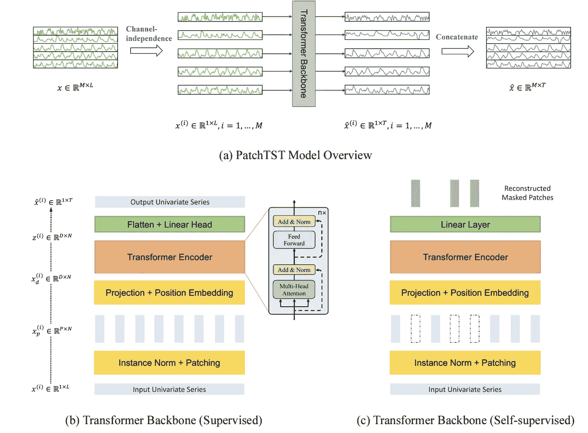
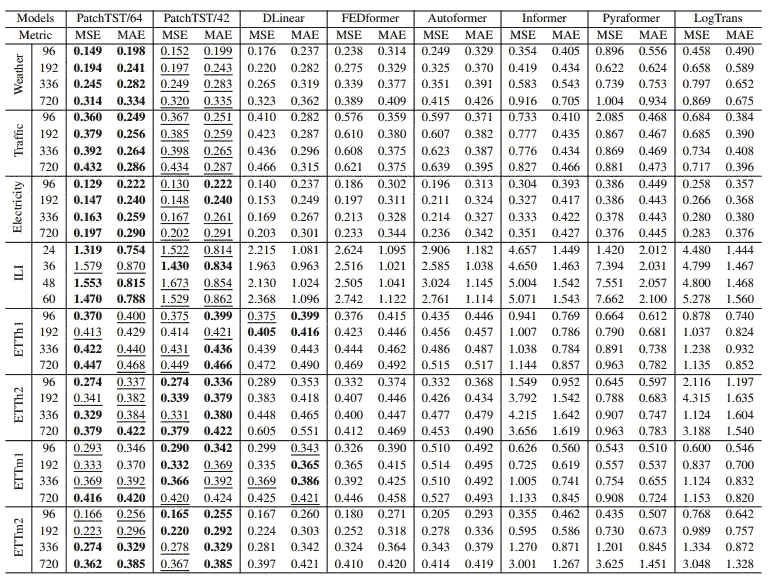

# 失落的回归：用于预测的变换器

> 原文：[`towardsdatascience.com/the-return-of-the-fallen-transformers-for-forecasting-24f6fec5bc30?source=collection_archive---------11-----------------------#2023-05-24`](https://towardsdatascience.com/the-return-of-the-fallen-transformers-for-forecasting-24f6fec5bc30?source=collection_archive---------11-----------------------#2023-05-24)

图片由 [Aditya Vyas](https://unsplash.com/@aditya1702?utm_source=medium&utm_medium=referral) 提供，发布在 [Unsplash](https://unsplash.com/?utm_source=medium&utm_medium=referral)

## 介绍一种新的变换器模型：PatchTST

 [Nakul Upadhya](https://medium.com/@upadhyan?source=post_page-----24f6fec5bc30--------------------------------)

·

[关注](https://medium.com/m/signin?actionUrl=https%3A%2F%2Fmedium.com%2F_%2Fsubscribe%2Fuser%2F4d9dddc62a80&operation=register&redirect=https%3A%2F%2Ftowardsdatascience.com%2Fthe-return-of-the-fallen-transformers-for-forecasting-24f6fec5bc30&user=Nakul+Upadhya&userId=4d9dddc62a80&source=post_page-4d9dddc62a80----24f6fec5bc30---------------------post_header-----------) 发表在 [Towards Data Science](https://towardsdatascience.com/?source=post_page-----24f6fec5bc30--------------------------------) · 5 min read · 2023 年 5 月 24 日

--

最近，基于变换器的方法被广泛采用。像 BERT 和 ChatGPT 这样的模型取得的显著成就鼓励了研究人员探索这种架构在各种领域的应用，包括时间序列预测。然而，香港中文大学和国际数字经济活动的研究人员最近的工作表明，为这一任务开发的实现效果不佳，并且在各种基准测试中可能被简单的线性模型击败[1]。

为此，普林斯顿大学和 IBM 的研究人员在他们的论文[A Time Series is Worth 64 Words](https://arxiv.org/abs/2211.14730) [2]中提出了 PatchTST（修补时间序列变换器）。在这篇论文中，Nie 等人介绍了两种关键机制，将变换器带回预测领域：

1.  修补注意力：他们的注意力机制将时间序列的大部分作为标记进行处理，而不是逐点注意力

1.  渠道独立性：时间序列中的不同目标序列被独立处理，使用不同的注意力权重。

在这篇文章中，我旨在总结这两种机制的工作原理，并讨论 Nie 等人[2]发现的结果的意义。

# 背景：变换器是否有效

在深入探讨 PatchTST 之前，我们需要首先了解 Zeng 等人发现的自注意力在预测领域中的问题。对于那些对详细总结感兴趣的人，我强烈建议阅读原始论文或我对他们工作的总结：

 [## 变换器在时间序列预测中有效吗？

### 最近，长期时间序列预测（LTSF）任务中出现了许多基于变换器的解决方案……

arxiv.org](https://arxiv.org/abs/2205.13504?source=post_page-----24f6fec5bc30--------------------------------)  ## 变换器是否输给了线性模型？

### 使用变换器进行长期预测可能不是最佳选择

towardsdatascience.com

总而言之，自注意力在应用于预测领域时存在一些关键问题。具体而言，以前的时间序列变换器使用逐点自注意力机制，其中每个时间戳被视为一个标记。然而，这存在两个主要问题。首先，这导致注意力机制对点的排列不变，如果你将点的位置颠倒，则观察到的注意力值相同。此外，单个时间戳本身包含的信息有限，其重要性来自于周围的时间戳。与语言处理中的情况类似，如果我们关注单个字符而不是单词。

这些问题在测试预测变换器时导致了一些有趣的结果：

1.  变换器似乎非常容易对随机模式过拟合，因为向数据中添加噪声并没有显著降低变换器的性能。

1.  更长的回溯期并没有帮助提高准确性，表明变换器未能捕捉到显著的时间模式。

# 这就是 PatchTST

为了应对变换器在这一领域的问题，Nie 等 [2] 引入了两个主要机制，使 PatchTST 区别于以往模型：通道独立性和分块。

在以往的工作中，所有目标时间序列会被连接到一个矩阵中，其中每一行是一个单独的序列，列是输入标记（每个时间戳一个）。这些输入标记随后会被投射到嵌入空间，这些嵌入会传递到一个单一的注意力层。

PatchTST 选择了通道独立性，每个系列独立传入变换器骨干网（图 1.b）。这意味着每个系列都有自己的一组注意力权重，使得模型可以更好地专注。该方法通常用于卷积网络，并且已被证明能显著提高网络的准确性 [2]。通道独立性还支持第二种机制：分块。

图 1：PatchTST 模型概览（图源自 Nie 等 2023 [2]）

如前所述，关注单个时间步就像关注单个字符。你最终会失去顺序感（“dog”和“god”在字符级注意力下会有相同的注意力值），并且还会增加模型的内存使用。那么解决方案是什么？显然我们需要关注单词！

更准确地说，作者提议将每个输入时间序列拆分成固定长度的块 [2]。这些块随后作为输入标记传入主模型（块的长度即为标记大小） [2]。模型接着为每个块添加位置编码，并通过普通变换器 [3] 编码器处理。

这种方法自然允许 PatchTST 考虑到点级标记丢失的局部语义信息。此外，时间序列的分块显著减少了所需的输入标记数量，使得模型能够捕捉来自更长序列的信息，并显著减少了训练和预测所需的内存 [2]。此外，分块机制还使得对时间序列进行表示学习成为可能，使 PatchTST 成为一个更灵活的模型 [2]。

## 预测实验结果

图 2：基准上的 MSE 和 MAE 结果。第一名加粗，第二名带下划线。（图源自 Nie 等 2023）

在他们的论文中，作者测试了 PatchTST 的两种不同变体：一种是输入模型的 64 个 patch（因此得名），另一种是 42 个 patch。42 个 patch 的变体与其他模型具有相同的回溯窗口，因此可以视为对其他模型的公平比较。对于这两种变体，使用了长度为 16 的 patch 和步幅为 8 来构建输入令牌 [2]。如图 2 所示，PatchTST 变体在结果中占据主导地位，DLinear [1] 在极少数情况下获胜。平均而言，PatchTST/64 实现了 MSE 下降 21% 和 MAE 下降 16.7%。PatchTST/42 实现了 MSE 下降 20.2% 和 MAE 下降 16.4%。

# 结论

PatchTST 代表了 Transformer 架构在时间序列预测任务中的一个有前景的未来，特别是由于 patching 是一个简单有效的操作符，可以在未来模型中轻松实现。此外，PatchTST 的准确性成功表明，时间序列预测确实是一个复杂的任务，可能从捕捉复杂的非线性交互中获益。

# 资源和参考文献

1.  PatchTST Github 仓库：[`github.com/yuqinie98/PatchTST`](https://github.com/yuqinie98/PatchTST)

1.  PatchTST 的实现可以在 NeuralForecast 中找到：[`nixtla.github.io/neuralforecast/`](https://nixtla.github.io/neuralforecast/)

1.  如果你对非 Transformer 的神经预测架构感兴趣，可以考虑阅读我之前的文章《神经基础分析网络》：`towardsdatascience.com/xai-for-forecasting-basis-expansion-17a16655b6e4`

如果你对预测、深度学习和可解释人工智能感兴趣，可以通过关注我来支持我的写作！

## 参考文献

[1] A. Zeng, M. Chen, L. Zhang, Q. Xu. [Transformers 对时间序列预测是否有效？](https://arxiv.org/abs/2205.13504)（2022）。第三十七届 AAAI 人工智能会议。

[2] Y. Nie, N. H. Nguyen, P. Sinthong 和 J. Kalagnanam. 《一个时间序列值 64 个单词：使用 Transformers 的长期预测》（2023）。国际学习表征会议，2023。

[3] A. Vaswani, N. Shazeer, N. Parmar, J. Uszkoreit, L. Jones, A. N. Gomez, L. Kaiser, I. Polosukhin. [注意力即你所需](https://arxiv.org/abs/1706.03762)（2017）。第 31 届神经信息处理系统会议。
