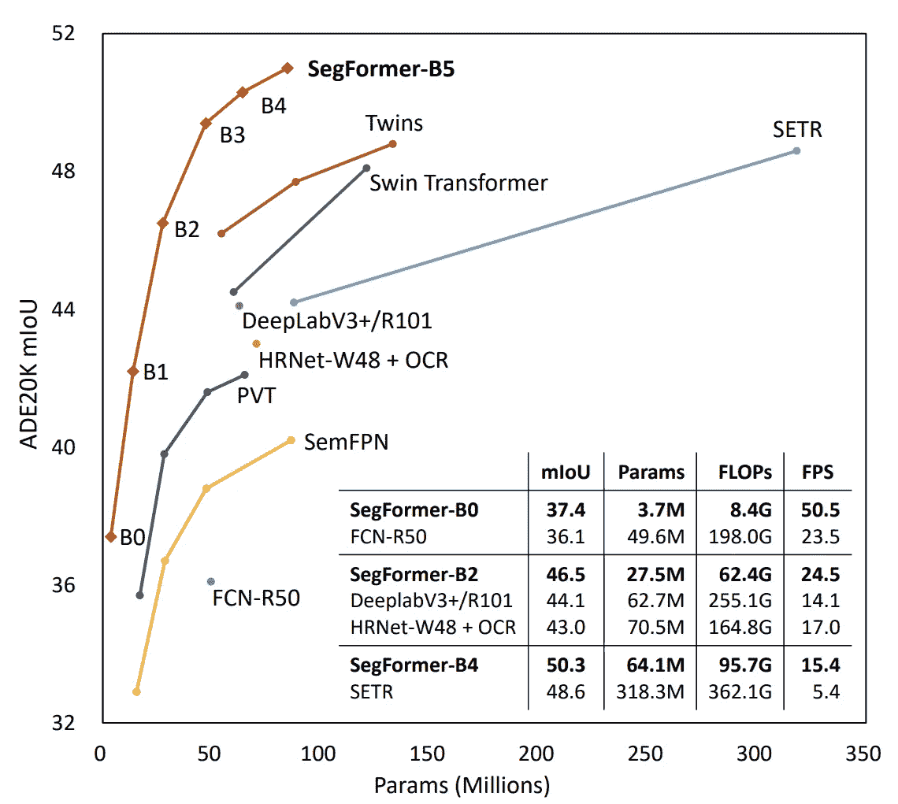
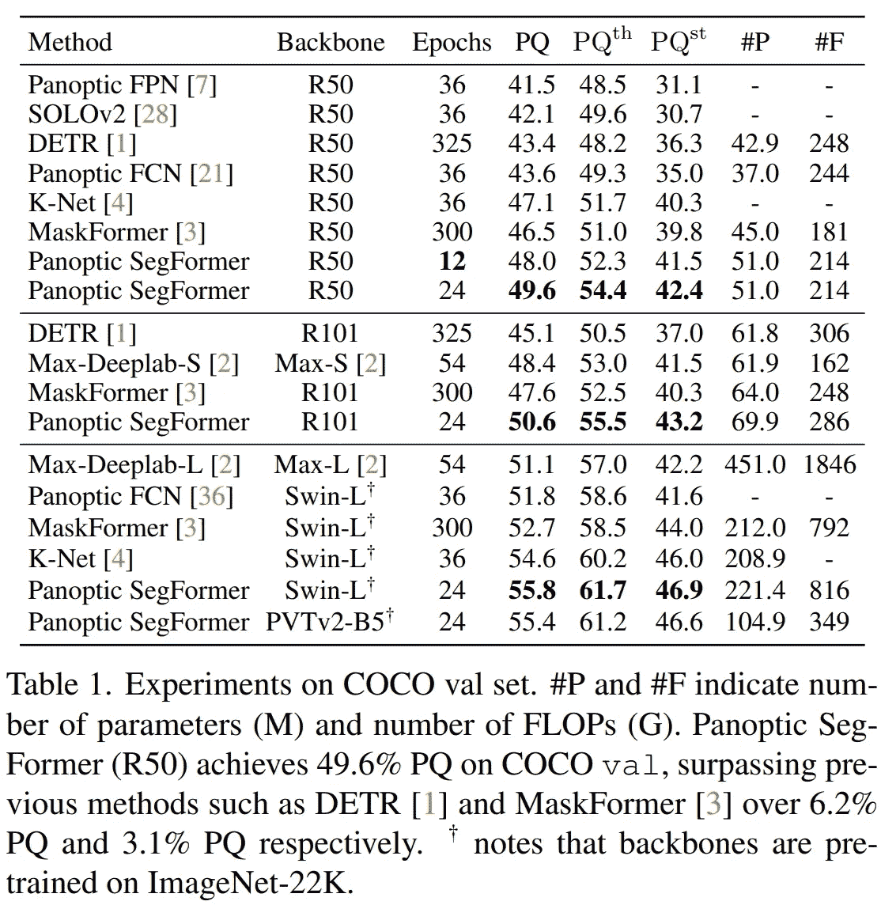

# 视觉变换器的崛起

> 原文：[`towardsdatascience.com/the-rise-of-vision-transformers-f623c980419f?source=collection_archive---------10-----------------------#2023-11-15`](https://towardsdatascience.com/the-rise-of-vision-transformers-f623c980419f?source=collection_archive---------10-----------------------#2023-11-15)

## ResNet 的时代是否即将结束？

 [Nate Cibik](https://natecibik.medium.com/?source=post_page-----f623c980419f--------------------------------)

·

[关注](https://medium.com/m/signin?actionUrl=https%3A%2F%2Fmedium.com%2F_%2Fsubscribe%2Fuser%2F82bf2304955e&operation=register&redirect=https%3A%2F%2Ftowardsdatascience.com%2Fthe-rise-of-vision-transformers-f623c980419f&user=Nate+Cibik&userId=82bf2304955e&source=post_page-82bf2304955e----f623c980419f---------------------post_header-----------) 发表在 [Towards Data Science](https://towardsdatascience.com/?source=post_page-----f623c980419f--------------------------------) · 9 分钟阅读 · 2023 年 11 月 15 日 

--

图片由作者提供。

在过去的十年里，计算机视觉已经从一个有前途的研究领域发展成为现代技术革命的基石。曾经以准确分类小像素图像而引起关注的这些技术，现在能够仅凭简短的描述从虚空中生成如上图所示的高分辨率图像。这种令人惊叹的能力目前仅限于庞大的模型，但并非所有影响我们日常生活的模型都是巨大的。

在过去十年的计算机视觉领域，另一个发展方向是较小模型在性能和参数效率上的同步提升，其紧凑的内存占用和更高的帧率使得智能手机摄影、增强现实和机器人等领域的发展成为可能。像素级语义分割和深度估计，以及对象和其 3D 姿态的检测与跟踪，现在可以在越来越大的图像尺寸上实时执行，帮助自动驾驶车辆规划日常的交通操作。

本文讨论了在这些较小视觉架构中骨干网络选择的一个重要发展。正如我们将看到的，出现了一类新的模型，其性能强大且轻量级到足以引发范式的转变，并允许过去时代的坚韧老将退役。

## 卷积时代

自从[AlexNet](https://papers.nips.cc/paper_files/paper/2012/hash/c399862d3b9d6b76c8436e924a68c45b-Abstract.html)在 2012 年震撼了 ImageNet 挑战赛并点燃了深度学习研究的世界以来，卷积神经网络（[CNNs](https://ieeexplore.ieee.org/document/6795724)）一直主导着计算机视觉领域。特别是，[ResNet](https://arxiv.org/abs/1512.03385)模型在 2015 年通过引入跳跃（“残差”）连接，成功解决了[梯度消失问题](https://en.wikipedia.org/wiki/Vanishing_gradient_problem)并提高了参数效率，随后由于其强大的知识迁移能力，几乎被广泛用作各种下游任务的骨干架构，取代了[VGGNet](https://arxiv.org/abs/1409.1556)，成为当时最受欢迎的骨干架构。

而在计算机视觉研究这个快速变化的领域中，这种状态已维持近八年，这是一个史诗般的生命周期。但现在，挑战者正接近王座。继 2017 年“[Attention is All You Need](https://arxiv.org/abs/1706.03762)”在自然语言处理（NLP）领域的迅猛崛起，并发展成今天看到的大型语言模型现象之后，[Vision Transformer](https://arxiv.org/abs/2010.11929)（[ViT](https://arxiv.org/abs/2010.11929)）在 2020 年 10 月底首次展示了纯变换器架构能够在计算机视觉任务中实现最先进的性能，尽管需要更多的训练周期、资源和数据来实现这一点。

事实证明，CNN 的设计赋予它们诸如平移等变性（通过权重共享）和局部性（通过小滤波器尺寸）[这些使其在图像数据结构上固有有效](https://arxiv.org/abs/2305.08404)的归纳偏差。变换器可以通过足够的训练从零开始学习这些偏差，但这最初意味着变换器在数据效率上远不如 CNN。另一方面，尽管 CNN 标配了有助于其学习和处理图像数据的偏差，但它们缺乏变换器自注意力提供的跨层建模全局依赖的能力，而这无法通过任何数量的数据来学习。

一项名为“[变换器是否比 CNN 更稳健？](https://arxiv.org/abs/2111.05464)”的研究发现，尽管两种架构在使用相同的增强策略进行训练时对对抗攻击的鲁棒性相当，但与在任何策略下训练的大型 ResNet 模型相比，变换器在处理分布外（OOD）样本时表现出更好的泛化能力，且消融研究表明，这一优势由自注意力机制驱动。

[DeiT](https://arxiv.org/abs/2012.12877) 在 OOD 样本上始终优于参数更少的 ResNet。图形由 [`arxiv.org/pdf/2111.05464.pdf`](https://arxiv.org/pdf/2111.05464.pdf) 提供

因此，CNN 的吸引人特性使其在学习图像特征时数据效率高，同时也预示了其衰退，因为其有限的感受野阻碍了它们对全局上下文的建模，这是一个非平凡的弱点。在 ViT 发表之前的几年中，已经尝试解决 CNN 中的长距离依赖问题：在诸如 [DeepLab](https://arxiv.org/abs/1412.7062) 的模型中探索了扩张（也称为“空洞”）卷积以增加感受野，[Squeeze-and-Excitation](https://arxiv.org/abs/1709.01507)、[Non-Local Neural Networks](https://arxiv.org/abs/1711.07971) 和 [Attention Augmented Convolutional Neural Networks](https://arxiv.org/abs/1904.09925) 展示了将注意力引入卷积操作的方法。Bottleneck Transformers ([BoTNet](https://arxiv.org/abs/2101.11605)) 通过将 ResNet 最后三层的空间卷积瓶颈块替换为多头自注意力块，在更大的图像分辨率下取得了显著的性能提升，但更大的提升尚待出现。

## 视觉变换器

在变换器希望取代王座之前，它们还需要克服架构上的弱点。ViT 论文在展示纯变换器架构能够在计算机视觉任务中实现最先进性能方面非常有帮助，同时也阐明了该应用所带来的挑战，包括前述的数据效率问题、自注意力相对于图像大小的不可接受的二次复杂性，以及在密集预测任务如语义分割和单目深度估计中有用的多尺度特征的缺乏。

> “虽然这些初步结果令人鼓舞，但仍然存在许多挑战。其中之一是将 ViT 应用于其他计算机视觉任务，如检测和分割。”
> 
> — 来自 [ViT](https://arxiv.org/abs/2010.11929) 论文结论的行动号召。

研究界显然把 2020 年的 ViT 论文当作了待办事项清单，2021 年是繁忙的一年。首先，数据高效图像变换器 ([DeiT](https://arxiv.org/abs/2012.12877)) 通过展示增强方法和从教师模型的知识蒸馏在使用 ImageNet 数据集的更少周期内有效地训练 ViT 模型，解决了数据效率问题，从而消除了对大规模外部数据集的需求，并将无卷积的视觉模型带入了广泛采用的领域。有趣的是，使用 CNN 作为教师模型效果明显优于预训练的 DeiT，可能是因为这一过程将其结构偏差传授给了学生。视觉变换器现在已成为数据效率方面的正式威胁，但仍然缺乏多尺度特征。

> “因此，考虑到我们的结果，其中图像变换器已经与卷积网络相当，我们相信，鉴于其在特定准确度下较低的内存占用，它们将迅速成为一种首选方法。”
> 
> — 来自 [DeiT](https://arxiv.org/abs/2012.12877) 论文结论的预言。

在二月末，一篇标题为 “[金字塔视觉变换器：无需卷积的密集预测多功能骨干网](https://arxiv.org/abs/2102.12122)” 的论文通过使用卷积解决了缺乏多尺度特征和自注意力复杂性的问题。[Swin Transformer](https://arxiv.org/abs/2103.14030) 注入了 CNN 的结构偏差，生成多尺度特征图，并通过在移动局部窗口中关注来减少自注意力复杂性，但像 PVT 一样，仍然依赖于补丁中的位置编码。卷积视觉变换器 ([CvT](https://arxiv.org/abs/2103.15808)) 改变了游戏规则，通过零填充 2D 卷积生成重叠的补丁嵌入，利用 CNN 的一项特性，[从零填充中编码位置信息](https://arxiv.org/abs/2001.08248)。

这张来自[CvT](https://arxiv.org/abs/2103.15808)论文的表格是对视觉变换器工作成果的有用总结，直到其发表为止。有趣的是，查看[PVT 代码](https://github.com/whai362/PVT/blob/57e2dfaa5a46f9050d76f306a4fcd9a7c061f520/segmentation/pvt.py#L51)发现，“空间缩减”仅仅是 2D 卷积的委婉说法。

随后，[PVTv2](https://arxiv.org/abs/2106.13797)的新版本与[Segformer](https://arxiv.org/abs/2105.15203)同时发布，后者使用前者作为骨干，通过使用轻量级的全 MLP 解码器，实现了最先进的语义分割性能，并且参数效率令人印象深刻。[GLPN](https://arxiv.org/abs/2201.07436)随后使用这个骨干在单目深度估计（另一种密集预测任务）中取得了竞争力的结果。

要理解 PVTv2 作为骨干的突破性，我们可以从 Segformer 论文中的图表开始：

图表来自[Segformer](https://arxiv.org/abs/2105.15203)论文，展示了在语义分割任务上相较于同时期模型的**卓越性能**和**效率**。

上述图表清晰地展示了相比于同时期的层次化变换器和 ResNet 架构，**性能**和**参数效率**的优势（详见[Segformer](https://arxiv.org/abs/2105.15203)论文）。

接下来，我们可以回顾一个 PVTv2 支持更复杂架构的例子。[Deformable DETR](https://arxiv.org/abs/2010.04159)在 Detection Transformer（[DETR](https://arxiv.org/abs/2005.12872)）基础上有了显著改进，得益于提出的变形注意力，实现了更高的计算和数据效率，并且训练周期减少了 10 倍。[Panoptic Segformer](https://arxiv.org/abs/2109.03814)是对 Deformable DETR 的自然扩展，用于全景分割，并在 2021 年底发布，其中有一张比较图表对我们讨论特别有帮助。

图表来自[Panoptic Segformer](https://arxiv.org/abs/2109.03814)论文。请注意底部两个表现最佳的模型，分别使用了 Swin-L 和 PVTv2 骨干，其中后者在参数数目只有一半的情况下，性能相当。

遗憾的是，作者没有对 PVTv2 骨干网络的其他尺寸进行基准测试，除了最大的（B5）版本，但我们仍然可以从这个例子中获得一些重要见解。首先，我们看到尽管 Swim-L 骨干在技术上是较大模型中最具性能的，但 PVTv2-B5 在参数和 FLOPS 不到一半的情况下，性能几乎相同。此外，（虽然 PVTv2-B3 会是更好的比较对象）我们可以看到，PVTv2-B5 比 ResNet101 骨干的性能显著更优。

这些模型的成功表明，PVTv2 中的 Mix Transformer (MiT) 编码层能够用高效数量的参数生成极具描述性的特征，这要归功于其采用的“各取所长”的方法。通过将卷积操作融入变换器层，使自注意力更高效，创建多尺度特征，并注入对图像数据高效学习有利的归纳偏差，这些层次化的变换器模型可能成为计算机视觉模型开发中的下一个家喻户晓的名字。

## 胜者

图片由作者提供，灵感来源于[这张图片](https://images.app.goo.gl/mX4NGhZK3XGHHKe77)。

因此，答案似乎并不是 CNN 与变换器之间的生死搏斗（参见许多过度溢美的赞词和挽歌），而是某种更浪漫的东西。层次化变换器（如 CvT 和 PVTv2）中采用 2D 卷积不仅便利地创建了多尺度特征，减少了自注意力的复杂性，并通过缓解对位置编码的需求简化了架构，这些模型还采用了残差连接，这是其祖先遗传的另一特征。变换器和 CNN 的互补优势已经在这些可行的后代中融合。

那么，ResNet 时代是否已经结束？虽然看起来确实如此，但任何论文肯定仍然需要在一段时间内包括这个不知疲倦的骨干网络进行比较。然而，重要的是要记住，这里没有失败者，只有新一代强大且可转移的特征提取器供大家享用，只要他们知道在哪里查找。像 PVTv2 这样的参数高效模型通过提供强大的特征提取，同时占用较小的内存空间，民主化了对更复杂架构的研究，值得被添加到标准骨干网络的列表中，以用于基准测试新架构。

## 未来的工作

本文重点讨论了卷积操作和自注意力的交叉融合如何促成了层次特征变换器的演变。这些模型在小规模下表现出了主导的性能和参数效率，使其成为理想的特征提取骨干（尤其是在参数受限的环境中）。然而，目前尚缺乏对这些模型在较小规模下所利用的效率和归纳偏差是否能够转移到大规模成功，并威胁到纯 ViT 在更高参数量下主导地位的探索。

大型多模态模型（Large Multimodal Models，LMMS）如大语言和视觉助理（[LLaVA](https://arxiv.org/abs/2304.08485)）及其他需要自然语言理解视觉数据的应用，依赖于从 ViT-L 特征生成的对比语言-图像预训练（Contrastive Language–Image Pretraining，[CLIP](https://arxiv.org/abs/2103.00020)）嵌入，因此继承了 ViT 的优势和劣势。如果关于扩展分层 Transformer 的研究表明它们的好处，例如增强了细粒度理解的多尺度特征，使它们能够以比 ViT-L 更高效的参数效率实现更好或类似的性能，那么这将对使用 CLIP 的任何内容：LMMS、机器人技术、辅助技术、增强/虚拟现实、内容审核、教育、研究等对社会和产业有广泛和直接的影响，可以改进和提高效率，降低这些技术的开发和部署门槛。
