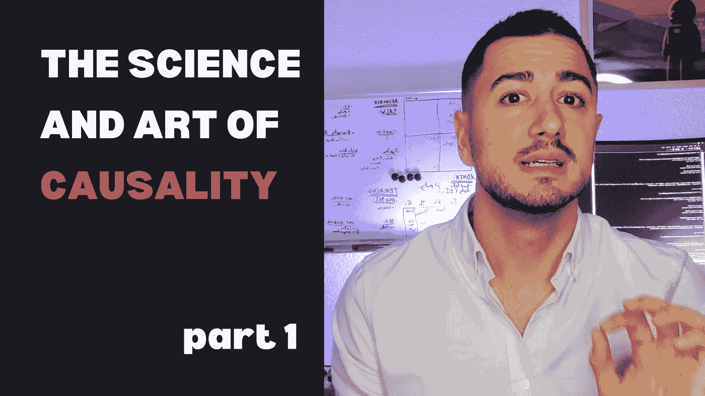
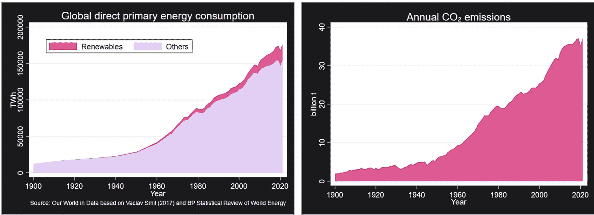
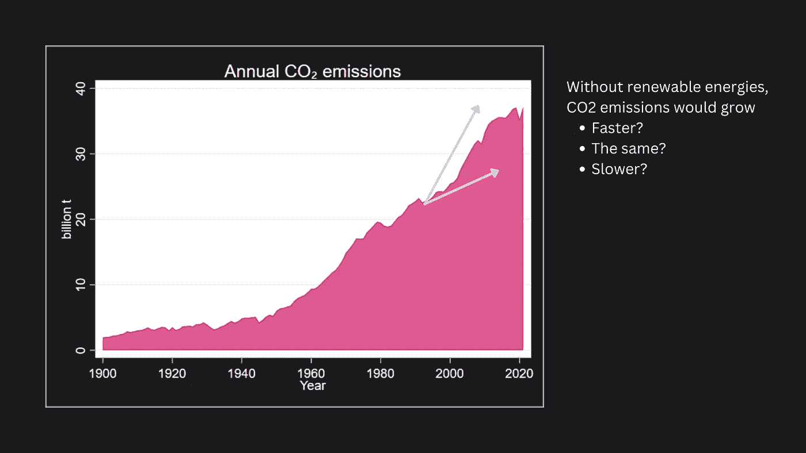
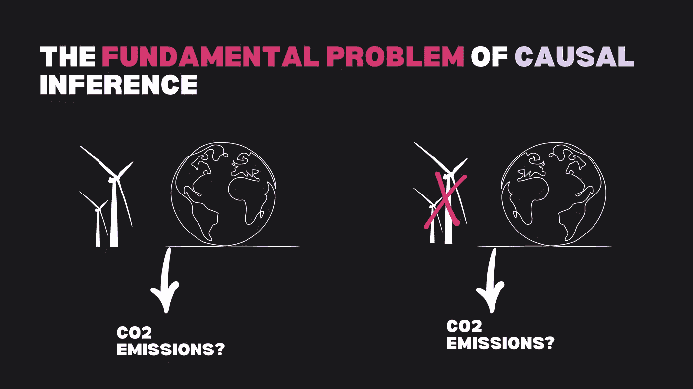
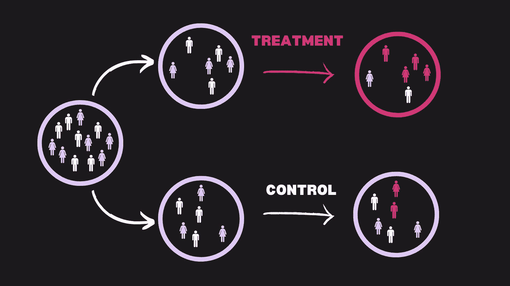
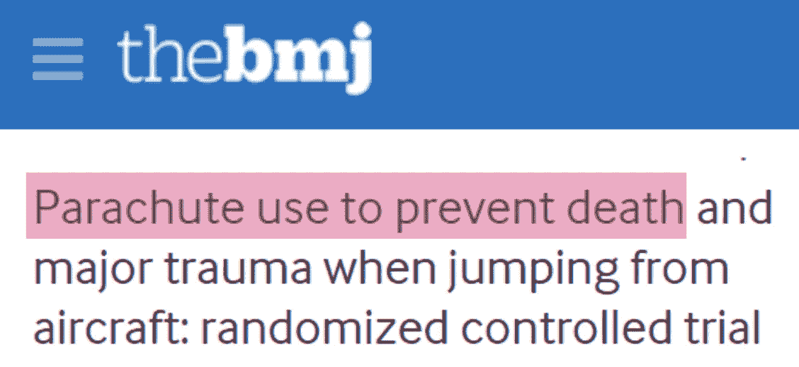
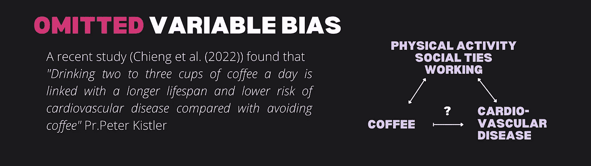
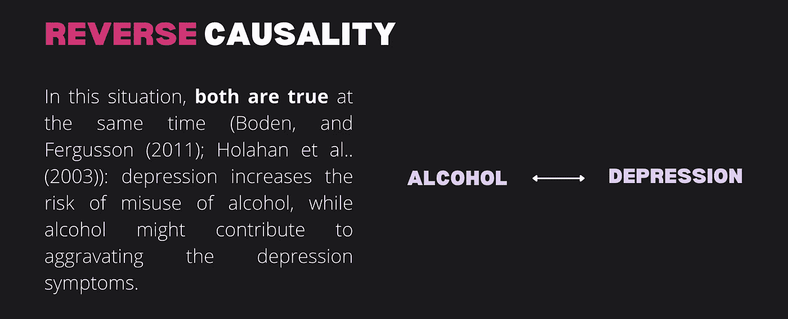

# 因果关系的科学与艺术（第一部分）

> 原文：[`towardsdatascience.com/the-science-and-art-of-causality-part-1-5d6fb55b7a7c?source=collection_archive---------7-----------------------#2023-01-05`](https://towardsdatascience.com/the-science-and-art-of-causality-part-1-5d6fb55b7a7c?source=collection_archive---------7-----------------------#2023-01-05)

## 如果我们不能直接测试因果关系，我们应该怎么办？

 [Quentin Gallea, PhD](https://medium.com/@quentin.gallea?source=post_page-----5d6fb55b7a7c--------------------------------)

·

[关注](https://medium.com/m/signin?actionUrl=https%3A%2F%2Fmedium.com%2F_%2Fsubscribe%2Fuser%2Fa52dcb9793ad&operation=register&redirect=https%3A%2F%2Ftowardsdatascience.com%2Fthe-science-and-art-of-causality-part-1-5d6fb55b7a7c&user=Quentin+Gallea%2C+PhD&userId=a52dcb9793ad&source=post_page-a52dcb9793ad----5d6fb55b7a7c---------------------post_header-----------) 发表在 [Towards Data Science](https://towardsdatascience.com/?source=post_page-----5d6fb55b7a7c--------------------------------) ·10 分钟阅读·2023 年 1 月 5 日

--

图片由作者提供

让我带你踏上一段旅程，探索我的专业领域，这也是我的激情、我的执着，我喜欢称之为：**因果关系的科学与艺术**。

“因果关系”指的是因果之间的关系。它是指一个事件或行动可以引发另一个事件或结果。换句话说，因果关系关注的是理解事情如何发生以及为何发生。

在这篇文章中，我们首先将回答两个问题：为什么理解因果关系如此重要，以及为什么评估因果关系如此困难（因果推断的根本问题）。然后，我们将看到两种主要的因果效应测量方法（随机对照试验和自然实验）。最后，我将展示如何质疑因果关系，并提供实际工具来实现这一点。

# 为什么因果关系？

首先，我们为什么要关注因果关系？我为什么对这个话题如此执着？因为我们所做的每一个决定，无论是个人还是组织，都是基于某些行动会导致某些结果的假设。

例如，如果我们决定去素食，是因为我们相信这将对健康或环境有益。或者，如果一家公司改变了其广告策略，是因为它希望提高销售或订阅量。同样，政府必须考虑其行动将如何影响我们周围的世界，例如，过渡到可再生能源是否有助于实现气候目标。然而，理解因果关系可能很复杂，需要仔细分析以确定真正的关系。这就是因果关系的科学和艺术所在——它帮助我们审视和解读数据，以更好地理解我们周围的世界，并做出明智的决策。

> 问题是，如果我们未能正确评估关系和因果链，后果可能非常昂贵。

问题是，如果我们未能正确评估关系和因果链，后果可能非常昂贵。首先，政府可能会投入大量精力和资源来获取数据，然后花费更多资源来分析这些数据。但如果结论错误，他们可能会因跟随错误的路径而损失更多资源。因此，这就是为什么评估因果关系如此重要的原因。

> 此外，理解因果关系还帮助我们在阅读新闻、听取政治家发言、与他人讨论时，减少被操控或受到虚假信息影响的风险。

此外，好消息是，你可以学习一些工具和实用的方法，以每天应用这些方法来对抗虚假信息，并做出更好的或更有根据的决策。

# 为什么评估因果关系如此困难？

那么，为什么评估因果关系如此困难呢？问题在于，你没有统计测试可以告诉你你的效应是否是因果关系。你可以在这方面做很多事情。可以进行许多统计测试来挑战我们称之为识别假设（识别因果效应的假设），但通常，我们无法直接测试这些假设。

这正是理解因果关系如此令人兴奋的原因！它需要扎实的统计基础和深厚的领域知识。你必须运用批判性思维来考虑不同变量和事件之间的关系。仅凭数学是不够的。主要挑战通常在于我们如何解释所使用的统计指标——我们可能会把相关性误认为因果关系。

# 因果推断的根本问题

关键问题来自于因果推断的根本问题。让我用下面的两个图表来说明这个概念。在左侧，你可以看到全球的直接初级能源消费，分为可再生能源和其他能源生产来源。第二个图表表示世界的 CO2 排放量，从 1900 年到 2020 年。两个数据都在增长。然而，我们倾向于认为使用可再生能源有助于减少 CO2 排放。利用这样的汇总数据，有些人可能会被诱导认为可再生能源未必有用。

作者提供的图像。

显然，凭借如此简单的统计数据无法回答这个问题（可再生能源对 CO2 排放的影响是什么？）。问题在于，我们不知道如果没有可再生能源会发生什么。我们没有一个没有可再生能源的世界。

作者提供的图像。

可再生能源与 CO2 排放之间的关系是复杂的。一方面，像太阳能和风能这样的可再生能源可以作为化石燃料的替代品，从而导致 CO2 排放减少。另一方面，提取资源以生产光伏电池的过程是耗能的，并且“反弹效应”（即当能源由可再生资源提供时，人们会消耗更多能源）也可能导致 CO2 排放增加。没有更多的数据，就无法明确回答可再生能源是否导致更高或更低的 CO2 排放。底线是，仅凭这样的数据无法回答这个问题。

> 要完美回答这个问题，我们需要两个平行的世界。

在两个世界中，一个世界有可再生能源，而另一个世界没有。而由于这是两个世界之间唯一的不同，如果在 CO2 排放方面存在差异，那很可能是由于可再生能源的使用造成的。

可再生能源对 CO2 排放的影响是什么？要完美回答这个问题，我们需要两个平行的世界。作者提供的图像。

不幸的是，我们无法访问平行世界，在那里我们可以观察到相同情况在有和没有特定处理或行动时的表现。这就产生了**“因果推断中的基本问题”**，因为我们无法观察反事实——即没有进行处理或行动的替代现实。例如，我们无法同时观察一个既在服药又不在服药的病人。在因果推断中，我们尝试尽可能接近这种理想情况，在这种情况下，我们可以比较相同情况在有和没有特定处理或行动时的结果。这使我们能够更好地理解因果关系。

# 黄金标准

通常，解决这个问题的第一种方法，通常被称为黄金标准，并且可以说是最佳解决方案是随机对照试验（A/B 测试）。

随机对照试验的示意图。图片由作者提供。

简而言之，这个概念如下。我们抽取一个样本，这个样本希望能够代表更大的人群，并将受试者随机分配到两个组（处理组和对照组）或更多组中。受试者通常不知道他们是否接受了处理（这个过程称为盲法）。因此，这两个组可以说是可比的。由于唯一的区别是处理，如果我们观察到一个效果，那它可能是因果关系，前提是没有其他偏差存在。

然而，随机对照试验（RCT）有两个主要的缺点。第一个是我们不能总是使用 RCT。有时候这是不可能的，例如为了实验的需要改变一个受试者的性别。在其他情况下，这也是不道德的。例如，我有一篇论文评估武器出口对非洲冲突概率的影响。我们不会随机将武器发送到不同的国家，以观察这是否会影响冲突的概率。

第二个主要缺点是，当我们完全控制实验环境时，可能会以牺牲外部有效性（即我们可以将结果推广到研究范围之外的程度）为代价。例如，医学研究通常使用近交系的老鼠/小鼠。这些动物在基因上几乎是相同的，因此我们接近平行世界的情况。但问题是，我们失去了外部有效性。

> 因此，通常在完美测量因果效应和结果是否能很好地反映现实生活情况之间存在权衡。

图片由作者提供

让我用一篇精彩的论文来说明这个想法：*《使用降落伞预防从飞机上跳下时的死亡和重大创伤：随机对照试验》* ([`www.bmj.com/content/363/bmj.k5094`](https://www.bmj.com/content/363/bmj.k5094))。这篇论文发表在顶级医学期刊：英国医学杂志（BMJ）。

在这个实验（这是一个随机对照试验）中，他们在 2017 年至 2018 年间的一年时间内成功招募了 23 名志愿者，并让他们从飞机上跳下。参与者被随机分为两组，一组使用降落伞，另一组则背着空背包。他们直接在碰撞后测量了死亡或重大身体创伤的概率。作者没有发现两组在这些结果（死亡和重大创伤）之间存在差异。

那么，问题在哪里呢？这确实是一个真实的实验，但为了能够进行这些实验，他们当然是在一个从未离开地面的静止飞机上进行的。人们从离地面约一米的高度跳下。论文的目的是强调有时候你试图通过实验来完美控制环境，但结果却不一定真实反映现实。

# 自然实验

所以，如果进行随机对照试验不一定可能，那我们该怎么办呢？我们可以求助于所谓的准实验设计或自然实验。

*“自然实验是* ***观察性研究*** *，其中* ***事件或情况允许随机*** *或看似随机的* ***研究对象分组*** *，以回答特定问题。”* 大英百科全书

让我举一个例子来说明这样的实验。假设你想评估污染对健康的影响（例如呼吸系统疾病的风险）。你可以在实验室中使用动物，但你不会让人类暴露在致命或非常危险的污染水平下。即使动物研究可能有用，我们也可能会难以将结果外推到人类身上。我们可能对现实生活中的情况感兴趣，例如长时间暴露在污染中，人类如何度过日常生活。然而，如果我们比较城市和农村的人，他们并不可比，其他因素使他们非常不同，例如：他们的饮食、运动方式、工作类型等。

> 另一个选择是比较城市居民与农村居民，但这些群体可能在其他方面（如饮食、身体活动和工作类型）有所不同，这可能会混淆结果。因此，准确评估污染与健康之间的因果关系可能很困难。

因此，为了回答这样的问题，我们可以借助自然实验。这正是一些研究人员在 2016 年所做的 ([`www.sciencedirect.com/science/article/abs/pii/S0095069616300237`](https://www.sciencedirect.com/science/article/abs/pii/S0095069616300237))。作者利用北京奥运会来衡量空气污染对死亡率的因果效应。政府在比赛前和比赛期间实施了非常严格的减排法规（例如，关闭电厂，减少汽车使用）。这种情况使得可以精确观察到相同的人在之前、期间和之后。这些个体经历了其污染暴露水平的突然变化，从高水平降到显著较低的水平。作者发现“*PM10 [空气中的细颗粒物] 浓度下降 10％会使月度标准化全因死亡率降低 8％。*”

# 如何挑战因果关系？

质疑因果关系的两个主要因素（内生性问题）是：你所关注的关系往往受到其他因素的影响（遗漏变量偏差），或者效应可能是双向的（同时性，或反向因果关系）。

> 由于我们不能直接测试因果关系，我们可以做什么？

由于我们不能直接测试因果关系，我们可以做什么？你可以总是询问是否有其他因素解释了这个结果，或者是否在同一时间反向关系成立。使用这些问题来挑战一个因果声明。

图片来源于作者

首先让我阐述第一个概念：遗漏变量偏差（是否有其他因素？）。研究发现咖啡消费与心血管疾病之间存在高度负相关 ([`academic.oup.com/eurjpc/article-abstract/29/17/2240/6704995?redirectedFrom=fulltext`](https://academic.oup.com/eurjpc/article-abstract/29/17/2240/6704995?redirectedFrom=fulltext))。论文（Chieng 等，2022）中提到的咖啡消费与健康之间的联系可能并不一定是因果关系。需要考虑的是，其他因素可能会影响咖啡消费和整体健康。例如，身体活动更多的人可能会消费更多的咖啡，并且由于其身体活动而更健康。重要的是始终考虑可能存在其他因素，而不是在没有进一步分析的情况下将观察到的关系解释为因果效应。

图片来源于作者

你应该问的第二个问题是：可能是反向关系吗？例如，当你观察到喝酒更多的人更抑郁时，是因为他们喝酒，还是因为他们抑郁才喝酒？研究发现了这两种效应。因此，凭借这种关联，很难评估彼此的影响，因为它们混合在一起。

# 结论

由于我们无法直接测试因果关系，运用批判性思维挑战你听到或读到的任何因果声明是很重要的。首先考虑平行世界的情况，尝试发现理想情况和你所面临的情况之间的差异，以评估因果效果。这通常有助于发现问题可能出现的地方。然后，运用你的两个问题：可能是其他原因吗？是否存在反向因果关系？

要更深入了解，请阅读[第二部分](https://medium.com/towards-data-science/the-science-and-art-of-causality-part-2-c085a9d56fd2)。
