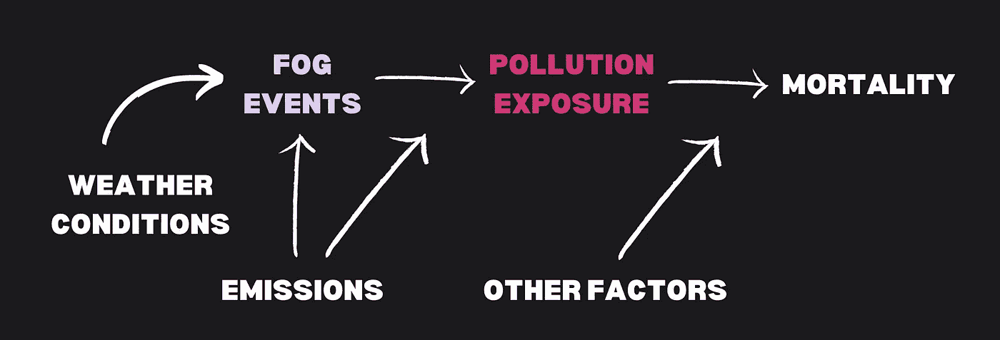
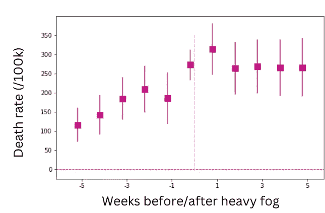
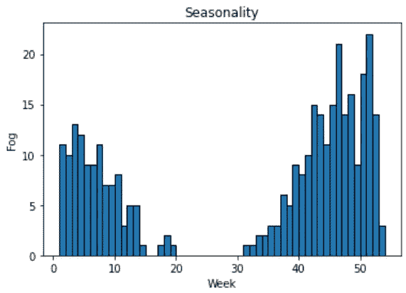
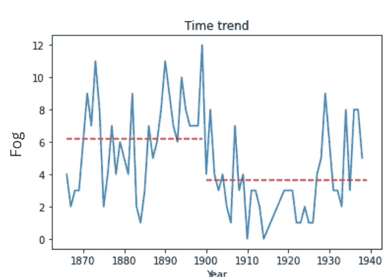
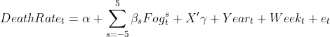
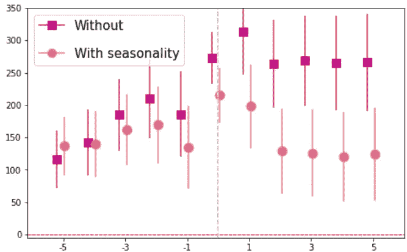
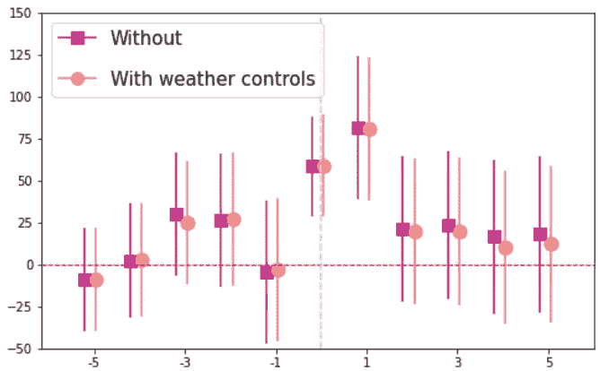
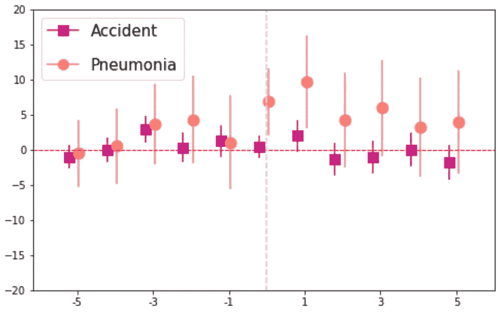
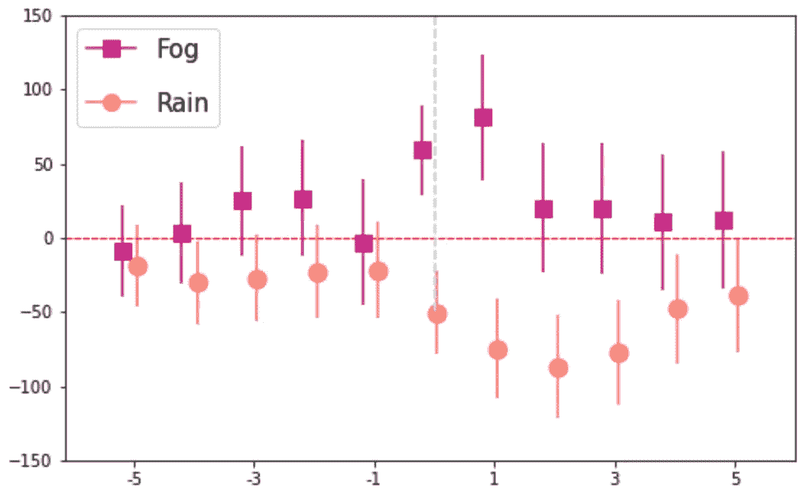

# 因果性的科学与艺术（第二部分）

> 原文：[`towardsdatascience.com/the-science-and-art-of-causality-part-2-c085a9d56fd2?source=collection_archive---------14-----------------------#2023-01-06`](https://towardsdatascience.com/the-science-and-art-of-causality-part-2-c085a9d56fd2?source=collection_archive---------14-----------------------#2023-01-06)

## 让我们站在侦探的角度，探索因果推断。

 [Quentin Gallea, PhD](https://medium.com/@quentin.gallea?source=post_page-----c085a9d56fd2--------------------------------)

·

[关注](https://medium.com/m/signin?actionUrl=https%3A%2F%2Fmedium.com%2F_%2Fsubscribe%2Fuser%2Fa52dcb9793ad&operation=register&redirect=https%3A%2F%2Ftowardsdatascience.com%2Fthe-science-and-art-of-causality-part-2-c085a9d56fd2&user=Quentin+Gallea%2C+PhD&userId=a52dcb9793ad&source=post_page-a52dcb9793ad----c085a9d56fd2---------------------post_header-----------) 发布于 [Towards Data Science](https://towardsdatascience.com/?source=post_page-----c085a9d56fd2--------------------------------) · 8 min read · 2023 年 1 月 6 日

--

正如我们在这篇两部分文章的第一部分中看到的，测量因果效应对于得出正确结论至关重要，因为你做出的每一个选择或决定通常都是预期因果关系的结果。

## 例如：

**个人选择：**

+   如果我选择素食，我将减少我的生态足迹。

+   如果我喝下这杯龙舌兰酒，我会跳得更好。

**公司：**

+   在家办公会降低生产力

+   向用户投放 YouTube Premium 广告会增加订阅者数量。

**政策制定者：**

+   用可再生能源替代核电站将有助于实现《巴黎协定》。

+   封锁措施将减少 COVID-19 的传播

问题在于没有统计测试可以证明你的效果是因果关系。要挑战因果关系，正如文章的第一部分所解释的，你可以提出两个主要问题：是否还有其他因素可以解释因果关系，或者是否可能是反过来的（即效果导致了原因）？

> [H]如何在没有直接测试因果关系的统计测试的情况下找到因果效应的证据？

这些问题使我们能够挑战因果声称。但是，如何在没有直接测试因果关系的统计测试的情况下找到因果效应的证据？在这篇文章中，我将向你展示研究人员如何通过一篇引人入胜的科学论文：*‘伦敦雾：1866–1965 年污染与死亡率的一个世纪’*（Hanlon (2018)）。

为了做到这一点，我们将把自己置于警探的角度。警探们不断试图回答因果问题：是谁造成了这个人的死亡？是文官芥末在温室里用烛台吗？你确定不是用扳手或者其他人犯的罪吗？在我们的例子中，我们有一个嫌疑人，或者更准确地说，是一个我们想要验证的假设（例如，污染增加了死亡率）。然后我们问自己，这真的只是污染，还是健康服务的发展？或者实际上是天气的结果？等等。

通常，如果你想知道谁犯了罪，你很少有某人犯案的录像。即使有，也许画面模糊，也许是伪造的。因此，你可能永远无法百分之百确定罪犯的身份。为了克服这一限制，你会积累证据，尝试排除所有可能的罪犯不在场证明，直到你有足够的证据，并设法排除主要的其他故事（是否是其他人？这个人是否在做其他事情？）。在研究中，我们要寻找因果证据时，也非常类似。

# 案例研究：伦敦雾与死亡率

让我用以下论文*‘伦敦雾：1866–1965 年污染与死亡率的一个世纪’*（Hanlon (2018)）来说明这些概念。伦敦在 19 世纪时已经是一个人口密集、污染严重的地区。这篇研究论文的作者回答了一个非常重要的问题：暴露对死亡率的影响是什么？

这篇文章的有趣之处在于，空气污染数据自 1950 年代才开始有。然而，准确的气象数据自 1850 年代就已存在。因此，文章的想法是利用雾作为污染的指标，因为在雾天，污染水平较低，而市民的污染暴露增加（见下图）。

你可以在这里找到一个完整的 Python 笔记本，其中包含我的代码，以复制论文并生成我将在本文中使用的图表：[Deepnote notebook](https://deepnote.com/workspace/statswithquentin-9de199f7-1b70-481e-a6e2-df6c97c779f4/project/06londonfog-c5f4d2b2-5471-42ec-b8df-879dc56780f2/%2F02_rdd_london.ipynb)。

因果图。图片由作者提供。

## 初步了解影响

论文研究了严重雾霾对死亡率的影响。因此，让我们首先查看从雾霾周前五周到雾霾周后五周，死亡率（所有原因一起）如何变化。结果显示，死亡率在冲击时（第 0 周）以及后续几周都增加。然而，许多因素可能解释这一效应（例如季节性）。

数据集包含 1850 年至 1940 年伦敦的每周天气和死亡数据，并排除了第一次世界大战的年份。

图片由作者提供

## 我们可以忽略季节性和时间趋势的影响吗？

首先，让我们查看一下雾霾事件在一年中的分布情况。可以看到非常强的季节性（遇到严重雾霾的概率在冬季较高）。因此，在我们的模型中捕捉季节性效应非常重要，因为寒冷的天气与更多的雾霾相关，同时也可能与更多的死亡相关（寒冷天气容易让人们生病）。

雾霾的季节性。图片由作者提供。

其次，让我们查看一下 1850 年至 1940 年间出现严重雾霾的周频率。我们再次可以看到强相关性。我们观察到 1900 年后雾霾周的数量平均较少。模型必须考虑这一演变，以避免将这一效应与我们关注的效应混淆。这是因为医疗系统的质量随时间变化，降低了死亡率，同时雾霾周的数量也随时间减少。因此，如果我们不捕捉时间趋势，可能会夸大系数（高估雾霾对死亡率的影响）。

每年的雾霾事件数量。红色虚线表示 1900 年前/后的平均值。图片由作者提供

请注意，即使你对下面呈现的模型不熟悉，你仍然应该能够理解这个想法。估计模型是一个简单的线性回归：

用于表示一周的变量是*t*。*Fog^s* 是一个虚拟变量，当第*s+t*周出现严重雾霾时取值为一。***X*** 是一个气象控制向量，包括降雨量、温度、气压和湿度。*Year* 和 *Week* 分别是固定效应集，用于捕捉年份效应和日历周效应（季节性）。*e* 是一个误差项。

因此，这种模型允许在有大雾的周的之前、期间和之后测量对死亡率的影响，同时考虑气象条件、季节性和年固定效应（时间的演变）。

森林图表示线性回归的系数。垂直轴代表死亡率，而水平轴代表距离有大雾的一周的周数。柱状图代表 95%的置信区间。作者提供的图片。

上图比较了一个不考虑季节性的模型（粉色方框）和一个考虑季节性的模型（橙色圆圈）。我们可以看到，季节性的影响确实扭曲了系数（在粉色模型中，死亡率增加大于橙色模型）。此外，考虑季节性的模型中死亡率在两周后恢复到雾前水平。

现在让我们加入年度固定效应。这组控制变量捕捉了污染物随时间的演变，但也捕捉了健康部门质量的演变，例如。因此，系数的解释略有不同。现在我们探讨年度 t 的死亡率与平均死亡率的偏差。

下面的图表显示了在大雾的那一周和接下来的一周，死亡率增加了。此外，我们还可以看到天气控制对估计值影响不大。

森林图表示线性回归的系数。垂直轴代表死亡率，而水平轴代表距离有大雾的一周的周数。这里的两种模型都包括了周和年的固定效应。柱状图代表 95%的置信区间。作者提供的图片。

现在让我们来质疑这种效应的因果关系。理由是雾会使污染物浓度降低，进而增加死亡率。使用我在本文第一部分中介绍的工具：“如果这是其他因素导致了这种效应呢？”。

## 这可能是一则意外和犯罪的故事吗？

如果有更多的雾，很难看清楚，所以会发生更多的事故或犯罪。为了排除这个替代的故事，作者比较了基于记录的死因（例如事故/犯罪 vs. 肺炎）的死亡率。

下面的图表显示，围绕大雾周的事故/犯罪引起的死亡率没有影响，而我们观察到肺炎引起的死亡率有显著的影响。

我们正逐渐接近抓到我们的嫌疑人：污染物。还有一个替代故事我想和大家探讨一下。

森林图表示线性回归的系数。纵轴表示死亡率（不同原因：事故/犯罪与肺炎），横轴表示与浓雾周的距离（以周为单位）。条形图表示 95%的置信区间。图像来源：作者

## 这可能是一个关于天气与流行病学的故事吗？

当天气恶劣（有雾）时，人们待在家里。因此，如果人们待在家里，就有更高的风险传染给他人，因此死亡人数的增加（例如，由于肺炎）仅仅是这种情况的后果，而不是污染的结果。这种说法似乎很难被反驳，对吧？

作者采用了非常优雅的方式来驳斥这一替代性故事。作者比较了两种不同的天气冲击：浓雾和大雨。确实，大雨会有类似的效果：人们可能会待在家里更久。然而，关键点在于雾霾使污染保持在低水平，而雨水则清洁空气。因此，如果这是一个污染的故事，我们应该会发现雨水（死亡人数较少）与雾霾相比的相反效果。

下面的图表正好揭示了这一效果：雾霾致死，大雨拯救生命。

森林图表示线性回归的系数。纵轴表示总体死亡率，横轴表示与浓雾周的距离（以周为单位）。条形图表示 95%的置信区间。图像来源：作者

## 结论

这篇论文提出了强有力的论据，证明了伦敦一个世纪以来雾霾与健康污染之间的因果关系，并使用证据来排除各种替代解释。为了评估因果关系，提出两个问题是有帮助的：‘是否有其他因素可能导致这种效果？’以及‘是否可能正好相反？’此外，下次当你需要质疑一个因果声明时，把自己置于侦探的角色，考虑和收集支持和反对不同解释的证据。通过这些技术，让我们做出更明智的决策，并对抗虚假信息。
