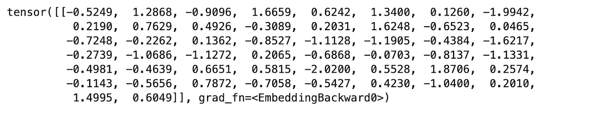

# 提升 NLP 性能的秘诀：深入了解 PyTorch 中的 nn.Embedding 层

> 原文：[`towardsdatascience.com/the-secret-to-improved-nlp-an-in-depth-look-at-the-nn-embedding-layer-in-pytorch-6e901e193e16`](https://towardsdatascience.com/the-secret-to-improved-nlp-an-in-depth-look-at-the-nn-embedding-layer-in-pytorch-6e901e193e16)

## 解剖 PyTorch 中的 `nn.Embedding` 层及其工作原理的完整指南

[](https://medium.com/@will.badr?source=post_page-----6e901e193e16--------------------------------)[](https://towardsdatascience.com/?source=post_page-----6e901e193e16--------------------------------) [Will Badr](https://medium.com/@will.badr?source=post_page-----6e901e193e16--------------------------------)

·发表于 [Towards Data Science](https://towardsdatascience.com/?source=post_page-----6e901e193e16--------------------------------) ·阅读时间 8 分钟·2023 年 1 月 24 日

--


OpenAI DALL-E 生成的图像

你可能在涉及自然语言处理（NLP）的多个神经网络架构中见过著名的 PyTorch *nn.Embedding()* 层。这是设计先进 NLP 架构时最简单且最重要的层之一。让我用简单的术语来解释它是什么。

在花了一些时间研究其 C++ 源代码后，我发现了以下内容。*nn.Embedding* 层是一个简单的查找表，将索引值映射到具有特定维度的权重矩阵。这一简单操作是许多先进 NLP 架构的基础，允许在连续空间中处理离散输入符号。在训练过程中，神经网络中的 *nn.Embedding* 层的参数会被调整，以优化模型的性能。具体来说，通过反向传播更新嵌入矩阵，以最小化损失函数。这可以被视为学习将离散输入标记（如单词）映射到高维空间中的连续嵌入向量，其中向量被优化以表示输入标记的意义或上下文，相关于模型训练任务（例如文本生成、语言翻译）。

现在让我们通过一些具体的代码示例来了解：

*nn.Embedding* 层至少需要两个参数：词汇表大小和每个单词编码表示的大小。例如，如果你的词汇表有 10,000 个单词，那么第一个参数的值将是 10,000。词汇表中的每个单词将由一个固定大小的向量表示。第二个参数是每个单词学习到的嵌入的大小。

```py
import torch
import torch.nn as nn

# Define the embedding layer with 10 vocab size and 50 vector embeddings.
embedding = nn.Embedding(10, 50)
```

这里发生的事情是 PyTorch 创建了一个名为 `embedding` 的查找表。这个表有 10 行和 50 列。每一行代表一个单词的嵌入，初始化时是从均匀分布中随机抽取的。它们是使用 `torch.nn.init` 模块中的 `nn.init.uniform_()` 函数进行初始化的，权重被初始化为在 -1 到 1 之间的随机值。要检查给定单词的嵌入（例如，表中的第一个单词），你可以运行：

```py
embedding(torch.LongTensor([0]))
```

输出是一个大小为 50 的向量：



这些数字在训练过程中被调整和优化，以传达特定单词的含义。初始化方法对模型的性能有显著影响。不同的初始化方法可能导致优化过程的起始点不同，这会影响网络收敛到良好解的速度或难易程度。例如，如果权重初始化为非常小或非常大的值，反向传播过程中梯度也会很小或很大，这可能会减慢甚至阻止收敛。另一方面，如果权重初始化为接近零的值，梯度将更为合理，网络更可能快速收敛。

此外，不同的初始化方法被设计成与不同类型的激活函数配合良好。例如，Xavier 初始化设计用于与 sigmoid 和 tanh 激活函数配合使用，而其他方法可能与 ReLU 及其变体效果更佳。现在，让我们看看如何使用不同的方法初始化 *nn.Embedding* 层：

1.  `nn.init.normal_()`：它用从均值为 0 和标准差为 1 的正态分布中抽取的随机值初始化权重。这也被称为高斯初始化。

```py
nn.init.normal_(embedding.weight)
```

`nn.init.constant_()`：这个函数用特定的常数值初始化权重。例如，你可以使用 `nn.init.constant_(my_layer.weight, 0)` 将层的权重初始化为 0。

`nn.init.xavier_uniform_()` 和 `nn.init.xavier_normal_()`：这些函数基于 [Xavier Glorot](https://scholar.google.com/citations?user=_WnkXlkAAAAJ&hl=en) 和 [Yoshua Bengio](https://yoshuabengio.org/) 的研究，设计用于与 sigmoid 和 tanh 激活函数配合使用。它们将权重初始化为接近零但不太小的值。

```py
nn.init.xavier_uniform_(embedding.weight)
```

`nn.init.kaiming_uniform_()` 和 `nn.init.kaiming_normal_()`：这些函数基于 He 等人的研究，设计用于与 ReLU 及其变体（LeakyReLU、PReLU、RReLU 等）配合使用。它们还将权重初始化为接近零但不太小的值。

```py
nn.init.kaiming_normal_(embedding.weight, nonlinearity='leaky_relu')
```

这些权重还可以使用预训练的词向量，如 GloVe 或 word2vec 进行初始化，这些向量在大型语料库上进行过训练，并且已被证明对许多自然语言处理任务有用。使用预训练词向量的过程称为——微调。将预训练的词嵌入与`nn.Embedding`层结合使用，对各种自然语言处理（NLP）任务非常有用。这是因为：

1.  **提高模型性能：** 预训练的词嵌入已经在大量文本数据上进行训练，并且已被证明对各种 NLP 任务有用。当作为神经网络的输入使用时，它们可以通过提供一组好的初始权重来提高模型的性能，这些权重捕捉了词语的意义。

1.  **节省计算时间和资源：** 从头开始训练神经网络以学习词嵌入可能是一个耗时且计算开销大的任务，尤其是当你处理大语料库时。通过使用预训练的词嵌入，你可以节省大量计算时间和资源，因为这些嵌入已经在大语料库上学习过。

1.  **允许迁移学习：** 预训练的词嵌入可以用于迁移学习，这意味着你可以将学到的嵌入作为起点，用于不同但相关的任务。这在标签数据稀缺或获取成本高的 NLP 任务中特别有用。

让我们看看如何实现它：

```py
import torch
import torch.nn as nn

# Load a pre-trained embedding model
pretrained_embeddings = torch.randn(10, 50) # Example only, not actual pre-trained embeddings

# Initialize the embedding layer with the pre-trained embeddings
embedding.weight.data.copy_(pretrained_embeddings)
```

你还可以使用`from_pretrained()`方法直接加载预训练的嵌入：

```py
embedding_layer = nn.Embedding.from_pretrained(pretrained_embeddings)
```

你还可以使用来自流行库如 GloVe 或 fastText 的预训练嵌入，例如：

```py
import torchtext

# Load pre-trained GloVe embeddings
glove = torchtext.vocab.GloVe(name='6B', dim=300)
embedding_layer = nn.Embedding.from_pretrained(glove.vectors)
```

在进行迁移学习时，你可能需要在训练过程中冻结预训练的嵌入，以防在反向传播步骤中更新它们，并且只有最后一个全连接层被更新。要做到这一点，设置`embedding_layer.weight.requiresGrad = False`以防止此层被更新。

## 变换器的兴起

另一个常见的地方是变换器架构中。`nn.Embedding`层是变换器架构的关键组件，它是一种广泛用于自然语言处理任务的神经网络架构，如语言翻译、文本摘要、问答以及创建大型语言模型如 GPT3。

在变换器架构中，`nn.Embedding`层用于将输入的令牌序列（例如单词或子词）转换为连续表示。这是通过在学习的嵌入矩阵中查找每个令牌的嵌入向量来完成的。

嵌入层的输出随后通过几个多头自注意力和前馈神经网络层，这些层用于在上下文感知的方式中处理和理解输入序列。自注意力机制是变换器的关键组件，它允许模型在进行预测时衡量输入序列中每个标记的重要性。这些都在 PyTorch 中的`nn.Transformer`层内实现。

经过变换器层处理后，模型的输出通常会通过一个最终的线性层，用于进行任务预测。例如，在语言翻译模型中，最终的线性层会用于预测目标语言中每个单词的概率，给定源语言中的输入序列。让我们看看`Transformer`类在 Python 中的样子：

```py
import torch
import torch.nn as nn

class Transformer(nn.Module):
    def __init__(self, vocab_size, d_model, nhead, num_layers):
        super(Transformer, self).__init__()
        # This is our holy embedding layer - the topic of this post
        self.embedding = nn.Embedding(vocab_size, d_model)

        # This is a transformer layer. It contains encoder and decoder
        self.transformer = nn.Transformer(d_model, nhead, num_layers)

        #This is the final fully connected layer that predicts the probability of each word
        self.fc = nn.Linear(d_model, vocab_size)

    def forward(self, x):
        # Pass input through the embedding layer
        x = self.embedding(x)

        # Pass input through the transformer layers (NOTE: This input is usually concatenated with positional encoding. I left it out for simplicity)
        x = self.transformer(x)
        # Pass input through the final linear layer
        x = self.fc(x)
        return x

# Initialize the model
vocab_size = 10
d_model = 50
nhead = 2
num_layers = 3
model = Transformer(vocab_size, d_model, nhead, num_layers)
```

需要注意的是，这只是一个用于演示目的的简单示例，展示了嵌入层在`Transformers`中的使用，而真实的变换器模型通常会有额外的组件，如位置编码，这是一种提供每个标记相对位置的信息的技术。还有层归一化，用于规范化层的激活，以提高模型的稳定性和性能。此外，常见做法是使用预训练的嵌入来初始化嵌入层，以利用从大量文本数据中学到的知识。

## 有趣的事实：

+   上述具有仅 10 个词汇、50 维向量嵌入、2 个多头注意力机制以及编码器和解码器中的 2 层的变换器层共有 2,018,692 个可训练参数。这些是我们在训练过程中优化的参数数量。要得到这个数字，我运行了下面的代码：

```py
sum(p.numel() for p in model.parameters() if p.requires_grad)
```

+   模型维度或 d_model 必须能够被多头自注意力机制中的头数整除，因为多头注意力机制将模型维度分割成几个较小的子空间。每个子空间用于计算不同标记集的注意力权重。

+   变换器模型也被用于计算机视觉任务，如物体检测和图像分割，通过使用自注意力机制将图像像素处理为标记。

总结来说，`nn.Embedding` 层是许多 NLP 模型中的基本资产，并且在 transformer 架构中扮演着关键角色。`nn.Embedding` 层用于将输入的标记序列转换为模型可以有效处理的连续表示。使用预训练的嵌入允许 transformer 模型利用从大量文本数据中学到的知识，这可以提高它们在各种自然语言处理任务上的表现。`nn.Embedding` 层还具有一些我们在这篇文章中没有涉及的参数，如 `sparse` 选项、`padding_idx`、`max_norm` 和 `norm_type`，这些参数可以用来根据具体任务的需求自定义嵌入层。理解 `nn.Embedding` 层及其工作原理是使用 PyTorch 构建有效自然语言处理模型的重要步骤。
