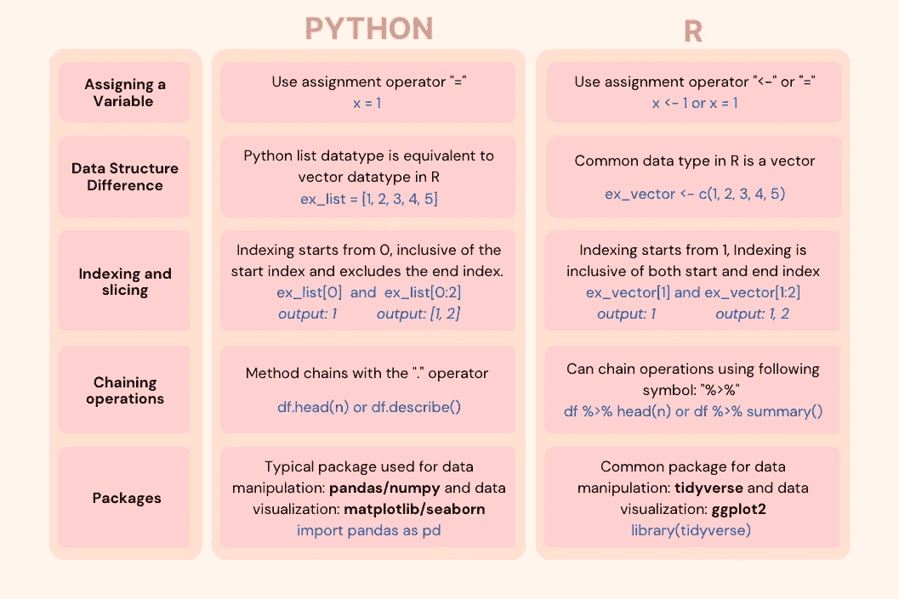
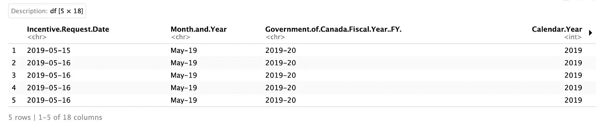
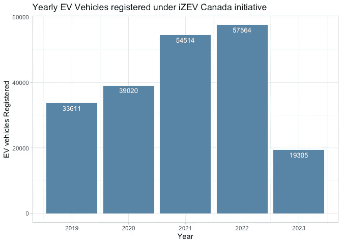
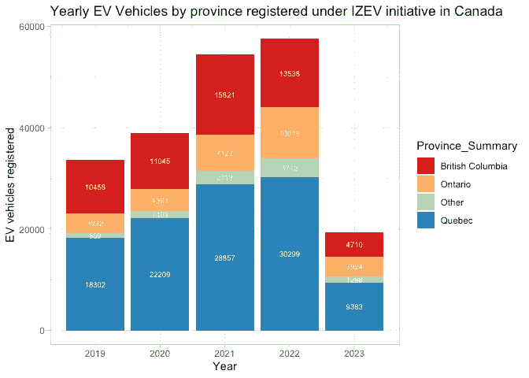
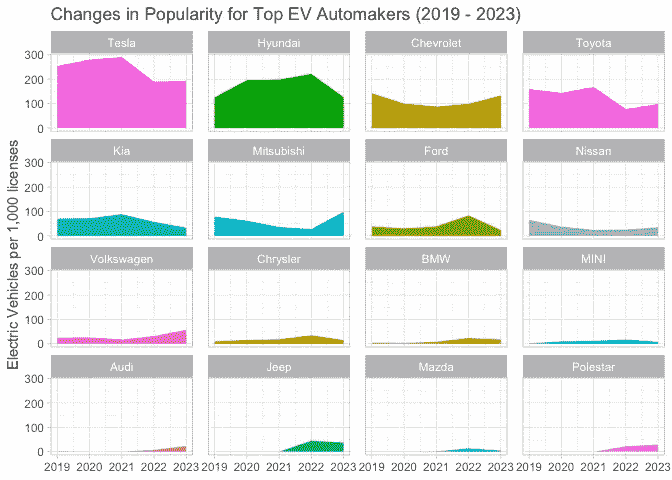
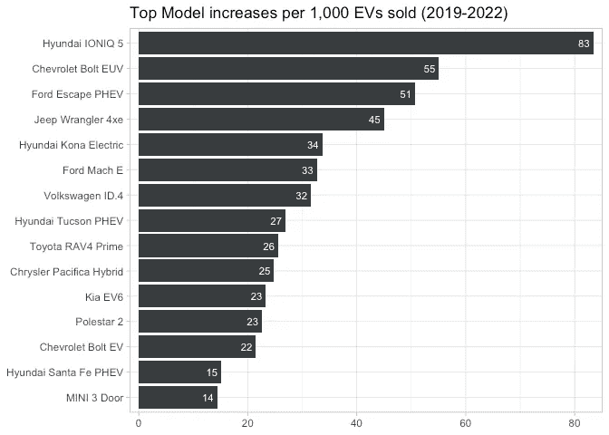
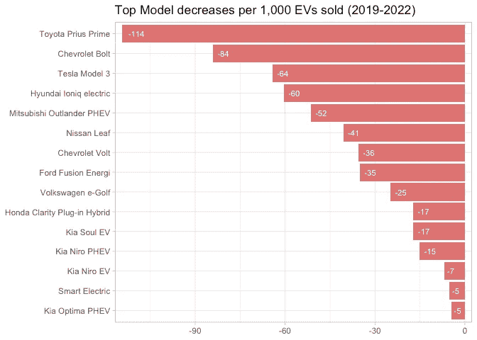

# 《将你的 Python 项目迁移到 R 的入门指南》

> 原文：[`towardsdatascience.com/the-starter-guide-for-transitioning-your-python-projects-to-r-8de4122b04ad?source=collection_archive---------3-----------------------#2023-06-02`](https://towardsdatascience.com/the-starter-guide-for-transitioning-your-python-projects-to-r-8de4122b04ad?source=collection_archive---------3-----------------------#2023-06-02)

## R 教程

## *在 R 中探索电动车趋势*

 [Stephanie Lo](https://medium.com/@stephanie_lo?source=post_page-----8de4122b04ad--------------------------------)

·

[关注](https://medium.com/m/signin?actionUrl=https%3A%2F%2Fmedium.com%2F_%2Fsubscribe%2Fuser%2Ff4309a31ceee&operation=register&redirect=https%3A%2F%2Ftowardsdatascience.com%2Fthe-starter-guide-for-transitioning-your-python-projects-to-r-8de4122b04ad&user=Stephanie+Lo&userId=f4309a31ceee&source=post_page-f4309a31ceee----8de4122b04ad---------------------post_header-----------) 发表在 [数据科学前沿](https://towardsdatascience.com/?source=post_page-----8de4122b04ad--------------------------------) · 11 分钟阅读 · 2023 年 6 月 2 日

--

照片由 [Milad Fakurian](https://unsplash.com/@fakurian?utm_source=medium&utm_medium=referral) 提供，来源于 [Unsplash](https://unsplash.com/?utm_source=medium&utm_medium=referral)

你是否对深入了解 R 编程感到好奇？虽然 Python 在数据科学社区中仍然是主要选择，2022 年约有 60% 的开发者使用它¹，但有时 R 也会出现。这是因为 R 针对统计和数据进行了优化。如果你像我一样有 Python 基础，但现在遇到了需要 R 技能的职位列表和公司内部任务，这篇文章旨在为你提供帮助。我们将探索 Python 和 R 之间的基本区别，并将项目整合到数据清理和可视化教程中，以确保顺利过渡到 R。

> 注：如果你对绿色技术和电动汽车特别感兴趣，教程中包括一些有趣的视觉图像，展示了电动和混合动力汽车在加拿大的受欢迎程度，所以可以跳到教程部分，亲自查看这些视觉效果和相关分析！

## **R 的简要概述**

R 是一种开源编程语言，主要用于统计建模和数据可视化领域。R 最初由统计学家 Robert Gentleman 和 Ross Ihaka 于 1993 年开发，旨在处理统计分析和数据转换任务。它仍然保持着以统计为重点的程序声誉。然而，得益于超过 18,000 个软件包的大量库，R 多年来也发展到了支持数据科学以外的广泛项目和应用领域。

在设置和应用方面，R 通常在 RStudio 环境中使用，该环境既免费又易于安装。你可以在这里找到安装指南。现在我们已经介绍了一些初步的说明，让我们进入从 Python 到 R 的速查表过渡指南。

## **探索 Python 和 R 之间的主要区别**

虽然不可能通过一张图来捕捉 Python 和 R 之间所有的细微差别，但下图提供了两种编程语言之间关键差异的良好初步概述：

Python 到 R 过渡指南 — 作者提供的图像

请注意，这张图并不详尽，也没有涵盖 Python 和 R 之间的所有区别。有关更详细和全面的分解，量身定制你的特定项目，MIT 提供了一个很好的转换资源[这里](https://www.mit.edu/~amidi/teaching/data-science-tools/conversion-guide/r-python-data-manipulation/)。

总结 Python 和 R 之间的关键区别，让我们重点突出几个关键项目：

+   **语法**：Python 采用更直接和简洁的语法，而 R 的语法往往涉及更多的括号、方括号和符号。这可能使得 R 代码最初看起来更复杂，但我们将在教程中进一步探讨这一概念。

+   **数据操作**：Python 更多地依赖于像 NumPy 和 pandas 这样的外部库进行复杂的数据操作任务。相比之下，R 通常提供专门为数据操作设计的内置函数和功能。

我们可以通过实际探索来了解 Python 和 R 的对比方面，从而更全面地理解这些差异。让我们转到教程部分，我们将进行一些简单的数据清洗和转换，并使用数据来探索这些可视化效果。

## **我们的 R 包简介**

在开始之前，让我们熟悉一下我们将使用的 R 包：

+   `**tidyverse**`**：** 这个包是按照整洁数据的原则（正如其名字所示）创建的，包含许多基本的包。其中，`dplyr`因其在数据操作和转换方面的能力而受到欢迎，而`ggplot2`则提供了强大的工具套件用于数据可视化。

+   `**sqldf**`：这个 R 包允许您在 R 数据框上执行 SQL 查询，为在 R 环境中应用 SQL 语法进行数据操作和分析提供了更方便的方式。

# **教程：加拿大的电动车许可证**

照片由[Roberto H](https://unsplash.com/@droberobert?utm_source=medium&utm_medium=referral)提供，来自[Unsplash](https://unsplash.com/?utm_source=medium&utm_medium=referral)

在本教程中，我们将重点研究加拿大联邦政府推出的零排放车辆激励计划（iZEV）后轻型和零排放车辆的受欢迎程度。这是一个国家性的计划，为购买电动车辆（包括插电混合动力车辆）的加拿大人提供财政回扣。幸运的是，我们可以访问加拿大政府的数据，涵盖了该计划自 2019 年起至 2023 年 3 月的数据。

分析将分为两个部分：**数据加载和清洗**，它对 Python 和 R 进行了一些轻微的比较，然后是**数据分析**。首先，让我们概述一些我们希望通过我们的可视化回答的问题，重点是理解随时间推移受欢迎程度的变化：

1.  多年来，根据 iZEV 计划注册的车辆数量如何发展？

1.  自该计划实施以来，汽车制造商品牌偏好发生了哪些变化？

1.  哪些车型的受欢迎程度增长或减少最为显著？

> 为了保持教程简洁，并专注于 Python 到 R 的过渡，分析将保持相对广泛，但我们将展示最终生成的数据可视化结果，以完成对加拿大迄今为止注册的 iZEV 许可证情况的全面了解。如需更深入的分析，包括完整的 R 代码、额外的 Markdown 和可视化效果，以及数据集的链接，请参阅我的 GitHub 仓库[*这里*](https://github.com/stephrlo/Python_to_R)。

## **数据加载和清洗**

首先，我们将安装和加载前面提到的 R 包，可以使用以下代码：

接下来，让我们将包加载到我们的 R 环境中：

为了加载我们的数据，我们将使用`<-`操作符为变量分配值，这与 Python 中通常使用的`=`操作符不同。之后，我们可以快速使用`dim`函数获取我们加载的数据集的行数和列数，这相当于 Python 中的`numpy.shape()`函数。

在 R 中，你可以使用`head()`函数探索数据框的前几行。这类似于 Python pandas 库中的`df.head()`函数。以下是如何在 R 中实现这一操作的示例：

`%>%`操作符有助于链式操作。在上面的代码中，它让 R 知道要取`df`数据框然后显示前 5 行，你将得到如下输出：

在获得数据框和形状的初始概述之后，我们可以立即看到一些无关紧要的列，这些列可以删除。同时，我们可以修改一些冗长的列名，以便以后更容易地进行参考。

所有这些步骤都可以在 Python 中使用`drop()`、`rename()`和`map()`函数复制。

数据清洗过程的下一步通常涉及删除空值和重复行，但对于这个特定的数据集，我们只会删除空值，因为我们有许多重复行，但在没有唯一行标识符（如许可证 ID）的情况下，如果我们删除重复项，则可能会丢失宝贵的数据，因此我们需要相信行输入是正确的。以下是如何在 R 中删除空值的方法：

Python 中删除空值的等效函数可以使用`dropna()`调用。

这最后一步是为了准备关于车辆品牌和型号受欢迎程度的最后一个问题，我们可以使`Vehicle_Make_and_Model`列中的车型命名约定一致。例如，我们将考虑‘Hyundai Ioniq PHEV’与‘Hyundai Ioniq 插电混合动力’相同。我们可以通过创建列表，并使用`str_replace_all`函数来实现这一点。

很好，数据清洗就这样进行了一些简单的步骤，现在进入有趣的部分，分析！

## **数据分析**

下面的可视化内容将探讨我们在开始时列出的三个问题，并解释`ggplot`与`matplotlib`的区别。让我们先来看看我们的第一个问题：

## iZEV 计划下注册的车辆数量随年份的变化如何？

在这里，我们需要可视化注册年份和许可证数量，可以使用 R 的`dplyr`包编辑`clean_df`数据框，使其处于适当的格式中。数据集的每一行都计为一个车辆条目，因此需要使用`summarise(total=n())`来获取总行数：

在绘制数据时，R 的`ggplot`和 Python 的绘图库之间存在一些差异。在`ggplot`中，使用层叠语法，通过`+`运算符添加不同的组件。

让我们来比较一下你可能用`matplotlib`和 Python 绘制这个图表的方法：

总体而言，两者之间的代码长度相似，但 R 中的代码看起来更为简洁，使用了`+`运算符。现在，让我们展示这个可视化：

数据截至到 2023 年 3 月

我还包含了第二个图表，展示了各省 iZEV 受益者的分布情况（完整的 R 代码可以在我的 GitHub 仓库[这里](https://github.com/stephrlo/Python_to_R)找到）：

数据截至到 2023 年 3 月

**观察**

那么我们从这两个可视化中能看到什么？我们可以看到，从 2019 年的 33,611 个许可证到 2022 年的 57,564 个许可证，在 iZEV 计划下注册的零排放车辆总数有所增加，支持了加拿大向电动车的过渡。注意：电动车市场在整体乘用车注册中占比很小，约为 5%⁴。

按省份划分，我们看到魁北克省占据了许可证的最大份额，超过了 BC 省、安大略省和其他省份的总和，这可能部分归因于魁北克省提供的额外最高$8,000 的折扣，而联邦政府计划则提供相应的补贴（相比之下，BC 省仅提供最高$3,000）。此外，对公用事业公司 Hydro-Québec 的明确要求，帮助省内的电动车充电基础设施的发展，缓解了司机对充电地点的担忧。

按省份划分，我们看到魁北克省占据了许可证的最大份额，超过了 BC 省、安大略省和其他省份的总和，这可能部分归因于魁北克省提供的额外最高$8,000 的折扣，而联邦政府计划则提供相应的补贴（相比之下，BC 省仅提供最高$3,000）。此外，对公用事业公司 Hydro-Québec 的明确要求，帮助省内的电动车充电基础设施的发展，缓解了司机对充电地点的担忧。

## **2\. 自计划实施以来，汽车制造商品牌偏好发生了什么变化？**

为了回答我们的第二个问题，我们想要研究汽车制造商的受欢迎程度变化。与第一个问题中关注绝对总数不同，我们将探讨相对变化。通过分析比例，我们可以在类似的尺度上比较不同汽车制造商的表现，从而进行更有意义的比较。

现在请耐心一点，因为在我们到达下一个可视化之前，有相当多的 R 代码，但我们最终要实现的是按品牌显示的子图，展示年复一年比例变化。到目前为止我们拥有的数据仅代表绝对计数，所以我们需要计算‘*每 1,000 辆车*’来进行比例缩放。

首先，我们将创建一个显示车辆品牌按年份和计数的表格，我们可以使用`sqldf` R 包来实现。

接下来，我们希望将每年拆分到自己的行中，在这里我们可以使用`pivot_wider`函数（与 Python 中的`pivot`函数相似）。

然后，我们需要计算每年的`‘per_1K’`许可证，这可以通过将每种品牌的车辆计数除以登记的总车辆数，并将其乘以 1,000 来完成。

现在我们想计算 2022 年和 2019 年的差异，只关注按比例变化的完整年份。

下一步将计算出的年份和`per_1K`列重新透视成一个长的透视表，以帮助准备这些数据用于图表。之后，我们将绝对计数和`per_1K`计数合并成一个长的透视表。

`query_vehicle_counts`已经包含了我们所需的一切，所以我们只需将这两个数据集连接起来：

最后，我们希望按年份对每辆车进行排名，这样我们可以重用`sqldf`并利用窗口函数轻松完成。

最后，为了绘制车辆比例如何随时间变化，我们可以使用子图（在`ggplot`中称为`facet_wrap`，类似于 Python `matplotlib`库中的`subplots`）。

这是我们的可视化：

**观察**

上面的子图显示，当比较比例时，特斯拉拥有最大的汽车份额，占 2019–2022 年加拿大道路上每 1,000 辆电动汽车（EV）中的 300 辆。近年来，他们的市场份额有所下降，因为新进入的竞争者如奥迪、吉普、马自达和极星等已经进入加拿大市场。

## **3. 哪些车型经历了最显著的受欢迎程度增加和减少？**

我们最后一组问题关注特定车型的受欢迎程度，我们可以检查 2019–2022 年之间购买车型比例的变化。这个分析的代码与我们之前使用的代码非常相似，只需将`Vehicle_Make`替换为`Vehicle_Make_and Model`（有关更详细的逐步指南，请参阅我的 GitHub 链接[这里](https://github.com/stephrlo/Python_to_R)）。

让我们编写这些代码并探索为什么我们可能会看到这些模式：

**观察**

根据上面的图表，我们可以看到现代 IONIQ 5 的受欢迎程度最大增长，在 2022 年每 1,000 个许可证中比 2019 年多了 83 个。从百分比上看，该模型在此期间增长了 8.3%。值得注意的是，大多数受欢迎程度上升的模型都是 SUV，如上面列出的前五名所示。这与北美市场的偏好一致，消费者期待更大的电动车选项，转向较小的轿车格式，如特斯拉 Model 3。

让我们继续进行模型减少的编码和绘图：

**观察**

尽管仍然在前五名最受欢迎汽车制造商中，丰田普锐斯 Prime 的受欢迎程度却出现了最大下降，从 2019 年到 2022 年每 1,000 个许可证减少了 114 个。这一下降可能是由于供应问题和价格上涨影响了受欢迎程度，但也因为它是插电式混合动力车型，iZEV 财政激励措施减少，你只能获得全额可用折扣的一半。

特斯拉 Model 3 的受欢迎程度有所下降，每 1,000 个许可证减少了 64 个许可证，但值得注意的是，当从绝对总数来看，特斯拉依然是市场上的主导汽车制造商。

## **结束语**

总结来说，我们开展了一个小型数据分析项目，以探索 Python 和 R 之间的编码差异。希望这能让 R 变得更易接近，并为你们创造引人注目的视觉效果提供一些灵感！

> 作为最后的友好提醒，若要访问完整的 R 代码，请查看我的 GitHub 仓库 [这里](https://github.com/stephrlo/Python_to_R)。祝编程愉快！

除非另有说明，所有图片均由作者提供。

## 参考文献

1.  SlashData, [开发者国家状况](https://slashdata-website-cms.s3.amazonaws.com/sample_reports/plfZ4xvQOitZpOOk.pdf), 2023 年第一季度

1.  M.Omar， 101 数据科学与 Munira：入门 R 和 RStudio，2020 年 6 月 Medium

1.  A.Amidi 和 S.Amidi，[数据操作 R-Python 转换指南](https://www.mit.edu/~amidi/teaching/data-science-tools/conversion-guide/r-python-data-manipulation/)，MIT.edu

1.  统计加拿大，[汽车统计](https://www.statcan.gc.ca/en/topics-start/automotive)，2023 年 3 月
