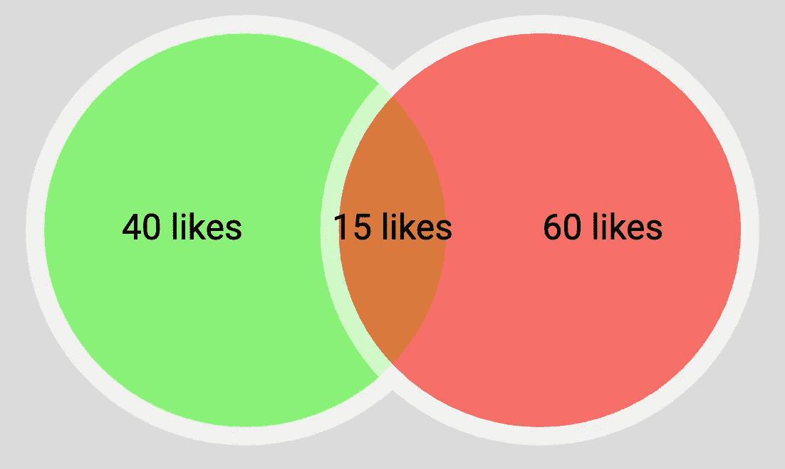
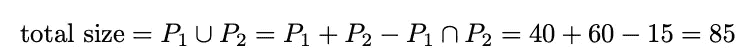
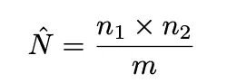
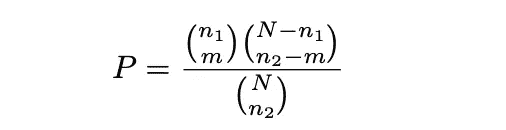
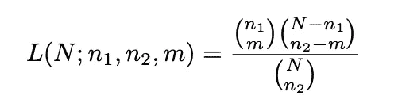
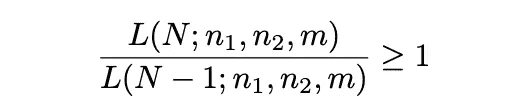
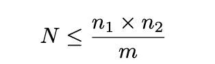
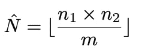
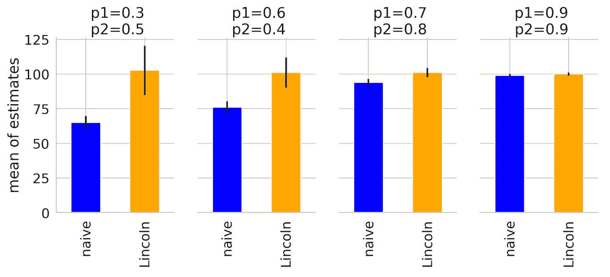
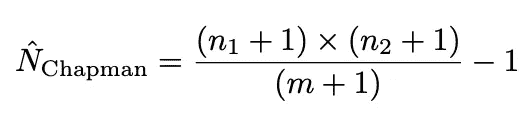

# 关于为什么你的 Instagram 帖子会如此少点赞的统计理论

> 原文：[`towardsdatascience.com/the-statistical-theory-behind-why-your-instagram-posts-have-so-few-likes-31f46d03448b`](https://towardsdatascience.com/the-statistical-theory-behind-why-your-instagram-posts-have-so-few-likes-31f46d03448b)

## *一个计算难以计数事物的实用技巧——从 Instagram 影响力，到企鹅数量以及北伦敦的曼城球迷*

 [Tuan Nguyen Doan](https://tuannguyen-doan.medium.com/?source=post_page-----31f46d03448b--------------------------------)

·发布于 [Towards Data Science](https://towardsdatascience.com/?source=post_page-----31f46d03448b--------------------------------) ·6 min read·2023 年 12 月 28 日

--

图片来源：[StockSnap](https://pixabay.com/users/stocksnap-894430/?utm_source=link-attribution&utm_medium=referral&utm_campaign=image&utm_content=2570925) 来自 [Pixabay](https://pixabay.com//?utm_source=link-attribution&utm_medium=referral&utm_campaign=image&utm_content=2570925)

我们都经历过……

带着希望的眼神，我们通过 iPhone 15 镜头框住了圣诞节的氛围，捕捉了晚餐桌上的每一刻，像艺术家一样执着，像诗人一样富有灵魂，每一张照片都是充满朋友的节日小插曲，火鸡的闪亮光泽和装饰品的闪烁。我们精心为每张照片配上振奋人心的标题，从我们思绪的丝线中编织而成，希望每一帖都能在 Instagram 繁忙的节日流量中引起共鸣。

尽管我们为向数字世界展示节日精神付出了如此多的努力，但我们的 Instagram 帖子仍仅获得 15 个点赞（如果算上 Facebook 上的交叉帖子，则为 20 个）

图片来源：[Gerd Altmann](https://pixabay.com/users/geralt-9301/?utm_source=link-attribution&utm_medium=referral&utm_campaign=image&utm_content=6038943) 来自 [Pixabay](https://pixabay.com//?utm_source=link-attribution&utm_medium=referral&utm_campaign=image&utm_content=6038943)

也许期望在仅有 300 个 Instagram 关注者的情况下出现社交媒体轰动是不现实的，但这些发自内心的圣诞节帖子肯定会让超过 5%的朋友做出反应，对吗？问题是，你的总关注者数与“真实观众规模”——那些*活跃的*并能看到你帖子的人——并不相同。你可能有很多关注者，但大多数人可能并不活跃，或者他们的关注图谱过于密集，以至于你的帖子实际上从未到达他们。

那么问题是，如何衡量你的真实社交媒体覆盖范围，你的互联网影响力？

## 林肯-彼得森指数——或者如何计算不可计数的事物

假设你在一个有 300 个关注者的私人账户上发布了一条 Instagram 帖子，并获得了 40 个点赞。你知道你的观众人数在 40 和 300 之间。如果你对自己制作 Instagram 帖子的能力有极大的信心，你可能会假设你的反应率为 100%，你的观众仅为 40 个用户，是 Instagram 限制了你的覆盖范围。

但也许你的照片看起来并不好，或者你可能没有你想象的那么机智。也许你确实达到了 300 个关注者，但你只能让其中 5%的人小心翼翼地给你虚拟的支持。单凭一篇帖子是无法知道的。但如果你有*两篇*帖子，即使你不知道每篇帖子有多吸引人，你也可以得到一个不错的估计。

假设你的第二篇帖子有 60 个点赞，而有 15 个互相点赞（喜欢这两篇帖子的人）。我们可以天真的利用老式的集合交集理论来计算真实的观众规模，但这是一种非常保守的估计，因为我们可能忽略了那些不喜欢这两篇 Instagram 帖子的用户。

图片由作者提供

幸运的是，有一种巧妙的方法叫做林肯指数，它允许我们估算总观众人数。设***n1, n2***分别为第一篇和第二篇帖子的点赞数，而***m***为同时喜欢这两篇帖子的用户数：

根据林肯指数，我们的估计覆盖范围是 40 x 60/15 = 160。请注意，这比 85 的天真估计要大得多，这为 Instagram 免除了压缩我们社交影响力的责任。

## 它在数学上是如何工作的？——或者你可以随意跳过的部分

让我们重新框定问题：我们要从***N***人中选择***n2***人来点赞第二篇帖子，其中正好有***m***人来自***n1***个点赞第一篇帖子的用户。显然，这种选择的概率是：

我们可以使用最大似然法来找到估计值***N***。对于数学爱好者，这里是证明的概要：

+   诀窍是与其尝试找到最大化似然函数的***N***：

+   我们找到满足不等式的最大𝑁：

+   经过一些算术运算后，这显然等同于：

+   因此，最大化似然函数的估计值***N_hat***为：

## 一次模拟

我知道并不是每个人都喜欢数学证明，所以我将通过一个小模拟来说服你。

假设我们知道我们的社交媒体覆盖率为 100，并且我们有 2 个 Instagram 帖子，其点赞概率分别为***p1***和***p2***。我们可以模拟不同的***p1***和***p2***场景，观察每个帖子的点赞数量，然后重新应用朴素方法和林肯方法，看看它们与 100（真实值）的距离。

我们可以看到，在不同的***p1***和***p2***值下，林肯估计保持***无偏***（10,000 次模拟的平均值接近真实人口 100），而 95%的置信区间随着***p1***和***p2***接近 1 而缩小。这是有道理的，即如果我们确信我们帖子上的点赞率接近 100%，我们应该对我们的观众规模估计相当有信心。不幸的是，朴素估计大大低估了我们的社交覆盖率。

图片来源于作者

## **像往常一样，所有好的统计方法都有一些警告：**

+   (1) 我们假设每个帖子之间，真实的受众规模不变。这对于普通的 Instagram 用户来说可能是对的，但如果你是一个拥有不断增长的粉丝基础的影响者，这可能不切实际。

+   (2) 我们还假设这两个帖子之间存在重叠的相互喜欢。我们的一些读者可能发现了我代码中的一个小漏洞：

尽管数学仍然有效，但在较小样本量下，估计变得相当粗略且有偏差。幸运的是，我们有一个很好的修改方法，称为查普曼估计，以解决这个问题：

那么这个计数方法有什么用呢？这种统计技术——估计任何一个人口规模，尤其是在不切实际地计数每个个体时，非常流行于生态学中，通常被称为**标记-重捕方法**。在科技公司中也常见到这种方法，例如在发布前估计视频游戏中的错误数量，或社交媒体平台中的政策违规内容数量。

我曾在一次面试中被挑战估计伦敦的曼城球迷数量。如果在特拉法加广场做一些抽样，采访人们并根据林肯估计进行数据分析，将会是一个有趣的周末活动。虽然我怀疑曼城球迷如此之少，你可能实际上可以数清楚他们！

如果你喜欢这篇文章，你可能也会喜欢我关于有趣的统计事实和经验法则的另一篇文章

+   [迪士尼电影说得对——我们都是特别的，从统计学上看也是如此](https://medium.com/towards-data-science/disney-movies-were-right-we-are-all-special-and-statistically-so-3bb56e79ab71)

+   优化生活的统计规则：林迪效应

+   三法则：计算尚未发生事件的概率

关于其他深入分析：

+   贝叶斯统计如何说服我去健身？

+   通过数据驱动的体育博彩策略赚取丰厚收益

+   疫情期间的爱情：一种概率论的约会方法

本项目的完整代码（包括模拟和图表）可以在我的[Github](https://github.com/tuangauss/DataScienceProjects/blob/master/Python/lincoln_estimate.py)中找到。
